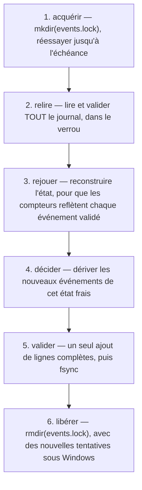

L'état de coordination de Gaia tient dans un seul fichier. Après l'échange de la [leçon 2](../02-six-verbs/), le répertoire de données contient exactement ceci :

```bash
ls -la "$GAIA_INTERAGENT_DATA_DIR"
```

```text
-rw-r--r-- 1 spare 197609 3617 Sep 15 19:41 events.jsonl
```

Pas de base de données, pas d'index, pas d'instantané, pas de second fichier. 3 617 octets de JSON délimité par des retours à la ligne constituent tout l'état durable d'une session de coordination à trois acteurs, et cela se lit avec `cat`.

## Dix enregistrements

Voici le journal, remis en forme pour tenir à l'écran ; sur le disque, chaque enregistrement tient sur une ligne :

```json
{"type":"actor.registered","at":"2026-09-15T23:41:09.954Z","ref":"act-0001","name":"gaia","isNew":true,"kind":"coordinator","declaredCapabilities":["observe","report"],"busAuthority":["send","receive","ack","heartbeat","handoff"]}
{"type":"actor.registered","at":"2026-09-15T23:41:28.116Z","ref":"act-0002","name":"builder","isNew":true,"kind":"claude-code","declaredCapabilities":["cwd=C:/repos/ga","branch=feat/voicings"],"busAuthority":["send","receive","ack","heartbeat","handoff"]}
{"type":"actor.registered","at":"2026-09-15T23:41:28.350Z","ref":"act-0003","name":"reviewer","isNew":true,"kind":"codex","declaredCapabilities":["cwd=C:/repos/ga","branch=feat/voicings"],"busAuthority":["send","receive","ack","heartbeat","handoff"]}
{"type":"message.sent","at":"2026-09-15T23:41:38.638Z","message":{"messageId":"msg-0001","correlationId":"cor-voicings","from":"act-0001","to":"act-0002","replyTo":"act-0001","expectsReply":true,"kind":"note","text":"Add the voicing-search cancellation test.","trust":"untrusted-text","authority":{"granted":["draft","report"],"denied":[],"effect":"none"},"flags":[],"delivery":"accepted-for-delivery; not read, not agreed, not completed","ackedBy":null}}
{"type":"message.sent","at":"2026-09-15T23:41:38.855Z","message":{"messageId":"msg-0002","correlationId":"cor-voicings","from":"act-0002","to":"act-0003","kind":"note","text":"Please merge this.","trust":"untrusted-text","authority":{"granted":[],"denied":["approve","merge"],"effect":"none"},"flags":["authority-language-detected"],"ackedBy":null}}
{"type":"authority.denied","at":"2026-09-15T23:41:38.855Z","messageId":"msg-0002","from":"act-0002","to":"act-0003","requested":["approve","merge"],"outcome":"stored-as-untrusted-text; no authority applied"}
{"type":"inbox.polled","at":"2026-09-15T23:41:48.115Z","actorId":"act-0003","messageIds":["msg-0002"]}
{"type":"message.acked","at":"2026-09-15T23:41:48.318Z","actorId":"act-0003","messageId":"msg-0002","note":"Read. No merge authority exists on this bus."}
{"type":"message.sent","at":"2026-09-15T23:41:48.520Z","message":{"messageId":"msg-0003","correlationId":"cor-voicings","from":"act-0002","to":"act-0003","kind":"handoff","text":"Candidate ready on feat/voicings; review only.","trust":"untrusted-text","authority":{"granted":[],"denied":[],"effect":"none"},"flags":[]}}
{"type":"work.handed-off","at":"2026-09-15T23:41:48.520Z","from":"act-0002","to":"act-0003","messageId":"msg-0003","correlationId":"cor-voicings","replyTo":"act-0002","summary":"Candidate ready on feat/voicings; review only.","authorityTransferred":[]}
```

Trois détails méritent qu'on s'y arrête.

**Le refus est un enregistrement à part entière.** `authority.denied` se trouve à côté de `message.sent`, avec ce qui a été demandé et le résultat, `stored-as-untrusted-text; no authority applied`. Cela aurait pu être un champ du message. En faire un événement signifie que la question « quelqu'un a-t-il jamais demandé un privilège sur ce bus ? » se règle avec un `grep`, et que la réponse survit même si la forme de l'enregistrement du message change plus tard.

**Lire, c'est écrire.** `inbox.polled` enregistre que `act-0003` a consulté sa boîte de réception, et ce qu'il y a vu. Ce n'est pas gratuit : une opération qui ressemble à une lecture coûte une prise de verrou et un ajout. En échange, on distingue « la voie n'a jamais regardé » de « la voie a regardé et n'a rien fait », et c'est la première chose qu'on veut savoir quand une passation semble avoir été ignorée.

**Les refus sont enregistrés eux aussi.** Pas dans ce journal-ci, mais dans le cas du nom ambigu de la leçon 2, l'événement ajouté était `command.rejected`. Un journal qui ne contient que les succès ne peut pas répondre à la question *qu'est-ce que cette session a tenté ?*, et c'est justement celle qu'on se pose quand quelque chose a mal tourné.

### Les deux compteurs

Les identifiants sont frappés à partir de l'état, et non d'une horloge ou d'une source aléatoire : `act-0001`, `msg-0001`, et des identifiants de corrélation issus d'un émetteur distinct. Comme ils sont dérivés de l'état rejoué, ils sont denses et monotones, et, c'est la partie qui a demandé un vrai travail, ils restent uniques d'un *processus* à l'autre, comme l'explique la section suivante.

## Le protocole de validation

Plusieurs processus serveurs peuvent partager un même répertoire de données. Il faut donc un protocole de validation, et `src/event-log.mjs` décrit celui de Gaia dans son propre en-tête :

> Le plus petit qui soit réellement atomique sous Windows est un *répertoire* de verrou : `mkdir` le crée ou échoue, sans fenêtre de lecture-modification-écriture. Pas de dépendance, pas de fcntl, pas de mutex nommé.

Le protocole complet compte six étapes :



Les étapes 2 à 4 sont les plus intéressantes. L'état sur lequel repose une décision est relu *dans* le verrou, à chaque fois, si bien qu'aucun identifiant n'est jamais attribué à partir d'un état périmé : c'est pour cela que deux processus ne frappent jamais le même `msg-0007`. L'étape 5 est un seul ajout de lignes complètes terminées par un retour à la ligne, suivi de `fsync`, si bien qu'un lecteur concurrent ne voit jamais un demi-enregistrement.

Si tu as déjà écrit une file d'attente sur fichiers sous Windows, tu comprendras pourquoi `mkdir` a été choisi. Un *fichier* de verrou exige une ouverture en création exclusive, puis un nettoyage soigneux ; les verrous consultatifs `fcntl` ne sont pas portables ; un mutex nommé n'est pas une option sans dépendance, et il meurt avec le processus qui le détient. `mkdir` sur un chemin qui existe échoue, de façon atomique, sur tous les systèmes de fichiers qui comptent. L'en-tête note même la subtilité propre à Windows : l'échec « déjà détenu » est `EEXIST` *ou* `EPERM`/`EACCES`.

### Pourquoi un verrou périmé est signalé et jamais cassé

C'est le meilleur argument court de tout le code, et il vaut bien au-delà de Gaia :

> Casser automatiquement un verrou périmé est un TOCTOU par construction : un processus en attente examine un vieux verrou, le propriétaire le libère, un troisième processus en acquiert un nouveau, puis le `rmSync` du processus en attente supprime ce nouveau verrou, ce qui produit exactement la situation à deux écrivains que le verrou existe pour empêcher. Revérifier le propriétaire ou la génération rétrécit la fenêtre, mais ne peut pas la fermer sans une comparaison-suppression atomique, que le système de fichiers n'offre pas. Ce produit échoue donc en fermant, et demande à un humain de regarder.

Un verrou vieux de plus de 60 secondes est *signalé* comme probablement abandonné. Il n'est jamais supprimé. Le prix à payer est un bus bloqué qui a besoin d'un humain ; l'alternative est un bus qui se corrompt de temps en temps, précisément dans les conditions où l'on veut le moins de surprises. Gaia choisit la première option, et le dit, au lieu de livrer un casseur de verrous périmés accompagné d'un commentaire affirmant que ça devrait aller.

Il existe une subtilité voisine au moment de la *libération*. Sous Windows, supprimer un répertoire que ce processus a créé et possède encore peut échouer de façon passagère : un antivirus ou l'indexeur le garde ouvert quelques millisecondes. Sans nouvelle tentative, la libération lève une exception, le verrou survit à son propriétaire, et tous les pairs échouent en fermant pour toujours. Le chemin de libération réessaie donc, jusqu'à 12 fois, à 25 millisecondes d'intervalle. L'en-tête prend soin de dire ce que cela change et ce que cela ne change pas : *« Ces nouvelles tentatives changent QUAND la libération par le propriétaire abandonne. Elles ne changent pas QUEL verrou est supprimé, et aucun chemin de code, nulle part, ne supprime un verrou qu'il ne possède pas. »*

### Le cœur pur

La logique de décision se trouve dans `src/bus-core.mjs`, qui n'a ni entrées-sorties, ni horloge, ni aléa. Chaque commande porte son propre horodatage, injecté en bordure par le serveur. C'est ce qui fait de `replay(events)` une fonction pure du journal, et c'est ce que vérifie `verify`.

L'en-tête énonce aussi le coût honnêtement, ce qui est plus rare qu'il ne le faudrait :

> Le coût, énoncé avec exactitude et sans optimisme : `apply` appelle `ageActors` à chaque événement, donc rejouer un journal est en O(événements × acteurs), pas en O(événements). Aucune projection, aucun index, aucun décalage de fin mis en cache n'est implémenté ici, et aucun n'est revendiqué.

Retiens cette complexité : dans la [leçon 5](../05-limits-and-ecosystem/), elle s'avère être la raison pour laquelle la limite est de quatre voies.

## Fermé en cas d'échec, et les trois codes de sortie

| Code | Signification |
|---|---|
| 0 | ok |
| 1 | la réponse était non : le bus a refusé, ou une commande en lecture seule a rendu un verdict de mauvaise santé |
| 2 | erreur d'utilisation |
| 3 | entrées-sorties fermées en cas d'échec : délai de verrou dépassé ou journal corrompu. **Rien n'a été écrit.** Aucune nouvelle tentative n'y changera rien. |

La distinction utile est celle entre 1 et 3, et le README en donne la raison : c'est *« la différence entre réessayer avec une meilleure adresse, et s'arrêter pour aller chercher un humain »*.

Un script qui enveloppe une voie d'agent peut agir en conséquence. Le code 1 signifie que l'appel était assez bien formé pour recevoir une réponse, et que la réponse était non : corrige l'adresse, ou accepte le refus. Le code 3 signifie que le bus n'a même pas pu établir la vérité, donc réessayer avec d'autres arguments n'a aucun sens. La plupart des outils en ligne de commande confondent les deux sous le code 1, et alors chaque script d'enveloppe réessaie ce qui ne doit pas l'être.

Tout, dans la couche d'entrées-sorties, échoue en fermant de la même manière : *« Un verrou impossible à acquérir, une ligne qui n'est pas du JSON valide, un enregistrement sans son `type`, ou un fichier dont la dernière ligne est tronquée lèvent tous une exception, plutôt que de tronquer, sauter ou réinitialiser le journal. Un journal corrompu est une situation à signaler, jamais à réparer en silence. »*

Un journal endommagé est conservé pour le diagnostic. C'est l'inverse de ce que fait la plupart du code qui gère des journaux, et la raison en est que les octets endommagés sont la seule preuve de la façon dont le journal a été endommagé.

### `doctor` sort avec 1 sur un journal qui se rejoue mais n'est pas sain

`doctor` n'écrit rien, et son code de sortie est son verdict. Il sort avec 1, et non 0, quand le répertoire se rejoue mais n'est pas cohérent en interne, pour l'une de deux raisons :

- le journal contient une **adresse que ce bus n'a jamais frappée**, ce qui signifie qu'un `act-NNNN` falsifié a atteint le fichier ;
- il **reste à l'émetteur de corrélation moins d'une fenêtre de revendication de marge**.

La seconde est l'empreinte d'un journal empoisonné par une version antérieure au correctif. L'émetteur frappe les identifiants de corrélation dans une plage ; une version qui les consommait mal laisse l'émission automatique morte, ou à une revendication de la mort. Comme le journal est en ajout seul et que rien ne le répare, rétablir l'émission automatique exige un **nouveau répertoire de données**. Dans le journal sain de la leçon 2, la vérification correspondante indique :

```text
ok   the correlation issuer still has room to mint  —  the issuer is at 0 with 9007199254740991 ids of runway left
```

C'est `Number.MAX_SAFE_INTEGER`. Le seuil de santé est d'un million d'identifiants restants, donc un bus neuf en est très loin.

## `verify` : 37 vérifications, et deux régimes

```bash
node scripts/gaia-interagent.mjs verify --pretty
```

```json
{
  "ok": true,
  "command": "verify",
  "evidenceOk": true,
  "evidenceGatesResult": false,
  "passed": 37,
  "failed": 0
}
```

Les vérifications se répartissent en huit sections : `manifest`, `transport`, `templates`, `lanes`, `startup-timeout`, `ecosystem`, `tool-surface`, `evidence`. Certaines portent sur le *produit* plutôt que sur le journal, par exemple :

```text
ok   no network listener, no shell-command transport in shipped sources  —  105 source files scanned
ok   .mcp.json has no absolute developer path                            —  ["./src/mcp-server.mjs"]
ok   generated-config templates contain no absolute developer path       —  placeholders only
```

La première est une affirmation que le README fait dès sa première page, pas d'écoute réseau et pas de transport par commandes shell, transformée en vérification sur les sources livrées, pour que l'affirmation ne puisse pas cesser d'être vraie sans bruit.

### La séparation qui rend `verify` honnête

C'est dans la section `evidence` que se trouve la décision de conception intéressante. Ses vérifications se rangent en exactement deux classes, et l'appartenance se décide par une seule question : **cette vérification est-elle légitimement fausse sur un espace de travail correct et vide ?**

**Autorité et intégrité : elles bloquent à chaque exécution.** Aucune ne pose une question à laquelle un espace de travail correct et vide répondrait mal :

```text
ok   replayable                                                    —  10 events
ok   deterministic replay                                          —  replay(events) == replay(events)
ok   no handoff transferred authority                              —  authorityTransferred is [] on every handoff
ok   no message was granted a privileged authority                 —  grants stay inside the allowlist
ok   every body is labelled untrusted-text                         —  3 messages
ok   every address in the log belongs to an actor this bus minted  —  3 actors, all minted
ok   every correlation id is inside the issuer range               —  1 threads, all within range
ok   the correlation issuer still has room to mint                 —  … 9007199254740991 ids of runway left
ok   every actor.registered carries the frozen busAuthority        —  3 registrations, all ["ack","handoff","heartbeat","receive","send"]
```

**Richesse des preuves : consultatives par défaut.** Elles demandent *ce journal est-il un véritable échange entre plusieurs parties ?*, et un espace de travail neuf n'en est légitimement pas un :

```text
ok   at least three actors                              —  3 actors
ok   more than one actor kind                           —  kinds: coordinator, claude-code, codex
ok   a correlated thread of three or more messages      —  widest thread cor-voicings has 3 messages
ok   at least one acknowledgement                       —  1 acked
ok   at least one handoff                               —  1 handoffs
```

Les cinq passent ici parce que la leçon 2 a construit exprès un véritable échange à trois parties. Sur un bus neuf, elles seraient toutes rouges, et `verify` sortirait quand même avec **0**, en les affichant. `evidenceGatesResult: false` dans la charge utile est l'indicateur qui dit dans quel régime l'exécution s'est faite. Affirme que le journal *est* une preuve, avec `--evidence <path>` ou `--require-evidence`, et les cinq deviennent bloquantes à leur tour.

C'est l'idée des quatre axes de la [leçon 1](../01-the-problem/), implémentée dans un outil en ligne de commande. « Ce bus est-il correctement implémenté ? » et « ce journal vaut-il d'être cité comme preuve ? » sont deux questions différentes, et un outil qui y répondrait avec un seul code de sortie devrait fausser l'une des deux. Consultatif signifie ici *signalé, jamais caché* : les vérifications rouges sont affichées dans les deux cas.

### Le vérificateur se vérifie lui-même

Trois vérifications bloquent toujours, dans les deux régimes :

```text
ok   negative control: a synthetic single-actor log is rejected  —  at least three actors; more than one actor kind; …
ok   negative control: a widened busAuthority is rejected        —  every actor.registered carries the frozen busAuthority
ok   negative control: a tampered handoff is rejected            —  no handoff transferred authority
```

Chacune construit un journal qui *devrait* échouer, et échoue si ce journal passe. Le raisonnement est dans le README, en une phrase : *un vérificateur qui ne peut pas échouer ne prouve rien.*

C'est **SCI-02**, de la leçon 1, appliqué à une suite de tests plutôt qu'à une expérience. La suite complète suit la même démarche à grande échelle ; à la révision étudiée, `node --test` rapporte :

```text
ℹ tests 2075
ℹ suites 0
ℹ pass 2074
ℹ fail 0
ℹ cancelled 0
ℹ skipped 1
ℹ todo 0
ℹ duration_ms 38927.12
```

et beaucoup de ces noms commencent par `NEGATIVE CONTROL:`, y compris des tests comme *« une panne d'infrastructure est relancée, jamais blanchie en exécution bloquée »*, un test dont le seul rôle est de prouver qu'une catégorie d'erreur ne peut pas être discrètement rétrogradée en une erreur plus présentable.

### `verify` en demande plus que `doctor`

Les deux ne se contredisent jamais ; `verify` pose simplement plus de questions. Il sort avec 1 dans les deux situations sur lesquelles `doctor` bloque, et aussi pour les sept autres lignes d'autorité que `doctor` n'inspecte pas du tout. Un journal dont une passation a transféré `approve` fait donc sortir `verify` avec 1 et laisse `doctor` à 0.

Cela n'a pas toujours été vrai, et le README explique pourquoi cela a changé : auparavant, les deux sortaient avec 0 sur un tel journal, *alors même que `verify` affichait sa propre vérification rouge disant le contraire*, et un lecteur qui se fiait au code de sortie, ou à `ok`, y voyait un succès. Un outil qui affiche un échec et renvoie un succès a produit une réponse rassurante là où il aurait dû refuser : c'est exactement le mode de défaillance de la [leçon 1](../01-the-problem/), à l'intérieur du vérificateur.

## Exercices

1. Ton script d'enveloppe en CI lance une commande du bus et obtient le code de sortie 3. Il réessaie trois fois avec un délai croissant, puis signale un test instable. Qu'est-ce qui ne va pas dans ce script ?

<details>
<summary>Solution</summary>

Le code 3 signifie fermé en cas d'échec : un délai de verrou dépassé ou un journal corrompu, sans rien d'écrit. « Aucune nouvelle tentative n'y changera rien » fait partie du contrat. S'il s'agit d'un délai de verrou dépassé, réessayer revient au mieux à attendre, et si le verrou est périmé, il ne disparaîtra jamais de lui-même, puisque Gaia n'en casse jamais. Si le journal est corrompu, chaque tentative relit les mêmes octets endommagés.

Le script devrait faire la distinction : ne rien réessayer, et faire remonter le code 3, puisque c'est précisément celui qui signifie *s'arrêter pour aller chercher un humain*. Le qualifier d'instable est pire qu'inutile : cela range une panne durable et diagnosticable dans le bruit, et ensuite quelqu'un augmente le nombre de tentatives.

</details>

2. Pourquoi le protocole de validation relit-il et rejoue-t-il tout le journal dans le verrou, au lieu de garder l'état en mémoire entre deux appels et d'y ajouter ?

<details>
<summary>Solution</summary>

Pour être correct d'un processus à l'autre. Plusieurs processus serveurs peuvent partager un même répertoire de données, donc un état mis en cache dans ce processus est périmé dès qu'un autre processus valide quelque chose ; et les identifiants sont frappés à partir des compteurs rejoués, si bien que deux processus décidant chacun à partir de leur propre cache frapperaient tous deux `msg-0007`. C'est la relecture dans le verrou qui rend les étapes 2 à 4 sûres.

Le prix est énoncé plutôt que caché : le rejeu est en O(événements × acteurs) et le journal n'est jamais compacté, donc chaque appel coûte plus cher à mesure que le journal grandit. La [leçon 5](../05-limits-and-ecosystem/) montre ce coût fixer le nombre de voies prises en charge, et nomme le chemin de lecture à coût borné, un décalage de fin mis en cache ou un instantané suivi de la fin du journal, comme un changement de conception délibérément pas encore fait.

</details>

3. Un collègue propose que `inbox` n'écrive pas d'événement, puisque « une lecture ne devrait pas modifier l'état », et que cela diviserait par deux le nombre de prises de verrou dans une boucle d'interrogation. Défends les deux positions.

<details>
<summary>Solution</summary>

Pour : c'est une lecture ; l'écriture coûte une prise de verrou et un ajout ; une voie qui interroge toutes les quelques secondes gonfle le journal, et comme le rejeu est en O(événements × acteurs), un journal gonflé ralentit chaque appel ultérieur. C'est un coût réel, sur l'axe même qui borne déjà le nombre de voies.

Contre : `inbox.polled` est la seule distinction durable entre « la voie n'a jamais regardé » et « la voie a regardé et n'a rien fait ». La perdre, c'est rendre identiques, après coup, une passation ignorée et une passation jamais remise ; or c'est exactement la question d'enquête à laquelle le journal existe pour répondre.

Une solution raisonnable garde l'enregistrement mais arrête l'interrogation périodique : une voie qui interroge sur minuterie produit des preuves au sujet de sa minuterie. Note que « ajouter un chemin de lecture bon marché qui saute le verrou » ne fait pas partie des options : c'est le verrou qui garantit que la lecture voit un journal complet plutôt qu'un enregistrement à moitié écrit.

</details>

4. `verify` affiche cinq vérifications de preuves rouges sur un bus neuf et sort avec 0. Est-ce un bogue ? Que faudrait-il pour que ces cinq-là deviennent bloquantes ?

<details>
<summary>Solution</summary>

Ce n'est pas un bogue : c'est la séparation en deux régimes. « Ce bus est-il correctement implémenté ? » est vrai pour un espace de travail neuf ; « ce journal est-il un véritable échange entre plusieurs parties ? » y est légitimement faux. Rendre la seconde classe bloquante par défaut ferait échouer tout espace de travail correct et vide, et une vérification qu'un système correct fait échouer est une vérification qu'on apprend à ignorer.

Elles bloquent quand l'appelant affirme que le journal *est* une preuve, avec `--evidence <path>` ou `--require-evidence` ; `evidenceGatesResult` dans la charge utile indique quel régime a tourné. C'est la bonne charnière : c'est l'affirmation, et non l'outil, qui relève la barre. Le test de fumée de l'usine, dans la [leçon 4](../04-factory-and-receipts/), fait exactement cette affirmation à propos de son propre journal, et son rapport affiche `evidenceGatesResult: true`.

</details>

## Sources

- Gaia : [`src/event-log.mjs`](https://github.com/GuitarAlchemist/gaia/blob/d68e90099ae2a6fbbec9d428617bfcd02095aac0/src/event-log.mjs), [`src/bus-core.mjs`](https://github.com/GuitarAlchemist/gaia/blob/d68e90099ae2a6fbbec9d428617bfcd02095aac0/src/bus-core.mjs), [`README.md`](https://github.com/GuitarAlchemist/gaia/blob/d68e90099ae2a6fbbec9d428617bfcd02095aac0/README.md), [reprise après un plantage](https://github.com/GuitarAlchemist/gaia/blob/d68e90099ae2a6fbbec9d428617bfcd02095aac0/docs/crash-recovery.md)
- Node.js : [l'exécuteur de tests `node:test`](https://nodejs.org/api/test.html), [`fs.appendFileSync`](https://nodejs.org/api/fs.html#fsappendfilesyncpath-data-options), [`fs.fsyncSync`](https://nodejs.org/api/fs.html#fsfsyncsyncfd)
- [Time-of-check to time-of-use](https://en.wikipedia.org/wiki/Time-of-check_to_time-of-use) : la situation de concurrence sur laquelle repose l'argument du verrou périmé
