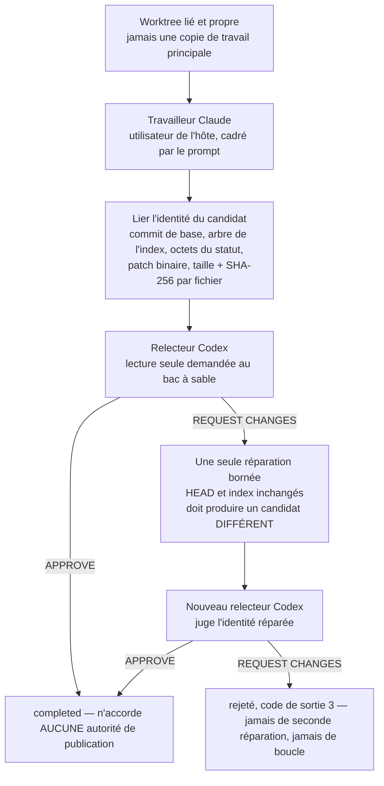

Le bus transporte des messages. C'est nécessaire, mais pas suffisant : à un moment, un agent doit modifier un fichier, un autre doit juger la modification, et quelqu'un doit décider si elle peut être publiée. Cette leçon porte sur ce chemin, et sur ce que vaut réellement l'artefact qu'il produit.

Gaia le construit en deux couches, et la séparation est délibérée. La première prouve le plan de contrôle sans aucun modèle dans la boucle. La seconde ajoute de vrais agents.

## Le traceur de coordination

```bash
npm run factory:smoke -- \
  --data-dir ./state/factory-smoke \
  --artifact ./README.md \
  --out ./state/factory-smoke-report.json \
  --task "Review this candidate"
```

Il enregistre un coordinateur, un constructeur et un relecteur ; envoie trois messages corrélés et en accuse réception ; enregistre une passation sans aucune autorité ; et échoue si la barrière de preuves ne passe pas. Voici le rapport qu'il a écrit, abrégé :

```json
{
  "ok": true,
  "status": "completed",
  "command": "factory-smoke",
  "execution": "coordination-tracer; no code execution",
  "artifact": {
    "path": "…\\gaia-pin\\README.md",
    "bytes": 71590,
    "sha256": "dc1a34bcbde334ad93e8d8df8effd8fade13f96b4a0d4babc643b62e36403225"
  },
  "task": "Review this candidate",
  "actors": { "coordinator": "act-0001", "builder": "act-0002", "reviewer": "act-0003" },
  "messages": ["msg-0001", "msg-0002", "msg-0004"],
  "acknowledgements": [
    { "messageId": "msg-0001", "ackedBy": "act-0002", "meaning": "receipt only; not agreement, approval, or completion" },
    { "messageId": "msg-0002", "ackedBy": "act-0001", "meaning": "receipt only; not agreement, approval, or completion" },
    { "messageId": "msg-0004", "ackedBy": "act-0001", "meaning": "receipt only; not agreement, approval, or completion" }
  ],
  "handoff": { "messageId": "msg-0003", "correlationId": "cor-0001", "authorityTransferred": [] },
  "evidenceLog": {
    "format": "gaia-event-log-fixed-point/1",
    "pathRole": "data-dir/events.jsonl",
    "bytes": 6315,
    "events": 15,
    "sha256": "256a51d27fd7920e3d871e486dbdf3e5a67489a115bb1f1216dc5a04033ec85a"
  },
  "verification": { "ok": true, "evidenceOk": true, "evidenceGatesResult": true },
  "toolSurface": ["ack", "handoff", "heartbeat", "inbox", "register", "send"]
}
```

Trois champs portent toute l'idée.

`execution: "coordination-tracer; no code execution"`, c'est le rapport qui te dit ce qu'il n'est pas. Il n'a lancé aucun modèle et n'a exécuté aucun code du dépôt. Il prouve le chemin du *plan de contrôle* de l'usine, c'est-à-dire qu'un cycle à trois rôles peut aller au bout, être vérifié et être rejoué, et il ne prouve délibérément rien sur la qualité ou la provenance d'une modification produite par une IA. Un traceur qui laisserait entendre davantage sans le dire tomberait dans le raccourci du « prototype accepté comme intégration » de la [leçon 1](../01-the-problem/).

`evidenceLog` est un **point fixe** : les octets exacts du journal, leur nombre et leur SHA-256. Quiconque reçoit ce rapport peut recalculer cette empreinte à partir du journal et confirmer qu'il lit le même historique de coordination. Sans elle, « l'exécution a réussi » n'est qu'une phrase dans un fichier JSON.

`evidenceGatesResult: true`, c'est l'affirmation de la [leçon 3](../03-event-log-and-replay/), faite délibérément. Le test de fumée affirme que son journal *est* une preuve, donc les cinq vérifications de richesse bloquent au lieu de simplement signaler. Lance-le, et l'exécution échoue si l'échange n'a pas réellement impliqué plusieurs parties.

Remarque aussi `toolSurface`, dans le reçu lui-même. L'artefact enregistre l'ensemble complet des verbes qui existaient au moment où il a été produit, si bien qu'un lecteur, dans un an, n'aura pas à croire sur parole que le code du jour a toujours les mêmes six.

## La véritable usine à agents

Passons à la couche qui contient des modèles. Une seule commande crée un candidat avec un vrai travailleur Claude, et le fait juger par un vrai relecteur Codex :

```bash
npm run factory:agent -- \
  --worktree ../my-project-gaia-run \
  --task "Implement the bounded change and its focused tests" \
  --out ../state/gaia-agent-run.json \
  --timeout-ms 600000
```

:::caution[Non exécuté pour cette leçon]
Cette commande consomme un vrai tour de Claude et un vrai tour de Codex sur les abonnements installés. Tout ce qui suit est lu dans `src/factory-agent.mjs`, dans [son document de conception](https://github.com/GuitarAlchemist/gaia/blob/d68e90099ae2a6fbbec9d428617bfcd02095aac0/docs/factory-agent-design.md) et dans le schéma du reçu : c'est *à vérifier* sur une exécution réelle, et le journal le dit.
:::

### La forme, et pourquoi elle a cette forme

Le document de conception consigne trois interfaces candidates avant l'implémentation : c'est [Design It Twice](../01-the-problem/), appliqué à une jointure porteuse.

| Conception | Pourquoi pas, ou pourquoi |
|---|---|
| Un script Claude monolithique | Le plus petit diff initial, mais les options du fournisseur, l'isolation Git, les preuves et l'analyse du verdict deviennent inséparables |
| Un exécuteur de commandes arbitraires | Souple en apparence, mais il expose une interface superficielle en forme de shell, et fait de l'autorité, de l'échappement des arguments et de l'identité du fournisseur des *affirmations de l'appelant* |
| Un cœur indépendant du fournisseur, avec des profils de fournisseur **fermés** | Retenu : le cœur possède l'isolation du worktree, l'identité du candidat, la non-modification pendant la relecture, une réparation bornée et la sémantique du reçu ; de petits adaptateurs possèdent les invocations exactes de Claude et de Codex |

L'expression à retenir est *profils de fournisseur fermés*. Les profils de la v1 ne sont délibérément pas extensibles, et le document explique pourquoi : c'est « volontairement fermé, plutôt que de prétendre que des commandes arbitraires sont des fournisseurs sûrs ». Un point d'extension ici aurait mis la frontière d'autorité entre les mains de l'appelant, et c'est là qu'elle cesse d'être une frontière.

### Le cycle



Plusieurs de ces cases sont des refus porteurs plutôt que des étapes.

**Un worktree lié et propre, jamais une copie de travail principale.** Une copie de travail principale, ou principale de sous-module, est refusée, tout comme un état d'entrée modifié. Le candidat est donc toujours une arborescence isolée, et « qu'est-ce qui a changé ? » est une question qui a une réponse exacte.

**L'identité du candidat est liée avant la relecture.** Le commit de base, l'arbre de l'index, les octets de `git status`, le patch binaire, et la taille et le SHA-256 de chaque fichier modifié ou supprimé. Un `HEAD` ou un index final du travailleur qui ne correspond pas est refusé : un travailleur qui a commité, ou qui a bricolé l'index, n'obtient donc pas de reçu affirmant qu'il a produit un candidat propre.

**Le relecteur ne doit rien modifier.** Gaia lie **l'arborescence complète du worktree, fichiers ignorés compris**, avant la relecture, et refuse si cette arborescence, `HEAD`, l'index ou l'identité du candidat ont changé pendant celle-ci. Inclure les fichiers ignorés est le détail qui rend cela réel : sinon, un relecteur qui déposerait un artefact dans `node_modules` ou une configuration locale dans l'arborescence passerait inaperçu, et « le relecteur a approuvé une arborescence » serait une affirmation sur une arborescence qui n'existe plus.

**Une seule réparation, et elle doit vraiment réparer.** Un `REQUEST_CHANGES` ne devient pas un succès et ne lance pas de boucle. Un seul adaptateur de réparation reçoit l'identité exacte du candidat et la sortie exacte du relecteur ; il doit laisser `HEAD` et l'index inchangés, et doit produire une identité de candidat **différente et non vide**. Une réparation annoncée qui laisse le candidat inchangé échoue avec une erreur typée, au lieu de repartir en relecture. Ensuite, un *nouveau* relecteur juge l'identité réparée, et son verdict fait foi. Un second rejet termine l'exécution avec le code de sortie 3 et ne peut jamais déclencher une autre réparation.

Cette dernière contrainte vise l'anti-modèle contre lequel cette conception a été bâtie : la boucle d'agent qui réécrit encore et encore jusqu'à ce qu'un relecteur se lasse. La borner à une seule réparation, c'est ce qui fait du résultat un fait, et non une fonction de la patience.

### Le reçu, et ce qu'il refuse d'affirmer

Un reçu lie le commit de base, les empreintes du statut et du patch binaire, la taille et le SHA-256 de chaque fichier modifié, des preuves locales adressées par contenu pour chaque sortie bornée d'agent, la frontière d'autorité demandée et observée, et les deux verdicts de relecture quand une réparation a eu lieu. Les sorties brutes des modèles sont traitées comme des preuves locales sensibles : elles ne sont **jamais intégrées au reçu public**, mais leurs chemins exacts, leurs tailles et leurs identités SHA-256 y sont liés, et rejoués après la persistance.

Puis le document de conception énonce ce qu'il ne prouve pas. Ce paragraphe est le plus précieux de tout le dépôt :

> Le travailleur qui tourne sous l'utilisateur de l'hôte reste un résidu déclaré. Une politique de prompt, plus une observation après coup du worktree, ne peuvent pas prouver qu'il a évité le réseau, les secrets, les installations ou les écritures ailleurs. Elles ne peuvent pas non plus prouver l'absence d'une action Git passagère, si le travailleur restaure exactement le HEAD et l'index observés avant de rendre la main. Tout futur reçu qui revendiquerait un véritable confinement de l'espace de travail, ou une attestation des actions passées, aura besoin d'une frontière de capacité distincte, au niveau du système d'exploitation ou d'un conteneur, et d'une nouvelle barrière de preuves.

Claude tourne sous l'utilisateur de l'hôte. Lui dire de rester dans le worktree, c'est un prompt, et un prompt n'est pas un confinement ; le document refuse de l'appeler ainsi : *« Ce n'est délibérément **pas** appelé confinement par le système d'exploitation : le contournement des permissions peut atteindre tout ce que l'utilisateur de l'hôte peut atteindre, alors que Gaia n'observe que le worktree du candidat et les contrôles Git. »*

Compare avec ce que donneraient ces deux phrases dans une note de version ordinaire. « Exécute les agents dans un espace de travail isolé », voilà ce qu'écriraient la plupart des outils. Gaia écrit noir sur blanc l'écart exact entre ce qu'il observe et ce qu'il peut attester, et nomme la frontière de capacité qui le comblerait. Encore les quatre axes : l'*acceptation* est réelle ici, le *confinement* n'est pas prouvé, et les confondre serait mentir.

### Critères de réfutation

La conception énumère les conditions qui rejetteraient purement et simplement cette jointure. Pas des « points à surveiller », mais des conditions sous lesquelles la conception est fausse :

- une copie de travail principale, principale de sous-module ou modifiée peut s'exécuter ;
- un alias physique place le reçu ou les preuves à l'intérieur du candidat ;
- le `HEAD` ou l'arbre de l'index observés à la fin diffèrent de leur valeur d'entrée ;
- une modification ignorée faite par le relecteur est acceptée ;
- un verdict de rejet sort comme un succès ;
- une surcharge d'API ou de routage cloud atteint un profil d'abonnement ;
- un processus enfant terminé continue de tourner ;
- un seul `REQUEST_CHANGES` provoque deux réparations, ou un second rejet lance une boucle.

Écrire les critères de réfutation avant l'implémentation, c'est **SCI-01**, de la [leçon 1](../01-the-problem/). Leur valeur pratique, c'est qu'ils forment un plan de test que quelqu'un d'autre peut exécuter sans demander à l'auteur ce que « terminé » voulait dire.

### Hygiène des fournisseurs

Chaque profil de fournisseur reçoit une **liste blanche minimale de variables d'environnement du système**. Les clés d'API, les surcharges de jeton d'authentification, les options de routage cloud, les points de terminaison personnalisés et les secrets de l'hôte sans rapport ne sont pas hérités ; ce sont donc les connexions aux abonnements installés, dans leurs emplacements habituels du profil utilisateur, qui sont utilisées. Les deux fournisseurs sont lancés **sans shell** : sous Windows, Gaia résout l'exécutable natif de Claude et invoque directement le point d'entrée JavaScript du paquet npm de Codex, au lieu d'interpoler un prompt à travers `cmd.exe`. C'est toute la différence entre un argument et une ligne de commande dans laquelle quelqu'un peut injecter quelque chose.

La sortie est bornée et chaque invocation a une échéance ; l'arrêt couvre toute l'arborescence de processus, s'intensifie après un délai de grâce, et ne signale l'échec qu'une fois le processus enfant fermé.

### Une progression qu'on peut suivre, et qui n'est pas une estimation

Pendant qu'une exécution est active, `stderr` affiche une progression lisible et expurgée : validation, début et fin du travailleur, début et verdict de chaque relecture, réparation éventuelle, issue finale, rafraîchie toutes les 10 secondes. `stdout` reste exactement le JSON final. Chaque ligne indique le temps écoulé et une *borne supérieure du temps de fournisseur restant*, calculée comme le délai de l'appelant multiplié par le nombre maximal d'invocations de fournisseur encore atteignables, et étiquetée :

```text
(not an ETA)
```

L'inspection Git locale, la persistance des preuves et les entrées-sorties du reçu ne reçoivent délibérément aucune échéance fictive. C'est un petit détail qui en dit long : une barre de progression est une prédiction, les prédictions sur un travail de modèle ouvert ne reposent sur aucune preuve, donc ce qui s'affiche est une borne qui, elle, repose sur des preuves, avec une étiquette qui dit de quoi il s'agit.

Le texte de la tâche, les chemins, les secrets et la sortie des fournisseurs n'entrent jamais dans la progression ni dans la télémétrie. L'export OpenTelemetry optionnel n'accepte que des adresses HTTP de bouclage local, si bien que l'option ne peut pas servir à atteindre un service hébergé ou facturé, et les échecs d'export sont avalés exprès : *l'observation ne doit jamais changer l'issue de l'exécution ni l'autorité*.

## Lier une arborescence à un nombre

Les relectures d'un candidat doivent nommer leur objet. Gaia fournit pour cela une empreinte d'arborescence :

```bash
node scripts/inventory-digest.mjs
```

```text
format=inventory-digest/1
root=…\scratchpad\gaia-pin
count=323
bytes=5937493
digest=ordinal-path-bytes-sha256/1 dccabe8f82fdced3240fef1ea9fb3f289daff950fa36b4ec6c06296df4132dbb
```

**L'empreinte n'est jamais affichée sans la recette à côté.** `inventory-digest/1` est le contrat de sortie et `ordinal-path-bytes-sha256/1` la recette de hachage, parce que, comme le dit le README, une chaîne hexadécimale nue « est exactement ce qu'on copie dans une relecture et qu'on ne peut plus reproduire ensuite ».

La recette, exactement : parcourir chaque fichier ordinaire, en sautant `.git` et `node_modules` à toute profondeur ; pour chaque fichier, émettre `relative/path|byte-count|file-sha256`, avec les séparateurs réécrits en `/` ; trier par chemin en ordre **ordinal**, par unité de code UTF-16, jamais avec `localeCompare` et jamais sans tenir compte de la casse ; joindre avec LF, sans LF final ; calculer le SHA-256 de l'encodage UTF-8 de ce document.

Deux conséquences méritent d'être intériorisées, parce qu'elles mordent dans n'importe quel schéma d'adressage par contenu :

- **Des octets bruts, jamais du texte décodé.** Une copie de travail en CRLF et une copie en LF des mêmes sources sont deux arborescences différentes, avec des empreintes différentes. Gaia épingle `* -text` dans `.gitattributes`, pour qu'une copie propre sur n'importe quel hôte reproduise les octets qui ont été hachés, et garde délibérément dans l'arborescence des fichiers des deux régimes de fins de ligne, pour que cet épinglage soit porteur et testable plutôt que théorique.
- **Une entrée qui n'est ni un fichier ordinaire ni un répertoire est refusée nommément**, et non sautée. Un lien symbolique, une jonction ou un nœud de périphérique arrête la commande, parce que les sauter en silence produirait le point fixe d'une arborescence qui n'est pas celle du disque.

Et la commande n'écrira pas à l'intérieur de l'arborescence qu'elle mesure : un `--manifest <path>` qui pointe à l'intérieur de `--root` est refusé, en se fondant sur l'identité dans le système de fichiers, si bien qu'un alias 8.3, une jonction ou une écriture UNC ne peut pas contourner la règle. Le README refuse de publier l'empreinte de sa propre arborescence pour la même raison : la modification qui la publierait l'invaliderait.

## Le seul chemin vers un effet privilégié

Un `APPROVE` de l'usine **n'accorde aucune autorité de publication**. Alors, qu'est-ce qui en accorde une ?

Un humain muni d'une clé. Un opérateur génère une fois une paire de clés Ed25519 dédiée et chiffrée, puis autorise exactement une exécution, sur une révision épinglée. Avant de dépenser quoi que ce soit, `run` relit GitHub, matérialise l'unique intention `AWAITING_AUTHORITY`, affiche chacun de ses champs issus de GitHub à travers un contrôle qui **retire les caractères de contrôle du terminal et les caractères bidirectionnels** et borne la ligne, puis exige que l'opérateur tape la révision complète de cette intention.

Alors seulement, elle lit la clé chiffrée, génère en mémoire une autorisation de courte durée, la dépense exactement une fois, et exécute. La phrase de passe vient d'une boîte de dialogue masquée sous Windows, ou d'un lecteur de terminal masqué ailleurs : *« Aucune option, aucune variable d'environnement, aucun fichier ne fournit l'une ou l'autre. Une session qui pilote ce processus par un tube ne peut rien autoriser. »*

Lis cette dernière phrase comme une affirmation sur les agents. Un agent qui orchestre ce processus ne peut pas autoriser une publication, *par construction*, parce que le seul canal d'entrée qui fonctionne est un terminal interactif. C'est la même idée que pour les six verbes, l'absence plutôt qu'une vérification, appliquée une couche plus haut.

Deux autres détails dans le même esprit. Le chemin du reçu est réservé **avant** que l'autorité soit dépensée, et tout chemin qui revient après cette réservation y laisse un reçu expurgé, y compris quand on abandonne l'invite, ce qui est « un refus qui se nomme lui-même et sort avec 1, jamais un succès silencieux ». Et l'adaptateur autorisé ne permet que le commit, un push explicite avec bail, et la création d'une pull request : il n'a **aucune capacité de fusion**. Une pull request peut contenir `Closes #N`, sur lequel GitHub n'agit qu'après une fusion distincte, elle-même autorisée.

## À retenir

- Le traceur de coordination prouve le plan de contrôle sans aucun modèle dans la boucle, et son rapport le dit ; il lie les octets exacts du journal, son nombre d'événements et son SHA-256 comme point fixe.
- L'usine à agents lance un seul travailleur Claude dans un worktree lié propre, lie l'identité du candidat avant la revue, refuse un relecteur qui a modifié l'arborescence, fichiers ignorés compris, et permet au plus une réparation, qui doit changer le candidat.
- Un `APPROVE` n'accorde aucune autorité de publication, et le document de conception nomme ce qu'il ne peut pas prouver : un travailleur qui tourne sous l'utilisateur hôte n'est pas confiné.
- Une empreinte n'est jamais affichée sans sa recette. Ce sont les octets bruts qui sont hachés, donc un checkout CRLF et un checkout LF diffèrent, et une entrée qui n'est ni un fichier ni un répertoire est refusée nommément.
- Le seul chemin vers un effet privilégié est un humain qui tape la révision complète de l'intention et saisit une phrase secrète de façon interactive, jamais par une option, une variable ou un fichier, pour une autorisation à usage unique dont l'adaptateur ne sait pas fusionner.

## Exercices

1. L'usine renvoie `APPROVE` et un reçu qui lie le SHA-256 de chaque fichier modifié. Un collègue le lit comme « la modification est correcte et peut être fusionnée ». Énumère tout ce qui ne va pas dans cette lecture.

<details>
<summary>Solution</summary>

Trois erreurs distinctes, une par axe.

*Correcte* : le reçu lie une **identité**, pas une exactitude. Il prouve qu'un relecteur précis, à qui l'on a donné une arborescence précise dont on peut prouver qu'elle n'a pas changé pendant la relecture, a renvoyé `APPROVE`. Savoir si ce jugement est juste, aucune empreinte ne peut l'établir.

*Peut être fusionnée* : l'approbation n'accorde explicitement aucune autorité de publication. La publication exige le chemin distinct de l'opérateur, une clé chiffrée, un terminal interactif, la révision complète tapée à la main et une autorisation à usage unique, et même cet adaptateur n'a aucune capacité de fusion.

*La modification* : le reçu décrit le candidat dans un worktree lié. Rien n'a encore atteint une branche que quelqu'un d'autre pourrait voir.

Il y a aussi le résidu déclaré : le travailleur a tourné sous l'utilisateur de l'hôte, donc le reçu ne peut pas attester que rien ne s'est passé hors du worktree.

</details>

2. Pourquoi la réparation doit-elle produire une identité de candidat *différente*, et pourquoi est-ce un nouveau relecteur qui la juge, plutôt que le relecteur d'origine ?

<details>
<summary>Solution</summary>

Une identité différente : c'est la seule preuve vérifiable par une machine que la réparation a fait quelque chose. Sans elle, un adaptateur qui rendrait la main avec succès sans rien changer renverrait le candidat d'origine en relecture, et un relecteur qui changerait d'avis au second passage ferait de « rejeté puis approuvé » un fait sur la variabilité du relecteur plutôt que sur le code. Gaia type cette situation comme un échec, et non comme un candidat rejeté ordinaire.

Un nouveau relecteur : un relecteur qui a déjà vu la version rejetée a son propre rejet dans son contexte, et demander à un agent de rejuger son verdict précédent, c'est lui demander d'être cohérent, ce qui n'est pas la même chose qu'avoir raison. Un nouveau relecteur juge l'arborescence réparée sur ses mérites. C'est aussi ENG-08, l'auteur d'une modification ne peut pas l'approuver, appliqué à la réparation, qui est elle-même une modification.

</details>

3. Conçois un champ de reçu qui prouverait que le travailleur n'a jamais fait de requête réseau. Que faudrait-il ?

<details>
<summary>Solution</summary>

Rien de ce qu'on pourrait ajouter au reçu tel qu'il est, et c'est précisément pour cela que le résidu est déclaré plutôt que maquillé. Les preuves dont dispose Gaia sont une observation après coup d'un worktree, plus des contrôles Git ; une requête réseau n'y laisse aucune trace. Une politique de prompt n'est pas une preuve non plus : c'est une instruction donnée à un modèle.

Une réponse solide exige une frontière qui *observe* au lieu de *demander* : exécuter le travailleur dans un conteneur ou un bac à sable du système sans aucune route vers l'extérieur, ou derrière un proxy qui journalise chaque connexion, et lier l'attestation propre à ce composant dans le reçu. Le document de conception dit exactement cela : « une frontière de capacité distincte, au niveau du système d'exploitation ou d'un conteneur, et une nouvelle barrière de preuves ».

Ce qui est instructif, c'est la forme de la réponse : on ne peut pas ajouter de preuve d'une propriété que le système n'a jamais été en position d'observer. Ajouter le champ sans la frontière produirait un reçu qui ment.

</details>

4. L'affichage pour l'opérateur retire les caractères de contrôle du terminal et les caractères bidirectionnels des champs issus de GitHub avant de les montrer. Contre quelle attaque cela protège-t-il, et pourquoi est-ce plus important ici que dans un outil en ligne de commande ordinaire ?

<details>
<summary>Solution</summary>

Le texte qui vient de GitHub, un titre, un nom de branche, le corps d'une issue, est en général contrôlé par l'attaquant : quiconque peut ouvrir une issue peut y mettre des octets. Les séquences d'échappement ANSI peuvent déplacer le curseur, effacer la ligne et réécrire ce qui était déjà affiché, et les caractères de forçage bidirectionnel peuvent faire *s'afficher* une chaîne dans un ordre différent de l'ordre de ses octets. Dans les deux cas, l'intention affichée peut différer de celle qu'on s'apprête à autoriser.

C'est plus important ici parce que cet affichage est le **dernier** point de contrôle lisible par un humain avant qu'une autorisation à usage unique soit dépensée pour un effet réel. Partout ailleurs, une sortie brouillée est un défaut cosmétique ; ici, c'est ce sur quoi repose la décision de l'opérateur. La protection va de pair avec l'autre moitié de la conception : l'opérateur ne clique pas sur oui, il tape la révision complète de l'intention, si bien que son accord est lié à une identité et non à ce qu'un terminal a dessiné.

</details>

## Sources

- Gaia : [conception de l'usine à agents](https://github.com/GuitarAlchemist/gaia/blob/d68e90099ae2a6fbbec9d428617bfcd02095aac0/docs/factory-agent-design.md), [opérateur de portefeuille](https://github.com/GuitarAlchemist/gaia/blob/d68e90099ae2a6fbbec9d428617bfcd02095aac0/docs/github-portfolio-operator.md), [publication des candidats](https://github.com/GuitarAlchemist/gaia/blob/d68e90099ae2a6fbbec9d428617bfcd02095aac0/docs/github-portfolio-publication.md), [`README.md`](https://github.com/GuitarAlchemist/gaia/blob/d68e90099ae2a6fbbec9d428617bfcd02095aac0/README.md)
- Git : [`git worktree`](https://git-scm.com/docs/git-worktree), [`gitattributes`](https://git-scm.com/docs/gitattributes) pour l'épinglage `* -text`
- [Ed25519](https://ed25519.cr.yp.to/) et [PKCS #8](https://datatracker.ietf.org/doc/html/rfc5958), le format de clé que protège la phrase de passe de l'opérateur
- [Unicode Technical Report #36](https://www.unicode.org/reports/tr36/), sur les caractères bidirectionnels et l'usurpation visuelle
