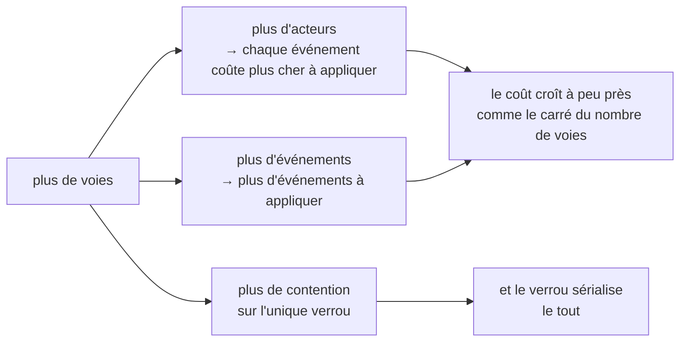

Tout système contient un nombre que personne ne sait justifier. Quelqu'un a écrit `MAX_CONCURRENT = 16` pendant un rush, ça n'a jamais cassé, et cinq ans plus tard c'est un folklore dont tout dépend. Cette leçon porte sur la tentative de Gaia de ne pas avoir de nombre de ce genre, et sur la même discipline appliquée à une question plus difficile : avec quels systèmes voisins s'intégrer, et lesquels refuser.

## L'échelle des preuves

Gaia prend en charge **quatre voies actives par espace de travail**. Le document derrière ce nombre est court, et se lit comme un cahier de laboratoire :

| Voies | Statut | Ce qui l'étaye |
|---|---|---|
| **4** | **SUPPORTED DEFAULT** (valeur par défaut prise en charge) | Quatre paires de processus client et serveur concurrentes sur un même journal, exercées dans la propre suite de tests du produit, plus les barrières de concurrence inter-processus portées depuis l'existant |
| 6 | NEXT VALIDATION TARGET (prochaine cible de validation) | Rien avec de vraies voies Claude ou Codex. Autorisé uniquement avec `--experimental-lanes`, et étiqueté comme expérimental dans la sortie |
| 8 | UNPROVEN WITH REAL CLIENTS (non prouvé avec de vrais clients) | Seuls des travailleurs Node identiques ont été mesurés, à 8 et à 16. Autorisé uniquement avec `--experimental-lanes` |
| >8 | REFUSED ALWAYS (toujours refusé) | Rien au-delà de 8 n'a jamais été mesuré, avec aucun client |

L'échelle est dans le code, pas seulement dans la prose. `src/lanes.mjs` exporte les preuves juste à côté des constantes :

```js
export const LANE_EVIDENCE = Object.freeze({
  4: 'supported: validated in this product\'s acceptance run',
  6: 'next validation target: NOT validated with real Claude/Codex lanes',
  8: 'unproven with real clients: only identical Node workers have been measured',
});
```

Demande six voies, et il refuse, dans une phrase qui te donne tout l'état des connaissances :

```text
LaneLimitError: refusing 6 live lanes: the supported default maximum is 4 per workspace. 6 is the
next validation target and 8 is unproven with real Claude/Codex lanes (only identical Node workers
have been measured). Pass --experimental-lanes to accept an unproven limit; it changes no evidence.
```

Accepte la limite non prouvée, et tu l'obtiens, correctement étiquetée :

```json
{ "limit": 6, "experimental": true, "note": "next validation target: NOT validated with real Claude/Codex lanes" }
```

Demande neuf voies, même avec l'option :

```text
LaneLimitError: refusing 9 live lanes even with --experimental-lanes: nothing above 8 has been
measured at all, with any client. Raise this only with real-client evidence.
```

Et la vérification d'admission, quand les voies sont réellement actives :

```text
LaneLimitError: refusing to register lane 5: 4 live lanes already at the limit of 4. Retire a lane,
or raise the limit deliberately with --max-lanes/--experimental-lanes.
```

Deux choix de conception, dans ces messages, méritent d'être copiés.

**Il lève une exception au lieu de plafonner.** Le commentaire du module explique pourquoi : *« un appelant qui demande 8 voies sans l'option ne doit pas en obtenir 4 en silence, et croire qu'il en a obtenu 8. »* Plafonner en silence relève de la même famille d'erreurs que convertir un `requestedAuthority` mal formé en `[]`, dans la [leçon 2](../02-six-verbs/) : le système produit une valeur confortable, et détruit l'information selon laquelle l'appelant voulait autre chose.

**La porte de sortie enregistre au lieu d'accorder.** Le document le dit : *« `--experimental-lanes` enregistre qu'un opérateur a accepté une limite non prouvée. Elle ne crée aucune preuve et ne change aucune valeur par défaut. »* L'option est honnête : c'est une décision, pas une capacité.

## Ce que les mesures prouvent, et ce qu'elles ne prouvent pas

C'est la partie du document à laquelle je reviens sans cesse, parce que c'est la moitié la plus rare d'une affirmation d'ingénierie.

Les sondes à 4, 8 et 16 écrivains ont fait tourner des **paires client et serveur Node identiques** sur un même répertoire de données. Elles prouvent que :

- les identifiants sont uniques d'un processus à l'autre, denses et monotones ;
- le JSONL reste à un enregistrement complet par ligne, même sous contention ;
- le rejeu est déterministe, et identique à l'octet près d'un processus à l'autre ;
- sous un verrou bloqué, le mode de dégradation est fermé en cas d'échec, et ne corrompt rien.

Elles ne prouvent **pas** :

- le débit, ni la latence pendant un vrai tour de modèle ;
- l'hétérogénéité : « une voie Claude et une voie Codex ne sont pas deux travailleurs Node, et leurs schémas d'appel, leurs délais d'expiration et leur comportement au repos diffèrent » ;
- le comportement sur un journal de dix mille à cent mille événements, qu'aucune mesure n'a couvert ;
- quoi que ce soit sur une voie qui se bloque au milieu d'un appel.

L'expérience manquante est nommée : *la même sonde, avec de vraies voies Claude et Codex.* Tant qu'elle n'a pas tourné, six et huit restent là où ils sont.

Cette seconde liste, c'est [SCI-04](../01-the-problem/), la reproductibilité par opposition à la réplication, formulée de façon opérationnelle. La sonde à travailleurs Node est reproductible et bon marché, et elle établit réellement les invariants de concurrence. Ce n'est pas une réplication avec la population que le système sert réellement, et l'échelle refuse de laisser l'une tenir lieu de l'autre.

## Pourquoi le plafond est là où il est

Le modèle de coût vient tout droit de la [leçon 3](../03-event-log-and-replay/). Le coût par appel est en **O(événements × acteurs)**, sous un seul verrou global, sur un journal qui n'est jamais compacté, et les voies poussent sur les deux facteurs :



Quatre n'est donc pas un chiffre rond choisi par souci d'ordre ; c'est le plus grand nombre que quiconque ait exercé de bout en bout.

### Ce qui permettrait de le relever

Trois choses, ensemble, et l'honnêteté de cette liste tient à ce que la première n'est explicitement *pas* un simple réglage :

1. **Un chemin de lecture à coût borné**, un décalage de fin mis en cache, ou un instantané suivi de la fin du journal, pour que le coût par appel cesse d'être en O(événements × acteurs). « C'est un changement de conception, pas un réglage, et il n'est délibérément pas implémenté ici. »
2. **Une sonde avec de vraies voies Claude et Codex**, au nombre visé, sur un journal de taille réaliste, qui vérifie les mêmes propriétés d'unicité des identifiants, d'intégrité du JSONL et de déterminisme du rejeu que les sondes à travailleurs Node.
3. **Une réponse à la question de ce qui se passe quand une voie bloque le verrou**, puisqu'il n'existe toujours aucune reprise automatique ; et la [leçon 3](../03-event-log-and-replay/) a montré pourquoi casser automatiquement un verrou périmé est un TOCTOU par construction.

Puis vient la phrase qui fait tenir tout le document :

> Relever le nombre dans `src/lanes.mjs` sans (1) et (2) ferait de ce document un mensonge. C'est pour cette raison que le nombre et ses preuves vivent dans le même fichier.

Placer une constante à côté de sa justification est une astuce bon marché qui rapporte gros. La prochaine personne qui se heurte à la limite ouvre le fichier pour changer `4`, et tombe sur l'argument avant de tomber sur l'affectation.

## Travailler à l'intérieur de la limite

- Un type de voie, une copie de travail, une portée d'écriture, un chemin de résultat et un marqueur de fin par voie. **Garder un seul écrivain modifiant chaque dépôt** : c'est la règle qui rend exploitable le rapport de collision d'espace de travail de la [leçon 2](../02-six-verbs/).
- `status` signale `overSupportedLaneLimit`, si bien qu'un espace de travail qui a dépassé quatre voies par un autre chemin se voit, au lieu d'être en excès sans bruit.
- **Une voie qu'on n'a pas vue depuis 30 secondes est `stale`, pas disparue** : toujours enregistrée, toujours joignable. *« L'accessibilité partielle est le cas normal. »* C'est la bonne valeur par défaut pour des voies d'agent, qui restent couramment silencieuses pendant des minutes au sein d'un seul tour de modèle : traiter le silence comme une mort ferait passer au ramasse-miettes une voie en plein travail.
- `wmux-lanes sweep` marque les voies terminées et périmées au moyen d'un `send` ordinaire et durable. Il n'envoie aucun signal à un processus et ne ferme aucune surface. Même le verbe de nettoyage n'a aucun privilège.

Au passage, un battement de cœur établit exactement une chose. La carte d'architecture le dit : *« Les battements de cœur des voies n'établissent que la fraîcheur du capteur. Ils n'entrent ni dans la vérité du backlog, ni dans l'acceptation, l'achèvement, le coût, le pourcentage ou l'estimation de fin. »* Une voie vivante est une voie vivante, rien de plus.

## Les verdicts sur l'écosystème

La seconde moitié de cette leçon traite d'une autre sorte de limite. Gaia fait partie d'une famille de dépôts, [GA](https://github.com/GuitarAlchemist/ga) (de la théorie musicale en C# et en F#), [TARS](https://github.com/GuitarAlchemist/tars) (un système d'agents en F#), Hari, et IX (un moteur en Rust), et le réflexe évident serait de tout brancher sur le bus.

Gaia en connecte deux sur quatre, et les verdicts sont **imposés dans le code** :

```js
import { assertIntegrationAllowed } from './src/ecosystem.mjs';
```

```text
ga   -> ALLOWED {"repo":"ga","verdict":"ADAPTER_ONLY","reason":"GA is a producer with no MCP client; the shipped adapter tails its JSONL read-only and never writes GA."}
tars -> ALLOWED {"repo":"tars","verdict":"ADAPTER_ONLY","reason":"TARS already mounts MCP servers at runtime via configure_mcp_server. Generate a local, uncommitted mount; never edit the tracked mcp_config.json."}
hari -> EcosystemRefusal: hari: REJECT — Hari removed its MCP crate from main and already ships its own stdio-JSONL protocol with a reference client. Rejected: no integration ships in this plugin.
ix   -> EcosystemRefusal: ix: DEFER — IX states "not runtime coupling" as policy and already implements append-only-log-as-source-of-truth with deterministic replay. Deferred pending write-serialisation + actor identity AND an explicit owner decision.
```

Ce ne sont pas des commentaires. `assertIntegrationAllowed` lève une exception, et les scripts livrés l'appellent avant de faire quoi que ce soit ; un futur contributeur qui écrirait un adaptateur pour Hari découvrirait donc à l'exécution que la décision a été prise et consignée, au lieu de le découvrir dans une relecture six semaines plus tard.

### GA : un lecteur de fin de fichier, et rien de plus

GA est le plus gros producteur de la famille et n'a **aucun client MCP** ; « GA consomme le bus » voudrait donc dire écrire une infrastructure de client MCP en .NET pour un canal de coordination. Tout ce que GA publierait est déjà sur le disque, selon un schéma versionné, si bien que le bus n'ajoute qu'une chose : **la notification active et une adresse de retour**. Ni la durabilité, ni l'ordre, ni le schéma : sur ces points, GA fait déjà mieux de son côté.

L'adaptateur ouvre donc le fichier de GA en mode `'r'` uniquement, stocke son décalage en octets dans le répertoire de données *de Gaia* plutôt qu'à côté de GA, signale et saute un enregistrement illisible au lieu de le réécrire, publie avec `requestedAuthority: ["report"]`, l'autorisation la plus consultative qui existe, et fonctionne à blanc par défaut.

Une phrase résume toute la discipline d'autorité de ce cours : *« Un refus de gouvernance de GA qui arrive sur le bus est un rapport sur un refus. Ce n'est pas une autorité pour agir en conséquence. »*

### TARS : à l'exécution seulement, sans aucune modification du dépôt

TARS est le seul membre de la famille qui soit déjà client et hôte MCP ; il peut donc monter le bus à l'exécution, grâce à son propre outil `configure_mcp_server`, sans aucun code dans le dépôt : c'est l'intégration la moins chère et la plus réversible qui soit.

Elle reste hors du dépôt pour une raison banale mais décisive : `mcp_config.json` est suivi par Git et partagé avec la CI, donc y mettre un chemin absolu propre à une machine casse toutes les autres. Le générateur émet son artefact dans un répertoire que tu désignes, jamais dans une copie de travail.

Le manque qu'elle comble est précis : le `delegate_task` de TARS est une recherche dans un registre interne au processus, un vocabulaire de délégation sans aucune portée inter-processus. Le bus lui donne un interlocuteur vivant, avec `correlationId` et `replyTo` intacts.

### Hari : rejeté, pas différé

Hari a déjà tout cela, et mieux typé : un protocole de streaming stdio-JSONL documenté, une parité de rejeu déterministe, un client de référence pour son unique interlocuteur, et un registre durable. Et Hari **a retiré son crate MCP de `main`**.

> Ajouter un second protocole stdio à un dépôt qui a supprimé le premier, c'est proposer d'annuler une décision que le propriétaire a déjà prise. C'est une conversation à avoir avec le propriétaire, pas une balle traçante : rien n'est donc livré.

C'est le verdict le plus intéressant des quatre, parce que la raison n'est pas technique. L'intégration fonctionnerait. Elle est refusée parce que la livrer renverserait discrètement la décision de quelqu'un d'autre, et que la bonne démarche est d'avoir la conversation à la place. On n'y reviendra que si Hari réintroduit une surface MCP pour ses propres raisons, et « le bus ne fait pas partie de ces raisons ».

### IX : différé, avec deux conditions nommées

IX livre déjà cette architecture en interne, et de façon plus rigoureuse : un journal d'événements de session en ajout seul comme source de vérité, un rejeu qui est une projection pure avec une sortie identique au bit près d'un processus à l'autre, et un middleware d'approbation déterministe qui émet un verdict pour chaque action. L'idée porteuse de Gaia, séparer la coordination de l'autorité par construction, n'est pas une nouveauté pour IX. IX a aussi une politique écrite contre le couplage à l'exécution entre dépôts, et une surface MCP protégée par une assertion sur le nombre exact d'outils, dont le seul rôle est de forcer à s'arrêter et réfléchir avant de changer la surface.

Deux conditions doivent être **toutes deux** remplies avant que ce verdict devienne `ADAPTER_ONLY` :

1. le bus acquiert une **identité des acteurs** meilleure que la confiance positionnelle : il a la sérialisation des écritures, il n'a pas d'authentification ;
2. une décision explicite du propriétaire de modifier l'invariant d'absence de couplage à l'exécution, avec une réponse écrite expliquant pourquoi cela ne répète pas le protocole A2A abandonné.

Ni l'une ni l'autre ne s'est produite, donc l'appel lève une exception. Remarque la forme : un report assorti de critères de sortie est une décision, alors qu'un report sans critères est une entrée de backlog qui ne revient jamais.

### Et un transport qui n'en est pas un

On compare souvent le bus au `SendMessage` de Claude Code, qui s'adresse à d'autres sessions Claude en texte brut. Le document de Gaia est sans détour sur la différence : il n'est pas disponible sous Windows natif, aucun client autre que Claude ne peut le parler, quelle que soit la configuration, il ne transporte ni identifiant de corrélation, ni métadonnées d'autorité, ni journal durable, et sa boîte aux lettres par agent est passagère, limitée à la session et auto-réparatrice : *elle abandonne les enregistrements qui échouent à la validation*.

> C'est le contraste le plus net possible avec ce bus, qui refuse un enregistrement qu'il ne sait pas analyser au lieu de l'abandonner.

Un enregistrement abandonné est un trou dans les preuves que rien ne signale. Un enregistrement refusé est un événement. Et si un chemin rapide natif est un jour utilisé, la règle est posée d'avance : ce doit être une optimisation du transport, qui écrit les mêmes événements dans le même journal, jamais une seconde source de vérité.

## Ce qui est implémenté, et ce qui ne l'est pas

La carte d'architecture se termine par un paragraphe que la plupart des projets ne publieraient pas :

> Ce dépôt est un candidat à l'installation, pas un plugin installé. La résolution automatique des conflits de pull request et le cycle de vie de ses effets, une autorité d'opérateur à distance au-delà du chemin interactif livré, et la validation à six voies restent prévues ; les services de production par locataire et de quotas sont hors du périmètre. Le travail prévu reste non normatif tant que le code, les preuves et une nouvelle révision de vérification ne sont pas liés ici.

« Pas un plugin installé » figure aussi sur la première page du README, sous un titre appelé **Install status**. Le classificateur de conflits de pull request est livré avec un registre de stratégies d'automatisation *vide*, si bien que les mots `resolve` et `reconcile` apparaissent dans le vocabulaire du cycle de vie alors que le code refuse de faire l'un comme l'autre : des noms réservés qui n'impliquent rien.

Et la carte porte son propre enregistrement de vérification, délibérément stocké hors du fichier pour éviter une empreinte qui se référencerait elle-même :

```json
{
  "schema": "gaia-architecture-verification/1",
  "commit": "f26978df2f2a27a5ccd185a1ef7d18afe72ae1cf",
  "date": "2026-09-13",
  "contentRevision": "sha256:741d824db4e35be0ca92ee5b6be5f7c31f0cfc5724cd72069857880dfaaef273"
}
```

Un enregistrement de vérification qui lie une date, un commit relu et le SHA-256 des octets exacts relus : « l'architecture a été relue » devient ainsi une affirmation vérifiable sur des octets précis, plutôt qu'une affirmation sur un document qui a été modifié depuis.

## À retenir

- Quatre voies actives, c'est le plus grand nombre que quiconque ait exercé de bout en bout. Six et huit exigent `--experimental-lanes`, qui enregistre une décision et ne crée aucune preuve, et rien au-dessus de huit n'est permis.
- Demander plus que la limite lève une erreur au lieu de plafonner, et le nombre vit dans le même fichier que sa preuve.
- Les sondes à workers Node prouvent les invariants de concurrence, pas le comportement de vraies voies Claude et Codex : reproductible ne veut pas dire répliqué.
- Le plafond vient du rejeu qui coûte O(événements × acteurs) sous un seul verrou ; le relever exige un chemin de lecture à coût borné, une sonde avec de vrais clients et une réponse pour un verrou bloqué.
- Les verdicts sur l'écosystème sont appliqués dans le code : GA et TARS n'ont droit qu'à des adaptateurs, Hari est rejeté, et IX est différé avec deux conditions nommées.

## Exercices

1. Ton équipe se heurte sans cesse à la limite de quatre voies. Un collègue ouvre `src/lanes.mjs`, passe `DEFAULT_MAX_LIVE_LANES` à 8, et note que les tests passent toujours. Qu'est-ce qui ne va pas, et quelle est la plus petite modification honnête ?

<details>
<summary>Solution</summary>

Que les tests passent n'est pas une preuve en faveur du nouveau nombre : la suite vérifie les invariants de concurrence avec des travailleurs Node identiques, c'est-à-dire exactement la population dont le document dit qu'elle ne se généralise *pas* à de vraies voies Claude et Codex. Modifie la constante, et le document placé à côté d'elle devient faux, ce qui est précisément ce que prédit le commentaire du fichier.

La plus petite modification honnête : aucune sur la constante. Passe `--experimental-lanes`, qui enregistre qu'un opérateur a accepté une limite non prouvée, et qui étiquette chaque sortie `experimental: true`. On obtient les voies dès aujourd'hui, et l'énoncé des preuves reste vrai.

La vraie solution est plus grosse, et le document la nomme déjà : le chemin de lecture à coût borné, puis la sonde avec de vrais clients, puis une réponse pour un verrou bloqué. Remarque l'ordre : sans (1), la sonde à huit voies mesurerait surtout le coût du rejeu en O(événements × acteurs).

</details>

2. Pourquoi Hari est-il un `REJECT` plutôt qu'un `DEFER`, alors qu'IX, qui implémente lui aussi déjà l'architecture, est différé ?

<details>
<summary>Solution</summary>

Parce que les obstacles ne sont pas de même nature. Celui d'IX est une *condition* : un invariant de politique que son propriétaire pourrait modifier, plus une capacité que Gaia pourrait acquérir, une identité des acteurs meilleure que la confiance positionnelle. Les deux sont formulés comme des critères de sortie, donc le report peut prendre fin.

Celui de Hari est une *décision déjà prise* : il a retiré son crate MCP de `main`. Livrer un adaptateur MCP reviendrait à annuler de l'extérieur le choix de quelqu'un d'autre, et aucun travail d'ingénierie du côté de Gaia n'y change rien : seule une conversation avec le propriétaire le peut. L'enregistrer comme `DEFER` laisserait entendre que Gaia attend quelque chose qu'il contrôle.

La forme générale : différer quand on sait ce qui débloquerait la situation, rejeter quand l'obstacle n'est pas à nous de le déplacer.

</details>

3. Une voie reste silencieuse pendant 90 secondes. Gaia la marque `stale` et la garde enregistrée et joignable. Défends l'autre option, la désinscrire, et explique pourquoi Gaia ne le fait pas.

<details>
<summary>Solution</summary>

Pour la désinscription : une voie périmée occupe l'une des quatre places rares, continue d'apparaître dans `status`, reçoit encore des messages que personne ne lira peut-être, et chaque acteur conservé rend le rejeu plus coûteux, puisque le coût est en O(événements × acteurs).

Contre, et c'est décisif : le silence est l'état normal d'une voie d'agent en bonne santé. Un seul tour de modèle avec un long appel d'outil dépasse couramment 30 secondes ; désinscrire sur silence expulserait donc des voies en plein travail, et les messages qui leur sont adressés devraient être refusés ou abandonnés. Cela exigerait aussi de décider de l'extérieur qu'un processus a disparu, soit le même jugement que Gaia refuse de porter sur un verrou périmé, pour la même raison de TOCTOU.

Gaia signale donc l'état et laisse l'acteur joignable : *« L'accessibilité partielle est le cas normal. »* Le retrait est un acte explicite : `sweep` marque les voies avec un `send` ordinaire et durable, et n'envoie aucun signal à un processus.

</details>

4. Le README de Gaia dit que le dépôt est « un candidat à l'installation, pas un plugin installé », et le classificateur de conflits de PR est livré avec un registre de stratégies vide. Pourquoi publier l'un ou l'autre de ces faits ?

<details>
<summary>Solution</summary>

Les deux protègent contre la même mauvaise lecture. Un dépôt avec 2 075 tests qui passent, un vocabulaire de cycle de vie contenant `resolve` et `reconcile`, et une usine qui fait tourner de vrais agents se lit comme un produit fini ; et un lecteur qui l'installe en s'attendant à une résolution automatique des conflits a été trompé par le vocabulaire, et non par une affirmation fausse.

L'énoncer rend les quatre axes visibles une fois de plus : le code est de grande *qualité*, et n'a pas été *accepté* pour l'installation, et ces deux choses sont indépendantes. Le registre vide en est la version structurelle : des mots réservés qui n'impliquent rien, avec ce vide documenté, pour qu'un lecteur qui cherche `resolve` avec grep et tombe sur le cycle de vie n'en conclue pas que la résolution a lieu.

Il y a aussi une raison intéressée. « Candidat à l'installation » est l'état dans lequel des relectures Standards et Spec, nouvelles et indépendantes, servent de barrière, et, comme le dit le README, *la voie qui a écrit ceci ne peut pas le relire*.

</details>

## Sources

- Gaia : [échelle et voies](https://github.com/GuitarAlchemist/gaia/blob/d68e90099ae2a6fbbec9d428617bfcd02095aac0/docs/scale-and-lanes.md), [`src/lanes.mjs`](https://github.com/GuitarAlchemist/gaia/blob/d68e90099ae2a6fbbec9d428617bfcd02095aac0/src/lanes.mjs), [adaptateurs de l'écosystème](https://github.com/GuitarAlchemist/gaia/blob/d68e90099ae2a6fbbec9d428617bfcd02095aac0/docs/ecosystem-adapters.md), [`src/ecosystem.mjs`](https://github.com/GuitarAlchemist/gaia/blob/d68e90099ae2a6fbbec9d428617bfcd02095aac0/src/ecosystem.mjs), [`ARCHITECTURE.md`](https://github.com/GuitarAlchemist/gaia/blob/d68e90099ae2a6fbbec9d428617bfcd02095aac0/ARCHITECTURE.md)
- Les dépôts voisins : [GuitarAlchemist/ga](https://github.com/GuitarAlchemist/ga), [GuitarAlchemist/tars](https://github.com/GuitarAlchemist/tars)
- [Claude Code](https://code.claude.com/docs/en/overview) : l'agent dont la messagerie de session à session est comparée au bus dans la dernière section
