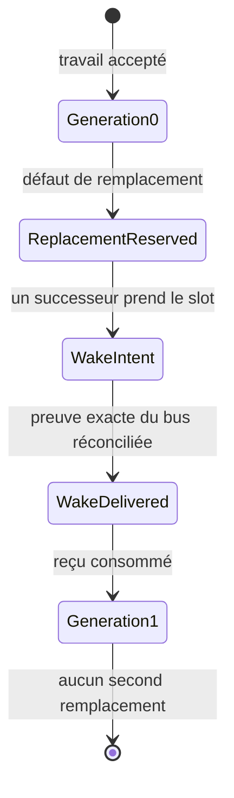
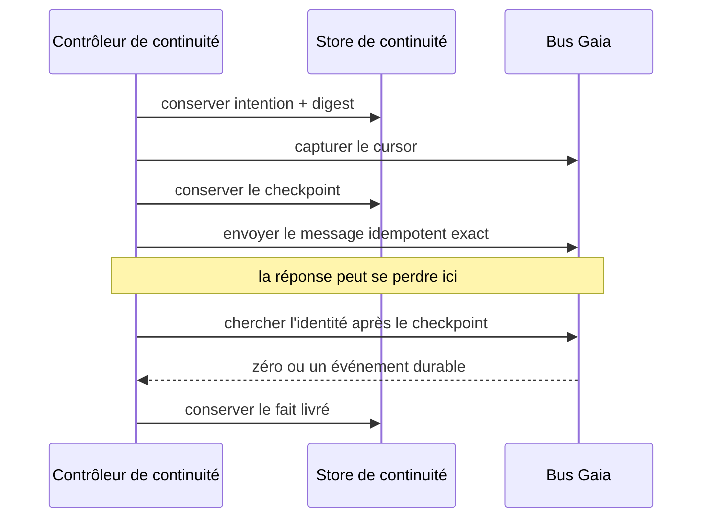

Les cinq premières leçons suivent un artefact jusqu'à la revue. Elles s'arrêtent avant une question difficile : que se passe-t-il quand l'agent propriétaire d'un travail accepté disparaît, et qu'un successeur doit continuer sans dupliquer l'effet ni hériter d'une autorité invisible?

[L'issue Gaia 76](https://github.com/GuitarAlchemist/gaia/issues/76) répond par un tracer volontairement minuscule : une identité de travail, un slot de successeur et un remplacement de génération 0 à génération 1. Ce n'est pas un superviseur général.

## La machine à états bornée



Une boucle générale exige élection, leases, suppression des doublons, délégation d'autorité et traitement du split brain. Le tracer demande seulement si une revue acceptée peut produire un wake, survivre à un envoi ambigu et publier un reçu sans autorité.

## Exact replay avec SQLite WAL

Le store utilise [SQLite](https://sqlite.org/) en mode WAL. Chaque opération lie sa clé d'idempotence à son entrée exacte. Même clé et même entrée : résultat précédent. Même clé et entrée différente : `OPERATION_CONFLICT`.

Si `replace-76` nomme d'abord la génération 1 puis la génération 2, rejouer le premier succès masquerait un désaccord. Le contrôleur reçoit le store par injection; une forme antérieure importait directement SQLite, ce que la revue a ramené derrière un port. La politique appartient au domaine, la base reste un adaptateur.

## Un `send` retourné ne prouve pas le wake livré

Le bus conserve quatre faits : intention de wake, cursor/checkpoint avant l'envoi, envoi idempotent exact, puis fait `delivered` trouvé après le checkpoint. Si le bus accepte mais que la réponse se perd, le retry cherche l'identité exacte au lieu de renvoyer aveuglément. Une décision exige la preuve livrée, pas l'intention.



## Le reçu portable après consommation

Le reçu JSON contient identité, générations, preuves du bus et digests. Son champ d'autorité est explicitement vide : la continuité transfère le contexte, pas le droit de fusionner, déployer, dépenser ou élargir le scope.

[Demerzel](https://github.com/GuitarAlchemist/Demerzel) vendore le JSON Schema et ses fixtures et les valide en lecture seule :

```text
transition Gaia -> reçu portable -> validation Demerzel -> entrée de gouvernance indépendante
```

Le reçu est le seam; partager la base ou le runtime détruirait la propriété de chaque dépôt.

## Ce que la revue a trouvé

| Forme faible | Échec | Invariant corrigé |
|---|---|---|
| le contrôleur importe la persistance | le domaine dépend de SQLite | injection du port du store |
| l'intention suffit | un envoi perdu paraît livré | preuve exacte du wake livré |
| une clé rejoue toujours | une entrée différente hérite d'un succès | `OPERATION_CONFLICT` |
| le test ne crée que le log principal | le sidecar de preuve manque | créer et vérifier le sidecar |
| scans/allocation répétés | le coût augmente | requête unique et résultats bornés réutilisés |

Une récupération doit tester le **succès ambigu**, pas seulement l'échec propre : l'effet externe a peut-être eu lieu alors que le code local ne le sait pas.

## Garde-fous fournisseur et coût

- aucun fallback payant sans autorisation;
- aucun retry au-delà du plafond de tentatives ou de dollars;
- fournisseur et modèle inscrits dans la preuve;
- fournisseur indisponible = refus durable ou revue humaine;
- un classifieur moins cher comme Jev peut conseiller un routage, jamais prouver une livraison ni accorder un effet.

## Preuves mesurées du candidat — pas d'une release

Le 20 septembre 2026, le candidat isolé a exécuté **2 261 tests Node : 2 259 réussis, 0 échec, 2 omis**; la régression ciblée, **87/87**; le vérificateur Gaia, **37 réussites, 0 échec**; le vérificateur d'architecture a réussi. Demerzel a exécuté **787 tests Python avec 1 omission** et **10/10 contrôles IXQL**.

Ces mesures sont liées au commit Gaia [`9a2f696`](https://github.com/GuitarAlchemist/gaia/commit/9a2f696805740cd75da6ebe29e9a99976f57dc2f), à son [reçu de preuves](https://github.com/GuitarAlchemist/gaia/blob/2352085379ea365424b009d334d451b2c0dc1bd8/docs/design-receipts/gaia-76-continuity-r0-v7.4-acceptance.md) et au commit Demerzel [`fa04d7c`](https://github.com/GuitarAlchemist/Demerzel/commit/fa04d7ce234f10cd38b1134531c0b0032af59d72). Les flux de commandes locaux ne sont pas versionnés : rejoue les gates nommées ou consulte les contrôles des PR avant de traiter ces chiffres comme preuves de publication.

Ces chiffres concernent des worktrees candidats. Ils ne prouvent ni publication, ni fusion, ni revue du commit final, ni release.

## À retenir

- R0 = un slot et un remplacement, pas un superviseur général.
- L'idempotence lie l'entrée exacte; une entrée différente est un conflit.
- Un checkpoint avant envoi permet de réconcilier un résultat ambigu.
- Le reçu transfère une preuve de contexte avec une autorité vide.
- Demerzel valide en lecture seule au lieu de partager l'état Gaia.

## Exercices

1. Le bus accepte le wake, mais le processus meurt avant la réponse. Pourquoi « réessayer une fois » est-il dangereux?

<details><summary>Solution</summary>

Le premier envoi peut déjà être durable. Le second créerait deux wakes. Le checkpoint borne la recherche et l'identité exacte distingue l'effet du trafic voisin.

</details>

2. Pourquoi un champ d'autorité vide plutôt qu'absent?

<details><summary>Solution</summary>

Vide affirme « aucune autorité ». Absent peut vouloir dire non modélisé, inconnu ou oublié.

</details>

## Sources

- [Issue Gaia 76](https://github.com/GuitarAlchemist/gaia/issues/76), [architecture Gaia](https://github.com/GuitarAlchemist/gaia/blob/main/ARCHITECTURE.md)
- [SQLite WAL](https://sqlite.org/wal.html), [Demerzel](https://github.com/GuitarAlchemist/Demerzel)
