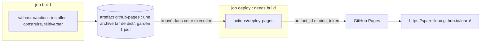

## Le déploiement que tu es en train de lire

Cette page t'est parvenue par [`.github/workflows/deploy.yml`](https://github.com/spareilleux/learn/blob/main/.github/workflows/deploy.yml), à chaque push sur `main`. Il est court, et chaque ligne utilise quelque chose des leçons précédentes :

```yaml
name: Deploy to GitHub Pages

on:
  push:
    branches: [main]
  workflow_dispatch:

permissions:
  contents: read
  pages: write
  id-token: write

# Two pushes in a row would start two Pages deployments, and the second one fails with
# "Deployment request failed ... due to in progress deployment". Queue them instead.
concurrency:
  group: pages
  cancel-in-progress: false

jobs:
  build:
    runs-on: ubuntu-latest
    steps:
      - name: Checkout
        uses: actions/checkout@v7
      - name: Install, build, and upload site
        uses: withastro/action@v6

  deploy:
    needs: build
    runs-on: ubuntu-latest
    environment:
      name: github-pages
      url: ${{ steps.deployment.outputs.page_url }}
    steps:
      - name: Deploy to GitHub Pages
        id: deployment
        uses: actions/deploy-pages@v5
```

Côté dépôt, [GitHub Pages](https://docs.github.com/pages) est configuré pour déployer depuis Actions plutôt que depuis une branche :

```powershell
gh api repos/spareilleux/learn/pages --jq '{url: .html_url, build_type, https_enforced}'
```

```text
{"build_type":"workflow","https_enforced":true,"url":"https://spareilleux.github.io/learn/"}
```

`build_type: workflow`, c'est *Settings → Pages → Source: GitHub Actions*. Avec l'ancienne source *Deploy from a branch*, GitHub lance son propre build Jekyll sur une branche comme `gh-pages` ; avec un workflow, tu construis ce que tu veux et tu remets les fichiers.

## Job 1 : construire et envoyer le site

[`withastro/action`](https://github.com/withastro/action) est une action composite ([leçon 6](../06-reuse/)). Son `action.yml` détecte le fichier de verrouillage, installe Node avec le cache npm, installe les dépendances, restaure le cache Astro, construit le site, enregistre le cache, et se termine par :

```text
- name: Upload Pages Artifact
  uses: actions/upload-pages-artifact@fc324d3547104276b827a68afc52ff2a11cc49c9 # v5
```

Une action épinglée sur un SHA de commit, avec la version en commentaire — le conseil de la [leçon 7](../07-security/), appliqué par l'équipe d'Astro. D'après l'exécution du commit `fd52d46` :

```text
Cache restored from key: node-cache-Linux-x64-npm-fa7181d77dee2cc1ba065b6111b07b81f0308595291d60af9f8cc32a0d812697
added 275 packages, and audited 276 packages in 6s
Cache restored from key: astro-cache-Linux-a7a6f729702b8a1a4ed15adcb709863a3eb63db6
13:32:45 [starlight:pagefind] Found 310 HTML files.
13:32:46 [build] 310 page(s) built in 7.47s
  name: github-pages
  retention-days: 1
Artifact github-pages has been successfully uploaded! Final size is 9108634 bytes. Artifact ID is 10350355767
```

- Le site est un **artefact** ordinaire ([leçon 5](../05-caches-and-artifacts/)) nommé `github-pages` : une archive tar de `dist/`, environ 9 Mo pour 310 pages en trois langues.
- `retention-days: 1` est la valeur par défaut d'`upload-pages-artifact` : une fois le site déployé, l'archive ne sert plus à rien.
- La clé du cache Astro est `astro-cache-${{ runner.os }}-${{ github.sha }}` avec `restore-keys: astro-cache-${{ runner.os }}-` : une nouvelle clé à chaque commit, et le cache du commit précédent (`a7a6f72`) restauré par préfixe — l'exercice 3 de la leçon 5.
- Le job entier a pris 30 s, dont 24 dans ce seul step.

## Job 2 : déployer

[`actions/deploy-pages`](https://github.com/actions/deploy-pages) trouve l'artefact de **cette** exécution et demande à GitHub de le publier :

```text
Fetching artifact metadata for "github-pages" in this workflow run
Found 1 artifact(s)
Creating Pages deployment with payload:
{
	"artifact_id": 10350355767,
	"pages_build_version": "fd52d46d1d2940e5dee33790e4a2873056f074f3",
	"oidc_token": "***"
}
Created deployment for fd52d46d1d2940e5dee33790e4a2873056f074f3, ID: fd52d46d1d2940e5dee33790e4a2873056f074f3
Getting Pages deployment status...
Reported success!
Evaluated environment url: https://spareilleux.github.io/learn/
```

Pourquoi les deux permissions ? Le README : « La permission pages concerne le `GITHUB_TOKEN` : elle lui donne les permissions de créer des déploiements Pages lors des appels à l'API GitHub. La permission id-token est nécessaire pour demander le token JWT OIDC » — l'`oidc_token` du payload, masqué dans le log. C'est le mécanisme de la leçon 7, utilisé par GitHub lui-même pour vérifier que le déploiement vient d'un workflow de ce dépôt.

Le job de déploiement ne récupère pas le dépôt et n'installe rien : 8 secondes.

Les deux jobs se passent le site sous forme d'artefact, et le job deploy envoie son identifiant à GitHub avec le jeton OIDC.



## L'environnement `github-pages`

`environment: name: github-pages` rattache le job à un [environnement](https://docs.github.com/actions/how-tos/deploy/configure-and-manage-deployments/manage-environments), que GitHub a créé automatiquement pour Pages. Un environnement peut contenir ses propres secrets et variables, et des **règles de protection** qu'un job doit passer avant de démarrer :

```powershell
gh api repos/spareilleux/learn/environments --jq '.environments[] | {name, protection_rules}'
gh api repos/spareilleux/learn/environments/github-pages/deployment-branch-policies --jq '.branch_policies[] | {name, type}'
```

```text
{"name":"github-pages","protection_rules":[{"id":65464384,"node_id":"GA_kwDOUZJuCs4D5uhA","type":"branch_policy"}]}
{"name":"main","type":"branch"}
```

Seule `main` peut déployer — l'exercice 1 essaie une autre branche. D'autres règles, comme des relecteurs obligatoires ou un délai d'attente, transforment l'environnement en porte d'approbation manuelle, comme une vérification d'approbation sur un environnement Azure Pipelines.

Chaque exécution crée aussi un **déploiement**, avec un historique de statuts :

```powershell
gh api repos/spareilleux/learn/deployments/6438161238/statuses --jq '.[] | "\(.state) \(.created_at) \(.environment_url)"'
```

```text
success 2026-09-14T13:33:06Z https://spareilleux.github.io/learn/
in_progress 2026-09-14T13:32:57Z 
queued 2026-09-14T13:32:54Z 
waiting 2026-09-14T13:32:53Z 
```

L'`url:` de l'environnement est ce qui apparaît comme lien sur le résumé de l'exécution et sur la page *Deployments* du dépôt.

## Les déploiements en file d'attente

La [leçon 3](../03-triggers/) a ajouté le groupe de concurrence après la collision de deux déploiements. Plusieurs sessions poussent sur ce dépôt ; deux pushs à 41 secondes d'intervalle, 45 minutes plus tard :

| Exécution | Commit | Exécution créée | Job `build` créé | Job `deploy` terminé |
|---|---|---|---|---|
| 34849759801 | `a7a6f72` | 13:31:23 | 13:31:24 | 13:32:18 |
| 34849828422 | `fd52d46` | 13:32:04 | 13:32:18 | 13:33:05 |

La deuxième exécution existait à 13:32:04, mais son job `build` a été créé à 13:32:18 — la seconde où le premier déploiement s'est terminé : 14 secondes *pending*, puis déployée. Aucun échec, aucun commit perdu.

## Le chemin de base

Un site de dépôt est servi sous le nom du dépôt : `https://spareilleux.github.io/learn/`, pas à la racine du domaine. Astro doit le savoir, dans `astro.config.mjs` :

```text
site: 'https://spareilleux.github.io',
base: '/learn',
```

C'est aussi pour ça que les leçons de ce site n'utilisent que des liens relatifs (`../journal/`) : exercice 3.

## À retenir

- Un workflow Pages, ce sont deux jobs : construire un artefact nommé `github-pages`, puis `actions/deploy-pages` avec `pages: write` et `id-token: write`.
- L'environnement `github-pages` enregistre chaque déploiement et peut restreindre qui déploie : ici, seulement `main`.
- `concurrency: group: pages` avec `cancel-in-progress: false` met les déploiements en file d'attente au lieu de les faire échouer.
- Un site de projet vit sous `/<repository>/` : configure le chemin de base et évite les liens absolus depuis la racine.

## Exercices

1. Lance le workflow de déploiement sur une autre branche : `gh workflow run deploy.yml --ref gha-06-invalid`. Le site change-t-il ?

<details>
<summary>Solution</summary>

Non. Le job `build` a tourné et envoyé son artefact ; le job `deploy` a été rejeté avant d'obtenir un runner (0 step, 1 seconde) :

```text
X Branch "gha-06-invalid" is not allowed to deploy to github-pages due to environment protection rules.
X The deployment was rejected or didn't satisfy other protection rules.
```

Un déploiement a quand même été enregistré, avec les statuts `waiting` puis `failure`. La règle est vérifiée quand le job **démarre**, donc n'importe quel job de cette branche sans `environment:` tournerait quand même : l'environnement protège ses secrets et ses déploiements, pas le reste du workflow.

</details>

2. Le job `deploy` n'a pas d'`actions/checkout`. D'où viennent les fichiers du site, et que se passerait-il si le job `build` les envoyait sous un autre nom d'artefact ?

<details>
<summary>Solution</summary>

De l'artefact de la même exécution, récupéré par l'API — les steps du job ne sont que *Set up job*, *Deploy to GitHub Pages* et *Complete job*. `deploy-pages` cherche le nom donné par son input `artifact_name`, `github-pages` par défaut (`Fetching artifact metadata for "github-pages" in this workflow run`). Avec un autre nom, il ne le trouverait pas : passe le même nom aux deux actions. *À vérifier* : le message d'erreur exact.

</details>

3. Une leçon contient le lien Markdown `[method](/method/)`. En local, avec `astro dev`, où mène-t-il, et sur le site publié ?

<details>
<summary>Solution</summary>

Sur le site publié, vers `https://spareilleux.github.io/method/`, en dehors du site du dépôt :

```text
404 https://spareilleux.github.io/method/
200 https://spareilleux.github.io/learn/method/
```

Astro ne réécrit pas avec le `base` les liens écrits en Markdown. En local, le serveur de développement sert aussi sous `/learn/`, donc le lien y est cassé aussi — *à vérifier* avec `astro dev`. Un lien relatif (`../method/`) fonctionne aux deux endroits.

</details>

## Sources

- [Utiliser des workflows personnalisés avec GitHub Pages](https://docs.github.com/pages/getting-started-with-github-pages/using-custom-workflows-with-github-pages)
- [`actions/deploy-pages`](https://github.com/actions/deploy-pages) et [`actions/upload-pages-artifact`](https://github.com/actions/upload-pages-artifact)
- [Gérer les environnements de déploiement](https://docs.github.com/actions/how-tos/deploy/configure-and-manage-deployments/manage-environments)
- [Déployer ton site Astro sur GitHub Pages](https://docs.astro.build/en/guides/deploy/github/)
- [API REST : déploiements](https://docs.github.com/rest/deployments/deployments)
