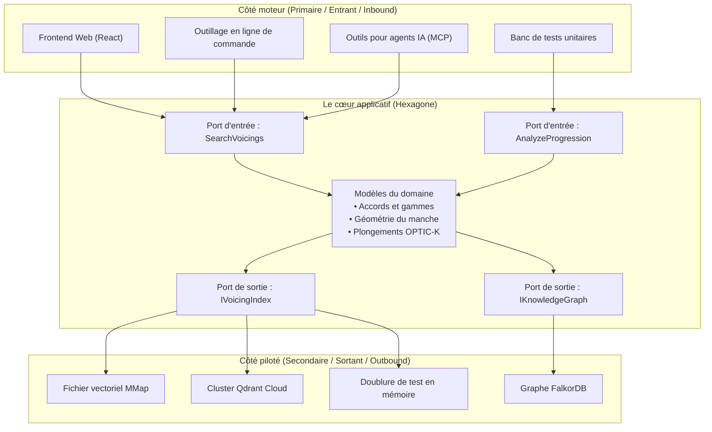
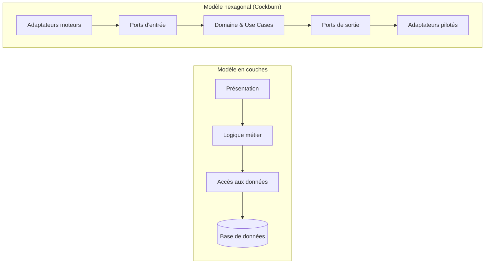

L'architecture hexagonale a été théorisée par **Alistair Cockburn** en 2005 pour remédier à un travers récurrent du génie logiciel : l'enchevêtrement pernicieux de la logique métier avec les interfaces graphiques, les frameworks HTTP, les requêtes SQL et les bibliothèques tierces.

Cockburn a constaté que qu'une commande provienne d'une requête HTTP, d'un banc de tests automatisé, d'un script console ou d'une interface d'administration, le problème métier résolu reste strictement identique. Symétriquement, que l'état soit persisté dans un fichier SQLite, une base relationnelle d'entreprise, un dictionnaire en mémoire ou un moteur vectoriel dans le cloud, l'exigence métier se résume à : *"enregistrer et restituer cet agrégat"*.

Le principe fondateur s'énonce ainsi :

> *"Permettre à une application d'être pilotée aussi bien par des utilisateurs, d'autres programmes, des tests automatisés ou des scripts batch, et d'être développée et testée de manière totalement isolée de ses dispositifs d'exécution et bases de données réels."*
> — Alistair Cockburn

---

## Pourquoi un hexagone ?

La figure géométrique ne possède aucune propriété mathématique mystique : le modèle ne se limite aucunement à six côtés.

Cockburn a choisi l'hexagone comme métaphore visuelle pour rompre avec le diagramme unidimensionnel vertical classique (Interface utilisateur &rarr; Logique métier &rarr; Base de données). Un polygone en deux dimensions met en évidence le fait que le cœur applicatif dispose de **multiples facettes** à travers lesquelles il interagit avec le monde extérieur :



L'architecture est scindée par une ligne de démarcation absolue : **l'Intérieur contre l'Extérieur**.

---

## La frontière Intérieur vs Extérieur

### L'Intérieur (Le cœur de l'hexagone)

L'intérieur abrite deux couches conceptuelles :
1. **Le modèle de domaine** : les règles métier pures, les entités, les objets-valeurs et les invariants mathématiques. Dans Guitar Alchemist, cela inclut `PitchClass`, `Interval`, `PitchClassSet`, `ChordDefinition` et les calculs de coordonnées sur le manche. Cette couche ne contient aucune dépendance vers ASP.NET Core, Entity Framework, Qdrant ou des sérialiseurs JSON.
2. **La couche applicative (Use Cases)** : elle orchestre les entités du domaine pour exécuter les intentions de l'utilisateur. Elle définit les actions possibles (par exemple `SearchVoicingsUseCase`, `AnalyzeProgressionUseCase`).

L'intérieur définit les **Ports**. L'intérieur ne fait jamais référence à l'extérieur.

### L'Extérieur

L'extérieur regroupe tous les éléments techniques, instables et contingents à l'infrastructure :
- Protocoles d'entrée : HTTP, WebSockets, SignalR, gRPC, Language Server Protocol (LSP), Model Context Protocol (MCP) ;
- Persistance : bases SQL, Redis, FalkorDB, fichiers mappés en mémoire, stockage objet S3 ;
- Services externes : APIs d'inférence LLM (Anthropic Claude, OpenAI), moteurs ONNX, périphériques MIDI.

L'extérieur implémente ou consomme les ports via des **Adaptateurs**.

---

## Les Ports : des contrats à la frontière

Un **Port** est une interface définie par l'application. Il s'exprime dans le langage omniprésent du domaine métier (Ubiquitous Language), sans vocabulaire technique.

Les ports se séparent en deux catégories symétriques :

### 1. Les Ports d'entrée (Driving / Primary Ports)

Les ports d'entrée définissent **ce que l'application offre** au monde extérieur. Ce sont les cas d'utilisation (Use Cases).

- **Acteur initiateur** : un utilisateur, un agent IA, une tâche planifiée ou un banc de test ;
- **Sens du flux** : l'extérieur appelle l'intérieur ;
- **En C#** : une interface de use case ou un gestionnaire de commande/requête (Command/Query Handler).

```csharp
// Intérieur : Port d'entrée
public interface ISearchVoicingsUseCase
{
    Result<VoicingSearchResult, SearchError> Execute(VoicingSearchQuery query);
}

public readonly record struct VoicingSearchQuery(
    PitchClassSet PitchClasses,
    Tuning Tuning,
    FretSpan AllowedSpan,
    int MaxFretSpan = 4);
```

### 2. Les Ports de sortie (Driven / Secondary Ports)

Les ports de sortie définissent **ce dont l'application a besoin** pour mener à bien sa tâche métier.

- **Acteur exécutant** : une base de données, un index vectoriel, un synthétiseur audio ou un système de fichiers ;
- **Sens du flux** : l'intérieur appelle le port ; l'adaptateur extérieur implémente l'interface ;
- **En C#** : une interface déclarée dans le cœur applicatif, mais implémentée dans un projet d'infrastructure.

```csharp
// Intérieur : Port de sortie (déclaré dans le domaine)
public interface IVoicingVectorIndexPort
{
    ValueTask<IReadOnlyList<VoicingMatch>> FindNearestNeighborsAsync(
        ReadOnlyMemory<float> queryVector, 
        int limit, 
        CancellationToken cancellationToken = default);
}
```

Soulignons ce point capital : **l'interface `IVoicingVectorIndexPort` réside au cœur du domaine, pas dans la couche d'infrastructure.** C'est l'application rigoureuse du **Principe d'Inversion des Dépendances (DIP)**.

---

## Les Adaptateurs : les traducteurs

Un **Adaptateur** est un composant technique concret qui fait le pont entre une technologie extérieure et un port.

### Adaptateurs moteurs (Driving Adapters)

Un adaptateur moteur capte un signal extérieur (une requête HTTP POST, un message JSON-RPC d'un agent) et le traduit en un appel vers un port d'entrée :

```csharp
// Extérieur : Adaptateur moteur (Contrôleur ASP.NET Core)
[ApiController]
[Route("api/voicings")]
public sealed class VoicingsController(ISearchVoicingsUseCase searchUseCase) : ControllerBase
{
    [HttpPost("search")]
    public IActionResult Search([FromBody] VoicingSearchHttpRequest request)
    {
        // 1. Traduction du DTO HTTP vers la commande métier
        var query = new VoicingSearchQuery(
            PitchClassSet.FromMask(request.PitchClassMask),
            Tuning.StandardGuitar,
            new FretSpan(request.MinFret, request.MaxFret));

        // 2. Appel du port d'entrée
        var result = searchUseCase.Execute(query);

        // 3. Traduction de la réponse métier vers la réponse HTTP
        return result.Match<IActionResult>(
            success => Ok(VoicingSearchHttpResponse.FromDomain(success)),
            error => BadRequest(new { error = error.Message }));
    }
}
```

Un autre adaptateur moteur peut être un outil **Model Context Protocol (MCP)** pour une IA :

```csharp
// Extérieur : Adaptateur moteur (Outil pour GaMcpServer)
[McpTool("search_voicings", "Recherche des voicings ergonomiques sur la guitare")]
public sealed class SearchVoicingsMcpTool(ISearchVoicingsUseCase searchUseCase)
{
    public Task<string> ExecuteAsync(int pitchClassMask, int minFret, int maxFret)
    {
        var query = new VoicingSearchQuery(
            PitchClassSet.FromMask(pitchClassMask),
            Tuning.StandardGuitar,
            new FretSpan(minFret, maxFret));

        var result = searchUseCase.Execute(query);
        return Task.FromResult(result.Match(
            s => JsonSerializer.Serialize(s),
            e => $"Erreur : {e.Message}"));
    }
}
```

Remarquez que le contrôleur web et l'outil MCP appellent **exactement le même port** (`ISearchVoicingsUseCase`). Aucun des deux ne détient de logique métier.

### Adaptateurs pilotés (Driven Adapters)

Un adaptateur piloté implémente un port de sortie en encapsulant une technologie précise :

```csharp
// Extérieur : Adaptateur piloté (Fichier mappé en mémoire pour OPTIC-K)
public sealed class MemoryMappedOptickAdapter(OptickIndexReader reader) : IVoicingVectorIndexPort
{
    public ValueTask<IReadOnlyList<VoicingMatch>> FindNearestNeighborsAsync(
        ReadOnlyMemory<float> queryVector, 
        int limit, 
        CancellationToken cancellationToken)
    {
        // Traduction de l'appel du domaine en recherche SIMD par pointeurs
        var results = reader.SearchCosine(queryVector.Span, limit);
        return ValueTask.FromResult(results);
    }
}
```

Pour remplacer l'index local par un cluster Qdrant, il suffit d'écrire un `QdrantVectorAdapter` implémentant `IVoicingVectorIndexPort`. **Le cœur du domaine ne change pas d'une seule virgule.**

---

## Comparaison : Hexagonale vs En couches vs Onion vs Clean

Les termes d'architecture sont souvent confondus. Bien qu'ils partagent le même objectif (inverser les dépendances pour isoler le domaine), leurs structures diffèrent :

| Propriété | En couches (N-Tiers classique) | Hexagonale (Cockburn 2005) | Onion (Palermo 2008) | Clean Architecture (Martin 2012) |
|---|---|---|---|---|
| **Centre de gravité** | Base de données / Accès aux données | Domaine et Cas d'utilisation | Modèle de domaine | Entités |
| **Symétrie principale** | Haut &rarr; Bas (Verticale) | Intérieur &harr; Extérieur (Radiale) | Anneaux concentriques | Anneaux concentriques |
| **Typologie des ports** | Aucune (couches empilées) | Explicite : Moteur vs Piloté | Interfaces de domaine | Ports d'entrée / sortie |
| **Nombre de couches** | 3 ou 4 couches rigides | 2 zones (Intérieur / Extérieur) | 4 anneaux concentriques | 4 anneaux concentriques |
| **Formalisme** | Fixe (UI, Métier, DAL) | Minimaliste (Ports & Adaptateurs) | Formalise les Domain Services | Prescrit Présentateurs, Passerelles |



### La règle d'or

- Dans l'**Architecture en couches**, les dépendances pointent vers le bas, en direction de la base de données. La base de données en est le fondement.
- Dans l'**Architecture hexagonale**, les dépendances pointent toutes **vers l'intérieur**, en direction du domaine métier. La base de données n'est qu'un détail technique périphérique, au même titre qu'un fichier temporaire ou un dictionnaire mémoire.
