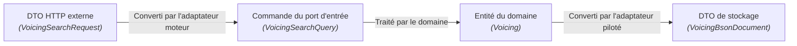
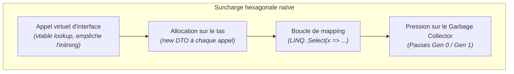

En architecture logicielle, rien n'est gratuit. Tout choix architectural consiste à équilibrer des tensions contradictoires : maintenabilité contre charge cognitive, isolation contre performances pures, et flexibilité contre vélocité de développement.

L'architecture hexagonale est souvent parée de toutes les vertus. Pour prendre des décisions d'ingénierie éclairées, il convient de mesurer ses atouts incontestables tout comme ses coûts cachés — en particulier dans les applications C# à haute fréquence de calcul comme [Guitar Alchemist](../../music-theory-ga/).

---

## Les Avantages

### 1. Une testabilité à la vitesse de l'éclair

Dans une architecture en couches classique, tester un service métier impose fréquemment de configurer une base de données en mémoire avec EF Core, de démarrer des conteneurs Testcontainers pour PostgreSQL ou Redis, ou d'échafauder des arbres de mocks fragiles avec `Mock<IRepository>` et `Mock<ILogger>`.

Avec l'architecture hexagonale, tester le cœur applicatif s'effectue **sans aucune infrastructure** :
- Les ports de sortie sont branchés sur de simples collections en mémoire ou des doublures de test (*fakes*) légères, sans proxys dynamiques ;
- Une suite complète de 500 tests de logique métier s'exécute en **moins de 200 millisecondes** ;
- Les tests tournent sans réseau, sans accès au système de fichiers et sans démon Docker.

```csharp
[Fact]
public void SearchVoicings_FiltreLesVoicingsInjouables_DansLEcartDemande()
{
    // Arrange : Utilisation d'un adaptateur de test en mémoire
    var fakeIndex = new InMemoryVoicingIndexAdapter(SampleVoicings.All);
    var useCase = new SearchVoicingsUseCase(fakeIndex);

    var query = new VoicingSearchQuery(
        PitchClassSet.FromNotes(Note.C, Note.E, Note.G),
        Tuning.StandardGuitar,
        new FretSpan(0, 4));

    // Act
    var result = useCase.Execute(query);

    // Assert : test unitaire pur, exécuté en 0,4 ms
    Assert.True(result.IsSuccess);
    Assert.All(result.Value.Voicings, v => Assert.True(v.FretSpan <= 4));
}
```

### 2. La parité multi-surfaces pour les architectures IA

Aujourd'hui, une application ne se résume plus à une interface web reliée à un contrôleur HTTP. À l'ère de l'IA et de l'outillage pour développeurs, une application doit exposer son intelligence sur plusieurs surfaces distinctes :
1. **APIs Web et mobiles** : HTTP REST, GraphQL, flux temps réel SignalR ;
2. **Outillage pour agents IA** : serveurs Model Context Protocol (MCP) pour Claude Code, Codex ou Antigravity ;
3. **Intégration dans l'EDI** : serveurs de langage (LSP) pour éditeurs de code ;
4. **Flux développeur** : commandes CLI et traitements batch.

Sans architecture hexagonale, chaque surface a tendance à réécrire sa propre orchestration, sa validation et sa gestion d'erreurs, ce qui génère des incohérences de comportement difficiles à déceler.

Avec l'architecture hexagonale, **chaque surface n'est qu'un adaptateur moteur supplémentaire appelant le même port d'entrée**. Lorsqu'un agent IA appelle `SearchVoicings` via MCP et qu'un guitariste l'appelle via le frontend React, tous deux exécutent exactement le même code métier compilé.

### 3. Report des décisions techniques et modularité

L'architecture doit permettre de différer l'engagement envers des technologies précises le plus longtemps possible :
- Vous pouvez développer et valider l'intégralité du moteur d'harmonie et d'enchaînement d'accords bien avant de choisir entre Qdrant, FalkorDB ou un fichier binaire local ;
- Changer de fournisseur de modèle de langage (passer d'Anthropic Claude à un modèle ONNX local ou Ollama) n'impacte que l'adaptateur de sortie ;
- Le domaine reste rigoureusement intact lors des montées de version du framework web ou du passage de .NET 8 à .NET 10.

### 4. Pureté absolue du domaine

Le code métier est totalement préservé de la pollution technique :
- Aucune annotation de base de données (`[Table]`, `[Key]`, `[ForeignKey]`) ;
- Aucun attribut de sérialisation (`[JsonPropertyName]`, `[BsonElement]`) ;
- Aucun code de statut HTTP ni héritage de classe de contrôleur.

---

## Les Inconvénients et Coûts Cachés

### 1. L'inflation de DTOs et de code de conversion

Dans l'architecture hexagonale, chaque donnée franchissant une frontière doit être convertie entre plusieurs représentations :



Pour chaque fonctionnalité, l'équipe doit écrire et maintenir :
- 1 interface de port d'entrée ;
- 1 DTO de commande ou requête ;
- 1 entité ou objet-valeur du domaine ;
- 1 interface de port de sortie ;
- 1 DTO de stockage pour l'adaptateur ;
- 2 à 4 fonctions de conversion (mapping).

Pour des opérations de simple lecture/écriture (CRUD), ce formalisme est vécu comme une surcharge bureaucratique stérile, sans valeur ajoutée pour le projet.

### 2. Charge cognitive et indirection de navigation

Lors de l'analyse d'un bug, le développeur ne peut pas simplement exécuter « Aller à l'implémentation » dans son EDI pour suivre le flux d'exécution. Il doit cheminer à travers plusieurs couches :
`Contrôleur` &rarr; `Mapping` &rarr; `Port d'entrée` &rarr; `Use Case` &rarr; `Domaine` &rarr; `Port de sortie` &rarr; `Adaptateur` &rarr; `Client technique`.

Pour des ingénieurs débutants ou dans des contextes d'urgence, cette indirection engendre de la fatigue mentale et pousse parfois à contourner les ports.

---

## Le Problème Critique : Le Coût de Performance (Performance Tax)

Dans une application d'entreprise classique (quelques dizaines de requêtes par seconde vers une base SQL), le coût de l'abstraction hexagonale est négligeable face à la latence réseau.

En revanche, dans des **systèmes à fort volume de calcul et faible latence** — comme la recherche par similarité cosinus sur 626 094 voicings vectorisés en 240 dimensions dans Guitar Alchemist, la synthèse audio temps réel ou les boucles d'analyse harmonique appelées 100 000 fois par seconde —, **une architecture hexagonale naïve peut diviser les performances par dix.**



### Pourquoi les ports naïfs détruisent la performance :

1. **Dispatch virtuel et barrière à l'inlining** :
   Invoquer une méthode via une interface (`IVectorIndex.Search(...)`) requiert un dispatch virtuel. Le compilateur JIT de .NET ne peut pas intégrer (inliner) l'appel à travers des frontières d'assemblies dynamiques, ce qui interdit les optimisations de boucles et la réutilisation des registres CPU.
2. **Allocations massives sur le tas** :
   Si un port de sortie prend en paramètre un `IEnumerable<float>` ou retourne une `Task<List<VoicingMatch>>`, chaque requête alloue des objets sur le tas géré. Sur 626 000 voicings, cela engendre des millions d'allocations éphémères, saturant le ramasse-miettes en générations 0 et 1.
3. **Perte de la continuité mémoire et du SIMD** :
   Les calculs vectoriels SIMD (`Vector256<float>`, AVX-512) exigent une mémoire contiguë alignée sur 32 ou 64 octets. Masquer l'accès aux données derrière un `IReadOnlyList<T>` introduit une indirection de pointeurs qui détruit la localité de cache L1/L2.

### Comment éliminer ce coût en C# moderne :
Comme nous le détaillons dans la [Leçon 3](../03-hexagonal-csharp-dotnet/), C# 14 et .NET 10 offrent des primitives de pointe (`ReadOnlySpan<T>`, types `ref struct`, interfaces statiques abstraites, mémoire non gérée) permettant d'ériger des frontières hexagonales **à coût d'allocation nul**.

---

## Grille de décision : Quand adopter l'hexagone ?

| Contexte | Recommandation | Justification |
|---|---|---|
| **Domaine métier riche et complexe (DDD)** | **Fortement recommandé** | Protège les règles de calcul et les invariants contre la pollution d'infrastructure. |
| **Multiples surfaces d'accès (Web + IA MCP + CLI + LSP)** | **Fortement recommandé** | Garantit une stricte parité de comportement entre humains et agents IA. |
| **Calcul intensif, Audio / DSP, Recherche vectorielle** | **Recommandé avec discernement** | Impératif d'utiliser des ports zéro-allocation (`Span<T>`, types valeurs) sans abstractions naïves. |
| **API de consultation CRUD basique** | **Déconseillé** | Pure cérémonie ; une approche Minimal API directe est infiniment plus productive. |
| **Prototypes rapides / Microservices jetables** | **Déconseillé** | Le coût initial d'ingénierie ne sera jamais amorti au cours du cycle de vie du composant. |
