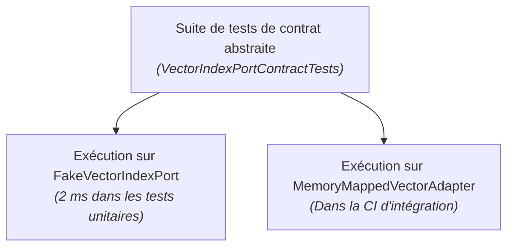

La mise en œuvre de l'architecture hexagonale en C# a profondément évolué au cours des dernières années. Les anciennes approches .NET reposaient sur de lourds arbres d'interfaces, des bibliothèques de mock dynamiques (`Moq`) et des DTOs instanciés sur le tas géré.

Avec **C# 14** et **.NET 10**, le langage met à notre disposition des primitives de haut niveau permettant d'ériger des frontières hexagonales étanches **avec zéro allocation sur le tas et un coût d'exécution quasiment nul.**

---

## 1. Des ports à zéro allocation avec `ReadOnlySpan<T>`

Le risque majeur de baisse de performance en architecture hexagonale réside dans la copie de données à travers les frontières de ports. Si chaque méthode d'un port de sortie alloue des tableaux d'objets, le ramasse-miettes dégrade immédiatement la latence du système.

En .NET 10, les ports peuvent accepter des `ReadOnlySpan<T>` ou des `ReadOnlyMemory<T>`, ce qui autorise le passage de tampons en mémoire sans aucune copie, directement depuis la pile ou des fichiers mappés en mémoire :

```csharp
namespace GA.Domain.Ports.Outbound;

public readonly record struct NeighborMatch(int VoicingId, float Similarity);

public interface IVectorIndexPort
{
    /// <summary>
    /// Recherche les plus proches voisins en SIMD sans aucune allocation sur le tas.
    /// Utilise ReadOnlySpan<float> pour parcourir directement des tampons mappés en mémoire.
    /// </summary>
    int SearchNearest(
        ReadOnlySpan<float> queryVector, 
        Span<NeighborMatch> destinationMatches);
}
```

### Implémentation de l'adaptateur piloté

L'adaptateur implémente ce contrat directement au-dessus de la mémoire non gérée :

```csharp
namespace GA.Infrastructure.Adapters.Vector;

public sealed class MemoryMappedVectorAdapter(SafeBuffer indexMemory, int totalVoicings) : IVectorIndexPort
{
    public unsafe int SearchNearest(
        ReadOnlySpan<float> queryVector, 
        Span<NeighborMatch> destinationMatches)
    {
        byte* ptr = null;
        indexMemory.AcquirePointer(ref ptr);
        try
        {
            float* vectorData = (float*)ptr;
            // Recherche SIMD ultra-rapide sur des floats contigus
            return SimdVectorSearch.FindTopK(
                queryVector, 
                vectorData, 
                totalVoicings, 
                destinationMatches);
        }
        finally
        {
            indexMemory.ReleasePointer();
        }
    }
}
```

Aucun objet n'est alloué sur le tas lors de la recherche. Le vecteur de requête et le tampon de réception peuvent tous deux résider sur la pile grâce à `stackalloc` :

```csharp
// Au cœur d'un Use Case : zéro allocation de bout en bout
Span<float> queryVector = stackalloc float[240];
embeddingService.ComputeOptickVector(chord, queryVector);

Span<NeighborMatch> matches = stackalloc NeighborMatch[10];
int found = vectorIndexPort.SearchNearest(queryVector, matches);
```

---

## 2. Programmation orientée rail (ROP) aux frontières

Dans les architectures .NET traditionnelles, les exceptions sont souvent détournées pour contrôler le flux d'exécution (par exemple en levant `VoicingNotFoundException` ou `ValidationException`).

Lever des exceptions à travers les frontières d'un port présente deux défauts majeurs :
1. **Pénalité de performance drastique** : la capture d'une pile d'appels (stack trace) en .NET coûte plusieurs microsecondes, provoquant des pics de latence notables sous forte charge ;
2. **Perte de contrôle à la compilation** : l'appelant n'a aucune garantie formelle qu'il traite tous les cas d'erreur possibles.

Dans une architecture hexagonale moderne en C#, les ports retournent des types fonctionnels explicites : `Result<T, E>`, `Option<T>` ou `Validation<T>` :

```csharp
namespace GA.Domain.Ports.Inbound;

public interface IRecognizeChordUseCase
{
    Result<RecognizedChord, RecognitionError> Execute(PitchClassSet pitchClasses);
}

public readonly record struct RecognitionError(string Code, string Message);
```

### L'adaptateur moteur gère explicitement les deux voies

```csharp
[HttpPost("recognize")]
public IActionResult Recognize([FromBody] int pitchClassMask)
{
    var pcSet = PitchClassSet.FromMask(pitchClassMask);

    // Invocation du port d'entrée
    Result<RecognizedChord, RecognitionError> result = recognizeUseCase.Execute(pcSet);

    // Filtrage par motif (Pattern Matching) sur la voie de succès et d'échec
    return result.Match<IActionResult>(
        success => Ok(new ChordApiResponse(success.Name, success.Quality)),
        error => error.Code switch
        {
            "AMBIGUOUS_CHORD" => Conflict(new { error.Message }),
            "EMPTY_SET" => BadRequest(new { error.Message }),
            _ => UnprocessableEntity(new { error.Message })
        });
}
```

Le compilateur interdit d'ignorer la possibilité d'erreur.

---

## 3. Dévirtualisation grâce aux membres d'interfaces statiques abstraits

Lorsque des méthodes d'interface sont appelées dans des boucles de calcul serrées, le dispatch virtuel (consultation de la vtable) empêche le JIT d'intégrer le code (*inlining*).

En C# 14 / .NET 10, les **membres d'interfaces statiques abstraits** (Static Abstract Interface Members) permettent de définir des contrats de ports que le compilateur JIT peut entièrement dévirtualiser et inliner lorsqu'ils sont utilisés avec des contraintes génériques :

```csharp
namespace GA.Domain.Ports;

public interface IChordMetric<TSelf> where TSelf : IChordMetric<TSelf>
{
    static abstract float ComputeDistance(in PitchClassSet a, in PitchClassSet b);
}

// Use case utilisant une contrainte générique : inlining complet par le JIT !
public sealed class VoiceLeadingAnalyzer<TMetric> where TMetric : IChordMetric<TMetric>
{
    public float CalculateSmoothness(PitchClassSet from, PitchClassSet to)
    {
        // Zéro appel virtuel : le calcul est directement inliné !
        return TMetric.ComputeDistance(in from, in to);
    }
}
```

---

## 4. Stratégie de tests : privilégier les « Fakes » aux « Mocks »

Les bibliothèques de génération dynamique de mocks (telles que `Moq` ou `NSubstitute`) créent des proxys à l'exécution qui ralentissent les tests, s'avèrent fragiles lors des refactorings et incitent à tester *comment* une méthode est appelée plutôt que *ce qu'elle produit*.

En architecture hexagonale, on conçoit de **fausses implémentations en mémoire (Fakes)** pour les ports de sortie :

```csharp
public sealed class FakeVectorIndexPort : IVectorIndexPort
{
    private readonly List<(int Id, float[] Vector)> _data = [];

    public void Seed(int id, float[] vector) => _data.Add((id, vector));

    public int SearchNearest(ReadOnlySpan<float> queryVector, Span<NeighborMatch> destination)
    {
        int count = 0;
        foreach (var item in _data)
        {
            if (count >= destination.Length) break;
            destination[count++] = new NeighborMatch(item.Id, 0.95f);
        }
        return count;
    }
}
```

### Tests de contrat : garantir la cohérence des adaptateurs

Pour éviter que votre adaptateur factice ne s'écarte du comportement de l'adaptateur de production réel, on met en place des **tests de contrat** : une classe de test abstraite exécutée à la fois contre le Fake et contre l'adaptateur réel.



```csharp
public abstract class VectorIndexPortContractTests
{
    protected abstract IVectorIndexPort CreatePort();

    [Fact]
    public void SearchNearest_RetourneLesMeilleursCandidats()
    {
        var port = CreatePort();
        Span<float> query = stackalloc float[240];
        Span<NeighborMatch> matches = stackalloc NeighborMatch[5];

        int found = port.SearchNearest(query, matches);

        Assert.True(found > 0);
    }
}

// 1. Suite de tests unitaires (instantanée)
public sealed class FakeVectorIndexPortTests : VectorIndexPortContractTests
{
    protected override IVectorIndexPort CreatePort() => new FakeVectorIndexPort();
}

// 2. Suite de tests d'intégration (avec de vrais fichiers en CI)
public sealed class ProductionVectorIndexPortTests : VectorIndexPortContractTests
{
    protected override IVectorIndexPort CreatePort() => new MemoryMappedVectorAdapter(...);
}
```

Les deux adaptateurs sont contractuellement tenus de respecter le même comportement.

---

## 5. Câblage de l'injection de dépendances en .NET 10

Le cœur de l'hexagone ne doit jamais référencer le conteneur d'injection de dépendances (`Microsoft.Extensions.DependencyInjection`).

Chaque projet d'adaptateur fournit ses propres méthodes d'extension :

```csharp
// Dans GA.Infrastructure.Adapters.Vector.csproj
public static class VectorAdapterServiceCollectionExtensions
{
    public static IServiceCollection AddMemoryMappedVectorIndex(
        this IServiceCollection services, 
        string indexPath)
    {
        services.AddSingleton<IVectorIndexPort>(sp => new MemoryMappedVectorAdapter(indexPath));
        return services;
    }
}

// Dans GA.Infrastructure.Adapters.Mcp.csproj
public static class McpAdapterServiceCollectionExtensions
{
    public static IServiceCollection AddGuitarAlchemistMcpTools(this IServiceCollection services)
    {
        services.AddScoped<SearchVoicingsMcpTool>();
        return services;
    }
}
```

L'hôte applicatif (`Program.cs` ou Aspire `AppHost`) agit comme la **racine de composition** (Composition Root) : il référence à la fois le domaine et les adaptateurs, assemblant l'ensemble sans créer de dépendance circulaire entre les projets.
