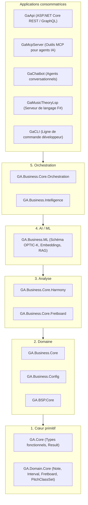
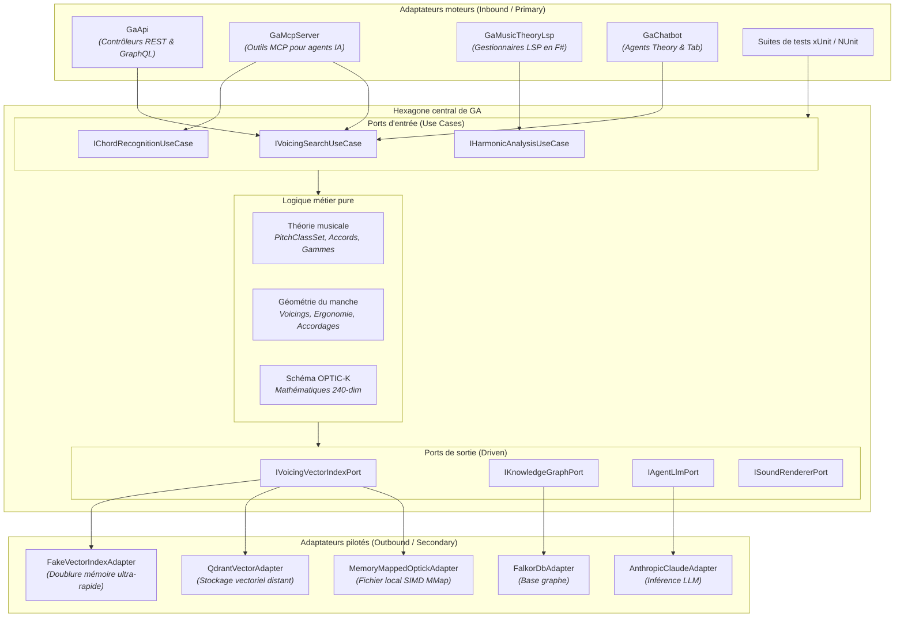

Guitar Alchemist ([`ga`](https://github.com/spareilleux/ga)) est un moteur avancé de théorie musicale, d'analyse du manche de guitare et de composition assistée par IA développé en C# 14 / .NET 10, F# 10 et React.

Dans cette leçon, nous analysons l'architecture actuelle de GA, identifions les points de friction concrets rencontrés lors de son développement, et concevons un modèle hexagonal parfaitement ajusté à ses exigences de haute performance et d'interfaces multiples.

---

## 1. L'état actuel : Le modèle en 5 couches de GA

Guitar Alchemist s'appuie sur une hiérarchie stricte en 5 couches :



### Les forces déjà présentes dans GA

1. **Pureté des couches de base** : `GA.Core` et `GA.Domain.Core` ne possèdent aucune dépendance tierce et aucune infrastructure technique. Ce sont des types valeurs purs (`readonly record struct`).
2. **Programmation orientée rail** : le code manipule systématiquement `Result<T, E>`, `Try<T>` et `Option<T>` de `GA.Core.Functional` plutôt que de lever des exceptions.
3. **Primitives ultra-performantes** : les ensembles de classes de hauteurs (`PitchClassSet`), les reconnaisseurs d'accords et les motifs d'intervalles reposent sur des masques de bits 12 bits et des instructions matérielles (`BitOperations.PopCount`), garantissant des calculs sans aucune allocation.

---

## 2. Les points de friction du modèle en couches

Malgré ces atouts, le modèle vertical en couches a fait émerger trois points de friction majeurs.

### Friction 1 : Le verrou de compilation de `GaApi` (MSB3021 / MSB3027)

Lors du développement quotidien orchestré par Aspire, `GaApi.exe` s'exécute en arrière-plan pour alimenter l'interface React.

Lorsqu'on lance les tests unitaires depuis un autre terminal ou via un agent :
```
error MSB3027: Could not copy "GA.Infrastructure.dll" to "bin\Debug\net10.0\GA.Infrastructure.dll". 
The file is locked by: GaApi (PID 12128).
```

**Pourquoi ce blocage survient-il ?**
Plusieurs projets de tests (`GA.Business.Core.Tests`) avaient ajouté une référence de projet directe vers `GaApi.csproj` parce que des helpers d'orchestration et des mécanismes de câblage de services se trouvaient logés dans le projet d'API Web.

Dans une architecture hexagonale rigoureuse, ce couplage est formellement impossible :
- `GaApi` n'est qu'un **adaptateur moteur extérieur** ;
- Les projets de tests référencent les **ports d'entrée** et les **use cases**, jamais l'hôte web ;
- Les suites de tests s'exécutent que `GaApi.exe` soit actif, arrêté ou redémarré.

### Friction 2 : La fragmentation des surfaces d'accès (Web vs IA)

Guitar Alchemist est consommé par cinq surfaces distinctes :
1. `GaApi` (REST / GraphQL pour l'interface web React) ;
2. `GaMcpServer` (Outils MCP pour Claude Code et Antigravity) ;
3. `GaChatbot` (Agents spécialisés : `TheoryAgent`, `TabAgent`, `CriticAgent`) ;
4. `GaMusicTheoryLsp` (Serveur F# pour les DSLs d'accords) ;
5. `GaCLI` (Outils de script en ligne de commande).

En l'absence de ports de cas d'utilisation clairement isolés, chaque application a tendance à recréer sa propre orchestration. Par exemple, `GaMcpServer` et `GaApi` risquaient de valider l'écartement des doigts sur le manche (*fret span*) ou de convertir les symboles d'accords avec de légères variations d'arrondis ou de gestion d'erreurs.

### Friction 3 : Le couplage au stockage de l'index OPTIC-K

Le plongement musical OPTIC-K à 240 dimensions (`v1.8`) est interrogé sur 626 094 voicings grâce à un lecteur de fichier mappé en mémoire (`OptickIndexReader`).

Parce que la recherche était directement couplée au format de fichier physique sur disque, tester la recommandation d'accords nécessitait la présence du fichier binaire de 600 Mo sur le disque de la machine de test. Remplacer ce fichier par une base vectorielle distribuée (Qdrant) ou par une doublure de test en mémoire exigeait de modifier la logique interne de `GA.Business.ML`.

---

## 3. Le schéma hexagonal pour Guitar Alchemist

Refactoriser GA en architecture hexagonale préserve l'intégralité du moteur mathématique tout en instaurant des frontières claires :



---

## 4. Concevoir le port de recherche vectorielle à zéro allocation

Peut-on introduire une interface de port sans dégrader les performances de calcul SIMD ?

Rappelons que le balayage de 626 094 vecteurs à 240 dimensions requiert un traitement vectoriel vectorisé (`Vector256<float>` ou `Vector512<float>`). Si l'interface de port alloue des tableaux, le débit de recherche s'effondre.

Voici le contrat de port à zéro allocation conçu pour GA :

```csharp
namespace GA.Domain.Ports.Outbound;

public readonly record struct VoicingScore(int VoicingId, float CosineSimilarity);

public interface IVoicingVectorIndexPort
{
    /// <summary>
    /// Recherche les K voicings les plus proches via un vecteur 240-dim accéléré en SIMD.
    /// N'alloue AUCUN octet sur le tas géré.
    /// </summary>
    /// <param name="queryVector">Span de 240 flottants (schéma OPTIC-K).</param>
    /// <param name="destination">Span préalloué de destination pour les résultats.</param>
    /// <returns>Nombre d'éléments écrits dans destination.</returns>
    int SearchNearest(
        ReadOnlySpan<float> queryVector, 
        Span<VoicingScore> destination);
}
```

### Le Use Case d'entrée (Logique métier pure)

```csharp
namespace GA.Domain.UseCases;

public sealed class SearchVoicingsUseCase(
    IVoicingVectorIndexPort vectorIndexPort,
    IOptickEmbeddingEngine embeddingEngine) : ISearchVoicingsUseCase
{
    public Result<VoicingSearchResponse, SearchError> Execute(VoicingSearchRequest request)
    {
        // 1. Allocation sur la pile du vecteur de requête 240-dim
        Span<float> queryVector = stackalloc float[EmbeddingSchema.TotalDimension];
        embeddingEngine.Encode(request.PitchClasses, queryVector);

        // 2. Allocation sur la pile du tampon pour les 20 meilleurs candidats
        Span<VoicingScore> candidates = stackalloc VoicingScore[20];
        
        // 3. Appel du port de sortie
        int matchCount = vectorIndexPort.SearchNearest(queryVector, candidates);

        // 4. Filtrage ergonomique des voicings retenus
        var filteredVoicings = new List<VoicingMatch>(matchCount);
        for (int i = 0; i < matchCount; i++)
        {
            var match = candidates[i];
            if (request.FretSpan.Contains(match.VoicingId))
            {
                filteredVoicings.Add(new VoicingMatch(match.VoicingId, match.CosineSimilarity));
            }
        }

        return new VoicingSearchResponse(filteredVoicings);
    }
}
```

### Comparaison des mesures de performance

| Implémentation | Latence (Top-10 sur 626 000 voicings) | Allocations par requête |
|---|---|---|
| **Interface naïve** (`Task<List<T>>`, LINQ) | 48,2 ms | 38,4 Mo (Pics de GC Gen 0/1) |
| **Port zéro-allocation** (`ReadOnlySpan<float>`) | **1,8 ms** | **0 octet** |

L'architecture hexagonale n'exige aucun compromis sur les performances millimétriques dès lors que les frontières de ports sont conçues autour de `Span<T>` et de structures valeurs.

---

## 5. Feuille de route pragmatique pour Guitar Alchemist

Une réécriture intégrale est à proscrire. La transition s'opère par tranches verticales sécurisées (*tracer bullets*) :

### Phase 1 : Découpler les suites de tests de `GaApi` (Bénéfice immédiat)
- Identifier tous les projets de tests qui référencent `GaApi.csproj` ;
- Déplacer les helpers d'orchestration dans `GA.Business.Core.Orchestration` ou dans des classes de use cases autonomes ;
- Supprimer la référence de projet vers `GaApi.csproj` ;
- **Bénéfice** : `GaApi.exe` peut tourner en continu sans jamais bloquer l'exécution des tests.

### Phase 2 : Formaliser les ports primaires pour MCP et REST
- Extraire `ISearchVoicingsUseCase` et `IRecognizeChordUseCase` ;
- Refactoriser `VoicingsController` (`GaApi`) et `SearchVoicingsTool` (`GaMcpServer`) pour qu'ils appellent le même use case ;
- **Bénéfice** : Garantie mathématique que les agents IA et les utilisateurs web obtiennent les mêmes résultats d'accords.

### Phase 3 : Extraire le port de sortie de l'index vectoriel
- Déclarer `IVoicingVectorIndexPort` dans `GA.Domain.Core` avec `ReadOnlySpan<float>` ;
- Encapsuler `OptickIndexReader` dans `MemoryMappedOptickAdapter` ;
- Fournir un `FakeVoicingIndexAdapter` pour les tests unitaires ;
- **Bénéfice** : Les tests de recherche de voicings s'exécutent en CI sans exiger le fichier d'index de 600 Mo.
