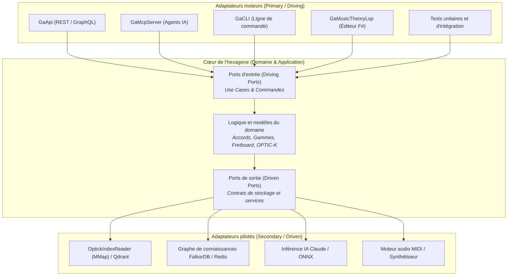

:::note[Environnement du cours]
Le code et les benchmarks architecturaux de ce cours sont conçus avec le [.NET SDK](https://dotnet.microsoft.com/download) **10.0.112** et s'exécutent sur .NET **10.0.12**, avec les fonctionnalités de C# 14 activées. L'étude de cas examine de vrais composants de production issus de [Guitar Alchemist](https://github.com/spareilleux/ga) : `GA.Domain.Core`, `GA.Business.ML`, `GaApi` et `GaMcpServer`.
:::

## Pourquoi j'apprends ceci

Dans l'architecture classique en couches (Présentation &rarr; Logique métier &rarr; Accès aux données), la base de données se situe à la racine même de l'arbre des dépendances. Au fil du temps, le schéma de la base dicte la structure des modèles métier, les annotations d'ORM polluent les entités du domaine, les contrôleurs s'alourdissent de logique d'orchestration, et les tests unitaires deviennent impossibles sans lancer des conteneurs Docker ou configurer des fixtures de base de données.

Dans un domaine riche et complexe comme [Guitar Alchemist](../music-theory-ga/) — combinant théorie musicale formelle, plongements vectoriels OPTIC-K à 240 dimensions, orchestration d'agents IA, une API Web, un serveur MCP pour les agents de programmation, un serveur de langage F# (LSP) et un manche 3D en temps réel —, le modèle en couches traditionnel génère des couplages pénalisants :

- **Verrous de compilation et fragilité des tests** : des services en cours d'exécution (comme `GaApi.exe`) verrouillent les fichiers DLL partagés, empêchant la compilation des suites de tests qui référencent le projet web.
- **Fragmentation des surfaces d'accès** : l'API Web (`GaApi`), le serveur Model Context Protocol (`GaMcpServer`), le LSP F# (`GaMusicTheoryLsp`) et le CLI (`GaCLI`) souhaitent tous invoquer les mêmes use cases théoriques, mais finissent par dupliquer l'orchestration ou par se coupler aux modèles de requêtes HTTP.
- **Verrouillage technologique** : la recherche vectorielle est liée à des fichiers mappés en mémoire locaux ; basculer vers Qdrant ou un bouchon de test en mémoire exige de modifier la logique métier.

L'**Architecture hexagonale** (aussi connue sous le nom de *Ports et adaptateurs*), formulée par Alistair Cockburn en 2005, résout ces écueils en inversant la perspective : **le domaine métier est placé au centre, et l'infrastructure technique (HTTP, bases de données, index vectoriels, modèles IA) est reléguée à la périphérie sous forme d'adaptateurs interchangeables.**

## À qui s'adresse ce cours

Vous êtes un développeur C# ou .NET maîtrisant l'injection de dépendances et le C# moderne (C# 12 à 14). Vous avez déjà conçu des APIs Web et manipulé des architectures en couches ou en oignon, mais vous souhaitez comprendre :

1. En quoi les Ports et Adaptateurs se distinguent fondamentalement des architectures en couches classiques et de la Clean Architecture ;
2. Les compromis réels : volume de code, indirection, et le **coût de performance** (dispatch virtuel, allocations sur le tas, coût du passage des spans) ;
3. Comment concevoir des ports à zéro allocation en .NET 10 avec `ReadOnlySpan<T>`, les interfaces statiques abstraites et la programmation orientée rail (`Result<T, E>`) ;
4. Comment appliquer ce modèle à une base de code de production exigeante en calcul et en IA (Guitar Alchemist).

## À la fin de ce cours, je serai capable de

- Expliquer la symétrie des Ports et Adaptateurs et la stricte application du principe d'inversion des dépendances (DIP) ;
- Distinguer précisément l'architecture hexagonale de l'architecture en oignon (Onion) et de la Clean Architecture ;
- Déterminer avec discernement quand l'architecture hexagonale est indispensable et quand elle relève de la sur-ingénierie ;
- Concevoir des frontières de ports à zéro allocation en C# 14 avec `ReadOnlySpan<T>` et des types valeurs ;
- Structurer la gestion d'erreurs aux frontières avec la programmation orientée rail, sans lever d'exceptions ;
- Unifier de multiples surfaces d'accès (REST, MCP, CLI, LSP) autour de use cases partagés ;
- Supprimer définitivement les conflits de verrous de fichiers DLL et le couplage des tests dans les solutions .NET multi-projets ;
- Déployer une feuille de route pragmatique pour migrer une architecture en couches vers un modèle hexagonal.

## Sommaire

| # | Leçon | Ce que vous allez apprendre |
|---|---|---|
| 1 | [Principes et fondations](01-principles-and-foundations/) | Intérieur vs extérieur, ports primaires et secondaires, adaptateurs, et comparaison avec Onion/Clean Architecture |
| 2 | [Compromis et critique architecturale](02-trade-offs-and-critique/) | Testabilité, parité multi-surfaces, indépendance technique face au surplus de code, à l'indirection et au coût de performance |
| 3 | [L'architecture hexagonale en C# moderne](03-hexagonal-csharp-dotnet/) | Ports sans allocation, `ReadOnlySpan<T>`, `Result<T, E>`, interfaces statiques abstraites et tests avec des fakes plutôt que des mocks |
| 4 | [Étude de cas : Guitar Alchemist](04-guitar-alchemist-case-study/) | Analyse des 5 couches de GA, résolution du verrou de compilation `GaApi`, parité IA/MCP et ports de recherche vectorielle SIMD |
| 5 | [Journal](journal/) | Notes de progression, benchmarks, décisions d'architecture et questions ouvertes |

## Ressources

- Alistair Cockburn, [*Hexagonal Architecture (Ports and Adapters)*](https://alistair.cockburn.us/hexagonal-architecture/) (article originel de 2005)
- Jeffrey Palermo, [*The Onion Architecture*](https://jeffreypalermo.com/2008/07/the-onion-architecture-part-1/) (2008)
- Robert C. Martin, [*The Clean Architecture*](https://blog.cleancoder.com/uncle-bob/2012/08/13/the-clean-architecture.html) (2012)
- Vaughn Vernon, *Implementing Domain-Driven Design*, Addison-Wesley, 2013 (Chapitre 4 : Architecture)
- Dépôt Guitar Alchemist : [`AllProjects.slnx`](https://github.com/spareilleux/ga)
