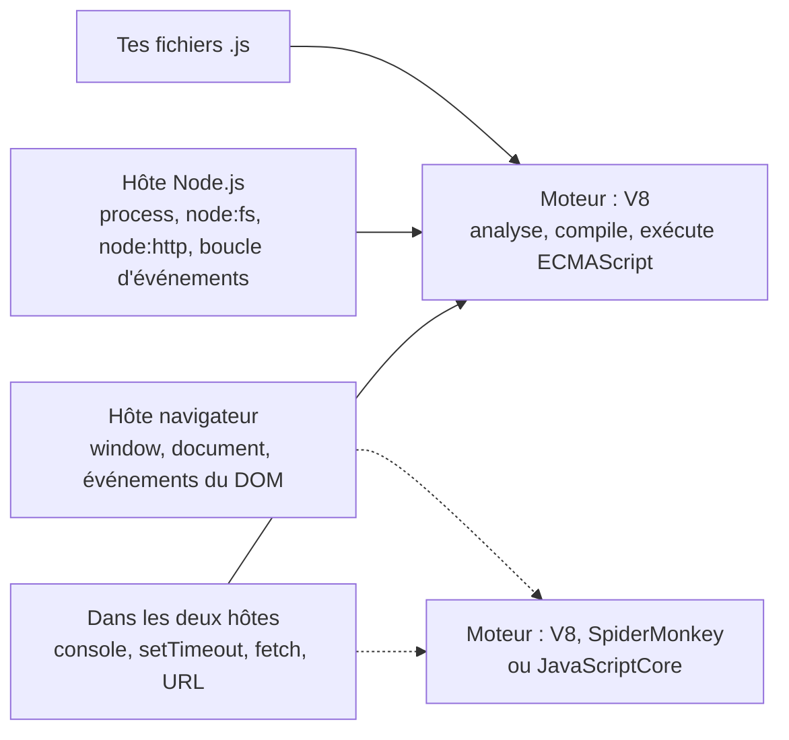

import { Tabs, TabItem } from '@astrojs/starlight/components';

Code : [`examples/l01_hello.js`](https://github.com/spareilleux/learn/blob/c65efe4fb76e61efd229793b296d3d7a44e71baf/code/javascript-for-csharp-java/examples/l01_hello.js), les projets [`l01-esm`](https://github.com/spareilleux/learn/tree/c65efe4fb76e61efd229793b296d3d7a44e71baf/code/javascript-for-csharp-java/l01-esm), [`l01-cjs`](https://github.com/spareilleux/learn/tree/c65efe4fb76e61efd229793b296d3d7a44e71baf/code/javascript-for-csharp-java/l01-cjs) et [`l01-interop`](https://github.com/spareilleux/learn/tree/c65efe4fb76e61efd229793b296d3d7a44e71baf/code/javascript-for-csharp-java/l01-interop), et les snippets d'erreur dans [`errors/`](https://github.com/spareilleux/learn/tree/c65efe4fb76e61efd229793b296d3d7a44e71baf/code/javascript-for-csharp-java/errors).

## Un moteur et un hôte

En .NET et en Java, un seul produit te donne le langage, le runtime et la bibliothèque standard. JavaScript les sépare en trois :

| | C# | Java | JavaScript |
|---|---|---|---|
| Le langage | C#, compilé par Roslyn | Java, compilé par `javac` | [ECMAScript](https://tc39.es/ecma262/), analysé par le moteur au chargement |
| Le runtime | le CLR | la JVM | un moteur : [V8](https://v8.dev/), [SpiderMonkey](https://spidermonkey.dev/) ou [JavaScriptCore](https://docs.webkit.org/Deep%20Dive/JSC/JavaScriptCore.html) |
| Fichiers, réseau, processus | la bibliothèque de classes de base | le JDK | l'hôte : Node.js, Deno, Bun, ou un navigateur |

La spécification ECMAScript définit les valeurs, les objets, les fonctions, `Array`, `Map`, `JSON` et `Promise`, et rien qui touche au monde extérieur : pas de fichiers, pas de réseau, pas même `console.log`. C'est l'hôte qui les ajoute. Node.js embarque V8 et ajoute des modules comme `node:fs`, un objet `process` et une boucle d'événements ; un navigateur embarque son moteur et ajoute `document` et `window`.



Le même langage donne donc des globales différentes selon l'endroit où il s'exécute :

```text
> node -p "typeof window"
undefined
> node -p "typeof process"
object
> node -p "process.versions.v8"
13.6.233.17-node.53
```

Ce cours exécute tout dans Node.js. Le navigateur est le sujet de la leçon 12, et le DOM appartient au cours React.

## Installer Node.js 24

Node.js publie une version majeure tous les six mois. Les versions paires deviennent des versions à support long terme (LTS) en octobre, et chaque version LTS est supportée pendant environ 30 mois ([calendrier des versions](https://github.com/nodejs/Release#release-schedule)) :

| | Sortie | LTS à partir de | Fin de vie |
|---|---|---|---|
| Node.js 22 « Jod » | avril 2024 | octobre 2024 | avril 2027 |
| Node.js 24 « Krypton » | mai 2025 | octobre 2025 | avril 2028 |
| Node.js 26 | mai 2026 | octobre 2026 | avril 2029 |

C'est proche de .NET, où [chaque version paire est LTS](https://learn.microsoft.com/dotnet/core/releases-and-support) pendant trois ans, et de Java, où [une nouvelle version LTS sort tous les deux ans](https://www.oracle.com/java/technologies/java-se-support-roadmap.html). Ce cours utilise Node.js **24.21.0**, la dernière version 24 au 14 septembre 2026.

<Tabs syncKey="os">
<TabItem label="Windows">

J'ai téléchargé l'archive ZIP, vérifié son SHA-256 avec la liste que publie Node.js, et je l'ai décompressée dans un dossier à part, en dehors du `PATH` global :

```powershell
Invoke-WebRequest https://nodejs.org/dist/v24.21.0/node-v24.21.0-win-x64.zip -OutFile node-v24.21.0-win-x64.zip
(Get-FileHash node-v24.21.0-win-x64.zip -Algorithm SHA256).Hash.ToLower()
(Invoke-RestMethod https://nodejs.org/dist/v24.21.0/SHASUMS256.txt) -split "`n" | Select-String 'win-x64.zip'
Expand-Archive node-v24.21.0-win-x64.zip -DestinationPath C:\tools   # crée C:\tools\node-v24.21.0-win-x64
C:\tools\node-v24.21.0-win-x64\node.exe --version
```

Les deux empreintes doivent être identiques : sur ma machine, les deux valaient `158f7685…e541`, et les quatre commandes ont pris 22 secondes. Ajoute le dossier à ton `PATH` pour appeler `node` et `npm` depuis n'importe quel terminal.

L'installeur est une autre option : `winget install OpenJS.NodeJS.LTS` (*à vérifier* : je ne l'ai pas exécuté). Le 14 septembre 2026, `winget show OpenJS.NodeJS.LTS` proposait encore 24.19.0, deux versions de retard.

</TabItem>
<TabItem label="Linux / WSL">

[nvm](https://github.com/nvm-sh/nvm) installe des versions de Node.js dans ton dossier personnel et bascule de l'une à l'autre, comme un `global.json` pour tout le shell (*à vérifier* : je n'ai pas exécuté ces commandes) :

```bash
curl -o- https://raw.githubusercontent.com/nvm-sh/nvm/v0.40.7/install.sh | bash
# ouvre un nouveau terminal, puis :
nvm install 24.21.0
node --version
```

Les archives de [nodejs.org/dist](https://nodejs.org/dist/v24.21.0/) (`node-v24.21.0-linux-x64.tar.xz`) sont l'autre voie, avec le même `SHASUMS256.txt` que sous Windows.

**Sous WSL**, installe Node.js *dans* la distribution et garde tes projets dans le système de fichiers Linux (`~/src/...`), pas sous `/mnt/c` : un dossier `node_modules` contient des milliers de petits fichiers, et [lire des fichiers Windows depuis Linux est plus lent](https://learn.microsoft.com/windows/wsl/filesystems#file-storage-and-performance-across-file-systems).

</TabItem>
<TabItem label="macOS">

L'installeur macOS (`node-v24.21.0.pkg`) est sur [nodejs.org/dist](https://nodejs.org/dist/v24.21.0/), et nvm fonctionne sous macOS comme sous Linux. Avec [Homebrew](https://formulae.brew.sh/formula/node@24) (*à vérifier* : je ne l'ai pas exécuté) :

```bash
brew install node@24
echo 'export PATH="$(brew --prefix node@24)/bin:$PATH"' >> ~/.zshrc   # node@24 est keg-only : pas lié par défaut
node --version
```

</TabItem>
</Tabs>

Ensuite, sur n'importe quel OS :

```text
> node --version
v24.21.0
> npm --version
11.19.0
```

npm est fourni avec Node.js : chaque version de Node.js embarque une version de npm.

## Exécuter du JavaScript

```js
// examples/l01_hello.js
const names = process.argv.slice(2); // argv[0] est node, argv[1] est ce fichier
console.log('Hello, world!');
for (const name of names) {
  console.log(`Hello, ${name}!`);
}
```

```text
> node examples/l01_hello.js Ada Grace
Hello, world!
Hello, Ada!
Hello, Grace!
```

| | C# | Java | Node.js |
|---|---|---|---|
| Exécuter un fichier | `dotnet run app.cs` ([.NET 10](https://learn.microsoft.com/dotnet/core/sdk/file-based-apps)) | [`java Hello.java`](https://openjdk.org/jeps/330) | `node hello.js` |
| Évaluer une expression | — | — | `node -p "0.1 + 0.2"` |
| Shell interactif | C# Interactive dans Visual Studio | [`jshell`](https://docs.oracle.com/en/java/javase/25/jshell/introduction-jshell.html) | `node`, puis `.exit` |
| Relancer à chaque modification | `dotnet watch` | — | [`node --watch hello.js`](https://nodejs.org/docs/latest-v24.x/api/cli.html#--watch) |
| Arguments du programme | `args` | `String[] args` | [`process.argv`](https://nodejs.org/docs/latest-v24.x/api/process.html#processargv), à partir de l'indice 2 |

Il n'y a pas d'étape de compilation à lancer : Node.js lit le source, V8 le compile à la volée. `console.log` est le `Console.WriteLine` de JavaScript ; les template literals, entre backticks, interpolent comme `$"…"` en C#. La [leçon 2](../02-values-and-types/) explique `const`.

## npm et package.json

Un dossier devient un projet quand il a un `package.json`. [`npm init -y`](https://docs.npmjs.com/cli/v11/commands/npm-init) en écrit un avec des valeurs par défaut :

```text
> npm init -y
Wrote to C:\…\npmdemo\package.json:

{
  "name": "npmdemo",
  "version": "1.0.0",
  "description": "",
  "main": "index.js",
  "scripts": {
    "test": "echo \"Error: no test specified\" && exit 1"
  },
  "keywords": [],
  "author": "",
  "license": "ISC",
  "type": "commonjs"
}
```

npm 11.19 écrit `"type": "commonjs"` explicitement ; la [section sur les modules](#modules--modules-es-et-commonjs) plus bas explique pourquoi ce champ compte. Installer un package l'ajoute à `dependencies`, le télécharge dans `node_modules`, et écrit `package-lock.json` :

```text
> npm install semver@7.7.2

added 1 package, and audited 2 packages in 782ms

found 0 vulnerabilities
```

```json
  "dependencies": {
    "semver": "^7.7.2"
  }
```

| | NuGet | Maven | npm |
|---|---|---|---|
| Manifeste | `.csproj`, `<PackageReference>` | `pom.xml`, `<dependency>` | [`package.json`](https://docs.npmjs.com/cli/v11/configuring-npm/package-json), `dependencies` |
| Build ou tests seulement | `PrivateAssets="all"` | `<scope>test</scope>` | `devDependencies` |
| Une version écrite `7.7.2` | signifie 7.7.2 ou plus ([gestion des versions NuGet](https://learn.microsoft.com/nuget/concepts/package-versioning)) | une exigence souple de 7.7.2 ([référence du POM](https://maven.apache.org/pom.html#Dependency_Version_Requirement_Specification)) | exactement 7.7.2 |
| Plage par défaut quand tu ajoutes un package | la version, comme minimum | la version | `^7.7.2` : 7.7.2 ou plus, en dessous de 8.0.0 ([semver](https://docs.npmjs.com/about-semantic-versioning)) |
| Fichier de verrouillage | `packages.lock.json`, [sur option](https://learn.microsoft.com/nuget/consume-packages/package-references-in-project-files#locking-dependencies) | aucun | [`package-lock.json`](https://docs.npmjs.com/cli/v11/configuring-npm/package-lock-json), toujours |
| Où vont les packages | un cache partagé, `~/.nuget/packages` | un cache partagé, `~/.m2/repository` | un dossier `node_modules` dans chaque projet, rempli depuis un cache |
| Restaurer exactement le fichier de verrouillage | `dotnet restore --locked-mode` | — | [`npm ci`](https://docs.npmjs.com/cli/v11/commands/npm-ci) |
| Lancer un outil d'un package | `dotnet tool run` | un goal de plugin | `npx <tool>` |

Commite `package.json` et `package-lock.json`, jamais `node_modules`. En CI, `npm ci` supprime `node_modules` et installe exactement ce que liste le fichier de verrouillage, ou échoue si le fichier de verrouillage ne correspond pas à `package.json`.

### Scripts

Les `scripts` de `package.json` sont des commandes nommées, ce qui se rapproche le plus des targets MSBuild ou des goals Maven. [`l01-esm/package.json`](https://github.com/spareilleux/learn/blob/c65efe4fb76e61efd229793b296d3d7a44e71baf/code/javascript-for-csharp-java/l01-esm/package.json) en a deux :

```json
{
  "name": "l01-esm",
  "version": "1.0.0",
  "private": true,
  "type": "module",
  "scripts": {
    "start": "node main.js",
    "greet": "node main.js Ada Grace"
  }
}
```

`npm run` affiche le script avant de l'exécuter ; [`node --run`](https://nodejs.org/docs/latest-v24.x/api/cli.html#--run), ajouté dans Node.js 22, l'exécute sans npm :

```text
> npm run greet

> l01-esm@1.0.0 greet
> node main.js Ada Grace

Hello, Ada!
Hello, Grace!
Bye, Ada!
l01-esm: main.js, typeof require = undefined
> node --run greet
Hello, Ada!
Hello, Grace!
Bye, Ada!
l01-esm: main.js, typeof require = undefined
```

Les deux ajoutent `node_modules/.bin` au `PATH`, si bien qu'un script peut appeler par leur nom les outils des packages installés. `node --run` ignore [volontairement](https://nodejs.org/docs/latest-v24.x/api/cli.html#intentional-limitations) les scripts `pre` et `post` que npm exécute autour d'un script (exercice 2).

### Dans de vrais projets

Le [`package.json`](https://github.com/spareilleux/learn/blob/c65efe4fb76e61efd229793b296d3d7a44e71baf/package.json#L1-L12) de ce site déclare `"type": "module"` et des scripts qui appellent [Astro](https://docs.astro.build/) : `npm run build` exécute `astro build`, trouvé dans `node_modules/.bin`.

GuitarAlchemist/ga montre deux pièges d'un projet JavaScript maintenu par des développeurs C# :

- [`Apps/ga-client`](https://github.com/GuitarAlchemist/ga/tree/a826864f3a012cad88e415954bf57eca0ce12aa6/Apps/ga-client) a à la fois un `package-lock.json` et un `pnpm-lock.yaml`. Ce sont les fichiers de verrouillage de deux gestionnaires de packages, npm et [pnpm](https://pnpm.io/), et rien ne les maintient d'accord : un développeur qui lance `npm install` et un autre qui lance `pnpm install` peuvent obtenir des versions différentes de la même dépendance.
- [`ReactComponents/ga-react-components/package.json`](https://github.com/GuitarAlchemist/ga/blob/a826864f3a012cad88e415954bf57eca0ce12aa6/ReactComponents/ga-react-components/package.json#L71) liste `@esbuild/win32-x64` dans `devDependencies`. Ce package déclare `"os": ["win32"]`, et npm refuse de l'installer ailleurs. La CI du cours l'installe sur les trois OS : ça marche sous Windows, et sous Linux npm s'arrête avec :

```text
npm error code EBADPLATFORM
npm error notsup Unsupported platform for @esbuild/win32-x64@0.25.12: wanted {"os":"win32","cpu":"x64"} (current: {"os":"linux","cpu":"x64"})
npm error notsup Valid os:   win32
npm error notsup Actual os:  linux
npm error notsup Valid cpu:  x64
npm error notsup Actual cpu: x64
```

macOS échoue de la même façon. Le dossier n'a qu'un `pnpm-lock.yaml`, et pnpm 10 a installé sans un mot un package pour un autre OS sur ma machine, donc le projet s'installe probablement avec pnpm sur tous les OS, mais pas avec npm (*à vérifier* sous Linux et macOS). La correction habituelle consiste à laisser de côté les packages de plateforme : esbuild les liste tous en `optionalDependencies`, et chaque gestionnaire de packages installe celui qui correspond.

## Modules : modules ES et CommonJS

Node.js a deux systèmes de modules. CommonJS est arrivé en premier, avec Node.js en 2009 : `require` charge un fichier, `module.exports` est ce qu'il exporte. Les modules ES sont arrivés avec le langage dans ECMAScript 2015, et c'est ce que comprennent les navigateurs : `import` et `export`.

| | CommonJS | Modules ES |
|---|---|---|
| Import | `const { hello } = require('./greet')` | `import { hello } from './greet.js'` |
| Export | `module.exports = { hello }` | `export function hello…` |
| Extension de fichier dans le chemin | optionnelle | obligatoire |
| Chargement | synchrone, quand `require` s'exécute | les imports sont résolus avant que le module s'exécute |
| Mode strict ([leçon 3](../03-functions-and-scope/#mode-strict)) | seulement avec `'use strict'` | toujours |
| `await` au niveau supérieur | non | oui |
| Le dossier du fichier courant | `__dirname` | [`import.meta.dirname`](https://nodejs.org/docs/latest-v24.x/api/esm.html#importmetadirname) |

Dans les deux, un module est un **fichier** : il n'y a pas d'espace de noms qui s'étende sur plusieurs fichiers, et rien n'est visible des autres fichiers sans être exporté. Par rapport à C#, `export` est `public`, tout le reste est `private` au fichier, et `import` nomme le fichier là où un `using` nommerait un espace de noms.

### Comment Node.js décide

Node.js [choisit le système de modules](https://nodejs.org/docs/latest-v24.x/api/packages.html#determining-module-system) fichier par fichier :

1. un fichier `.mjs` est un module ES, un fichier `.cjs` est du CommonJS ;
2. un fichier `.js` suit le champ `"type"` du `package.json` le plus proche, `"module"` ou `"commonjs"` ;
3. un fichier `.js` sans `"type"` au-dessus de lui est analysé comme CommonJS, puis analysé à nouveau comme module ES s'il contient `import` ou `export` ([détection de syntaxe](https://nodejs.org/docs/latest-v24.x/api/packages.html#syntax-detection)).

Le troisième cas fonctionne, avec un avertissement. [`l01-interop/package.json`](https://github.com/spareilleux/learn/blob/c65efe4fb76e61efd229793b296d3d7a44e71baf/code/javascript-for-csharp-java/l01-interop/package.json) n'a pas de `"type"`, et `detect.js` contient un `import` :

```text
> node detect.js
(node:PID) [MODULE_TYPELESS_PACKAGE_JSON] Warning: Module type of l01-interop/detect.js is not specified and it doesn't parse as CommonJS.
Reparsing as ES module because module syntax was detected. This incurs a performance overhead.
To eliminate this warning, add "type": "module" to l01-interop/package.json.
(Use `node --trace-warnings ...` to show where the warning was created)
8 undefined
```

:::note[Les sorties d'erreur de ce cours]
Node.js affiche des chemins absolus, un identifiant de processus et une stack trace dont les frames nomment ses fichiers internes. Les sorties des leçons montrent les chemins relatifs au dossier du cours, `PID` pour l'identifiant de processus, et aucune frame `at …` ; [`normalize.mjs`](https://github.com/spareilleux/learn/blob/c65efe4fb76e61efd229793b296d3d7a44e71baf/code/javascript-for-csharp-java/normalize.mjs) fait les mêmes modifications avant que la CI les compare. Tout le reste est la sortie de Node.js 24.21.0, identique sous Windows, Linux et macOS.
:::

### Le même programme, deux fois

La version module ES, dans un package avec `"type": "module"` :

```js
// l01-esm/greet.js
// Un module ES : ce qu'il exporte est déclaré avec export, tout le reste reste privé au fichier
const punctuation = '!';

export function hello(name) {
  return `Hello, ${capitalize(name)}${punctuation}`;
}

export default function farewell(name) {
  return `Bye, ${capitalize(name)}${punctuation}`;
}

function capitalize(text) {
  return text.charAt(0).toUpperCase() + text.slice(1);
}
```

```js
// l01-esm/main.js
// "type": "module" dans package.json : les fichiers .js sont des modules ES
import { readFile } from 'node:fs/promises';
import path from 'node:path';
import farewell, { hello } from './greet.js'; // l'extension est obligatoire

const names = process.argv.length > 2 ? process.argv.slice(2) : ['world'];
for (const name of names) {
  console.log(hello(name));
}
console.log(farewell(names[0]));

// Pas de __dirname dans un module ES : import.meta donne l'emplacement du module lui-même
const manifest = JSON.parse(await readFile(path.join(import.meta.dirname, 'package.json'), 'utf8')); // await au niveau supérieur
console.log(`${manifest.name}: ${path.basename(import.meta.filename)}, typeof require = ${typeof require}`);
```

```text
> node main.js
Hello, World!
Bye, World!
l01-esm: main.js, typeof require = undefined
```

Un module a un nombre quelconque d'exports *nommés* et au plus un export *par défaut* ; `import farewell, { hello }` prend celui par défaut sous un nom que tu choisis, et `hello` sous son propre nom. Les modules intégrés commencent par `node:`.

La version CommonJS, dans un package avec `"type": "commonjs"` :

```js
// l01-cjs/greet.js
// Un module CommonJS : ce qu'il exporte est ce qui se retrouve dans module.exports
const punctuation = '!';

function hello(name) {
  return `Hello, ${capitalize(name)}${punctuation}`;
}

function capitalize(text) {
  return text.charAt(0).toUpperCase() + text.slice(1);
}

module.exports = { hello };
```

```js
// l01-cjs/main.js
// "type": "commonjs" dans package.json : les fichiers .js sont des modules CommonJS
const fs = require('node:fs');
const path = require('node:path');
const { hello } = require('./greet'); // l'extension peut être omise

const names = process.argv.length > 2 ? process.argv.slice(2) : ['world'];
for (const name of names) {
  console.log(hello(name));
}

const manifest = JSON.parse(fs.readFileSync(path.join(__dirname, 'package.json'), 'utf8'));
console.log(`${manifest.name}: ${path.basename(__filename)}, typeof require = ${typeof require}`);
```

```text
> node main.js Ada
Hello, Ada!
l01-cjs: main.js, typeof require = function
```

### Les mélanger

`require` dans un module ES. Le [`package.json`](https://github.com/spareilleux/learn/blob/c65efe4fb76e61efd229793b296d3d7a44e71baf/code/javascript-for-csharp-java/package.json) du dossier du cours indique `"type": "module"` :

```js
// errors/l01_require_in_esm.js
const fs = require('node:fs');
console.log(fs.existsSync('package.json'));
```

```text
errors/l01_require_in_esm.js:2
const fs = require('node:fs');
           ^

ReferenceError: require is not defined in ES module scope, you can use import instead
This file is being treated as an ES module because it has a '.js' file extension and 'package.json' contains "type": "module". To treat it as a CommonJS script, rename it to use the '.cjs' file extension.

Node.js v24.21.0
```

`import` dans un fichier CommonJS :

```js
// errors/l01_import_in_cjs.cjs
import { readFileSync } from 'node:fs';
console.log(readFileSync);
```

```text
(node:PID) Warning: Failed to load the ES module: errors/l01_import_in_cjs.cjs. Make sure to set "type": "module" in the nearest package.json file or use the .mjs extension.
(Use `node --trace-warnings ...` to show where the warning was created)
errors/l01_import_in_cjs.cjs:2
import { readFileSync } from 'node:fs';
^^^^^^

SyntaxError: Cannot use import statement outside a module

Node.js v24.21.0
```

L'erreur qui surprend le plus les développeurs C# et Java, et les développeurs TypeScript aussi : un import de module ES sans son extension.

```js
// errors/l01_missing_extension.js
import { show } from '../examples/show';
show('never', 'printed');
```

Exécuté depuis le dossier `errors` :

```text
node:internal/modules/run_main:107
    triggerUncaughtException(
    ^

Error [ERR_MODULE_NOT_FOUND]: Cannot find module 'examples/show' imported from errors/l01_missing_extension.js
Did you mean to import "../examples/show.js"?
{
  code: 'ERR_MODULE_NOT_FOUND',
  url: 'examples/show'
}

Node.js v24.21.0
```

Exécuté depuis le dossier du cours, avec `node errors/l01_missing_extension.js`, le même fichier donne la même erreur *sans* la ligne `Did you mean to import "../examples/show.js"?`. Pour trouver cette suggestion, Node.js demande au résolveur CommonJS où `require` aurait trouvé le fichier ([`resolve.js`, lignes 888-895](https://github.com/nodejs/node/blob/v24.21.0/lib/internal/modules/esm/resolve.js#L888-L895)), mais il donne au résolveur un module parent sans nom de fichier, et pour un tel parent le résolveur cherche les chemins relatifs à partir du dossier courant ([`loader.js`, lignes 1021-1028](https://github.com/nodejs/node/blob/v24.21.0/lib/internal/modules/cjs/loader.js#L1021-L1028)). La suggestion n'apparaît que si `../examples/show.js` existe aussi relativement à l'endroit où tu as tapé la commande. L'erreur elle-même est juste dans les deux cas : ajoute l'extension.

### Utiliser l'un depuis l'autre

Un module ES peut importer un module CommonJS. `module.exports` devient l'export par défaut, et Node.js [trouve les exports nommés](https://nodejs.org/docs/latest-v24.x/api/esm.html#commonjs-namespaces) en lisant le source à la recherche d'affectations comme `exports.half = …` :

```js
// l01-interop/legacy.cjs
exports.half = (n) => n / 2;
exports.kind = 'CommonJS';
```

```js
// l01-interop/from-esm.mjs
import legacy, { half } from './legacy.cjs';

console.log('default import:', legacy);
console.log('named import:  ', half(3));
```

```text
default import: { half: [Function (anonymous)], kind: 'CommonJS' }
named import:   1.5
```

L'autre sens, `require` d'un module ES, était autrefois impossible. Il fonctionne sans option depuis Node.js 22.12, et la documentation de Node.js 24 [ne le qualifie plus d'expérimental](https://nodejs.org/docs/latest-v24.x/api/modules.html#loading-ecmascript-modules-using-require), tant que le module n'utilise pas de `await` au niveau supérieur :

```js
// l01-interop/modern.mjs
export const twice = (n) => n * 2;
export default 'ES module';
```

```js
// l01-interop/from-cjs.cjs
const modern = require('./modern.mjs');

console.log(modern);
console.log(modern.twice(21), modern.default);
```

```text
[Module: null prototype] {
  __esModule: true,
  default: 'ES module',
  twice: [Function: twice]
}
42 ES module
```

GuitarAlchemist/ga utilise les extensions comme prévu : ses front ends sont des packages `"type": "module"`, et le seul fichier de configuration écrit avec `module.exports` s'appelle [`postcss.config.cjs`](https://github.com/GuitarAlchemist/ga/blob/a826864f3a012cad88e415954bf57eca0ce12aa6/Apps/ga-client/postcss.config.cjs) : nommé `.js`, ce serait un module ES, où `module` n'existe pas. Ce site nomme ses scripts `.mjs`, comme `scripts/sync-streeling.mjs`, ce qui est redondant sous `"type": "module"` et reste correct si le champ est retiré.

**Lequel écrire ?** Les modules ES, pour du nouveau code : ce sont le standard, le format du navigateur, et ce que TypeScript et les bundlers produisent par défaut. Tu rencontres encore CommonJS dans des packages plus anciens et des fichiers de configuration.

## À retenir

- ECMAScript est le langage ; V8 est le moteur ; Node.js est un hôte qui ajoute les fichiers, les processus et les modules. Un navigateur est un autre hôte.
- Node.js 24 est la ligne LTS active jusqu'en octobre 2026 et reste supportée jusqu'en avril 2028 ; npm est fourni avec.
- `package.json` est le manifeste et `package-lock.json` le fichier de verrouillage ; commite les deux, et installe en CI avec `npm ci`.
- `npm install` écrit des plages `^` : toute version mineure ou corrective ultérieure est acceptée, et c'est le fichier de verrouillage qui fixe la version exacte.
- Un fichier `.js` est un module ES ou un module CommonJS selon le `"type"` du `package.json` le plus proche ; `.mjs` et `.cjs` imposent le choix.
- Les modules ES exigent l'extension du fichier dans les imports relatifs, sont toujours stricts, et permettent `await` au niveau supérieur.

## Exercices

1. Renomme `l01-cjs/greet.js` en `greet.mjs` et réécris-le comme module ES, mais garde `main.js` comme module CommonJS. Que faut-il changer dans `main.js` ?

<details>
<summary>Solution</summary>

Seulement le chemin : `require('./greet')` ne trouve pas `greet.mjs`, car `require` n'essaie que les extensions `.js`, `.json` et `.node`. [`solutions/l01-ex1`](https://github.com/spareilleux/learn/tree/c65efe4fb76e61efd229793b296d3d7a44e71baf/code/javascript-for-csharp-java/solutions/l01-ex1) :

```js
// main.js
const greet = require('./greet.mjs');

console.log(greet.hello('world'));
console.log('exports of greet.mjs:', Object.keys(greet));
```

```text
Hello, World!
exports of greet.mjs: [ 'hello' ]
```

`greet.mjs` est chargé de façon synchrone parce qu'il n'a pas de `await` au niveau supérieur. Ajoutes-en un, et `require` lève [`ERR_REQUIRE_ASYNC_MODULE`](https://nodejs.org/docs/latest-v24.x/api/errors.html#err_require_async_module).

</details>

2. Dans une copie de `l01-esm`, ajoute un script `"pregreet": "node -e \"console.log('pregreet runs')\""`. Lance `npm run greet`, puis `node --run greet`. Qu'est-ce qui diffère ?

<details>
<summary>Solution</summary>

```text
> npm run greet

> l01-esm@1.0.0 pregreet
> node -e "console.log('pregreet runs')"

pregreet runs

> l01-esm@1.0.0 greet
> node main.js Ada Grace

Hello, Ada!
Hello, Grace!
Bye, Ada!
l01-esm: main.js, typeof require = undefined
```

```text
> node --run greet
Hello, Ada!
Hello, Grace!
Bye, Ada!
l01-esm: main.js, typeof require = undefined
```

npm exécute `pregreet` avant `greet` et affiche chaque commande ; `node --run` n'exécute que `greet`, en silence. La [documentation de Node.js](https://nodejs.org/docs/latest-v24.x/api/cli.html#intentional-limitations) présente cela comme une limitation délibérée. Un projet qui s'appuie sur des scripts `pre`, comme `pretest` pour builder avant de tester, doit garder `npm run`.

</details>

3. Ajoute `"type": "module"` à `l01-interop/package.json` et relance `node detect.js`, puis `node from-cjs.cjs`. Qu'est-ce qui change, et pourquoi les fichiers `.mjs` et `.cjs` ne sont-ils pas concernés ?

<details>
<summary>Solution</summary>

`node detect.js` affiche `8 undefined` sans l'avertissement : le fichier `.js` est maintenant un module ES par déclaration, et Node.js ne l'analyse pas deux fois. `from-cjs.cjs`, `legacy.cjs` et `modern.mjs` se comportent exactement comme avant, puisque leur extension décide avant que `"type"` soit lu. Ajouter `"type": "module"` à un package ne change que ses fichiers `.js` : c'est pourquoi un projet qui bascule renomme souvent quelques fichiers de configuration en `.cjs`, comme le `postcss.config.cjs` de GA.

</details>

## Sources

- [Node.js — Modules : packages, déterminer le système de modules](https://nodejs.org/docs/latest-v24.x/api/packages.html#determining-module-system), [Modules ECMAScript](https://nodejs.org/docs/latest-v24.x/api/esm.html), [Modules CommonJS](https://nodejs.org/docs/latest-v24.x/api/modules.html), [Options de la ligne de commande](https://nodejs.org/docs/latest-v24.x/api/cli.html)
- [Calendrier des versions de Node.js](https://github.com/nodejs/Release#release-schedule), [téléchargements de Node.js 24.21.0](https://nodejs.org/dist/v24.21.0/)
- [npm — package.json](https://docs.npmjs.com/cli/v11/configuring-npm/package-json), [package-lock.json](https://docs.npmjs.com/cli/v11/configuring-npm/package-lock-json), [npm ci](https://docs.npmjs.com/cli/v11/commands/npm-ci), [gestion sémantique de version](https://docs.npmjs.com/about-semantic-versioning)
- [ECMAScript — Modules](https://tc39.es/ecma262/#sec-modules)
- [Microsoft — Applications basées sur des fichiers](https://learn.microsoft.com/dotnet/core/sdk/file-based-apps), [Gestion des versions des packages NuGet](https://learn.microsoft.com/nuget/concepts/package-versioning), [JEP 330 — Launch single-file source-code programs](https://openjdk.org/jeps/330)
