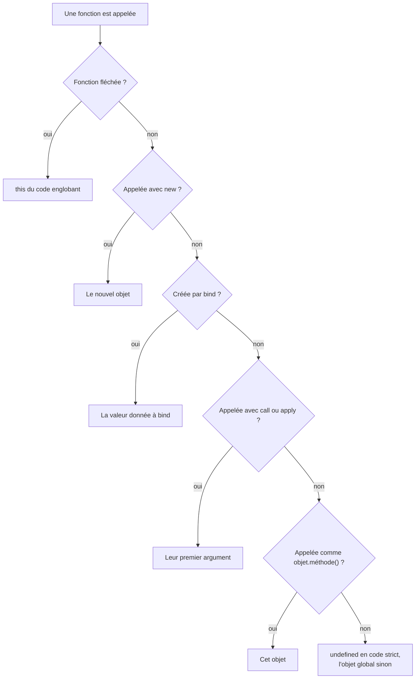

Code : les fichiers [`examples/l03_*`](https://github.com/spareilleux/learn/tree/c65efe4fb76e61efd229793b296d3d7a44e71baf/code/javascript-for-csharp-java/examples), [`errors/l03_duplicate_function.js`](https://github.com/spareilleux/learn/blob/c65efe4fb76e61efd229793b296d3d7a44e71baf/code/javascript-for-csharp-java/errors/l03_duplicate_function.js), et les côtés C# et Java dans [`compare/l03_closures.cs`](https://github.com/spareilleux/learn/blob/c65efe4fb76e61efd229793b296d3d7a44e71baf/code/javascript-for-csharp-java/compare/l03_closures.cs), [`compare/L03MethodRef.java`](https://github.com/spareilleux/learn/blob/c65efe4fb76e61efd229793b296d3d7a44e71baf/code/javascript-for-csharp-java/compare/L03MethodRef.java) et [`compare_fail/L03Closures.java`](https://github.com/spareilleux/learn/blob/c65efe4fb76e61efd229793b296d3d7a44e71baf/code/javascript-for-csharp-java/compare_fail/L03Closures.java).

## Trois façons d'écrire une fonction

```js
// examples/l03_functions.js
import { show } from './show.js';

function add(a, b) {
  return a + b;
}
const subtract = function (a, b) {
  return a - b;
};
const multiply = (a, b) => a * b;

show('add(2, 3)', add(2, 3));
show('subtract(2, 3)', subtract(2, 3));
show('multiply(2, 3)', multiply(2, 3));

// Trop peu ou trop d'arguments : pas d'erreur
show('add(2)', add(2));
show('add(2, 3, 4)', add(2, 3, 4));
show('add.length', add.length);

// Valeurs par défaut et paramètres rest
function greet(name = 'reader', ...titles) {
  return `Hello, ${[...titles, name].join(' ')}!`;
}
show('greet()', greet());
show("greet('Hopper', 'Admiral')", greet('Hopper', 'Admiral'));
show('greet(undefined)', greet(undefined));
show('greet(null)', greet(null));

// Pas de surcharge : dans le corps d'une fonction, la seconde déclaration remplace la première
function overloads() {
  function describe(page) {
    return `page ${page}`;
  }
  function describe(page, locale) {
    return `page ${page} in ${locale}`;
  }
  return describe('mission');
}
show('overloads()', overloads());

// Les fonctions sont des objets : on peut les stocker, les passer et leur donner des propriétés
const operations = { add, subtract, multiply };
show('Object.keys(operations)', Object.keys(operations));
// map appelle son callback avec (élément, indice, tableau) : les arguments en trop sont utilisés en silence
show('[1, 2, 3].map(multiply)', [1, 2, 3].map(multiply));
show("['1', '2', '3'].map(parseInt)", ['1', '2', '3'].map(parseInt));
show('typeof add', typeof add);
show('add.name', add.name);
```

```text
add(2, 3)                          5
subtract(2, 3)                     -1
multiply(2, 3)                     6
add(2)                             NaN
add(2, 3, 4)                       5
add.length                         2
greet()                            'Hello, reader!'
greet('Hopper', 'Admiral')         'Hello, Admiral Hopper!'
greet(undefined)                   'Hello, reader!'
greet(null)                        'Hello, !'
overloads()                        'page mission in undefined'
Object.keys(operations)            [ 'add', 'subtract', 'multiply' ]
[1, 2, 3].map(multiply)            [ 0, 2, 6 ]
['1', '2', '3'].map(parseInt)      [ 1, NaN, NaN ]
typeof add                         'function'
add.name                           'add'
```

| | C# | Java | JavaScript |
|---|---|---|---|
| Fonction nommée | une méthode | une méthode | `function add(a, b) { … }`, une *déclaration* |
| Fonction dans une variable | `Func<int, int, int> add = (a, b) => a + b;` | `IntBinaryOperator add = (a, b) -> a + b;` | une *expression* de fonction, ou une *fonction fléchée* `(a, b) => a + b` |
| Mauvais nombre d'arguments | erreur de compilation | erreur de compilation | accepté : les manquants valent `undefined`, ceux en trop sont ignorés |
| Valeur par défaut | `int b = 0` | — | `b = 0`, utilisée quand l'argument vaut `undefined` |
| Arguments variables | `params int[] rest` | `int... rest` | `...rest`, un vrai tableau |
| Surcharge | par signature | par signature | aucune |

Un appel ne vérifie rien : `add(2)` s'exécute avec `b` à `undefined`, et `2 + undefined` vaut `NaN`. Une valeur par défaut ne remplace que `undefined`, donc `greet(null)` garde le `null`. Il n'y a pas de surcharge non plus : dans une fonction, un second `function describe` remplace le premier en silence, et le code qui a besoin de deux comportements inspecte ses arguments. Au niveau supérieur d'un module, le même doublon est refusé avant que quoi que ce soit s'exécute, parce que les déclarations de niveau supérieur d'un module suivent [les règles de `let`](https://tc39.es/ecma262/#sec-module-semantics-static-semantics-early-errors) :

```text
errors/l03_duplicate_function.js:5
function describe(page, locale) {
^

SyntaxError: Identifier 'describe' has already been declared

Node.js v24.21.0
```

Les fonctions sont des objets : elles ont des propriétés comme `name` et `length`, et on peut les stocker et les faire circuler comme les délégués en C# ou les interfaces fonctionnelles en Java, sans type nommé. En passer une comme callback se combine avec l'absence de vérification en un piège classique. [`Array.prototype.map`](https://developer.mozilla.org/en-US/docs/Web/JavaScript/Reference/Global_Objects/Array/map) appelle son callback avec trois arguments : l'élément, son indice, et le tableau. `multiply` utilise les deux premiers, et renvoie `1 × 0`, `2 × 1` et `3 × 2`. `parseInt` prend l'indice comme base : `parseInt('1', 0)` traite la base 0 comme 10, la base 1 n'existe pas, et `'3'` n'est pas un chiffre en base 2. Écris `map((text) => parseInt(text, 10))` pour dire quels arguments tu passes.

## Le hoisting et la zone morte temporelle

```js
// examples/l03_hoisting.js
import { attempt, show } from './show.js';

// Une déclaration de fonction peut être appelée avant sa ligne
show('square(4)', square(4));
function square(n) {
  return n * n;
}

// var est hissée avec la valeur undefined, pour toute la fonction
function withVar() {
  const before = total;
  var total = 10;
  return [before, total];
}
show('withVar()', withVar());

// let, const et class sont hissées aussi, mais les lire avant leur ligne lève une exception
function withLet() {
  const before = total;
  let total = 10;
  return [before, total];
}
attempt('withLet()', withLet);
attempt('typeof total, in the TDZ', () => {
  const kind = typeof total;
  let total = 1;
  return kind;
});
show('typeof neverDeclared', typeof neverDeclared);
attempt('new Later()', () => new Later());
class Later {}

// var n'a pas de portée de bloc : le if ne la contient pas
function blocks() {
  if (true) {
    var fromVar = 'visible';
    let fromLet = 'hidden';
  }
  return [fromVar, typeof fromLet];
}
show('blocks()', blocks());
```

```text
square(4)                          16
withVar()                          [ undefined, 10 ]
withLet()                          ReferenceError: Cannot access 'total' before initialization
typeof total, in the TDZ           ReferenceError: Cannot access 'total' before initialization
typeof neverDeclared               'undefined'
new Later()                        ReferenceError: Cannot access 'Later' before initialization
blocks()                           [ 'visible', 'undefined' ]
```

Avant d'exécuter une fonction ou un module, le moteur crée toutes les variables qu'il déclare. C'est ce qu'on appelle le *hoisting* (la remontée), et ce que contient une variable avant sa ligne dépend de la façon dont elle a été déclarée :

- une déclaration de fonction est prête tout de suite, et c'est pourquoi `square(4)` fonctionne au-dessus de sa définition, comme une méthode peut être appelée avant d'apparaître dans une classe C# ;
- un `var` contient `undefined`, et appartient à toute la fonction, pas au bloc où il est écrit ;
- un `let`, un `const` ou une `class` existe mais ne peut pas être lu tant que sa ligne ne s'est pas exécutée. L'intervalle entre le début de la portée et cette ligne est la *zone morte temporelle*, et lire la variable dans cette zone lève une `ReferenceError`, même à travers `typeof`, qui sinon renvoie `'undefined'` pour un nom jamais déclaré.

C# refuse à la compilation d'utiliser une variable locale avant sa déclaration. JavaScript ne peut refuser qu'au moment où la ligne s'exécute, et `let` et `const` en font au moins une erreur bruyante au lieu d'un `undefined` silencieux. `var` est la raison de les préférer : il ignore les blocs, et il s'accorde mal avec les closures, comme le montre la section suivante.

## Closures

```js
// examples/l03_closures.js
import { attempt, show } from './show.js';

function counter() {
  let count = 0; // privé : seules les fonctions renvoyées peuvent l'atteindre
  return {
    increment: () => ++count,
    current: () => count,
  };
}
const a = counter();
const b = counter();
a.increment();
a.increment();
b.increment();
show('a.current()', a.current());
show('b.current()', b.current());
show('a.count', a.count);

// La variable est capturée, donc un changement ultérieur est visible
let label = 'draft';
const readLabel = () => label;
label = 'published';
show('readLabel()', readLabel());

// Boucles : var donne une variable pour toute la boucle, let en donne une par itération
const withVar = [];
for (var i = 0; i < 3; i++) {
  withVar.push(() => i);
}
const withLet = [];
for (let j = 0; j < 3; j++) {
  withLet.push(() => j);
}
show('withVar, called', withVar.map((f) => f()));
show('withLet, called', withLet.map((f) => f()));

// Un callback qui s'exécute plus tard voit la valeur de ce moment-là
const timeline = [];
for (var k = 0; k < 3; k++) {
  setTimeout(() => timeline.push(k), 0);
}
setTimeout(() => show('timeline', timeline), 0);
attempt('k, after the loop', () => k);
```

```text
a.current()                        2
b.current()                        1
a.count                            undefined
readLabel()                        'published'
withVar, called                    [ 3, 3, 3 ]
withLet, called                    [ 0, 1, 2 ]
k, after the loop                  3
timeline                           [ 3, 3, 3 ]
```

Une fonction garde l'accès aux variables de la portée où elle a été créée, même après que cette portée a rendu la main : `count` vit aussi longtemps que les fonctions qui l'utilisent, un `count` par appel de `counter`. C'est une *closure* (fermeture), et avant que les classes aient des champs privés, c'était la façon de cacher un état. La fonction capture la **variable**, pas sa valeur du moment : `readLabel` voit `'published'`.

C'est dans les boucles que cela compte. Un `var` dans un `for` est une seule variable pour toute la boucle, donc les trois fonctions lisent le même `i`, qui vaut `3` quand elles s'exécutent. Avec `let`, la spécification [crée une nouvelle variable à chaque itération](https://tc39.es/ecma262/#sec-createperiterationenvironment) et y copie la valeur courante, donc chaque fonction garde la sienne. Les timers montrent la même chose avec des callbacks qui s'exécutent une fois la boucle terminée ; la [leçon 7](../#plan) explique quand.

C# et Java rencontrent la même question, et y répondent différemment :

```text
> dotnet run l03_closures.cs
for:     3, 3, 3
foreach: 0, 1, 2
method group: GA plays
```

```text
> javac L03Closures.java
L03Closures.java:10: error: local variables referenced from a lambda expression must be final or effectively final
            suppliers.add(() -> i);
                                ^
1 error
```

C# capture les variables, comme JavaScript : une boucle `for` a une seule variable, et ses lambdas affichent `3, 3, 3`. Sa boucle `foreach` donne à chaque itération sa propre variable depuis C# 5, un [changement cassant fait exactement pour cette raison](https://ericlippert.com/2009/11/12/closing-over-the-loop-variable-considered-harmful-part-one/). Java refuse de compiler une lambda qui capture une variable qui change ([JLS 15.27.2](https://docs.oracle.com/javase/specs/jls/se25/html/jls-15.html#jls-15.27.2)), et t'oblige à la copier dans une variable effectivement finale.

## this

En C# et en Java, `this` est l'objet dont la méthode s'exécute, décidé là où la méthode est écrite. En JavaScript, `this` est un paramètre implicite de toute fonction non fléchée, et sa valeur est décidée **par chaque appel** ([OrdinaryCallBindThis](https://tc39.es/ecma262/#sec-ordinarycallbindthis)).

```js
// examples/l03_this.js
import { attempt, show } from './show.js';

function whoAmI() {
  return this?.name;
}
const lesson = { name: 'lesson', whoAmI };
const journal = { name: 'journal' };

// Liaison implicite : l'objet avant le point
show('lesson.whoAmI()', lesson.whoAmI());

// Liaison par défaut : un appel simple, undefined en code strict (modules et classes)
show('whoAmI()', whoAmI());
const detached = lesson.whoAmI;
show('detached()', detached());

// Liaison explicite : call, apply et bind
show('whoAmI.call(journal)', whoAmI.call(journal));
show('whoAmI.apply(journal, [])', whoAmI.apply(journal, []));
const bound = whoAmI.bind(journal);
show('bound()', bound());
lesson.bound = bound;
show('lesson.bound()', lesson.bound());
show('bound.call(lesson)', bound.call(lesson));

// Liaison par new : un nouvel objet
function Page(name) {
  this.name = name;
}
show("new Page('index')", new Page('index'));
const BoundPage = Page.bind(journal);
show("new BoundPage('index')", new BoundPage('index'));
show('journal, unchanged', journal);

// Les fonctions fléchées n'ont pas de this propre : elles utilisent celui qui les entoure
const site = {
  name: 'site',
  pages: ['mission', 'journal'],
  withArrow() {
    return this.pages.map((page) => `${this.name}/${page}`);
  },
  withFunction() {
    return this.pages.map(function (page) {
      return `${this?.name}/${page}`;
    });
  },
  arrowMethod: () => typeof this,
};
show('site.withArrow()', site.withArrow());
show('site.withFunction()', site.withFunction());
show('site.arrowMethod()', site.arrowMethod());

// Une méthode de classe passée comme callback perd son objet
class Player {
  name = 'GA';
  play() {
    return `${this.name} plays`;
  }
}
const player = new Player();
attempt("['C'].map(player.play)", () => ['C'].map(player.play));
show("['C'].map(() => player.play())", ['C'].map(() => player.play()));
const play = player.play.bind(player);
show("['C'].map(play)", ['C'].map(play));
```

```text
lesson.whoAmI()                    'lesson'
whoAmI()                           undefined
detached()                         undefined
whoAmI.call(journal)               'journal'
whoAmI.apply(journal, [])          'journal'
bound()                            'journal'
lesson.bound()                     'journal'
bound.call(lesson)                 'journal'
new Page('index')                  Page { name: 'index' }
new BoundPage('index')             Page { name: 'index' }
journal, unchanged                 { name: 'journal' }
site.withArrow()                   [ 'site/mission', 'site/journal' ]
site.withFunction()                [ 'undefined/mission', 'undefined/journal' ]
site.arrowMethod()                 'undefined'
['C'].map(player.play)             TypeError: Cannot read properties of undefined (reading 'name')
['C'].map(() => player.play())     [ 'GA plays' ]
['C'].map(play)                    [ 'GA plays' ]
```

Quatre règles décident de `this`, de la plus forte à la plus faible :

1. **`new`** : `new Page('index')` crée un objet et le passe comme `this`. Il l'emporte même sur `bind` : `new BoundPage('index')` ignore `journal`.
2. **Explicite** : [`call`](https://developer.mozilla.org/en-US/docs/Web/JavaScript/Reference/Global_Objects/Function/call) et [`apply`](https://developer.mozilla.org/en-US/docs/Web/JavaScript/Reference/Global_Objects/Function/apply) passent `this` pour un appel ; [`bind`](https://developer.mozilla.org/en-US/docs/Web/JavaScript/Reference/Global_Objects/Function/bind) renvoie une nouvelle fonction dont le `this` est fixé pour de bon, si bien que ni un point ni `call` ne peuvent le changer ensuite.
3. **Implicite** : `lesson.whoAmI()` passe l'objet avant le point. La fonction n'appartient pas à `lesson` : la même fonction appelée comme `detached()` l'a perdu.
4. **Par défaut** : un appel simple passe `undefined` en code strict, et chaque module ES et chaque corps de classe est strict. En code non strict, il passe l'objet global à la place (voir le [mode strict](#mode-strict) plus bas).

Une **fonction fléchée** ne participe pas : elle n'a pas de `this` propre et utilise celui du code qui l'entoure, comme n'importe quelle autre variable capturée. Cela rend les fonctions fléchées adaptées aux callbacks à l'intérieur d'une méthode, comme dans `withArrow`, où la `function` de `withFunction` reçoit la règle 4 et perd `site`. Cela les rend aussi inadaptées comme méthodes : `arrowMethod` voit le `this` du niveau supérieur du module, qui vaut `undefined`.

Le cas qui piège les développeurs C# et Java est le dernier. `player.play` lit la fonction, sans l'appeler ; `map` l'appelle plus tard sans point, et la règle 4 donne à `this` la valeur `undefined`. En C#, un groupe de méthodes comme `Func<string> play = player.Play;` garde son objet, tout comme une référence de méthode liée `player::play` en Java, ce qu'affichent les programmes de comparaison (`method group: GA plays`, `method reference: GA plays`). En JavaScript, enveloppe l'appel dans une fonction fléchée ou applique `bind` à la méthode.



## Mode strict

Le [mode strict](https://developer.mozilla.org/en-US/docs/Web/JavaScript/Reference/Strict_mode) a corrigé en 2009 quelques erreurs de conception des débuts, sans casser les anciennes pages : le code s'y engage avec la directive `'use strict'`. Les modules ES et les corps de classe sont [toujours stricts](https://tc39.es/ecma262/#sec-strict-mode-code) ; un fichier CommonJS ne l'est pas, sauf s'il le demande.

```js
// examples/l03_sloppy.cjs
function sloppy() {
  return this === globalThis;
}
function strict() {
  'use strict';
  return this;
}
console.log('sloppy() gets globalThis:', sloppy());
console.log('strict() gets:', strict());
console.log('this at the top of a CommonJS file is module.exports:', this === module.exports);

// Sans mode strict, une faute de frappe crée une variable globale
function typo() {
  totl = 42;
}
typo();
console.log('globalThis.totl:', globalThis.totl);
```

```text
sloppy() gets globalThis: true
strict() gets: undefined
this at the top of a CommonJS file is module.exports: true
globalThis.totl: 42
```

En code non strict, un appel simple passe l'objet global comme `this`, si bien qu'une méthode détachée lit et écrit en silence des propriétés globales au lieu de lever une exception ; affecter un nom non déclaré crée une variable globale ; et affecter une propriété en lecture seule, comme l'objet gelé de la [leçon 2](../02-values-and-types/#let-const-et-var), ne fait rien au lieu de lever une exception. Écris des modules ES, et ces trois fautes deviennent des erreurs.

## Dans GuitarAlchemist/ga : garder this dans les écouteurs d'événements

Un écouteur d'événements est un callback, donc le piège de `player.play` s'applique à chaque `addEventListener(…, this.method)`. Le front end de GA utilise trois façons correctes de garder `this`, et chacune conserve une référence à la fonction qu'elle enregistre, parce que `removeEventListener` a besoin de la *même* fonction :

- [`LunarLanderEngine.ts`, lignes 427-433](https://github.com/GuitarAlchemist/ga/blob/a826864f3a012cad88e415954bf57eca0ce12aa6/ReactComponents/ga-react-components/src/components/PrimeRadiant/LunarLanderEngine.ts#L427-L433) lie chaque gestionnaire une fois, dans le constructeur, et stocke le résultat ;
- [`InteractionHandler.ts`, lignes 53 et 65](https://github.com/GuitarAlchemist/ga/blob/a826864f3a012cad88e415954bf57eca0ce12aa6/ReactComponents/ga-react-components/src/components/PrimeRadiant/InteractionHandler.ts#L53-L65) déclare les gestionnaires comme fonctions fléchées dans des champs de classe ;
- [`GodotBridge.ts`, lignes 197-220](https://github.com/GuitarAlchemist/ga/blob/a826864f3a012cad88e415954bf57eca0ce12aa6/ReactComponents/ga-react-components/src/components/PrimeRadiant/GodotBridge.ts#L197-L220) stocke une fonction fléchée dans un champ avant de l'enregistrer.

Node.js a la même classe [`EventTarget`](https://nodejs.org/docs/latest-v24.x/api/events.html#eventtarget-and-event-api) que les navigateurs, donc ces patterns s'exécutent sans navigateur :

```js
// examples/l03_ga_listeners.js
const target = new EventTarget();
const ping = () => target.dispatchEvent(new Event('ping'));

// Une méthode passée telle quelle : this est l'EventTarget, pas l'objet
class Naive {
  count = 0;
  onPing() {
    this.count++;
  }
  start() {
    target.addEventListener('ping', this.onPing);
  }
}

// LunarLanderEngine.ts : lier une fois, garder la fonction liée pour la retirer plus tard
class BindOnce {
  count = 0;
  constructor() {
    this.boundPing = this.onPing.bind(this);
  }
  onPing() {
    this.count++;
  }
  start() {
    target.addEventListener('ping', this.boundPing);
  }
  stop() {
    target.removeEventListener('ping', this.boundPing);
  }
}

// InteractionHandler.ts : une fonction fléchée dans un champ de classe, une par instance
class ArrowField {
  count = 0;
  onPing = () => {
    this.count++;
  };
  start() {
    target.addEventListener('ping', this.onPing);
  }
  stop() {
    target.removeEventListener('ping', this.onPing);
  }
}

// L'erreur qu'évitent les trois : bind crée une nouvelle fonction, donc ce retrait ne retire rien
class BindTwice {
  count = 0;
  onPing() {
    this.count++;
  }
  start() {
    target.addEventListener('ping', this.onPing.bind(this));
  }
  stop() {
    target.removeEventListener('ping', this.onPing.bind(this));
  }
}

const naive = new Naive();
naive.start();
const listeners = [new BindOnce(), new ArrowField(), new BindTwice()];
for (const listener of listeners) listener.start();
ping();
for (const listener of listeners) listener.stop();
ping();

console.log('Naive.count     ', naive.count, '; target.count', target.count);
for (const listener of listeners) {
  console.log(`${listener.constructor.name}.count`.padEnd(16), listener.count);
}
console.log('bind returns a new function each time:', naive.onPing.bind(naive) === naive.onPing.bind(naive));
```

```text
Naive.count      0 ; target.count NaN
BindOnce.count   1
ArrowField.count 1
BindTwice.count  2
bind returns a new function each time: false
```

`Naive` n'échoue même pas : un `EventTarget` appelle ses écouteurs avec la cible comme `this`, donc `this.count++` crée une propriété `count` sur la cible, `undefined + 1` la met à `NaN`, et le compteur propre de l'objet reste à zéro. `BindOnce` et `ArrowField` reçoivent le premier ping et pas le second. `BindTwice` reçoit les deux, parce que chaque appel à `bind` renvoie une fonction différente, et `removeEventListener` n'a rien trouvé à retirer : l'écouteur reste enregistré pendant toute la vie de la cible, et l'objet qu'il retient aussi.

## À retenir

- Un appel ne vérifie pas ses arguments : les manquants valent `undefined`, ceux en trop sont ignorés, et il n'y a pas de surcharge.
- Passer une fonction à `map` ou à un autre callback lui passe tous les arguments que ce callback reçoit, indice compris.
- `let` et `const` ont une portée de bloc et lèvent une exception quand on les lit avant leur ligne ; `var` a une portée de fonction et se lit comme `undefined`.
- Une closure capture des variables, pas des valeurs ; un `let` dans une boucle `for` crée une variable par itération.
- `this` dépend de l'appel : `new`, puis `bind`, `call` ou `apply`, puis l'objet avant le point, puis `undefined`. Les fonctions fléchées prennent le `this` qui les entoure.
- Une méthode passée comme callback perd son objet ; enveloppe-la dans une fonction fléchée, ou lie-la une fois et garde le résultat.
- Les modules ES et les classes sont stricts, ce qui transforme des fautes silencieuses en erreurs.

## Exercices

1. Garde le `var` de la boucle `withVar`, et fais renvoyer `0`, `1` et `2` aux trois fonctions.

<details>
<summary>Solution</summary>

[`solutions/l03_ex1_var_loop.js`](https://github.com/spareilleux/learn/blob/c65efe4fb76e61efd229793b296d3d7a44e71baf/code/javascript-for-csharp-java/solutions/l03_ex1_var_loop.js) montre deux façons :

```js
const withParameter = [];
for (var i = 0; i < 3; i++) {
  withParameter.push(((copy) => () => copy)(i)); // le paramètre est une nouvelle variable à chaque appel
}
console.log(withParameter.map((f) => f()));

const withBind = [];
for (var j = 0; j < 3; j++) {
  withBind.push(((value) => value).bind(null, j)); // bind stocke la valeur qu'a l'argument maintenant
}
console.log(withBind.map((f) => f()));
```

```text
[ 0, 1, 2 ]
[ 0, 1, 2 ]
```

La première appelle une fonction à chaque itération, et un paramètre est une nouvelle variable à chaque appel : c'est la correction de Java, une copie par itération. La seconde utilise l'autre fonctionnalité de `bind`, qui fixe les arguments en plus de `this`. Avant `let`, le vieux code enveloppait le corps dans une fonction immédiatement invoquée pour la même raison.

</details>

2. Écris `once(fn)`, qui renvoie une fonction qui appelle `fn` la première fois seulement et renvoie le premier résultat à chaque appel suivant. Elle doit transmettre son `this` et ses arguments, pour fonctionner comme méthode.

<details>
<summary>Solution</summary>

[`solutions/l03_ex2_once.js`](https://github.com/spareilleux/learn/blob/c65efe4fb76e61efd229793b296d3d7a44e71baf/code/javascript-for-csharp-java/solutions/l03_ex2_once.js) :

```js
function once(fn) {
  let called = false;
  let result;
  return function (...args) {
    if (!called) {
      called = true;
      result = fn.apply(this, args);
    }
    return result;
  };
}

const player = {
  starts: 0,
  start: once(function (label) {
    this.starts++;
    return `${label} started`;
  }),
};
console.log(player.start('first'));
console.log(player.start('second'));
console.log('starts:', player.starts);
```

```text
first started
first started
starts: 1
```

`called` et `result` vivent dans la closure, une paire par appel de `once`. La fonction renvoyée doit être une `function`, pas une fonction fléchée : `player.start(…)` lui donne `player` comme `this` par la règle 3, et `apply` transmet ce `this` à `fn`. Une fonction fléchée transmettrait le `this` du corps de `once`, qui vaut `undefined`.

</details>

3. Prédis chaque ligne, puis exécute [`solutions/l03_ex3_predict.js`](https://github.com/spareilleux/learn/blob/c65efe4fb76e61efd229793b296d3d7a44e71baf/code/javascript-for-csharp-java/solutions/l03_ex3_predict.js) :

```js
class Tuner {
  note = 'E';
  read() {
    return this.note;
  }
  readArrow = () => this.note;
}
const tuner = new Tuner();
const other = new Tuner();

const { read, readArrow } = tuner;
attempt('read()', () => read());
show('readArrow()', readArrow());
show("read.call({ note: 'A' })", read.call({ note: 'A' }));
show("readArrow.call({ note: 'A' })", readArrow.call({ note: 'A' }));
show('tuner.read === other.read', tuner.read === other.read);
show('readArrow === other.readArrow', readArrow === other.readArrow);
```

<details>
<summary>Solution</summary>

```text
read()                             TypeError: Cannot read properties of undefined (reading 'note')
readArrow()                        'E'
read.call({ note: 'A' })           'A'
readArrow.call({ note: 'A' })      'E'
tuner.read === other.read          true
readArrow === other.readArrow      false
```

La déstructuration lit les deux propriétés sans les appeler. `read` est une méthode : appelée seule, elle reçoit `undefined` comme `this`, puisqu'un corps de classe est strict. `readArrow` a été créée par l'initialiseur du champ, où `this` valait `tuner`, et le garde : même `call` ne peut pas changer le `this` d'une fonction fléchée. Les deux dernières lignes montrent le coût : `read` est une seule fonction sur le prototype de la classe, partagée par toutes les instances ([leçon 4](../04-objects-prototypes-classes/)), alors que chaque instance reçoit son propre `readArrow`.

</details>

## Sources

- [ECMAScript — Définitions de fonctions](https://tc39.es/ecma262/#sec-function-definitions), [Définitions de fonctions fléchées](https://tc39.es/ecma262/#sec-arrow-function-definitions), [OrdinaryCallBindThis](https://tc39.es/ecma262/#sec-ordinarycallbindthis), [Function.prototype.bind](https://tc39.es/ecma262/#sec-function.prototype.bind), [Déclarations let et const](https://tc39.es/ecma262/#sec-let-and-const-declarations), [CreatePerIterationEnvironment](https://tc39.es/ecma262/#sec-createperiterationenvironment), [Code en mode strict](https://tc39.es/ecma262/#sec-strict-mode-code)
- [MDN — Fonctions](https://developer.mozilla.org/en-US/docs/Web/JavaScript/Reference/Functions), [Closures](https://developer.mozilla.org/en-US/docs/Web/JavaScript/Guide/Closures), [this](https://developer.mozilla.org/en-US/docs/Web/JavaScript/Reference/Operators/this), [Hoisting](https://developer.mozilla.org/en-US/docs/Glossary/Hoisting)
- [Eric Lippert — Closing over the loop variable considered harmful](https://ericlippert.com/2009/11/12/closing-over-the-loop-variable-considered-harmful-part-one/), [JLS 15.27.2 — Corps d'une lambda](https://docs.oracle.com/javase/specs/jls/se25/html/jls-15.html#jls-15.27.2)
