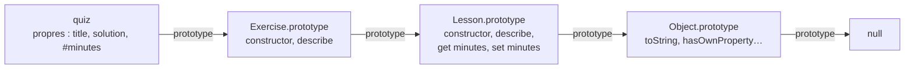

Code : les fichiers [`examples/l04_*.js`](https://github.com/spareilleux/learn/tree/c65efe4fb76e61efd229793b296d3d7a44e71baf/code/javascript-for-csharp-java/examples), [`errors/l04_private_outside.js`](https://github.com/spareilleux/learn/blob/c65efe4fb76e61efd229793b296d3d7a44e71baf/code/javascript-for-csharp-java/errors/l04_private_outside.js), et les côtés C# et Java dans [`compare/l04_equality.cs`](https://github.com/spareilleux/learn/blob/c65efe4fb76e61efd229793b296d3d7a44e71baf/code/javascript-for-csharp-java/compare/l04_equality.cs) et [`compare/L04Equality.java`](https://github.com/spareilleux/learn/blob/c65efe4fb76e61efd229793b296d3d7a44e71baf/code/javascript-for-csharp-java/compare/L04Equality.java).

## Les objets sont des sacs de propriétés

```js
// examples/l04_objects.js
import { show } from './show.js';

const page = { title: 'Mission', order: 0 };
page.locale = 'en'; // ajouter
delete page.order; // retirer
show('page', page);
show('page.author', page.author);
show("'title' in page", 'title' in page);
show("Object.hasOwn(page, 'title')", Object.hasOwn(page, 'title'));

// Les noms de propriétés sont des chaînes (ou des symboles) : les autres clés sont converties
const grid = {};
grid[1] = 'one';
grid['1'] = 'one, again';
grid[{ x: 1 }] = 'an object';
grid[{ y: 2 }] = 'another object';
show('grid', grid);

// Ordre : les clés de type entier d'abord, par ordre croissant, puis les autres dans l'ordre d'insertion
const lessons = { journal: 99, 10: 'ten', index: 0, 2: 'two' };
show('Object.keys(lessons)', Object.keys(lessons));

// Propriétés abrégées, noms calculés et méthodes
const field = 'draft';
const title = 'Values and types';
const lesson = {
  title,
  [field]: true,
  describe() {
    return `${this.title} (${this.draft ? 'draft' : 'published'})`;
  },
};
show('lesson.describe()', lesson.describe());
show('Object.entries(lesson)', Object.entries(lesson));
```

```text
page                               { title: 'Mission', locale: 'en' }
page.author                        undefined
'title' in page                    true
Object.hasOwn(page, 'title')       true
grid                               { '1': 'one, again', '[object Object]': 'another object' }
Object.keys(lessons)               [ '2', '10', 'journal', 'index' ]
lesson.describe()                  'Values and types (draft)'
Object.entries(lesson)             [
  [ 'title', 'Values and types' ],
  [ 'draft', true ],
  [ 'describe', [Function: describe] ]
]
```

Un objet C# ou Java a les champs que déclare sa classe, ni plus, ni moins. Un objet JavaScript est plus proche d'un `Dictionary<string, object>`, ou de l'[`ExpandoObject`](https://learn.microsoft.com/dotnet/api/system.dynamic.expandoobject) de C# : on ajoute des propriétés en les affectant, on les retire avec `delete`, et une propriété manquante se lit comme `undefined`. Le littéral `{ … }` n'a besoin d'aucune classe, et c'est ainsi que la plupart du code JavaScript fait circuler des données.

Deux détails de ce dictionnaire surprennent :

- **Les clés sont des chaînes** (ou des [symboles](https://developer.mozilla.org/en-US/docs/Web/JavaScript/Reference/Global_Objects/Symbol)). `grid[1]` et `grid['1']` sont la même propriété, et tout objet utilisé comme clé devient la même chaîne, `'[object Object]'`. Utilise une [`Map`](https://developer.mozilla.org/en-US/docs/Web/JavaScript/Reference/Global_Objects/Map) quand les clés ne sont pas des chaînes ; la leçon 5 la compare à `Dictionary` et `HashMap`.
- **L'ordre n'est pas seulement l'ordre d'insertion.** Les clés qui ressemblent à des indices de tableau viennent d'abord, par ordre numérique croissant, puis les autres chaînes dans l'ordre où elles ont été ajoutées ([OrdinaryOwnPropertyKeys](https://tc39.es/ecma262/#sec-ordinaryownpropertykeys)). Un objet indexé par année ou par identifiant se retrouve trié.

## La chaîne de prototypes

```js
// examples/l04_prototypes.js
import { show } from './show.js';

const base = {
  kind: 'page',
  describe() {
    return `${this.title} is a ${this.kind}`;
  },
};
const mission = Object.create(base); // le prototype de mission est base
mission.title = 'Mission';

show('mission.describe()', mission.describe());
show('Object.keys(mission)', Object.keys(mission));
show("Object.hasOwn(mission, 'kind')", Object.hasOwn(mission, 'kind'));
const { getPrototypeOf } = Object;
show('getPrototypeOf(mission) === base', getPrototypeOf(mission) === base);

// La lecture remonte la chaîne ; l'écriture crée une propriété propre qui masque celle du prototype
mission.kind = 'lesson';
show('mission.describe()', mission.describe());
show('base.kind', base.kind);

// Un changement du prototype est vu par tous les objets qui en héritent, même ceux qui existent déjà
const journal = Object.create(base);
journal.title = 'Journal';
base.describe = function () {
  return `${this.title}, ${this.kind}, changed at run time`;
};
show('journal.describe()', journal.describe());

// La fin de la chaîne
show('getPrototypeOf(base)', getPrototypeOf(base));
show('getPrototypeOf(Object.prototype)', getPrototypeOf(Object.prototype));
const dictionary = Object.create(null);
show("'toString' in {}", 'toString' in {});
show("'toString' in dictionary", 'toString' in dictionary);
```

```text
mission.describe()                 'Mission is a page'
Object.keys(mission)               [ 'title' ]
Object.hasOwn(mission, 'kind')     false
getPrototypeOf(mission) === base   true
mission.describe()                 'Mission is a lesson'
base.kind                          'page'
journal.describe()                 'Journal, page, changed at run time'
getPrototypeOf(base)               [Object: null prototype] {}
getPrototypeOf(Object.prototype)   null
'toString' in {}                   true
'toString' in dictionary           false
```

Chaque objet a un lien caché vers un autre objet, son **prototype**, ou vers `null`. Lire une propriété que l'objet n'a pas continue sur le prototype, puis sur le prototype du prototype, jusqu'à trouver la propriété ou atteindre `null` ([OrdinaryGet](https://tc39.es/ecma262/#sec-ordinaryget)). `mission` a une propriété propre, `title`, et trouve `kind` et `describe` sur `base`. Quand `describe` s'exécute, `this` est toujours `mission`, par la règle implicite de la [leçon 3](../03-functions-and-scope/#this), donc la méthode lit le titre de `mission`.

Cette recherche est l'héritage de JavaScript, et elle diffère d'une hiérarchie de classes de trois façons :

- **Elle relie des objets, pas des types.** N'importe quel objet peut servir de prototype à un autre, avec [`Object.create`](https://developer.mozilla.org/en-US/docs/Web/JavaScript/Reference/Global_Objects/Object/create).
- **L'écriture ne remonte pas la chaîne.** `mission.kind = 'lesson'` crée une propriété propre qui masque celle du prototype, et `base.kind` ne change pas.
- **Elle est vivante.** Remplacer `base.describe` change la méthode de tous les objets qui héritent de `base`, y compris les objets créés avant le changement. C'est ainsi que les vieilles bibliothèques ajoutaient des méthodes aux types intégrés, une pratique aujourd'hui déconseillée.

Les objets simples héritent d'`Object.prototype`, où vivent `toString` et `hasOwnProperty` ; `in` les voit, `Object.hasOwn` non. `Object.create(null)` crée un objet sans aucun prototype, un dictionnaire sans clés héritées.

## Classes

```js
// examples/l04_classes.js
import { attempt, show } from './show.js';

class Lesson {
  static count = 0;
  title; // champ public : une propriété propre de chaque instance
  #minutes = 0; // champ privé : inaccessible hors du corps de la classe

  constructor(title, minutes) {
    this.title = title;
    this.minutes = minutes; // appelle le setter
    Lesson.count++;
  }

  get minutes() {
    return this.#minutes;
  }

  set minutes(value) {
    if (!Number.isInteger(value) || value < 0) {
      throw new RangeError(`minutes must be a non-negative integer, got ${value}`);
    }
    this.#minutes = value;
  }

  describe() {
    return `${this.title} (${this.#minutes} min)`;
  }

  static isLesson(value) {
    return #minutes in value; // value a-t-il le champ privé de cette classe ?
  }
}

class Exercise extends Lesson {
  constructor(title, minutes, solution) {
    super(title, minutes);
    this.solution = solution;
  }

  describe() {
    return `${super.describe()}, with a solution`;
  }
}

const values = new Lesson('Values and types', 25);
const quiz = new Exercise('Coercions', 10, 'details');
show('values.describe()', values.describe());
show('quiz.describe()', quiz.describe());
show('values', values);
show('Object.keys(quiz)', Object.keys(quiz));
show('Lesson.count', Lesson.count);
attempt("values.minutes = 'ten'", () => {
  values.minutes = 'ten';
});
show('values.minutes', values.minutes);

// En dessous : une fonction, et des méthodes sur son prototype
show('typeof Lesson', typeof Lesson);
show("Object.hasOwn(values, 'describe')", Object.hasOwn(values, 'describe'));
const proto = Lesson.prototype;
show('values.describe === proto.describe', values.describe === proto.describe);
show('quiz.describe === proto.describe', quiz.describe === proto.describe);
show('quiz instanceof Lesson', quiz instanceof Lesson);
attempt("Lesson('no new')", () => Lesson('no new'));

// Les champs privés sont vérifiés par le moteur, pas cachés par convention
show('Lesson.isLesson(quiz)', Lesson.isLesson(quiz));
show('Lesson.isLesson({ minutes: 5 })', Lesson.isLesson({ minutes: 5 }));
show("Object.hasOwn(values, '#minutes')", Object.hasOwn(values, '#minutes'));
show('JSON.stringify(values)', JSON.stringify(values));
attempt('proto.describe.call({ title })', () => proto.describe.call({ title: 'fake' }));
```

```text
values.describe()                  'Values and types (25 min)'
quiz.describe()                    'Coercions (10 min), with a solution'
values                             Lesson { title: 'Values and types' }
Object.keys(quiz)                  [ 'title', 'solution' ]
Lesson.count                       2
values.minutes = 'ten'             RangeError: minutes must be a non-negative integer, got ten
values.minutes                     25
typeof Lesson                      'function'
Object.hasOwn(values, 'describe')  false
values.describe === proto.describe true
quiz.describe === proto.describe   false
quiz instanceof Lesson             true
Lesson('no new')                   TypeError: Class constructor Lesson cannot be invoked without 'new'
Lesson.isLesson(quiz)              true
Lesson.isLesson({ minutes: 5 })    false
Object.hasOwn(values, '#minutes')  false
JSON.stringify(values)             '{"title":"Values and types"}'
proto.describe.call({ title })     TypeError: Cannot read private member #minutes from an object whose class did not declare it
```

La syntaxe ressemble à C# ou à Java, et la plupart signifie la même chose :

| | C# | Java | JavaScript |
|---|---|---|---|
| Champ | `public string Title;` | `public String title;` | `title;`, une propriété propre de chaque instance |
| Champ privé | `private int minutes;` | `private int minutes;` | `#minutes`, vérifié par le moteur |
| Propriété | `public int Minutes { get; set; }` | `getMinutes()`, `setMinutes()` | `get minutes()`, `set minutes(value)` |
| Membre statique | `static int Count;` | `static int count;` | `static count = 0;` |
| Héritage | `class Exercise : Lesson` | `class Exercise extends Lesson` | `class Exercise extends Lesson`, un seul parent |
| Appeler le parent | `base.Describe()` | `super.describe()` | `super.describe()` |
| Plusieurs constructeurs | oui | oui | un seul `constructor` |
| Interfaces, classes abstraites | oui | oui | non ; un objet convient s'il a les méthodes appelées |

En dessous, `class` est une couche au-dessus des prototypes de la section précédente ([ClassDefinitionEvaluation](https://tc39.es/ecma262/#sec-runtime-semantics-classdefinitionevaluation)). `Lesson` est une fonction, le constructeur. Les méthodes comme `describe` sont stockées une fois sur `Lesson.prototype`, et chaque instance les trouve par son lien de prototype, et c'est pourquoi `values` n'a pas de `describe` propre. `extends` relie `Exercise.prototype` à `Lesson.prototype`, donc la chaîne de `quiz` est :



`quiz.describe` trouve d'abord `Exercise.prototype.describe`, et `super.describe()` continue un lien plus haut. `instanceof` parcourt la même chaîne, à la recherche de `Lesson.prototype`. Ce qu'une classe ajoute par rapport à un prototype écrit à la main, c'est surtout de la sûreté : l'appeler sans `new` lève une exception, son corps est strict, et ses méthodes ne sont pas énumérables, donc une boucle `for…in` sur une instance ne les liste pas.

Les **champs privés** sont la seule fonctionnalité sans équivalent en prototypes. Un nom qui commence par `#` n'existe qu'à l'intérieur du corps de la classe ; le code extérieur ne peut même pas le mentionner, et le module est rejeté avant de s'exécuter :

```js
// errors/l04_private_outside.js
class Lesson {
  #minutes = 25;
}
console.log('this line never runs');
console.log(new Lesson().#minutes);
```

```text
errors/l04_private_outside.js:6
console.log(new Lesson().#minutes);
                        ^

SyntaxError: Private field '#minutes' must be declared in an enclosing class

Node.js v24.21.0
```

À l'intérieur de la classe, lire `#minutes` sur un objet qui ne l'a pas lève un `TypeError`, comme le montre la dernière ligne de la sortie, et `#minutes in value` le teste sans lever d'exception. Les champs privés ne sont pas des propriétés : `Object.hasOwn`, `Object.keys` et `JSON.stringify` ne les voient pas. La réflexion de C# peut lire un champ privé, et celle de Java aussi avec `setAccessible` ; rien en JavaScript ne peut lire un champ `#` depuis l'extérieur. Le mot-clé `private` de TypeScript, en revanche, n'est vérifié qu'à la compilation, et le cours suivant montre ce qu'il en reste à l'exécution.

Les **accesseurs** exécutent du code à la lecture ou à l'écriture d'une propriété, comme les propriétés de C# : `this.minutes = minutes` dans le constructeur passe par le setter et sa validation. Et les champs d'une classe sont créés sur chaque instance, et c'est pourquoi une fonction fléchée dans un champ, comme dans le pattern d'écouteur de la [leçon 3](../03-functions-and-scope/#dans-guitaralchemistga--garder-this-dans-les-écouteurs-dévénements), coûte une fonction par objet.

## Égalité et copies

```js
// examples/l04_equality_copy.js
import { attempt, show } from './show.js';

const a = { x: 1, y: 2 };
const b = { x: 1, y: 2 };
show('a === b', a === b);
show('a === a', a === a);

// Map et Set utilisent la même identité : deux clés d'apparence égale sont deux clés
const visits = new Map();
visits.set({ x: 1, y: 2 }, 'first');
visits.set({ x: 1, y: 2 }, 'second');
show('visits.size', visits.size);
show('visits.get({ x: 1, y: 2 })', visits.get({ x: 1, y: 2 }));
const byKey = new Map([[`${a.x},${a.y}`, 'first']]);
show("byKey.get('1,2')", byKey.get('1,2'));

// Le spread et Object.assign copient un seul niveau
const course = { title: 'JavaScript', tags: ['node'], created: new Date(Date.UTC(2026, 8, 14)) };
const shallow = { ...course };
shallow.title = 'TypeScript';
shallow.tags.push('typescript');
show('course.title', course.title);
show('course.tags', course.tags);

// structuredClone copie tout le graphe : Map, Set, Date, cycles
const deep = structuredClone(course);
deep.tags.push('react');
show('course.tags', course.tags);
show('deep.created instanceof Date', deep.created instanceof Date);

// mais ni les fonctions, ni le prototype d'une instance de classe
class Point {
  constructor(x, y) {
    this.x = x;
    this.y = y;
  }
  length() {
    return Math.hypot(this.x, this.y);
  }
}
const cloned = structuredClone(new Point(3, 4));
show('cloned', cloned);
show('cloned instanceof Point', cloned instanceof Point);
attempt('structuredClone({ f() {} })', () => structuredClone({ f() {} }));

// JSON.parse(JSON.stringify(...)) perd davantage
const viaJson = JSON.parse(JSON.stringify({ ...course, draft: undefined }));
show('viaJson', viaJson);

// Object.freeze est superficiel aussi
const frozen = Object.freeze({ tags: ['node'] });
frozen.tags.push('still mutable');
show('frozen.tags', frozen.tags);
```

```text
a === b                            false
a === a                            true
visits.size                        2
visits.get({ x: 1, y: 2 })         undefined
byKey.get('1,2')                   'first'
course.title                       'JavaScript'
course.tags                        [ 'node', 'typescript' ]
course.tags                        [ 'node', 'typescript' ]
deep.created instanceof Date       true
cloned                             { x: 3, y: 4 }
cloned instanceof Point            false
structuredClone({ f() {} })        DataCloneError: f() {} could not be cloned.
viaJson                            {
  title: 'JavaScript',
  tags: [ 'node', 'typescript' ],
  created: '2026-09-14T00:00:00.000Z'
}
frozen.tags                        [ 'node', 'still mutable' ]
```

Les records de C# et de Java se comparent par valeur, et un `Dictionary` ou une `HashMap` utilise cette égalité pour ses clés :

```text
> dotnet run l04_equality.cs
a == b (record):        True
ReferenceEquals(a, b):  False
visits.Count:           1
c == d (class):         False
a with { Y = 5 }:       Point { X = 1, Y = 5 }
```

```text
> java L04Equality.java
a == b:                 false
a.equals(b):            true
visits.size():          1
```

JavaScript n'a ni records, ni `Equals` ou `equals` à redéfinir, ni surcharge d'opérateurs. `===` sur deux objets demande s'il s'agit du même objet, comme `ReferenceEquals`, et [`Map`](https://developer.mozilla.org/en-US/docs/Web/JavaScript/Reference/Global_Objects/Map) et [`Set`](https://developer.mozilla.org/en-US/docs/Web/JavaScript/Reference/Global_Objects/Set) utilisent la même identité ([SameValueZero](https://tc39.es/ecma262/#sec-samevaluezero)) : deux points aux mêmes coordonnées sont deux clés, et un nouveau `{ x: 1, y: 2 }` ne trouve ni l'un ni l'autre. Pour indexer une map par valeur, construis une chaîne ou un nombre à partir des valeurs, comme le fait `byKey`. Comparer deux objets champ par champ est l'exercice 1.

Les copies demandent le même soin, parce que rien ne copie implicitement :

- **Le spread** `{ ...course }` et [`Object.assign`](https://developer.mozilla.org/en-US/docs/Web/JavaScript/Reference/Global_Objects/Object/assign) copient les propriétés propres, sur un seul niveau : `shallow.tags` est le même tableau que `course.tags`. C'est aussi ce que fait le `with` de C#, sur un record.
- **[`structuredClone`](https://developer.mozilla.org/en-US/docs/Web/API/Window/structuredClone)**, défini par le [standard HTML](https://html.spec.whatwg.org/multipage/structured-data.html#dom-structuredclone) et disponible dans Node.js, copie tout le graphe, y compris les dates, les maps, les sets et les cycles. Il refuse les fonctions, avec une `DataCloneError`, et il ne conserve pas les prototypes : le clone d'un `Point` est un objet simple sans méthode `length`.
- **`JSON.parse(JSON.stringify(…))`**, la vieille astuce, perd davantage : les propriétés `undefined` disparaissent, les dates deviennent des chaînes, et un `bigint` lève une exception.
- **`Object.freeze`** est superficiel pour la même raison : il gèle un objet, pas ceux vers lesquels il pointe.

## Dans GuitarAlchemist/ga : fusionner les préférences sauvegardées

[`SceneOptions.tsx`](https://github.com/GuitarAlchemist/ga/blob/a826864f3a012cad88e415954bf57eca0ce12aa6/ReactComponents/ga-react-components/src/components/PrimeRadiant/SceneOptions.tsx#L57-L80) construit les options d'une scène 3D : des valeurs par défaut, puis des paramètres de l'URL comme `?tower` qui activent des options ([lignes 62-73](https://github.com/GuitarAlchemist/ga/blob/a826864f3a012cad88e415954bf57eca0ce12aa6/ReactComponents/ga-react-components/src/components/PrimeRadiant/SceneOptions.tsx#L62-L73)), puis les préférences sauvegardées dans `localStorage`, fusionnées en une ligne ([ligne 77](https://github.com/GuitarAlchemist/ga/blob/a826864f3a012cad88e415954bf57eca0ce12aa6/ReactComponents/ga-react-components/src/components/PrimeRadiant/SceneOptions.tsx#L77)) :

```ts
if (saved) Object.assign(state, JSON.parse(saved));
```

Chaque bascule sauvegarde tout l'état ([ligne 94](https://github.com/GuitarAlchemist/ga/blob/a826864f3a012cad88e415954bf57eca0ce12aa6/ReactComponents/ga-react-components/src/components/PrimeRadiant/SceneOptions.tsx#L94)). Réduit à trois options, en JavaScript simple :

```js
// examples/l04_ga_assign.js
import { show } from './show.js';

function getDefaults(search, saved) {
  const state = { stars: true, tower: false, skyboxMode: 'milky-way' };
  // Lignes 62-73 : les paramètres d'URL remplacent les valeurs par défaut
  const params = new URLSearchParams(search);
  if (params.has('tower')) state.tower = true;
  // Lignes 75-78 : puis les préférences sauvegardées dans localStorage sont fusionnées
  if (saved) Object.assign(state, JSON.parse(saved));
  return state;
}

// Chaque bascule sauvegarde tout l'état (lignes 94, 103 et 112), donc un état sauvegardé a toutes les clés
const saved = JSON.stringify({ stars: false, tower: false, skyboxMode: 'milky-way' });
show("getDefaults('?tower', null)", getDefaults('?tower', null));
show("getDefaults('?tower', saved)", getDefaults('?tower', saved));

// Object.assign copie toutes les propriétés propres de la source, connues ou non
show('with an old key', getDefaults('', '{"bloomLevel":3,"stars":"yes"}'));

// JSON.parse fait de __proto__ une propriété ordinaire ; Object.assign l'affecte ensuite, ce qui change le prototype
const parsed = JSON.parse('{"__proto__":{"isAdmin":true}}');
show("Object.hasOwn(parsed, '__proto__')", Object.hasOwn(parsed, '__proto__'));
const state = getDefaults('', '{"__proto__":{"isAdmin":true}}');
show('state.isAdmin', state.isAdmin);
show("Object.hasOwn(state, 'isAdmin')", Object.hasOwn(state, 'isAdmin'));
show('{}.isAdmin', {}.isAdmin);

// Le spread définit les propriétés au lieu de les affecter : le prototype reste Object.prototype
const spread = { ...parsed };
show('spread.isAdmin', spread.isAdmin);
show('Object.keys(spread)', Object.keys(spread));
```

```text
getDefaults('?tower', null)        { stars: true, tower: true, skyboxMode: 'milky-way' }
getDefaults('?tower', saved)       { stars: false, tower: false, skyboxMode: 'milky-way' }
with an old key                    { stars: 'yes', tower: false, skyboxMode: 'milky-way', bloomLevel: 3 }
Object.hasOwn(parsed, '__proto__') true
state.isAdmin                      true
Object.hasOwn(state, 'isAdmin')    false
{}.isAdmin                         undefined
spread.isAdmin                     undefined
Object.keys(spread)                [ '__proto__' ]
```

Trois choses se produisent, de la plus visible à la plus obscure :

1. **L'URL perd face à l'état sauvegardé.** `Object.assign` copie ses sources dans l'ordre, donc la dernière gagne, et l'état sauvegardé vient en dernier. Dès qu'un utilisateur a basculé une option, l'état sauvegardé contient toutes les clés, et `?tower` n'active plus la tour. Le commentaire au-dessus du bloc de l'URL appelle ces paramètres des « overrides » ; les fusionner après les préférences sauvegardées leur permettrait de l'emporter vraiment.
2. **Tout ce qui est sauvegardé est copié, connu ou non.** Une option renommée dans une version ultérieure reste dans `localStorage` et revient sous le nom `bloomLevel`, et une valeur du mauvais type, `stars: 'yes'`, remplace un booléen. Le type TypeScript `SceneOptionsState` ne vérifie pas ce que renvoie `JSON.parse`, puisque les types ont disparu à l'exécution.
3. **Une clé `__proto__` change le prototype.** [`JSON.parse`](https://tc39.es/ecma262/#sec-json.parse) crée une propriété propre ordinaire nommée `__proto__`. `Object.assign` l'*affecte* ensuite à la cible, et affecter `__proto__` appelle le [setter `Object.prototype.__proto__`](https://tc39.es/ecma262/#sec-object.prototype.__proto__), qui remplace le prototype de la cible : `state.isAdmin` vaut `true` sans être une propriété propre. Seul cet objet est touché, `{}.isAdmin` reste `undefined`, et dans GA les données viennent du propre navigateur de l'utilisateur, donc c'est une curiosité plutôt qu'une faille. Le même pattern appliqué à des données venant d'une requête est une classe de vulnérabilités connue, la [pollution de prototype](https://developer.mozilla.org/en-US/docs/Web/Security/Attacks/Prototype_pollution). Le spread n'affecte pas, il [définit des propriétés](https://tc39.es/ecma262/#sec-copydataproperties), et garde `__proto__` comme une clé ordinaire.

L'exercice 3 réécrit la fonction.

## À retenir

- Un objet est un ensemble de clés de type chaîne qui peut changer à l'exécution ; une propriété manquante se lit comme `undefined` ; les clés de type entier sont listées en premier.
- Lire une propriété parcourt la chaîne de prototypes ; écrire crée une propriété propre. Les prototypes relient des objets, et leurs modifications sont vivantes.
- `class` construit une fonction constructeur et un prototype : les méthodes sont partagées sur le prototype, les champs sont créés sur chaque instance.
- Les champs `#private` sont imposés par le moteur, et invisibles pour `Object.keys` et `JSON.stringify`.
- `===`, `Map` et `Set` comparent les objets par identité ; il n'y a ni records ni `Equals` à redéfinir.
- Le spread et `Object.assign` copient un seul niveau ; `structuredClone` copie en profondeur mais abandonne les prototypes et refuse les fonctions.
- `Object.assign` laisse gagner la dernière source et copie toutes les clés, `__proto__` compris.

## Exercices

1. Écris `deepEqual(a, b)`, vrai quand deux valeurs sont identiques, ou sont des objets avec le même prototype et les mêmes clés propres contenant des valeurs profondément égales. Que répond-elle pour deux dates différentes, et pourquoi ?

<details>
<summary>Solution</summary>

[`solutions/l04_ex1_deep_equal.js`](https://github.com/spareilleux/learn/blob/c65efe4fb76e61efd229793b296d3d7a44e71baf/code/javascript-for-csharp-java/solutions/l04_ex1_deep_equal.js) :

```js
function deepEqual(a, b) {
  if (Object.is(a, b)) return true;
  if (typeof a !== 'object' || typeof b !== 'object' || a === null || b === null) return false;
  if (Object.getPrototypeOf(a) !== Object.getPrototypeOf(b)) return false;
  const keys = Object.keys(a);
  if (keys.length !== Object.keys(b).length) return false;
  return keys.every((key) => Object.hasOwn(b, key) && deepEqual(a[key], b[key]));
}

console.log(deepEqual({ x: 1, tags: ['a'] }, { tags: ['a'], x: 1 }));
console.log(deepEqual({ x: 1 }, { x: 1, y: undefined }));
console.log(deepEqual([1, 2], { 0: 1, 1: 2 }));
console.log(deepEqual(NaN, NaN), deepEqual(0, -0));
console.log(deepEqual(new Date(0), new Date(1)));
```

```text
true
false
false
true false
true
```

`Object.is` gère les primitives, et dit que `NaN` est égal à `NaN` mais que `0` diffère de `-0`. Le contrôle du prototype distingue un tableau d'un objet avec les mêmes clés. La dernière ligne est fausse exprès : une date garde son heure dans un slot interne, pas dans une propriété, donc deux dates n'ont pas de clés propres et semblent égales. Une égalité profonde générale doit connaître chaque type intégré ; l'[`assert.deepStrictEqual`](https://nodejs.org/docs/latest-v24.x/api/assert.html#assertdeepstrictequalactual-expected-message) de Node.js le fait, et la leçon 9 l'utilise dans les tests.

</details>

2. Écris une classe `Temperature` qui stocke des degrés Celsius dans un champ privé, expose un getter et un setter `fahrenheit`, a une fabrique statique `fromFahrenheit`, et se sérialise en `{"celsius": …}` avec `JSON.stringify`.

<details>
<summary>Solution</summary>

[`solutions/l04_ex2_temperature.js`](https://github.com/spareilleux/learn/blob/c65efe4fb76e61efd229793b296d3d7a44e71baf/code/javascript-for-csharp-java/solutions/l04_ex2_temperature.js) :

```js
class Temperature {
  #celsius;

  constructor(celsius) {
    this.#celsius = celsius;
  }

  static fromFahrenheit(fahrenheit) {
    return new Temperature(((fahrenheit - 32) * 5) / 9);
  }

  get fahrenheit() {
    return (this.#celsius * 9) / 5 + 32;
  }

  set fahrenheit(value) {
    this.#celsius = ((value - 32) * 5) / 9;
  }

  toJSON() {
    return { celsius: this.#celsius };
  }
}

const room = new Temperature(20);
console.log(room.fahrenheit);
room.fahrenheit = 212;
console.log(JSON.stringify(room));
console.log(JSON.stringify(Temperature.fromFahrenheit(32)));
console.log(Object.keys(room), room);
```

```text
68
{"celsius":100}
{"celsius":0}
[] Temperature {}
```

Sans `toJSON`, `JSON.stringify(room)` afficherait `{}`, puisqu'un champ privé n'est pas une propriété ; [`toJSON`](https://developer.mozilla.org/en-US/docs/Web/JavaScript/Reference/Global_Objects/JSON/stringify#tojson_behavior) joue le rôle d'un convertisseur personnalisé dans `System.Text.Json` ou Jackson. La dernière ligne montre la même invisibilité : aucune clé, et l'affichage de Node.js montre un `Temperature` vide.

</details>

3. Réécris `getDefaults` de l'exemple de GA pour que les paramètres de l'URL l'emportent sur les préférences sauvegardées, que les clés sauvegardées qui ne sont pas des options soient ignorées, qu'une valeur sauvegardée ne remplace une valeur par défaut que si elle a le même type, et que `__proto__` ne puisse rien changer.

<details>
<summary>Solution</summary>

[`solutions/l04_ex3_merge.js`](https://github.com/spareilleux/learn/blob/c65efe4fb76e61efd229793b296d3d7a44e71baf/code/javascript-for-csharp-java/solutions/l04_ex3_merge.js) :

```js
function getDefaults(search, saved) {
  const state = { stars: true, tower: false, skyboxMode: 'milky-way' };
  const preferences = saved ? JSON.parse(saved) : {};
  for (const key of Object.keys(state)) {
    // Object.keys(state) liste les clés connues : __proto__ et les anciennes clés ne sont jamais lues
    if (Object.hasOwn(preferences, key) && typeof preferences[key] === typeof state[key]) {
      state[key] = preferences[key];
    }
  }
  const params = new URLSearchParams(search);
  if (params.has('tower')) state.tower = true; // en dernier, pour que l'URL gagne
  return state;
}

const saved = JSON.stringify({ stars: false, tower: false, skyboxMode: 'milky-way' });
console.log(getDefaults('?tower', saved));
console.log(getDefaults('', '{"bloomLevel":3,"stars":"yes","__proto__":{"isAdmin":true}}'));
console.log(getDefaults('', '{"__proto__":{"isAdmin":true}}').isAdmin);
```

```text
{ stars: false, tower: true, skyboxMode: 'milky-way' }
{ stars: true, tower: false, skyboxMode: 'milky-way' }
undefined
```

La boucle renverse la question : au lieu de copier tout ce que contient l'objet sauvegardé, elle demande à l'objet sauvegardé chaque clé que l'état connaît. Le test `typeof` est une validation minimale ; une valeur comme `skyboxMode` devrait aussi faire partie des chaînes autorisées, et c'est là qu'interviennent une bibliothèque de schémas, ou les types statiques et les vérifications à l'exécution du cours TypeScript.

</details>

## Sources

- [ECMAScript — Méthodes internes des objets ordinaires](https://tc39.es/ecma262/#sec-ordinary-object-internal-methods-and-internal-slots), [OrdinaryOwnPropertyKeys](https://tc39.es/ecma262/#sec-ordinaryownpropertykeys), [ClassDefinitionEvaluation](https://tc39.es/ecma262/#sec-runtime-semantics-classdefinitionevaluation), [Object.assign](https://tc39.es/ecma262/#sec-object.assign), [CopyDataProperties](https://tc39.es/ecma262/#sec-copydataproperties), [Object.prototype.\_\_proto\_\_](https://tc39.es/ecma262/#sec-object.prototype.__proto__)
- [MDN — Héritage et chaîne de prototypes](https://developer.mozilla.org/en-US/docs/Web/JavaScript/Guide/Inheritance_and_the_prototype_chain), [Classes](https://developer.mozilla.org/en-US/docs/Web/JavaScript/Reference/Classes), [Éléments privés](https://developer.mozilla.org/en-US/docs/Web/JavaScript/Reference/Classes/Private_elements), [structuredClone](https://developer.mozilla.org/en-US/docs/Web/API/Window/structuredClone)
- [Standard HTML — Sérialisation et désérialisation structurées](https://html.spec.whatwg.org/multipage/structured-data.html#dom-structuredclone)
- [Microsoft — Records](https://learn.microsoft.com/dotnet/csharp/fundamentals/types/records), [Java — Classes record](https://docs.oracle.com/en/java/javase/25/language/records.html)
