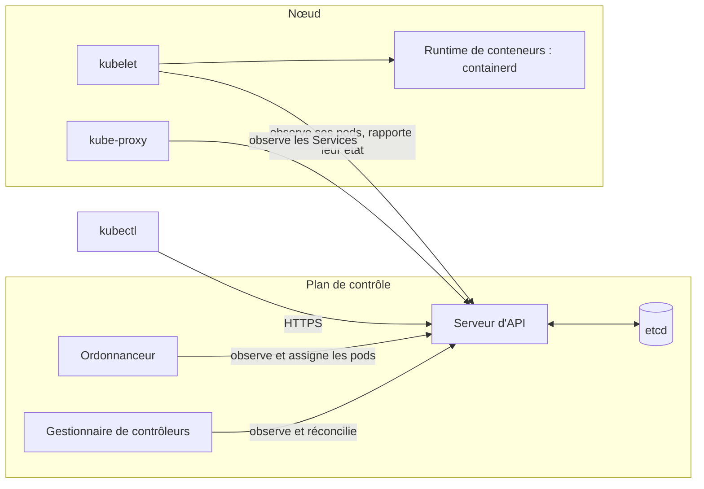

import { Tabs, TabItem } from '@astrojs/starlight/components';

Code complet : [`code/kubernetes`](https://github.com/spareilleux/learn/tree/main/code/kubernetes). La configuration du cluster est [`kind/cluster.yaml`](https://github.com/spareilleux/learn/blob/main/code/kubernetes/kind/cluster.yaml), et les commandes de cette leçon sont dans [`l01/run.sh`](https://github.com/spareilleux/learn/blob/main/code/kubernetes/l01/run.sh). [`check.sh`](https://github.com/spareilleux/learn/blob/main/code/kubernetes/check.sh) les exécute contre un vrai cluster et compare leurs sorties avec les fichiers de [`expected`](https://github.com/spareilleux/learn/tree/main/code/kubernetes/expected), après avoir remplacé les âges, les noms générés et les adresses IP par des marqueurs.

## De `docker run` à un état désiré

Dans le [cours Conteneurs WSL](../../wsl-containers/04-build-an-image/), vous avez construit une image et l'avez lancée avec une commande. Cette commande agissait tout de suite : elle démarrait un conteneur. Si le conteneur plantait, rien ne le relançait ; si la machine redémarrait, rien ne le redémarrait ; pour en lancer trois copies, vous lanciez la commande trois fois.

Kubernetes fonctionne à l'inverse. Vous ne lui dites pas quoi faire ; vous décrivez ce qui doit exister (« trois copies de cette image, joignables sous ce nom »), vous stockez cette description dans le cluster, et un ensemble de programmes la compare sans cesse avec ce qui tourne réellement et corrige l'écart. Un développeur C# a déjà écrit cette boucle, sous la forme d'un `BackgroundService` qui se réveille, lit l'état attendu dans une base de données, regarde la réalité, et agit sur l'écart. Kubernetes, ce sont des dizaines de boucles de ce genre, appelées **contrôleurs**, qui partagent une même base de données.

| Vous connaissez | Dans Kubernetes |
|---|---|
| `docker run` d'une image | un **Pod** : un ou plusieurs conteneurs placés ensemble (leçon 2) |
| lancer la commande trois fois, et redémarrer à la main | un **Deployment** : un nombre voulu de pods identiques, maintenus en vie et mis à jour (leçon 3) |
| `-p 8080:8080` et un nom d'hôte | un **Service** : un nom et une adresse stables devant des pods qui changent (leçon 4) |
| `docker compose up` avec un fichier YAML | `kubectl apply -f` avec des manifestes YAML |
| une boucle `BackgroundService` qui converge vers une cible | un contrôleur |
| `appsettings.json` et les variables d'environnement | les ConfigMaps et les Secrets (leçon 5) |

## L'architecture

Un cluster a un **plan de contrôle**, qui stocke et décide, et des **nœuds**, qui exécutent les conteneurs. Rien sur un nœud ne parle directement à la base de données : chaque composant, `kubectl` compris, passe par le serveur d'API.



- Le [**serveur d'API**](https://kubernetes.io/docs/concepts/architecture/#kube-apiserver) (`kube-apiserver`) est une API REST sur HTTPS. Il authentifie l'appelant, valide chaque objet, le stocke, et permet aux autres composants d'**observer** (*watch*) les changements au lieu de les interroger en boucle.
- [**etcd**](https://etcd.io/) est le magasin clé-valeur derrière lui : le seul endroit où l'état du cluster est conservé.
- L'[**ordonnanceur**](https://kubernetes.io/docs/concepts/scheduling-eviction/kube-scheduler/) (*scheduler*) guette les pods sans nœud, en choisit un, et enregistre ce choix. Il ne démarre rien lui-même.
- Le [**gestionnaire de contrôleurs**](https://kubernetes.io/docs/concepts/architecture/#kube-controller-manager) (*controller manager*) exécute les contrôleurs intégrés : le contrôleur de ReplicaSet crée ou supprime des pods jusqu'à ce que leur nombre corresponde, le contrôleur de Deployment gère les ReplicaSets, et ainsi de suite.
- Sur chaque nœud, le [**kubelet**](https://kubernetes.io/docs/concepts/architecture/#kubelet) guette les pods affectés à son nœud, demande au runtime de conteneurs ([containerd](https://containerd.io/) ici) de démarrer leurs conteneurs, exécute leurs sondes, et rapporte leur état.
- [**kube-proxy**](https://kubernetes.io/docs/concepts/architecture/#kube-proxy) traduit les Services en règles réseau sur chaque nœud.

La boucle est assez courte pour être lue. La fonction [`manageReplicas`](https://github.com/kubernetes/kubernetes/blob/f54c212e3a2f75d674b717a9b29052b20b60aefc/pkg/controller/replicaset/replica_set.go#L649-L700) du contrôleur de ReplicaSet calcule `diff := len(activePods) - int(*(rs.Spec.Replicas))`, crée des pods quand la différence est négative et en supprime quand elle est positive. Elle ne sait pas pourquoi des pods manquent : un plantage, un pod supprimé et un nouveau ReplicaSet se ressemblent tous. C'est ce qui rend le modèle robuste, et c'est aussi pourquoi « j'ai supprimé le pod et il est revenu » surprend les débutants.

## Choisir un cluster local

Quatre outils font tourner un cluster sur un poste de développement. Tous fournissent un vrai serveur d'API ; ils diffèrent par la façon dont ils créent les nœuds.

| Outil | Les nœuds sont | Version vérifiée le 2026-09-15 | Bon pour |
|---|---|---|---|
| [kind](https://kind.sigs.k8s.io/) | des conteneurs Docker ou Podman | v0.33.0, Kubernetes 1.37.0 par défaut | la CI et les tests : le projet Kubernetes se teste avec ; plusieurs nœuds sur une machine |
| [k3d](https://k3d.io/) | des conteneurs qui exécutent [k3s](https://k3s.io/), une distribution plus légère | v5.9.0 | une faible empreinte, avec un répartiteur de charge et Traefik intégrés |
| [minikube](https://minikube.sigs.k8s.io/) | une VM ou un conteneur | v1.39.0, Kubernetes 1.37.0 par défaut | des modules (tableau de bord, ingress, métriques) activés d'une commande |
| [Docker Desktop](https://docs.docker.com/desktop/features/kubernetes/) | kubeadm, ou kind depuis le nouveau provisionneur | dépend de la version de Docker Desktop | un cluster en cochant une case, si vous utilisez déjà Docker Desktop |

Ce cours utilise **kind** : il est petit, scriptable, identique sur les trois systèmes d'exploitation, et tourne dans GitHub Actions. Tout ce qu'il enseigne s'applique aux trois autres, et aux clusters managés (leçon 15), sauf quand une leçon dit le contraire.

kind a besoin de Docker (Docker Desktop sous Windows et macOS, Docker Engine ou Docker Desktop sous Linux) ou de Podman. L'outil `wslc` du cours Conteneurs WSL ne fait pas partie de ses fournisseurs.

## Installer kind et kubectl

`kubectl` est le client en ligne de commande. Sa version doit rester à une version mineure au plus de celle du cluster ; ici, les deux sont en 1.37.0. Les commandes ci-dessous téléchargent les versions épinglées, comme le font le [démarrage rapide de kind](https://kind.sigs.k8s.io/docs/user/quick-start/#installing-from-release-binaries) et les [pages d'installation de kubectl](https://kubernetes.io/docs/tasks/tools/).

<Tabs syncKey="os">
<TabItem label="Windows">

```powershell
mkdir $HOME\bin -Force
curl.exe -Lo $HOME\bin\kind.exe https://kind.sigs.k8s.io/dl/v0.33.0/kind-windows-amd64
curl.exe -Lo $HOME\bin\kubectl.exe https://dl.k8s.io/release/v1.37.0/bin/windows/amd64/kubectl.exe
# Ajoute $HOME\bin au PATH de l'utilisateur, puis ouvre un nouveau terminal
[Environment]::SetEnvironmentVariable('Path', "$([Environment]::GetEnvironmentVariable('Path','User'));$HOME\bin", 'User')
```

</TabItem>
<TabItem label="Linux / WSL">

```bash
curl -Lo ./kind https://kind.sigs.k8s.io/dl/v0.33.0/kind-linux-amd64
curl -LO https://dl.k8s.io/release/v1.37.0/bin/linux/amd64/kubectl
chmod +x ./kind ./kubectl
sudo mv ./kind ./kubectl /usr/local/bin/
```

</TabItem>
<TabItem label="macOS">

```bash
# Apple silicon ; darwin-amd64 sur un Mac Intel
curl -Lo ./kind https://kind.sigs.k8s.io/dl/v0.33.0/kind-darwin-arm64
curl -LO https://dl.k8s.io/release/v1.37.0/bin/darwin/arm64/kubectl
chmod +x ./kind ./kubectl
sudo mv ./kind ./kubectl /usr/local/bin/
```

</TabItem>
</Tabs>

Chaque version publie aussi une somme de contrôle SHA-256 à côté du binaire ([kind](https://github.com/kubernetes-sigs/kind/releases/tag/v0.33.0), `kubectl.exe.sha256` ou `kubectl.sha256` pour kubectl) : comparez-la avec `Get-FileHash` ou `sha256sum` avant de faire confiance à un téléchargement. Les téléchargements Windows ont été exécutés sous Windows 11, et la ligne `PATH` est *à vérifier* : la machine de l'auteur avait déjà ses outils dans le chemin. Les commandes Linux suivent les mêmes pages et la CI du cours exécute leur équivalent sous Linux ; l'onglet macOS est *à vérifier*.

```text
> kind version
kind v0.33.0 go1.26.7 windows/amd64
> kubectl version --client
Client Version: v1.37.0
Kustomize Version: v5.8.1
```

## Créer le cluster

Un fichier de configuration kind nomme le cluster, liste ses nœuds, et épingle l'image de nœud par digest, pour que tout le monde exécute le même Kubernetes :

```yaml
# Le cluster du cours : un nœud, épinglé sur Kubernetes v1.37.0.
# kind create cluster --config kind/cluster.yaml
kind: Cluster
apiVersion: kind.x-k8s.io/v1alpha4
name: learn-k8s
nodes:
  - role: control-plane
    image: kindest/node:v1.37.0@sha256:a1ed56cfb0e7b93589bdf97c8cd566405a265939e3620fc4f5de89adff580ae5
    # Leçon 4 : un service NodePort sur 30080 répond sur http://localhost:30080
    extraPortMappings:
      - containerPort: 30080
        hostPort: 30080
        listenAddress: 127.0.0.1
```

Le digest est celui que kind v0.33.0 utilise par défaut, déclaré dans son [`defaults/image.go`](https://github.com/kubernetes-sigs/kind/blob/407a9675e6d9af1200b5f57f9ca52ec6cdacce74/pkg/apis/config/defaults/image.go#L20-L21). Un seul nœud est à la fois le plan de contrôle et l'unique worker : assez pour les leçons 1 à 7, et léger pour un portable.

```text
> kind create cluster --config kind/cluster.yaml
Creating cluster "learn-k8s" ...
 ✓ Ensuring node image (kindest/node:v1.37.0) 🖼️
 ✓ Preparing nodes 📦
 ✓ Writing configuration 📜
 ✓ Starting control-plane 🕹️
 ✓ Installing CNI 🔌
 ✓ Installing StorageClass 💾
Set kubectl context to "kind-learn-k8s"
You can now use your cluster with:

kubectl cluster-info --context kind-learn-k8s
```

Dans un terminal, chaque étape affiche d'abord un indicateur d'activité, et kind termine par un lien vers sa documentation ; les lignes ci-dessus sont l'état final. Cela a pris 58 secondes sur la machine de l'auteur, avec l'image de nœud déjà téléchargée. Le « nœud » est un conteneur Docker nommé `learn-k8s-control-plane`, qui exécute systemd, containerd, le kubelet, et le plan de contrôle sous forme de conteneurs à l'intérieur.

:::caution[Vos autres clusters]
`kind create cluster` ajoute un contexte à votre kubeconfig (`~/.kube/config` par défaut) et en fait le contexte courant. Si vous utilisez aussi un cluster de travail, un `kubectl delete` ultérieur irait vers le contexte courant, quel qu'il soit. Pour tenir kind à part, pointez la variable d'environnement `KUBECONFIG` vers un fichier séparé avant de créer le cluster, ou vérifiez `kubectl config current-context` avant toute commande destructrice.
:::

## Faire le tour

```text
> kubectl version
Client Version: v1.37.0
Kustomize Version: v5.8.1
Server Version: v1.37.0
> kubectl get nodes
NAME                      STATUS   ROLES           AGE   VERSION
learn-k8s-control-plane   Ready    control-plane   11m   v1.37.0
```

Le plan de contrôle décrit plus haut est bien là, sous forme de pods dans l'espace de noms `kube-system` :

```text
> kubectl get pods -n kube-system
NAME                                              READY   STATUS    RESTARTS   AGE
coredns-559f6c778d-jlzvq                          1/1     Running   0          11m
coredns-559f6c778d-nvpd5                          1/1     Running   0          11m
etcd-learn-k8s-control-plane                      1/1     Running   0          11m
kindnet-8bcfl                                     1/1     Running   0          11m
kube-apiserver-learn-k8s-control-plane            1/1     Running   0          11m
kube-controller-manager-learn-k8s-control-plane   1/1     Running   0          11m
kube-proxy-kxrkk                                  1/1     Running   0          11m
kube-scheduler-learn-k8s-control-plane            1/1     Running   0          11m
```

- `etcd`, `kube-apiserver`, `kube-controller-manager` et `kube-scheduler` se terminent par le nom du nœud : ce sont des [**pods statiques**](https://kubernetes.io/docs/tasks/configure-pod-container/static-pod/), que le kubelet démarre à partir de fichiers sur le nœud avant même qu'un serveur d'API existe. Le serveur d'API en montre ensuite une copie en lecture seule.
- `coredns-559f6c778d-…` a deux parties après son nom : `559f6c778d` identifie le ReplicaSet (un hash du modèle de pod), et les cinq derniers caractères sont aléatoires. [CoreDNS](https://coredns.io/) répond aux requêtes DNS du cluster (leçon 4).
- `kindnet` est le plugin réseau de kind (le « CNI » du journal de création), et `kube-proxy` tourne une fois par nœud : tous deux n'ont qu'un suffixe aléatoire, parce qu'un DaemonSet les crée (leçon 7).

Les fichiers des pods statiques sont sur le nœud, qui est un conteneur, donc `docker exec` peut les lister :

```text
> docker exec learn-k8s-control-plane ls /etc/kubernetes/manifests
etcd.yaml
kube-apiserver.yaml
kube-controller-manager.yaml
kube-scheduler.yaml
```

## kubectl parle HTTPS

`kubectl` est un client HTTP bien élevé. Augmentez sa verbosité et chaque requête apparaît :

```text
> kubectl get nodes -v=6
I0915 00:17:57.387396   70612 round_trippers.go:632] "Response" verb="GET" url="https://127.0.0.1:55531/api/v1/nodes?limit=500" status="200 OK" milliseconds=6
NAME                      STATUS   ROLES           AGE    VERSION
learn-k8s-control-plane   Ready    control-plane   116s   v1.37.0
```

Les lignes qui la précèdent, omises ici, indiquent quel fichier kubeconfig a été chargé et listent les feature gates du client.

L'adresse, les certificats et l'utilisateur viennent du fichier **kubeconfig**. Un **contexte** réunit un cluster, un utilisateur et un espace de noms par défaut sous un même nom :

```text
> kubectl config get-contexts
CURRENT   NAME             CLUSTER          AUTHINFO         NAMESPACE
*         kind-learn-k8s   kind-learn-k8s   kind-learn-k8s
```

`kubectl config use-context <name>` change de contexte, `--context <name>` vise un autre cluster le temps d'une commande, et `-n <namespace>` un autre espace de noms. Le port, 55531 ici, est choisi par Docker quand kind crée le nœud ; `kind get kubeconfig --name learn-k8s` réaffiche le fichier si vous le perdez.

L'API se documente aussi elle-même. [`kubectl explain`](https://kubernetes.io/docs/reference/kubectl/generated/kubectl_explain/) lit le schéma que publie le serveur, et correspond donc toujours à la version du cluster :

```text
> kubectl explain pod.spec.restartPolicy
KIND:       Pod
VERSION:    v1

FIELD: restartPolicy <string>
ENUM:
    Always
    Never
    OnFailure

DESCRIPTION:
    Restart policy for all containers within the pod. One of Always, OnFailure,
    Never. In some contexts, only a subset of those values may be permitted.
    Default to Always. More info:
    https://kubernetes.io/docs/concepts/workloads/pods/pod-lifecycle/#restart-policy
    
    Possible enum values:
     - `"Always"`
     - `"Never"`
     - `"OnFailure"`
```

`kubectl api-resources` liste chaque sorte d'objet, avec son nom court et son groupe d'API. Le groupe `apps` contient les charges de travail des leçons suivantes :

```text
> kubectl api-resources --api-group=apps
NAME                  SHORTNAMES   APIVERSION   NAMESPACED   KIND
controllerrevisions                apps/v1      true         ControllerRevision
daemonsets            ds           apps/v1      true         DaemonSet
deployments           deploy       apps/v1      true         Deployment
replicasets           rs           apps/v1      true         ReplicaSet
statefulsets          sts          apps/v1      true         StatefulSet
```

## Un premier état désiré

[`l01/hello.yaml`](https://github.com/spareilleux/learn/blob/main/code/kubernetes/l01/hello.yaml) demande deux copies de la plus petite image qui soit, [`pause`](https://github.com/kubernetes/kubernetes/tree/f54c212e3a2f75d674b717a9b29052b20b60aefc/build/pause), qui ne fait rien et ne se termine jamais. Le nœud l'a déjà, donc rien n'est téléchargé.

```yaml
# Leçon 1 : un état désiré. Deux copies de la plus petite image qui soit : pause ne fait rien et ne se termine jamais.
apiVersion: apps/v1
kind: Deployment
metadata:
  name: hello
spec:
  replicas: 2
  selector:
    matchLabels:
      app: hello
  template:
    metadata:
      labels:
        app: hello
    spec:
      containers:
        - name: pause
          image: registry.k8s.io/pause:3.10
```

Chaque manifeste a les mêmes quatre champs de premier niveau : `apiVersion` et `kind` disent ce qu'est l'objet, `metadata` le nomme, et `spec` est l'état désiré. Les contrôleurs en ajoutent un cinquième, `status`, avec ce qu'ils observent.

Avant de stocker quoi que ce soit, le serveur d'API peut valider un fichier. Une faute de frappe dans un nom de champ, `replica:` au lieu de `replicas:` dans [`l01/hello-invalid.yaml`](https://github.com/spareilleux/learn/blob/main/code/kubernetes/l01/hello-invalid.yaml), est rejetée :

```text
> kubectl apply --dry-run=server -f l01/hello-invalid.yaml
Error from server (BadRequest): error when creating "l01/hello-invalid.yaml": Deployment in version "v1" cannot be handled as a Deployment: strict decoding error: unknown field "spec.replica"
> kubectl apply --dry-run=server -f l01/hello.yaml
deployment.apps/hello created (server dry run)
```

Sans cluster, [kubeconform](https://github.com/yannh/kubeconform) vérifie les mêmes fichiers contre les schémas JSON publiés. Le script [`validate.sh`](https://github.com/spareilleux/learn/blob/main/code/kubernetes/validate.sh) du cours l'exécute sur chaque manifeste, sous Windows, Linux et macOS.

Chaque leçon travaille dans son propre **espace de noms** (*namespace*), une partition nommée du cluster, pour que supprimer l'espace de noms à la fin retire tout ce que la leçon a créé :

```text
> kubectl create namespace l01
namespace/l01 created
> kubectl apply -n l01 -f l01/hello.yaml
deployment.apps/hello created
> kubectl rollout status -n l01 deployment/hello
deployment "hello" successfully rolled out
> kubectl get -n l01 rs,pods -l app=hello
NAME                               DESIRED   CURRENT   READY   AGE
replicaset.apps/hello-6f8b555b4b   2         2         2       1s

NAME                         READY   STATUS    RESTARTS   AGE
pod/hello-6f8b555b4b-6q7s9   1/1     Running   0          1s
pod/hello-6f8b555b4b-fv257   1/1     Running   0          1s
```

`kubectl rollout status` attend que les pods soient prêts ; avant sa dernière ligne, il affiche un nombre variable de lignes `Waiting for deployment…`, omises ici et dans le reste du cours quand elles n'apportent rien. Un seul fichier a créé trois sortes d'objets : le Deployment, un ReplicaSet qu'il a créé, et deux pods que le ReplicaSet a créés. `-l app=hello` les sélectionne par label, de la même façon que le ReplicaSet trouve « ses » pods.

### Changer l'état désiré

[`l01/hello-3-replicas.yaml`](https://github.com/spareilleux/learn/blob/main/code/kubernetes/l01/hello-3-replicas.yaml) diffère d'une ligne. `kubectl diff` l'envoie au serveur, qui calcule ce qui changerait sans rien stocker :

```text
> kubectl diff -n l01 -f l01/hello-3-replicas.yaml
...
-  generation: 1
+  generation: 2
...
-  replicas: 2
+  replicas: 3
```

(La vraie sortie est un diff unifié entre deux répertoires temporaires ; les lignes ci-dessus en sont les changements.) `generation` compte les changements de `spec` : les contrôleurs la comparent avec la génération sur laquelle ils ont agi en dernier, et c'est ainsi que `kubectl rollout status` sait si un changement a été pris en compte.

### Supprimer ce qui est désiré

Supprimez les deux pods, et le contrôleur de ReplicaSet constate qu'il en manque deux :

```text
> kubectl delete pods -n l01 -l app=hello
pod "hello-6f8b555b4b-6q7s9" deleted from l01 namespace
pod "hello-6f8b555b4b-fv257" deleted from l01 namespace
> kubectl rollout status -n l01 deployment/hello
deployment "hello" successfully rolled out
> kubectl get events -n l01 --field-selector involvedObject.kind=ReplicaSet -o custom-columns=REASON:.reason,MESSAGE:.message
REASON             MESSAGE
SuccessfulCreate   Created pod: hello-6f8b555b4b-6q7s9
SuccessfulCreate   Created pod: hello-6f8b555b4b-fv257
SuccessfulCreate   Created pod: hello-6f8b555b4b-xlnl4
SuccessfulCreate   Created pod: hello-6f8b555b4b-wtgnm
```

Deux nouveaux pods, avec de nouveaux noms, créés en moins d'une seconde. Les événements sont le journal du contrôleur : les deux premières lignes datent de l'`apply`, les deux dernières de sa réaction à la suppression. Pour retirer les pods pour de bon, on change l'état désiré : on supprime le Deployment, ou tout l'espace de noms.

```text
> kubectl delete namespace l01
namespace "l01" deleted
```

## Nettoyer

Un cluster kind continue de tourner, et d'utiliser de la mémoire, jusqu'à ce que vous le supprimiez. Ses images restent en cache dans Docker, donc le prochain `kind create cluster` est plus rapide :

```bash
kind delete cluster --name learn-k8s
```

## À retenir

- Un cluster Kubernetes stocke des états désirés dans etcd, derrière un serveur d'API auquel parle chaque composant ; les contrôleurs et les kubelets observent ces états et convergent vers eux.
- L'ordonnanceur ne fait que choisir un nœud, le kubelet démarre les conteneurs, et le contrôleur de ReplicaSet compte les pods : chacun fait un petit travail en boucle.
- kind exécute chaque nœud comme un conteneur Docker. C'est un vrai cluster, épinglé par le digest de l'image de nœud, et le même sous Windows, Linux et macOS.
- `kubectl` est un client HTTPS configuré par un kubeconfig ; vérifiez le contexte courant avant les commandes destructrices.
- `kubectl explain`, `api-resources` et `--dry-run=server` interrogent le cluster lui-même, donc leurs réponses correspondent à sa version.
- Supprimer un pod géré par un contrôleur déclenche son remplacement ; on change ce qui existe en changeant l'état désiré.

## Exercices

**1.** Passez `hello` à quatre réplicas avec `kubectl scale -n l01 deployment/hello --replicas=4`, vérifiez le résultat, puis relancez `kubectl apply -n l01 -f l01/hello.yaml`. Combien de réplicas reste-t-il, et pourquoi ?

<details>
<summary>Solution</summary>

```text
> kubectl scale -n l01 deployment/hello --replicas=4
deployment.apps/hello scaled
> kubectl get -n l01 deployment hello
NAME    READY   UP-TO-DATE   AVAILABLE   AGE
hello   4/4     4            4           4s
> kubectl apply -n l01 -f l01/hello.yaml
deployment.apps/hello configured
> kubectl get -n l01 deployment hello
NAME    READY   UP-TO-DATE   AVAILABLE   AGE
hello   2/2     2            2           5s
```

Deux. `kubectl scale` a changé l'état désiré stocké à 4, mais le fichier dit toujours 2, et `apply` aligne l'objet stocké sur le fichier. Un changement impératif dure jusqu'au prochain `apply` : dans une équipe qui applique les manifestes depuis Git, c'est le fichier qui fait foi (leçon 14).

</details>

**2.** Quelle image exécute l'ordonnanceur, et avec quels arguments de ligne de commande ? Utilisez `kubectl get pod … -o jsonpath` plutôt que de lire le fichier sur le nœud.

<details>
<summary>Solution</summary>

```text
> kubectl get pod -n kube-system kube-scheduler-learn-k8s-control-plane -o jsonpath='{.spec.containers[0].image}{"\n"}{range .spec.containers[0].command[*]}{@}{"\n"}{end}'
registry.k8s.io/kube-scheduler:v1.37.0
kube-scheduler
--authentication-kubeconfig=/etc/kubernetes/scheduler.conf
--authorization-kubeconfig=/etc/kubernetes/scheduler.conf
--bind-address=127.0.0.1
--kubeconfig=/etc/kubernetes/scheduler.conf
--leader-elect=true
```

L'ordonnanceur joint le serveur d'API avec son propre kubeconfig, comme `kubectl`. `--leader-elect=true` permet à plusieurs copies de tourner dans un plan de contrôle hautement disponible, une seule d'entre elles ordonnançant. Sous Windows PowerShell, gardez les apostrophes autour de l'expression JSONPath.

</details>

**3.** Que se passe-t-il pendant une mise à jour progressive si vous ne fixez pas `maxSurge` ? Répondez avec `kubectl explain`, sans chercher sur le web.

<details>
<summary>Solution</summary>

```text
> kubectl explain deployment.spec.strategy.rollingUpdate.maxSurge
GROUP:      apps
KIND:       Deployment
VERSION:    v1

FIELD: maxSurge <IntOrString>


DESCRIPTION:
    The maximum number of pods that can be scheduled above the desired number of
    pods. Value can be an absolute number (ex: 5) or a percentage of desired
    pods (ex: 10%). This can not be 0 if MaxUnavailable is 0. Absolute number is
    calculated from percentage by rounding up. Defaults to 25%. Example: when
    this is set to 30%, the new ReplicaSet can be scaled up immediately when the
    rolling update starts, such that the total number of old and new pods do not
    exceed 130% of desired pods. Once old pods have been killed, new ReplicaSet
    can be scaled up further, ensuring that total number of pods running at any
    time during the update is at most 130% of desired pods.
    IntOrString is a type that can hold an int32 or a string. When used in JSON
    or YAML marshalling and unmarshalling, it produces or consumes the inner
    type. This allows you to have, for example, a JSON field that can accept a
    name or number.
```

La valeur par défaut est 25 % des réplicas désirés, arrondie au supérieur : avec 2 réplicas, un pod supplémentaire peut exister pendant la mise à jour. La leçon 3 la fixe explicitement.

</details>

## Sources

- Documentation de Kubernetes : [Architecture du cluster](https://kubernetes.io/docs/concepts/architecture/), [Contrôleurs](https://kubernetes.io/docs/concepts/architecture/controller/), [Objets dans Kubernetes](https://kubernetes.io/docs/concepts/overview/working-with-objects/), [Espaces de noms](https://kubernetes.io/docs/concepts/overview/working-with-objects/namespaces/), [Organiser l'accès aux clusters avec des fichiers kubeconfig](https://kubernetes.io/docs/concepts/configuration/organize-cluster-access-kubeconfig/), [Validation des champs côté serveur](https://kubernetes.io/docs/reference/using-api/api-concepts/#field-validation)
- [Annonce de Kubernetes v1.37](https://kubernetes.io/blog/2026/08/26/kubernetes-v1-37-release/) et [versions maintenues](https://kubernetes.io/releases/)
- kind : [démarrage rapide](https://kind.sigs.k8s.io/docs/user/quick-start/), [configuration](https://kind.sigs.k8s.io/docs/user/configuration/), [notes de version v0.33.0](https://github.com/kubernetes-sigs/kind/releases/tag/v0.33.0)
- Code source en v1.37.0 : [`replica_set.go`](https://github.com/kubernetes/kubernetes/blob/f54c212e3a2f75d674b717a9b29052b20b60aefc/pkg/controller/replicaset/replica_set.go#L649-L700)
