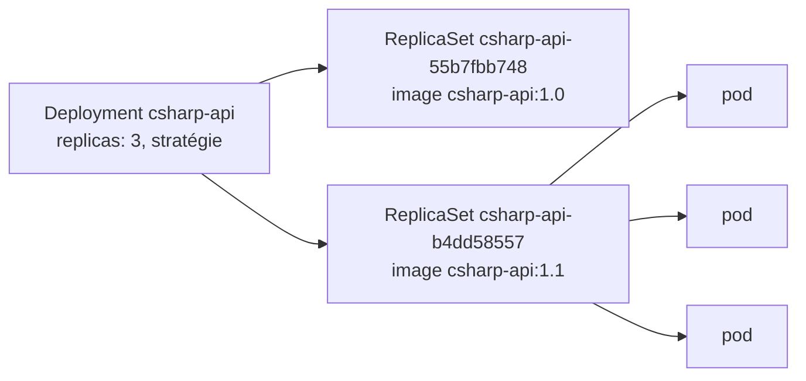

Code complet : [`code/kubernetes/l03`](https://github.com/spareilleux/learn/tree/main/code/kubernetes/l03), avec ses commandes dans [`l03/run.sh`](https://github.com/spareilleux/learn/blob/main/code/kubernetes/l03/run.sh). Les images viennent de [`images.sh`](https://github.com/spareilleux/learn/blob/main/code/kubernetes/images.sh), comme dans la [leçon 2](../02-pods/#les-images) ; il étiquette aussi `csharp-api:1.0` une seconde fois en `csharp-api:1.1`, la « nouvelle version » de cette leçon.

Un pod seul n'est pas remplacé quand il disparaît : si son nœud tombe ou si quelqu'un le supprime, il n'est plus là. Dans la [leçon 1](../01-architecture-and-local-cluster/), un **Deployment** recréait les pods supprimés. Cette leçon montre comment : un Deployment ne gère pas les pods directement, mais des **ReplicaSets**, un par version du modèle de pod, et il déplace les réplicas de l'un à l'autre quand le modèle change.



## L'API C# en Deployment

[`l03/csharp-api.yaml`](https://github.com/spareilleux/learn/blob/main/code/kubernetes/l03/csharp-api.yaml) enveloppe le pod de la leçon 2 dans un modèle, avec trois réplicas et une stratégie de mise à jour :

```yaml
# Leçon 3 : l'API C# en Deployment de trois réplicas, mise à jour un pod à la fois sans perdre de capacité.
apiVersion: apps/v1
kind: Deployment
metadata:
  name: csharp-api
  labels:
    app: csharp-api
spec:
  replicas: 3
  # Anciens ReplicaSets conservés pour kubectl rollout undo
  revisionHistoryLimit: 5
  # Un déploiement qui ne progresse pas pendant 60 s est signalé en échec (600 s par défaut)
  progressDeadlineSeconds: 60
  selector:
    matchLabels:
      app: csharp-api
  strategy:
    type: RollingUpdate
    rollingUpdate:
      # Un pod de plus pendant la mise à jour, et jamais moins de 3 prêts
      maxSurge: 1
      maxUnavailable: 0
  template:
    metadata:
      labels:
        app: csharp-api
    spec:
      containers:
        - name: api
          image: csharp-api:1.0
          imagePullPolicy: Never
          ports:
            - name: http
              containerPort: 8080
          resources:
            requests:
              cpu: 100m
              memory: 64Mi
            limits:
              memory: 256Mi
          readinessProbe:
            httpGet:
              path: /
              port: http
            periodSeconds: 5
          livenessProbe:
            httpGet:
              path: /
              port: http
            periodSeconds: 10
```

Le `selector` dit quels pods appartiennent au Deployment, et doit correspondre aux labels du modèle. Le port du conteneur a maintenant un nom, `http`, qu'utilisent les sondes, et qu'utiliseront aussi les Services de la leçon 4.

```text
> kubectl apply -n l03 -f l03/csharp-api.yaml
deployment.apps/csharp-api created
> kubectl rollout status -n l03 deployment/csharp-api --timeout=180s
Waiting for deployment "csharp-api" rollout to finish: 0 of 3 updated replicas are available...
Waiting for deployment "csharp-api" rollout to finish: 1 of 3 updated replicas are available...
Waiting for deployment "csharp-api" rollout to finish: 2 of 3 updated replicas are available...
deployment "csharp-api" successfully rolled out
```

`kubectl rollout status` attend que chaque réplica soit à jour et disponible, et son code de sortie dit si le déploiement a réussi : c'est ce que vérifie un script de déploiement ou un job de CI. Le nombre de lignes `Waiting` change d'une exécution à l'autre.

```text
> kubectl get -n l03 deployment,rs,pods -l app=csharp-api
NAME                         READY   UP-TO-DATE   AVAILABLE   AGE
deployment.apps/csharp-api   3/3     3            3           2s

NAME                                    DESIRED   CURRENT   READY   AGE
replicaset.apps/csharp-api-55b7fbb748   3         3         3       2s

NAME                              READY   STATUS    RESTARTS   AGE
pod/csharp-api-55b7fbb748-7c9m5   1/1     Running   0          2s
pod/csharp-api-55b7fbb748-lr6hb   1/1     Running   0          2s
pod/csharp-api-55b7fbb748-snz8v   1/1     Running   0          2s
```

Les noms racontent la hiérarchie. `55b7fbb748` est un hash du modèle de pod, calculé par le contrôleur de Deployment dans [`sync.go`](https://github.com/kubernetes/kubernetes/blob/f54c212e3a2f75d674b717a9b29052b20b60aefc/pkg/controller/deployment/sync.go#L196-L207) et ajouté au nom, au sélecteur et aux pods du ReplicaSet sous forme de label `pod-template-hash` ; le ReplicaSet ajoute ensuite un suffixe aléatoire à chaque pod. Chaque objet enregistre aussi son propriétaire :

```text
> kubectl get -n l03 rs,pods -l app=csharp-api -o custom-columns=KIND:.kind,NAME:.metadata.name,OWNER:.metadata.ownerReferences[0].kind,OWNER-NAME:.metadata.ownerReferences[0].name
KIND         NAME                          OWNER        OWNER-NAME
ReplicaSet   csharp-api-55b7fbb748         Deployment   csharp-api
Pod          csharp-api-55b7fbb748-7c9m5   ReplicaSet   csharp-api-55b7fbb748
Pod          csharp-api-55b7fbb748-lr6hb   ReplicaSet   csharp-api-55b7fbb748
Pod          csharp-api-55b7fbb748-snz8v   ReplicaSet   csharp-api-55b7fbb748
```

Ces `ownerReferences` pilotent le [ramasse-miettes](https://kubernetes.io/docs/concepts/architecture/garbage-collection/) : supprimez le Deployment, et ses ReplicaSets et ses pods sont supprimés avec lui. On ne modifie jamais soi-même les ReplicaSets d'un Deployment ; le Deployment annulerait le changement.

## Une mise à jour progressive

Tout changement du modèle de pod lance un déploiement (*rollout*) : une image, une variable d'environnement, une ressource, même un label. Les changements hors du modèle, comme `replicas`, n'en lancent pas. [`kubectl set image`](https://kubernetes.io/docs/reference/kubectl/generated/kubectl_set/kubectl_set_image/) change l'image directement dans le cluster, et une annotation en note la raison, pour l'historique plus bas :

```text
> kubectl set image -n l03 deployment/csharp-api api=csharp-api:1.1
deployment.apps/csharp-api image updated
> kubectl annotate -n l03 deployment/csharp-api kubernetes.io/change-cause="image csharp-api:1.1"
deployment.apps/csharp-api annotated
> kubectl rollout status -n l03 deployment/csharp-api --timeout=180s
Waiting for deployment "csharp-api" rollout to finish: 1 out of 3 new replicas have been updated...
Waiting for deployment "csharp-api" rollout to finish: 1 out of 3 new replicas have been updated...
Waiting for deployment "csharp-api" rollout to finish: 1 out of 3 new replicas have been updated...
Waiting for deployment "csharp-api" rollout to finish: 2 out of 3 new replicas have been updated...
Waiting for deployment "csharp-api" rollout to finish: 2 out of 3 new replicas have been updated...
Waiting for deployment "csharp-api" rollout to finish: 2 out of 3 new replicas have been updated...
Waiting for deployment "csharp-api" rollout to finish: 2 out of 3 new replicas have been updated...
Waiting for deployment "csharp-api" rollout to finish: 1 old replicas are pending termination...
Waiting for deployment "csharp-api" rollout to finish: 1 old replicas are pending termination...
Waiting for deployment "csharp-api" rollout to finish: 1 old replicas are pending termination...
deployment "csharp-api" successfully rolled out
> kubectl get -n l03 rs -l app=csharp-api
NAME                    DESIRED   CURRENT   READY   AGE
csharp-api-55b7fbb748   0         0         0       6s
csharp-api-b4dd58557    3         3         3       3s
```

`csharp-api:1.1` est la même image que `1.0` sous une autre étiquette, mais le modèle a changé, donc son hash aussi : un nouveau ReplicaSet, `b4dd58557`, a maintenant les trois réplicas, et l'ancien est conservé à zéro, pour les retours arrière. Les événements du Deployment montrent chaque étape :

```text
> kubectl get events -n l03 --field-selector involvedObject.kind=Deployment,involvedObject.name=csharp-api -o custom-columns=REASON:.reason,MESSAGE:.message --sort-by=.metadata.creationTimestamp
REASON              MESSAGE
ScalingReplicaSet   Scaled up replica set csharp-api-55b7fbb748 from 0 to 3
ScalingReplicaSet   Scaled up replica set csharp-api-b4dd58557 from 0 to 1
ScalingReplicaSet   Scaled down replica set csharp-api-55b7fbb748 from 3 to 2
ScalingReplicaSet   Scaled up replica set csharp-api-b4dd58557 from 1 to 2
ScalingReplicaSet   Scaled down replica set csharp-api-55b7fbb748 from 2 to 1
ScalingReplicaSet   Scaled up replica set csharp-api-b4dd58557 from 2 to 3
ScalingReplicaSet   Scaled down replica set csharp-api-55b7fbb748 from 1 to 0
```

La première ligne est la création initiale ; les six autres sont la mise à jour. Avec `maxSurge: 1`, il peut y avoir au plus 3 + 1 = 4 pods, donc le contrôleur crée un nouveau pod. Avec `maxUnavailable: 0`, au moins 3 doivent être disponibles, donc il ne retire un ancien pod qu'une fois le nouveau prêt. Et ainsi de suite, jusqu'à ce que l'ancien ReplicaSet soit vide. La boucle du contrôleur, dans [`rolling.go`](https://github.com/kubernetes/kubernetes/blob/f54c212e3a2f75d674b717a9b29052b20b60aefc/pkg/controller/deployment/rolling.go#L31-L66), fait exactement cela : monter en nombre si elle le peut, sinon réduire si elle le peut. Le nombre de pods à ajouter vient de [`NewRSNewReplicas`](https://github.com/kubernetes/kubernetes/blob/f54c212e3a2f75d674b717a9b29052b20b60aefc/pkg/controller/deployment/util/deployment_util.go#L817-L842).

Les deux réglages acceptent un nombre ou un pourcentage. Les valeurs par défaut sont 25 % et 25 % : sur 3 réplicas, un pod en plus (arrondi au supérieur) et zéro indisponible (arrondi à l'inférieur), comme ici. L'autre [stratégie](https://kubernetes.io/docs/concepts/workloads/controllers/deployment/#strategy), `Recreate`, supprime tous les anciens pods avant d'en créer de nouveaux, pour les applications qui ne peuvent pas faire tourner deux versions côte à côte.

Ce déploiement dépendait de la sonde readiness : sans elle, un pod compte comme disponible dès que son conteneur démarre, et les anciens pods sont retirés avant que les nouveaux puissent répondre.

:::note[set image ou apply ?]
`kubectl set image` a changé le cluster, pas `l03/csharp-api.yaml`, qui dit toujours `1.0` : le prochain `kubectl apply` de ce fichier reviendrait en arrière sans que personne le remarque. C'est pratique pour une leçon, et l'usage est de changer l'image dans le fichier, de le commiter et de l'appliquer, éventuellement à travers un outil GitOps (leçon 14).
:::

## Une mise à jour cassée

Maintenant, une image qui n'existe pas sur le nœud :

```text
> kubectl set image -n l03 deployment/csharp-api api=csharp-api:9.9
deployment.apps/csharp-api image updated
> kubectl annotate -n l03 deployment/csharp-api kubernetes.io/change-cause="image csharp-api:9.9, which doesn't exist"
deployment.apps/csharp-api annotated
> kubectl rollout status -n l03 deployment/csharp-api --timeout=180s
Waiting for deployment "csharp-api" rollout to finish: 1 out of 3 new replicas have been updated...
error: deployment "csharp-api" exceeded its progress deadline
> kubectl get -n l03 pods -l app=csharp-api --sort-by=.metadata.creationTimestamp
NAME                          READY   STATUS              RESTARTS   AGE
csharp-api-b4dd58557-ssn94    1/1     Running             0          65s
csharp-api-b4dd58557-8p44v    1/1     Running             0          64s
csharp-api-b4dd58557-bz2dz    1/1     Running             0          63s
csharp-api-796c4fd69c-vc9zb   0/1     ErrImageNeverPull   0          61s
```

Après 60 secondes sans progression, `kubectl rollout status` sort avec le code 1. Le nouveau pod ne peut pas démarrer : `ErrImageNeverPull`, parce que `imagePullPolicy: Never` interdit de chercher l'étiquette manquante dans un registre. Avec un registre, la même erreur donne `ErrImagePull`, puis `ImagePullBackOff`.

Les trois pods de la version 1.1 tournent toujours : `maxUnavailable: 0` n'en a retiré aucun, parce qu'aucun nouveau pod n'est devenu prêt. Le service n'est pas interrompu, et le Deployment dit les deux choses à la fois :

```text
> kubectl get -n l03 deployment csharp-api
NAME         READY   UP-TO-DATE   AVAILABLE   AGE
csharp-api   3/3     1            3           68s
> kubectl get -n l03 deployment csharp-api -o jsonpath='{range .status.conditions[*]}{.type}={.status} {.reason}: {.message}{"\n"}{end}'
Available=True MinimumReplicasAvailable: Deployment has minimum availability.
Progressing=False ProgressDeadlineExceeded: ReplicaSet "csharp-api-796c4fd69c" has timed out progressing.
```

`Available=True` : assez de réplicas répondent. `Progressing=False` avec la raison `ProgressDeadlineExceeded`, fixée dans [`progress.go`](https://github.com/kubernetes/kubernetes/blob/f54c212e3a2f75d674b717a9b29052b20b60aefc/pkg/controller/deployment/progress.go#L86-L95) : la mise à jour est bloquée. Kubernetes ne revient pas en arrière de lui-même ; la condition est un signal pour vous, votre pipeline ou votre alerting. Le Deployment continue d'essayer de démarrer le nouveau pod.

## Historique et retour arrière

Chaque ReplicaSet est une **révision** du Deployment, et `kubernetes.io/change-cause` en donne la description :

```text
> kubectl rollout history -n l03 deployment/csharp-api
deployment.apps/csharp-api 
REVISION  CHANGE-CAUSE
1         <none>
2         image csharp-api:1.1
3         image csharp-api:9.9, which doesn't exist

> kubectl rollout undo -n l03 deployment/csharp-api
Warning: resource deployments/csharp-api was previously managed with 'kubectl apply'. Rolling back will not update the kubectl.kubernetes.io/last-applied-configuration annotation, which may cause unexpected behavior on future 'kubectl apply' operations. Consider using 'kubectl apply' with your previous configuration file instead.
deployment.apps/csharp-api rolled back
> kubectl rollout status -n l03 deployment/csharp-api --timeout=180s | tail -1
deployment "csharp-api" successfully rolled out
> kubectl rollout history -n l03 deployment/csharp-api
deployment.apps/csharp-api 
REVISION  CHANGE-CAUSE
1         <none>
3         image csharp-api:9.9, which doesn't exist
4         image csharp-api:1.1

> kubectl get -n l03 deployment csharp-api -o jsonpath='{.spec.template.spec.containers[0].image}{"\n"}'
csharp-api:1.1
```

[`kubectl rollout undo`](https://kubernetes.io/docs/concepts/workloads/controllers/deployment/#rolling-back-a-deployment) recopie le modèle de la révision précédente dans le Deployment. Ce modèle correspond au ReplicaSet de la révision 2, qui remonte en nombre et est renuméroté 4 : un numéro de révision n'est pas une version, c'est l'ordre dans lequel les ReplicaSets ont été utilisés pour la dernière fois. Le pod en échec disparaît, son ReplicaSet ramené à zéro.

L'avertissement de kubectl est le même problème que `set image` : `kubectl apply` retient le dernier fichier appliqué dans une annotation, et un retour arrière ne la met pas à jour. En équipe, un retour arrière est d'habitude un commit de revert, appliqué comme n'importe quel autre changement.

`revisionHistoryLimit: 5` garde cinq anciens ReplicaSets ; les plus anciens sont supprimés, et on ne peut plus y revenir. La valeur par défaut est 10.

## L'API Spring Boot

[`l03/java-reactor-api.yaml`](https://github.com/spareilleux/learn/blob/main/code/kubernetes/l03/java-reactor-api.yaml) a la même forme avec deux réplicas, des requests et des limits plus grandes pour la JVM, et les trois sondes de la leçon 2 :

```yaml
          startupProbe:
            httpGet:
              path: /
              port: http
            periodSeconds: 1
            failureThreshold: 60
          readinessProbe:
            httpGet:
              path: /
              port: http
            periodSeconds: 5
          livenessProbe:
            httpGet:
              path: /
              port: http
            periodSeconds: 10
```

```text
> kubectl apply -n l03 -f l03/java-reactor-api.yaml
deployment.apps/java-reactor-api created
> kubectl rollout status -n l03 deployment/java-reactor-api --timeout=180s | tail -1
deployment "java-reactor-api" successfully rolled out
> kubectl get -n l03 deployment java-reactor-api
NAME               READY   UP-TO-DATE   AVAILABLE   AGE
java-reactor-api   2/2     2            2           3s
```

Sa stratégie n'est pas écrite, donc elle prend les valeurs par défaut : `RollingUpdate`, 25 % de surplus, 25 % d'indisponibles. Les deux API tournent maintenant côte à côte, chacune derrière ses propres labels ; la leçon 4 leur donne une adresse stable.

## À retenir

- Un Deployment possède des ReplicaSets, un par modèle de pod, et chaque ReplicaSet possède des pods identiques ; les suffixes des noms sont un hash du modèle et une chaîne aléatoire.
- Tout changement du modèle lance un déploiement ; `maxSurge` et `maxUnavailable` décident combien de pods sont créés et retirés à chaque étape, et les sondes readiness décident quand une étape est terminée.
- Un déploiement raté s'arrête à `progressDeadlineSeconds` avec `Progressing=False` et `ProgressDeadlineExceeded` ; avec `maxUnavailable: 0`, l'ancienne version continue de servir, et rien ne revient en arrière automatiquement.
- `kubectl rollout status` donne un code de sortie à un script ; `rollout history` liste les révisions, et `rollout undo` restaure un modèle précédent sous un nouveau numéro de révision.
- `kubectl set image` et `rollout undo` changent le cluster, pas vos fichiers : gardez les fichiers comme source de vérité.

## Exercices

**1.** Revenez explicitement à la révision 1, le `csharp-api:1.0` d'origine. À quoi ressemble l'historique ensuite ?

<details>
<summary>Solution</summary>

```text
> kubectl rollout undo -n l03 deployment/csharp-api --to-revision=1
Warning: resource deployments/csharp-api was previously managed with 'kubectl apply'. Rolling back will not update the kubectl.kubernetes.io/last-applied-configuration annotation, which may cause unexpected behavior on future 'kubectl apply' operations. Consider using 'kubectl apply' with your previous configuration file instead.
deployment.apps/csharp-api rolled back
> kubectl rollout status -n l03 deployment/csharp-api --timeout=180s | tail -1
deployment "csharp-api" successfully rolled out
> kubectl get -n l03 deployment csharp-api -o jsonpath='{.spec.template.spec.containers[0].image}{"\n"}'
csharp-api:1.0
> kubectl rollout history -n l03 deployment/csharp-api
deployment.apps/csharp-api 
REVISION  CHANGE-CAUSE
3         image csharp-api:9.9, which doesn't exist
4         image csharp-api:1.1
5         <none>

```

La révision 1 est devenue la révision 5, et elle montre la cause de changement avec laquelle son ReplicaSet a été créé : aucune.

</details>

**2.** Listez les ReplicaSets du Deployment avec, pour chacun, son image, son nombre de réplicas et sa révision. Combien y en a-t-il, et pourquoi `csharp-api:1.1` en fait-il partie alors que c'est la même image que `1.0` ?

<details>
<summary>Solution</summary>

La révision est une annotation sur chaque ReplicaSet, `deployment.kubernetes.io/revision` ; en JSONPath, les points de son nom sont échappés.

```text
> kubectl get -n l03 rs -l app=csharp-api -o jsonpath='{range .items[*]}{.metadata.name} {.spec.template.spec.containers[0].image} replicas={.spec.replicas} revision={.metadata.annotations.deployment\.kubernetes\.io/revision}{"\n"}{end}'
csharp-api-55b7fbb748 csharp-api:1.0 replicas=3 revision=5
csharp-api-796c4fd69c csharp-api:9.9 replicas=0 revision=3
csharp-api-b4dd58557 csharp-api:1.1 replicas=0 revision=4
```

Trois ReplicaSets, un par modèle distinct. Le hash est calculé à partir du modèle, où l'image n'est qu'une chaîne : Kubernetes ne sait pas, et ne se soucie pas de savoir, que deux étiquettes désignent la même image. Dans l'autre sens, pousser une nouvelle image sous la même étiquette ne change pas le modèle, et ne lance pas de déploiement.

</details>

**3.** Appliquez [`l03/too-big.yaml`](https://github.com/spareilleux/learn/blob/main/code/kubernetes/l03/too-big.yaml), un Deployment dont le pod demande 100 Gio de mémoire. Qu'arrive-t-il au pod, et où se trouve la raison ?

<details>
<summary>Solution</summary>

```text
> kubectl apply -n l03 -f l03/too-big.yaml
deployment.apps/too-big created
> kubectl get -n l03 pods -l app=too-big
NAME                       READY   STATUS    RESTARTS   AGE
too-big-6b6fb97d68-jkj2t   0/1     Pending   0          0s
> kubectl get events -n l03 --field-selector reason=FailedScheduling -o custom-columns=TYPE:.type,REASON:.reason,MESSAGE:.message --no-headers | sort -u
Warning   FailedScheduling   0/1 nodes are available: 1 Insufficient memory. preemption: 0/1 nodes are available: 1 Preemption is not helpful for scheduling.
```

Le Deployment et son ReplicaSet sont créés, le pod aussi, mais l'ordonnanceur ne trouve aucun nœud avec 100 Gio de mémoire non réservée : le pod reste `Pending`, sans nœud et sans conteneurs. L'événement de l'ordonnanceur dit pourquoi ; `preemption` signifie qu'expulser des pods de priorité inférieure ne libérerait pas assez de place non plus (les priorités viennent à la leçon 8). C'est la request qui compte, pas l'utilisation réelle : le nœud n'a pas besoin d'être plein.

</details>

## Sources

- Documentation de Kubernetes : [Deployments](https://kubernetes.io/docs/concepts/workloads/controllers/deployment/), [ReplicaSet](https://kubernetes.io/docs/concepts/workloads/controllers/replicaset/), [Ramasse-miettes](https://kubernetes.io/docs/concepts/architecture/garbage-collection/), [`kubectl rollout`](https://kubernetes.io/docs/reference/kubectl/generated/kubectl_rollout/), [`kubectl set image`](https://kubernetes.io/docs/reference/kubectl/generated/kubectl_set/kubectl_set_image/), [Images et politique de téléchargement](https://kubernetes.io/docs/concepts/containers/images/#image-pull-policy)
- Code source en v1.37.0 : [`pkg/controller/deployment/sync.go`](https://github.com/kubernetes/kubernetes/blob/f54c212e3a2f75d674b717a9b29052b20b60aefc/pkg/controller/deployment/sync.go#L196-L207), [`rolling.go`](https://github.com/kubernetes/kubernetes/blob/f54c212e3a2f75d674b717a9b29052b20b60aefc/pkg/controller/deployment/rolling.go#L31-L66), [`util/deployment_util.go`](https://github.com/kubernetes/kubernetes/blob/f54c212e3a2f75d674b717a9b29052b20b60aefc/pkg/controller/deployment/util/deployment_util.go#L817-L842), [`progress.go`](https://github.com/kubernetes/kubernetes/blob/f54c212e3a2f75d674b717a9b29052b20b60aefc/pkg/controller/deployment/progress.go#L86-L95)
