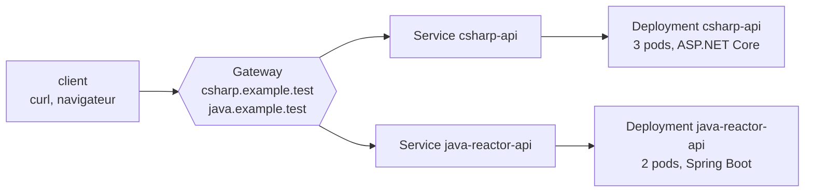

:::note[Versions étudiées]
[Kubernetes](https://kubernetes.io/docs/home/) **1.37.0**, la dernière version mineure au 2026-09-15, publiée le 2026-08-26 et [maintenue jusqu'au 2027-10-28](https://kubernetes.io/releases/). Le cluster local est [kind](https://kind.sigs.k8s.io/) **0.33.0** avec son image de nœud `kindest/node:v1.37.0`, épinglée par digest, et `kubectl` **1.37.0**. La leçon 4 ajoute [cloud-provider-kind](https://github.com/kubernetes-sigs/cloud-provider-kind) **0.11.1** pour les répartiteurs de charge et la Gateway API. Chaque manifeste et chaque commande se trouvent dans [`code/kubernetes`](https://github.com/spareilleux/learn/tree/main/code/kubernetes) : [`check.sh`](https://github.com/spareilleux/learn/blob/main/code/kubernetes/check.sh) exécute chaque leçon contre le cluster et compare ses sorties avec [`expected`](https://github.com/spareilleux/learn/tree/main/code/kubernetes/expected), après avoir remplacé les âges, les noms générés et les adresses IP. La CI valide les manifestes avec [kubeconform](https://github.com/yannh/kubeconform) sous Windows, Linux et macOS, et n'exécute les leçons sur un cluster kind que sous Linux, parce que les runners Windows et macOS de GitHub n'ont pas Docker.
:::

## Pourquoi j'apprends ça

Je sais construire une image et la lancer ; le [cours Conteneurs WSL](../wsl-containers/) s'arrête là. Puis quelqu'un dit « déploie-la sur le cluster », et je copie un fichier YAML d'un autre service, je change le nom, et j'espère. Quand un pod redémarre en boucle, ou qu'un Service ne répond rien, j'essaie des choses jusqu'à ce que ça marche, sans savoir laquelle a marché.

Je veux savoir ce que Kubernetes fait de ce que je déclare : quel composant agit dessus, dans quel ordre, et ce que signifie chaque état et chaque événement. Pour écrire des manifestes en connaissance de cause, déployer sans interrompre le service, et trouver ce qui ne va pas à partir des réponses du cluster lui-même.

## À qui s'adresse ce cours

Vous êtes développeur C# ou Java, et vous avez déjà construit et lancé une image de conteneur. Vous n'avez pas besoin de connaître Kubernetes ni le réseau Linux. Les images viennent de la leçon 4 de [Conteneurs WSL](../wsl-containers/04-build-an-image/) ; les leçons sur la CI vous renvoient à [GitHub Actions](../github-actions/), et la leçon 13 à [RabbitMQ](../rabbitmq/) pour son opérateur Kubernetes.

## L'exemple fil rouge

Les deux petites API web du cours Conteneurs WSL, une API minimale ASP.NET Core et une API Spring Boot WebFlux, tournent sur un cluster kind d'un seul nœud. Chaque leçon ajoute ce dont un vrai déploiement a besoin : sondes et ressources, mises à jour progressives, adresse stable, configuration, stockage, sécurité, empaquetage.

[Guitar Alchemist](https://github.com/GuitarAlchemist/ga) tourne sur Docker Compose et .NET Aspire, avec un chantier Kubernetes prévu ; la leçon 2 compare les sondes de son guide de déploiement avec ses images.

## À la fin de ce cours, je saurai

- expliquer ce que le serveur d'API, etcd, l'ordonnanceur, les contrôleurs et le kubelet font chacun d'un manifeste ;
- lancer un cluster local avec kind, et utiliser `kubectl` dessus sans toucher à mes autres clusters ;
- écrire des pods avec les bonnes sondes, requests et limits, et lire leurs conditions et leurs événements ;
- déployer les API C# et Spring avec des mises à jour progressives, et revenir en arrière après une version ratée ;
- leur donner une adresse stable dans le cluster et hors du cluster, avec les Services, le DNS, la Gateway API et Ingress ;
- les configurer, leur donner du stockage, et exécuter des tâches et des agents par nœud ;
- contrôler où les pods tournent, combien tournent, et ce qu'ils ont le droit de faire ;
- empaqueter un déploiement avec Helm et Kustomize, et le livrer en GitOps ;
- dépanner `CrashLoopBackOff`, `ImagePullBackOff`, `Pending` et `OOMKilled` à partir des informations du cluster lui-même ;
- savoir ce qui change sur AKS, EKS et GKE.

## Plan

| # | Leçon | Vous connaissez peut-être |
|---|---|---|
| 1 | [Architecture et cluster local](01-architecture-and-local-cluster/) | `docker run`, Docker Compose, une politique de redémarrage |
| 2 | [Pods](02-pods/) | les health checks d'ASP.NET Core, Spring Boot Actuator, `docker logs` |
| 3 | [Deployments](03-deployments/) | les déploiements blue/green, les emplacements de déploiement d'Azure App Service |
| 4 | [Services et DNS](04-services-and-dns/) | un reverse proxy, YARP, Spring Cloud Gateway, `/etc/hosts` |
| 5 | Configuration : ConfigMaps et Secrets *(prochainement)* | `appsettings.json`, `application.yml`, les variables d'environnement |
| 6 | Stockage : volumes, PersistentVolumes, StatefulSets | les volumes Docker, une base de données dans un conteneur |
| 7 | Jobs, CronJobs et DaemonSets | `BackgroundService`, `@Scheduled`, un service Windows |
| 8 | Ordonnancement : affinités, taints, répartition topologique, priorités, budgets de perturbation | |
| 9 | Mise à l'échelle : HPA, metrics-server, VPA, cluster autoscaler | les règles de scale-out d'App Service |
| 10 | Sécurité : RBAC, ServiceAccounts, Pod Security Standards, NetworkPolicies | les stratégies d'autorisation d'ASP.NET Core, Spring Security |
| 11 | Empaquetage : Helm et Kustomize | NuGet et Maven, `appsettings.Production.json` |
| 12 | Observabilité et dépannage | OpenTelemetry, `dotnet-counters`, Micrometer |
| 13 | Étendre Kubernetes : CRD et opérateurs | |
| 14 | Livraison continue : GitOps avec Argo CD ou Flux, CI avec GitHub Actions | [GitHub Actions](../github-actions/) |
| 15 | En production : AKS, EKS, GKE, coûts, mises à jour | Azure, AWS ou Google Cloud |

[Journal](journal/) : ce que j'ai essayé, ce qui m'a surpris, ce qu'il me reste à vérifier.

## Ressources

- [Documentation de Kubernetes](https://kubernetes.io/docs/home/), en particulier les [Concepts](https://kubernetes.io/docs/concepts/), la [référence de `kubectl`](https://kubernetes.io/docs/reference/kubectl/) et la [référence de l'API](https://kubernetes.io/docs/reference/kubernetes-api/)
- [Documentation de kind](https://kind.sigs.k8s.io/), avec ses [problèmes connus](https://kind.sigs.k8s.io/docs/user/known-issues/)
- [Gateway API](https://gateway-api.sigs.k8s.io/)
- [Notes de version de Kubernetes](https://kubernetes.io/releases/) et le [blog de Kubernetes](https://kubernetes.io/blog/), où chaque version annonce ses changements et ses dépréciations
- [Documentation d'Azure Kubernetes Service](https://learn.microsoft.com/azure/aks/)
- Code source : [kubernetes/kubernetes](https://github.com/kubernetes/kubernetes), [kubernetes-sigs/kind](https://github.com/kubernetes-sigs/kind), [kubernetes-sigs/cloud-provider-kind](https://github.com/kubernetes-sigs/cloud-provider-kind)
