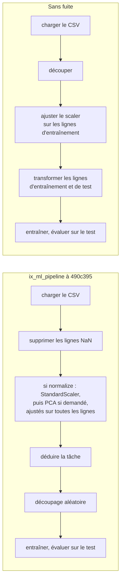

import { Tabs, TabItem } from '@astrojs/starlight/components';

Un modèle d'apprentissage automatique est une fonction que tu n'écris pas : tu donnes des exemples d'entrées et les réponses que tu attends, et un algorithme choisit la fonction. Avant tout algorithme, cette leçon répond à deux questions qui décident si le résultat veut dire quelque chose. Quelles sont exactement les entrées et les réponses ? Et comment mesurer si la fonction est bonne, sur des exemples qu'elle n'a pas vus ?

| | ML.NET | Tribuo | IX |
|---|---|---|---|
| Un exemple | une ligne d'un `IDataView` | un `Example<T>` | une ligne d'un `Array2<f64>` |
| Les caractéristiques | une colonne `Features` de type vecteur | les caractéristiques de l'`Example` | les colonnes de la matrice |
| L'étiquette | une colonne `Label` | la sortie `T` : `Label`, `Regressor` | un `Array1<f64>` (régression) ou `Array1<usize>` (classes 0, 1, 2…) |
| Découpage | [`TrainTestSplit`](https://learn.microsoft.com/dotnet/api/microsoft.ml.dataoperationscatalog.traintestsplit) | [`TrainTestSplitter`](https://tribuo.org/learn/4.3/javadoc/org/tribuo/evaluation/TrainTestSplitter.html) | `train_test_split` |
| Scores | [`RegressionMetrics`](https://learn.microsoft.com/dotnet/api/microsoft.ml.data.regressionmetrics), [`MulticlassClassificationMetrics`](https://learn.microsoft.com/dotnet/api/microsoft.ml.data.multiclassclassificationmetrics) | [`RegressionEvaluation`](https://tribuo.org/learn/4.3/javadoc/org/tribuo/regression/evaluation/RegressionEvaluation.html), [`LabelEvaluation`](https://tribuo.org/learn/4.3/javadoc/org/tribuo/classification/evaluation/LabelEvaluation.html) | fonctions de `ix_supervised::metrics` |

## Exécuter le code

Le code du cours est un projet Cargo dans `code/machine-learning-ix`, avec un exemple par leçon et un par série de solutions d'exercices. Il te faut [Rust](https://www.rust-lang.org/tools/install) ; le premier build télécharge IX depuis GitHub et le compile. La vérification croisée a besoin de [Python](https://www.python.org/downloads/) avec numpy et scikit-learn.

<Tabs syncKey="os">
<TabItem label="Windows">

```powershell
cd code\machine-learning-ix
cargo run --release --example l01_evaluation
pip install numpy==2.4.2 scikit-learn==1.8.0
python crosscheck\crosscheck.py
```

</TabItem>
<TabItem label="Linux / WSL">

```bash
cd code/machine-learning-ix
cargo run --release --example l01_evaluation
python3 -m pip install numpy==2.4.2 scikit-learn==1.8.0
python3 crosscheck/crosscheck.py
```

</TabItem>
<TabItem label="macOS">

```bash
cd code/machine-learning-ix
cargo run --release --example l01_evaluation
python3 -m pip install numpy==2.4.2 scikit-learn==1.8.0
python3 crosscheck/crosscheck.py
```

</TabItem>
</Tabs>

`bash check.sh` exécute ce qu'exécute la CI : formatage, [clippy](https://doc.rust-lang.org/clippy/), tests unitaires, puis chaque exemple, comparé avec `expected/`.

## Caractéristiques et étiquettes

Un jeu de données d'apprentissage supervisé, c'est deux choses : une matrice **X** avec une ligne par exemple et une colonne par **caractéristique** (*feature*), et un vecteur **y** avec une **étiquette** (*label*) par ligne. Dans IX, les deux sont des tableaux [ndarray](https://docs.rs/ndarray/0.17/ndarray/), si bien que le cours charge ses fichiers CSV avec la crate [csv](https://docs.rs/csv/latest/csv/) dans les mêmes types ([`src/data.rs`, lignes 35-46](https://github.com/spareilleux/learn/blob/15cde43/code/machine-learning-ix/src/data.rs#L35-L46)) :

```rust
pub fn load_builds(path: impl AsRef<Path>) -> Builds {
    let (_, rows) = records(path.as_ref());
    let n = rows.len();
    let pages = Array2::from_shape_fn((n, 1), |(i, _)| rows[i][2].parse().unwrap());
    let seconds = rows.iter().map(|r| r[3].parse().unwrap()).collect();
    // …
}
```

`pages` est une matrice à une colonne, pas un vecteur : chaque modèle IX prend un `Array2`, même avec une seule caractéristique.

Le premier jeu de données pose une question de régression : combien de secondes prend le build de ce site, étant donné le nombre de pages ? Les premières lignes de `builds.csv`, et la première sortie de [`examples/l01_evaluation.rs`](https://github.com/spareilleux/learn/blob/15cde43/code/machine-learning-ix/examples/l01_evaluation.rs) :

```text
created_at,sha,pages,build_seconds
2026-09-13T15:53:16Z,eda2608,18,10
2026-09-13T16:05:01Z,f43ba7e,110,12
```

```text
== builds.csv
x: [65, 1] [18.0, 110.0, 122.0], y: 65
y mean 18.846, std 5.424 (hand)
y mean 18.846, std 5.424 (ix_math::stats)
```

Les deux écarts-types divisent par `n`, pas par `n - 1` : [`ix_math::stats::std_dev`](https://github.com/GuitarAlchemist/ix/blob/490c39533627d296bf9f8f050e6fafc14d7a20c2/crates/ix-math/src/stats.rs#L15-L40) est l'écart-type de la population, comme celui de numpy par défaut ; `sample_variance`, juste à côté, divise par `n - 1`.

### Où IX lit ses données

Le lecteur CSV d'IX, [`ix_io::csv_io::read_csv`](https://github.com/GuitarAlchemist/ix/blob/490c39533627d296bf9f8f050e6fafc14d7a20c2/crates/ix-io/src/csv_io.rs#L12-L38), analyse chaque champ comme un `f64`, et un champ qui n'est pas un nombre devient `NaN`, sans erreur. [`DataBatch::to_array2`](https://github.com/GuitarAlchemist/ix/blob/490c39533627d296bf9f8f050e6fafc14d7a20c2/crates/ix-io/src/protocol.rs#L95-L106) empile ensuite les lignes dans la matrice. Lu ainsi, `builds.csv` aurait une colonne de dates `NaN` et une colonne de hashes de commit `NaN`. Le pipeline ML derrière l'outil `ix_ml_pipeline` supprime par défaut chaque ligne qui contient un `NaN` : sur un tel fichier, il supprimerait toutes les lignes et s'arrêterait avec `All rows contain NaN values` (d'après la lecture de [`ml_pipeline.rs`, lignes 167-188](https://github.com/GuitarAlchemist/ix/blob/490c39533627d296bf9f8f050e6fafc14d7a20c2/crates/ix-agent/src/ml_pipeline.rs#L167-L188) ; *à vérifier* en exécutant l'outil). Ne garde que des colonnes numériques dans un fichier que tu donnes à IX.

## Entraînement et test

Un modèle se juge sur des lignes dont il n'a pas appris : sinon un modèle qui mémorise les réponses aurait un score parfait. On découpe donc les lignes en deux : un **jeu d'entraînement** pour ajuster le modèle, un **jeu de test** pour l'évaluer, utilisé une seule fois, à la fin.

La façon de découper dépend de la question. Les builds sont dans l'ordre chronologique, et la question porte sur le prochain build : le découpage honnête entraîne sur le passé et teste sur les 20 % les plus récents ([`src/evaluation.rs`, lignes 5-10](https://github.com/spareilleux/learn/blob/15cde43/code/machine-learning-ix/src/evaluation.rs#L5-L10)). [`ix_math::preprocessing::train_test_split`](https://github.com/GuitarAlchemist/ix/blob/490c39533627d296bf9f8f050e6fafc14d7a20c2/crates/ix-math/src/preprocessing.rs#L157-L200) mélange d'abord les lignes, comme `TrainTestSplit` de ML.NET et [`train_test_split`](https://scikit-learn.org/stable/modules/generated/sklearn.model_selection.train_test_split.html) de scikit-learn :

```text
== split
chronological: train 52, test 13, test pages 274..289
ix train_test_split: train 52, test 13, test pages [138, 253, 253, 130, 280, 241, 271, 130, 138, 138, 289, 274, 138]
```

Le jeu de test aléatoire mélange des builds du premier jour avec des builds de la dernière heure : on interrogerait le modèle sur le passé, avec le futur dans son jeu d'entraînement. Pour les séries temporelles, scikit-learn a [`TimeSeriesSplit`](https://scikit-learn.org/stable/modules/generated/sklearn.model_selection.TimeSeriesSplit.html) ; le `train_test_split` d'IX mélange toujours.

## Une référence et quatre métriques de régression

Avant tout modèle, une **référence** (*baseline*) : la prédiction la plus simple, qui n'utilise aucune caractéristique. Pour un nombre, c'est la moyenne des étiquettes d'entraînement, 17.385 secondes, pour chaque build de test. Un modèle qui ne la bat pas n'a rien appris.

Avec `yᵢ` les vraies valeurs, `pᵢ` les prédictions et `ȳ` la moyenne des vraies valeurs :

| Métrique | Formule | Unité | Se lit comme |
|---|---|---|---|
| MSE, erreur quadratique moyenne | `1/n Σ (yᵢ - pᵢ)²` | secondes² | pénalise surtout les grandes erreurs |
| RMSE | `√MSE` | secondes | une erreur typique, pondérée vers les grandes |
| MAE, erreur absolue moyenne | `1/n Σ abs(yᵢ - pᵢ)` | secondes | l'erreur moyenne |
| R², coefficient de détermination | `1 - Σ (yᵢ - pᵢ)² / Σ (yᵢ - ȳ)²` | aucune | 1 est parfait, 0 vaut autant que prédire `ȳ` |

Écrites à la main dans [`src/evaluation.rs`, lignes 47-61](https://github.com/spareilleux/learn/blob/15cde43/code/machine-learning-ix/src/evaluation.rs#L47-L61), et dans IX dans [`metrics.rs`, lignes 48-87](https://github.com/GuitarAlchemist/ix/blob/490c39533627d296bf9f8f050e6fafc14d7a20c2/crates/ix-supervised/src/metrics.rs#L48-L87) :

```text
== baseline on the chronological test set: always 17.385 s
hand: mse 107.000, rmse 10.344, mae 7.308, r2 -0.996
ix:   mse 107.000, rmse 10.344, mae 7.308, r2 -0.996
```

R² est négatif : le `ȳ` de sa formule est la moyenne des étiquettes de **test**, 24.69 secondes, et la référence prédit la moyenne d'entraînement. Les builds sont devenus plus lents à mesure que le site grandissait, si bien que la moyenne passée est une moins bonne estimation que la moyenne des builds de test eux-mêmes, qu'aucun modèle ne peut connaître d'avance. [`r2_score`](https://scikit-learn.org/stable/modules/model_evaluation.html) de scikit-learn donne le même −0.996 dans la vérification croisée.

## La mise à l'échelle, et le jeu de test qui fuit

Beaucoup d'algorithmes comparent les caractéristiques entre elles, ou font des pas de même taille dans toutes les directions : une caractéristique mesurée en centaines (des pages) pèse alors plus qu'une mesurée en unités (des secondes). **Standardiser** exprime chaque caractéristique en écarts-types par rapport à sa moyenne : `z = (x - μ) / σ`.

`μ` et `σ` sont appris à partir des données, comme les paramètres d'un modèle : ils doivent donc venir des seules lignes d'entraînement, puis être appliqués tels quels aux lignes de test. [`StandardScaler::fit` et `transform`](https://github.com/GuitarAlchemist/ix/blob/490c39533627d296bf9f8f050e6fafc14d7a20c2/crates/ix-math/src/preprocessing.rs#L25-L54) sont séparés pour cette raison, comme l'estimateur [`NormalizeMeanVariance`](https://learn.microsoft.com/dotnet/api/microsoft.ml.normalizationcatalog.normalizemeanvariance) de ML.NET et son transformer, et comme `fit` et `transform` de [`NormalizerStandardize`](https://javadoc.io/doc/org.nd4j/nd4j-api/latest/org/nd4j/linalg/dataset/api/preprocessor/NormalizerStandardize.html) dans Deeplearning4j :

```text
== scaling pages
hand, train rows: mean 184.038, std 62.476
ix,   train rows: mean 184.038, std 62.476
ix,   all rows:   mean 203.277, std 67.883
first test row scaled: 1.440 (train statistics), 1.042 (all rows)
```

Ajusté sur toutes les lignes, le *scaler* a vu le jeu de test : le premier build de test, 274 pages, se retrouve à 1.042 écart-type au-dessus de la moyenne au lieu de 1.440. Le modèle serait testé sur des données façonnées par le jeu de test lui-même : c'est une **fuite de données** (*leakage*), et elle donne des scores meilleurs que ceux qu'on obtiendra sur de nouvelles données ([scikit-learn, pièges courants](https://scikit-learn.org/stable/common_pitfalls.html)).

Le pipeline ML d'IX, le code derrière l'outil MCP `ix_ml_pipeline`, le fait dans le mauvais ordre quand `normalize` est activé (il est désactivé par défaut). [`run_pipeline`](https://github.com/GuitarAlchemist/ix/blob/490c39533627d296bf9f8f050e6fafc14d7a20c2/crates/ix-agent/src/ml_pipeline.rs#L190-L203) ajuste le scaler et la PCA sur toute la matrice, et c'est seulement ensuite que [`run_classification`](https://github.com/GuitarAlchemist/ix/blob/490c39533627d296bf9f8f050e6fafc14d7a20c2/crates/ix-agent/src/ml_pipeline.rs#L537-L538) et `run_regression` ([lignes 704-705](https://github.com/GuitarAlchemist/ix/blob/490c39533627d296bf9f8f050e6fafc14d7a20c2/crates/ix-agent/src/ml_pipeline.rs#L704-L705)) découpent les lignes :



L'effet sur un score dépend des données ; le mécanisme est celui affiché plus haut. J'ai lu cet ordre dans le code mais je n'ai pas exécuté l'outil (*à vérifier*).

## Régression ou classification ?

Le même pipeline devine la tâche quand elle n'est pas donnée, avec [`infer_task_type`](https://github.com/GuitarAlchemist/ix/blob/490c39533627d296bf9f8f050e6fafc14d7a20c2/crates/ix-math/src/preprocessing.rs#L234-L254) : si chaque étiquette est un entier positif ou nul et qu'il y a au plus 20 valeurs distinctes (le seuil que [passe `run_pipeline`](https://github.com/GuitarAlchemist/ix/blob/490c39533627d296bf9f8f050e6fafc14d7a20c2/crates/ix-agent/src/ml_pipeline.rs#L208-L221)), c'est une classification. Les temps de build sont des secondes entières :

```text
== infer_task_type: 18 distinct values -> MulticlassClassification { n_classes: 18 }
same seconds with 0.5 added to one row -> true
```

Chargé de prédire les secondes de build, le pipeline entraînerait un classifieur à 18 classes, où 23 secondes est aussi différent de 24 que de 48. Ajouter une demi-seconde à une ligne en refait une régression. Les étiquettes entières sont courantes en régression (des comptes, des prix en centimes, des durées) : passe donc la tâche explicitement.

## Métriques de classification

Le second jeu de données pose une question de classification : quel OS a exécuté un job CI, d'après les durées de ses étapes ? 121 des 186 jobs ont tourné sur Ubuntu, 34 sur Windows, 31 sur macOS. La référence est la classe la plus fréquente : toujours répondre `ubuntu`.

```text
== jobs.csv: [186, 5] ["queue_s", "setup_s", "checkout_s", "post_checkout_s", "complete_s"], classes ["ubuntu", "windows", "macos"] = [121, 34, 31]
confusion matrix (rows = true class, columns = predicted):
[[121, 0, 0],
 [34, 0, 0],
 [31, 0, 0]]
accuracy 0.651 (hand), 0.651 (ix)
```

L'**exactitude** (*accuracy*), la part de bonnes réponses, est de 65 % pour un modèle qui ne regarde jamais un job. Avec des classes déséquilibrées, l'exactitude seule cache si les classes rares sont jamais trouvées. La **matrice de confusion** le montre : `m[t][p]` compte les lignes de vraie classe `t` prédites comme `p`. Pour une classe `c` :

- **précision** = `m[c][c] / Σₜ m[t][c]` : parmi les jobs prédits `c`, la part qui sont vraiment `c` ;
- **rappel** = `m[c][c] / Σₚ m[c][p]` : parmi les jobs qui sont `c`, la part prédite `c` ;
- **F1** = `2 · precision · recall / (precision + recall)` : élevé seulement quand les deux le sont.

La moyenne **macro** prend la moyenne sur les classes, si bien que chaque classe compte autant, quelle que soit sa taille ([`src/evaluation.rs`, lignes 78-90](https://github.com/spareilleux/learn/blob/15cde43/code/machine-learning-ix/src/evaluation.rs#L78-L90) ; IX [`metrics.rs`, lignes 91-148](https://github.com/GuitarAlchemist/ix/blob/490c39533627d296bf9f8f050e6fafc14d7a20c2/crates/ix-supervised/src/metrics.rs#L91-L148)) :

```text
ubuntu   precision 0.651 recall 1.000 f1 0.788 | ix 0.651 1.000 0.788
windows  precision 0.000 recall 0.000 f1 0.000 | ix 0.000 0.000 0.000
macos    precision 0.000 recall 0.000 f1 0.000 | ix 0.000 0.000 0.000
macro f1 0.263 (hand), 0.263 (ix f1_avg)
Confusion Matrix:
pred →	0	1	2
true 0:	121	0	0
true 1:	34	0	0
true 2:	31	0	0
```

Un F1 macro de 0.263 dit ce que l'exactitude cachait. Une précision sans aucune prédiction vaut 0/0 : IX et la version à la main renvoient 0, comme scikit-learn par défaut, avec un avertissement. [`MacroAccuracy`](https://learn.microsoft.com/dotnet/api/microsoft.ml.data.multiclassclassificationmetrics) de ML.NET suit la même idée : l'exactitude de chaque classe, moyennée sur les classes.

## À retenir

- Les caractéristiques sont une matrice, les étiquettes un vecteur ; les modèles IX prennent un `Array2<f64>` même pour une seule caractéristique, et le lecteur CSV d'IX transforme le texte en `NaN` sans rien dire.
- Découpe avant d'apprendre quoi que ce soit des données, scaler compris ; découpe selon le temps quand la question porte sur le futur.
- Compare chaque modèle avec une référence. Le R² sur un jeu de test peut être négatif.
- Avec des classes déséquilibrées, lis la matrice de confusion et les scores par classe ou macro, pas l'exactitude seule.
- Le pipeline ML d'IX, quand on lui demande de normaliser, ajuste son scaler avant de découper ; il appelle aussi classification toute cible entière à peu de valeurs : passe la tâche, et ne te fie pas à ses scores de test sans vérifier l'ordre.

## Exercices

Les solutions sont dans [`examples/l01_exercises.rs`](https://github.com/spareilleux/learn/blob/15cde43/code/machine-learning-ix/examples/l01_exercises.rs), et leur sortie dans `expected/l01_exercises.txt` : la CI les vérifie avec le reste.

1. Une meilleure référence pour une série temporelle : prédire chaque build de test avec les secondes du build juste avant. Évalue-la avec la MAE, la RMSE et le R² d'IX, à côté de la moyenne d'entraînement.

<details>
<summary>Solution</summary>

[Lignes 12-27](https://github.com/spareilleux/learn/blob/15cde43/code/machine-learning-ix/examples/l01_exercises.rs#L12-L27) :

```rust
let previous: Array1<f64> = test.iter().map(|&i| y[i - 1]).collect();
let mean = Array1::from_elem(test.len(), hand::mean(&pick(y, &train)));
for (name, p) in [("previous build", &previous), ("training mean", &mean)] {
    println!(
        "{name:14}: mae {:.3}, rmse {:.3}, r2 {:.3}",
        metrics::mae(&y_test, p),
        metrics::rmse(&y_test, p),
        metrics::r_squared(&y_test, p)
    );
}
```

```text
== exercise 1
previous build: mae 4.923, rmse 8.485, r2 -0.343
training mean : mae 7.308, rmse 10.344, r2 -0.996
```

Le build précédent est une meilleure référence sur chaque métrique : il suit la tendance. Le R² reste négatif, car le dernier build a pris 48 secondes, plus du double des 21 secondes de celui d'avant.

</details>

2. Combien de jobs macOS tombent dans un jeu de test aléatoire de 20 % ? Compte-les pour `train_test_split` avec les graines 0 à 9, puis compte-les dans chaque pli de test du `StratifiedKFold` d'IX à 5 plis.

<details>
<summary>Solution</summary>

[Lignes 29-45](https://github.com/spareilleux/learn/blob/15cde43/code/machine-learning-ix/examples/l01_exercises.rs#L29-L45) :

```rust
let per_seed: Vec<usize> = (0..10)
    .map(|seed| {
        let split = train_test_split(&jobs.features, &labels, 0.2, seed).unwrap();
        split.y_test.iter().filter(|&&c| c == 2.0).count()
    })
    .collect();
let folds = StratifiedKFold::new(5).split(&jobs.os);
```

```text
== exercise 2
macos jobs in the 37 test rows of train_test_split, seeds 0 to 9: [6, 7, 6, 5, 7, 4, 7, 1, 7, 5]
StratifiedKFold(5), (test rows, macos jobs) per fold: [(39, 7), (37, 6), (37, 6), (37, 6), (36, 6)]
```

31 jobs macOS sur 186, c'est 17 %, environ 6 sur 37 lignes. Un découpage aléatoire en donne entre 1 et 7 : avec la graine 7, le jeu de test n'a qu'un seul job macOS, et un rappel pour macOS vaudrait 0 ou 1. Un découpage **stratifié** garde la part de chaque classe dans chaque pli : [`StratifiedKFold::split`](https://github.com/GuitarAlchemist/ix/blob/490c39533627d296bf9f8f050e6fafc14d7a20c2/crates/ix-supervised/src/validation.rs#L169-L211) mélange les lignes de chaque classe et les distribue aux plis tour à tour. `train_test_split` prend `labels` en `f64`, le type de la régression, et n'a pas d'option stratifiée.

</details>

## Sources

- [scikit-learn : évaluation des modèles](https://scikit-learn.org/stable/modules/model_evaluation.html) et [pièges courants](https://scikit-learn.org/stable/common_pitfalls.html)
- [ML.NET : métriques d'évaluation](https://learn.microsoft.com/dotnet/machine-learning/resources/metrics)
- James, Witten, Hastie, Tibshirani, Taylor, *[An Introduction to Statistical Learning](https://www.statlearning.com/)*, chapitres 2 et 5
- IX à `490c395` : [`ix-math/src/preprocessing.rs`](https://github.com/GuitarAlchemist/ix/blob/490c39533627d296bf9f8f050e6fafc14d7a20c2/crates/ix-math/src/preprocessing.rs), [`ix-supervised/src/metrics.rs`](https://github.com/GuitarAlchemist/ix/blob/490c39533627d296bf9f8f050e6fafc14d7a20c2/crates/ix-supervised/src/metrics.rs), [`ix-agent/src/ml_pipeline.rs`](https://github.com/GuitarAlchemist/ix/blob/490c39533627d296bf9f8f050e6fafc14d7a20c2/crates/ix-agent/src/ml_pipeline.rs)
