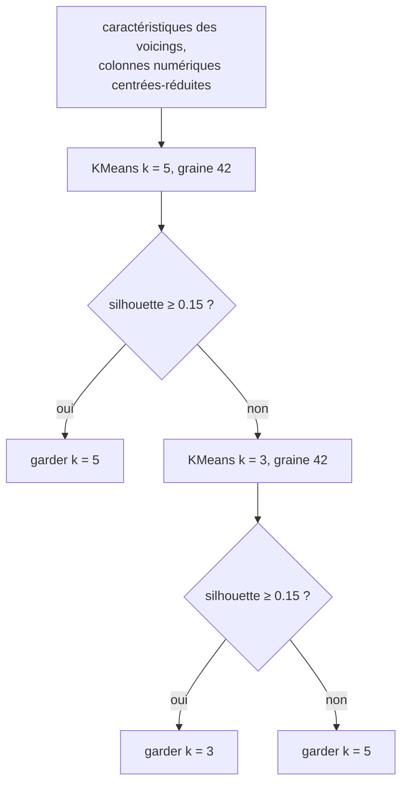

Les leçons 2 et 3 apprenaient à partir de réponses : les secondes de build, l'OS de chaque job. Le **partitionnement** (*clustering*) n'a pas de réponses. Il cherche des groupes de lignes proches les unes des autres et éloignées du reste, et c'est à toi de dire si les groupes veulent dire quelque chose. Cette leçon cache l'OS des 186 jobs, partitionne leurs cinq durées, et seulement ensuite regarde l'OS : une vérification qu'on a rarement sur des données réelles.

IX utilise le partitionnement sur ses propres données : la crate `ix-voicings` regroupe les *voicings* de guitare qu'énumère [GA](https://github.com/GuitarAlchemist/ga), avec k-means et une règle pour choisir le nombre de groupes. Cette leçon applique cette règle aux jobs.

| | ML.NET | Tribuo | scikit-learn | IX |
|---|---|---|---|---|
| k-means | [`KMeansTrainer`](https://learn.microsoft.com/dotnet/api/microsoft.ml.trainers.kmeanstrainer) | [`KMeansTrainer`](https://tribuo.org/learn/4.3/javadoc/org/tribuo/clustering/kmeans/KMeansTrainer.html) | [`KMeans`](https://scikit-learn.org/stable/modules/generated/sklearn.cluster.KMeans.html) | `ix_unsupervised::kmeans::KMeans` |
| Densité | — | [`HdbscanTrainer`](https://tribuo.org/learn/4.3/javadoc/org/tribuo/clustering/hdbscan/HdbscanTrainer.html) | [`DBSCAN`](https://scikit-learn.org/stable/modules/generated/sklearn.cluster.DBSCAN.html) | `ix_unsupervised::dbscan::DBSCAN` |
| Mélange gaussien | — | — | [`GaussianMixture`](https://scikit-learn.org/stable/modules/generated/sklearn.mixture.GaussianMixture.html) | `ix_unsupervised::gmm::GMM` |
| Silhouette | — | — | [`silhouette_score`](https://scikit-learn.org/stable/modules/generated/sklearn.metrics.silhouette_score.html) | `ix_voicings::silhouette_score` |

Dans IX, les trois algorithmes implémentent [`Clusterer`](https://github.com/GuitarAlchemist/ix/blob/490c39533627d296bf9f8f050e6fafc14d7a20c2/crates/ix-unsupervised/src/traits.rs#L5-L13) : `fit`, `predict`, et `fit_predict`, qui renvoie un indice de cluster par ligne. Le tutoriel d'IX les importe avec `use ix_unsupervised::{KMeans, Clusterer};` ([`docs/unsupervised-learning/kmeans.md`, ligne 60](https://github.com/GuitarAlchemist/ix/blob/490c39533627d296bf9f8f050e6fafc14d7a20c2/docs/unsupervised-learning/kmeans.md?plain=1#L60)), ce qui ne compile pas : la crate exporte ses modules, pas les types qu'ils contiennent ([`lib.rs`](https://github.com/GuitarAlchemist/ix/blob/490c39533627d296bf9f8f050e6fafc14d7a20c2/crates/ix-unsupervised/src/lib.rs#L5-L14)). Les chemins qui fonctionnent sont `ix_unsupervised::kmeans::KMeans` et `ix_unsupervised::traits::Clusterer` ; le cours garde les deux comme doctests, celui qui échoue en `compile_fail` ([`src/lib.rs`, lignes 4-20](https://github.com/spareilleux/learn/blob/15cde43/code/machine-learning-ix/src/lib.rs#L4-L20)).

Le programme est [`examples/l04_clustering.rs`](https://github.com/spareilleux/learn/blob/15cde43/code/machine-learning-ix/examples/l04_clustering.rs). Les clusters sont faits de distances, alors il standardise d'abord les cinq durées, avec toutes les lignes : il n'y a pas de jeu de test en partitionnement.

## k-means

k-means cherche `k` centres, les **centroïdes**, et place chaque ligne dans le cluster de son centroïde le plus proche. Les meilleurs centroïdes sont ceux qui minimisent l'**inertie**, la somme des carrés des distances de chaque ligne à son centroïde :

```text
inertia = Σᵢ ‖xᵢ - μ(cᵢ)‖²
```

Trouver le vrai minimum est difficile, alors l'**algorithme de Lloyd** alterne deux étapes qui font chacune baisser l'inertie, jusqu'à ce que plus rien ne change :

1. affecter chaque ligne à son centroïde le plus proche ;
2. déplacer chaque centroïde à la moyenne de ses lignes.

[`src/cluster.rs`, lignes 20-56](https://github.com/spareilleux/learn/blob/15cde43/code/machine-learning-ix/src/cluster.rs#L20-L56) :

```rust
pub fn lloyd_step(x: &Array2<f64>, centroids: &Array2<f64>) -> (Array1<usize>, Array2<f64>) {
    let labels: Array1<usize> = x
        .rows()
        .into_iter()
        .map(|r| nearest(r, centroids))
        .collect();
    let mut moved = centroids.clone();
    for c in 0..centroids.nrows() {
        let members: Vec<usize> = (0..x.nrows()).filter(|&i| labels[i] == c).collect();
        if !members.is_empty() {
            let sum = members
                .iter()
                .fold(Array1::<f64>::zeros(x.ncols()), |acc, &i| acc + x.row(i));
            moved.row_mut(c).assign(&(sum / members.len() as f64));
        }
    }
    (labels, moved)
}
```

Le point d'arrivée dépend du point de départ. [`KMeans::fit`](https://github.com/GuitarAlchemist/ix/blob/490c39533627d296bf9f8f050e6fafc14d7a20c2/crates/ix-unsupervised/src/kmeans.rs#L126-L164) commence par **k-means++** ([lignes 86-119](https://github.com/GuitarAlchemist/ix/blob/490c39533627d296bf9f8f050e6fafc14d7a20c2/crates/ix-unsupervised/src/kmeans.rs#L86-L119)) : le premier centroïde est une ligne au hasard, et chaque suivant est une ligne tirée avec une probabilité proportionnelle au carré de sa distance au centroïde le plus proche déjà choisi, si bien que les centroïdes de départ sont bien répartis. Il exécute ensuite les pas de Lloyd jusqu'à ce que les centroïdes bougent de moins de `1e-10` en distance au carré totale. Pour comparer, le programme lance la version à la main depuis les centroïdes finaux d'IX : si IX s'est arrêté sur un vrai point fixe, un pas ne change rien.

```text
== k-means, k = 3
ix centroid 0: [-0.318, 0.167, -0.503, -0.472, -0.281]
ix centroid 1: [2.302, -0.162, 0.031, -0.003, 1.668]
ix centroid 2: [-0.352, -0.526, 1.888, 1.791, -0.063]
ix inertia 411.2367, hand inertia 411.2367
hand Lloyd steps from ix centroids until nothing moves: 1, same labels: true
clusters (rows) against OS (columns ["ubuntu", "windows", "macos"]):
[[120, 0, 9],
 [1, 0, 22],
 [0, 34, 0]]
```

En écarts-types : le cluster 1 attend longtemps dans la file (+2.3) et se termine lentement (+1.7) ; le cluster 2 a de longs checkouts (+1.9, +1.8). Une fois révélé, l'OS s'aligne : le cluster 2 contient les 34 jobs Windows, le cluster 1 contient 22 des 31 jobs macOS, le cluster 0 est Ubuntu avec 9 jobs macOS. Les durées portent l'OS même quand personne ne le demande.

### Autre départ, autre réponse

```text
hand, starting from the first 3 rows: 5 steps, inertia 531.9563
ix, seeds 0 to 9: inertia [411.3595, 411.2367, 411.9568, 618.0229, 489.7771, 411.2367, 526.3602, 411.3595, 411.2367, 411.2322]
```

Les pas de Lloyd ne font que descendre, jusqu'au minimum **local** le plus proche. Dix graines donnent sept réponses différentes, de 411.23 à 618.02 ; la graine 42 se trouve être l'une des bonnes, et la graine 9 est légèrement meilleure. Le `n_init` de scikit-learn lance plusieurs départs et garde l'inertie la plus basse (la vérification croisée en utilise 50). IX lance un seul départ par `fit`, et son outil MCP `ix_kmeans` [utilise toujours la graine 42](https://github.com/GuitarAlchemist/ix/blob/490c39533627d296bf9f8f050e6fafc14d7a20c2/crates/ix-agent/src/handlers.rs#L301-L343) : pour obtenir un bon k-means d'IX, boucle toi-même sur les graines et garde l'inertie la plus basse.

## Choisir k

L'inertie baisse toujours quand `k` augmente : avec un cluster par ligne, elle vaut 0. L'inertie ne peut donc pas choisir `k`. La **silhouette** le peut. Pour chaque ligne `i`, avec `a` sa distance moyenne aux autres lignes de son cluster, et `b` sa distance moyenne aux lignes du cluster voisin le plus proche :

```text
s(i) = (b - a) / max(a, b)
```

`s` est proche de 1 quand la ligne est bien plus proche de son propre cluster, proche de 0 sur une frontière, négatif dans le mauvais cluster. Le score de silhouette est la moyenne de `s` sur toutes les lignes. Une ligne seule dans son cluster n'a pas de `a` ; la [définition de Rousseeuw](https://doi.org/10.1016/0377-0427(87)90125-7) fixe son `s` à 0 ([`src/cluster.rs`, lignes 106-133](https://github.com/spareilleux/learn/blob/15cde43/code/machine-learning-ix/src/cluster.rs#L106-L133)).

```text
== choosing k (ix KMeans, seed 42)
k 2: inertia  713.392, silhouette hand 0.4014, ix_voicings 0.4014
k 3: inertia  411.237, silhouette hand 0.4997, ix_voicings 0.4997
k 4: inertia  301.641, silhouette hand 0.4158, ix_voicings 0.4158
k 5: inertia  240.527, silhouette hand 0.4350, ix_voicings 0.4350
k 6: inertia  223.366, silhouette hand 0.3646, ix_voicings 0.3646
ix-voicings rule: silhouette(k = 5) = 0.4350 -> keep k = 5
```

La silhouette culmine à `k = 3`, le nombre d'OS. scikit-learn, en gardant le meilleur de 50 départs, est d'accord pour `k = 3` et `k = 4`, mais trouve de meilleurs partitionnements que le départ unique d'IX pour les autres : inertie de 631.311 pour `k = 2`, 240.416 pour `k = 5`, et 214.040 pour `k = 6`, dont la silhouette monte à 0.4400. Un départ unique ne donne pas seulement une moins bonne inertie : il peut changer le `k` qui paraît le meilleur.

### La règle d'ix-voicings

[`ix_voicings::cluster`](https://github.com/GuitarAlchemist/ix/blob/490c39533627d296bf9f8f050e6fafc14d7a20c2/crates/ix-voicings/src/lib.rs#L714-L786) lit les caractéristiques des voicings d'un instrument (écart de frettes, frettes utilisées, note la plus grave et la plus aiguë, qualité de l'accord…), centrées-réduites par `featurize`, et les partitionne :



C'est un seuil, pas une comparaison : `k = 5` est gardé dès que sa silhouette atteint 0.15 ([lignes 718-719 et 770-776](https://github.com/GuitarAlchemist/ix/blob/490c39533627d296bf9f8f050e6fafc14d7a20c2/crates/ix-voicings/src/lib.rs#L770-L776)), même quand `k = 3` aurait un meilleur score, comme c'est le cas sur les jobs (0.4997 contre 0.4350). Chaque candidat a droit à un départ, graine 42. Au-delà de 10 000 lignes, le score est calculé sur un échantillon de 5 000 ([lignes 611-628](https://github.com/GuitarAlchemist/ix/blob/490c39533627d296bf9f8f050e6fafc14d7a20c2/crates/ix-voicings/src/lib.rs#L611-L628)). J'ai exécuté la règle sur les jobs, pas sur les voicings de GA, dont l'export demande l'outil en ligne de commande de GA (*à vérifier*).

### Deux cas limites

```text
== edge cases
silhouette of [0, 1 | 10]: hand 0.5963, ix_voicings 0.9296
KMeans(3) on [5, 5, 9, 9]: centroids [5.0, 9.0, 0.0]
predict [1.0] -> cluster 2
```

**Une ligne seule dans son cluster.** Les lignes 0 et 1 ont pour score `(10 - 1) / 10 = 0.9` et `(9 - 1) / 9 = 0.889` ; la ligne 2 est seule et a pour score 0 : la moyenne est 0.5963, la valeur de scikit-learn dans la vérification croisée. [`silhouette_score_exact`](https://github.com/GuitarAlchemist/ix/blob/490c39533627d296bf9f8f050e6fafc14d7a20c2/crates/ix-voicings/src/lib.rs#L664-L678) fixe `a = 0` pour une ligne seule, si bien que son `s` devient `(b - 0) / b = 1` : la moyenne est 0.9296. Chaque cluster singleton fait monter le score d'IX, alors qu'il devrait compter pour 0 ; de petits clusters de valeurs aberrantes ressemblent à un bon partitionnement.

**Plus de clusters que de lignes distinctes.** Avec 3 clusters et 2 valeurs distinctes, k-means++ n'a plus aucune ligne à distance positive, et choisit un doublon. Un centroïde ne reçoit alors aucune ligne, et le pas de Lloyd n'a pas de moyenne vers laquelle le déplacer : la version à la main le laisse en place, et scikit-learn le déplace sur une ligne. [La mise à jour d'IX](https://github.com/GuitarAlchemist/ix/blob/490c39533627d296bf9f8f050e6fafc14d7a20c2/crates/ix-unsupervised/src/kmeans.rs#L137-L152) part d'une matrice de zéros et ne divise que les clusters qui ont des lignes, si bien que le centroïde d'un cluster vide saute à l'origine, `0.0`. `predict` envoie alors une nouvelle ligne, 1.0, vers un cluster qui ne contient aucune ligne d'entraînement. scikit-learn donne `[5.0, 9.0, 9.0]` et avertit qu'il a trouvé 2 clusters distincts. Sur des données standardisées, l'origine est la moyenne des données, si bien qu'un centroïde vidé atterrit au milieu des lignes ; je n'ai pas vu de cluster se vider au milieu d'une exécution réelle (*à vérifier*).

## DBSCAN

k-means a besoin de `k`, et dessine des clusters ronds autour de centres. **DBSCAN** n'a besoin ni de l'un ni de l'autre : il fait croître des clusters à partir des régions denses. Deux paramètres : un rayon `eps` et un nombre `min_points`.

- Un **point central** (*core point*) a au moins `min_points` lignes à moins de `eps`, lui compris.
- Un cluster est un ensemble de points centraux à moins de `eps` les uns des autres, de proche en proche, plus les lignes à moins de `eps` d'entre eux, les **points frontières** (*border points*).
- Toute autre ligne est du **bruit** : DBSCAN a le droit de dire qu'une ligne n'appartient à rien.

[`src/cluster.rs`, lignes 67-104](https://github.com/spareilleux/learn/blob/15cde43/code/machine-learning-ix/src/cluster.rs#L67-L104) étiquette le bruit `-1` et les clusters `0, 1, …`, comme scikit-learn. [Le DBSCAN d'IX](https://github.com/GuitarAlchemist/ix/blob/490c39533627d296bf9f8f050e6fafc14d7a20c2/crates/ix-unsupervised/src/dbscan.rs#L1-L13) renvoie des étiquettes `usize`, qui ne peuvent pas être négatives : le bruit est `0`, et les clusters commencent à `1`. Soustrais 1 pour comparer :

```text
== DBSCAN, min_points 5
eps 0.5: cluster sizes [12, 7, 15, 25, 23, 12, 6, 5, 7, 6], noise 68, ix labels - 1 == hand labels: true
eps 1: cluster sizes [84, 40, 13, 13, 7], noise 29, ix labels - 1 == hand labels: true
clusters (rows, noise last) against OS:
[[82, 0, 2],
 [34, 0, 6],
 [0, 13, 0],
 [0, 13, 0],
 [0, 0, 7],
 [5, 8, 16]]
eps 1.5: cluster sizes [162, 11], noise 13, ix labels - 1 == hand labels: true
eps 2: cluster sizes [164, 12], noise 10, ix labels - 1 == hand labels: true
```

Les mêmes tailles de clusters que scikit-learn, pour chaque `eps`. Le rayon décide de tout : 10 petits clusters et 68 jobs de bruit à 0.5, deux clusters à 2. Avec `eps = 1`, les clusters sont presque purs, deux surtout Ubuntu, deux entièrement Windows, un entièrement macOS, et le bruit contient 16 des 31 jobs macOS. Un code qui traite l'étiquette 0 comme un cluster, comme elle le serait dans scikit-learn, fond silencieusement le bruit d'IX dans un cluster.

## Mélanges gaussiens

k-means donne un seul cluster à chaque ligne. Un **mélange gaussien** dit que chaque ligne a été tirée de l'une de `k` courbes en cloche, et donne la probabilité de chacune. Chaque composante `k` a un poids `πₖ`, une moyenne `μₖ`, et ici une variance par caractéristique `σ²ₖ` (une covariance **diagonale** : les caractéristiques varient indépendamment au sein d'une composante). La densité du mélange :

```text
p(x) = Σₖ πₖ · Πⱼ exp(-(xⱼ - μₖⱼ)² / 2σ²ₖⱼ) / √(2π σ²ₖⱼ)
```

Les paramètres maximisent la **log-vraisemblance**, `Σᵢ ln p(xᵢ)`, trouvée par **espérance-maximisation** (EM), qui alterne deux étapes comme celles de Lloyd :

- E : pour chaque ligne, la **responsabilité** de chaque composante, `rᵢₖ = πₖ·pₖ(xᵢ) / p(xᵢ)`, une affectation souple ;
- M : réestimer chaque composante à partir des lignes, pondérées par leurs responsabilités : `πₖ = Σᵢ rᵢₖ / n`, `μₖ = Σᵢ rᵢₖ·xᵢ / Σᵢ rᵢₖ`, et les variances de même.

[`src/cluster.rs`, lignes 171-205](https://github.com/spareilleux/learn/blob/15cde43/code/machine-learning-ix/src/cluster.rs#L171-L205) écrit un pas ; [`GMM::fit`](https://github.com/GuitarAlchemist/ix/blob/490c39533627d296bf9f8f050e6fafc14d7a20c2/crates/ix-unsupervised/src/gmm.rs#L84-L193) part de `k` lignes distinctes tirées au hasard comme moyennes, de la variance des données comme variances, de poids égaux, et s'arrête quand la log-vraisemblance change de moins de `1e-6`. Comme pour k-means, le programme fait un pas de plus à la main à partir des paramètres d'IX :

```text
== Gaussian mixture, k = 3, diagonal covariances
weights [0.682, 0.175, 0.143]
log-likelihood ix 85.623, hand 85.623, after one more hand step 85.623
largest change of a mean in that step: below 1e-3
components (rows) against OS:
[[115, 0, 11],
 [3, 30, 0],
 [3, 4, 20]]
variance of queue_s         per component [0.392263, 0.143030, 1.747301]
variance of setup_s         per component [1.031510, 0.440962, 1.182363]
variance of checkout_s      per component [0.064918, 0.575761, 0.595058]
variance of post_checkout_s per component [0.248103, 0.581853, 0.435369]
variance of complete_s      per component [0.000001, 0.000001, 2.311161]
log-likelihood, seeds 0 to 9: [116.576, 116.576, 116.576, 552.879, -102.666, -102.666, 116.576, 116.576, -102.666, -102.666]
```

IX s'est arrêté sur un point fixe d'EM : le pas à la main ne change rien. Mais regarde `complete_s` : dans les composantes 0 et 1, sa variance vaut `0.000001`. Les durées sont des secondes entières, et les jobs que contiennent ces composantes ont le même `complete_s` : sa variance tombe à 0 ou presque, et [IX la remonte à `1e-6`](https://github.com/GuitarAlchemist/ix/blob/490c39533627d296bf9f8f050e6fafc14d7a20c2/crates/ix-unsupervised/src/gmm.rs#L170-L171) pour éviter de diviser par zéro. Une variance de `1e-6` rend la densité de ces lignes d'environ `1 / √(2π · 1e-6) ≈ 400` selon cette caractéristique, et ajoute environ `ln 400 ≈ 6` à la log-vraisemblance pour chacune d'elles. Plus le plancher est bas, plus la vraisemblance est grande : sur des données à valeurs répétées, la vraisemblance d'un mélange gaussien n'a pas de maximum, et EM récompense une composante qui s'effondre sur elles.

D'une graine à l'autre, la log-vraisemblance va de −102.666 à 552.879. Les valeurs les plus hautes ne sont pas de meilleurs modèles des jobs ; ce sont des modèles plus effondrés. scikit-learn, avec 10 départs initialisés par k-means et `reg_covar = 1e-6` ajouté à chaque variance, garde une solution à −102.667, à 0.001 près des graines 4, 5, 8 et 9 d'IX : puisqu'il garde le meilleur de ses départs, aucun d'eux n'a atteint une solution effondrée. Avec le départ unique d'IX et un plancher, la réponse dépend de la graine ; ne compare les log-vraisemblances qu'entre des modèles où aucune variance n'est au plancher.

## À retenir

- k-means minimise l'inertie par les pas de Lloyd à partir d'un départ k-means++, et s'arrête sur un minimum local : IX lance un seul départ, alors essaie plusieurs graines.
- L'inertie ne peut pas choisir `k` ; la silhouette le peut. La silhouette d'IX dans `ix-voicings` donne 1 à un singleton au lieu de 0, et sa règle garde `k = 5` dès que la silhouette atteint 0.15.
- Un cluster k-means vide dans IX déplace son centroïde à l'origine.
- DBSCAN trouve des clusters de n'importe quelle forme et appelle le reste du bruit ; IX étiquette le bruit 0 et les clusters à partir de 1.
- Un mélange gaussien donne des affectations souples par EM. Sur des caractéristiques discrètes, sa vraisemblance grandit à mesure qu'une variance s'effondre : une vraisemblance plus élevée peut signaler un moins bon modèle.

## Exercices

Les solutions sont dans [`examples/l04_exercises.rs`](https://github.com/spareilleux/learn/blob/15cde43/code/machine-learning-ix/examples/l04_exercises.rs), et leur sortie dans `expected/l04_exercises.txt`.

1. Exécute k-means avec `k = 3` (graine 42) sur les durées brutes, sans standardiser. Compare sa silhouette et ses clusters face à l'OS avec ceux des durées standardisées. Quel est le meilleur partitionnement ?

<details>
<summary>Solution</summary>

[Lignes 16-28](https://github.com/spareilleux/learn/blob/15cde43/code/machine-learning-ix/examples/l04_exercises.rs#L16-L28) :

```rust
for (name, x) in [("raw", &jobs.features), ("standardized", &z)] {
    let labels = KMeans::new(3).with_seed(42).fit_predict(x);
    let mut table = Array2::<usize>::zeros((3, 3));
    for (&l, &o) in labels.iter().zip(&jobs.os) {
        table[[l, o]] += 1;
    }
    // …
}
```

```text
== exercise 1
raw: silhouette 0.5814, clusters (rows) against ["ubuntu", "windows", "macos"]:
[[118, 0, 6],
 [1, 34, 0],
 [2, 0, 25]]
standardized: silhouette 0.4997, clusters (rows) against ["ubuntu", "windows", "macos"]:
[[120, 0, 9],
 [1, 0, 22],
 [0, 34, 0]]
```

Les durées brutes donnent une silhouette plus élevée et des clusters un peu plus proches de l'OS : 9 jobs hors du cluster de leur OS, contre 10. Mais les deux silhouettes ne sont pas comparables : l'une mesure des distances en secondes, l'autre en écarts-types, et les distances brutes sont dominées par les durées qui varient le plus. Mettre à l'échelle ou non est un choix sur ce que « proche » veut dire, fait avant le partitionnement ; aucun score calculé après ne peut le faire à ta place. Ici, les étiquettes le pourraient, parce que nous les avons.

</details>

2. Avec DBSCAN, `eps = 1.0` et `min_points = 5` sur les durées standardisées, compte les jobs de bruit par workflow et par OS, et compare leur `queue_s` moyen avec celui des jobs regroupés.

<details>
<summary>Solution</summary>

[Lignes 30-57](https://github.com/spareilleux/learn/blob/15cde43/code/machine-learning-ix/examples/l04_exercises.rs#L30-L57) :

```rust
let labels = DBSCAN::new(1.0, 5).fit_predict(&z);
let mut noise: BTreeMap<(String, &str), usize> = BTreeMap::new();
for (i, &l) in labels.iter().enumerate() {
    if l == 0 {
        *noise
            .entry((jobs.workflows[i].clone(), OS_NAMES[jobs.os[i]]))
            .or_default() += 1;
    }
}
```

```text
== exercise 2
 3 Deploy to GitHub Pages (ubuntu)
 3 GHA 02: build and test (macos)
 1 GHA 02: build and test (ubuntu)
 1 GHA 02: build and test (windows)
 1 GHA 05: caches and artifacts (ubuntu)
 2 GHA 05: caches and artifacts (windows)
 2 GHA 10: custom actions (macos)
 2 Java course examples (macos)
 3 Java course examples (windows)
 9 Rust course examples (macos)
 2 Rust course examples (windows)
mean queue_s: noise 6.97, clustered 3.69
```

`l == 0` est du bruit parce que c'est le DBSCAN d'IX. Les jobs de bruit ont attendu presque deux fois plus longtemps un runner, et le plus grand groupe est celui des jobs macOS du cours Rust : le bruit, ici, c'est surtout « a attendu anormalement longtemps », le genre de ligne que signale un détecteur d'anomalies construit sur DBSCAN.

</details>

## Sources

- James, Witten, Hastie, Tibshirani, Taylor, *[An Introduction to Statistical Learning](https://www.statlearning.com/)*, chapitre 12 (partitionnement)
- Rousseeuw, P. J. (1987), [*Silhouettes: a graphical aid to the interpretation and validation of cluster analysis*](https://doi.org/10.1016/0377-0427(87)90125-7), Journal of Computational and Applied Mathematics 20
- [scikit-learn : partitionnement](https://scikit-learn.org/stable/modules/clustering.html) et [modèles de mélanges gaussiens](https://scikit-learn.org/stable/modules/mixture.html)
- IX à `490c395` : [`kmeans.rs`](https://github.com/GuitarAlchemist/ix/blob/490c39533627d296bf9f8f050e6fafc14d7a20c2/crates/ix-unsupervised/src/kmeans.rs), [`dbscan.rs`](https://github.com/GuitarAlchemist/ix/blob/490c39533627d296bf9f8f050e6fafc14d7a20c2/crates/ix-unsupervised/src/dbscan.rs), [`gmm.rs`](https://github.com/GuitarAlchemist/ix/blob/490c39533627d296bf9f8f050e6fafc14d7a20c2/crates/ix-unsupervised/src/gmm.rs), [`ix-voicings/src/lib.rs`](https://github.com/GuitarAlchemist/ix/blob/490c39533627d296bf9f8f050e6fafc14d7a20c2/crates/ix-voicings/src/lib.rs)
