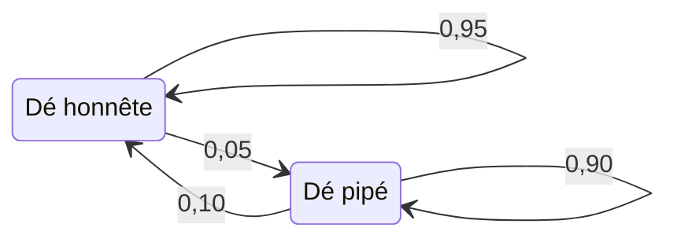

Les leçons précédentes traitaient chaque ligne comme indépendante des autres. Une séquence rompt cette hypothèse : ce qui arrive ensuite dépend de ce qui vient d'arriver. Cette leçon s'appuie sur les deux modèles de la crate [`ix-graph`](https://github.com/GuitarAlchemist/ix/tree/490c39533627d296bf9f8f050e6fafc14d7a20c2/crates/ix-graph) épinglée d'IX : la chaîne de Markov et le modèle de Markov caché. L'expérience exécutable est [`l10_sequences.rs`](https://github.com/spareilleux/learn/blob/main/code/machine-learning-ix/examples/l10_sequences.rs), et les versions écrites à la main sont dans [`sequence.rs`](https://github.com/spareilleux/learn/blob/main/code/machine-learning-ix/src/sequence.rs). [`crosscheck.py`](https://github.com/spareilleux/learn/blob/main/code/machine-learning-ix/crosscheck/crosscheck.py) recalcule avec numpy tout ce qui n'utilise pas les nombres aléatoires d'IX. Le [journal](../journal/#2026-09-29--chaînes-de-markov-et-un-casino-malhonnête) consigne ce qui a été mesuré.

| Question | Méthode | Fonction d'IX | Sens de la sortie |
|---|---|---|---|
| Où la chaîne passe-t-elle son temps à long terme ? | Distribution stationnaire | `MarkovChain::stationary_distribution` | Une estimation de π, avec π P = π, par itération de puissance |
| Combien de temps avant d'atteindre un état pour la première fois ? | Temps moyen de premier passage | `MarkovChain::mean_first_passage` | Une moyenne de Monte-Carlo sur les marches arrivées à temps |
| Quelle est la probabilité d'une séquence d'observations entière ? | Algorithme forward | `HiddenMarkovModel::forward` | ln P(observations), somme sur tous les chemins cachés |
| Quel chemin caché les explique le mieux ? | Viterbi | `HiddenMarkovModel::viterbi` | Le chemin le plus probable et sa log-probabilité |
| Quel état caché est le plus probable à chaque pas ? | Forward–backward | `forward_backward`, `map_estimate` | Des probabilités a posteriori par pas ; leur argmax n'est pas toujours un chemin |
| Quels paramètres expliquent les données ? | Baum–Welch | `HiddenMarkovModel::baum_welch` | Un maximum local de la vraisemblance, depuis un seul point de départ |

Les données de cette leçon sont fabriquées exprès. Les tables CI du cours enregistrent des durées, pas des résultats : elles ne contiennent aucune vraie séquence d'états. De toute façon, seul un modèle dont on connaît la vérité permet de noter un décodeur.

## 1. Une chaîne de Markov et l'endroit où elle se stabilise

Une [chaîne de Markov](https://github.com/GuitarAlchemist/ix/blob/490c39533627d296bf9f8f050e6fafc14d7a20c2/crates/ix-graph/src/markov.rs) est une matrice P dont la ligne i donne les probabilités de l'état suivant depuis l'état i. Voici trois régimes de marché, haussier, baissier et stagnant :

```text
P = [[0.90, 0.075, 0.025],
     [0.15, 0.80,  0.05 ],
     [0.25, 0.25,  0.50 ]]
```

Une distribution π que la chaîne laisse inchangée, π P = π, est dite **stationnaire**. La version écrite à la main la résout comme un système linéaire : (Pᵀ − I) π = 0 contient une équation redondante, que l'on remplace par π₀ + π₁ + π₂ = 1. La fonction [`stationary_distribution`](https://github.com/GuitarAlchemist/ix/blob/490c39533627d296bf9f8f050e6fafc14d7a20c2/crates/ix-graph/src/markov.rs#L56) d'IX multiplie une distribution uniforme par P jusqu'à ce que deux itérés diffèrent de moins de `tol`. Pour cette chaîne, les deux aboutissent à (5/8, 5/16, 1/16) :

```text
== Markov chain: bull, bear, stagnant
  exact stationary distribution: [0.6250, 0.3125, 0.0625]
  IX power iteration:            [0.6250, 0.3125, 0.0625]
  largest gap below 1e-12: true
  is_ergodic(1): true
```

`is_ergodic(1)` vaut vrai parce que tous les coefficients de P sont déjà positifs. Le test calcule P^steps et vérifie que chaque coefficient dépasse `1e-10` : avec un `steps` trop petit, une chaîne pourtant ergodique est déclarée non ergodique.

## 2. Combien de temps pour y arriver

Le **temps moyen de premier passage** mᵢ compte les pas nécessaires pour aller de l'état i à un état cible. Pour tout i autre que la cible, mᵢ = 1 + Σⱼ Pᵢⱼ mⱼ, la somme portant sur les états j autres que la cible. C'est un seul système linéaire, (I − Q) m = 1, où Q est P privée de la ligne et de la colonne de la cible. Le coefficient de la cible elle-même est son temps moyen de retour, qui vaut 1/π d'après le [lemme de Kac](https://www.ams.org/journals/bull/1947-53-10/S0002-9904-1947-08927-8/). Ici, 1/0,0625 = 16.

La fonction [`mean_first_passage`](https://github.com/GuitarAlchemist/ix/blob/490c39533627d296bf9f8f050e6fafc14d7a20c2/crates/ix-graph/src/markov.rs#L94) d'IX simule plutôt. Elle lance `n_simulations` marches d'au plus `max_steps` pas et fait la moyenne du pas d'arrivée sur les marches arrivées. Une marche qui n'arrive pas à temps est écartée, sans que rien ne le signale :

```text
== mean first passage to stagnant (state 2)
  exact, from bull, bear, stagnant: [31.4286, 28.5714, 16.0000]
  Kac: 1 / pi_2 = 16.0000
  IX, 20000 walks, at most 1000 steps: from bull 31.650, return 16.194
  IX, 20000 walks, at most   20 steps: from bull 9.836, return 3.763
  IX, 20000 walks, at most    5 steps: from bull 3.030, return 1.276
```

Avec 1 000 pas, presque toutes les marches arrivent, et l'estimation reste dans l'erreur de Monte-Carlo autour de 31,43. Avec 20 pas, la fonction renvoie 9,8, et avec 5 pas, 3,0. Elle mesure alors le temps moyen d'arrivée *sachant que la marche est arrivée dans la limite*, ce qui ne peut jamais dépasser la limite, quelle que soit la vraie moyenne. Pour une petite chaîne, le système linéaire est exact et moins coûteux. Si vous simulez, choisissez un `max_steps` bien plus grand que la réponse attendue.

## 3. Une chaîne qui ne se stabilise jamais

La chaîne [[0, 1], [1, 0]] échange ses deux états à chaque pas. Elle a une distribution stationnaire, (½, ½), mais une chaîne partie d'un seul état ne s'en approche jamais :

```text
== a periodic chain [[0, 1], [1, 0]]
  state_distribution from [1, 0], 1 to 4 steps: [0.0, 1.0] [1.0, 0.0] [0.0, 1.0] [1.0, 0.0]
  stationary_distribution: [0.5000, 0.5000]
  is_ergodic(100): false
```

`stationary_distribution` répond (½, ½) du premier coup, parce que son point de départ uniforme est déjà cette distribution. La réponse est juste, mais elle ne dit rien de la convergence. C'est `is_ergodic` qui détecte cette chaîne : toutes les puissances de P gardent deux zéros.

## 4. Des états cachés : le casino malhonnête

Dans un modèle de Markov caché, on n'observe pas la chaîne. Chaque état caché émet un symbole selon ses propres probabilités, et seuls les symboles sont visibles. L'exemple classique est le casino occasionnellement malhonnête de [Durbin, Eddy, Krogh et Mitchison](https://doi.org/10.1017/CBO9780511790492), section 3.2. Un dé honnête montre chaque face avec une probabilité de 1/6. Un dé pipé montre un six la moitié du temps, et chacune des autres faces avec une probabilité de 1/10. Le casino change de dé entre deux lancers, et l'exemple commence avec l'un ou l'autre dé avec une probabilité de ½ :



L'exemple tire 1 000 lancers de ce modèle avec le générateur xorshift du cours, celui de la [leçon 6](../06-ensembles/). Python rejoue ce générateur, si bien que la vérification croisée voit les mêmes lancers.

**L'algorithme forward** calcule P(lancers) en sommant sur les 2^1000 chemins cachés, un pas à la fois : αₜ(j) = Σᵢ αₜ₋₁(i) Pᵢⱼ · bⱼ(oₜ). Écrit dans l'espace des probabilités, il multiplie mille nombres de l'ordre de 1/6 et passe sous le plus petit nombre binary64. La version écrite à la main travaille donc en log et additionne avec l'astuce log-sum-exp. La fonction [`forward`](https://github.com/GuitarAlchemist/ix/blob/490c39533627d296bf9f8f050e6fafc14d7a20c2/crates/ix-graph/src/hmm.rs#L148) d'IX renormalise α à chaque pas et additionne les logarithmes des facteurs d'échelle, comme dans le [tutoriel de Rabiner](https://doi.org/10.1109/5.18626) :

```text
== the casino: 1000 rolls from the course's generator, seed 10
  true path: 259 loaded rolls in 23 runs; 239 sixes
  forward in probability space: T = 300 gives 8.832e-233, T = 1000 gives 0.000e0
  ln P(rolls), hand log space: -1761.7121
  ln P(rolls), IX forward:     -1761.7121
  agree within 1e-9: true
```

La version directe donne encore une réponse à 300 lancers. À 1 000 lancers, elle renvoie 0, alors que la vraie probabilité vaut e^−1761,7.

## 5. Deux façons de décoder, et pourquoi elles diffèrent

L'[algorithme de Viterbi](https://doi.org/10.1109/TIT.1967.1054010) remplace la somme de la récurrence forward par un maximum et garde un pointeur vers le meilleur prédécesseur. Il renvoie le **chemin** le plus probable. Forward–backward renvoie, pour chaque lancer, la probabilité **a posteriori** de chaque dé compte tenu de tous les lancers. Prendre le dé le plus probable à chaque lancer, c'est le décodage a posteriori, la fonction [`map_estimate`](https://github.com/GuitarAlchemist/ix/blob/490c39533627d296bf9f8f050e6fafc14d7a20c2/crates/ix-graph/src/hmm.rs#L307) d'IX.

```text
== decoding the 1000 rolls
  Viterbi: hand path = IX path: true; log-probabilities agree within 1e-9: true
  Viterbi: agreement with the true states 0.869; 6 loaded runs
  posteriors: hand against IX forward_backward, largest gap below 1e-9: true
  posterior decoding (map_estimate): agreement with the true states 0.876; 16 loaded runs; same as hand argmax: true
```

Le décodage a posteriori trouve le bon dé un peu plus souvent, 87,6 % contre 86,9 %, mais il découpe les passages pipés en 16 séquences, là où Viterbi en trouve 6. La vérité en compte 23. Viterbi optimise le chemin entier, donc chaque changement de dé lui coûte. Le décodage a posteriori optimise chaque lancer séparément et ne vérifie jamais que ses choix s'enchaînent.

Il arrive même qu'ils ne s'enchaînent pas du tout. Dans le modèle à trois états ci-dessous, l'état 0 passe toujours à l'état 2, et les états 1 et 2 passent toujours à l'état 1. Le modèle démarre en 0, 1 ou 2 avec les probabilités 0,4, 0,3 et 0,3, et il émet un seul symbole :

```text
== when the best states are not a path
  map_estimate: [0, 1], probability of that path 0.0000
  viterbi:      [0, 2], probability 0.4000
```

Au premier pas, l'état le plus probable est 0, à 0,4. Au second, c'est l'état 1, à 0,3 + 0,3 = 0,6. La transition 0 → 1 a une probabilité nulle : le décodage a posteriori renvoie un chemin que le modèle ne peut jamais produire. Utilisez Viterbi quand la réponse doit être un chemin, et les probabilités a posteriori quand il vous faut une confiance pas à pas.

## 6. Apprendre les paramètres : Baum–Welch

[Baum–Welch](https://doi.org/10.1214/aoms/1177697196) est l'algorithme espérance–maximisation (EM) appliqué à un modèle de Markov caché. Il calcule les probabilités a posteriori avec les paramètres courants, en réestime les paramètres, puis recommence. D'une itération à l'autre, la vraisemblance ne diminue jamais. L'exemple part d'une estimation fausse : probabilités de rester égales à 0,8, et un dé pipé qui montre un six un quart du temps. Il appelle `baum_welch` avec `tol = 0`, si bien que la fonction exécute exactement `k` itérations, pour k = 1 à 10, et il évalue chaque résultat avec `forward` :

```text
== Baum-Welch from a wrong start, on the 1000 rolls
   0 iterations: ln P = -1775.9589
   1 iterations: ln P = -1767.1374
   2 iterations: ln P = -1766.1895
   3 iterations: ln P = -1765.0041
   4 iterations: ln P = -1763.6514
   5 iterations: ln P = -1762.2635
   6 iterations: ln P = -1760.9917
   7 iterations: ln P = -1759.9472
   8 iterations: ln P = -1759.1683
   9 iterations: ln P = -1758.6270
  10 iterations: ln P = -1758.2618
  never decreases: true
  after 10: stay fair 0.8505, stay loaded 0.8271, P(six | loaded) 0.4060; truth 0.9500, 0.9000, 0.5000
```

La vraisemblance augmente à chaque itération. À partir de la sixième, elle dépasse celle des vrais paramètres, −1761,7, alors que les paramètres restent loin de la vérité. Ce n'est pas une contradiction : avec une seule séquence de 1 000 lancers, d'autres paramètres peuvent expliquer ces lancers-là mieux que ceux qui les ont produits. EM ne promet qu'un maximum *local* de la vraisemblance, depuis le point de départ qu'on lui donne. Rien ne distingue non plus les deux états : un départ qui place le dé pipé dans l'état 0 apprend le même modèle, étiquettes permutées.

## 7. Les limites de l'API d'IX

```text
== edges
  viterbi on an impossible symbol: path [0, 0, 0], log-probability -inf
  forward on it: -inf
  backward entries all positive: true (a log-probability is never positive)
  a symbol outside the alphabet (6 on a die of 0 to 5): forward panics: true
```

- **Un symbole impossible ne provoque pas d'erreur.** Dans ce modèle, aucun état ne peut émettre le symbole 2. Viterbi renvoie alors un chemin de zéros de log-probabilité −∞, et `forward` renvoie −∞. Les deux valeurs sont justes, mais seule la valeur −∞ révèle que le chemin n'a pas de sens. Vérifiez la log-probabilité avant d'utiliser le chemin.
- **`backward` renvoie des probabilités renormalisées, pas des logarithmes.** Son commentaire parle de « log-probability ». La table renvoyée contient β divisé par les facteurs d'échelle du forward : des nombres positifs, alors qu'une log-probabilité n'est jamais positive.
- **Un symbole hors de l'alphabet provoque une panique.** `new` valide les trois tables, mais pas les observations : un 6 sur un dé de faces 0 à 5 déborde de la table d'émission.

## Quels usages dans nos dépôts ?

- **Petites chaînes : résoudre plutôt que simuler.** Une distribution stationnaire ou un temps moyen de premier passage, c'est un système linéaire de la taille de l'espace d'états. Si vous simulez avec `mean_first_passage`, fixez `max_steps` bien au-dessus de la réponse, car les marches qui n'arrivent pas sont écartées sans laisser de trace.
- **Toujours travailler en log.** Les fonctions `forward` et `viterbi` d'IX le font déjà. Une récurrence écrite à la main dans l'espace des probabilités sous-déborde au bout de quelques centaines de pas.
- **Choisir le décodeur selon la question.** Viterbi donne un chemin cohérent, et les probabilités a posteriori une confiance pas à pas. Les deux peuvent être justes sur les mêmes données et pourtant diverger.
- **Traiter Baum–Welch comme une recherche.** Lancez-le depuis plusieurs points de départ, comparez les vraisemblances finales, et ne prenez pas ses paramètres pour la vérité à partir d'une seule séquence.

## Exercices

1. Pour la chaîne [[1 − a, a], [b, 1 − b]], montrez que π = (b, a)/(a + b), et donnez le temps moyen de retour à l'état 0. Vérifiez les deux avec a = 0,3 et b = 0,2.
2. Pourquoi la valeur que renvoie `mean_first_passage` avec `max_steps = 5` ne peut-elle jamais dépasser 5 ? Que faudrait-il publier à côté pour qu'elle soit honnête ?
3. Dans le modèle à trois états de la section 5, calculez à la main les probabilités a posteriori des deux pas, ainsi que la probabilité du chemin de Viterbi.
4. Le décodage a posteriori trouve le bon dé un peu plus souvent que Viterbi, mais il compte 16 séquences pipées contre 23 en réalité. Quel décodeur utiliseriez-vous pour compter combien de fois le casino a changé de dé, et pourquoi ?

<details>
<summary>Solutions</summary>

1. π P = π donne π₀ a = π₁ b ; avec π₀ + π₁ = 1, on obtient π = (b, a)/(a + b). D'après le lemme de Kac, le temps moyen de retour à l'état 0 vaut 1/π₀ = (a + b)/b. Avec a = 0,3 et b = 0,2 : π = (0,4 ; 0,6) et le temps de retour vaut 2,5, les valeurs que vérifient les tests unitaires de `sequence.rs`.
2. Elle ne fait la moyenne que des marches arrivées en 5 pas au plus, donc chaque terme de la moyenne vaut au plus 5. Une estimation honnête indique aussi combien de marches sont arrivées, ou utilise une limite assez grande pour que presque toutes arrivent.
3. Les observations n'apportent aucune information, donc les probabilités a posteriori suivent la chaîne. Au pas 1, ce sont celles du départ, (0,4 ; 0,3 ; 0,3). Au pas 2 : l'état 1 vient de l'état 1 ou 2, soit 0,3 + 0,3 = 0,6 ; l'état 2 vient de l'état 0, soit 0,4 ; l'état 0 a 0. Le chemin de Viterbi est [0, 2], de probabilité 0,4 · 1 = 0,4. Les chemins [1, 1] et [2, 1] ont chacun 0,3.
4. Viterbi : le nombre de changements est une propriété du chemin entier. Le décodage a posteriori choisit chaque lancer séparément et coupe un passage pipé dès qu'un lancer y paraît honnête. Aucun des deux n'est exact : Viterbi a fusionné de vraies séquences et en trouve 6 contre 23.

</details>

## Sources

- IX au commit épinglé `490c395` : [`markov.rs`](https://github.com/GuitarAlchemist/ix/blob/490c39533627d296bf9f8f050e6fafc14d7a20c2/crates/ix-graph/src/markov.rs) et [`hmm.rs`](https://github.com/GuitarAlchemist/ix/blob/490c39533627d296bf9f8f050e6fafc14d7a20c2/crates/ix-graph/src/hmm.rs).
- R. Durbin, S. Eddy, A. Krogh et G. Mitchison, [*Biological Sequence Analysis*](https://doi.org/10.1017/CBO9780511790492), Cambridge University Press, 1998, chapitre 3 : le casino malhonnête, Viterbi, forward–backward et Baum–Welch.
- L. R. Rabiner, [« A tutorial on hidden Markov models and selected applications in speech recognition »](https://doi.org/10.1109/5.18626), *Proceedings of the IEEE* 77, 1989 : la renormalisation des variables forward et backward.
- A. J. Viterbi, [« Error bounds for convolutional codes and an asymptotically optimum decoding algorithm »](https://doi.org/10.1109/TIT.1967.1054010), *IEEE Transactions on Information Theory* 13, 1967.
- L. E. Baum, T. Petrie, G. Soules et N. Weiss, [« A maximization technique occurring in the statistical analysis of probabilistic functions of Markov chains »](https://doi.org/10.1214/aoms/1177697196), *Annals of Mathematical Statistics* 41, 1970.
- M. Kac, [« On the notion of recurrence in discrete stochastic processes »](https://www.ams.org/journals/bull/1947-53-10/S0002-9904-1947-08927-8/), *Bulletin of the AMS* 53, 1947.
