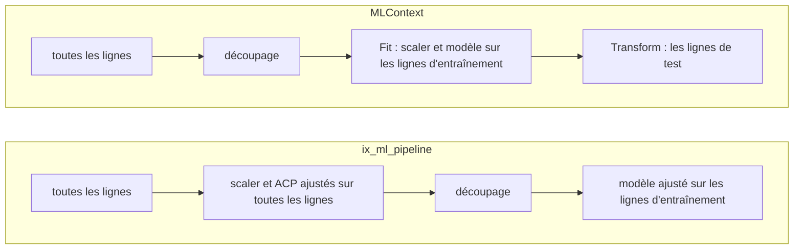

Un *pipeline* d'apprentissage automatique enchaîne les étapes qui mènent des données brutes à un score, et il doit apprendre chaque étape sur les seules lignes d'entraînement. [ML.NET](https://learn.microsoft.com/dotnet/machine-learning/) l'exprime avec [`MLContext`](https://learn.microsoft.com/dotnet/api/microsoft.ml.mlcontext) :
- les transformations et l'entraîneur sont des *estimateurs*, enchaînés avec [`Append`](https://learn.microsoft.com/dotnet/api/microsoft.ml.learningpipelineextensions.append) ;
- un seul [`Fit`](https://learn.microsoft.com/dotnet/api/microsoft.ml.iestimator-1.fit) sur l'ensemble d'entraînement les apprend tous ;
- le modèle ajusté [transforme](https://learn.microsoft.com/dotnet/api/microsoft.ml.itransformer.transform) ensuite l'ensemble de test.

Le [`Pipeline`](https://scikit-learn.org/stable/modules/generated/sklearn.pipeline.Pipeline.html) de scikit-learn fait de même, et son guide explique pourquoi sous [fuite de données](https://scikit-learn.org/stable/common_pitfalls.html#data-leakage).

IX a deux choses qui s'appellent pipeline, toutes deux au commit épinglé :
- [`ix-pipeline`](https://github.com/GuitarAlchemist/ix/tree/490c39533627d296bf9f8f050e6fafc14d7a20c2/crates/ix-pipeline) est un exécuteur général. Il exécute un graphe orienté acyclique (DAG) d'étapes qui échangent du JSON, construit en Rust ou *abaissé* depuis un fichier `ix.yaml` dont les étapes appellent les compétences d'IX.
- `ix_ml_pipeline` est une chaîne d'étapes fixe, servie comme *outil* par le serveur d'[`ix-agent`](https://github.com/GuitarAlchemist/ix/tree/490c39533627d296bf9f8f050e6fafc14d7a20c2/crates/ix-agent). Un serveur parle le [Model Context Protocol](https://modelcontextprotocol.io/specification/2024-11-05/) (MCP) : un assistant le démarre et lui envoie un message [JSON-RPC 2.0](https://www.jsonrpc.org/specification) par ligne sur son entrée standard. Il répond sur sa sortie standard, et journalise sur sa sortie d'erreur. `initialize` ouvre la session, [`tools/list`](https://modelcontextprotocol.io/specification/2024-11-05/server/tools) liste les outils, et `tools/call` en appelle un.

Le [journal](../journal/#2026-09-30--leçon-21-prédite-avant-de-mesurer) contient huit prédictions, P1 à P8, écrites à partir du code source et commitées avant que le moindre code de cette leçon ne tourne. La section 13 les note.

## 1. Ce qui tourne où

`ix-pipeline` n'ajoute aucun paquet au `Cargo.lock` du cours, donc P1 à P5 tournent sur les trois systèmes de la CI, dans [`examples/l21_pipelines.rs`](https://github.com/spareilleux/learn/blob/main/code/machine-learning-ix/examples/l21_pipelines.rs). Le même exemple rejoue les étapes de l'outil avec les propres fonctions d'IX : `train_test_split`, `StandardScaler`, `KNN`, `LinearRegression` et les métriques.

L'outil lui-même demande `ix-agent`. En dépendre ajouterait 197 paquets au lock du cours, mesuré en résolvant une copie du manifeste : 225 paquets deviennent 422. À la place, son binaire serveur, `ix-mcp`, est construit au commit épinglé hors du dépôt. La construction part du `Cargo.lock` du cours, pour que ndarray, rand et les autres crates communes gardent les versions du cours. [`src/mcp.rs`](https://github.com/spareilleux/learn/blob/main/code/machine-learning-ix/src/mcp.rs) est un petit client :
- il démarre le serveur dans un répertoire vide rien qu'à lui ;
- il écrit une ligne par message et lit les réponses sur un thread ;
- il donne à chaque requête une échéance, 30 secondes, ou 10 là où la prédiction dit qu'aucune réponse ne vient.

[`src/bin/l21_mcp.rs`](https://github.com/spareilleux/learn/blob/main/code/machine-learning-ix/src/bin/l21_mcp.rs) affiche ce que cite la leçon, enregistré dans `local/l21_mcp.txt`. [`tests/l21_mcp.rs`](https://github.com/spareilleux/learn/blob/main/code/machine-learning-ix/tests/l21_mcp.rs) contient un test ignoré par prédiction, que la CI saute.

Voici l'appel de P5, les 20 lignes coupées ici :

```json
{"jsonrpc":"2.0","id":2,"method":"tools/call","params":{"name":"ix_ml_pipeline","arguments":{"source":{"type":"inline","data":[[0.0,0.0,1.0],[0.1,0.0,1.0],[0.2,0.0,1.0],[0.3,0.0,1.0],[0.4,0.0,1.0],[0.0,0.1,1.0],[0.1,0.1,1.0],[0.2,0.1,1.0],[0.3,0.1,1.0],[0.4,0.1,1.0],[5.0,5.0,2.0],[5.1,5.0,2.0],[5.2,…
```

Les `arguments` continuent avec les autres lignes, puis `"target_column":2`, `"split":{"test_ratio":0.3,"seed":42}` et `"return_predictions":true`. Le `result.content[0].text` de la réponse est le résultat de l'outil en JSON indenté :

```json
{
  "data_shape": {
    "features": 2,
    "rows": 20
  },
  "metrics": {
    "accuracy": 1.0,
    "f1": 0.6666666666666666,
    "precision": 0.6666666666666666,
    "recall": 0.6666666666666666
  },
  "model": "knn",
  "model_params": {
    "k": 5
  },
  "persisted": false,
  "predictions": [
    1,
    2,
    2,
    2,
    1,
    1
  ],
  "preprocessing": {
    "nan_rows_dropped": 0,
    "normalized": false
  },
  "split": {
    "test": 6,
    "train": 14
  },
  "task": "classify",
  "timing_ms": 0
}
```

Une exactitude de 1 et une précision de 2/3, alors que chaque prédiction est juste : la section 7 explique l'écart. Une erreur revient sous la forme du texte `Error: …` avec `isError` positionné ([`main.rs` 281-301](https://github.com/GuitarAlchemist/ix/blob/490c39533627d296bf9f8f050e6fafc14d7a20c2/crates/ix-agent/src/main.rs#L281-L301)). Le client compare les nombres au bit près : il prend chaque nombre de ce texte tel qu'il est écrit et le lit avec la bibliothèque standard, qui arrondit correctement.

## 2. Un exécuteur parallèle qui exécute à tour de rôle

La doc de la crate dit que « Independent branches run in parallel » ([`lib.rs` 3-5](https://github.com/GuitarAlchemist/ix/blob/490c39533627d296bf9f8f050e6fafc14d7a20c2/crates/ix-pipeline/src/lib.rs#L3-L5)), et celle d'`execute` que les nœuds d'un niveau « execute in parallel using std threads » ([`executor.rs` 115-118](https://github.com/GuitarAlchemist/ix/blob/490c39533627d296bf9f8f050e6fafc14d7a20c2/crates/ix-pipeline/src/executor.rs#L115-L118)). P1 construit un losange avec [`PipelineBuilder`](https://github.com/GuitarAlchemist/ix/blob/490c39533627d296bf9f8f050e6fafc14d7a20c2/crates/ix-pipeline/src/builder.rs) : `load` alimente `a` et `b`, qui alimentent tous deux `report`. Chaque fonction de calcul note le thread sur lequel elle tourne, et `a` et `b` dorment 50 ms chacun. Abrégé de [`src/pipeline.rs`](https://github.com/spareilleux/learn/blob/main/code/machine-learning-ix/src/pipeline.rs) :

```rust
let dag = PipelineBuilder::new()
    .source("load", || Ok(json!(1.0)))
    .node("a", |b| b.input("x", "load").compute(|i| {
        thread::sleep(nap);
        Ok(json!(i["x"].as_f64().unwrap() + 1.0))
    }))
    .node("b", |b| b.input("x", "load").compute(/* la même, + 2.0 */))
    .node("report", |b| b.input("a", "a").input("b", "b").compute(/* a + b */))
    .build()?;
let result = execute(&dag, &HashMap::new(), &NoCache)?;
```

```
== P1, a diamond: load -> a and b -> report, a and b sleeping 50 ms each
  parallel_levels: [["load"], ["a", "b"], ["report"]]
  compute functions run: 4, all on the thread that called execute: yes
  total_duration at least 100 ms: yes; report = 5.0
```

`a` et `b` partagent un niveau, et ils tournent l'un après l'autre. La branche pour un niveau de plusieurs nœuds parcourt les nœuds avec un itérateur et appelle chaque fonction de calcul à tour de rôle ([`executor.rs` 163-211](https://github.com/GuitarAlchemist/ix/blob/490c39533627d296bf9f8f050e6fafc14d7a20c2/crates/ix-pipeline/src/executor.rs#L163-L211)). Son commentaire dit que `ComputeFn` « isn't Send », mais le type est déclaré `Send + Sync` ([`executor.rs` 11-13](https://github.com/GuitarAlchemist/ix/blob/490c39533627d296bf9f8f050e6fafc14d7a20c2/crates/ix-pipeline/src/executor.rs#L11-L13)). Rien n'empêche un [`std::thread::scope`](https://doc.rust-lang.org/std/thread/fn.scope.html) d'exécuter côte à côte les nœuds du niveau (exercice 1). Les résultats sont justes ; seule manque la vitesse promise.

## 3. Une clé de cache sans le calcul

[`PipelineCache`](https://github.com/GuitarAlchemist/ix/blob/490c39533627d296bf9f8f050e6fafc14d7a20c2/crates/ix-pipeline/src/executor.rs#L94-L103) est le point d'extension pour « connect to `ix-cache` or any other cache ». La clé qu'il reçoit est `pipeline:`, l'identifiant du nœud, et un hachage FNV-1a des entrées du nœud ([`executor.rs` 309-325](https://github.com/GuitarAlchemist/ix/blob/490c39533627d296bf9f8f050e6fafc14d7a20c2/crates/ix-pipeline/src/executor.rs#L309-L325)). Ce que calcule le nœud n'y figure pas. P2 partage un cache en mémoire entre deux pipelines d'un seul nœud, dont le nœud `f` lit l'entrée `value` = 10 :

```
== P2, one cache shared by two pipelines: f(x) = x + 1, then f(x) = 2x, on value = 10
  x + 1: output 11, cache hits 0
  2x: output 11, cache hits 1
```

2 × 10 font 20. Le second pipeline reçoit la réponse du premier, parce que les deux clés sont `pipeline:f:` et le hachage de `{"x": 10}`. Il en va de même pour une étape d'`ix.yaml` dont les `args` changent entre deux exécutions. `lower` garde les `args` d'une étape dans la fermeture de calcul, et les entrées ne contiennent que les sorties amont ([`lower.rs` 89-105](https://github.com/GuitarAlchemist/ix/blob/490c39533627d296bf9f8f050e6fafc14d7a20c2/crates/ix-pipeline/src/lower.rs#L89-L105)). Chaque appelant au commit épinglé passe `NoCache`, donc le défaut attend le premier cache (exercice 2).

## 4. Les sorties finales, et un champ absent

```
== P3, final_outputs and input_field
  final_outputs on the diamond: 4 entries, for 1 leaf
  field "missing" of {"a": 1}: {"a":1}; field "a": 1
```

`final_outputs` est documenté comme rendant les sorties des nœuds feuilles, et rend celles de tous les nœuds, sous un commentaire qui dit « Can't easily determine without the DAG » ([`executor.rs` 58-71](https://github.com/GuitarAlchemist/ix/blob/490c39533627d296bf9f8f050e6fafc14d7a20c2/crates/ix-pipeline/src/executor.rs#L58-L71)) ; le DAG a pourtant [`leaves()`](https://github.com/GuitarAlchemist/ix/blob/490c39533627d296bf9f8f050e6fafc14d7a20c2/crates/ix-pipeline/src/dag.rs#L160-L169). [`input_field`](https://github.com/GuitarAlchemist/ix/blob/490c39533627d296bf9f8f050e6fafc14d7a20c2/crates/ix-pipeline/src/builder.rs#L73-L78) lit un champ d'une sortie amont. Quand le champ manque, l'exécuteur passe la sortie entière à la place, sans erreur ([`executor.rs` 286-295](https://github.com/GuitarAlchemist/ix/blob/490c39533627d296bf9f8f050e6fafc14d7a20c2/crates/ix-pipeline/src/executor.rs#L286-L295)). Un nom de champ mal orthographié échoue alors plus loin, dans le nœud qui attendait un nombre, ou pas du tout.

## 5. Un hachage sous le nom d'un autre, et un registre vide

`ix pipeline run` écrit un fichier de verrouillage qui consigne l'`args_hash` de chaque étape, documenté comme « fnv1a64 over the canonicalized **template** args » ([`lock.rs` 50-51](https://github.com/GuitarAlchemist/ix/blob/490c39533627d296bf9f8f050e6fafc14d7a20c2/crates/ix-pipeline/src/lock.rs#L50-L51)). P4 appelle [`LockFile::from_run`](https://github.com/GuitarAlchemist/ix/blob/490c39533627d296bf9f8f050e6fafc14d7a20c2/crates/ix-pipeline/src/lock.rs#L107-L111) sur une étape `load` dont les args sont `{"data": [1.0, 2.0]}`, et recalcule le hachage de deux façons :

```
== P4, the lock file's args_hash, and lower without a linked skill
  canonical args: {"data":[1.0,2.0]}
  args_hash:                        fnv1a64:4762d1a4ed81a34d
  DefaultHasher of that string:     fnv1a64:4762d1a4ed81a34d  same: yes
  FNV-1a 64 of the same bytes:      fnv1a64:8091c3ce6ff9b24c  same: no
  lower(PipelineSpec::scaffold("demo")): stage 'load' references unknown skill 'stats'
```

`hash_json` donne la chaîne canonique au `DefaultHasher` de la bibliothèque standard et affiche le résultat après `fnv1a64:` ([`lock.rs` 317-327](https://github.com/GuitarAlchemist/ix/blob/490c39533627d296bf9f8f050e6fafc14d7a20c2/crates/ix-pipeline/src/lock.rs#L317-L327)). La documentation de [`DefaultHasher`](https://doc.rust-lang.org/std/collections/hash_map/struct.DefaultHasher.html) prévient que son « internal algorithm is not specified, and so it and its hashes should not be relied upon over releases ». La vérification croisée en Python calcule FNV-1a d'après sa définition et trouve `8091c3ce6ff9b24c`, la valeur que promet l'étiquette ; personne en dehors de la bibliothèque standard de Rust ne peut recalculer l'autre. Un fichier de verrouillage est fait pour être comparé à une exécution ultérieure, peut-être construite avec un Rust plus récent. La correction tient en un appel : l'exécuteur calcule déjà FNV-1a pour sa clé de cache.

La dernière ligne vient de [`lower`](https://github.com/GuitarAlchemist/ix/blob/490c39533627d296bf9f8f050e6fafc14d7a20c2/crates/ix-pipeline/src/lower.rs#L58-L64), qui cherche la compétence de chaque étape dans `ix-registry`. Ce registre est une tranche « populated at link time by every `#[ix_skill]` annotation » ([`lib.rs` 69-72](https://github.com/GuitarAlchemist/ix/blob/490c39533627d296bf9f8f050e6fafc14d7a20c2/crates/ix-registry/src/lib.rs#L69-L72)), et les compétences d'IX vivent dans `ix-agent`. Un programme qui ne dépend que d'`ix-pipeline`, comme ce cours, ne lie aucune compétence, donc le squelette qu'écrit `ix pipeline new` ne peut pas être abaissé. C'est une conception, pas un défaut, mais la page de la crate ne le dit pas : pour exécuter une spécification, liez `ix-agent`, ou utilisez la ligne de commande d'IX.

## 6. L'outil, étape par étape

`run_pipeline` dans [`ml_pipeline.rs`](https://github.com/GuitarAlchemist/ix/blob/490c39533627d296bf9f8f050e6fafc14d7a20c2/crates/ix-agent/src/ml_pipeline.rs) exécute ces étapes, dans cet ordre :
1. **Charger.** Il lit un fichier CSV, ou les lignes en ligne. [`read_csv`](https://github.com/GuitarAlchemist/ix/blob/490c39533627d296bf9f8f050e6fafc14d7a20c2/crates/ix-io/src/csv_io.rs#L10-L38) transforme en NaN chaque champ qui n'est pas un nombre.
2. **Retirer les NaN.** Il retire chaque ligne qui contient un NaN, dans une variable ou dans la cible ([167-188](https://github.com/GuitarAlchemist/ix/blob/490c39533627d296bf9f8f050e6fafc14d7a20c2/crates/ix-agent/src/ml_pipeline.rs#L167-L188)).
3. **Normaliser et réduire.** Avec `normalize`, il ajuste un `StandardScaler` sur toutes les lignes ([190-195](https://github.com/GuitarAlchemist/ix/blob/490c39533627d296bf9f8f050e6fafc14d7a20c2/crates/ix-agent/src/ml_pipeline.rs#L190-L195)) ; avec `pca_components`, il ajuste aussi une ACP sur toutes les lignes.
4. **Choisir.** Avec `auto`, il infère la tâche et choisit un modèle ([208-228](https://github.com/GuitarAlchemist/ix/blob/490c39533627d296bf9f8f050e6fafc14d7a20c2/crates/ix-agent/src/ml_pipeline.rs#L208-L228), [507-522](https://github.com/GuitarAlchemist/ix/blob/490c39533627d296bf9f8f050e6fafc14d7a20c2/crates/ix-agent/src/ml_pipeline.rs#L507-L522)). Au plus 20 entiers positifs ou nuls distincts font une classification, et `knn` est choisi sous 100 lignes.
5. **Découper, ajuster, noter.** Il découpe, 20 % pour le test avec la graine 42 par défaut, puis ajuste et note ([704-705](https://github.com/GuitarAlchemist/ix/blob/490c39533627d296bf9f8f050e6fafc14d7a20c2/crates/ix-agent/src/ml_pipeline.rs#L704-L705)).
6. **Persister.** Sur demande, il garde l'état du modèle et le scaler dans un cache en mémoire, sous une clé ([273-304](https://github.com/GuitarAlchemist/ix/blob/490c39533627d296bf9f8f050e6fafc14d7a20c2/crates/ix-agent/src/ml_pipeline.rs#L273-L304)).

Les étapes 3 et 5 sont celles où il s'écarte de `MLContext` :



## 7. Des classes qui n'existent pas

`run_classification` transforme les étiquettes en classes avec `round() as usize` et compte `max + 1` classes ([533-534](https://github.com/GuitarAlchemist/ix/blob/490c39533627d296bf9f8f050e6fafc14d7a20c2/crates/ix-agent/src/ml_pipeline.rs#L533-L534)). Il fait ensuite la moyenne de la précision, du rappel et du F1 sur chaque classe de 0 à la plus grande ([655-670](https://github.com/GuitarAlchemist/ix/blob/490c39533627d296bf9f8f050e6fafc14d7a20c2/crates/ix-agent/src/ml_pipeline.rs#L655-L670)). La [`precision`](https://github.com/GuitarAlchemist/ix/blob/490c39533627d296bf9f8f050e6fafc14d7a20c2/crates/ix-supervised/src/metrics.rs#L102-L118) d'IX rend 0 pour une classe jamais prédite. Les étiquettes 1 et 2 font donc entrer une classe 0 qu'aucune ligne ne porte, et ses zéros tirent la moyenne vers le bas :

```
== P5, labels 1 and 2, all predicted right
  the tool's loop over classes 0 to 2: precision 0.6666666666666666, recall 0.6666666666666666, f1 0.6666666666666666
  precision_avg, recall_avg, f1_avg with Average::Macro: 0.6666666666666666, 0.6666666666666666, 0.6666666666666666
  labels 0 and 1, the tool's loop over classes 0 and 1: 1, 1, 1
```

Le [`precision_avg`](https://github.com/GuitarAlchemist/ix/blob/490c39533627d296bf9f8f050e6fafc14d7a20c2/crates/ix-supervised/src/metrics.rs#L194-L211) d'IX fait le même compte, donc la bibliothèque et l'outil sont d'accord entre eux. La moyenne macro de scikit-learn utilise les étiquettes présentes, et donne 1. La vérification croisée affiche les deux :

```
labels 1 and 2, all right: scikit-learn macro 1 1 1
the same with labels=[0, 1, 2], as the tool counts them: 0.6666666666666666 0.6666666666666666 0.6666666666666666
```

Via l'outil, la même chose vaut au bit près. La réponse de P5 de la section 1 a les deux classes parmi ses prédictions de test, et 2/3 partout sauf dans l'exactitude ; étiquetées 0 et 1, les mêmes lignes donnent 1.

Le compte empire avec de vraies cibles. Le `builds.csv` de la leçon 1 a 18 durées de build distinctes, toutes en secondes entières et la plus grande de 48, donc l'inférence de tâche y voit une classification. `run_classification` compte alors 49 classes, et 13 lignes de test peuvent en contenir au plus 13 :

```
  build_seconds: 18 distinct values, all whole: yes; task and model on auto: classify, knn
  knn, k = 5, 52 training and 13 test rows, 49 classes counted: accuracy 0.153846, precision 0.030612, recall 0.030612, f1 0.027211
```

## 8. Les trois points de la leçon 1, exécutés

La [leçon 1](../01-data-and-evaluation/) a lu trois comportements de cet outil sans les exécuter. Via le serveur :

```
== P6, lesson 1's three items to verify, through the tool
  (a) builds.csv as it is: error: Error: execution failed: All rows contain NaN values
  (b) pages and build_seconds, defaults: task "classify", model "knn", 52 training and 13 test rows
      tool:   accuracy, precision, recall, f1 = [0.15384615384615385, 0.030612244897959183, 0.030612244897959183, 0.027210884353741496]
      replay: accuracy, precision, recall, f1 = [0.15384615384615385, 0.030612244897959183, 0.030612244897959183, 0.027210884353741496]
      same bits: 4 of 4
  (c) task regress, normalize on: ok; model "linear_regression", 13 predictions returned
      same bits as the replay that fits the scaler on all 65 rows: 16 of 16
      same bits as the replay that splits first and fits it on the 52 training rows: 3 of 16
      largest difference from the training-rows replay: 1.4210854715202004e-14
      mse 63.847900084610906, rmse 7.990488100523704, r2 0.0427346420955248
```

- **(a)** Les colonnes de date et de commit du fichier ne sont pas des nombres, donc chaque ligne contient un NaN et chaque ligne part. L'erreur ne dit pas quelle colonne.
- **(b)** Les 49 classes de la section 7, égales au bit près à la réexécution avec les fonctions d'IX.
- **(c)** Les 13 prédictions et les 3 métriques de l'outil sont celles de la réexécution qui ajuste le scaler avant de découper, jusqu'au dernier bit. Elles diffèrent de l'ordre sans fuite en 13 nombres sur 16, d'au plus 1,4·10⁻¹⁴. En arithmétique exacte, une régression linéaire avec ordonnée à l'origine donne les mêmes prédictions après toute remise à l'échelle affine de ses variables : les poids absorbent l'échelle et l'ordonnée absorbe le décalage. Ce modèle cache donc la fuite, et seul l'arrondi révèle l'ordre.

Un modèle fondé sur les distances, comme le `knn` que l'outil choisit pour les petites classifications, n'absorbe pas la mise à l'échelle dès qu'il y a deux variables ou plus (exercice 4). La leçon ne l'a pas mesuré ; *à vérifier*.

## 9. L'ordre de MLContext, comme DAG ix-pipeline

`ix-pipeline` peut exprimer l'ordre sans fuite : chaque étape est un nœud, et le scaler est ajusté par un nœud qui ne lit que les lignes d'entraînement. Abrégé de `leak_free_dag` dans `src/pipeline.rs` :

```rust
PipelineBuilder::new()
    .source("data", move || Ok(data.clone()))
    .node("split", |b| b.input("d", "data").compute(/* train_test_split(x, y, 0.2, 42) */))
    .node("scaler", |b| b.input_field("x", "split", "x_train").compute(/* StandardScaler::fit */))
    .node("scale", |b| b.input("s", "split").input("c", "scaler").compute(/* transforme les deux côtés */))
    .node("fit_predict", |b| b.input("x", "scale").input_field("y", "split", "y_train").compute(/* LinearRegression */))
    .node("score", |b| b.input("p", "fit_predict").input_field("y", "split", "y_test").compute(/* mse, rmse, r2 */))
    .build()?
```

```
== The order ML.NET's MLContext follows, as an ix-pipeline DAG
  levels: [["data"], ["split"], ["scaler"], ["scale"], ["fit_predict"], ["score"]]
  the same 16 numbers as the training-rows replay, bit for bit: 16 of 16
```

Les données voyagent entre les nœuds en JSON, et `serde_json` conserve un `f64` exactement, donc le DAG reproduit la réexécution au bit près. Ce que `MLContext` ajoute, c'est le modèle ajusté comme valeur : ici, les moyennes et les écarts types du scaler sont la sortie d'un nœud, et les appliquer à une nouvelle ligne demande de construire un autre DAG.

## 10. Un modèle persisté qui ne sait pas prédire

`persist` stocke le `model_state` du modèle et le scaler, pas l'ACP ([273-304](https://github.com/GuitarAlchemist/ix/blob/490c39533627d296bf9f8f050e6fafc14d7a20c2/crates/ix-agent/src/ml_pipeline.rs#L273-L304)). `model_state` est nul pour `knn`, les forêts aléatoires et le transformer ([555](https://github.com/GuitarAlchemist/ix/blob/490c39533627d296bf9f8f050e6fafc14d7a20c2/crates/ix-agent/src/ml_pipeline.rs#L555), [587-592](https://github.com/GuitarAlchemist/ix/blob/490c39533627d296bf9f8f050e6fafc14d7a20c2/crates/ix-agent/src/ml_pipeline.rs#L587-L592), [646-650](https://github.com/GuitarAlchemist/ix/blob/490c39533627d296bf9f8f050e6fafc14d7a20c2/crates/ix-agent/src/ml_pipeline.rs#L646-L650)). `ix_ml_predict` ne gère que la régression linéaire, les arbres de décision et les k-moyennes ([384-419](https://github.com/GuitarAlchemist/ix/blob/490c39533627d296bf9f8f050e6fafc14d7a20c2/crates/ix-agent/src/ml_pipeline.rs#L384-L419)). P7 tourne sur un seul serveur :

```
== P7, one server: a persisted knn, then a prediction that panics
  (a) P5's rows persisted as l21-knn: ok, persisted true
      ix_ml_predict on l21-knn: error: Error: execution failed: Prediction not supported for algorithm 'knn'
  (b) 10 rows of 3 features, normalize, pca_components 1, persisted as l21-pca: ok, data_shape {"features":1,"rows":10}
      ix_ml_predict on a row of 3 features: no response
      stderr: ndarray: inputs 1 × 3 and 1 × 1 are not compatible for matrix multiplication
```

- **(a)** L'outil dit `persisted: true` pour un modèle qu'il ne sait pas recharger. Les petites classifications où `auto` choisit `knn`, sous 100 lignes, ne peuvent pas du tout être persistées utilement.
- **(b)** L'ACP n'est pas stockée, donc le modèle attend 1 variable et reçoit les 3 que rend le scaler. [`LinearRegression::predict`](https://github.com/GuitarAlchemist/ix/blob/490c39533627d296bf9f8f050e6fafc14d7a20c2/crates/ix-supervised/src/linear_regression.rs#L76-L79) calcule `x.dot(w)`, et ndarray provoque une panique quand les formes ne concordent pas. Le client ne reçoit jamais de réponse.

## 11. Une panique, et plus aucune réponse

Le serveur exécute chaque `tools/call` sur un thread à lui, qui écrit la réponse quand l'outil rend la main ([`main.rs` 175-187](https://github.com/GuitarAlchemist/ix/blob/490c39533627d296bf9f8f050e6fafc14d7a20c2/crates/ix-agent/src/main.rs#L175-L187)). Une panique termine ce thread avant qu'il n'écrive quoi que ce soit, et rien ne l'attrape. Il y a pire. Chaque outil enregistré avec `#[ix_skill]`, dont `ix_ml_pipeline` et `ix_ml_predict`, passe par `dispatch_action`. Cette fonction tient le mutex de la chaîne de middlewares pendant que la compétence tourne ([`registry_bridge.rs` 221-250](https://github.com/GuitarAlchemist/ix/blob/490c39533627d296bf9f8f050e6fafc14d7a20c2/crates/ix-agent/src/registry_bridge.rs#L221-L250)). Un thread qui panique en tenant un [`Mutex`](https://doc.rust-lang.org/std/sync/struct.Mutex.html#poisoning) l'empoisonne, et chaque `lock()` suivant renvoie une erreur, que `dispatch_action` transforme en panique avec `expect` :

```
  (c) tools/list afterwards: 97 tools
      P5's valid ix_ml_pipeline call afterwards: no response
      stderr: middleware chain mutex poisoned: PoisonError { .. }
      panics on stderr: 2
```

`tools/list` répond encore, parce que la boucle de lecture le traite sans la chaîne. L'appel valide qui répondait à la section 1 n'obtient plus de réponse, et aucune autre compétence enregistrée n'en obtiendra jusqu'au redémarrage du serveur. Un assistant qui attend sans échéance reste bloqué au premier appel ; un assistant avec échéance voit chaque compétence expirer. Lu dans la même fonction, pas mesuré : le verrou sérialise aussi les compétences, donc deux appels n'exécutent jamais les leurs en même temps, quels que soient les threads. La correction est petite (exercice 5) : relâcher le verrou avant d'appeler la compétence, ou transformer une panique en erreur avec [`catch_unwind`](https://doc.rust-lang.org/std/panic/fn.catch_unwind.html).

## 12. Deux barrières devant la compétence

La chaîne de middlewares exécute un détecteur de boucles, puis une politique d'approbation, avant la compétence ([`registry_bridge.rs` 65-82](https://github.com/GuitarAlchemist/ix/blob/490c39533627d296bf9f8f050e6fafc14d7a20c2/crates/ix-agent/src/registry_bridge.rs#L65-L82)). P8 démarre un serveur neuf :

```
== P8, a fresh server: the loop detector, then the approval policy
  ix_ml_pipeline, seed 1: ok
  …
  ix_ml_pipeline, seed 10: ok
  ix_ml_pipeline, seed 11: error: Error: ix_loop_detect: circuit breaker tripped on tool 'ix_ml_pipeline' — circuit breaker tripped: 11 calls in the last 300s exceeds threshold 10. The agent should stop calling this tool and reconsider its approach. This is a governance-instrument safety check, not a transient error.
  ix_ml_predict on an unknown key: error: Error: execution failed: No persisted model found for key 'l21-nothing-here'
  tools/list: 97 tools; of the six in neither approval list, listed: 6
  ix_petri_analyze: error: Error: ix_approval: action blocked (ApprovalRequired) — action requires explicit approval (tier: tier_three, rationale: 1 evidence item(s))
```

- **Le détecteur de boucles.** Il compte les appels par nom d'outil, quels que soient les arguments ([`action.rs` 112-124](https://github.com/GuitarAlchemist/ix/blob/490c39533627d296bf9f8f050e6fafc14d7a20c2/crates/ix-agent-core/src/action.rs#L112-L124)), et se déclenche au-delà de 10 en 5 minutes ([`lib.rs` 105-112](https://github.com/GuitarAlchemist/ix/blob/490c39533627d296bf9f8f050e6fafc14d7a20c2/crates/ix-loop-detect/src/lib.rs#L105-L112)). Onze appels avec onze graines différentes ne sont pas une boucle, mais ils sont bloqués comme telle : un balayage de graines ou une validation croisée de plus de 10 plis doit attendre 5 minutes. Les autres outils passent toujours, comme le montre la ligne d'`ix_ml_predict`.
- **La politique d'approbation.** Elle range les outils par nom dans deux listes écrites à la main, ceux qui ne font que lire et ceux qui modifient, et bloque tout outil qui n'est dans aucune comme étant du niveau le plus risqué ([`classify.rs` 69-157](https://github.com/GuitarAlchemist/ix/blob/490c39533627d296bf9f8f050e6fafc14d7a20c2/crates/ix-approval/src/classify.rs#L69-L157), [`middleware.rs` 206-219](https://github.com/GuitarAlchemist/ix/blob/490c39533627d296bf9f8f050e6fafc14d7a20c2/crates/ix-approval/src/middleware.rs#L206-L219)). Six des outils qu'enregistre `ix-agent` ne sont dans aucune liste, dont quatre requêtes sur le graphe d'hypothèses d'IX. `tools/list` annonce pourtant les six, et chaque appel à l'un d'eux est refusé. Refuser par défaut est le choix prudent ; le défaut, c'est que les listes et les enregistrements sont tenus à la main, séparément.

## 13. Les prédictions, notées

| | Prédiction, écrite avant la première exécution | Mesuré | Verdict |
|---|---|---|---|
| P1 | `a` et `b` dans un même niveau ; les 4 fonctions de calcul sur le thread appelant ; `total_duration` d'au moins 100 ms | Comme prédit | Confirmée |
| P2 | Un cache partagé : x + 1 rend 11 sans succès de cache ; 2x rend 11 aussi, avec un succès | Comme prédit | Confirmée |
| P3 | `final_outputs` a 4 entrées ; le champ `missing` de `{"a": 1}` donne `{"a": 1}`, le champ `a` donne 1 | Comme prédit | Confirmée |
| P4 | `args_hash` est `fnv1a64:` suivi du hachage de `DefaultHasher`, pas de celui de FNV-1a ; `lower` sur le squelette échoue sur la compétence inconnue `stats` | `4762d1a4ed81a34d` contre `8091c3ce6ff9b24c` ; le message comme prédit | Confirmée |
| P5 | `0.6666666666666666` trois fois sur la CI, 1 pour scikit-learn ; via l'outil, `knn`, exactitude 1, k/3, et k/2 pour les étiquettes 0 et 1 | Comme prédit ; k = 2 dans les deux cas | Confirmée |
| P6 | (a) « All rows contain NaN values » ; (b) `classify`, `knn`, 52 et 13 lignes, les quatre nombres de la réexécution au bit près ; (c) 16 sur 16 au bit près comme la réexécution sur toutes les lignes, et au moins un sur 16 différent de la réexécution sur les lignes d'entraînement | (b) 4 sur 4 ; (c) 16 sur 16, et 13 sur 16 différents | Confirmée |
| P7 | (a) `persisted` vrai, puis « Prediction not supported for algorithm 'knn' » ; (b) 1 variable, aucune réponse en 10 s, le message de ndarray ; (c) `tools/list` répond, l'appel valide n'obtient aucune réponse, « middleware chain mutex poisoned » | Comme prédit | Confirmée |
| P8 | 10 résultats puis l'erreur du détecteur de boucles avec « 11 calls » ; `ix_ml_predict` atteint sa compétence ; les six outils listés ; `ix_petri_analyze` bloqué au niveau trois | Comme prédit | Confirmée |

Les huit ont tenu à la première exécution, et aucune prédiction n'a été changée après coup. Les contrôles montrent que les vérifications peuvent échouer :
- les étiquettes 0 et 1 donnent 1, donc la vérification de P5 ne vaut pas toujours 2/3 ;
- la réexécution sur les lignes d'entraînement diffère de l'outil, donc la comparaison au bit près de P6 sait distinguer deux ordres ;
- `ix_ml_predict` passe le détecteur de boucles après qu'`ix_ml_pipeline` l'a déclenché, donc le compte est par outil.

Le nombre d'outils listés, 97, a été affiché sans prédiction.

## Quoi utiliser dans nos dépôts

- **`ix-pipeline` :** un petit DAG sain. Ses niveaux, `critical_path` et les champs de provenance du fichier de verrouillage valent la peine. Ne comptez pas sur son parallélisme, ne branchez pas de cache avant que la clé ne couvre le calcul, et ne lisez un champ avec `input_field` que si son absence ne peut pas passer inaperçue.
- **Fichiers de verrouillage :** ne comparez les `args_hash` qu'entre binaires construits avec la même version de Rust, ou recalculez FNV-1a vous-même.
- **`ix_ml_pipeline` :** bien pour un premier regard via un assistant. Pour un chiffre que vous citerez :
  - donnez `task` et `model` explicitement, puisque l'inférence transforme des durées en secondes entières en 49 classes ;
  - ne lisez les métriques macro que si les étiquettes vont de 0 à n − 1 et sont toutes présentes ;
  - n'utilisez `normalize` qu'avec un modèle qui y est invariant, ou découpez d'abord vous-même.
- **Persister :** seuls `linear_regression`, `decision_tree` et `kmeans` savent prédire de nouveau, et jamais après `pca_components`.
- **Un client d'`ix-mcp` :** donnez une échéance à chaque appel, et redémarrez le serveur après un appel resté sans réponse : après une panique, aucune compétence enregistrée ne répond plus.
- **Lots :** plus de 10 appels d'un même outil en 5 minutes déclenchent le détecteur de boucles, donc regroupez le travail dans un seul appel, ou espacez les appels.

## Exercices

1. Réécrivez avec `std::thread::scope` la branche d'`execute` pour un niveau de plusieurs nœuds, pour que `a` et `b` de la section 2 tournent en même temps. Pourquoi cela compile-t-il, et que doit-il rester sur le thread appelant ?
2. Proposez une clé de cache pour un nœud abaissé depuis `ix.yaml` qui ne puisse pas rendre la réponse d'une autre étape. Que doit-elle contenir, et que doit fournir un nœud construit avec `PipelineBuilder` ?
3. Étiquettes 1 et 2, chaque prédiction juste, et un ensemble de test qui ne contient que la classe 2. Quelles précision, rappel et F1 l'outil rapporte-t-il, et que donne la moyenne macro de scikit-learn ?
4. Pourquoi une régression linéaire avec ordonnée à l'origine donne-t-elle les mêmes prédictions, en arithmétique exacte, que le scaler apprenne sur toutes les lignes ou sur les lignes d'entraînement ? Pourquoi les k plus proches voisins aussi avec une variable, et pourquoi pas avec deux ?
5. Modifiez `dispatch_action` pour qu'une compétence qui panique renvoie une erreur, et que les appels suivants fonctionnent. Donnez deux façons, et ce que chacune coûte.

<details>
<summary>Solutions</summary>

1. Remplacez l'itérateur par une portée qui lance un thread par nœud et les attend tous. Une esquisse, non compilée contre la crate d'IX :

   ```rust
   let shared = &outputs;
   let results: Vec<Result<(NodeId, NodeResult), PipelineError>> = thread::scope(|s| {
       let handles: Vec<_> = level
           .iter()
           .map(|&id| s.spawn(move || {
               execute_node(id, dag.get(id).unwrap(), shared, cache).map(|r| (id.clone(), r))
           }))
           .collect();
       handles.into_iter().map(|h| h.join().unwrap()).collect()
   });
   ```

   Cela compile parce qu'un thread de portée peut emprunter à l'appelant, et que tout ce qu'il emprunte peut traverser les threads. Le `ComputeFn` du nœud est `Send + Sync`, `outputs` est un `Arc<Mutex<…>>`, et `cache` est un `&dyn PipelineCache`, dont le trait exige `Send + Sync`. Deux choses restent sur le thread appelant. La collecte des entrées doit venir après le niveau précédent, ce que l'ordre des niveaux garantit déjà. Le compte des succès de cache et le remplissage de `node_results` viennent après l'attente. Une panique dans un nœud apparaît désormais au `join`, où l'exécuteur peut la transformer en `PipelineError`.
2. La clé doit nommer ce que calcule le nœud, pas seulement ce qu'il lit. Pour une étape abaissée, prenez le nom de la compétence, un hachage de ses `args` une fois les références `{"from"}` résolues, et le hachage des entrées. Les args résolus comptent parce qu'une référence peut changer ce que fait une étape. `PipelineNode` n'a pas de tel champ, donc ajoutez-en un, disons `fingerprint: String`, rempli par `lower`. Un nœud construit avec `PipelineBuilder` enveloppe une fermeture arbitraire, qu'on ne peut pas hacher. Son auteur doit fournir une empreinte, une chaîne de version par exemple, ou le nœud doit être `no_cache`.
3. L'outil compte les classes 0, 1 et 2 :
   - classe 0 : aucune ligne, donc précision 0, rappel 0 et F1 0 ;
   - classe 1 : aucune ligne et aucune prédiction, donc encore 0, 0 et 0 ;
   - classe 2 : 1, 1 et 1.

   Chaque moyenne vaut 1/3, affiché `0.3333333333333333`, et l'exactitude vaut 1. La moyenne macro de scikit-learn utilise les étiquettes présentes, ici la seule 2, et donne 1.
4. Un scaler standard envoie chaque variable x sur (x − m)/s avec s > 0. Un modèle linéaire w·x + b vaut alors (w·s)·x' + (b + w·m) sur la variable mise à l'échelle, donc les moindres carrés sur (w, b) trouvent la même fonction d'un côté comme de l'autre, et les mêmes prédictions. Seul l'arrondi diffère, et c'est ce que la section 8 a mesuré. Avec une variable, l'application est croissante, donc l'ordre des distances entre lignes ne change pas, ni les plus proches voisins. Avec deux variables, chacune reçoit son propre s, et le poids relatif des variables dans la distance dépend du rapport des deux écarts types. Ce rapport n'est pas le même sur toutes les lignes et sur les lignes d'entraînement, donc un voisin peut changer.
5. Il y a deux façons :
   - **Ne pas tenir un verrou exclusif pendant la compétence.** La chaîne n'est dans un `Mutex` que pour que les tests puissent la remplacer, et la production « should treat it as read-only » ([`registry_bridge.rs` 62-65](https://github.com/GuitarAlchemist/ix/blob/490c39533627d296bf9f8f050e6fafc14d7a20c2/crates/ix-agent/src/registry_bridge.rs#L62-L65)). Mettez-la dans un [`RwLock`](https://doc.rust-lang.org/std/sync/struct.RwLock.html#poisoning) et faites le dispatch sous un verrou de lecture : une panique chez un lecteur ne l'empoisonne pas, et les compétences peuvent tourner côte à côte. Le coût : chaque middleware qui garde un état doit alors le synchroniser lui-même. Cela concerne la fenêtre du détecteur de boucles, et le middleware de croyances, qui observe les résultats par un crochet après la compétence.
   - **Attraper la panique.** Enveloppez la compétence dans `std::panic::catch_unwind(AssertUnwindSafe(|| …))` et renvoyez `Err("skill panicked: …")`, et verrouillez avec `.lock().unwrap_or_else(PoisonError::into_inner)`. Le coût : `catch_unwind` n'attrape pas un abandon. Affirmer la sûreté au déroulement revient aussi à affirmer que l'état de la chaîne est cohérent après une panique au milieu d'un dispatch, ce que quelqu'un doit vérifier. C'est précisément ce que l'empoisonnement sert à signaler.

   Dans les deux cas, le thread de travail doit écrire une réponse d'erreur quand la compétence échoue, pour que le client n'attende jamais indéfiniment.

</details>

## Sources

- IX au commit épinglé `490c395` :
  - `ix-pipeline` : [`lib.rs`](https://github.com/GuitarAlchemist/ix/blob/490c39533627d296bf9f8f050e6fafc14d7a20c2/crates/ix-pipeline/src/lib.rs), [`executor.rs`](https://github.com/GuitarAlchemist/ix/blob/490c39533627d296bf9f8f050e6fafc14d7a20c2/crates/ix-pipeline/src/executor.rs), [`builder.rs`](https://github.com/GuitarAlchemist/ix/blob/490c39533627d296bf9f8f050e6fafc14d7a20c2/crates/ix-pipeline/src/builder.rs), [`lock.rs`](https://github.com/GuitarAlchemist/ix/blob/490c39533627d296bf9f8f050e6fafc14d7a20c2/crates/ix-pipeline/src/lock.rs), [`lower.rs`](https://github.com/GuitarAlchemist/ix/blob/490c39533627d296bf9f8f050e6fafc14d7a20c2/crates/ix-pipeline/src/lower.rs) ;
  - `ix-agent` : [`ml_pipeline.rs`](https://github.com/GuitarAlchemist/ix/blob/490c39533627d296bf9f8f050e6fafc14d7a20c2/crates/ix-agent/src/ml_pipeline.rs), [`main.rs`](https://github.com/GuitarAlchemist/ix/blob/490c39533627d296bf9f8f050e6fafc14d7a20c2/crates/ix-agent/src/main.rs), [`registry_bridge.rs`](https://github.com/GuitarAlchemist/ix/blob/490c39533627d296bf9f8f050e6fafc14d7a20c2/crates/ix-agent/src/registry_bridge.rs) ;
  - [`ix-registry`](https://github.com/GuitarAlchemist/ix/blob/490c39533627d296bf9f8f050e6fafc14d7a20c2/crates/ix-registry/src/lib.rs), [`ix-loop-detect`](https://github.com/GuitarAlchemist/ix/blob/490c39533627d296bf9f8f050e6fafc14d7a20c2/crates/ix-loop-detect/src/lib.rs), [`ix-approval`](https://github.com/GuitarAlchemist/ix/blob/490c39533627d296bf9f8f050e6fafc14d7a20c2/crates/ix-approval/src/classify.rs), [`metrics.rs`](https://github.com/GuitarAlchemist/ix/blob/490c39533627d296bf9f8f050e6fafc14d7a20c2/crates/ix-supervised/src/metrics.rs).
- [Model Context Protocol, 2024-11-05](https://modelcontextprotocol.io/specification/2024-11-05/) : [transports](https://modelcontextprotocol.io/specification/2024-11-05/basic/transports), [cycle de vie](https://modelcontextprotocol.io/specification/2024-11-05/basic/lifecycle), [outils](https://modelcontextprotocol.io/specification/2024-11-05/server/tools). [JSON-RPC 2.0](https://www.jsonrpc.org/specification).
- ML.NET : [`MLContext`](https://learn.microsoft.com/dotnet/api/microsoft.ml.mlcontext), [`IEstimator<TTransformer>.Fit`](https://learn.microsoft.com/dotnet/api/microsoft.ml.iestimator-1.fit), [`LearningPipelineExtensions.Append`](https://learn.microsoft.com/dotnet/api/microsoft.ml.learningpipelineextensions.append).
- scikit-learn : [`Pipeline`](https://scikit-learn.org/stable/modules/generated/sklearn.pipeline.Pipeline.html), [fuite de données](https://scikit-learn.org/stable/common_pitfalls.html#data-leakage), [`precision_recall_fscore_support`](https://scikit-learn.org/stable/modules/generated/sklearn.metrics.precision_recall_fscore_support.html).
- Rust : [`std::thread::scope`](https://doc.rust-lang.org/std/thread/fn.scope.html), [empoisonnement d'un `Mutex`](https://doc.rust-lang.org/std/sync/struct.Mutex.html#poisoning), [`std::panic::catch_unwind`](https://doc.rust-lang.org/std/panic/fn.catch_unwind.html), [`DefaultHasher`](https://doc.rust-lang.org/std/collections/hash_map/struct.DefaultHasher.html). G. Fowler, L. C. Noll, K.-P. Vo et D. Eastlake, [*The FNV Non-Cryptographic Hash Algorithm*](https://datatracker.ietf.org/doc/html/draft-eastlake-fnv), brouillon IETF.
