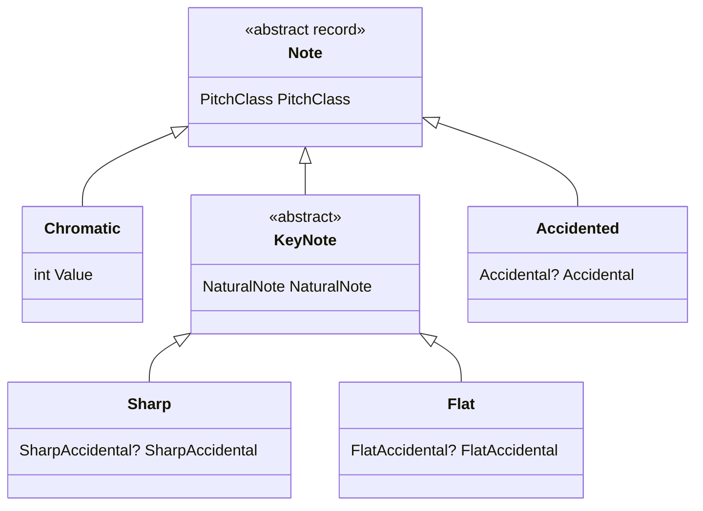

import FretboardC from '../../../../assets/music-theory-ga/l1-fretboard-c.svg';

Toutes les autres leçons reposent sur quatre idées : une **hauteur** (*pitch*) est une note à une hauteur donnée, une **classe de hauteurs** (*pitch class*) est cette note dans n'importe quelle octave, un **intervalle** est la distance entre deux notes, et sur une guitare chaque **case** ajoute l'une de ces distances, un demi-ton. Cette leçon les parcourt dans cet ordre : d'abord l'idée musicale, puis sa notation, puis les types que [Guitar Alchemist](https://github.com/GuitarAlchemist/ga) (GA) utilise pour la représenter.

Tous les liens vers GA pointent sur le commit [`a826864`](https://github.com/GuitarAlchemist/ga/tree/a826864f3a012cad88e415954bf57eca0ce12aa6) de `GuitarAlchemist/ga`, celui contre lequel le programme du cours est compilé.

## Exécuter le programme de la leçon

Le programme du cours se trouve dans [`code/music-theory-ga`](https://github.com/spareilleux/learn/tree/main/code/music-theory-ga). [`fetch-ga.sh`](https://github.com/spareilleux/learn/blob/79d2198/code/music-theory-ga/fetch-ga.sh) clone GA à ce commit sans le contenu de ses fichiers ([`--filter=blob:none`](https://git-scm.com/docs/git-clone#Documentation/git-clone.txt---filterfilter-spec)), puis n'extrait que trois projets avec [`git sparse-checkout`](https://git-scm.com/docs/git-sparse-checkout). Le projet C# référence l'un d'eux, `GA.Domain.Core`, comme n'importe quel autre projet d'une solution ([`GaTheory.csproj`](https://github.com/spareilleux/learn/blob/79d2198/code/music-theory-ga/GaTheory/GaTheory.csproj#L9-L14)). Il te faut le [SDK .NET 10](https://dotnet.microsoft.com/download/dotnet/10.0) et Git ; sous Windows, lance les commandes depuis Git Bash.

```bash
bash code/music-theory-ga/check.sh                                   # toutes les leçons, comparées avec expected/
dotnet run --project code/music-theory-ga/GaTheory -c Release -- l1  # cette leçon seulement, après check.sh
```

Chaque tableau affiche le calcul propre au cours, écrit à partir des définitions des manuels dans [`Theory.cs`](https://github.com/spareilleux/learn/blob/79d2198/code/music-theory-ga/GaTheory/Theory.cs), à côté de la réponse de GA, puis `ok` ou `DIFF`. Un `DIFF` n'est pas un échec du programme : c'est quelque chose que GA fait autrement, et la leçon l'explique. [`check.sh`](https://github.com/spareilleux/learn/blob/79d2198/code/music-theory-ga/check.sh) compare toute la sortie, lignes `DIFF` comprises, avec [`expected/l1.txt`](https://github.com/spareilleux/learn/blob/79d2198/code/music-theory-ga/expected/l1.txt), sous Linux, Windows et macOS en CI.

## Hauteur et classe de hauteurs

### L'idée

Joue la corde de E grave à vide, puis la même note douze cases plus haut : la seconde note sonne « pareil, mais plus aigu ». Les musiciens appellent cela l'**équivalence d'octave**. Une **hauteur** est une note précise, comme le E de la corde grave ; une **classe de hauteurs**, c'est tous les E de toutes les octaves ([Open Music Theory, "Pitch and Pitch Class"](https://viva.pressbooks.pub/openmusictheory/chapter/pitch-and-pitch-class/)).

La musique occidentale divise l'octave en douze **demi-tons** égaux. Si tu connais `TimeOnly` ou `LocalTime`, une classe de hauteurs est l'heure sur un cadran de 12 heures et une hauteur est un horodatage complet : ajouter douze demi-tons change l'octave, pas la classe de hauteurs.

### La notation

- La **notation scientifique des hauteurs** (*American Standard Pitch Notation*) écrit une hauteur comme un nom de note suivi d'un numéro d'octave. Les numéros d'octave changent sur C, et le C central (*middle C*) est C4 ([Open Music Theory, "ASPN"](https://viva.pressbooks.pub/openmusictheory/chapter/aspn/)).
- Les **numéros de note MIDI** comptent les demi-tons de 0 à 127 : le C central vaut 60 et A4 (440 Hz) vaut 69 ([MIDI tuning standard](https://en.wikipedia.org/wiki/MIDI_tuning_standard)). Donc `midi = 12 × (octave + 1) + pitch class`.
- La **notation entière** numérote les classes de hauteurs de C = 0 à B = 11. Toutes les graphies enharmoniques d'une note partagent son numéro : B♯ vaut 0 et D♭ vaut 1 ([Open Music Theory, "Pitch and Pitch Class"](https://viva.pressbooks.pub/openmusictheory/chapter/pitch-and-pitch-class/)). Pour que chaque classe de hauteurs tienne en un caractère, 10 et 11 s'écrivent souvent T et E, comme dans le tableau des classes d'ensembles de [Open Music Theory, "Set Class and Prime Form"](https://viva.pressbooks.pub/openmusictheory/chapter/set-class-and-prime-form/), où la gamme majeure est `(013568T)`.

Le premier tableau du programme convertit les six cordes à vide d'une guitare, le C central, A4 et C♯4 :

```text
== Pitches: MIDI number and pitch class (C4 = 60)
pitch    course               GA                   check
E2       midi 40 pc 4         midi 40 pc 4         ok
A2       midi 45 pc 9         midi 45 pc 9         ok
D3       midi 50 pc 2         midi 50 pc 2         ok
G3       midi 55 pc 7         midi 55 pc 7         ok
B3       midi 59 pc 11        midi 59 pc 11        ok
E4       midi 64 pc 4         midi 64 pc 4         ok
C4       midi 60 pc 0         midi 60 pc 0         ok
A4       midi 69 pc 9         midi 69 pc 9         ok
C#4      midi 61 pc 1         midi 61 pc 1         ok
GA prints pitch classes as: 0 1 2 3 4 5 6 7 8 9 T E
```

### Dans GA

- [`PitchClass`](https://github.com/GuitarAlchemist/ga/blob/a826864f3a012cad88e415954bf57eca0ce12aa6/Common/GA.Domain.Core/Theory/Atonal/PitchClass.cs#L22-L28) est un [`readonly record struct`](https://learn.microsoft.com/dotnet/csharp/language-reference/builtin-types/record) qui contient un `int` de 0 à 11 : un objet valeur, comme tu écrirais un `Money` ou un `EmailAddress`. Son *setter* [normalise](https://github.com/GuitarAlchemist/ga/blob/a826864f3a012cad88e415954bf57eca0ce12aa6/Common/GA.Domain.Core/Theory/Atonal/PitchClass.cs#L197-L201) la valeur modulo 12 via [`EnsureValueRange(…, normalize: true)`](https://github.com/GuitarAlchemist/ga/blob/a826864f3a012cad88e415954bf57eca0ce12aa6/Common/GA.Core/ValueObjects/ValueObjectUtils.cs#L25-L47), si bien que `PitchClass.FromValue(-1)` vaut 11 : l'arithmétique des classes de hauteurs ne quitte jamais le cadran. `ToString()` [affiche 10 et 11 sous la forme T et E](https://github.com/GuitarAlchemist/ga/blob/a826864f3a012cad88e415954bf57eca0ce12aa6/Common/GA.Domain.Core/Theory/Atonal/PitchClass.cs#L83-L88). Attention : la classe de hauteurs `E` est B, pas la note E.
- [`Pitch`](https://github.com/GuitarAlchemist/ga/blob/a826864f3a012cad88e415954bf57eca0ce12aa6/Common/GA.Domain.Core/Primitives/Notes/Pitch.cs#L15-L24) est un `abstract record` avec une `Octave` et une `PitchClass`, et trois sous-types selon la graphie de la note : `Chromatic`, `Sharp` et `Flat`.
- [`MidiNote`](https://github.com/GuitarAlchemist/ga/blob/a826864f3a012cad88e415954bf57eca0ce12aa6/Common/GA.Domain.Core/Primitives/Notes/MidiNote.cs#L39-L41) déduit l'octave et la classe de hauteurs en divisant par 12, et [`MidiNote.Create`](https://github.com/GuitarAlchemist/ga/blob/a826864f3a012cad88e415954bf57eca0ce12aa6/Common/GA.Domain.Core/Primitives/Notes/MidiNote.cs#L93-L94) est la formule ci-dessus, avec [`Octave.Min`](https://github.com/GuitarAlchemist/ga/blob/a826864f3a012cad88e415954bf57eca0ce12aa6/Common/GA.Domain.Core/Primitives/Notes/Octave.cs#L16-L17) = −1.

## Noms des notes et altérations

### L'idée

Les sept **notes naturelles** C D E F G A B sont les touches blanches d'un piano. Entre la plupart d'entre elles se trouve une classe de hauteurs de plus (une touche noire), sauf entre E et F et entre B et C, qui ne sont qu'à un demi-ton l'une de l'autre. Une **altération** élève (♯, dièse) ou abaisse (♭, bémol) une lettre d'un demi-ton ; les doubles dièses (𝄪, écrits `x`) et les doubles bémols (𝄫) la déplacent de deux.

Une même classe de hauteurs a donc plusieurs noms : C♯ et D♭ sont la même touche du piano, tout comme B♯ et C. Ce sont des graphies **enharmoniques** ([Open Music Theory, "Pitch and Pitch Class"](https://viva.pressbooks.pub/openmusictheory/chapter/pitch-and-pitch-class/)). Les numéros d'octave suivent la lettre, pas le son : B♯3 et C4 sont la même touche, dans deux octaves ([Open Music Theory, "ASPN"](https://viva.pressbooks.pub/openmusictheory/chapter/aspn/)). Le nom choisi dépend du contexte : la leçon 3 montre pourquoi un accord de C mineur s'écrit C E♭ G, et non C D♯ G.

```text
== Spellings: many names, one pitch class
note     course GA     check
C#       1      1      ok
Db       1      1      ok
B#       0      0      ok
Cb       11     11     ok
E#       5      5      ok
Fb       4      4      ok
Bbb      9      9      ok
Fx       7      7      ok
```

### Dans GA

[`Note`](https://github.com/GuitarAlchemist/ga/blob/a826864f3a012cad88e415954bf57eca0ce12aa6/Common/GA.Domain.Core/Primitives/Notes/Note.cs#L10-L19) est une hiérarchie fermée de records, l'union discriminée de GA : l'équivalent C# d'une [sealed interface](https://docs.oracle.com/en/java/javase/21/language/sealed-classes-and-interfaces.html) Java avec des implémentations en records.



- [`Note.Chromatic`](https://github.com/GuitarAlchemist/ga/blob/a826864f3a012cad88e415954bf57eca0ce12aa6/Common/GA.Domain.Core/Primitives/Notes/Note.cs#L39-L58) est une classe de hauteurs sans graphie ; elle s'affiche `C#/Db`.
- [`Note.Sharp`](https://github.com/GuitarAlchemist/ga/blob/a826864f3a012cad88e415954bf57eca0ce12aa6/Common/GA.Domain.Core/Primitives/Notes/Note.cs#L118-L140) et [`Note.Flat`](https://github.com/GuitarAlchemist/ga/blob/a826864f3a012cad88e415954bf57eca0ce12aa6/Common/GA.Domain.Core/Primitives/Notes/Note.cs#L189-L214) sont les noms utilisés dans les tonalités à dièses et à bémols.
- [`Note.Accidented`](https://github.com/GuitarAlchemist/ga/blob/a826864f3a012cad88e415954bf57eca0ce12aa6/Common/GA.Domain.Core/Primitives/Notes/Note.cs#L262-L269) accepte n'importe quelle [`Accidental`](https://github.com/GuitarAlchemist/ga/blob/a826864f3a012cad88e415954bf57eca0ce12aa6/Common/GA.Domain.Core/Primitives/Notes/Accidental.cs#L12-L50), du triple bémol au triple dièse. Sa classe de hauteurs est celle de la lettre, tirée de [`NaturalNote.PitchClass`](https://github.com/GuitarAlchemist/ga/blob/a826864f3a012cad88e415954bf57eca0ce12aa6/Common/GA.Domain.Core/Primitives/Notes/NaturalNote.cs#L96-L106), plus l'altération, normalisée : c'est ainsi que `Cb` devient 11.

## Intervalles

### L'idée

Un intervalle porte deux noms à la fois ([Open Music Theory, "Intervals"](https://viva.pressbooks.pub/openmusictheory/chapter/intervals/)) :

- son **numéro** compte les lettres, extrémités comprises : de C à E, c'est une tierce (C, D, E), quelles que soient les altérations ;
- sa **qualité** vient du nombre de demi-tons. Les unissons, quartes, quintes et octaves sont *justes* (P) et deviennent *augmentés* (A) ou *diminués* (d) quand ils sont plus larges ou plus étroits d'un demi-ton. Les secondes, tierces, sixtes et septièmes sont *majeures* (M) ou *mineures* (m), à un demi-ton d'écart, puis augmentées ou diminuées au-delà.

Voilà pourquoi C–D♯ et C–E♭ font tous deux trois demi-tons mais sont des intervalles différents : une seconde augmentée et une tierce mineure. Retourner un intervalle (de C à E, puis de E à C) est un **renversement** : les numéros totalisent 9 (une tierce devient une sixte), juste reste juste, majeur devient mineur et augmenté devient diminué (même chapitre, "Intervallic Inversion").

Quand seules les classes de hauteurs comptent, la distance est repliée sur 6 demi-tons au plus : c'est la **classe d'intervalles**, et C–E (4) comme E–C (8) sont de classe d'intervalles 4 ([Open Music Theory, "Intervals in Integer Notation"](https://viva.pressbooks.pub/openmusictheory/chapter/intervals-in-integer-notation/)). La leçon 4 compte les classes d'intervalles.

```text
== Intervals: name from the letters, size in semitones, interval class
notes    course         GA             check
C-E      M3 4 ic4       M3 4 ic4       ok
C-Eb     m3 3 ic3       m3 3 ic3       ok
C-D#     A2 3 ic3       A2 3 ic3       ok
C-G      P5 7 ic5       P5 7 ic5       ok
C-F#     A4 6 ic6       A4 6 ic6       ok
C-Gb     d5 6 ic6       d5 6 ic6       ok
B-F      d5 6 ic6       d5 6 ic6       ok
E-C      m6 8 ic4       m6 8 ic4       ok
!M3      m6             m6             ok
```

### Dans GA

- [`Interval.Simple`](https://github.com/GuitarAlchemist/ga/blob/a826864f3a012cad88e415954bf57eca0ce12aa6/Common/GA.Domain.Core/Primitives/Intervals/Interval.Diatonic.Simple.cs#L12-L37) est un record avec une `Size` (le numéro, [`SimpleIntervalSize`](https://github.com/GuitarAlchemist/ga/blob/a826864f3a012cad88e415954bf57eca0ce12aa6/Common/GA.Domain.Core/Primitives/Intervals/SimpleIntervalSize.cs#L70-L93), de 1 à 8, qui sait s'il est juste et connaît sa taille majeure ou juste en demi-tons) et une `Quality` ([`IntervalQuality`](https://github.com/GuitarAlchemist/ga/blob/a826864f3a012cad88e415954bf57eca0ce12aa6/Common/GA.Domain.Core/Primitives/Intervals/IntervalQuality.cs#L29-L35), de −3 pour doublement diminué à +3 pour doublement augmenté). Ses demi-tons sont ceux de la taille plus la qualité convertie en altération.
- L'opérateur `!` est [`ToInverse`](https://github.com/GuitarAlchemist/ga/blob/a826864f3a012cad88e415954bf57eca0ce12aa6/Common/GA.Domain.Core/Primitives/Intervals/Interval.Diatonic.Simple.cs#L40-L43) : [`9 - Value`](https://github.com/GuitarAlchemist/ga/blob/a826864f3a012cad88e415954bf57eca0ce12aa6/Common/GA.Domain.Core/Primitives/Intervals/SimpleIntervalSize.cs#L124-L125) pour la taille et la qualité opposée.
- [`GetInterval`](https://github.com/GuitarAlchemist/ga/blob/a826864f3a012cad88e415954bf57eca0ce12aa6/Common/GA.Domain.Core/Primitives/Extensions/NoteExtensions.cs#L104-L116) tire le numéro des lettres et les demi-tons des classes de hauteurs, puis cherche la qualité dans [`DetermineQuality`](https://github.com/GuitarAlchemist/ga/blob/a826864f3a012cad88e415954bf57eca0ce12aa6/Common/GA.Domain.Core/Primitives/Extensions/NoteExtensions.cs#L13-L57), le même algorithme que [`Theory.Interval`](https://github.com/spareilleux/learn/blob/79d2198/code/music-theory-ga/GaTheory/Theory.cs#L43-L66) dans le cours. Les méthodes de GA sont des [extension members](https://learn.microsoft.com/dotnet/csharp/whats-new/csharp-14#extension-members) de C# 14 (`extension(Note note1) { … }`).
- [`IntervalClass.FromValue`](https://github.com/GuitarAlchemist/ga/blob/a826864f3a012cad88e415954bf57eca0ce12aa6/Common/GA.Domain.Core/Theory/Atonal/IntervalClass.cs#L44-L52) replie n'importe quel nombre de demi-tons dans 0–6.

## Le manche et les accordages

### L'idée

Les cordes d'une guitare sont numérotées à partir de la plus aiguë : la corde 1 est le E aigu, la plus fine, la corde 6 le E grave. L'**accordage standard** est E2 A2 D3 G3 B3 E4 de la corde 6 à la corde 1 ([Guitar tunings](https://en.wikipedia.org/wiki/Guitar_tunings)). Chaque case élève la corde d'un demi-ton, donc la note à la corde *s*, case *f*, est le numéro MIDI de la corde à vide plus *f*. La même hauteur apparaît sur plusieurs cordes : C4 est à la corde 2 case 1, à la corde 3 case 5 et à la corde 4 case 10. Le module Streeling [GTR-001 · La carte du manche](../../streeling/guitar-studies/gtr-001-the-fretboard-map/) passe en revue les notes naturelles sur chaque corde.

```play
E2
A2
D3
G3
B3
E4
```

Le diagramme dessine les cases 0 à 12 en accordage standard, la corde 1 en haut comme dans une tablature, et marque chaque position de la classe de hauteurs C avec sa hauteur. Il y en a six : C3 sur la corde 6 case 8 et sur la corde 5 case 3, C4 sur la corde 4 case 10, la corde 3 case 5 et la corde 2 case 1, et C5 sur la corde 1 case 8. Trois positions jouent exactement la même hauteur, C4.

<FretboardC role="img" aria-label="Manche de guitare en accordage standard, cases 0 à 12, corde 1 en haut. Classe de hauteurs C : corde 6 case 8 (C3), corde 5 case 3 (C3), corde 4 case 10 (C4), corde 3 case 5 (C4), corde 2 case 1 (C4), corde 1 case 8 (C5)." />

```text
== Standard tuning: string 1 is the highest
string   course     GA         check
1        E4         E4         ok
2        B3         B3         ok
3        G3         G3         ok
4        D3         D3         ok
5        A2         A2         ok
6        E2         E2         ok

== Fretboard: each fret adds one semitone
string/fret  course       GA           check
6/0          E2 40        E2 40        ok
6/3          G2 43        G2 43        ok
5/3          C3 48        C3 48        ok
2/1          C4 60        C4 60        ok
3/5          C4 60        C4 60        ok
1/8          C5 72        C5 72        ok
4/10         C4 60        C4 60        ok

== Where is pitch class C on frets 0-12? (string/fret)
course              6/8 5/3 4/10 3/5 2/1 1/8
GA, Note.Chromatic  6/8 5/3 4/10 3/5 2/1 1/8
GA, Note.Sharp      (none)
```

### Dans GA

- [`Tuning`](https://github.com/GuitarAlchemist/ga/blob/a826864f3a012cad88e415954bf57eca0ce12aa6/Common/GA.Domain.Core/Instruments/Tuning.cs#L18-L38) se construit à partir d'une chaîne de hauteurs : `Tuning.Default` analyse `"E2 A2 D3 G3 B3 E4"`, du grave à l'aigu, et [`BuildPitchArray`](https://github.com/GuitarAlchemist/ga/blob/a826864f3a012cad88e415954bf57eca0ce12aa6/Common/GA.Domain.Core/Instruments/Tuning.cs#L86-L109) l'inverse quand la première hauteur est la plus grave, pour que l'[indexeur](https://github.com/GuitarAlchemist/ga/blob/a826864f3a012cad88e415954bf57eca0ce12aa6/Common/GA.Domain.Core/Instruments/Tuning.cs#L66-L79) `tuning[new Str(1)]` soit la corde la plus aiguë, comme comptent les guitaristes.
- [`Str`](https://github.com/GuitarAlchemist/ga/blob/a826864f3a012cad88e415954bf57eca0ce12aa6/Common/GA.Domain.Core/Instruments/Primitives/Str.cs#L13-L17) (de 1 à 26) et [`Fret`](https://github.com/GuitarAlchemist/ga/blob/a826864f3a012cad88e415954bf57eca0ce12aa6/Common/GA.Domain.Core/Instruments/Primitives/Fret.cs#L15-L26) (−1 pour une corde étouffée, 0 à vide, jusqu'à 36) sont là encore des objets valeur.
- [`Fretboard.GetNote`](https://github.com/GuitarAlchemist/ga/blob/a826864f3a012cad88e415954bf57eca0ce12aa6/Common/GA.Domain.Core/Instruments/Primitives/Fretboard.cs#L48-L68) ajoute la case à la note MIDI de la corde à vide, comme ci-dessus, mais prend un index de corde à partir de 0 : `GetNote(0, 0)` est la corde 1.
- [`GetPositionsForNote`](https://github.com/GuitarAlchemist/ga/blob/a826864f3a012cad88e415954bf57eca0ce12aa6/Common/GA.Domain.Core/Instruments/Primitives/Fretboard.cs#L73-L88) compare la note de chaque position avec `Equals`. `GetNote` renvoie un `Note.Chromatic`, et des records de types différents ne sont jamais égaux, donc chercher `Note.Sharp.C` ne trouve rien : c'est la ligne `(none)` ci-dessus.

## Surprises rencontrées en écrivant cette leçon

L'écriture des comparaisons a révélé quelques endroits où GA ne répond pas ce que dit la théorie. Le programme du cours les garde comme lignes `DIFF`, pour que la CI remarque si un commit ultérieur de GA les change ; ils figurent aussi dans le [journal](../journal/).

```text
== Surprises found while writing this lesson
call                       course       GA           check
Pitch.Flat.DFlat(4)        Db4          D4           DIFF
Pitch.Flat.GFlat(4)        Gb4          A4           DIFF
Pitch.Flat.FFlat(4)        Fb4          G4           DIFF
Pitch.Sharp.TryParse Eb2   rejected     B2           DIFF
Note.Flat.Parse B          B            Bb           DIFF
PitchClass.Parse A         9            10           DIFF
IntervalSize.TryParse x    False        throws ArgumentException DIFF
```

- `Pitch.Flat.DFlat(octave)`, `FFlat` et `GFlat` [construisent D, G et A](https://github.com/GuitarAlchemist/ga/blob/a826864f3a012cad88e415954bf57eca0ce12aa6/Common/GA.Domain.Core/Primitives/Notes/Pitch.cs#L285-L295) au lieu de D♭, F♭ et G♭. Les propriétés `DFlat4` et consorts sont justes ; seules les méthodes sont fausses.
- [`PitchParser`](https://github.com/GuitarAlchemist/ga/blob/a826864f3a012cad88e415954bf57eca0ce12aa6/Common/GA.Domain.Core/Primitives/Notes/PitchParser.cs#L20-L25) cherche son motif `([A-G])(#?)(10|11|[0-9])` sans ancres `^…$` et ignore la casse : dans `"Eb2"`, le parseur à dièses saute le E et reconnaît `b2` comme B2.
- [`Note.Flat.TryParse`](https://github.com/GuitarAlchemist/ga/blob/a826864f3a012cad88e415954bf57eca0ce12aa6/Common/GA.Domain.Core/Primitives/Notes/Note.cs#L219-L237) met son entrée en majuscules *avant* de remplacer `♭` par `b`, puis traite un `B` final comme un signe bémol. Ces deux lignes le cassent dans les deux sens : `"B"` lui-même devient B♭, et un vrai `"D♭"` est rejeté, parce que le remplacement laisse un `b` minuscule là où le `EndsWith("B")`, sensible à la casse, ne le reconnaît plus.
- [`PitchClass.TryParse`](https://github.com/GuitarAlchemist/ga/blob/a826864f3a012cad88e415954bf57eca0ce12aa6/Common/GA.Domain.Core/Theory/Atonal/PitchClass.cs#L252-L267) lit `A` et `B` comme les chiffres 10 et 11, exprès : le commentaire les appelle "common hex-like aliases sometimes used in set notation". La convention existe bel et bien ; le bug, c'est l'ordre. Les alias sont essayés *avant* les noms de notes, si bien que `"A"` est la classe de hauteurs 10 et que la note A, classe de hauteurs 9, ne peut jamais être analysée.
- [`SimpleIntervalSize.TryParse`](https://github.com/GuitarAlchemist/ga/blob/a826864f3a012cad88e415954bf57eca0ce12aa6/Common/GA.Domain.Core/Primitives/Intervals/SimpleIntervalSize.cs#L155-L164) lève une exception sur une entrée invalide au lieu de renvoyer `false`, contrairement au contrat de [`IParsable<TSelf>.TryParse`](https://learn.microsoft.com/dotnet/api/system.iparsable-1.tryparse), et [`CompoundIntervalSize.TryParse`](https://github.com/GuitarAlchemist/ga/blob/a826864f3a012cad88e415954bf57eca0ce12aa6/Common/GA.Domain.Core/Primitives/Intervals/CompoundIntervalSize.cs#L101-L110) fait de même. Le tableau abrège le nom : le type s'appelle `SimpleIntervalSize`.

## Exercices

1. Quelle hauteur, quel numéro MIDI et quelle classe de hauteurs correspondent à la corde 4, case 7, en accordage standard ?
2. Nomme les intervalles E–B♭ et A–C♯, avec leur taille en demi-tons et leur classe d'intervalles.
3. En accordage **drop D**, la corde 6 est descendue à D2 ([Guitar tunings](https://en.wikipedia.org/wiki/Guitar_tunings)). Où se trouve la classe de hauteurs D sur les cases 0 à 5 ? Construis ce manche avec les types `Tuning` et `Fretboard` de GA.

<details>
<summary>Solutions</summary>

1. La corde 4 est D3 (MIDI 50) ; sept cases plus haut, c'est A3, MIDI 57, classe de hauteurs 9.
2. De E à B♭, on couvre cinq lettres (E F G A B) et 6 demi-tons, un de moins qu'une quinte juste : une quinte diminuée, classe d'intervalles 6. De A à C♯, on couvre trois lettres et 4 demi-tons : une tierce majeure, classe d'intervalles 4.
3. Cordes 6 et 4 à vide, corde 5 case 5 et corde 2 case 3. Avec GA, un accordage est une collection de hauteurs analysée ([`Lesson1.cs`](https://github.com/spareilleux/learn/blob/79d2198/code/music-theory-ga/GaTheory/Lesson1.cs#L93-L118)) :

   ```csharp
   var dropD = new Fretboard(new Tuning(PitchCollection.Parse("D2 A2 D3 G3 B3 E4")), 5);
   var positions = dropD.GetPositionsForNote(Note.Chromatic.D);
   ```

   ```text
   == Exercise solutions
   question               course               GA                   check
   1. string 4, fret 7    A3 midi 57 pc 9      A3 midi 57 pc 9      ok
   2. E-Bb                d5 6 ic6             d5 6 ic6             ok
   2. A-C#                M3 4 ic4             M3 4 ic4             ok
   3. D in drop D, 0-5    6/0 5/5 4/0 2/3      6/0 5/5 4/0 2/3      ok
   ```

</details>

## À retenir

- Une hauteur est une classe de hauteurs plus une octave ; avec les numéros MIDI, `pitch class = midi % 12` et le C central vaut 60.
- Un nom de note est une lettre plus des altérations ; plusieurs noms partagent une même classe de hauteurs. GA garde les deux : `PitchClass` pour le numéro, les records `Note` pour la graphie.
- Le numéro d'un intervalle vient des lettres et sa qualité des demi-tons ; la classe d'intervalles oublie à la fois la direction et l'octave.
- Sur une guitare, une position est une corde et une case : la hauteur de la corde à vide plus un demi-ton par case. GA numérote les cordes à partir de la plus aiguë, comme les guitaristes.
- Les primitives de GA sont de petits objets valeur, des `readonly record struct` qui valident ou normalisent leur plage, et des records pour les unions : la même modélisation que pour de l'argent ou des identifiants.

## Sources

- Mark Gotham et al., [*Open Music Theory*](https://viva.pressbooks.pub/openmusictheory/), version 2, 2023 : chapitres [Pitch and Pitch Class](https://viva.pressbooks.pub/openmusictheory/chapter/pitch-and-pitch-class/), [ASPN](https://viva.pressbooks.pub/openmusictheory/chapter/aspn/), [Intervals](https://viva.pressbooks.pub/openmusictheory/chapter/intervals/), [Intervals in Integer Notation](https://viva.pressbooks.pub/openmusictheory/chapter/intervals-in-integer-notation/), [Set Class and Prime Form](https://viva.pressbooks.pub/openmusictheory/chapter/set-class-and-prime-form/). Le livre est publié sous licence [CC BY-SA 4.0](https://creativecommons.org/licenses/by-sa/4.0/).
- [MIDI tuning standard](https://en.wikipedia.org/wiki/MIDI_tuning_standard) (MIDI 60 = C4, 69 = A4) et [Guitar tunings](https://en.wikipedia.org/wiki/Guitar_tunings) (accordages standard et drop D, numérotation des cordes), Wikipédia.
- GuitarAlchemist/ga au commit [`a826864`](https://github.com/GuitarAlchemist/ga/tree/a826864f3a012cad88e415954bf57eca0ce12aa6/Common/GA.Domain.Core) : `Primitives/Notes`, `Primitives/Intervals`, `Theory/Atonal/PitchClass.cs`, `Instruments`.
