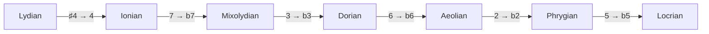

import BraceletMajor from '../../../../assets/music-theory-ga/l2-bracelet-major.svg';
import BraceletTransposition from '../../../../assets/music-theory-ga/l2-bracelet-transposition.svg';
import BraceletModes from '../../../../assets/music-theory-ga/l2-bracelet-modes.svg';
import BraceletSymmetric from '../../../../assets/music-theory-ga/l2-bracelet-symmetric.svg';

Une gamme est un motif de pas ; une fois l'octave oubliée, c'est aussi un ensemble de classes de hauteurs, et un ensemble d'au plus douze éléments tient sur douze bits. Cette leçon va du motif au nombre : comment se construisent les gammes majeure et mineures, pourquoi transposer une gamme revient à faire tourner ses bits, ce qu'est un mode, et ce que [Guitar Alchemist](https://github.com/GuitarAlchemist/ga) (GA) bâtit sur ce simple `int`.

Tous les liens vers GA pointent sur le commit [`a826864`](https://github.com/GuitarAlchemist/ga/tree/a826864f3a012cad88e415954bf57eca0ce12aa6). Les sorties viennent du programme du cours (la [leçon 1](../01-notes-and-the-fretboard/#exécuter-le-programme-de-la-leçon) montre comment l'exécuter) :

```bash
dotnet run --project code/music-theory-ga/GaTheory -c Release -- l2
```

## Les gammes comme motifs de pas

### L'idée

Joue les touches blanches d'un piano de C jusqu'au C suivant, ou à la guitare la corde 5 à partir de la case 3 : C D E F G A B C. C'est la **gamme majeure**. Ce qui la rend majeure, ce ne sont pas ses notes mais les distances entre elles : deux tons, un demi-ton, trois tons, un demi-ton. Commence le même motif sur n'importe quelle note et tu obtiens la gamme majeure de cette note ([Open Music Theory, "Major Scales, Scale Degrees, and Key Signatures"](https://viva.pressbooks.pub/openmusictheory/chapter/major-scales/)).

Sur une guitare, un ton vaut deux cases et un demi-ton une case, donc le motif est littéralement un nombre de cases : 2 2 1 2 2 2 1.

Les **gammes mineures** commencent par une tierce plus basse ([Open Music Theory, "Minor Scales, Scale Degrees, and Key Signatures"](https://viva.pressbooks.pub/openmusictheory/chapter/minor-scales-scale-degrees-and-key-signatures/)) :

| Gamme | Pas (W = 2, H = 1) | En demi-tons |
|---|---|---|
| Mineure naturelle | W H W W H W W | 2 1 2 2 1 2 2 |
| Mineure harmonique | W H W W H 3H H | 2 1 2 2 1 3 1 |
| Mineure mélodique, ascendante | W H W W W W H | 2 1 2 2 2 2 1 |

Le même chapitre ajoute que la mineure mélodique descend comme la mineure naturelle. Quelques collections non diatoniques complètent l'ensemble utilisé plus bas ([Open Music Theory, "Collections"](https://viva.pressbooks.pub/openmusictheory/chapter/collections/)) : la **pentatonique** (2 2 3 2 3, les touches noires), la gamme **par tons** (six tons) et la gamme **octatonique**, qui alterne tons et demi-tons et que les musiciens de jazz appellent gamme **diminuée**. La gamme **blues** de six notes est la pentatonique mineure plus une quinte abaissée ([Blues scale](https://en.wikipedia.org/wiki/Blues_scale)).

### La notation

Une gamme s'écrit par ses notes depuis la tonique, par ses pas, ou par ses intervalles depuis la tonique : P1 M2 M3 P4 P5 M6 M7 pour la majeure, avec les noms d'intervalles de la leçon 1. Les musiciens abrègent cette dernière forme en **degrés** : `1 2 3 4 5 6 7` pour la majeure, `1 2 b3 4 5 b6 b7` pour la mineure naturelle, où `b3` signifie « un demi-ton sous la tierce de la gamme majeure ».

```text
== The major scale from its steps (2 = whole step, 1 = half step)
           course                 GA                     check
steps      2 2 1 2 2 2 1          2 2 1 2 2 2 1          ok
pcs        0 2 4 5 7 9 E          0 2 4 5 7 9 E          ok
intervals  P1 M2 M3 P4 P5 M6 M7   P1 M2 M3 P4 P5 M6 M7   ok
binary     101010110101           101010110101           ok
id         2741                   2741                   ok
```

### Dans GA

[`Scale`](https://github.com/GuitarAlchemist/ga/blob/a826864f3a012cad88e415954bf57eca0ce12aa6/Common/GA.Domain.Core/Theory/Tonal/Scales/Scale.cs#L53-L75) se construit à partir d'une chaîne de noms de notes : `Scale.Major` vaut `new("C D E F G A B")` et `Scale.Blues` vaut `new("C Eb F F# G Bb")`. Une gamme expose ses notes, ses `Intervals` depuis la première note, et un `PitchClassSet`, l'ensemble non ordonné de ses classes de hauteurs. Les trois gammes mineures sont [écrites à partir de A](https://github.com/GuitarAlchemist/ga/blob/a826864f3a012cad88e415954bf57eca0ce12aa6/Common/GA.Domain.Core/Theory/Tonal/Scales/Scale.cs#L116-L121) (`"A B C D E F G#"` pour la mineure harmonique), les autres à partir de C.

## Une gamme est un nombre sur 12 bits

### L'idée

Oublie l'ordre et l'octave : une gamme de C majeur est l'ensemble de classes de hauteurs `{0, 2, 4, 5, 7, 9, 11}`. Un sous-ensemble de douze éléments est un champ de bits, exactement comme une enum `[Flags]` ou un `EnumSet` Java : le bit *n* est à 1 quand la classe de hauteurs *n* appartient à l'ensemble. Il existe 2¹² = 4096 ensembles de ce genre, donc chaque gamme, accord ou fragment de mélodie, une fois réduit à ses classes de hauteurs, a un identifiant de 0 à 4095. Le [catalogue des gammes](https://ianring.com/musictheory/scales/) d'Ian Ring les numérote ainsi ; C majeur est la [gamme 2741](https://ianring.com/musictheory/scales/2741). Le module Streeling [MUS-006 · L'univers des gammes](../../streeling/music/mus-006-the-scale-universe/) part de la même idée.

Un ensemble de classes de hauteurs peut aussi se dessiner. Place les douze classes de hauteurs sur un cadran d'horloge, 0 en haut et les autres dans le sens des aiguilles d'une montre, remplis celles de l'ensemble et relie-les : Ian Ring appelle cette image un **diagramme en bracelet** (*bracelet diagram*), qui « montre les notes de cette gamme en partant du haut (12 heures), dans le sens des aiguilles d'une montre, par demi-tons ascendants » ([gamme 2741](https://ianring.com/musictheory/scales/2741)). La gamme majeure remplit 0, 2, 4, 5, 7, 9 et 11 ; les deux endroits où deux perles pleines sont voisines, 4 et 5, 11 et 0, sont les deux demi-tons du motif.

<BraceletMajor role="img" aria-label="Diagramme en bracelet de la gamme majeure : classes de hauteurs 0 2 4 5 7 9 11 remplies sur un cadran de 12, reliées par un polygone." />

GA a un composant React pour la même image, [`BraceletNotation`](https://github.com/GuitarAlchemist/ga/blob/a826864f3a012cad88e415954bf57eca0ce12aa6/ReactComponents/ga-react-components/src/components/Atonal/BraceletNotation.tsx#L17-L45), qui prend le nombre sur 12 bits, lit le bit *i* comme la classe de hauteurs *i* et dessine une perle tous les 30 degrés. Le cours dessine ses propres diagrammes avec [`Diagrams.cs`](https://github.com/spareilleux/learn/blob/a2439ba/code/music-theory-ga/GaTheory/Diagrams.cs), à partir des mêmes nombres que les tableaux, et la CI vérifie que les images enregistrées dans le dépôt sont à jour.

### La notation

En binaire, le bit de poids faible est à droite, donc la classe de hauteurs 0 (C) est le **dernier** caractère et B le premier :

| Bit (classe de hauteurs) | 11 | 10 | 9 | 8 | 7 | 6 | 5 | 4 | 3 | 2 | 1 | 0 |
|---|---|---|---|---|---|---|---|---|---|---|---|---|
| Note | B | A♯ | A | G♯ | G | F♯ | F | E | D♯ | D | C♯ | C |
| C majeur | 1 | 0 | 1 | 0 | 1 | 0 | 1 | 1 | 0 | 1 | 0 | 1 |

`101010110101` vaut 2048 + 512 + 128 + 32 + 16 + 4 + 1 = 2741. Le cours calcule l'identifiant à partir des seuls pas, avec [`Theory.FromSteps`](https://github.com/spareilleux/learn/blob/79d2198/code/music-theory-ga/GaTheory/Theory.cs#L114-L124), et le compare à celui de GA pour huit gammes de tonique C :

```text
== Scale ids (bit n = pitch class n, root on C)
scale            course GA     check
major            2741   2741   ok
natural minor    1453   1453   ok
harmonic minor   2477   2477   ok
melodic minor    2733   2733   ok
major pentatonic 661    661    ok
blues            1257   1257   ok
whole tone       1365   1365   ok
diminished       2925   2925   ok
Scale.NaturalMinor as GA stores it (A B C D E F G): id 2741
```

La dernière ligne mérite un second regard : la gamme mineure naturelle de GA, écrite à partir de A, a **le même identifiant que C majeur**. A mineur et C majeur utilisent les mêmes sept notes ; ce sont des tonalités *relatives* ([Open Music Theory, "Minor Scales"](https://viva.pressbooks.pub/openmusictheory/chapter/minor-scales-scale-degrees-and-key-signatures/)). Un ensemble de classes de hauteurs n'a pas de première note, donc l'identifiant seul ne peut pas les distinguer. C'est pourquoi le programme [transpose les gammes mineures de GA vers C](https://github.com/spareilleux/learn/blob/79d2198/code/music-theory-ga/GaTheory/Lesson2.cs#L37-L41) avant de comparer.

### Dans GA

[`PitchClassSetId`](https://github.com/GuitarAlchemist/ga/blob/a826864f3a012cad88e415954bf57eca0ce12aa6/Common/GA.Domain.Core/Theory/Atonal/PitchClassSetId.cs#L8-L28) est un `readonly record struct` autour d'un `int` de 0 à 4095, avec les opérations ensemblistes sous forme d'opérations sur les bits :

- [`FromPitchClasses`](https://github.com/GuitarAlchemist/ga/blob/a826864f3a012cad88e415954bf57eca0ce12aa6/Common/GA.Domain.Core/Theory/Atonal/PitchClassSetId.cs#L208-L217) fait un OU de `1 << pc.Value` pour chaque classe de hauteurs ;
- `Cardinality` est [`BitOperations.PopCount`](https://learn.microsoft.com/dotnet/api/system.numerics.bitoperations.popcount), `Complement` est `Value ^ 0xFFF`, et `IsScale` est `(Value & 1) == 1` : pour GA, tout ensemble qui contient C est une gamme ;
- [`BinaryValue`](https://github.com/GuitarAlchemist/ga/blob/a826864f3a012cad88e415954bf57eca0ce12aa6/Common/GA.Domain.Core/Theory/Atonal/PitchClassSetId.cs#L40) est `Convert.ToString(Value, 2).PadLeft(12, '0')`, la chaîne ci-dessus.

[`PitchClassSet`](https://github.com/GuitarAlchemist/ga/blob/a826864f3a012cad88e415954bf57eca0ce12aa6/Common/GA.Domain.Core/Theory/Atonal/PitchClassSet.cs#L351) enveloppe l'identifiant avec des propriétés plus riches, et relie même chaque ensemble à la page d'Ian Ring : `ScalePageUrl` vaut `https://ianring.com/musictheory/scales/{Id.Value}`.

## Transposer, c'est faire tourner les bits

### L'idée

Transposer une gamme déplace chaque note du même nombre de demi-tons : D majeur est C majeur monté de 2. En classes de hauteurs, `pc → (pc + n) mod 12`. Sur le champ de bits, ajouter *n* à chaque indice décale chaque bit de *n* places vers la gauche, et les bits poussés au-delà de B reviennent par la droite, sur C : un **décalage circulaire** sur douze bits.

```text
== Transposing is rotating the bits
major on   course                     GA                         check
T0 C       2741 101010110101          2741 101010110101          ok
T2 D       2774 101011010110          2774 101011010110          ok
T7 G       2773 101011010101          2773 101011010101          ok
```

Compare `101010110101` (C) avec `101011010110` (D) : le motif s'est décalé de deux places vers la gauche, et les deux `10` de tête sont revenus à la fin.

Sur le bracelet, le décalage circulaire est une rotation : chaque perle avance de deux positions dans le sens des aiguilles d'une montre, et le polygone de D majeur est celui de C majeur tourné de 60 degrés.

<BraceletTransposition role="img" aria-label="Deux bracelets. T0, la gamme majeure sur C : 0 2 4 5 7 9 11. T2, la gamme majeure sur D : 1 2 4 6 7 9 11, le même polygone tourné de deux positions dans le sens des aiguilles d'une montre." />

### La notation

La théorie des ensembles note la transposition de *n* demi-tons **T*n*** ([Open Music Theory, "Pitch-Class Sets, Normal Order, and Transformations"](https://viva.pressbooks.pub/openmusictheory/chapter/pc-sets-normal-order-and-transformations/)) : D majeur est T2 de C majeur, G majeur T7.

### Dans GA

[`PitchClassSetId.Transpose`](https://github.com/GuitarAlchemist/ga/blob/a826864f3a012cad88e415954bf57eca0ce12aa6/Common/GA.Domain.Core/Theory/Atonal/PitchClassSetId.cs#L78-L84) est la rotation, écrite à la main sur douze bits parce que [`BitOperations.RotateLeft`](https://learn.microsoft.com/dotnet/api/system.numerics.bitoperations.rotateleft) ne fait tourner que des mots entiers de 32 ou 64 bits :

```csharp
var n = (semitones % 12 + 12) % 12;
var v = (uint)Value & Mask12;
var rot = ((v << n) | (v >> (12 - n))) & Mask12;
```

La ligne suivante déclare `Rotate(count) => Transpose(count)`, avec le commentaire "Rotation of PC set is transposition". Garde-le en tête pour la section suivante : faire tourner les bits n'est *pas* la même chose que faire tourner la gamme vers une nouvelle note de départ.

## Modes

### L'idée

Rejoue les touches blanches, mais commence et finis sur D : D E F G A B C D. Mêmes notes que C majeur, autre note d'appui, et un autre son, plus sombre, parce que la tierce au-dessus de D est mineure. C'est le **mode dorien**. Les sept **modes diatoniques** sont les sept rotations de la gamme majeure, chacune avec sa propre tonique ([Open Music Theory, "Diatonic Modes"](https://viva.pressbooks.pub/openmusictheory/chapter/diatonic-modes/)) : les notes blanches à partir de C (ionien), D (dorien), E (phrygien), F (lydien), G (mixolydien), A (éolien, la mineure naturelle) et B (locrien).

Pour comparer des modes, place-les sur la même tonique. Faire tourner le motif de pas fait exactement cela : le dorien est 2 1 2 2 2 1 2, le motif majeur commencé sur son deuxième pas. Comme identifiant, le mode dorien est l'ensemble des touches blanches transposé pour que D tombe sur 0, c'est-à-dire `T10`, ou T−2, de 2741.

```text
== Modes of the major scale: rotate, then transpose back to 0
mode         course                 GA                     check
Ionian       2741 0 2 4 5 7 9 E     2741 0 2 4 5 7 9 E     ok
Dorian       1709 0 2 3 5 7 9 T     1709 0 2 3 5 7 9 T     ok
Phrygian     1451 0 1 3 5 7 8 T     1451 0 1 3 5 7 8 T     ok
Lydian       2773 0 2 4 6 7 9 E     2773 0 2 4 6 7 9 E     ok
Mixolydian   1717 0 2 4 5 7 9 T     1717 0 2 4 5 7 9 T     ok
Aeolian      1453 0 2 3 5 7 8 T     1453 0 2 3 5 7 8 T     ok
Locrian      1387 0 1 3 5 6 8 T     1387 0 1 3 5 6 8 T     ok
```

Le lydien sur C (2773) a le même identifiant que G majeur (T7 ci-dessus) : C lydien utilise les notes de G majeur. Le module Streeling [MUS-006](../../streeling/music/mus-006-the-scale-universe/) décrit un mode comme un « décalage circulaire à gauche de la distance jusqu'à la note suivante de la gamme » ; avec bit *n* = classe de hauteurs *n*, un décalage à gauche de 2 donne D **majeur** (2774), et il faut le décalage opposé, T−2, pour obtenir D dorien sur C (1709).

Les bracelets montrent la différence. Le dorien sur C est le polygone de la gamme majeure tourné de deux positions dans le sens inverse des aiguilles d'une montre, pour que la perle de D arrive sur 0. Chaque mode de la gamme majeure est ce même polygone ; ce qui change, c'est laquelle de ses perles se trouve en haut, la tonique.

<BraceletModes role="img" aria-label="Deux bracelets au même polygone. 2741, ionien : 0 2 4 5 7 9 11. 1709, dorien sur C : 0 2 3 5 7 9 10, le premier polygone tourné de deux positions dans le sens inverse des aiguilles d'une montre." />

```play
C4
D4
Eb4
F4
G4
A4
Bb4
C5
```

```play
C4
D4
E4
F4
G4
A4
B4
C5
```

### La notation

Les modes s'écrivent en degrés comparés à la gamme majeure, ou à la mineure naturelle pour les modes à tierce mineure. Chaque mode a alors un ou deux degrés **caractéristiques** : le dorien est mineur avec un 6 haussé, le phrygien mineur avec un 2 abaissé, le lydien majeur avec un 4 haussé, le mixolydien majeur avec un 7 abaissé, et le locrien mineur avec 2 et 5 abaissés ([Open Music Theory, "Introduction to Diatonic Modes and the Chromatic Scale"](https://viva.pressbooks.pub/openmusictheory/chapter/intro-to-diatonic-modes-and-the-chromatic-scale/)). Le même chapitre classe les modes du plus lumineux au plus sombre. Le tableau ci-dessus montre pourquoi ce classement est si régulier : du lydien au locrien, chaque mode abaisse exactement une note du précédent.



GA affiche ces formules, et marque les degrés caractéristiques avec `>` :

```text
GA's formulas (intervals from the mode's root):
  Ionian       1   2   3   4   5   6   7
  Dorian       1   2  b3   4   5 >♮6  b7
  Phrygian     1 >b2  b3   4   5  b6  b7
  Lydian       1   2   3 >♯4   5   6   7
  Mixolydian   1   2   3   4   5   6 >b7
  Aeolian      1   2  b3   4   5  b6  b7
  Locrian      1 >b2  b3   4 >b5  b6  b7
```

Les marques `>` correspondent aux degrés caractéristiques du manuel pour les sept modes.

### Dans GA

- [`MajorScaleMode`](https://github.com/GuitarAlchemist/ga/blob/a826864f3a012cad88e415954bf57eca0ce12aa6/Common/GA.Domain.Core/Theory/Tonal/Modes/Diatonic/MajorScaleMode.cs#L16) est un mode de `Scale.Major` pour un degré de 1 à 7. Ses notes viennent de [`NotesByRotation`](https://github.com/GuitarAlchemist/ga/blob/a826864f3a012cad88e415954bf57eca0ce12aa6/Common/GA.Domain.Core/Theory/Tonal/Modes/ScaleMode.cs#L111-L124), qui fait tourner la *liste des notes*, pas les bits : les notes du dorien sont D E F G A B C.
- [`ScaleMode.RefMode`](https://github.com/GuitarAlchemist/ga/blob/a826864f3a012cad88e415954bf57eca0ce12aa6/Common/GA.Domain.Core/Theory/Tonal/Modes/ScaleMode.cs#L38-L44) est l'éolien quand le mode contient une tierce mineure, et l'ionien sinon : les deux références du manuel.
- [`ModeFormula`](https://github.com/GuitarAlchemist/ga/blob/a826864f3a012cad88e415954bf57eca0ce12aa6/Common/GA.Domain.Core/Primitives/Formulas/ModeFormula.cs#L27-L59) associe la qualité de chaque intervalle à celle du mode de référence pour le même numéro ; un intervalle est caractéristique quand [les deux qualités diffèrent](https://github.com/GuitarAlchemist/ga/blob/a826864f3a012cad88e415954bf57eca0ce12aa6/Common/GA.Domain.Core/Primitives/Intervals/ScaleModeIntervalBase.cs#L27-L57), et `Print` ajoute le `>` et, pour la sixte majeure du dorien face au `b6` de la mineure, un bécarre.

## Combien de modes une gamme a-t-elle ?

### L'idée

Une gamme de sept notes a sept rotations, mais toutes les gammes n'ont pas autant de modes distincts que de notes. La gamme par tons est la même depuis chaque note : un seul mode. La gamme octatonique se répète tous les trois demi-tons : deux modes. La pentatonique en a cinq ([Open Music Theory, "Collections"](https://viva.pressbooks.pub/openmusictheory/chapter/collections/)). Le cours compte les modes d'une gamme comme ses rotations distinctes ramenées à 0 ([`Theory.Modes`](https://github.com/spareilleux/learn/blob/79d2198/code/music-theory-ga/GaTheory/Theory.cs#L196-L198)).

Les bracelets des deux gammes symétriques expliquent leurs comptes. La gamme par tons est un hexagone régulier : tourne-le de deux positions et il se recouvre lui-même, donc chaque rotation qui met une perle en haut donne le même ensemble, un seul mode. La gamme octatonique se recouvre après trois positions, donc ses rotations ne donnent que deux ensembles différents.

<BraceletSymmetric role="img" aria-label="Deux bracelets. 1365, la gamme par tons : 0 2 4 6 8 10, un hexagone régulier. 2925, la gamme diminuée ou octatonique : 0 2 3 5 6 8 9 11, une forme qui se répète tous les trois demi-tons." />

```text
== How many modes does a scale have?
scale            course GA     check
major            7      7      ok
natural minor    7      7      ok
harmonic minor   7      14     DIFF
melodic minor    7      7      ok
major pentatonic 5      5      ok
blues            6      24     DIFF
whole tone       1      1      ok
diminished       2      2      ok
```

### Dans GA

`PitchClassSet.ModalFamily` répond 14 pour la mineure harmonique et 24 pour la blues. Une [`ModalFamily`](https://github.com/GuitarAlchemist/ga/blob/a826864f3a012cad88e415954bf57eca0ce12aa6/Common/GA.Domain.Core/Theory/Atonal/ModalFamily.cs#L108-L131) n'est pas construite à partir de rotations : GA prend tous les ensembles qui contiennent 0, les regroupe par taille et par **vecteur d'intervalles** (le nombre de chaque intervalle qu'ils contiennent, leçon 4), et appelle chaque groupe une famille. Les rotations partagent toujours un vecteur, donc une famille contient les modes, mais d'autres ensembles peuvent aussi le partager :

- **mineure harmonique** (7 + 7) : son image miroir, 1 2 3 4 5 b6 7, la gamme *majeure harmonique* (le `Scale.HarmonicMajor` de GA lui-même), a les mêmes intervalles dans l'ordre inverse, donc le même vecteur et sept rotations de plus ;
- **blues** (6 + 6 + 12) : ses six rotations, les six de son image miroir, et douze ensembles d'une autre classe d'ensembles au même vecteur, une *relation Z* (leçon 4).

Les six autres gammes du tableau sont leur propre image miroir et n'ont pas de partenaire en relation Z, donc pour elles les deux comptes concordent. Une classe de vecteurs d'intervalles est un véritable objet de la théorie des ensembles, mais ce n'est pas ce que veut dire *mode*. Un mode est une rotation d'une gamme, et une gamme a autant de modes qu'elle a de notes, sauf si une symétrie de rotation rend deux rotations identiques : "Modes are the rotational transformations of this scale. This number includes the scale itself, so the number is usually the same as its cardinality" ([Ian Ring, gamme 2477](https://ianring.com/musictheory/scales/2477)). Ses pages répondent 7 pour la [mineure harmonique](https://ianring.com/musictheory/scales/2477) et 6 pour la [gamme blues](https://ianring.com/musictheory/scales/1257), les nombres du cours. Le commentaire de classe de `ModalFamily` dit lui-même ce qu'il construit réellement, des ensembles de classes de hauteurs "that share the same interval vector" — mais il les appelle `Modes`, et un lecteur qui compte les modes de la mineure harmonique dans GA obtient le double du nombre.

## Autres opérations sur les bits

Le **complément** d'un ensemble, ce sont toutes les classes de hauteurs qu'il ne contient pas. Le complément des touches blanches, ce sont les touches noires, qui forment une collection pentatonique ([Open Music Theory, "Collections"](https://viva.pressbooks.pub/openmusictheory/chapter/collections/)). L'**inversion** I0 envoie chaque classe de hauteurs *n* sur −*n* mod 12, l'image miroir autour de C ; la leçon 4 s'en sert pour regrouper les accords.

```text
== Other operations on the bits
major        course                 GA                     check
complement   1354 1 3 6 8 T         1354 1 3 6 8 T         ok
inversion I0 1451 0 1 3 5 7 8 T     1451 0 1 3 5 7 8 T     ok
contains 0   True                   True                   ok
```

L'inversion de C majeur est 1451, qui est aussi C phrygien dans le tableau des modes : la gamme majeure est sa propre image miroir (C majeur mis en miroir autour de D redonne C majeur), donc son inversion est l'un de ses modes. Dans GA, [`Complement`](https://github.com/GuitarAlchemist/ga/blob/a826864f3a012cad88e415954bf57eca0ce12aa6/Common/GA.Domain.Core/Theory/Atonal/PitchClassSetId.cs#L26-L28) est un XOR, et `Inverse` appelle [`MirrorValue`](https://github.com/GuitarAlchemist/ga/blob/a826864f3a012cad88e415954bf57eca0ce12aa6/Common/GA.Domain.Core/Theory/Atonal/PitchClassSetId.cs#L178-L191), qui déplace le bit *i* vers le bit (12 − *i*) mod 12.

```text
== Counting
sets                   course GA     check
all subsets of 12      4096   4096   ok
containing pc 0        2048   2048   ok
```

La moitié des ensembles contiennent C, donc [`Scale.Items`](https://github.com/GuitarAlchemist/ga/blob/a826864f3a012cad88e415954bf57eca0ce12aa6/Common/GA.Domain.Core/Theory/Tonal/Scales/Scale.cs#L93-L97) a 2048 entrées, de la note C seule à la gamme chromatique. La définition d'une gamme dans GA est volontairement large ; MUS-006 discute de critères plus étroits.

## Exercices

1. Calcule l'identifiant et la forme binaire de la gamme pentatonique mineure de C, pas 3 2 2 3 2.
2. Quel mode de la gamme majeure a l'identifiant 1717 ?
3. Prends le complément de la gamme pentatonique majeure (661). De quelle gamme majeure s'agit-il ?

<details>
<summary>Solutions</summary>

1. Les classes de hauteurs sont 0 3 5 7 10 : 1 + 8 + 32 + 128 + 1024 = **1193**, `010010101001`. MUS-006 trouve le même nombre.
2. 1717 est 0 2 4 5 7 9 T : une gamme majeure avec un 7 abaissé, le **mixolydien**. D'après les pas, c'est la rotation qui commence sur le cinquième degré.
3. 661 est 0 2 4 7 9 ; son complément est 1 3 5 6 8 T E, sept notes. Descendu d'un demi-ton, cela donne 0 2 4 5 7 9 E, C majeur, donc le complément est la gamme de **F♯ (G♭) majeur**, T6 de C majeur. Encore les touches noires et les touches blanches : le sous-ensemble pentatonique de C majeur et G♭ majeur n'ont aucune note en commun.

```text
== Exercise solutions
question               course                 GA                     check
1. minor pentatonic    1193 010010101001      1193 010010101001      ok
2. mode 1717           Mixolydian             Mixolydian             ok
3. complement of 661   1 3 5 6 8 T E = T6     1 3 5 6 8 T E = T6     ok
```

Le côté GA de chaque réponse se trouve dans [`Lesson2.cs`](https://github.com/spareilleux/learn/blob/79d2198/code/music-theory-ga/GaTheory/Lesson2.cs#L91-L106) : `PitchClassSet.Parse("0357T")`, une recherche dans `MajorScaleMode.Items`, et `Scale.MajorPentatonic.PitchClassSet.Complement`.

</details>

## À retenir

- Une gamme est un motif de pas depuis une tonique ; la gamme majeure est 2 2 1 2 2 2 1, un nombre de cases sur une corde.
- Sans sa tonique ni son octave, une gamme est un ensemble de classes de hauteurs, et cet ensemble est un nombre sur 12 bits : C majeur vaut 2741. Le `PitchClassSetId` de GA est cet `int`, avec `PopCount`, XOR et décalages comme opérations ensemblistes.
- Transposer est un décalage circulaire sur douze bits. Un mode est une rotation des *notes* : pour le comparer aux autres modes, transpose-le vers 0 (le dorien est T−2 des touches blanches, 1709).
- Du lydien au locrien, chaque mode abaisse un degré du précédent ; le `ModeFormula` de GA marque les degrés caractéristiques par rapport à l'ionien ou à l'éolien.
- Un identifiant ne connaît pas sa tonique : A mineur et C majeur valent tous deux 2741. La `ModalFamily` de GA regroupe les ensembles par vecteur d'intervalles, ce qui est plus large que les rotations : 14 « modes » pour la mineure harmonique, 24 pour la blues.

## Sources

- Mark Gotham et al., [*Open Music Theory*](https://viva.pressbooks.pub/openmusictheory/), version 2, 2023, [CC BY-SA 4.0](https://creativecommons.org/licenses/by-sa/4.0/) : chapitres [Major Scales, Scale Degrees, and Key Signatures](https://viva.pressbooks.pub/openmusictheory/chapter/major-scales/), [Minor Scales, Scale Degrees, and Key Signatures](https://viva.pressbooks.pub/openmusictheory/chapter/minor-scales-scale-degrees-and-key-signatures/), [Introduction to Diatonic Modes and the Chromatic Scale](https://viva.pressbooks.pub/openmusictheory/chapter/intro-to-diatonic-modes-and-the-chromatic-scale/), [Diatonic Modes](https://viva.pressbooks.pub/openmusictheory/chapter/diatonic-modes/), [Collections](https://viva.pressbooks.pub/openmusictheory/chapter/collections/), [Pitch-Class Sets, Normal Order, and Transformations](https://viva.pressbooks.pub/openmusictheory/chapter/pc-sets-normal-order-and-transformations/).
- Ian Ring, [*A Study of Musical Scales*](https://ianring.com/musictheory/scales/), et la [gamme 2741](https://ianring.com/musictheory/scales/2741) (la numérotation de cette leçon).
- [Blues scale](https://en.wikipedia.org/wiki/Blues_scale), Wikipédia (gamme blues hexatonique).
- GuitarAlchemist/ga au commit [`a826864`](https://github.com/GuitarAlchemist/ga/tree/a826864f3a012cad88e415954bf57eca0ce12aa6/Common/GA.Domain.Core) : `Theory/Atonal/PitchClassSetId.cs`, `PitchClassSet.cs`, `ModalFamily.cs`, `Theory/Tonal/Scales/Scale.cs`, `Theory/Tonal/Modes`, `Primitives/Formulas/ModeFormula.cs`.
