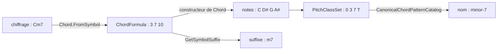

Un chiffrage d'accord (*chord symbol*) comme `Cm7` est un petit langage : une fondamentale, une qualité, des extensions. Une forme d'accord à la guitare comme `x32010` en est un autre. Cette leçon analyse les deux : ce que signifie le chiffrage, quelles notes il désigne et comment les écrire, ce qu'est un renversement, et comment une forme sur six cordes redevient un ensemble de classes de hauteurs puis un nom. À chaque étape, elle compare le manuel à [Guitar Alchemist](https://github.com/GuitarAlchemist/ga) (GA), et ici les deux divergent plus souvent que dans les deux premières leçons.

Tous les liens vers GA pointent sur le commit [`a826864`](https://github.com/GuitarAlchemist/ga/tree/a826864f3a012cad88e415954bf57eca0ce12aa6). Les sorties viennent de :

```bash
dotnet run --project code/music-theory-ga/GaTheory -c Release -- l3
```

## Triades et accords de septième

### L'idée

Une **triade** est formée de trois notes que l'on peut empiler en tierces : une **fondamentale**, une **tierce** au-dessus et une **quinte** au-dessus de la fondamentale. Sa **qualité** vient de ces deux intervalles : une tierce majeure et une quinte juste forment une triade **majeure**, une tierce mineure et une quinte juste une triade **mineure** ; une tierce mineure et une quinte diminuée forment une triade **diminuée**, une tierce majeure et une quinte augmentée une triade **augmentée** ([Open Music Theory, "Triads"](https://viva.pressbooks.pub/openmusictheory/chapter/triads/)). Le module Streeling [MUS-001 · Qu'est-ce qu'un accord ?](../../streeling/music/mus-001-what-is-a-chord/) construit les triades majeure et mineure de la même façon.

Empile une tierce de plus et tu obtiens un **accord de septième**. Cinq qualités sont courantes : septième majeure (triade majeure, septième majeure), septième de dominante (triade majeure, septième mineure), septième mineure, septième demi-diminuée (triade diminuée, septième mineure) et septième entièrement diminuée ([Open Music Theory, "Seventh Chords"](https://viva.pressbooks.pub/openmusictheory/chapter/seventh-chords/)). En empilant davantage, on obtient des neuvièmes, des onzièmes et des treizièmes.

### La notation

Un chiffrage d'accord est une lettre de fondamentale suivie de suffixes ([Open Music Theory, "Chord Symbols"](https://viva.pressbooks.pub/openmusictheory/chapter/chord-symbols/)) :

| Chiffrage | Signification | Demi-tons au-dessus de la fondamentale |
|---|---|---|
| `C` | triade majeure : rien n'est ajouté | 0 4 7 |
| `Cm`, `Cdim` ou `C°`, `Caug` ou `C+` | mineure, diminuée, augmentée | 0 3 7, 0 3 6, 0 4 8 |
| `Csus4` (`Csus`), `Csus2` | la tierce remplacée par une quarte ou une seconde | 0 5 7, 0 2 7 |
| `C6` | triade majeure plus une sixte majeure | 0 4 7 9 |
| `C7` | septième de dominante : un 7 seul est une septième **mineure** | 0 4 7 10 |
| `Cmaj7` (`CΔ7`), `Cm7` | septième majeure, septième mineure | 0 4 7 11, 0 3 7 10 |
| `Cm7♭5` (`Cø7`), `Cdim7` (`C°7`) | demi-diminué, entièrement diminué | 0 3 6 10, 0 3 6 9 |
| `C9` | septième de dominante plus une neuvième majeure | 0 4 7 10 14 |
| `Cadd9` | triade majeure plus une neuvième, **sans** septième | 0 4 7 14 |

Le même chapitre énonce les deux conventions implicites qui piègent les débutants : une septième ajoutée à une triade est mineure sauf mention `maj`, et `C9` sous-entend cette septième alors que `Cadd9` ne la sous-entend pas. Une neuvième est une octave plus une seconde, donc 14 demi-tons donnent la classe de hauteurs 2.

```text
== Chord symbols on C: pitch classes
symbol   course         GA             check
C        0 4 7          0 4 7          ok
Cm       0 3 7          0 3 7          ok
Cdim     0 3 6          0 3 6          ok
Caug     0 4 8          0 4 8          ok
Csus2    0 2 7          0 2 7          ok
Csus4    0 5 7          0 5 7          ok
C6       0 4 7 9        0 4 7 9        ok
C7       0 4 7 T        0 4 7 T        ok
Cmaj7    0 4 7 E        0 4 7 E        ok
Cm7      0 3 7 T        0 3 7 T        ok
Cm7b5    0 3 6 T        0 3 6 T        ok
Cdim7    0 3 6 9        0 3 6 9        ok
C9       0 2 4 7 T      0 2 4 7 T      ok
Cadd9    0 2 4 7        0 2 4 7        ok
```

### Dans GA

Passer d'un chiffrage aux notes et retour traverse quatre types de GA :



- [`Chord.FromSymbol`](https://github.com/GuitarAlchemist/ga/blob/a826864f3a012cad88e415954bf57eca0ce12aa6/Common/GA.Domain.Core/Theory/Harmony/Chord.cs#L75-L91) sépare la fondamentale du suffixe avec une expression régulière, puis [`ParseSuffix`](https://github.com/GuitarAlchemist/ga/blob/a826864f3a012cad88e415954bf57eca0ce12aa6/Common/GA.Domain.Core/Theory/Harmony/Chord.cs#L110-L141) est une expression `switch` sur le suffixe mis en minuscules : `"m7b5" or "ø7"`, `"dim7" or "°7"`, etc., une branche par type d'accord. Tout le reste lève une exception.
- Chaque branche renvoie une [`ChordFormula`](https://github.com/GuitarAlchemist/ga/blob/a826864f3a012cad88e415954bf57eca0ce12aa6/Common/GA.Domain.Core/Theory/Harmony/ChordFormula.cs#L121-L137), une liste nommée d'intervalles en demi-tons au-dessus de la fondamentale (la fondamentale elle-même est implicite) : `FromSemitones("Half Diminished 7th", 3, 6, 10)`.
- Le parseur et le cours s'accordent sur les quatorze chiffrages.

## Des notes au chiffrage

### L'idée

Nommer un accord est le problème inverse : à partir des notes, trouver la fondamentale et le suffixe. Ce sont les intervalles au-dessus de la fondamentale qui tranchent, et deux accords peuvent ne différer que d'un demi-ton : `C7` et `Cmaj7` ne diffèrent que par B♭ contre B.

### Dans GA

GA offre deux chemins de retour, et ils ne sont pas d'accord.

**`ChordFormula.GetSymbolSuffix`** déduit une qualité, puis une extension, à partir des intervalles de la formule :

```text
== Pitch classes back to a symbol: GA's ChordFormula.GetSymbolSuffix
symbol   course   GA       check
C        (major)  (major)  ok
Cm       m        m        ok
Cdim     dim      dim      ok
Caug     aug      aug      ok
Csus2    sus2     sus2     ok
Csus4    sus4     sus4     ok
C6       6        6        ok
C7       7        7        ok
Cmaj7    maj7     7        DIFF
Cm7      m7       m7       ok
Cm7b5    m7b5     dim7     DIFF
Cdim7    dim7     dim6     DIFF
C9       9        9        ok
Cadd9    add9     add9     ok
```

Trois des cinq accords de septième reviennent avec le chiffrage d'un autre accord. L'enum [`ChordQuality`](https://github.com/GuitarAlchemist/ga/blob/a826864f3a012cad88e415954bf57eca0ce12aa6/Common/GA.Domain.Core/Theory/Harmony/ChordQuality.cs#L10-L23) a des membres `Major7`, `Minor7`, `HalfDiminished` et `Diminished7`, mais [`DetermineQuality`](https://github.com/GuitarAlchemist/ga/blob/a826864f3a012cad88e415954bf57eca0ce12aa6/Common/GA.Domain.Core/Theory/Harmony/ChordFormula.cs#L172-L214) ne les renvoie jamais : elle ne connaît que `Suspended`, `Dominant` (tierce majeure et septième mineure), `Diminished`, `Augmented`, `Minor`, `Major` et `Other`. Ensuite, [`GetSymbolSuffix`](https://github.com/GuitarAlchemist/ga/blob/a826864f3a012cad88e415954bf57eca0ce12aa6/Common/GA.Domain.Core/Theory/Harmony/ChordFormula.cs#L299-L325) concatène un suffixe de qualité et un suffixe d'extension :

- `Cmaj7` est `Major` (pas de septième mineure, donc pas de dominante) plus `Seventh` : `"" + "7"`, le chiffrage de l'accord de septième de dominante ;
- `Cm7b5` est `Diminished` plus `Seventh` : `"dim" + "7"`, le chiffrage de l'accord *entièrement* diminué ;
- `Cdim7` est `Diminished`, et son intervalle de 9 demi-tons est lu comme une sixte par [`DetermineExtension`](https://github.com/GuitarAlchemist/ga/blob/a826864f3a012cad88e415954bf57eca0ce12aa6/Common/GA.Domain.Core/Theory/Harmony/ChordFormula.cs#L216-L294) : `"dim6"`. Neuf demi-tons font une sixte majeure *ou* une septième diminuée ; seule l'orthographe (B𝄫 plutôt que A) dit laquelle, et une formule en demi-tons n'a pas d'orthographe. La section suivante y revient.

**`CanonicalChordPatternCatalog`** est une liste écrite à la main de motifs d'intervalles avec des noms et des priorités, et [`TryFindExact`](https://github.com/GuitarAlchemist/ga/blob/a826864f3a012cad88e415954bf57eca0ce12aa6/Common/GA.Domain.Core/Theory/Harmony/CanonicalChordPatternCatalog.cs#L165-L177) renvoie le premier motif, par priorité, dont les intervalles correspondent exactement. Il nomme correctement les quatorze accords :

```text
== GA's recognition catalog (CanonicalChordPatternCatalog.TryFindExact)
  C       0,4,7        major-triad
  Cm      0,3,7        minor-triad
  Cdim    0,3,6        diminished-triad
  Caug    0,4,8        augmented-triad
  Csus2   0,2,7        sus2
  Csus4   0,5,7        sus4
  C6      0,4,7,9      major-6
  C7      0,4,7,10     dominant-7
  Cmaj7   0,4,7,11     major-7
  Cm7     0,3,7,10     minor-7
  Cm7b5   0,3,6,10     half-diminished-7
  Cdim7   0,3,6,9      diminished-7
  C9      0,2,4,7,10   dominant-9
  Cadd9   0,2,4,7      add-9
```

La lecture [du catalogue](https://github.com/GuitarAlchemist/ga/blob/a826864f3a012cad88e415954bf57eca0ce12aa6/Common/GA.Domain.Core/Theory/Harmony/CanonicalChordPatternCatalog.cs#L45-L112) montre quatre ensembles d'intervalles listés deux fois sous des noms différents : `9-sus4` et `dominant-11` (0 2 5 7 10), `major-6-add-9` et `6-9`, `minor-6-add-9` et `minor-6-9`, `augmented-7` et `dominant-7-sharp-5` (0 4 8 10). Deux noms pour un même ensemble de classes de hauteurs, c'est normal en musique, mais avec une correspondance exacte par priorité, `dominant-11`, `6-9`, `minor-6-9` et `dominant-7-sharp-5` ne peuvent jamais être renvoyés.

## L'orthographe des accords

### L'idée

Un accord en tierces utilise **une lettre sur deux** : C E G, D F A, B D F. Pour écrire un accord, pose ces lettres à partir de la fondamentale, puis ajoute les altérations qui donnent à chaque intervalle sa qualité ([Open Music Theory, "Triads", "Spelling Triads"](https://viva.pressbooks.pub/openmusictheory/chapter/triads/)). Ainsi C mineur s'écrit C E♭ G, jamais C D♯ G : D♯ est sur la lettre d'une seconde, et C–D♯ est une seconde augmentée, pas une tierce mineure (leçon 1). Une septième diminuée sur C a besoin d'une lettre B pour sa septième, abaissée deux fois : C E♭ G♭ B𝄫.

Le cours écrit les accords avec [`Theory.Spell`](https://github.com/spareilleux/learn/blob/79d2198/code/music-theory-ga/GaTheory/Theory.cs#L76-L87) : la lettre vient du degré de l'accord, l'altération des demi-tons.

```text
== Spelling: one letter per chord degree
symbol   course           GA               check
Cm       C Eb G           C D# G           DIFF
Eb       Eb G Bb          Eb G A#          DIFF
Ab       Ab C Eb          Ab C D#          DIFF
F#       F# A# C#         F# A# C#         ok
Bbm7     Bb Db F Ab       Bb C# F G#       DIFF
Cdim     C Eb Gb          C D# F#          DIFF
Cdim7    C Eb Gb Bbb      C D# F# A        DIFF
Gb7      Gb Bb Db Fb      Gb A# C# E       DIFF
```

### Dans GA

Le [constructeur de `Chord`](https://github.com/GuitarAlchemist/ga/blob/a826864f3a012cad88e415954bf57eca0ce12aa6/Common/GA.Domain.Core/Theory/Harmony/Chord.cs#L25-L44) garde la fondamentale telle qu'elle est écrite, puis construit chacune des autres notes à partir de sa seule classe de hauteurs :

```csharp
var newPitchClassValue = (root.PitchClass.Value + interval.Interval.Semitones.Value) % 12;
var newNote = new PitchClass { Value = newPitchClassValue }.ToChromaticNote().ToAccidented();
```

Une classe de hauteurs n'a pas de lettre, donc la conversion choisit un nom avec dièse pour chaque touche noire. Les classes de hauteurs restent justes, tout comme les accords dont l'orthographe correcte utilise des dièses (F♯ majeur), mais un accord d'une tonalité à bémols comme E♭ reçoit `Eb G A#`, qui mélange les deux, et `Gb7` reçoit un E pour sa septième. Pour jouer, le son est le même. Pour l'affichage, l'analyse ou les noms d'intervalles de la leçon 1, l'orthographe est fausse : d'après ses lettres, de E♭ à A♯ il y a une quarte (E F G A) large de sept demi-tons, pas la quinte juste de l'accord.

## Renversements et accords à basse imposée

### L'idée

La **basse** est la note la plus grave qui sonne. Un accord avec sa fondamentale à la basse est à l'**état fondamental** ; avec sa tierce à la basse, au **premier renversement** ; avec sa quinte, au **deuxième renversement** ; avec une septième, au **troisième renversement**. La fondamentale ne change pas : C E G, E G C et G C E sont tous C majeur ([Open Music Theory, "Inversion"](https://viva.pressbooks.pub/openmusictheory/chapter/inversion/)). Ce n'est ni le renversement d'intervalle de la leçon 1, ni l'inversion d'ensemble de la leçon 2 : le même mot anglais, *inversion*, a trois sens.

### La notation

Un **accord à basse imposée** (*slash chord*) écrit la basse après une barre oblique : `C/E` est une triade de C majeur avec E à la basse ([Open Music Theory, "Chord Symbols"](https://viva.pressbooks.pub/openmusictheory/chapter/chord-symbols/)).

```text
== Inversions of C major
inversion  course                         GA                             check
0          C bass C inversion 0 Major     C bass C inversion 0 Major     ok
1          C/E bass E inversion 1 Major   C/E bass E inversion 1 Other   DIFF
2          C/G bass G inversion 2 Major   C/G bass G inversion 2 Major   ok
```

### Dans GA

- [`Bass`](https://github.com/GuitarAlchemist/ga/blob/a826864f3a012cad88e415954bf57eca0ce12aa6/Common/GA.Domain.Core/Theory/Harmony/Chord.cs#L183-L188) est `Notes[0]`, et [`GetInversion`](https://github.com/GuitarAlchemist/ga/blob/a826864f3a012cad88e415954bf57eca0ce12aa6/Common/GA.Domain.Core/Theory/Harmony/Chord.cs#L209-L223) compte où se trouve la fondamentale parmi les notes : les deux sont justes.
- [`ToInversion`](https://github.com/GuitarAlchemist/ga/blob/a826864f3a012cad88e415954bf57eca0ce12aa6/Common/GA.Domain.Core/Theory/Harmony/Chord.cs#L228-L244) fait tourner les notes (E G C) et appelle le constructeur à partir de notes avec la même fondamentale, qui analyse de nouveau l'accord. [`AnalyzeChordFormula`](https://github.com/GuitarAlchemist/ga/blob/a826864f3a012cad88e415954bf57eca0ce12aa6/Common/GA.Domain.Core/Theory/Harmony/Chord.cs#L246-L260) mesure chaque note depuis la fondamentale mais commence par `Notes.Skip(1) // Skip root` : après la rotation, la note sautée est la basse. Au premier renversement, il saute E, la tierce, donc la formule ne contient que G et C, sans tierce, et la qualité est `Other`. Au deuxième renversement, il saute G, la quinte, que `DetermineQuality` ne regarde pas, donc la réponse est juste par chance.

## Les voicings sur le manche

### L'idée

Un chiffrage désigne des classes de hauteurs ; un **voicing** décide dans quelle octave chacune est jouée, lesquelles sont doublées et lesquelles sont omises ([Open Music Theory, "Jazz Voicings"](https://viva.pressbooks.pub/openmusictheory/chapter/jazz-voicings/)). Sur une guitare, un voicing est une case, ou une corde étouffée, pour chaque corde. Les diagrammes d'accords de guitare l'écrivent en six caractères de la corde 6 (E grave) à la corde 1 : `x` pour une corde qui n'est pas jouée, `0` pour une corde à vide. Le C majeur ouvert est `x32010` : C sur la corde 5, puis E, G, C et E au-dessus, trois classes de hauteurs sur cinq cordes ([Guitar chord](https://en.wikipedia.org/wiki/Guitar_chord), "Triads"). Le module Streeling [GAA-001 · Votre premier accord](../../streeling/guitar-alchemist-academy/gaa-001-your-first-chord/) explique comment lire un diagramme d'accord, et [GTR-002 · La géométrie du CAGED](../../streeling/guitar-studies/gtr-002-caged-geometry/) montre les cinq formes majeures ouvertes et les intervalles sur chaque corde.

Deux mesures comptent pour la main : l'**écart** (*span*), de la note appuyée la plus basse à la plus haute (les cordes à vide ne coûtent rien), et le fait qu'un doigt doive presser plusieurs cordes sur la même case, un **barré**, comme dans la forme de F majeur `133211` ([Guitar chord](https://en.wikipedia.org/wiki/Guitar_chord)).

```text
== Voicings: fret numbers from string 6 (low E) to string 1 (high E)
shape    course                           GA                               check
x32010   0-1-0-2-3-x 0 4 7 span 2         0-1-0-2-3-x 0 4 7 span 2         ok
032010   0-1-0-2-3-0 0 4 7 span 2         0-1-0-2-3-0 0 4 7 span 2 barre   DIFF
x02210   0-1-2-2-0-x 0 4 9 span 1         0-1-2-2-0-x 0 4 9 span 1         ok
022100   0-0-1-2-2-0 4 8 E span 1         0-0-1-2-2-0 4 8 E span 1 barre   DIFF
320003   3-0-0-0-2-3 2 7 E span 1         3-0-0-0-2-3 2 7 E span 1 barre   DIFF
xx0232   2-3-2-0-x-x 2 6 9 span 1         2-3-2-0-x-x 2 6 9 span 1         ok
133211   1-1-2-3-3-1 0 5 9 span 2 barre   1-1-2-3-3-1 0 5 9 span 2 barre   ok
```

Les deux colonnes affichent le diagramme comme le fait GA, c'est-à-dire **à l'envers** : `0-1-0-2-3-x` est `x32010` lu à partir de la corde 1.

### Dans GA

- [`Voicing`](https://github.com/GuitarAlchemist/ga/blob/a826864f3a012cad88e415954bf57eca0ce12aa6/Common/GA.Domain.Core/Instruments/Fretboard/Voicings/Core/Voicing.cs#L14-L36) est un `record` de `Position` (`Position.Muted` ou `Position.Played`, encore une hiérarchie fermée) et de notes MIDI. Son `Diagram` joint les positions dans l'ordre du tableau, et le [`VoicingGenerator`](https://github.com/GuitarAlchemist/ga/blob/a826864f3a012cad88e415954bf57eca0ce12aa6/Common/GA.Domain.Services/Fretboard/Voicings/Generation/VoicingGenerator.cs#L167) de GA remplit ce tableau dans l'ordre de `Str.Range`, à partir de la [corde 1, "the first string (highest pitch)"](https://github.com/GuitarAlchemist/ga/blob/a826864f3a012cad88e415954bf57eca0ce12aa6/Common/GA.Domain.Core/Instruments/Primitives/Str.cs#L35-L38), donc les diagrammes de GA commencent par le E aigu, à l'inverse des diagrammes d'accords. Le programme construit ses voicings [de la même façon](https://github.com/spareilleux/learn/blob/79d2198/code/music-theory-ga/GaTheory/Lesson3.cs#L128-L137).
- [`FretSpan`](https://github.com/GuitarAlchemist/ga/blob/a826864f3a012cad88e415954bf57eca0ce12aa6/Common/GA.Domain.Core/Instruments/Fretboard/Voicings/Core/Voicing.cs#L38-L48) ignore les cordes à vide, comme le cours.
- [`HasBarre`](https://github.com/GuitarAlchemist/ga/blob/a826864f3a012cad88e415954bf57eca0ce12aa6/Common/GA.Domain.Core/Instruments/Fretboard/Voicings/Core/Voicing.cs#L73-L80) est vrai quand trois cordes jouées partagent une case, **case 0 comprise**. Trois cordes à vide ne font pas un barré, donc `032010` (C avec un E grave), `022100` (E) et `320003` (G), tous joués sans barré, ressortent comme des accords barrés. La règle du cours ne compte que les cordes appuyées ; c'est encore une simplification, car un vrai barré exige aussi que les cordes soient voisines, ce que le commentaire au-dessus de `HasBarre` note comme travail à faire.

## Nommer un voicing

Une forme a une basse, donc la nommer, c'est trouver une fondamentale parmi ses classes de hauteurs, éventuellement différente de la basse. Le [`NameOf`](https://github.com/spareilleux/learn/blob/79d2198/code/music-theory-ga/GaTheory/Lesson3.cs#L43-L56) du cours essaie d'abord la basse, puis les autres notes, et écrit un accord à basse imposée quand la fondamentale n'est pas la basse. La colonne GA mesure les intervalles depuis la basse et interroge `TryFindExact` ([`GaNameOf`](https://github.com/spareilleux/learn/blob/79d2198/code/music-theory-ga/GaTheory/Lesson3.cs#L58-L64)) :

```text
== Naming a voicing: course tries the bass first, GA's catalog reads from the bass
  x32010  course C      GA major-triad
  032010  course C/E    GA (none)
  x02210  course Am     GA minor-triad
  022100  course E      GA major-triad
  320003  course G      GA major-triad
  xx0232  course D      GA major-triad
  133211  course F      GA major-triad
```

Mesurées depuis E, les notes de `032010` donnent 0 3 8, un motif qui ne correspond à rien, parce que les motifs du catalogue sont mesurés depuis la fondamentale et que E n'est pas la fondamentale. Le diagramme d'accords de Wikipédia présente `032010` comme l'accord de C *par excellence*, alors que son texte étouffe la corde 6 ; accepter ou non un E à la basse est un choix musical, mais cela change le nom. GA nomme bien les renversements ailleurs : son outil MCP `ga_search_voicings` a renvoyé un voicing `8-8-x-x-7-x` étiqueté `C/E` dans cette session (serveur MCP de GA, 2026-09-14, version non indiquée).

## Exercices

1. Écris F♯dim7, une lettre par degré de l'accord.
2. Nomme les formes `x35543` et `x02010` : liste leurs notes du grave à l'aigu, puis trouve une fondamentale et un suffixe.

<details>
<summary>Solutions</summary>

1. Les lettres sont F, A, C, E. Au-dessus de F♯ : A est une tierce mineure, C une quinte diminuée (6 demi-tons), et la septième diminuée fait 9 demi-tons, E♭ : **F♯ A C E♭**. GA écrit D♯, la même touche sur un piano mais la lettre d'une sixte.
2. `x35543` donne C3 G3 C4 D♯4 G4. Avec C comme fondamentale, les intervalles sont 0 3 7 : **Cm**, un accord barré sur la forme de la corde de A (écrit C E♭ G). `x02010` donne A2 E3 G3 C4 E4 : depuis A, 0 3 7 10, **Am7**. Si l'on part plutôt de C, les mêmes notes donnent 0 4 7 9, C6 avec A à la basse : le cours essaie d'abord la basse, c'est pourquoi il répond Am7.

```text
== Exercise solutions
question         course               GA                   check
1. F#dim7        F# A C Eb            F# A C D#            DIFF
2. x35543  notes C3 G3 C4 D#4 G4  course Cm  GA minor-triad
2. x02010  notes A2 E3 G3 C4 E4  course Am7  GA minor-7
```

Le programme affiche des noms de notes dérivés du MIDI, d'où `D#4` à la deuxième ligne ([`Lesson3.cs`](https://github.com/spareilleux/learn/blob/79d2198/code/music-theory-ga/GaTheory/Lesson3.cs#L150-L158)).

</details>

## Ce que répond le serveur MCP de GA

GA expose aussi des outils d'accords aux assistants IA via un serveur [MCP](https://modelcontextprotocol.io/). Interrogé dans cette session (2026-09-14 ; le serveur n'indique pas sa version, donc ces réponses peuvent ne pas correspondre au commit `a826864`), `ga_chord_intervals` a renvoyé :

| Chiffrage | Réponse MCP | Théorie |
|---|---|---|
| `Cm7b5` | P1 m3 P5 m7 | P1 m3 d5 m7 |
| `G7b9` | P1 M3 P5 m7 | P1 M3 P5 m7 m9 |
| `C9` | P1 M3 P5 M9 | P1 M3 P5 m7 M9 |
| `Cmaj9` | P1 M3 P5 M9 | P1 M3 P5 M7 M9 |

`ga_parse_chord("Cm7b5")` a bien analysé l'altération (`"components":["ext:7","alt:b5"]`). L'outil suit un autre chemin que `Chord.FromSymbol` : la closure F# [`domain.chordIntervals`](https://github.com/GuitarAlchemist/ga/blob/a826864f3a012cad88e415954bf57eca0ce12aa6/Common/GA.Business.DSL/Closures/BuiltinClosures/DomainClosures.fs#L199-L227) ne garde que la triade de base plus un intervalle par [extension](https://github.com/GuitarAlchemist/ga/blob/a826864f3a012cad88e415954bf57eca0ce12aa6/Common/GA.Business.DSL/Closures/BuiltinClosures/DomainClosures.fs#L85-L98), ignore les altérations, et associe `9` et `maj9` à 14 demi-tons sans leur septième. Le parseur C# du même commit traite `C9` correctement (premier tableau de cette leçon), donc les deux couches de GA se contredisent.

## À retenir

- Un chiffrage d'accord, c'est une fondamentale plus une qualité plus des extensions ; un `7` seul est une septième mineure, `9` la sous-entend, `add9` non.
- Un accord en tierces prend une lettre sur deux ; c'est l'orthographe, pas les demi-tons, qui distingue une septième diminuée d'une sixte majeure. GA écrit à partir des classes de hauteurs, avec des dièses.
- Le renversement concerne la basse ; la fondamentale ne change pas. Les accords à basse imposée écrivent la basse.
- Un voicing de guitare est une case ou une corde étouffée par corde ; les diagrammes d'accords partent du E grave, ceux de GA du E aigu.
- GA a plusieurs façons de nommer un accord (`GetSymbolSuffix`, le catalogue de motifs, les outils MCP) et elles donnent des réponses différentes : teste contre le catalogue, qui a concordé avec le manuel pour chaque accord à l'état fondamental ici.

## Sources

- Mark Gotham et al., [*Open Music Theory*](https://viva.pressbooks.pub/openmusictheory/), version 2, 2023, [CC BY-SA 4.0](https://creativecommons.org/licenses/by-sa/4.0/) : chapitres [Triads](https://viva.pressbooks.pub/openmusictheory/chapter/triads/), [Seventh Chords](https://viva.pressbooks.pub/openmusictheory/chapter/seventh-chords/), [Chord Symbols](https://viva.pressbooks.pub/openmusictheory/chapter/chord-symbols/), [Inversion](https://viva.pressbooks.pub/openmusictheory/chapter/inversion/), [Jazz Voicings](https://viva.pressbooks.pub/openmusictheory/chapter/jazz-voicings/).
- [Guitar chord](https://en.wikipedia.org/wiki/Guitar_chord), Wikipédia (accords majeurs en position ouverte, accords barrés).
- GuitarAlchemist/ga au commit [`a826864`](https://github.com/GuitarAlchemist/ga/tree/a826864f3a012cad88e415954bf57eca0ce12aa6/Common/GA.Domain.Core) : `Theory/Harmony` (`Chord.cs`, `ChordFormula.cs`, `ChordQuality.cs`, `CanonicalChordPatternCatalog.cs`), `Instruments/Fretboard/Voicings/Core/Voicing.cs`, `GA.Domain.Services/Fretboard/Voicings/Generation/VoicingGenerator.cs`, `GA.Business.DSL/Closures/BuiltinClosures/DomainClosures.fs`.
