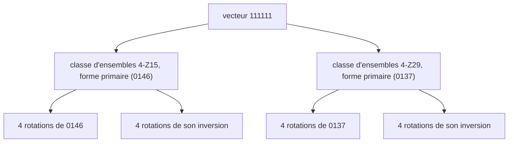

La leçon 2 a transformé un accord ou une gamme en nombre sur 12 bits. Cette leçon regroupe ces nombres. Si deux ensembles ont la même forme, déplacée ou mise en miroir, la théorie musicale les range dans une même **classe d'ensembles** (*set class*), et les 4096 ensembles se répartissent en 224 classes. [Guitar Alchemist](https://github.com/GuitarAlchemist/ga) (GA) repose sur ce regroupement : ses formes primaires, ses vecteurs d'intervalles et ses « familles modales » en découlent tous, et ses outils MCP s'en servent pour suggérer des accords de substitution. Le programme du cours recalcule tout cela à partir des définitions des manuels, pour les 4096 ensembles.

Tous les liens vers GA pointent sur le commit [`a826864`](https://github.com/GuitarAlchemist/ga/tree/a826864f3a012cad88e415954bf57eca0ce12aa6). Les sorties viennent de :

```bash
dotnet run --project code/music-theory-ga/GaTheory -c Release -- l4
```

## Transposition et inversion

### L'idée

Une triade de C majeur et une triade de D majeur sonnent de la même façon : mêmes intervalles, hauteur différente. C'est la **transposition** (leçon 2). Une triade de C majeur et une triade de F mineur ont aussi beaucoup en commun : les trois mêmes intervalles, empilés dans l'ordre inverse. Une triade majeure a une tierce majeure en bas et une tierce mineure en haut ; une triade mineure, l'inverse. Retourner un ensemble sur le cadran des classes de hauteurs, c'est l'**inversion** : chaque classe de hauteurs *n* devient −*n* mod 12, puis le résultat peut être transposé. Open Music Theory donne exactement cet exemple : I0 de C majeur `[0, 4, 7]` est F mineur `[5, 8, 0]` ([Open Music Theory, "Set Class and Prime Form"](https://viva.pressbooks.pub/openmusictheory/chapter/set-class-and-prime-form/)).

### La notation

**T*n*** transpose de *n* demi-tons ; **I*n*** inverse, puis transpose de *n*, donc I*n* envoie *x* sur *n* − *x* ([Open Music Theory, "Pitch-Class Sets, Normal Order, and Transformations"](https://viva.pressbooks.pub/openmusictheory/chapter/pc-sets-normal-order-and-transformations/)). Un ensemble entre crochets est ordonné, `[5, 8, 0]` ; le cours affiche de simples listes.

```text
== Transposition and inversion of a C major triad (0 4 7)
operation  course     GA         check
T2         2 6 9      2 6 9      ok
I0         0 5 8      0 5 8      ok
T2I        2 7 T      2 7 T      ok
```

T2 est D majeur (D F♯ A), I0 est F mineur (F A♭ C), et T2I, l'inversion puis T2, est G mineur (G B♭ D).

### Dans GA

`PitchClassSetId.Transpose` est la rotation de bits de la leçon 2 et `Inverse` le miroir de bits. [`TranspositionsAndInversions`](https://github.com/GuitarAlchemist/ga/blob/a826864f3a012cad88e415954bf57eca0ce12aa6/Common/GA.Domain.Core/Theory/Atonal/AtonalExtensions.cs#L28-L35) liste les 24 formes d'un ensemble, dont certaines coïncident pour les ensembles symétriques.

## Vecteurs d'intervalles

### L'idée

Compte chaque paire de notes d'un ensemble et range chaque paire selon sa classe d'intervalles, de 1 à 6 (leçon 1). Les six comptes forment le **vecteur d'intervalles** de l'ensemble (*interval-class vector*, ICV) : son contenu en intervalles, quels que soient l'ordre, l'octave ou l'orthographe de ses notes ([Open Music Theory, "Interval-Class Vectors"](https://viva.pressbooks.pub/openmusictheory/chapter/interval-class-vectors/)). Une triade de C majeur a une tierce mineure ou sixte majeure (ic3, E–G), une tierce majeure (ic4, C–E) et une quarte ou quinte (ic5, C–G) : `<001110>`. Un ensemble de *n* notes a *n*(*n* − 1)/2 paires, donc le vecteur d'une triade totalise 3 et celui d'un tétracorde 6.

Transposer un ensemble déplace toutes ses notes ensemble, et l'inverser retourne chaque intervalle, ce qui conserve sa classe d'intervalles. Tous les ensembles d'une classe d'ensembles ont donc le même vecteur. La réciproque n'est pas toujours vraie, comme le montre la relation Z plus bas.

### La notation

Le vecteur s'écrit entre chevrons, chiffre par chiffre quand chaque compte est inférieur à 10 : `<001110>`. Le cours affiche des espaces, `<0 0 1 1 1 0>`, parce qu'un ensemble de 11 notes a des comptes de 10.

```text
== Interval-class vectors
set                course               GA                   check
C major triad      <0 0 1 1 1 0>        <0 0 1 1 1 0>        ok
A minor triad      <0 0 1 1 1 0>        <0 0 1 1 1 0>        ok
C7                 <0 1 2 1 1 1>        <0 1 2 1 1 1>        ok
Cm7b5              <0 1 2 1 1 1>        <0 1 2 1 1 1>        ok
Cdim7              <0 0 4 0 0 2>        <0 0 4 0 0 2>        ok
C major scale      <2 5 4 3 6 1>        <2 5 4 3 6 1>        ok
11 pitch classes   <10 10 10 10 10 5>   <10 10 10 10 10 5>   ok
all 12             <12 12 12 12 12 6>   <1 1 1 1 0 6>        DIFF
```

Quelques points à lire dans ce tableau :

- C majeur et A mineur, ainsi que C7 et Cm7♭5, ont le même vecteur : ils sont l'inversion l'un de l'autre. Mets C7 en miroir (C E G B♭, 0 4 7 10) et tu obtiens 0 2 5 8, D F A♭ C, D demi-diminué.
- L'accord de septième diminuée n'est fait que de tierces mineures et de tritons : quatre ic3 et deux ic6.
- Le vecteur de la gamme majeure `<254361>` utilise six chiffres différents : chaque classe d'intervalles apparaît un nombre de fois différent. Wikipédia appelle cela la propriété de **gamme profonde** (*deep scale*), que « la gamme majeure et ses modes possèdent » ([Interval vector](https://en.wikipedia.org/wiki/Interval_vector)).

### Dans GA

- [`IntervalClassVector`](https://github.com/GuitarAlchemist/ga/blob/a826864f3a012cad88e415954bf57eca0ce12aa6/Common/GA.Domain.Core/Theory/Atonal/IntervalClassVector.cs#L36-L48) stocke les six comptes (celui de la gamme majeure est une constante nommée), et [`IsDeepScale`](https://github.com/GuitarAlchemist/ga/blob/a826864f3a012cad88e415954bf57eca0ce12aa6/Common/GA.Domain.Core/Theory/Atonal/IntervalClassVector.cs#L99) est la définition ci-dessus en une ligne de LINQ : `Vector.Values.Distinct().Count() == Vector.Values.Count()`.
- Pour utiliser un vecteur comme clé, [`IntervalClassVectorId`](https://github.com/GuitarAlchemist/ga/blob/a826864f3a012cad88e415954bf57eca0ce12aa6/Common/GA.Domain.Core/Theory/Atonal/IntervalClassVectorId.cs#L39-L85) range les six comptes dans un seul `int` comme chiffres en base 12 : la gamme majeure `<2 5 4 3 6 1>` s'écrit 608761 en base 12. Un chiffre en base 12 va jusqu'à 11, et la gamme chromatique a des comptes de 12 : ils débordent sur le chiffre suivant, et décoder l'identifiant donne `<1 1 1 1 0 6>`. C'est le seul ensemble touché, puisqu'un ensemble de 11 notes plafonne à 10.

## Formes primaires et numéros de Forte

### L'idée

Une classe d'ensembles a besoin d'un nom, et la convention est d'en choisir un membre, sa **forme primaire** (*prime form*). Mets d'abord l'ensemble dans l'**ordre normal**, sa rotation la plus compacte : celle dont l'écart entre la première et la dernière note est le plus petit. Fais ensuite de même pour son inversion, garde la plus compacte des deux, et transpose-la pour qu'elle commence sur 0. Les formes primaires s'écrivent entre parenthèses, sans virgules : C majeur et F mineur sont tous deux `(037)` ([Open Music Theory, "Set Class and Prime Form"](https://viva.pressbooks.pub/openmusictheory/chapter/set-class-and-prime-form/)).

Le catalogue d'Allen Forte de 1973 donne aussi à chaque classe un **numéro de Forte**, *cardinalité*-*index* : `(037)` est 3-11, la gamme majeure `(013568T)` 7-35. Un `Z` marque les classes qui partagent leur vecteur avec une autre classe.

L'ordre normal du cours départage les ex æquo comme le décrit Open Music Theory, par tassement ([`Theory.NormalOrder`](https://github.com/spareilleux/learn/blob/79d2198/code/music-theory-ga/GaTheory/Theory.cs#L145-L180)), puis vérifie son résultat contre 14 lignes recopiées du tableau des classes d'ensembles du livre ([`Lesson4.cs`](https://github.com/spareilleux/learn/blob/79d2198/code/music-theory-ga/GaTheory/Lesson4.cs#L9-L26)). Chaque ensemble est d'abord transposé de 5, pour qu'aucun des deux côtés ne puisse simplement renvoyer son entrée :

```text
== Prime forms and Forte numbers (each set transposed by 5 first)
table row        course                         GA                             check
(037) 3-11       (037) 3-11 <001110>            (037) 3-11 <001110>            ok
(0158) 4-20      (0158) 4-20 <101220>           (0158) 4-20 <101220>           ok
(0358) 4-26      (0358) 4-26 <012120>           (0358) 4-26 <012120>           ok
(0258) 4-27      (0258) 4-27 <012111>           (0258) 4-27 <012111>           ok
(0369) 4-28      (0369) 4-28 <004002>           (0369) 4-28 <004002>           ok
(0146) 4-Z15     (0146) 4-Z15 <111111>          (0146) 4-Z15 <111111>          ok
(0137) 4-Z29     (0137) 4-Z29 <111111>          (0137) 4-Z29 <111111>          ok
(01568) 5-20     (01568) 5-20 <211231>          (01568) 5-20 <211231>          ok
(023679) 6-Z29   (023679) 6-Z29 <224232>        (023679) 6-Z29 <224232>        ok
(014579) 6-31    (014579) 6-31 <223431>         (014579) 6-31 <223431>         ok
(02468T) 6-35    (02468T) 6-35 <060603>         (02468T) 6-35 <060603>         ok
(013568T) 7-35   (013568T) 7-35 <254361>        (013568T) 7-35 <254361>        ok
(0145679) 7-Z18  (0145679) 7-Z18 <434442>       (0145679) 7-Z18 <434442>       ok
(0125679) 7-20   (0125679) 7-20 <433452>        (0125679) 7-20 <433452>        ok
```

En termes d'accords : 4-20 est l'accord de septième majeure (C E G B depuis B : 0 1 5 8), 4-26 la septième mineure, 4-27 à la fois la septième de dominante et la septième demi-diminuée, 4-28 la septième diminuée, 6-35 la gamme par tons.

### Tassé à gauche ou à partir de la droite ?

« Le plus compact » laisse des ex æquo, et il y a deux façons de les départager. Forte tasse les notes **vers la gauche**, vers le début ; John Rahn, dont la version est « aujourd'hui généralement plus populaire », choisit la version « la plus dispersée à partir de la droite » ([List of set classes](https://en.wikipedia.org/wiki/List_of_set_classes)). Le programme applique les deux aux 4096 ensembles :

```text
== Packed from the right (Rahn) or to the left (Forte)?
set classes where the two packings disagree: 6
  Rahn (01568)         Forte (01378)
  Rahn (014579)        Forte (013589)
  Rahn (023679)        Forte (013689)
  Rahn (0125679)       Forte (0124789)
  Rahn (0145679)       Forte (0123589)
  Rahn (0134578T)      Forte (0124579T)
sets whose GA prime form is Rahn's: 4096 of 4096
```

Wikipédia compte 17 différences parmi les 352 classes sous la seule transposition ; une fois l'inversion prise en compte, le programme en trouve 6. Le tableau d'Open Music Theory utilise l'écriture de Rahn pour les cinq d'entre elles présentes dans les lignes ci-dessus (5-20, 6-Z29, 6-31, 7-Z18, 7-20), et GA aussi.

### Dans GA

GA ne trie pas du tout les rotations. [`PitchClassSetId.PrimeForm`](https://github.com/GuitarAlchemist/ga/blob/a826864f3a012cad88e415954bf57eca0ce12aa6/Common/GA.Domain.Core/Theory/Atonal/PitchClassSetId.cs#L123-L156) prend le **plus petit identifiant** parmi les 24 transpositions et inversions :

```csharp
for (var i = 0; i < 12; i++)
{
    var t = Transpose(i).Value;
    if (t < min) min = t;
    var ti = inverse.Transpose(i).Value;
    if (ti < min) min = ti;
}
```

Avec bit *n* = classe de hauteurs *n*, un petit identifiant évite les classes de hauteurs élevées, ce qui est exactement « dispersé à partir de la droite » : (01568) vaut 1 + 2 + 32 + 64 + 256 = 355, alors que le (01378) de Forte vaut 395. La dernière ligne de la sortie vérifie que le raccourci et l'algorithme de Rahn concordent sur chaque ensemble. C'est un joli compromis : une boucle de 24 itérations sur des entiers au lieu de trier des rotations, et une forme canonique qui sert aussi de clé de `Dictionary`.

- [`SetClass`](https://github.com/GuitarAlchemist/ga/blob/a826864f3a012cad88e415954bf57eca0ce12aa6/Common/GA.Domain.Core/Theory/Atonal/SetClass.cs#L136-L143) énumère les formes primaires distinctes de tous les ensembles.
- [`ForteCatalog.GetForteNumber`](https://github.com/GuitarAlchemist/ga/blob/a826864f3a012cad88e415954bf57eca0ce12aa6/Common/GA.Domain.Core/Theory/Atonal/ForteCatalog.cs#L30-L31) cherche la forme primaire dans [`CanonicalForteCatalog`](https://github.com/GuitarAlchemist/ga/blob/a826864f3a012cad88e415954bf57eca0ce12aa6/Common/GA.Domain.Core/Theory/Atonal/CanonicalForteCatalog.cs#L3-L20), un tableau texte des étiquettes de Forte pour les cardinalités 0 à 6, les autres étant déduites de leurs compléments. Son commentaire avertit que l'autre ordinal de GA, « programmatique », n'est pas la numérotation de Forte.

## Compter les classes d'ensembles

Combien y a-t-il de classes ? Une classe d'ensembles est une façon de placer des perles sur un cadran de 12 heures, à rotation et réflexion près : la combinatoire appelle cela un **bracelet**, et sans réflexion un **collier**. L'OEIS donne 224 bracelets binaires et 352 colliers binaires à 12 perles ([A000029](https://oeis.org/A000029), [A000031](https://oeis.org/A000031)).

```text
== Counting classes
equivalence            course GA     check
T and I (set classes)  224    224    ok
T only                 352    352    ok
```

Le [`TranspositionClass`](https://github.com/GuitarAlchemist/ga/blob/a826864f3a012cad88e415954bf57eca0ce12aa6/Common/GA.Domain.Core/Theory/Atonal/TranspositionClass.cs#L21-L25) de GA correspond au second compte, construit sur `TranspositionPrimeForm`, le plus petit identifiant parmi les 12 transpositions seulement. Le module Streeling [MUS-006](../../streeling/music/mus-006-the-scale-universe/) cite 224 pour les « cardinalités de 3 à 9 » ; ce nombre inclut toutes les cardinalités de 0 à 12.

## La relation Z

### L'idée

Deux ensembles peuvent avoir le même contenu en intervalles sans être transpositions ou inversions l'un de l'autre. L'exemple de Wikipédia est 4-Z15 `{0,1,4,6}` et 4-Z29 `{0,1,3,7}` : tous deux contiennent un intervalle de chaque classe, `<111111>`, « mais on ne peut pas transposer et/ou inverser l'un des ensembles sur l'autre » ([Interval vector](https://en.wikipedia.org/wiki/Interval_vector)). De telles paires sont **en relation Z**. Pour les ensembles de six notes, il existe une règle élégante : le complément d'un hexacorde Z est son partenaire Z (même article). Le module Streeling [MUS-002 · Au-delà de la tonalité](../../streeling/music/mus-002-beyond-tonality/) présente les vecteurs d'intervalles et la relation Z avec la même paire.

```text
== Z-relation: same vector, different set classes
set      course                       GA                           check
0146     <1 1 1 1 1 1> (0146) 4-Z15   <1 1 1 1 1 1> (0146) 4-Z15   ok
0137     <1 1 1 1 1 1> (0137) 4-Z29   <1 1 1 1 1 1> (0137) 4-Z29   ok
```

### Dans GA

C'est la relation Z qui rend la `ModalFamily` de GA (leçon 2) plus large que les rotations d'un ensemble. Une famille, ce sont tous les ensembles contenant 0 avec un vecteur donné. Le cours compte la même chose par force brute sur les 4096 ensembles et tombe d'accord avec GA ; le nombre de rotations est entre parenthèses :

```text
== Modal families: GA counts the sets containing 0 that share the vector
set (rotations)          course GA     check
major triad (3)          6      6      ok
dominant 7th (4)         8      8      ok
major scale (7)          7      7      ok
harmonic minor (7)       14     14     ok
0146 (4)                 16     16     ok
```

La famille de la triade majeure contient ses 3 rotations et les 3 de la triade mineure ; celle de la septième de dominante, aussi celles de la septième demi-diminuée. La gamme majeure est sa propre image miroir : 7. Le tétracorde à tous les intervalles `0146` rassemble 4 + 4 rotations de sa propre classe et 4 + 4 de 4-Z29. [`PitchClassSet.IsZRelated`](https://github.com/GuitarAlchemist/ga/blob/a826864f3a012cad88e415954bf57eca0ce12aa6/Common/GA.Domain.Core/Theory/Atonal/PitchClassSet.cs#L199-L211) est construit sur la même famille : il est vrai quand un membre ne fait pas partie des 24 transpositions et inversions du premier membre.



## Ce que GA fait des classes d'ensembles

### Accords de substitution

Le serveur MCP de GA a un outil, `ga_set_class_subs`, qui liste les accords d'un vocabulaire à 12 fondamentales appartenant à la même classe d'ensembles qu'un accord donné ([`ChordAtonalTool.GaSetClassSubs`](https://github.com/GuitarAlchemist/ga/blob/a826864f3a012cad88e415954bf57eca0ce12aa6/GaMcpServer/Tools/ChordAtonalTool.cs#L147-L192)). Le programme du cours lance la même recherche avec ses propres formes primaires et avec le `PrimeForm` de GA, sur douze types d'accords :

```text
== Same set class as Am, then G7, among 12 roots x 12 chord types
Am course: C Cm C# C#m D Dm Eb Ebm E Em F Fm F# F#m G Gm Ab Abm A Bb Bbm B Bm
Am GA:     C Cm C# C#m D Dm Eb Ebm E Em F Fm F# F#m G Gm Ab Abm A Bb Bbm B Bm
G7 course: C7 Cm7b5 C#7 C#m7b5 D7 Dm7b5 Eb7 Ebm7b5 E7 Em7b5 F7 Fm7b5 F#7 F#m7b5 Gm7b5 Ab7 Abm7b5 A7 Am7b5 Bb7 Bbm7b5 B7 Bm7b5
G7 GA:     C7 Cm7b5 C#7 C#m7b5 D7 Dm7b5 Eb7 Ebm7b5 E7 Em7b5 F7 Fm7b5 F#7 F#m7b5 Gm7b5 Ab7 Abm7b5 A7 Am7b5 Bb7 Bbm7b5 B7 Bm7b5
```

Toutes les triades majeures et mineures sont dans la classe de A mineur, comme le dit Open Music Theory des triades majeures et mineures ([Set Class and Prime Form](https://viva.pressbooks.pub/openmusictheory/chapter/set-class-and-prime-form/)). Dans cette session (2026-09-14, version du serveur non indiquée), l'outil MCP a donné exactement ces listes pour Am et pour G7, mais :

- sa description dit "Am and C are NOT equivalent, but Am and Em are", ce que contredisent sa propre réponse et la théorie ;
- il a affiché chaque accord sous un titre `[maj]`, `C7` et `Cm7b5` compris : [le regroupement](https://github.com/GuitarAlchemist/ga/blob/a826864f3a012cad88e415954bf57eca0ce12aa6/GaMcpServer/Tools/ChordAtonalTool.cs#L187-L190) prend le premier suffixe du vocabulaire par lequel le nom de l'accord se termine (`EndsWith`), et le premier suffixe est `""`, par lequel se termine toute chaîne.

L'équivalence de classe d'ensembles est une affirmation forte sur le contenu en intervalles, mais faible sur l'harmonie : G7 et Gm7♭5 partagent une classe, pas une fonction. Traite les "deepest substitutions" de l'outil comme des candidates à écouter.

### Voisins par vecteur d'intervalles

`ga_icv_neighbors` cherche les ensembles dont le vecteur est proche de celui d'un accord : [`GrothendieckService.FindNearby`](https://github.com/GuitarAlchemist/ga/blob/a826864f3a012cad88e415954bf57eca0ce12aa6/Common/GA.Domain.Services/Atonal/Grothendieck/GrothendieckService.cs#L45-L90) parcourt les 4096 ensembles et garde ceux qui sont à une distance L1 donnée, la somme des différences absolues des six comptes. Interrogé sur les voisins de C à distance 1, l'outil a renvoyé douze lignes, toutes identiques :

```text
ICV neighbors of C (ICV <0 0 1 1 1 0>, dist ≤ 1):
  <0 0 1 1 1 0>  Δ=1  Forte:3-11 [Major Triad]
  <0 0 1 1 1 0>  Δ=1  Forte:3-11 [Major Triad]
  ...
```

Le vecteur d'une triade totalise toujours 3, donc une autre triade diffère d'au moins 2, jamais de 1. L'explication se trouve dans [`GrothendieckDelta.FromIcVs`](https://github.com/GuitarAlchemist/ga/blob/a826864f3a012cad88e415954bf57eca0ce12aa6/Common/GA.Domain.Services/Atonal/Grothendieck/GrothendieckDelta.cs#L113-L134) : quand deux ensembles différents partagent un vecteur, la différence est fixée à `Ic1 = 1` exprès, "to preserve musical differentiation expected by callers/tests". « Distance 1 » signifie donc « même vecteur » : les 24 triades majeures et mineures (l'outil garde les 12 premières), et l'étiquette `Major Triad` est cherchée à partir du vecteur, si bien qu'elle nomme aussi les mineures.

## Exercices

1. Calcule le vecteur d'intervalles et la forme primaire de la gamme pentatonique mineure de C, 0 3 5 7 10.
2. Cmaj7 et Am7 ont trois notes en commun. Sont-ils dans la même classe d'ensembles ?
3. Trouve le partenaire Z de 6-Z29 `(023679)`.

<details>
<summary>Solutions</summary>

1. Dix paires : aucun demi-ton, trois tons (E♭–F, F–G, B♭–C), deux tierces mineures (C–E♭, G–B♭), une tierce majeure (E♭–G), quatre quartes ou quintes et aucun triton : `<032140>`. La forme primaire est `(02479)`, 5-35, la classe de toutes les gammes pentatoniques. Les cordes à vide d'une guitare, E A D G B, en font aussi partie : pentatonique majeure de G. MUS-002 en déduit `[0,2,5,7,9]`, une rotation du même ensemble, mais pas sa forme primaire : son départage compare les classes de hauteurs 4 et 9 au lieu des intervalles.
2. Non. Cmaj7 est `(0158)`, 4-20, et Am7 (A C E G) est `(0358)`, 4-26. Am7 a les mêmes notes que C6, pas que Cmaj7.
3. Le programme cherche l'autre classe de vecteur `<224232>` : `(014679)`, 6-Z50. D'après la règle de Wikipédia, c'est aussi le complément de 6-Z29 : 1 4 5 8 10 11 a cette forme primaire.

```text
== Exercise solutions
question             course                     GA                         check
1. minor pentatonic  <0 3 2 1 4 0> (02479)      <0 3 2 1 4 0> (02479)      ok
2. Cmaj7 vs Am7      (0158) (0358)              (0158) (0358)              ok
3. partner of 6-Z29  (014679) 6-Z50             (014679) 6-Z50             ok
```

Côté GA, le partenaire est l'entrée de `SetClass.Items` qui a le même vecteur et une forme primaire différente ([`Lesson4.cs`](https://github.com/spareilleux/learn/blob/79d2198/code/music-theory-ga/GaTheory/Lesson4.cs#L144-L161)).

</details>

## À retenir

- Une classe d'ensembles est un ensemble à transposition et inversion près ; 4096 ensembles forment 224 classes (352 sans l'inversion), les bracelets et les colliers à 12 perles.
- Le vecteur d'intervalles compte les paires de notes par classe d'intervalles. Une classe d'ensembles a un seul vecteur ; un vecteur peut avoir deux classes, c'est la relation Z.
- Une forme primaire est une convention de nommage. Forte et Rahn départagent les ex æquo différemment sur 6 classes ; Open Music Theory et GA utilisent Rahn, et GA l'obtient comme l'identifiant sur 12 bits minimal, une astuce à retenir.
- Les familles modales de GA, `IsZRelated` et les outils de substitution s'appuient tous sur le vecteur ou la forme primaire, donc ils héritent de ces équivalences : pour eux, C et Am sont « pareils », et un vecteur identique est signalé à distance 1.
- La théorie et le cœur de GA concordent sur chaque compte ici ; les désaccords sont dans les encodages (un identifiant en base 12), les étiquettes et la sortie des outils.

## Sources

- Mark Gotham et al., [*Open Music Theory*](https://viva.pressbooks.pub/openmusictheory/), version 2, 2023, [CC BY-SA 4.0](https://creativecommons.org/licenses/by-sa/4.0/) : chapitres [Pitch-Class Sets, Normal Order, and Transformations](https://viva.pressbooks.pub/openmusictheory/chapter/pc-sets-normal-order-and-transformations/), [Set Class and Prime Form](https://viva.pressbooks.pub/openmusictheory/chapter/set-class-and-prime-form/) (avec son tableau des classes d'ensembles), [Interval-Class Vectors](https://viva.pressbooks.pub/openmusictheory/chapter/interval-class-vectors/).
- [List of set classes](https://en.wikipedia.org/wiki/List_of_set_classes) (formes primaires de Forte et de Rahn) et [Interval vector](https://en.wikipedia.org/wiki/Interval_vector) (relation Z, propriété de gamme profonde), Wikipédia.
- OEIS [A000029](https://oeis.org/A000029) (bracelets) et [A000031](https://oeis.org/A000031) (colliers).
- GuitarAlchemist/ga au commit [`a826864`](https://github.com/GuitarAlchemist/ga/tree/a826864f3a012cad88e415954bf57eca0ce12aa6/Common/GA.Domain.Core) : `Theory/Atonal` (`PitchClassSetId.cs`, `PitchClassSet.cs`, `IntervalClassVector.cs`, `IntervalClassVectorId.cs`, `SetClass.cs`, `ForteCatalog.cs`, `CanonicalForteCatalog.cs`, `TranspositionClass.cs`), `GA.Domain.Services/Atonal/Grothendieck`, `GaMcpServer/Tools/ChordAtonalTool.cs`.
