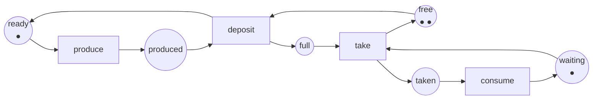
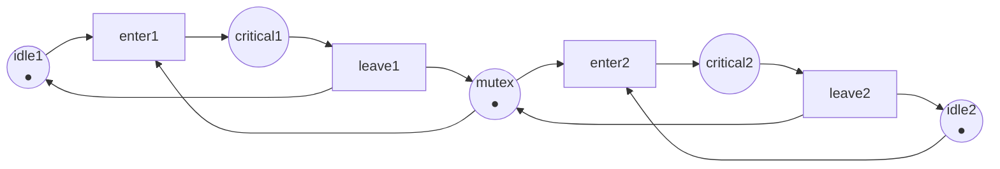

Code complet : [`code/petri-nets`](https://github.com/spareilleux/learn/tree/main/code/petri-nets). Cette leçon est imprimée par `dotnet run --project Examples -c Release -- l1`, et sa sortie est comparée à [`expected/l1.txt`](https://github.com/spareilleux/learn/blob/main/code/petri-nets/expected/l1.txt) par [`check.sh`](https://github.com/spareilleux/learn/blob/main/code/petri-nets/check.sh). Sous Windows, lancez `check.sh` depuis Git Bash ; tout le reste est du `dotnet` ordinaire.

## Le problème qu'une machine à états ne modélisera pas

Voici un tampon borné avec un producteur et un consommateur, la forme de tous les [`Channel<T>`](https://learn.microsoft.com/dotnet/api/system.threading.channels.channel-1) et de toutes les [`ArrayBlockingQueue`](https://docs.oracle.com/en/java/javase/21/docs/api/java.base/java/util/concurrent/ArrayBlockingQueue.html) que vous avez écrits :

```csharp
// Deux fils d'exécution, une file de deux emplacements. Quels sont les états de ce système ?
var buffer = Channel.CreateBounded<Item>(2);

// fil du producteur
while (true)
{
    var item = Produce();               // prend du temps
    await buffer.Writer.WriteAsync(item); // bloque quand le tampon est plein
}

// fil du consommateur
while (true)
{
    var item = await buffer.Reader.ReadAsync(); // bloque quand le tampon est vide
    Consume(item);                              // prend du temps
}
```

Essayez de dessiner cela comme une machine à états. Le producteur a deux états, « sur le point de produire » et « tenant un article qu'il n'a pas déposé ». Le consommateur en a deux. Le tampon en a trois, parce qu'il contient zéro, un ou deux articles. Une machine à états a un seul état courant, il lui faut donc un état par combinaison : 2 × 2 × 3 = 12, et chaque transition doit être tracée depuis chaque état où elle s'applique. Ajoutez un deuxième producteur et le dessin devient inutilisable.

Le problème n'est pas le dessin. C'est que l'état de ce système n'est pas un point. C'est une *distribution* : certaines choses sont ici, d'autres sont là, et plusieurs d'entre elles bougent indépendamment. Une machine à états ne peut dire que « le système est dans l'état S ». Je veux dire « le producteur tient un article, un emplacement est pris, un emplacement est libre, et le consommateur attend » — quatre faits vrais en même temps et qui changent à des moments différents.

Un réseau de Petri dit exactement cela. Il a été introduit par [Carl Adam Petri](https://www.informatik.uni-hamburg.de/TGI/PetriNets/history/) dans sa thèse de 1962, *Kommunikation mit Automaten*, et la définition ci-dessous est celle que Murata donne dans son article de synthèse de 1989 (section II).

## Places, transitions, arcs, jetons

Un réseau de Petri a deux sortes de nœuds, et rien d'autre :

- une **place**, dessinée comme un cercle, est une condition ou un contenant : « le producteur est prêt », « un emplacement est libre ». Une place contient un nombre de **jetons**, dessinés comme des points ;
- une **transition**, dessinée comme une barre ou un rectangle, est un événement : « produire », « déposer » ;
- un **arc** va d'une place à une transition, ou d'une transition à une place, jamais entre deux nœuds de même sorte. Un arc porte un **poids**, qui vaut 1 s'il n'est pas écrit.

Les jetons, place par place, forment le **marquage**. Le marquage est l'état de tout le réseau, et le marquage initial s'écrit M0. Voici le tampon borné en réseau :



Six places, quatre transitions, douze arcs. Les noms restent en anglais dans les trois langues : ils font partie de la sortie du programme, comparée par `check.sh`. Le producteur est le jeton qui se déplace entre `ready` et `produced` ; le consommateur est le jeton qui se déplace entre `waiting` et `taken` ; le tampon, ce sont deux jetons partagés entre `free` et `full`. Cette dernière paire mérite qu'on s'y arrête : **un emplacement libre est un jeton lui aussi**. `free` contient les emplacements que personne n'a encore remplis, et c'est la seule raison pour laquelle le producteur peut être arrêté.

L'analyseur imprime le même réseau en texte :

```
== The net ==
net producer-consumer
places      ready produced free full waiting taken
transitions produce deposit take consume
M0          (1, 0, 2, 0, 1, 0) = ready:1 free:2 waiting:1
arc         ready -> produce
arc         produce -> produced
arc         produced -> deposit
arc         free -> deposit
arc         deposit -> full
arc         deposit -> ready
arc         full -> take
arc         waiting -> take
arc         take -> taken
arc         take -> free
arc         taken -> consume
arc         consume -> waiting
```

Le marquage `(1, 0, 2, 0, 1, 0)` est un vecteur, une entrée par place, dans l'ordre où les places sont listées. Cet ordre ne change jamais, et toute la leçon 2 repose dessus.

## La règle de tir

Voici toute la sémantique, et elle tient en deux phrases.

> Une transition est **sensibilisée** à un marquage quand chaque place ayant un arc vers elle contient au moins le poids de cet arc.
> Tirer une transition sensibilisée retire ces jetons de ses places d'entrée et ajoute, à chaque place de sortie, le poids de l'arc qui y mène. Les deux se produisent en même temps.

Rien ne dit *quelle* transition sensibilisée est tirée, ni quand. Un réseau de Petri n'ordonnance pas ; il décrit ce qui est possible. C'est pour cela qu'il peut répondre à « est-ce que cela peut arriver un jour » — la réponse couvre tous les ordonnancements à la fois.

En C# la règle fait quatre lignes, et c'est tout ce sur quoi repose le reste de [`PetriNet.cs`](https://github.com/spareilleux/learn/blob/main/code/petri-nets/PetriNets/PetriNet.cs) :

```csharp
/// <summary>Vrai quand chaque place d'entrée de la transition contient au moins le poids de l'arc.</summary>
public bool IsEnabled(Marking marking, int transition)
{
    for (var p = 0; p < Places.Count; p++)
    {
        if (marking[p] != Marking.Omega && marking[p] < Pre[p, transition]) return false;
    }
    return true;
}

public Marking Fire(Marking marking, int transition)
{
    if (!IsEnabled(marking, transition))
        throw new InvalidOperationException($"Transition {Transitions[transition].Name} is not enabled at {marking}.");
    var next = marking.ToArray();
    for (var p = 0; p < Places.Count; p++)
        next[p] = Marking.Add(next[p], Post[p, transition] - Pre[p, transition]);
    return new Marking(next);
}
```

`Pre[p, t]` est ce que le tir de `t` prend à `p`, `Post[p, t]` est ce qu'il rend. La leçon 2 donne à ces deux matrices un nom et un usage. `Marking.Omega` est une valeur sentinelle dont seule la leçon 3 a besoin ; ignorez-la pour l'instant.

Au marquage initial, une seule transition est sensibilisée, parce que le consommateur n'a rien à prendre et le producteur rien à déposer :

```
== Enabled at the initial marking ==
produce
```

Un aller-retour complet déplace les jetons et revient à son point de départ :

```
== One round trip: produce, deposit, take, consume ==
          (1, 0, 2, 0, 1, 0)  ready:1 free:2 waiting:1
produce   (0, 1, 2, 0, 1, 0)  produced:1 free:2 waiting:1
deposit   (1, 0, 1, 1, 1, 0)  ready:1 free:1 full:1 waiting:1
take      (1, 0, 2, 0, 0, 1)  ready:1 free:2 taken:1
consume   (1, 0, 2, 0, 1, 0)  ready:1 free:2 waiting:1
```

Lisez `deposit` attentivement. Il prend un jeton à `produced` **et** un à `free`, et il en met un dans `full` **et** un de retour dans `ready`. Un événement, quatre places touchées, atomiquement. Un arc de machine à états ne peut pas faire cela : il change un état courant en un autre.

## La contre-pression, dessinée

Remplissez maintenant le tampon et regardez le producteur s'arrêter :

```
== Filling the buffer: the producer is stopped by the empty place free ==
          (1, 0, 2, 0, 1, 0)  ready:1 free:2 waiting:1
produce   (0, 1, 2, 0, 1, 0)  produced:1 free:2 waiting:1
deposit   (1, 0, 1, 1, 1, 0)  ready:1 free:1 full:1 waiting:1
produce   (0, 1, 1, 1, 1, 0)  produced:1 free:1 full:1 waiting:1
deposit   (1, 0, 0, 2, 1, 0)  ready:1 full:2 waiting:1
enabled now: produce take
after produce: (0, 1, 0, 2, 1, 0) produced:1 full:2 waiting:1
enabled now: take
deposit enabled: False  (free holds 0 tokens)
```

Le producteur peut encore `produce` — il peut tenir un article dans la main — mais `deposit` n'est pas sensibilisée, parce que `free` est vide. C'est `WriteAsync` qui bloque, et ce n'est pas une règle spéciale dont le modèle aurait eu besoin : cela découle de la règle de tir appliquée à une place vide.

C'est la première chose que le réseau vous achète. Dans le code C#, la contre-pression est une propriété de l'implémentation de `Channel`, documentée en prose et observée à l'exécution. Dans le réseau, c'est un nombre de jetons, et un programme peut le vérifier.

## Deux choses à la fois

Le consommateur qui prend un article et le producteur qui produit le suivant sont indépendants. Rien dans le réseau ne fait attendre l'un pour l'autre, et le marquage auquel ils arrivent est le même quel que soit celui qui tire en premier :

```
== Concurrency: produce and take do not compete, and the order does not matter ==
from (1, 0, 1, 1, 1, 0) ready:1 free:1 full:1 waiting:1
produce then take: (0, 1, 2, 0, 0, 1)
take then produce: (0, 1, 2, 0, 0, 1)
same marking: True
```

Deux transitions sensibilisées qui n'ont aucune place d'entrée en commun sont **concurrentes** : elles peuvent tirer dans n'importe quel ordre, ou, si vous préférez, en même temps. Deux transitions sensibilisées qui partagent une place d'entrée ne contenant assez de jetons que pour l'une d'elles sont en **conflit** : tirer l'une désensibilise l'autre. La leçon 4 transforme cette distinction en la propriété appelée persistance, et la leçon 7 montre que le conflit est exactement l'endroit où vit un verrou.

## Ce que coûte le modèle

Le réseau a six places et quatre transitions. Ses marquages accessibles sont au nombre de douze — le 2 × 2 × 3 du début de cette leçon :

```
== A state machine would need one state per combination ==
markings of this net: 12
tokens in the net: 4
```

La machine à états n'a donc pas tort, elle est seulement la forme *dépliée*. Le réseau est la forme compressée, et c'est dans la compression qu'est le levier : le dessin a 10 nœuds et 12 arcs là où la machine à états a 12 états et 20 arêtes, et il garde sa taille quand on ajoute un deuxième producteur, là où la machine à états multiplie.

La seconde ligne est un cadeau. Le nombre total de jetons ne change jamais, dans aucun des douze marquages, parce que chaque transition de ce réseau prend exactement autant de jetons qu'elle en rend. La leçon 5 appelle cela un invariant de places et le prouve sans rien énumérer.

## Le même réseau en fichier

Les réseaux s'échangent entre outils sous forme de [PNML](https://www.pnml.org/), un format XML normalisé par [ISO/IEC 15909-2:2011](https://www.iso.org/standard/43538.html). L'analyseur l'écrit, et `check.sh` compare ce qu'il écrit avec les fichiers de [`nets/`](https://github.com/spareilleux/learn/tree/main/code/petri-nets/nets), de sorte que le réseau de l'image et le réseau du fichier ne peuvent pas diverger :

```xml
<?xml version="1.0" encoding="utf-8"?>
<pnml xmlns="http://www.pnml.org/version-2009/grammar/pnml">
  <net id="n1" type="http://www.pnml.org/version-2009/grammar/ptnet">
    <name>
      <text>producer-consumer</text>
    </name>
    <page id="page1">
      <place id="ready">
        <name>
          <text>ready</text>
        </name>
        <initialMarking>
          <text>1</text>
        </initialMarking>
      </place>
      <place id="produced">
        <name>
          <text>produced</text>
        </name>
      </place>
      <!-- free, full, waiting, taken suivent, puis les transitions -->
      <transition id="produce">
        <name>
          <text>produce</text>
        </name>
      </transition>
      <arc id="a1" source="ready" target="produce" />
      <arc id="a2" source="produce" target="produced" />
    </page>
  </net>
</pnml>
```

Le fichier entier est [`nets/producer-consumer.pnml`](https://github.com/spareilleux/learn/blob/main/code/petri-nets/nets/producer-consumer.pnml). L'attribut de type dit de quelle sorte de réseau il s'agit : `ptnet` est le réseau place/transition de cette leçon. La leçon 8 rencontre un autre type, et la leçon 11 rencontre les outils qui les lisent.

## Points clés

- Une place est une condition ou un contenant, une transition est un événement, et les jetons dans les places forment le marquage. Le marquage est un vecteur, pas un état unique.
- Une transition est sensibilisée quand chacune de ses places d'entrée contient au moins le poids de l'arc, et le tir consomme et produit en une seule étape.
- Le réseau ne dit jamais quelle transition sensibilisée tire. Ce silence est ce qui permet à un seul modèle de couvrir tous les entrelacements.
- Une place vide est un événement bloqué. Un tampon borné se modélise par une place contenant ses emplacements libres, et la contre-pression n'a besoin d'aucune règle supplémentaire.
- Deux transitions sensibilisées qui ne partagent aucune place d'entrée sont concurrentes, et les tirer dans l'un ou l'autre ordre mène au même marquage. Deux qui se disputent les mêmes jetons sont en conflit.
- Un réseau est la forme compressée de la machine à états que vous auriez dessinée sinon, et la compression grandit avec le nombre de composants indépendants.

## Exercices

1. Dans le réseau ci-dessus, retirez la place `free` et ses deux arcs. Quelle transition n'est plus contrainte, et qu'est-ce que cela signifie pour le tampon ?
2. Modélisez un verrou : deux fils d'exécution, chacun avec une place `idle` et une place `critical`, partageant une place `mutex` contenant un jeton. Quelles deux transitions sont en conflit, et à quel marquage ?
3. Donnez au réseau ci-dessus un tampon d'un seul emplacement au lieu de deux, en changeant un nombre. Combien a-t-il de marquages maintenant ? Vérifiez avec l'analyseur.
4. L'arc de `deposit` vers `ready` remet le producteur au travail. Que voudrait dire le réseau si cet arc manquait ?

<details>
<summary>Solutions</summary>

**1.** `deposit` n'est plus contrainte : il lui suffit d'un jeton dans `produced`. Le producteur peut alors déposer indéfiniment sans que le consommateur ne prenne quoi que ce soit, donc `full` grandit sans limite et l'ensemble des marquages accessibles devient infini. C'est le réseau [`UnboundedProducer`](https://github.com/spareilleux/learn/blob/main/code/petri-nets/Examples/Nets.cs) dans le code, et la leçon 3 porte sur ce qu'on peut encore en dire.

**2.** Le réseau est [`MutualExclusion`](https://github.com/spareilleux/learn/blob/main/code/petri-nets/Examples/Nets.cs) :



`enter1` et `enter2` sont en conflit au marquage initial `(1, 0, 1, 0, 1)` : les deux sont sensibilisées, les deux ont besoin de l'unique jeton de `mutex`, et tirer l'une désensibilise l'autre. C'est le verrou. La leçon 4 vérifie que les deux fils ne sont jamais tous les deux dans leur section critique, et la leçon 5 le prouve avec un invariant au lieu d'une recherche.

**3.** Passez le marquage initial de `free` de 2 à 1. L'analyseur donne la réponse dans le tableau de croissance de la leçon 3 : 8 marquages au lieu de 12. Le producteur, le consommateur et le tampon ont maintenant 2 × 2 × 2 combinaisons.

**4.** Sans l'arc `deposit -> ready`, le jeton qui représente le producteur serait consommé par `deposit` et ne reviendrait jamais. `produce` tirerait une fois, `deposit` une fois, et la moitié « producteur » du réseau serait alors morte pour toujours, pendant que le consommateur viderait l'unique article et s'arrêterait. La leçon 4 donne un nom à cette panne : la transition `produce` serait *L1-vivante* — capable de tirer une fois — au lieu d'être vivante.

</details>

## Sources

- Tadao Murata, *Petri nets: Properties, analysis and applications*, **Proceedings of the IEEE** 77(4), avril 1989, pages 541–580, [doi:10.1109/5.24143](https://doi.org/10.1109/5.24143). La section II définit les places, les transitions, les arcs, les marquages et la règle de tir utilisés ici.
- Wolfgang Reisig, *Understanding Petri Nets*, Springer, 2013, [doi:10.1007/978-3-642-33278-4](https://doi.org/10.1007/978-3-642-33278-4).
- [Petri Nets World](https://www.informatik.uni-hamburg.de/TGI/PetriNets/) et sa [page d'histoire](https://www.informatik.uni-hamburg.de/TGI/PetriNets/history/), pour la thèse de 1962 de Carl Adam Petri.
- [PNML](https://www.pnml.org/) et [ISO/IEC 15909-2:2011](https://www.iso.org/standard/43538.html), *Systems and software engineering — High-level Petri nets — Part 2: Transfer format*.
- [`Channel<T>`](https://learn.microsoft.com/dotnet/api/system.threading.channels.channel-1) et [`ArrayBlockingQueue`](https://docs.oracle.com/en/java/javase/21/docs/api/java.base/java/util/concurrent/ArrayBlockingQueue.html), les deux tampons bornés que cette leçon modélise.
