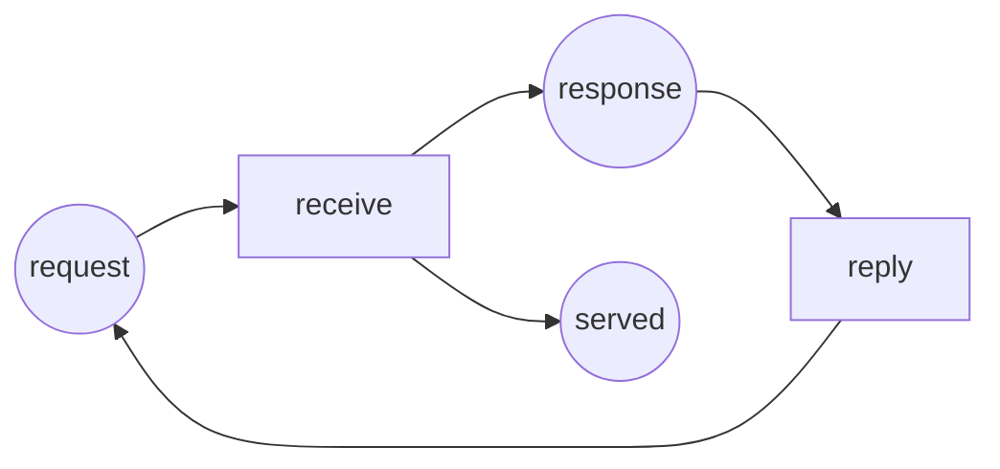

Code complet : [`code/petri-nets`](https://github.com/spareilleux/learn/tree/main/code/petri-nets). Cette leçon est imprimée par `dotnet run --project Examples -c Release -- l2`, comparée à [`expected/l2.txt`](https://github.com/spareilleux/learn/blob/main/code/petri-nets/expected/l2.txt).

La leçon 1 a dessiné un réseau et l'a tiré. Cette leçon écrit la même chose en nombres, parce qu'une image ne se donne pas à un programme, et parce qu'un produit matriciel remplace toute une séquence de tir.

## La définition

Un **réseau place/transition** est un tuple *N* = (*P*, *T*, *F*, *W*, *M0*) où

- *P* est un ensemble fini de places et *T* un ensemble fini de transitions, *P* et *T* étant disjoints et non tous deux vides ;
- *F* ⊆ (*P* × *T*) ∪ (*T* × *P*) est l'ensemble des arcs — d'une place vers une transition ou d'une transition vers une place, jamais entre deux nœuds de même sorte ;
- *W* : *F* → {1, 2, 3, …} donne à chaque arc un poids positif ;
- *M0* : *P* → {0, 1, 2, …} est le marquage initial.

C'est la définition de Murata (1989, section II-A), et c'est ce que stocke [`PetriNet.cs`](https://github.com/spareilleux/learn/blob/main/code/petri-nets/PetriNets/PetriNet.cs) : une liste de places, une liste de transitions, une liste d'arcs pondérés et un marquage. Un marquage est un vecteur de ℕ^|*P*|, et fixer une fois pour toutes l'ordre des places est ce qui permet de l'écrire `(1, 0, 2, 0, 1, 0)`.

## Trois matrices

Au lieu de garder les arcs sous forme de liste, mettez-les dans deux tableaux indexés par place et par transition :

- **Pre**[*p*, *t*] est le poids de l'arc de *p* vers *t*, ou 0 quand il n'y en a pas : ce que le tir de *t* **prend** à *p* ;
- **Post**[*p*, *t*] est le poids de l'arc de *t* vers *p* : ce que le tir de *t* **donne** à *p*.

L'analyseur les imprime pour le producteur et le consommateur de la leçon 1 :

```
Pre (tokens a firing takes from the place)
          produce deposit    take consume
ready           1       0       0       0
produced        0       1       0       0
free            0       1       0       0
full            0       0       1       0
waiting         0       0       1       0
taken           0       0       0       1
Post (tokens a firing puts into the place)
          produce deposit    take consume
ready           0       1       0       0
produced        1       0       0       0
free            0       0       1       0
full            0       1       0       0
waiting         0       0       0       1
taken           0       0       1       0
```

La règle de tir de la leçon 1 se lit directement dessus. La transition *t* est sensibilisée à *M* quand *M* ≥ **Pre**[·, *t*] place par place ; la tirer donne *M*′ = *M* − **Pre**[·, *t*] + **Post**[·, *t*].

Comme la soustraction et l'addition vont toujours ensemble, la différence mérite un nom. La **matrice d'incidence** est

> *C* = **Post** − **Pre**

et sa colonne *t* est le changement de marquage que produit le tir de *t* :

```
C = Post - Pre (change of marking per firing)
          produce deposit    take consume
ready          -1       1       0       0
produced        1      -1       0       0
free            0      -1       1       0
full            0       1      -1       0
waiting         0       0      -1       1
taken           0       0       1      -1
```

Lisez la colonne `deposit` de haut en bas : −1 dans `produced`, −1 dans `free`, +1 dans `full`, +1 dans `ready`. Un événement, quatre places, dans une seule colonne. Lisez la même colonne dans l'impression que l'analyseur donne transition par transition :

```
== One firing as a column of C ==
produce    -1  1  0  0  0  0
deposit     1 -1 -1  1  0  0
take        0  0  1 -1 -1  1
consume     0  0  0  0  1 -1
```

Ici, chaque colonne somme à zéro, ce qui est la forme numérique de « ce réseau ne crée ni ne détruit de jetons ». La leçon 1 avait remarqué que le total valait toujours 4 ; ici on voit pourquoi, une transition à la fois.

**Ce que *C* jette.** La matrice d'incidence connaît la *différence*, pas les deux moitiés. Une boucle propre — un arc *p* → *t* et un arc *t* → *p* — contribue 0 à *C*, exactement comme s'il n'y avait pas d'arc du tout, alors qu'elle change le moment où *t* est sensibilisée. Les réseaux sans boucle propre sont dits *purs*, et tout ce qui repose sur *C* seule s'y applique sans note de bas de page. Les réseaux de ce cours sont purs ; l'analyseur garde quand même **Pre** et **Post** séparément, parce que la règle de tir a besoin de **Pre**.

## L'équation d'état

Supposons qu'une séquence de transitions σ tire depuis *M0* et atteigne *M*. Comptez combien de fois chaque transition apparaît dans σ et mettez ces comptes dans un vecteur *x* — son **vecteur de comptes de tir**, aussi appelé vecteur de Parikh de σ. Chaque tir ajoute sa colonne de *C*, donc en additionnant le tout :

> *M* = *M0* + *C* · *x*

C'est l'**équation d'état** (Murata 1989, section V-A). La preuve tient en une ligne de récurrence : tirer *t* à *M* donne *M* + *C*[·, *t*], donc après σ le marquage est *M0* plus la somme des colonnes, c'est-à-dire *C* · *x*.

Sur une séquence réelle, l'équation et la règle de tir sont d'accord :

```
== The state equation on a real sequence ==
sequence  produce deposit produce take
x         (2, 1, 1, 0)   in the order produce deposit take consume
M0        (1, 0, 2, 0, 1, 0)
M0 + C x  (0, 1, 2, 0, 0, 1)
fired     (0, 1, 2, 0, 0, 1)
```

Remarquez ce que l'équation ne contient *pas* : l'ordre. Deux séquences avec les mêmes comptes aboutissent au même marquage, et l'équation ne sait pas les distinguer :

```
== The same x in a different order ==
produce deposit take produce -> (0, 1, 2, 0, 0, 1)
same marking: True
```

C'est une qualité quand on la veut — toute une famille d'entrelacements se réduit à un seul fait arithmétique — et un piège quand on l'oublie, ce qui fait le reste de cette leçon.

Le C# est aussi court que les mathématiques ([`StateEquation.cs`](https://github.com/spareilleux/learn/blob/main/code/petri-nets/PetriNets/StateEquation.cs)) :

```csharp
public static int[] Apply(PetriNet net, Marking start, int[] firingCount)
{
    var c = net.Incidence();
    var result = start.ToArray();
    for (var p = 0; p < net.Places.Count; p++)
        for (var t = 0; t < net.Transitions.Count; t++)
            result[p] += c[p, t] * firingCount[t];
    return result;
}
```

Le type de retour est `int[]`, pas `Marking` : des entrées peuvent sortir négatives, et une entrée négative est la façon qu'a l'équation de dire qu'aucun ordre de ces tirs ne fonctionne.

## Nécessaire, pas suffisante

Donc si *M* est accessible depuis *M0*, alors *M* = *M0* + *C* · *x* a une solution *x* à entrées entières positives ou nulles. L'équation est une condition **nécessaire**, et cela seul est utile : pas de solution signifie pas de séquence, prouvé par l'arithmétique, sans aucune recherche.

La réciproque est fausse, et voici un réseau qui le montre. Deux services se repassent un jeton : `receive` transforme une requête en réponse et compte un échange terminé dans `served`, `reply` retransforme la réponse en requête. Personne n'a envoyé la première requête, donc `request` commence vide.



Sa matrice d'incidence a trois lignes et deux colonnes :

```
C = Post - Pre (change of marking per firing)
          receive   reply
request        -1       1
response        1      -1
served          1       0
```

Rien n'est sensibilisé à `(0, 0, 0)` : `receive` veut un jeton dans `request`, `reply` en veut un dans `response`, et il n'y en a aucun. Le réseau a exactement un marquage accessible, et c'est un marquage mort :

```
reachability graph of handshake: 1 state, 0 firings
places request response served
  M0 = (0, 0, 0)  (empty)
  dead marking M0 = (0, 0, 0)  (empty)
```

Demandez maintenant à l'équation si un échange aurait pu être servi, c'est-à-dire si `(0, 0, 1)` est accessible. Prenez *x* = (1, 1) : `receive` une fois et `reply` une fois. Dans `request` cela fait −1 + 1 = 0, dans `response` +1 − 1 = 0, dans `served` +1 + 0 = 1. Les comptes tombent juste :

```
target    (0, 0, 1)  served:1
solution  x = (1, 1)   in the order receive reply
reachable: False
spurious markings up to 2 tokens: (0, 0, 1) (0, 0, 2)
```

La dernière ligne vient d'une recherche exhaustive dans l'analyseur : il énumère tous les marquages d'au plus deux jetons, garde ceux que le graphe d'accessibilité ne contient pas, et interroge l'équation sur chacun. Deux marquages passent l'équation et sont inaccessibles. On les appelle des **solutions parasites**, et la raison est visible dans l'histoire : l'équation laisse `receive` emprunter le jeton que `reply` ne produira que plus tard. Tirer est un ordonnancement ; l'équation est un audit de fin d'année.

L'équation d'état vous donne donc une moitié propre de la réponse :

- pas de solution entière positive ou nulle ⟹ **inaccessible**, prouvé ;
- une solution existe ⟹ **peut-être accessible**, et il faut encore aller voir.

*À vérifier : Murata indique (1989, section V-A) que pour certaines classes de réseaux — les réseaux acycliques en particulier — l'équation d'état est à la fois nécessaire et suffisante. Je n'ai pas pu lire l'article lui-même, seulement des sources secondaires, et je ne l'affirme donc pas ici ; la recherche de solutions parasites de l'analyseur est la seule preuve que ce cours propose pour l'instant.*

## Résoudre dans l'autre sens

Deux questions sur la même matrice ont un nom, et elles portent le reste du cours :

- les vecteurs *y* ≥ 0 tels que *y* · *C* = 0 sont les **invariants de places** : pour un tel *y*, le nombre pondéré de jetons *y* · *M* est le même à tous les marquages accessibles, parce que chaque tir lui ajoute *y* · *C*[·, *t*] = 0 ;
- les vecteurs *x* ≥ 0 tels que *C* · *x* = 0 sont les **invariants de transitions** : une séquence dont les comptes sont *x*, si elle peut se dérouler, revient au marquage d'où elle est partie.

L'analyseur calcule déjà les deux, et sur le producteur et le consommateur ils disent ce que la leçon 1 avait observé à la main :

```
== Invariants read off the same matrix (lesson 5) ==
invariants of producer-consumer
  place invariants (3):
    ready + produced = 1
    free + full = 2
    waiting + taken = 1
  transition invariants (1):
    produce + deposit + take + consume
```

Trois phrases, vraies pour les douze marquages, obtenues sans en énumérer aucun : le producteur est dans exactement l'un de ses deux états, le tampon a exactement deux emplacements, le consommateur est dans exactement l'un de ses deux états. La deuxième est la preuve que le tampon ne peut pas déborder — `full` ≤ 2 parce que `free` ≥ 0. La leçon 5 explique comment ils se calculent et ce qu'ils décident d'autre.

## Points clés

- Un réseau place/transition est (*P*, *T*, *F*, *W*, *M0*) : places, transitions, arcs pondérés entre les deux sortes, et un marquage initial.
- **Pre** et **Post** sont les poids des arcs en matrices ; *C* = **Post** − **Pre** est la matrice d'incidence, une colonne par transition, et cette colonne est le changement que la transition produit.
- *C* oublie les boucles propres. Les réseaux qui n'en ont pas sont dits purs, et les raisonnements matriciels s'y appliquent proprement.
- L'équation d'état *M* = *M0* + *C* · *x* vaut pour toute séquence de tir, *x* comptant les tirs. Elle ignore l'ordre.
- Elle est nécessaire et non suffisante : pas de solution prouve l'inaccessibilité, une solution ne prouve rien. Les marquages qui la passent sans être accessibles sont des solutions parasites, et ce cours en exhibe deux.
- La même matrice, résolue à zéro, donne les invariants de places et de transitions — des énoncés sur tous les marquages accessibles, sans en énumérer un seul.

## Exercices

1. Écrivez la matrice d'incidence du réseau d'exclusion mutuelle de la leçon 1 (places `idle1`, `critical1`, `idle2`, `critical2`, `mutex` ; transitions `enter1`, `leave1`, `enter2`, `leave2`). Que remarquez-vous sur les paires de colonnes ?
2. Le vecteur *y* = (0, 1, 0, 1, 1), dans l'ordre de ces places, pondère `critical1`, `critical2` et `mutex` par 1. Vérifiez que *y* · *C* = 0, et dites en mots ce que *y* · *M* = 1 signifie pour les deux fils d'exécution.
3. Prenez le producteur et le consommateur, et le vecteur de comptes de tir *x* = (3, 3, 3, 3). Quel marquage l'équation d'état prédit-elle ? Est-il accessible ?
4. Trouvez un vecteur de comptes de tir que l'équation d'état accepte pour le producteur et le consommateur mais qu'aucune séquence ne peut réaliser, ou expliquez pourquoi vous n'y arrivez pas. (Indice : l'analyseur a une méthode `SpuriousMarkings` ; la question intéressante est sur quel réseau vous la pointez.)

<details>
<summary>Solutions</summary>

**1.** Avec les places dans l'ordre `idle1 critical1 idle2 critical2 mutex` et les transitions `enter1 leave1 enter2 leave2` :

```
           enter1 leave1 enter2 leave2
idle1          -1      1      0      0
critical1       1     -1      0      0
idle2           0      0     -1      1
critical2       0      0      1     -1
```

La colonne de `leave1` est l'opposée de celle de `enter1`, et de même pour le fil 2 : chaque paire de transitions défait exactement l'autre. C'est pour cela que *x* = (1, 1, 0, 0) est un invariant de transitions, et l'analyseur trouve les deux à la leçon 4.

**2.** *y* · *C* prend la ligne `critical1` plus la ligne `critical2` plus la ligne `mutex`. Colonne par colonne : `enter1` donne 1 + 0 − 1 = 0, `leave1` donne −1 + 0 + 1 = 0, `enter2` donne 0 + 1 − 1 = 0, `leave2` donne 0 − 1 + 1 = 0. Donc *y* · *C* = 0, et *y* · *M* garde la valeur qu'il a à *M0*, c'est-à-dire 0 + 0 + 1 = 1. En mots : à tout marquage accessible, le nombre de fils en section critique plus le nombre de verrous libres vaut exactement un. Comme les deux comptes sont positifs ou nuls, `critical1` et `critical2` ne valent jamais 1 tous les deux — les deux fils ne sont jamais dedans ensemble. C'est une preuve de l'exclusion mutuelle, et elle n'a regardé aucun marquage.

**3.** *C* · (3, 3, 3, 3) vaut trois fois la somme des quatre colonnes, et ces quatre colonnes somment au vecteur nul — c'est l'invariant de transitions imprimé plus haut. L'équation prédit donc *M0* lui-même, `(1, 0, 2, 0, 1, 0)`, qui est évidemment accessible : tirez trois fois l'aller-retour de la leçon 1.

**4.** Vous n'y arriverez pas, et les trois invariants de places disent pourquoi. Tout marquage qui satisfait l'équation satisfait aussi chaque invariant de places, donc il vérifie `ready + produced` = 1, `free + full` = 2 et `waiting + taken` = 1. Il reste 2 × 3 × 2 = 12 marquages, et la leçon 3 montre que les douze sont accessibles. Les deux ensembles coïncident, donc ce réseau n'a aucune solution parasite — `StateEquation.SpuriousMarkings` ne renvoie rien pour lui, et un test unitaire le maintient ainsi.

Ce que le réseau `handshake` a et que celui-ci n'a pas, c'est un **siphon** qui démarre vide. Un ensemble de places *S* est un siphon quand toute transition qui met un jeton dans *S* en retire aussi un de *S* ; un tel ensemble ne peut jamais gagner un jeton qu'il n'avait pas, donc un siphon vide reste vide pour toujours, et toute transition ayant une entrée dedans est morte. Dans `handshake`, {`request`, `response`} est exactement cela. La leçon 6 utilise les siphons et leur image miroir, les trappes, pour décider la vivacité sans recherche.

</details>

## Sources

- Tadao Murata, *Petri nets: Properties, analysis and applications*, **Proceedings of the IEEE** 77(4), avril 1989, pages 541–580, [doi:10.1109/5.24143](https://doi.org/10.1109/5.24143). Section II-A pour la définition, section V-A pour la matrice d'incidence et l'équation d'état.
- Wolfgang Reisig, *Understanding Petri Nets*, Springer, 2013, [doi:10.1007/978-3-642-33278-4](https://doi.org/10.1007/978-3-642-33278-4).
- [`StateEquation.cs`](https://github.com/spareilleux/learn/blob/main/code/petri-nets/PetriNets/StateEquation.cs) et [`Invariants.cs`](https://github.com/spareilleux/learn/blob/main/code/petri-nets/PetriNets/Invariants.cs) dans ce dépôt, et les tests de [`PetriNetTests.cs`](https://github.com/spareilleux/learn/blob/main/code/petri-nets/Tests/PetriNetTests.cs) qui les maintiennent honnêtes.
