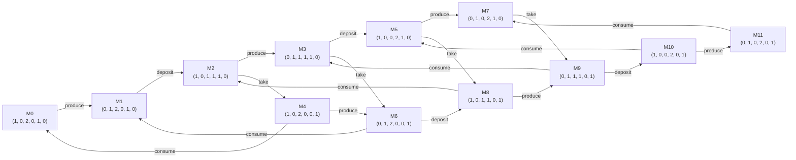
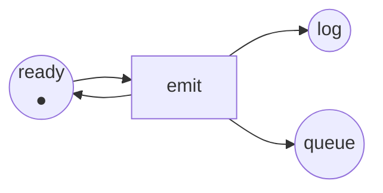

Code complet : [`code/petri-nets`](https://github.com/spareilleux/learn/tree/main/code/petri-nets). Cette leçon est imprimée par `dotnet run --project Examples -c Release -- l3`, comparée à [`expected/l3.txt`](https://github.com/spareilleux/learn/blob/main/code/petri-nets/expected/l3.txt).

La leçon 2 a donné une condition arithmétique qui ne sait que réfuter. Pour *décider* si un marquage est accessible, il y a une méthode brutale et évidente : partir de *M0*, tirer tout ce qui peut tirer, et continuer jusqu'à ce que rien de nouveau n'apparaisse. C'est le graphe d'accessibilité, et cette leçon parle de quand cela marche, de quand cela ne marche pas, et de ce qu'on fait alors.

## Le construire

L'**ensemble d'accessibilité** R(*N*, *M0*) est l'ensemble des marquages atteignables depuis *M0* par une séquence de tir quelconque. Le **graphe d'accessibilité** y ajoute les tirs : un nœud par marquage accessible, une flèche étiquetée par tir.

La construction est un parcours en largeur dont la fonction successeur est la règle de tir ([`ReachabilityGraph.cs`](https://github.com/spareilleux/learn/blob/main/code/petri-nets/PetriNets/ReachabilityGraph.cs)) :

```csharp
while (queue.Count > 0)
{
    var from = queue.Dequeue();
    foreach (var t in net.EnabledTransitions(states[from]))
    {
        var next = net.Fire(states[from], t);
        if (!index.TryGetValue(next, out var to))
        {
            if (states.Count >= limit) { complete = false; continue; }
            to = states.Count;
            states.Add(next);
            index[next] = to;
            queue.Enqueue(to);
        }
        steps.Add(new Step(from, t, to));
    }
}
```

Deux détails rendent la sortie utilisable et pas seulement correcte. Le parcours en largeur, pour que les états soient numérotés dans un ordre qui ne dépend pas de la disposition d'une table de hachage, et le tri des tirs avant de les renvoyer — sinon le même réseau imprimerait un graphe différent sur une autre machine, et aucun fichier ne pourrait être comparé. Et il y a une `limit` : sans elle, la boucle ci-dessus ne se termine pas sur le deuxième réseau de cette leçon.

Pour le producteur et le consommateur de la leçon 1, elle se termine à douze :

```
reachability graph of producer-consumer: 12 states, 20 firings
places ready produced free full waiting taken
  M0 = (1, 0, 2, 0, 1, 0)  ready:1 free:2 waiting:1
  M1 = (0, 1, 2, 0, 1, 0)  produced:1 free:2 waiting:1
  M2 = (1, 0, 1, 1, 1, 0)  ready:1 free:1 full:1 waiting:1
  M3 = (0, 1, 1, 1, 1, 0)  produced:1 free:1 full:1 waiting:1
  M4 = (1, 0, 2, 0, 0, 1)  ready:1 free:2 taken:1
  M5 = (1, 0, 0, 2, 1, 0)  ready:1 full:2 waiting:1
  M6 = (0, 1, 2, 0, 0, 1)  produced:1 free:2 taken:1
  M7 = (0, 1, 0, 2, 1, 0)  produced:1 full:2 waiting:1
  M8 = (1, 0, 1, 1, 0, 1)  ready:1 free:1 full:1 taken:1
  M9 = (0, 1, 1, 1, 0, 1)  produced:1 free:1 full:1 taken:1
  M10 = (1, 0, 0, 2, 0, 1)  ready:1 full:2 taken:1
  M11 = (0, 1, 0, 2, 0, 1)  produced:1 full:2 taken:1
  M0 --produce--> M1
  M1 --deposit--> M2
  M2 --produce--> M3
  M2 --take--> M4
  M3 --deposit--> M5
  M3 --take--> M6
  M4 --produce--> M6
  M4 --consume--> M0
  M5 --produce--> M7
  M5 --take--> M8
  M6 --deposit--> M8
  M6 --consume--> M1
  M7 --take--> M9
  M8 --produce--> M9
  M8 --consume--> M2
  M9 --deposit--> M10
  M9 --consume--> M3
  M10 --produce--> M11
  M10 --consume--> M5
  M11 --consume--> M7
```

L'analyseur dessine le même graphe, de sorte que l'image et le listing sortent du même endroit :



Ce sont les douze combinaisons comptées à la leçon 1 : le producteur dans l'un de deux états, le consommateur dans l'un de deux, le tampon contenant zéro, un ou deux articles. Tous sont accessibles, ce dont l'exercice 4 de la leçon 2 avait besoin.

Lisez M2 et ses deux successeurs. Depuis `ready:1 free:1 full:1 waiting:1`, `produce` mène à M3 et `take` mène à M4 — puis M3 fait `take` vers M6 et M4 fait `produce` vers M6, le même marquage. Ce carré fermé est le losange de la leçon 1, dessiné. Là où le graphe a un losange, le réseau a de la concurrence ; là où il a un nœud avec deux flèches sortantes qui ne se rejoignent jamais, le réseau a un choix.

Une fois le graphe construit, plusieurs questions deviennent des recherches :

- **est-ce que *M* est accessible ?** *M* est-il parmi les états.
- **le système peut-il s'interbloquer ?** Existe-t-il un état sans flèche sortante. Ici, aucun.
- **combien de jetons `full` peut-elle contenir ?** Le maximum sur les états : deux.
- **le système peut-il revenir au départ ?** L'état 0 est-il atteignable depuis chaque état.

La leçon 4 transforme chacune de ces questions en une propriété nommée et une ligne de sortie.

## Pourquoi personne ne construit cela à la main

Le graphe grandit. Pas toujours comme on s'y attend, et cela vaut la peine d'être observé :

```
== How fast the graph grows ==
capacity  states  firings
       1       8       12
       2      12       20
       3      16       28
       4      20       36
       5      24       44
       6      28       52
       7      32       60
       8      36       68
```

Agrandir le tampon coûte quatre états par emplacement : linéaire, parce que le tampon est un seul composant dont l'état est un nombre. Ajoutez maintenant des composants. Les philosophes — *n* philosophes autour d'une table, chacun ayant besoin des fourchettes des deux côtés, prises en une seule fois :

```
philosophers  states  firings
           2       3        4
           3       4        6
           4       7       16
           5      11       30
           6      18       60
           7      29      112
           8      47      208
           9      76      378
          10     123      680
```

3, 4, 7, 11, 18, 29, 47, 76, 123 — chacun est la somme des deux précédents. Ce sont les nombres de Lucas, qui croissent comme le nombre d'or à la puissance *n*. Exponentiel, avec une petite base seulement parce que les philosophes partagent leurs fourchettes avec leurs voisins, ce qui restreint ce qui peut arriver en même temps.

Retirez le partage, et la base devient l'espace d'états entier d'un composant :

```
independent copies  states  firings
                 1      12       20
                 2     144      480
                 3    1728     8640
                 4   20736   138240
                 5  248832  2073600
```

Cinq copies indépendantes d'un réseau à douze marquages : 12⁵ = 248 832 marquages. C'est le **problème de l'explosion combinatoire**, et c'est la raison d'être de tout le reste du sujet. Le modèle n'a rien de faux — ces marquages sont vraiment tous différents — mais une approche qui les énumère cesse de fonctionner quelque part entre la quatrième et la cinquième copie d'un système à six places.

Deux issues sont déjà en vue. La leçon 5 prouve des choses sur tous les marquages à la fois avec les invariants, et ne construit jamais de graphe. La leçon 15 couvre les techniques qui gardent le graphe mais cessent d'explorer les entrelacements qui mènent au même endroit : la réduction d'ordre partiel et les dépliages.

## Quand le graphe est infini

Prenez le producteur et le consommateur, et retirez la place `free` avec ses deux arcs — le changement dont parlait l'exercice 1 de la leçon 1. Rien d'autre ne bouge :

```
== Remove the place free and the graph becomes infinite ==
net unbounded-producer
places      ready produced full waiting taken
transitions produce deposit take consume
M0          (1, 0, 0, 1, 0) = ready:1 waiting:1
arc         ready -> produce
arc         produce -> produced
arc         produced -> deposit
arc         deposit -> full
arc         deposit -> ready
arc         full -> take
arc         waiting -> take
arc         take -> taken
arc         taken -> consume
arc         consume -> waiting
```

`deposit` n'a plus besoin d'un emplacement libre. Le producteur peut tourner indéfiniment sans que le consommateur ne prenne quoi que ce soit, et `full` grandit sans limite. La recherche ne se termine pas ; c'est seulement la `limit` qui l'arrête :

```
stopped after 50 states, complete: False
largest number of tokens in full among them: 13
```

Cinquante états plus loin, le tampon contient treize articles et rien ne l'empêche de continuer. C'est une file non bornée dans un vrai système, et le plus intéressant est la petitesse du changement : une place, deux arcs, pas une ligne de « logique ».

## L'arbre de couverture

Karp et Miller ont résolu cela en 1969, dans un article sur les schémas de programmes parallèles, et Murata présente la construction en section IV-A. L'idée est un mensonge bien choisi.

Construisez un arbre plutôt qu'un graphe, depuis *M0*, en tirant tout ce qui est sensibilisé. Quand un nouveau marquage *M* couvre strictement l'un de ses propres ancêtres *M*′ — c'est-à-dire *M* ≥ *M*′ place par place et *M* ≠ *M*′ — alors le chemin de *M*′ à *M* peut être répété, et toute place où *M* a grandi peut être pompée aussi haut qu'on veut. Écrivez donc **ω** dans ces places, un symbole voulant dire « n'importe quel nombre de jetons », avec ω + *k* = ω et ω − *k* = ω, et ω ≥ *n* pour tout *n*. Arrêtez une branche quand son marquage figure déjà sur le chemin depuis la racine.

C'est tout [`CoverabilityTree.cs`](https://github.com/spareilleux/learn/blob/main/code/petri-nets/PetriNets/CoverabilityTree.cs) :

```csharp
/// <summary>Remplace par oméga toute place qui a grandi depuis un ancêtre que ce marquage couvre strictement.</summary>
private static Marking WithOmegas(PetriNet net, List<CoverabilityNode> nodes, int parent, Marking marking)
{
    var tokens = marking.ToArray();
    foreach (var ancestor in Ancestors(nodes, parent).Append(nodes[parent]))
    {
        if (!marking.StrictlyCovers(ancestor.Marking)) continue;
        for (var p = 0; p < net.Places.Count; p++)
        {
            if (tokens[p] != Marking.Omega && tokens[p] > ancestor.Marking[p]) tokens[p] = Marking.Omega;
        }
    }
    return new Marking(tokens);
}
```

L'arbre est toujours fini, pour tout réseau. Sur le producteur non borné, il a dix-sept nœuds :

```
coverability tree of unbounded-producer: 17 nodes
places ready produced full waiting taken
  root (1, 0, 0, 1, 0)
    produce -> (0, 1, 0, 1, 0)
      deposit -> (1, 0, ω, 1, 0)
        produce -> (0, 1, ω, 1, 0)
          deposit -> (1, 0, ω, 1, 0)  [already on this path]
          take -> (0, 1, ω, 0, 1)
            deposit -> (1, 0, ω, 0, 1)
              produce -> (0, 1, ω, 0, 1)  [already on this path]
              consume -> (1, 0, ω, 1, 0)  [already on this path]
            consume -> (0, 1, ω, 1, 0)  [already on this path]
        take -> (1, 0, ω, 0, 1)
          produce -> (0, 1, ω, 0, 1)
            deposit -> (1, 0, ω, 0, 1)  [already on this path]
            consume -> (0, 1, ω, 1, 0)
              deposit -> (1, 0, ω, 1, 0)  [already on this path]
              take -> (0, 1, ω, 0, 1)  [already on this path]
          consume -> (1, 0, ω, 1, 0)  [already on this path]
  bound of ready: 1
  bound of produced: 1
  bound of full: unbounded
  bound of waiting: 1
  bound of taken: 1
  dead transitions: none
```

Regardez la troisième ligne. Le premier `deposit` produit `(1, 0, 1, 1, 0)`, qui couvre strictement la racine `(1, 0, 0, 1, 0)` : identique partout, un jeton de plus dans `full`. `full` devient donc ω, et à partir de là tout le sous-arbre le porte. Dix-sept nœuds remplacent un graphe infini, et ils répondent à la question qui comptait : **`full` est non bornée, toutes les autres places sont sûres.**

C'est l'usage principal de l'arbre. Murata énumère ce qu'il décide (section IV-A) :

- la **bornitude** du réseau, et de chaque place : une place est non bornée exactement quand ω y apparaît quelque part dans l'arbre ;
- **quelles transitions sont mortes** : une transition qui n'étiquette aucun arc de l'arbre ne peut jamais tirer ;
- et quand le réseau *est* borné, l'arbre contient tous les marquages accessibles, il répond donc à tout ce à quoi le graphe répond.

## Ce que ω oublie

C'est un mensonge, quoique soigneux, et le prix apparaît tout de suite. Sur le producteur et le consommateur bornés, l'arbre a cinquante-six nœuds pour douze marquages, parce qu'un arbre répète chaque marquage une fois par chemin qui y mène :

```
coverability tree of producer-consumer: 56 nodes
```

Et sur un réseau non borné, ω détruit une information irrécupérable :

```
== What omega forgets ==
The tree says full is unbounded. It cannot say whether full ever holds exactly 3 tokens
while the consumer waits, because omega replaced the count.
```

L'arbre de couverture ne décide donc **pas** l'accessibilité. `(1, 0, 3, 1, 0)` et `(1, 0, 3, 0, 1)` apparaissent tous deux dans l'arbre sous la forme `(1, 0, ω, …)`, et l'arbre ne peut pas dire lequel le réseau atteint réellement. Il ne décide pas non plus la vivacité, pour la même raison. Ce n'est pas une faiblesse de cette implémentation : Murata l'énonce comme une limite de la méthode, et c'est pourquoi la leçon 4 ne demande la vivacité à l'analyseur que sur le graphe fini.

## Ce qui est décidable, et à quel prix

Le résumé honnête, avec les résultats qui l'ont établi :

- **La bornitude et la couverture sont décidables**, par cette construction et ses raffinements. Le coût exact est connu : la couverture est EXPSPACE-complète — la borne inférieure est le rapport technique de Yale de Lipton, 1976, *The reachability problem requires exponential space*, et la borne supérieure correspondante est Rackoff, [*The covering and boundedness problems for vector addition systems*](https://doi.org/10.1016/0304-3975%2878%2990036-1), **Theoretical Computer Science** 6(2), 1978, pages 223–231. *À vérifier : je cite le rapport de Lipton d'après des sources secondaires ; je n'ai pas lu l'original.*
- **L'accessibilité est décidable**, prouvé par Mayr ([STOC 1981](https://doi.org/10.1145/800076.802477)) et Kosaraju ([STOC 1982](https://doi.org/10.1145/800070.802201)) — et il a fallu près de vingt ans après que la question a été posée.
- **L'accessibilité est Ackermann-complète.** La borne supérieure est due à Leroux et Schmitz, [LICS 2019](https://doi.org/10.1109/LICS.2019.8785796) ; la borne inférieure correspondante a été prouvée en 2021 par Czerwiński et Orlikowski ([FOCS 2021](https://doi.org/10.1109/FOCS52979.2021.00120)) et, indépendamment, par Leroux ([FOCS 2021](https://doi.org/10.1109/FOCS52979.2021.00121)). Ackermann n'est pas une figure de style : la fonction croît plus vite que toute fonction primitive récursive, donc aucun algorithme pour le problème général ne peut être praticable dans le pire cas.

Ne lisez pas cela comme « les réseaux de Petri sont inutiles en pratique ». Lisez-le comme « demander l'accessibilité complète sur un réseau non borné est la question chère ». Les réseaux qu'on analyse vraiment sont bornés, ou s'analysent par invariants, ou appartiennent à une classe structurelle où la question s'effondre — ce à quoi servent les leçons 5 et 6.

## Points clés

- Le graphe d'accessibilité a un nœud par marquage accessible et une flèche étiquetée par tir. Construit en largeur avec une sortie triée, il est identique sur toutes les machines, ce qui est la seule façon qu'une leçon puisse le citer.
- Une fois qu'il existe, l'accessibilité, l'interblocage, les bornes et la réversibilité sont des recherches.
- Il explose. Agrandir un composant coûte linéairement ; ajouter des composants indépendants multiplie. Cinq copies d'un réseau à douze marquages en ont 248 832.
- Un réseau dont l'ensemble d'accessibilité est infini n'a pas de graphe à construire, et un changement minuscule — une place retirée — suffit pour y arriver.
- L'arbre de couverture de Karp–Miller reste fini pour tout réseau, en écrivant ω dans une place dont on a montré qu'elle grandit. Il décide la bornitude, les bornes par place et les transitions mortes.
- Il ne décide ni l'accessibilité ni la vivacité : ω a jeté les comptes dont ces questions ont besoin.
- L'accessibilité est décidable et Ackermann-complète ; la couverture est décidable et EXPSPACE-complète.

## Exercices

1. Construisez à la main le graphe d'accessibilité du réseau d'exclusion mutuelle de la leçon 1 — il a assez peu de marquages. Combien y en a-t-il, et quelles paires de transitions sont un jour sensibilisées ensemble ?
2. Dans le graphe du producteur et du consommateur ci-dessus, trouvez la séquence de tir la plus courte de M0 à M11 = `(0, 1, 0, 2, 0, 1)`. Que fait le système dans ce marquage ?
3. L'arbre de couverture du producteur non borné a 17 nœuds, et celui du producteur borné en a 56. Expliquez pourquoi c'est le réseau *non borné* qui obtient le plus petit arbre.
4. Donnez un réseau à deux places où l'arbre de couverture écrit ω dans les deux, et dites quelle séquence l'y pousse.

<details>
<summary>Solutions</summary>

**1.** Trois marquages : `(1, 0, 1, 0, 1)` avec personne à l'intérieur, `(0, 1, 1, 0, 0)` avec le fil 1 à l'intérieur, et `(1, 0, 0, 1, 0)` avec le fil 2 à l'intérieur. Le graphe est un triangle avec deux flèches dans chaque sens par le marquage du milieu. La seule paire de transitions jamais sensibilisées ensemble est `enter1` et `enter2`, au premier marquage — et elles sont en conflit, donc une seule tirera. La leçon 4 imprime ces trois marquages comme les états d'origine de ce réseau.

**2.** Huit tirs — M11 est le marquage le plus éloigné des douze : `produce, deposit, produce, deposit, produce, take, deposit, produce`, en suivant M0 → M1 → M2 → M3 → M5 → M7 → M9 → M10 → M11. Dans M11, le producteur tient un article qu'il ne peut poser nulle part (`produced:1`, et `free` vaut 0), le tampon est plein avec deux articles, et le consommateur en tient un qu'il n'a pas consommé : tout ce qui peut tenir quelque chose en tient. La méthode `PathTo` de l'analyseur fait le même parcours en largeur, et un test unitaire fixe cette séquence.

**3.** Parce que l'arbre s'arrête dès qu'un marquage se répète *sur son propre chemin*, et que ω fait se répéter les marquages bien plus tôt. Dans le réseau non borné, le troisième nœud porte déjà ω dans `full`, ce qui ramène tous les « un article de plus dans le tampon » au même symbole ; ses dix-sept nœuds ne contiennent que six marquages distincts. Dans le réseau borné, `full` prend vraiment trois valeurs différentes, et l'arbre doit épeler tous les chemins à travers les douze marquages — un graphe de 12 nœuds et 20 arêtes se déplie en un arbre de 56.

**4.** Le producteur non borné le fait déjà avec une seule place, une fois le consommateur retiré ; pour deux, donnez au producteur deux places de sortie :



`emit` prend le jeton de `ready` et le remet, en ajoutant un jeton dans `log` et un dans `queue` à chaque fois. Tirer `emit` une fois donne `(1, 1, 1)`, qui couvre strictement la racine `(1, 0, 0)` dans `log` et dans `queue`, donc l'arbre écrit `(1, ω, ω)` immédiatement. Ce réseau est `EmitLoop` dans le code, et un test unitaire vérifie que `log` et `queue` ressortent non bornées pendant que `ready` reste sûre.

Deux choses à remarquer. La paire d'arcs entre `ready` et `emit` est une boucle propre, donc la matrice d'incidence de la leçon 2 y a un zéro alors que la règle de tir a toujours besoin de ce jeton — c'est l'impureté contre laquelle la leçon 2 mettait en garde, dans le plus petit réseau qui la présente. Et la forme est celle du producteur non borné, débarrassée du faux-semblant d'un consommateur : une transition qui rend son jeton d'entrée aussitôt est une boucle sans frein.

</details>

## Sources

- Richard M. Karp et Raymond E. Miller, *Parallel program schemata*, **Journal of Computer and System Sciences** 3(2), mai 1969, pages 147–195, [doi:10.1016/S0022-0000(69)80011-5](https://doi.org/10.1016/S0022-0000%2869%2980011-5). La construction de l'arbre de couverture est dans cet article.
- Tadao Murata, *Petri nets: Properties, analysis and applications*, **Proceedings of the IEEE** 77(4), avril 1989, pages 541–580, [doi:10.1109/5.24143](https://doi.org/10.1109/5.24143). La section IV-A présente l'arbre de couverture et énumère ce qu'il décide et ne décide pas.
- Charles Rackoff, *The covering and boundedness problems for vector addition systems*, **Theoretical Computer Science** 6(2), 1978, pages 223–231, [doi:10.1016/0304-3975(78)90036-1](https://doi.org/10.1016/0304-3975%2878%2990036-1).
- Ernst W. Mayr, *An algorithm for the general Petri net reachability problem*, STOC 1981, [doi:10.1145/800076.802477](https://doi.org/10.1145/800076.802477) ; S. Rao Kosaraju, *Decidability of reachability in vector addition systems*, STOC 1982, [doi:10.1145/800070.802201](https://doi.org/10.1145/800070.802201).
- Jérôme Leroux et Sylvain Schmitz, *Reachability in vector addition systems is primitive-recursive in fixed dimension*, LICS 2019, [doi:10.1109/LICS.2019.8785796](https://doi.org/10.1109/LICS.2019.8785796) ; Wojciech Czerwiński et Łukasz Orlikowski, *Reachability in vector addition systems is Ackermann-complete*, FOCS 2021, [doi:10.1109/FOCS52979.2021.00120](https://doi.org/10.1109/FOCS52979.2021.00120) ; Jérôme Leroux, *The reachability problem for Petri nets is not primitive recursive*, FOCS 2021, [doi:10.1109/FOCS52979.2021.00121](https://doi.org/10.1109/FOCS52979.2021.00121).
