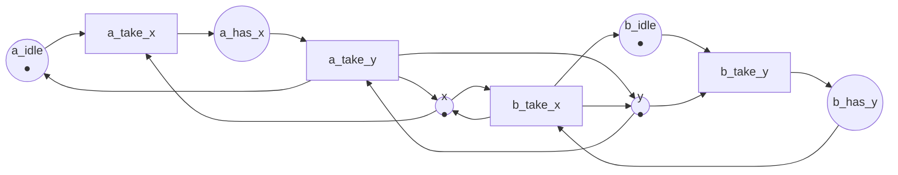

Code complet : [`code/petri-nets`](https://github.com/spareilleux/learn/tree/main/code/petri-nets). Cette leçon est imprimée par `dotnet run --project Examples -c Release -- l4`, comparée à [`expected/l4.txt`](https://github.com/spareilleux/learn/blob/main/code/petri-nets/expected/l4.txt).

La leçon 3 a construit le graphe d'accessibilité. Cette leçon lui pose des questions. Chaque propriété ci-dessous est définie pour un réseau et son marquage initial, décidée dans [`NetProperties.cs`](https://github.com/spareilleux/learn/blob/main/code/petri-nets/PetriNets/NetProperties.cs), puis montrée sur un réseau qui ne l'a pas — parce qu'une définition qu'on n'a vue que satisfaite est une définition qu'on n'a pas comprise.

Cinq réseaux portent la leçon :

| réseau | ce qu'il modélise |
|---|---|
| `producer-consumer` | leçon 1 : un producteur, un consommateur, deux emplacements |
| `mutual-exclusion` | deux fils d'exécution et un verrou |
| `two-locks` | deux fils ayant besoin de deux verrous, pris dans des ordres opposés |
| `start-once` | un service qui démarre une fois puis sert indéfiniment |
| `handshake` | leçon 2 : une requête et une réponse, sans première requête |

## Bornitude et sûreté

Une place *p* est ***k*-bornée** quand aucun marquage accessible n'y met plus de *k* jetons. Un réseau est *k*-borné quand toutes ses places le sont, **borné** quand il est *k*-borné pour un certain *k*, et **sûr** quand il est 1-borné.

C'est la propriété qui se traduit le plus directement en code. Une place bornée est une file à capacité fixe, un pool de taille fixe, un tableau qu'on peut allouer une fois. Une place non bornée est une fuite de mémoire qui attend un consommateur lent. Une place sûre est un booléen : la condition tient ou elle ne tient pas.

Le producteur et le consommateur est 2-borné et n'est pas sûr, parce que `free` et `full` se partagent deux jetons :

```
  bound of ready: 1
  bound of produced: 1
  bound of free: 2
  bound of full: 2
  bound of waiting: 1
  bound of taken: 1
  bounded:       yes (2-bounded)
  safe:          no
```

Le réseau d'exclusion mutuelle est sûr — chaque place est une condition qui tient ou ne tient pas — et le producteur non borné de la leçon 3 n'est pas borné du tout, ce que l'analyseur ne peut dire qu'à travers l'arbre de couverture :

```
== The unbounded net, seen by the coverability tree ==
bounded: False
  bound of ready: 1
  bound of produced: 1
  bound of full: unbounded
  bound of waiting: 1
  bound of taken: 1
```

Quatre de ses cinq places sont sûres. Seule `full` grandit, et c'est celle qui serait une file en mémoire.

## La vivacité, en cinq niveaux

« Vivante » sonne comme une propriété et en est cinq. Murata (1989, section II-C) gradue une transition *t* selon ce qu'elle peut encore faire :

- **L0, morte** : *t* ne peut jamais tirer. Il n'existe aucun marquage accessible où elle est sensibilisée.
- **L1** : *t* peut tirer au moins une fois, dans une séquence depuis *M0*.
- **L2** : pour tout *k*, il existe une séquence depuis *M0* dans laquelle *t* tire au moins *k* fois.
- **L3** : il existe une séquence infinie depuis *M0* dans laquelle *t* tire une infinité de fois.
- **L4, vivante** : depuis *tout* marquage accessible, il existe une séquence qui tire *t*.

Chaque niveau implique les précédents, et L4 est le plus intéressant, parce que c'est le seul qui survive à tout ce que le système a déjà fait. Une transition L1 a *un* bon chemin ; une transition L4 n'en a aucun de mauvais. Un **réseau** est vivant quand toutes ses transitions sont L4.

Traduit : L4, c'est « cette opération pourra toujours finir par se reproduire », ce que vous voulez dire quand vous affirmez qu'un système n'a ni interblocage *ni* famine. L1, c'est « ce chemin de code est atteignable », ce que vous dit un rapport de couverture.

L'analyseur donne un niveau par transition. Sur un graphe d'accessibilité fini, L2 et L3 coïncident, et il les imprime ensemble : si *t* peut tirer *k* fois pour tout *k*, alors pour *k* plus grand que le nombre d'arêtes, un tir de *t* doit se trouver sur un cycle accessible depuis *M0*, et tourner sur ce cycle indéfiniment donne la séquence infinie que demande L3. L'analyseur décide donc L2/L3 en cherchant un tir de *t* dont la source et la cible sont dans la même composante fortement connexe, et L4 en vérifiant que tout marquage accessible peut encore atteindre un marquage où *t* est sensibilisée.

```csharp
// L2/L3 : un tir de t se trouve sur un cycle, il peut donc être répété indéfiniment.
var onCycle = graph.Steps.Any(step => step.Transition == t && components[step.From] == components[step.To]);
if (!onCycle) { liveness[t] = Liveness.L1; continue; }

// L4 : tout marquage accessible peut encore atteindre un marquage où t est sensibilisée.
var canReach = Backward(predecessors, sources, states.Count);
liveness[t] = canReach.All(x => x) ? Liveness.Live : Liveness.L2L3;
```

Le producteur et le consommateur est vivant : les quatre transitions sont L4. Le réseau `handshake` de la leçon 2 est l'extrême opposé, et l'analyseur le dit en un mot par transition :

```
  live:          no
    receive    L0, dead
    reply      L0, dead
```

## L'absence d'interblocage n'est pas la vivacité

Un marquage sans transition sensibilisée est un **marquage mort**. Un réseau est **sans interblocage** quand aucun marquage accessible n'est mort.

Il est tentant de traiter l'absence d'interblocage comme la propriété qu'on veut. Elle ne suffit pas, et `start-once` est le contre-exemple : un service démarre, puis accepte et termine des requêtes indéfiniment. Quelque chose peut toujours tirer, le réseau est donc sans interblocage — et `start` ne tirera plus jamais :

```
== start-once ==
properties of start-once
  bound of stopped: 1
  bound of running: 1
  bound of serving: 1
  bounded:       yes (1-bounded)
  safe:          yes
  deadlock-free: yes
  live:          no
    start      L1, can fire once
    accept     L4, live
    finish     L4, live
  reversible:    no
  home states:   (0, 1, 0) (0, 0, 1)
  persistent:    yes
```

Ce n'est pas un bug ici — un service est *censé* démarrer une fois — et c'est justement le point. « Vivant » n'est pas un synonyme de « correct » : c'est une question précise, et la bonne réponse pour `start` est L1. Ce qu'une vraie relecture demande, c'est quelles transitions doivent être L4 et lesquelles ne doivent pas l'être, et l'analyseur vous donne la liste à confronter.

L'autre sens est le cas classique. Deux fils d'exécution, deux verrous, pris dans des ordres opposés :



Le fil A prend `x` puis `y` ; le fil B prend `y` puis `x` ; chacun relâche les deux quand il a fini. Rien dans l'image ne dit « interblocage », et l'analyseur en trouve un :

```
== two-locks ==
properties of two-locks
  ...
  deadlock-free: no
    dead marking (0, 1, 0, 1, 0, 0)  a_has_x:1 b_has_y:1
  live:          no
    a_take_x   L2/L3, can fire for ever but not from everywhere
    a_take_y   L2/L3, can fire for ever but not from everywhere
    b_take_y   L2/L3, can fire for ever but not from everywhere
    b_take_x   L2/L3, can fire for ever but not from everywhere
  reversible:    no
  home states:   (0, 1, 0, 1, 0, 0)
  persistent:    no
```

Lisez la colonne de vivacité. Chaque transition est L2/L3, pas L4 : chacune peut tirer indéfiniment — les deux fils peuvent se relayer sans fin — et aucune ne peut tirer depuis *tous* les marquages accessibles, parce que depuis le marquage mort rien ne le peut. Voilà à quoi ressemble un interblocage dans cette gradation, et voilà pourquoi L2 est une promesse si faible : un test de charge qui tourne une heure sans se bloquer a démontré L2, pas L4.

La ligne `home states: (0, 1, 0, 1, 0, 0)` énonce le même fait de la pire façon possible : le seul marquage auquel ce réseau peut toujours revenir est l'interblocage.

L'analyseur imprime aussi comment y arriver, sous la forme du chemin le plus court depuis *M0* dans le graphe d'accessibilité :

```
== How the two locks deadlock ==
M3 = (0, 1, 0, 1, 0, 0)  a_has_x:1 b_has_y:1
  reached by: a_take_x, b_take_y
```

Deux tirs. A tient `x` et attend `y` ; B tient `y` et attend `x`. Le correctif que tout développeur C# et Java connaît — prendre les verrous dans le même ordre partout — est, dans ce réseau, « faire que `b_take_x` vienne avant `b_take_y` », et l'exercice 2 vous demande de vérifier que l'interblocage disparaît.

## Réversibilité et états d'origine

Un réseau est **réversible** quand *M0* est accessible depuis tout marquage accessible : quoi qu'il ait fait, il peut revenir au départ. Plus généralement, un marquage *M* est un **état d'origine** quand *M* est accessible depuis tout marquage accessible.

Réversible est ce qu'on veut d'un serveur : après avoir traité quoi que ce soit, il revient au repos, prêt pour la suite. C'est ce que fait le producteur et le consommateur, et ce que `start-once` ne fait pas, puisque rien ne ramène le jeton dans `stopped`. Un workflow, en revanche, ne doit *pas* être réversible : tout son intérêt est de se terminer.

L'analyseur décide les deux sur le graphe — la réversibilité par une recherche arrière depuis l'état 0, et les états d'origine en cherchant une unique composante fortement connexe terminale, dont les marquages sont alors exactement les états d'origine.

## Persistance

Un réseau est **persistant** quand, pour deux transitions sensibilisées quelconques, tirer l'une laisse l'autre sensibilisée. Autrement dit, la seule chose qui puisse vous retirer le droit de tirer, c'est de tirer.

C'est le conflit, énoncé comme une propriété. Le producteur et le consommateur est persistant : `produce` et `take` ne se disputent jamais un jeton, c'est le losange de la leçon 1. Le réseau d'exclusion mutuelle ne l'est pas, et la seule ligne qui le dit, c'est le verrou :

```
== mutual-exclusion ==
  ...
  safe:          yes
  deadlock-free: yes
  live:          yes
    enter1     L4, live
    leave1     L4, live
    enter2     L4, live
    leave2     L4, live
  reversible:    yes
  home states:   (1, 0, 1, 0, 1) (0, 1, 1, 0, 0) (1, 0, 0, 1, 0)
  persistent:    no
```

Sûr, vivant, réversible et non persistant : voilà un bon verrou. `enter1` et `enter2` sont toutes deux sensibilisées au marquage initial et chacune désensibilise l'autre, ce qui est tout le rôle du jeton de `mutex`. Un réseau persistant n'a nulle part un tel choix, et c'est pourquoi les réseaux persistants sont tellement plus faciles à analyser — et pourquoi presque aucun programme concurrent intéressant n'en est un.

## Ce que le graphe prouve, et ce qu'il ne peut pas

Tout ce qui précède a été décidé par énumération. Cela marche tant que le graphe est fini, et chaque réponse est exacte. Dès que le réseau n'est pas borné, le graphe disparaît, et l'arbre de couverture de la leçon 3 ne répond plus qu'à une partie de ces questions : il décide encore la bornitude et quelles transitions sont mortes, mais ω a jeté les comptes de jetons dont il aurait besoin pour la vivacité ou l'accessibilité.

Deux faits méritent d'être emportés de cette leçon :

- **L'accessibilité est décidable.** Prouvé indépendamment par Mayr ([STOC 1981](https://doi.org/10.1145/800076.802477)) et Kosaraju ([STOC 1982](https://doi.org/10.1145/800070.802201)). Elle est aussi spectaculairement chère : le problème est Ackermann-complet, la borne supérieure venant de Leroux et Schmitz ([LICS 2019](https://doi.org/10.1109/LICS.2019.8785796)) et la borne inférieure correspondante de Czerwiński et Orlikowski ([FOCS 2021](https://doi.org/10.1109/FOCS52979.2021.00120)) et de Leroux ([FOCS 2021](https://doi.org/10.1109/FOCS52979.2021.00121)).
- **La vivacité n'est pas plus facile.** Hack a montré en 1974 que le problème de la vivacité et le problème de l'accessibilité sont [récursivement équivalents](https://doi.org/10.1109/SWAT.1974.28) : un algorithme pour l'un donne un algorithme pour l'autre. Donc « ce système peut-il toujours finir par refaire X » est exactement aussi difficile que « ce système peut-il atteindre l'état M ».

Pour les réseaux de cette leçon, rien de tout cela n'a d'importance, parce que douze marquages tiennent sur un écran. Cela en a dès que vous modélisez quelque chose de réel, et c'est pourquoi la leçon 5 change la question : au lieu d'énumérer les marquages, prouver quelque chose sur tous à la fois.

## Points clés

- **Borné** signifie qu'aucune place ne déborde ; *k*-borné donne la capacité ; **sûr** signifie que chaque place est un booléen. Une place non bornée est une file non bornée.
- **La vivacité a cinq niveaux.** L0 morte, L1 peut tirer une fois, L2 peut tirer arbitrairement souvent, L3 peut tirer une infinité de fois dans une exécution, L4 peut toujours retirer. Un réseau est vivant quand toutes ses transitions sont L4.
- **Sans interblocage est plus faible que vivant.** `start-once` n'a pas d'interblocage et n'est pas vivant ; `two-locks` a un interblocage et toutes ses transitions sont L2/L3, ce qui est exactement ce qu'un long test de charge vous aurait montré.
- **Réversible** signifie que le marquage initial est toujours accessible à nouveau ; un **état d'origine** est un marquage qui l'est toujours. Un serveur devrait être réversible, un workflow non.
- **Persistant** signifie qu'aucune transition sensibilisée n'est jamais désensibilisée par une autre. Un verrou est précisément une violation de la persistance.
- Tout cela se décide exactement sur un graphe d'accessibilité fini, et en général c'est décidable mais Ackermann-difficile ; vivacité et accessibilité sont récursivement équivalentes.

## Exercices

1. Le producteur et le consommateur est 2-borné. Quel nombre unique changeriez-vous pour le rendre sûr, et que serait alors le système ?
2. Inversez l'ordre dans lequel le fil B prend ses verrous — `b_take_x` d'abord, puis `b_take_y` — pour que les deux fils prennent `x` avant `y`. Construisez le réseau et vérifiez : est-il sans interblocage ? vivant ? réversible ?
3. `start-once` est sans interblocage et n'est pas vivant. Modifiez-le pour qu'il devienne vivant, sans retirer de transition.
4. Laquelle des cinq propriétés exigeriez-vous vraiment (a) d'une boucle de consommation RabbitMQ, (b) d'un workflow de traitement de commandes, (c) d'un verrou ? Donnez une propriété qui doit tenir et une qui ne doit pas tenir, pour chaque cas.

<details>
<summary>Solutions</summary>

**1.** Mettez le marquage initial de `free` à 1. Le réseau devient sûr, et le système devient une passation sans aucun tampon : le producteur ne peut pas déposer un deuxième article tant que le consommateur n'a pas pris le premier. C'est la différence entre `Channel.CreateBounded(2)` et `Channel.CreateBounded(1)` — ou, en Java, entre une `ArrayBlockingQueue(2)` et une `SynchronousQueue`, sauf que le réseau laisse encore le producteur *tenir* un article, ce qu'une `SynchronousQueue` ne fait pas.

**2.** Avec les deux fils prenant `x` d'abord, le réseau est sans interblocage, vivant et réversible. La raison se voit sans l'analyseur : un fil ne peut attendre `y` que s'il tient `x`, et un seul fil peut tenir `x`, donc au plus un fil est bloqué à un instant donné, et celui qui tient les deux verrous finit toujours. La règle générale — imposer un ordre total sur la prise des verrous — est exactement cet argument, et la leçon 6 donne la condition structurelle qui est derrière.

**3.** Ajoutez un arc d'une place où le réseau revient sans cesse vers `stopped`, ou, plus simplement, ajoutez une transition `stop` de `running` vers `stopped`. Alors le marquage `(1, 0, 0)` redevient accessible depuis partout, `start` devient L4, et le réseau est vivant *et* réversible. Remarquez ce que vous avez modélisé : un service qu'on peut redémarrer.

**4.** Un jeu de réponses défendable.

(a) Une boucle de consommation RabbitMQ doit être **vivante** — chaque acquittement doit toujours pouvoir finir par redevenir possible — et ne doit **pas** être un réseau dont la place « file » est non bornée, sinon le courtier stocke des messages que personne ne prend. La bornitude ici n'est pas une élégance de modélisation : c'est l'alerte sur la profondeur de file.

(b) Un workflow de traitement de commandes ne doit **pas** être réversible — il doit se terminer — et doit être **sans interblocage** au sens où toute exécution atteint son marquage final au lieu de s'arrêter en cours de route. La leçon 10 en fait une propriété unique appelée *soundness*, plus forte que l'une ou l'autre de celles-ci.

(c) Un verrou ne doit **pas** être persistant — c'est ce qu'est un verrou — et doit être **sûr** : deux jetons dans `mutex` seraient deux fils dans la section critique.

</details>

## Sources

- Tadao Murata, *Petri nets: Properties, analysis and applications*, **Proceedings of the IEEE** 77(4), avril 1989, pages 541–580, [doi:10.1109/5.24143](https://doi.org/10.1109/5.24143). La section II-C définit la bornitude, la sûreté, les cinq niveaux de vivacité, la réversibilité, les états d'origine et la persistance, dans cet ordre.
- Michel Hack, *The recursive equivalence of the reachability problem and the liveness problem for Petri nets and vector addition systems*, 15th Annual Symposium on Switching and Automata Theory, 1974, pages 156–164, [doi:10.1109/SWAT.1974.28](https://doi.org/10.1109/SWAT.1974.28).
- Ernst W. Mayr, *An algorithm for the general Petri net reachability problem*, STOC 1981, [doi:10.1145/800076.802477](https://doi.org/10.1145/800076.802477) ; S. Rao Kosaraju, *Decidability of reachability in vector addition systems*, STOC 1982, [doi:10.1145/800070.802201](https://doi.org/10.1145/800070.802201).
- Jérôme Leroux et Sylvain Schmitz, *Reachability in vector addition systems is primitive-recursive in fixed dimension*, LICS 2019, [doi:10.1109/LICS.2019.8785796](https://doi.org/10.1109/LICS.2019.8785796) ; Wojciech Czerwiński et Łukasz Orlikowski, *Reachability in vector addition systems is Ackermann-complete*, FOCS 2021, [doi:10.1109/FOCS52979.2021.00120](https://doi.org/10.1109/FOCS52979.2021.00120) ; Jérôme Leroux, *The reachability problem for Petri nets is not primitive recursive*, FOCS 2021, [doi:10.1109/FOCS52979.2021.00121](https://doi.org/10.1109/FOCS52979.2021.00121).
