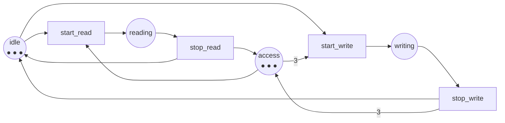

Code complet : [`code/petri-nets`](https://github.com/spareilleux/learn/tree/main/code/petri-nets). Cette leçon est imprimée par `dotnet run --project Examples -c Release -- l7`, comparée à [`expected/l7.txt`](https://github.com/spareilleux/learn/blob/main/code/petri-nets/expected/l7.txt).

Les six premières leçons ont construit la machinerie. Celle-ci la dépense sur les cinq motifs dont tout programme concurrent est fait, et met chaque réseau à côté de la construction que vous employez déjà : [`lock`](https://learn.microsoft.com/dotnet/csharp/language-reference/statements/lock), [`SemaphoreSlim`](https://learn.microsoft.com/dotnet/api/system.threading.semaphoreslim), [`Channel<T>`](https://learn.microsoft.com/dotnet/api/system.threading.channels.channel), [`ReaderWriterLockSlim`](https://learn.microsoft.com/dotnet/api/system.threading.readerwriterlockslim), et en Java [`synchronized`](https://docs.oracle.com/javase/specs/jls/se21/html/jls-14.html), [`ReentrantLock`](https://docs.oracle.com/en/java/javase/21/docs/api/java.base/java/util/concurrent/locks/ReentrantLock.html), [`Semaphore`](https://docs.oracle.com/en/java/javase/21/docs/api/java.base/java/util/concurrent/Semaphore.html), [`ArrayBlockingQueue`](https://docs.oracle.com/en/java/javase/21/docs/api/java.base/java/util/concurrent/ArrayBlockingQueue.html) et [`ReentrantReadWriteLock`](https://docs.oracle.com/en/java/javase/21/docs/api/java.base/java/util/concurrent/locks/ReentrantReadWriteLock.html).

Le [cours C# avancé](../../csharp-advanced/) a passé les leçons [6](../../csharp-advanced/06-channels/), [7](../../csharp-advanced/07-tpl-dataflow/) et [8](../../csharp-advanced/08-rx-net/) à mesurer la contre-pression. Cette leçon la modélise à la place, et ce qui était mesuré là-bas est ici une place.

| motif | le réseau | la construction |
|---|---|---|
| un verrou | un jeton dans une place que les deux fils lisent | `lock`, `Monitor`, `synchronized`, `ReentrantLock` |
| un sémaphore à compteur | *k* jetons dans cette place | `new SemaphoreSlim(k)`, `new Semaphore(k)` |
| un canal borné | une place tenant les emplacements libres | `Channel.CreateBounded(k)`, `new ArrayBlockingQueue(k)` |
| un verrou lecteur/rédacteur | un arc de poids *n* vers la même place | `ReaderWriterLockSlim`, `ReentrantReadWriteLock` |
| les philosophes | un anneau de places partagées | n'importe quel ordonnancement de ressources dont vous avez débattu |

## Un verrou est un jeton

La leçon 4 a construit le réseau et la leçon 5 a calculé ses invariants. Mettez-les ensemble et le verrou cesse d'être une convention :

```
== One lock, and the invariant that is the proof ==
invariants of mutual-exclusion
  place invariants (3):
    idle1 + critical1 = 1
    critical1 + critical2 + mutex = 1
    idle2 + critical2 = 1
  transition invariants (2):
    enter1 + leave1
    enter2 + leave2
markings where both threads are inside: 0 out of 3
```

`critical1 + critical2 + mutex = 1` est la spécification d'un mutex, écrite en arithmétique. Comme aucun des trois comptes ne peut être négatif, au plus l'un de `critical1` et `critical2` vaut jamais 1. La dernière ligne est la même affirmation vérifiée par force brute sur les trois marquages accessibles, ce que vous feriez dans un test ; l'invariant est ce que vous feriez dans une preuve, et il se moque du nombre de marquages.

Les deux invariants de transitions sont l'autre moitié du contrat : `enter1 + leave1` dit qu'un fil qui prend le verrou le rend. Un réseau où `leave1` n'existerait pas n'aurait pas cet invariant, et c'est le modèle d'un verrou que vous avez oublié de relâcher.

## k permis au lieu d'un

Rien dans le réseau ne dit que le jeton est unique. Mettez-en *k* et vous avez un sémaphore à compteur :

```
== k permits instead of one: the counting semaphore ==
threads  permits  states  greatest number inside at once  invariant
      3        1       4                              1  permits + inside1 + inside2 + inside3 = 1
      3        2       7                              2  permits + inside1 + inside2 + inside3 = 2
      3        3       8                              3  permits + inside1 + inside2 + inside3 = 3
```

Le membre droit de l'invariant *est* l'argument du constructeur. `new SemaphoreSlim(2)`, c'est `permits = 2` au marquage initial et rien d'autre ; l'analyseur mesure ensuite que jamais plus de deux des trois fils ne sont dedans, ce que l'invariant disait déjà.

Remarquez la colonne du milieu. Trois fils et trois permis donnent 8 = 2³ marquages, parce que le sémaphore a cessé de contraindre quoi que ce soit — chaque fil est indépendamment dedans ou dehors. Deux permis donnent 7 : exactement le seul marquage où les trois sont dedans en moins. Le nombre de marquages qu'une primitive de concurrence retire est une bonne mesure de ce qu'elle fait.

## Un canal borné est la place `free`

L'exemple fil rouge de ce cours est un canal borné depuis la leçon 1, et la place `free` en est la borne depuis la leçon 1 aussi :

```
== A bounded channel is the place free ==
capacity  states  bound of full  invariant
       1       8              1  free + full = 1
       2      12              2  free + full = 2
       3      16              3  free + full = 3
       4      20              4  free + full = 4
```

`Channel.CreateBounded<T>(new BoundedChannelOptions(k))`, c'est `free = k`. Un producteur qui bloque sur `WriteAsync`, c'est la transition `deposit` qui n'est pas sensibilisée, parce que `free` ne tient rien. Voilà toute la contre-pression, et c'est une place.

Deux choses que le tableau rend concrètes. Le nombre d'états croît *linéairement* avec la capacité, 4·(*k*+1), pas exponentiellement — une file bornée est bon marché à modéliser. Et la borne de `full` est toujours la capacité, prouvée par `free + full = k` sans le graphe, ce qui est la preuve de la leçon 5 reformulée pour tous les *k* à la fois.

Ce que le réseau ne modélise *pas*, c'est le temps. Il dit que le producteur peut être bloqué, jamais combien de temps, et il n'a aucun avis sur la question de savoir si `Channel.CreateBounded` avec `BoundedChannelFullMode.DropOldest` est le bon choix. La leçon 9 ajoute le temps et la question devient répondable.

## Lecteurs et rédacteurs : un arc de poids 3

Le premier réseau de ce cours avec un arc pondéré. Trois permis dans `access` ; un lecteur en prend un ; un rédacteur les prend tous les trois :

```
net readers-writers
places      idle reading writing access
transitions start_read stop_read start_write stop_write
M0          (3, 0, 0, 3) = idle:3 access:3
arc         idle -> start_read
arc         access -> start_read
arc         start_read -> reading
arc         reading -> stop_read
arc         stop_read -> idle
arc         stop_read -> access
arc         idle -> start_write
arc         access -> start_write (weight 3)
arc         start_write -> writing
arc         writing -> stop_write
arc         stop_write -> idle
arc         stop_write -> access (weight 3)
```



Les invariants disent ce que le verrou garantit :

```
invariants of readers-writers
  place invariants (2):
    idle + reading + writing = 3
    reading + 3*writing + access = 3
  transition invariants (2):
    start_read + stop_read
    start_write + stop_write
```

`reading + 3*writing + access = 3` porte toute la politique. `writing` vaut au plus 1, parce que 3·`writing` ne peut pas dépasser 3. Et quand `writing` vaut 1, `reading` et `access` valent tous deux 0 — un rédacteur exclut tous les lecteurs *et* tous les autres rédacteurs, non par une règle que quelqu'un a pensé à faire respecter mais par arithmétique. Le poids 3 sur l'arc est l'exclusion.

Le comportement le confirme :

```
properties of readers-writers
  bound of idle: 3
  bound of reading: 3
  bound of writing: 1
  bound of access: 3
  bounded:       yes (3-bounded)
  safe:          no
  deadlock-free: yes
  live:          yes
    start_read L4, live
    stop_read  L4, live
    start_write L4, live
    stop_write L4, live
  reversible:    yes
  home states:   (3, 0, 0, 3) (2, 1, 0, 2) (2, 0, 1, 0) (1, 2, 0, 1) (0, 3, 0, 0)
  persistent:    no
markings with a writer and a reader at once: 0
markings with two writers at once: 0
```

Sûr, non ; vivant, oui ; sans interblocage, oui. Tout ce qu'un verrou lecteur/rédacteur est censé être.

## Vivant et affamé en même temps

Et voici la partie qui vaut toute la leçon. `start_write` est L4 — depuis tout marquage accessible, une séquence la tire. Voici le même réseau, depuis le même graphe :

```
== Live and starved at the same time ==
start_write is live: True
and yet the net can run for ever without ever firing it:
  M3 = (1, 2, 0, 1)  --start_read-->
  M4 = (0, 3, 0, 0)  --stop_read-->
```

Deux marquages et deux tirs, qui tournent indéfiniment : un lecteur démarre, un lecteur s'arrête, et `access` ne revient jamais à 3, donc le rédacteur n'entre jamais. Tout marquage de ce cycle peut *atteindre* un marquage où `start_write` est sensibilisée — c'est ce que L4 veut dire — et le réseau n'a aucune obligation d'y aller.

C'est la famine du rédacteur que tout verrou lecteur/rédacteur doit gérer, et c'est exactement ce que la vivacité simple n'interdit **pas**. La vivacité, c'est « toujours possible » ; la famine porte sur « finit par arriver », qui est une hypothèse d'*équité* sur l'ordonnanceur, pas une propriété du réseau. Un réseau de Petri n'a pas d'ordonnanceur. Dites-le dans les deux vocabulaires :

- **Réseaux de Petri** : la vivacité L4 est une propriété de temps arborescent du graphe d'accessibilité ; l'absence d'exécution infinie évitant *t* est une propriété différente et plus forte, et il lui faut une contrainte d'équité pour devenir vraie.
- **C#** : `ReaderWriterLockSlim` documente une politique pour exactement cela, et `new ReaderWriterLockSlim(LockRecursionPolicy.NoRecursion)` ne dit rien d'une préférence pour les rédacteurs. Le `ReentrantReadWriteLock` de Java prend un drapeau `fair` dans son constructeur, et ce drapeau est l'hypothèse d'ordonnancement que ce réseau n'a pas.

L'analyseur trouve le cycle par un parcours en profondeur du graphe d'accessibilité dont `start_write` a été supprimée ([`ReachabilityGraph.CycleAvoiding`](https://github.com/spareilleux/learn/blob/main/code/petri-nets/PetriNets/ReachabilityGraph.cs)). Tout cycle de ce genre accessible depuis *M0* est une exécution dans laquelle la transition ne tire jamais. C'est une petite fonction et une habitude utile : quand une propriété dit « toujours finira par », demandez au graphe l'exécution où cela n'arrive pas.

## Les philosophes, une fourchette à la fois

La leçon 3 a compté les marquages des philosophes prenant leurs deux fourchettes en une seule transition, et a trouvé les nombres de Lucas. Ce réseau ne s'interbloque jamais, parce que la transition atomique est un mensonge : elle prend deux verrous en une instruction.

Prenez-les une à la fois, comme le fait le vrai code, et :

```
== The philosophers, with and without one fork at a time ==
philosophers  both forks at once        one fork at a time       one of them reversed
              states  deadlocks          states  deadlocks         states  deadlocks
           2       3          0               6          1              5          0
           3       4          0              14          1             12          0
           4       7          0              34          1             29          0
           5      11          0              82          1             70          0
           6      18          0             198          1            169          0
```

Trois colonnes, une leçon chacune.

**À gauche** : le modèle atomique. Aucun interblocage à aucune taille, et le plus petit espace d'états — les nombres de Lucas 3, 4, 7, 11, 18 du journal de la leçon 3.

**Au milieu** : une fourchette à la fois. Exactement **un** marquage d'interblocage à chaque taille, et un espace d'états qui s'écarte de celui du modèle atomique à mesure que l'anneau grandit : deux fois plus de marquages à deux philosophes, onze fois plus à six. Ce marquage mort unique est celui que tout le monde dessine :

```
== The deadlock of five philosophers, and how to reach it ==
dead markings: 1 out of 82
M78 = holding1:1 holding2:1 holding3:1 holding4:1 holding5:1
  reached by: take_first1, take_first2, take_first3, take_first4, take_first5
  places holding nothing: 15 of 20, every fork among them
  that set is a siphon: True
  largest trap inside it: {}
```

Cinq tirs, un par philosophe, tous prenant leur fourchette de gauche. Toutes les fourchettes ont disparu, et le théorème de la leçon 6 nomme ce qui s'est passé : les places vides forment un siphon sans trappe à l'intérieur, donc une fois vide il l'est pour toujours.

**À droite** : le correctif. Le philosophe 5 attrape d'abord la fourchette de droite, et l'interblocage disparaît à toutes les tailles. La structure dit pourquoi, sans aucun marquage :

```
three philosophers, one fork at a time: 7 minimal siphons, 1 of them with no marked trap
  {eating1, fork1, eating2, fork2, eating3, fork3}
with one of them reversed: 6 minimal siphons, 0 of them with no marked trap
```

Inverser un philosophe n'ajoute ni garde, ni délai d'expiration, ni réessai. Cela **retire un siphon** — celui qui contient toutes les fourchettes et toutes les places `eating`, le seul sans trappe marquée. Ce qui reste a une trappe marquée dans tout siphon, ce qui, par l'implication prouvée à la leçon 6, est une preuve d'absence d'interblocage.

C'est la réponse de Dijkstra de 1971 ([*Hierarchical ordering of sequential processes*](https://doi.org/10.1007/BF00289519)), et c'est la même réponse que l'exercice de la leçon 4 sur les deux verrous : imposer un ordre total sur les ressources. Ici, vous pouvez regarder ce que l'ordre fait à la structure.

## Ce que le réseau dit et ce qu'il ne dit pas

Cela mérite d'être explicite, parce que c'est là que la modélisation dérape :

- **il ne modélise pas le temps.** Pas de délai d'expiration, pas de temporisation exponentielle, pas de « le verrou est habituellement libre ». La leçon 9 ajoute cela.
- **il ne modélise pas l'équité.** Le rédacteur meurt de faim dans un réseau vivant ; les philosophes peuvent être polis pour toujours. Un réseau dit ce qui *peut* arriver, jamais ce qui *va* arriver.
- **il ne modélise pas la réentrance.** `lock (gate)` pris deux fois par le même fil est correct en C# et est un interblocage dans ce réseau. Le modéliser demande un jeton par fil, et le modèle grossit.
- **il modélise la contention exactement.** Ce qui est la seule chose que les tests de charge font le plus mal, parce qu'ils ne vous montrent jamais que les entrelacements qui ont eu lieu.

## Points clés

- Un **verrou** est un jeton dans une place partagée ; l'invariant `critical1 + critical2 + mutex = 1` est la preuve, et c'est le même énoncé que la spécification.
- Un **sémaphore à compteur** est *k* jetons dans cette place. Le membre droit de l'invariant est l'argument du constructeur.
- Un **canal borné** est une place tenant les emplacements libres. Bloquer, c'est une transition qui n'est pas sensibilisée ; le nombre d'états croît linéairement avec la capacité.
- Un **verrou lecteur/rédacteur** est un arc de poids *n*. `reading + 3*writing + access = 3` prouve arithmétiquement qu'un rédacteur exclut tout le monde.
- **Vivant ne veut pas dire équitable.** `start_write` est L4 et le réseau a quand même une exécution infinie qui ne la tire jamais. L'équité est une hypothèse sur l'ordonnanceur ; `ReentrantReadWriteLock(true)` est là où Java la met.
- **Prendre les fourchettes une à la fois introduit exactement un interblocage**, à chaque taille. Inverser un philosophe retire le siphon qui n'a pas de trappe marquée, et c'est ce que « ordonnez vos verrous » fait structurellement.

## Exercices

1. Le réseau d'exclusion mutuelle a trois marquages ; le sémaphore à compteur avec 3 fils et 3 permis en a huit. Expliquez la différence en une phrase, et dites ce que cela signifie pour les tests.
2. Modélisez un verrou qu'un fil oublie de relâcher : prenez le réseau d'exclusion mutuelle et retirez `leave1`. Quelle propriété de la leçon 4 casse en premier, et qu'arrive-t-il aux invariants de transitions de la leçon 5 ?
3. Un collègue propose de corriger les philosophes par un délai d'expiration : un philosophe qui tient une fourchette depuis trop longtemps la repose et réessaie. Ce réseau est-il sans interblocage ? Est-il vivant ? Laquelle des deux est la propriété que le collègue veut réellement, et laquelle le correctif ne donne-t-il pas ?
4. Le réseau lecteurs-rédacteurs permet trois lecteurs simultanés parce qu'`access` commence avec trois jetons et qu'un lecteur en prend un. Qu'est-ce qui changerait si un lecteur en prenait deux ? Prédisez l'invariant et la borne de `reading`, puis dites quel verrou réel cela modélise.

<details>
<summary>Solutions</summary>

**1.** Avec autant de permis que de fils, le sémaphore ne contraint rien, donc les trois fils sont indépendants et les marquages se multiplient : 2³ = 8. Avec un seul permis ils sont couplés et seuls 4 de ces 8 survivent. Pour les tests, le compte *est* l'espace des entrelacements : une suite de tests contre la version à 3 permis explore huit états sans aucune contention dans aucun d'eux, ce qui explique qu'un sémaphore dimensionné au nombre de fils passe tous les tests et ne protège rien.

**2.** L'analyseur construit ce réseau sous le nom `mutual-exclusion-leaky` et imprime :

```
  deadlock-free: no
    dead marking (0, 1, 1, 0, 0)  critical1:1 idle2:1
  live:          no
    enter1     L1, can fire once
    enter2     L2/L3, can fire for ever but not from everywhere
    leave2     L2/L3, can fire for ever but not from everywhere
  reversible:    no
  home states:   (0, 1, 1, 0, 0)
invariants of mutual-exclusion-leaky
  place invariants (3):
    idle1 + critical1 = 1
    critical1 + critical2 + mutex = 1
    idle2 + critical2 = 1
  transition invariants (1):
    enter2 + leave2
siphons of mutual-exclusion-leaky: 3 minimal siphons
  siphon {idle1}
    largest trap inside it: {}  marked at M0: no
  siphon {idle2, critical2}
    largest trap inside it: {idle2, critical2}  marked at M0: yes
  siphon {critical2, mutex}
    largest trap inside it: {}  marked at M0: no
  every siphon contains a marked trap: no
  minimal traps: {critical1} {idle2, critical2}
```

C'est la **vivacité** qui casse en premier — `enter1` tombe à L1, et les deux autres à L2/L3 — et l'absence d'interblocage part avec elle : le marquage où le fil 1 reste dans sa section critique et le fil 2 est au repos n'a rien de sensibilisé, et c'est le seul état d'accueil, ce qui est la pire chose possible pour un état d'accueil.

Deux des leçons précédentes montrent le même dégât sous leur propre angle. En termes de leçon 5, l'invariant de transitions `enter1 + leave1` a disparu : il n'existe plus aucun multiensemble de tirs impliquant `enter1` qui s'annule, et cet invariant manquant *est* le bloc `finally` manquant. En termes de leçon 6, deux des trois siphons minimaux ne contiennent plus aucune trappe — `{critical2, mutex}`, le verrou et le seul fil qui peut encore le tenir, et `{idle1}`, que le fil 1 quitte une fois pour n'y jamais revenir.

J'avais prédit `{critical1, critical2, mutex}` et je n'ai eu ni l'un ni l'autre des deux. `{critical1}` se révèle être une *trappe* plutôt qu'une partie d'un siphon, puisque rien ne la vide. C'est la troisième fois dans ce cours que recalculer bat se souvenir.

**3.** Je n'ai pas construit ce réseau, donc ce qui suit est un argument plutôt qu'une mesure — *à vérifier*. Il devrait être sans interblocage et toujours pas vivant au sens où le collègue l'entend. Avec des délais d'expiration, quelque chose peut toujours tirer — reposer une fourchette, la reprendre — donc aucun marquage n'est mort. Mais tous les philosophes peuvent expirer au même instant, reposer leur fourchette et la reprendre, pour toujours : `eat` reste L4, et il existe une exécution infinie dans laquelle personne ne mange, exactement comme le rédacteur qui meurt de faim plus haut. C'est de l'interblocage actif (*livelock*). Le collègue veut « tout le monde finit par manger », qui est une propriété d'équité qu'aucun réseau P/T simple n'exprime ; le délai d'expiration achète « le système ne s'arrête jamais », c'est-à-dire l'absence d'interblocage. La leçon 4 avertissait que sans interblocage est plus faible que vivant, et voici la version de cet avertissement qui coûte de l'argent en production.

**4.** L'invariant devient `2*reading + 3*writing + access = 3`, donc `reading` vaut au plus 1 et `writing` vaut au plus 1, et les deux ne peuvent pas valoir 1 en même temps puisque 2 + 3 > 3. Ce n'est plus un verrou lecteur/rédacteur — c'est un simple mutex avec deux manières différentes d'y entrer, ce que l'on obtient quand le mode « partagé » n'est en fait pas partageable. La version réaliste est le changement inverse : donnez à `access` plus de jetons qu'il n'y a de lecteurs, et le côté lecteur cesse d'être une contrainte, ce qui est le `new SemaphoreSlim(int.MaxValue)` qu'écrivent les gens qui veulent dire « pas de limite » et qui se demandent ensuite pourquoi le service en aval s'effondre.

</details>

## Sources

- Edsger W. Dijkstra, *Hierarchical ordering of sequential processes*, **Acta Informatica** 1(2), 1971, pages 115–138, [doi:10.1007/BF00289519](https://doi.org/10.1007/BF00289519). Le dîner des philosophes et l'ordonnancement qui le résout. Notice confirmée via Crossref ; article non lu. *À vérifier.*
- Tadao Murata, *Petri nets: Properties, analysis and applications*, **Proceedings of the IEEE** 77(4), avril 1989, pages 541–580, [doi:10.1109/5.24143](https://doi.org/10.1109/5.24143), section III pour ces motifs de modélisation. Payant et non lu. *À vérifier.*
- [`SemaphoreSlim`](https://learn.microsoft.com/dotnet/api/system.threading.semaphoreslim), [`Channel`](https://learn.microsoft.com/dotnet/api/system.threading.channels.channel) et [`ReaderWriterLockSlim`](https://learn.microsoft.com/dotnet/api/system.threading.readerwriterlockslim) sur Microsoft Learn ; [`ReentrantReadWriteLock`](https://docs.oracle.com/en/java/javase/21/docs/api/java.base/java/util/concurrent/locks/ReentrantReadWriteLock.html) et [`ArrayBlockingQueue`](https://docs.oracle.com/en/java/javase/21/docs/api/java.base/java/util/concurrent/ArrayBlockingQueue.html) dans l'API Java SE 21, pour le drapeau `fair` que cette leçon appelle une hypothèse d'ordonnancement.
- La contre-pression que cette leçon modélise au lieu de la mesurer : [C# avancé, leçons 6 à 9](../../csharp-advanced/06-channels/).
</content>
</invoke>
