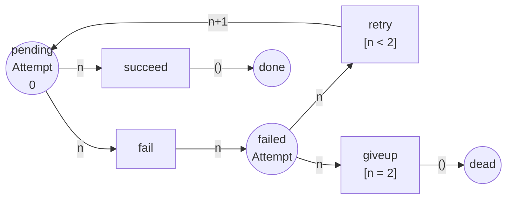

Code complet : [`code/petri-nets`](https://github.com/spareilleux/learn/tree/main/code/petri-nets). Cette leçon est imprimée par `dotnet run --project Examples -c Release -- l8`, comparée à [`expected/l8.txt`](https://github.com/spareilleux/learn/blob/main/code/petri-nets/expected/l8.txt).

Tout ce qui précède a été construit à partir de jetons indiscernables. Un jeton dans `full` veut dire « il y a un article dans le tampon » et rien d'autre — ni lequel, ni de quelle taille, ni combien de fois il a déjà été essayé.

C'est la même restriction que d'écrire une file d'`object` et de transtyper, ou une `ArrayList` d'avant les [génériques](https://learn.microsoft.com/dotnet/csharp/fundamentals/types/generics). Ça marche, et cela vous force à encoder tout ce que vous voulez distinguer sous forme de *places supplémentaires*.

Un **réseau de Petri coloré** donne une valeur au jeton. Chaque place a un **ensemble de couleurs** — un type — et tient des jetons de ce type ; chaque transition a des variables, une **garde** et des **expressions d'arc** disant quelle couleur elle prend et quelle couleur elle donne. Le modèle cesse de se répéter, exactement comme `Channel<T>` vous empêche d'écrire `ChannelOfOrder` et `ChannelOfInvoice`.

Le bénéfice et le piège sont tous deux dans cette leçon : le repliement est réel, et c'est un repliement de l'*image*, pas de l'espace d'états.

## Une politique de réessai avec une place de lettres mortes

L'exemple est celui que tout système à messages possède. Une livraison est en attente ; elle réussit, ou elle échoue ; un échec est réessayé jusqu'à une limite de tentatives, après quoi il part dans la place de lettres mortes. Quatre places, quatre transitions, et le jeton porte la tentative où il en est :

```
== A retry policy, in colour ==
coloured net retry
  colset Attempt = {0, 1, 2}
  place       pending : Attempt
  place       failed : Attempt
  place       done : UNIT
  place       dead : UNIT
  transition  succeed  var n : Attempt
  transition  fail  var n : Attempt
  transition  retry  var n : Attempt  [n < 2]
  transition  giveup  var n : Attempt  [n = 2]
  arc         pending -> succeed   n
  arc         succeed -> done   ()
  arc         pending -> fail   n
  arc         fail -> failed   n
  arc         failed -> retry   n
  arc         retry -> pending   n+1
  arc         failed -> giveup   n
  arc         giveup -> dead   ()
  M0          pending: 0
```



Quatre éléments de vocabulaire, chacun avec une traduction directe :

| réseau coloré | C# |
|---|---|
| un **ensemble de couleurs** `Attempt = {0, 1, 2}` | le paramètre de type : `record Delivery(int Attempt)` |
| une **variable** `var n : Attempt` | le motif qui lie la charge utile |
| une **garde** `[n < 2]` | la clause `when` d'un bras de `switch` |
| une **expression d'arc** `n+1` | la projection que vous écrivez dans le corps |

`UNIT` est l'ensemble de couleurs à une seule valeur. Une place de couleur `UNIT` tient des jetons qui ne portent rien, ce qui est précisément une place d'un réseau ordinaire — donc les réseaux P/T sont les réseaux colorés dont toutes les places sont `UNIT`, et rien des leçons 1 à 7 n'a été jeté.

## Le jeton qui sait à quelle tentative il en est

L'analyseur a une règle de tir à lui pour les réseaux colorés ([`Coloured.cs`](https://github.com/spareilleux/learn/blob/main/code/petri-nets/PetriNets/Coloured.cs)) : une transition est sensibilisée sous une *liaison* de sa variable quand la garde est vraie et que chaque place d'entrée a un jeton de la couleur que calcule l'expression d'arc.

```
== A token that carries the attempt it is on ==
            pending: 0
fail(n=0)   failed: 0
retry(n=0)  pending: 1
fail(n=1)   failed: 1
retry(n=1)  pending: 2
fail(n=2)   failed: 2
giveup(n=2) dead
```

Un seul jeton du début à la fin, et sa couleur est l'état du réessai. La ligne `retry(n=0)  pending: 1` est l'expression d'arc `n+1` faisant ce qu'un réseau P/T n'a aucun moyen d'exprimer : de l'arithmétique sur le jeton.

Et `giveup` ne tire qu'une fois que `n` vaut 2, parce que sa garde le dit. Sans la garde, une livraison partirait dans la place de lettres mortes dès son premier échec ; sans la garde `[n < 2]` de `retry`, l'expression `n+1` déborderait de l'ensemble de couleurs. La garde n'est pas de la documentation — elle décide quelles liaisons existent tout court.

## Le dépliage : le même réseau, sans couleur

Tout réseau coloré sur des ensembles de couleurs **finis** est un réseau P/T ordinaire déguisé. `Unfold()` l'écrit noir sur blanc : une place par (place, couleur), une transition par (transition, liaison que la garde accepte).

```
== The same net without colour: its unfolding ==
net retry
places      pending_0 pending_1 pending_2 failed_0 failed_1 failed_2 done dead
transitions succeed_0 succeed_1 succeed_2 fail_0 fail_1 fail_2 retry_0 retry_1 giveup_2
M0          (1, 0, 0, 0, 0, 0, 0, 0) = pending_0:1
arc         pending_0 -> succeed_0
arc         succeed_0 -> done
arc         pending_1 -> succeed_1
arc         succeed_1 -> done
arc         pending_2 -> succeed_2
arc         succeed_2 -> done
arc         pending_0 -> fail_0
arc         fail_0 -> failed_0
arc         pending_1 -> fail_1
arc         fail_1 -> failed_1
arc         pending_2 -> fail_2
arc         fail_2 -> failed_2
arc         failed_0 -> retry_0
arc         retry_0 -> pending_1
arc         failed_1 -> retry_1
arc         retry_1 -> pending_2
arc         failed_2 -> giveup_2
arc         giveup_2 -> dead
```

Lisez la liste des transitions. `retry` est devenue `retry_0` et `retry_1` — deux des trois liaisons — et `giveup` est devenue `giveup_2` seule. Les gardes n'ont pas survécu en tant que gardes ; elles ont été *évaluées et éliminées*, et il reste le réseau que vous auriez dessiné à la main si vous n'aviez jamais entendu parler de couleur. Le dépliage est écrit dans [`nets/retry.pnml`](https://github.com/spareilleux/learn/blob/main/code/petri-nets/nets/retry.pnml) comme tous les autres réseaux de ce cours, de sorte que n'importe quel outil P/T peut le lire.

Voilà toute la relation, et elle mérite d'être énoncée simplement : **pour des ensembles de couleurs finis, les réseaux colorés n'ajoutent aucun pouvoir d'expression.** Ils ajoutent de la notation. Les tests unitaires vérifient que tirer une transition colorée et tirer sa jumelle dépliée donnent le même marquage, donc le repliement n'est pas qu'une affirmation de cette leçon.

## Ce que le repliement achète vraiment

Voici la mesure. La même politique, avec la limite de tentatives qui grandit :

```
== What the unfolding costs ==
attempts  coloured places  coloured transitions  unfolded places  unfolded transitions  markings
       2                4                     4                8                     9         8
       3                4                     4               10                    12        10
       5                4                     4               14                    18        14
      10                4                     4               24                    33        24
      20                4                     4               44                    63        44
```

Les deux colonnes de gauche ne bougent jamais. Le modèle coloré d'une politique à vingt réessais est les mêmes quatre places et quatre transitions que le modèle à deux ; seul l'ensemble de couleurs a grandi, et un ensemble de couleurs est une déclaration.

Les trois colonnes de droite croissent linéairement, et la dernière est le point important. **Le nombre de marquages accessibles est inchangé par le repliement** — c'est le même 2·*k*+4 que vous ayez écrit le modèle en couleur ou à la main, parce qu'un marquage coloré *est* un vecteur sur les paires (place, couleur). La couleur vous épargne de dessiner le modèle. Elle ne vous épargne rien du tout à l'analyse.

C'est le résumé honnête de l'extension, et c'est la raison pour laquelle la leçon 15 porte sur les techniques de réduction plutôt que sur la notation. Si votre modèle a cent types de messages, la couleur transforme cent copies d'un diagramme en un seul diagramme ; l'espace d'états contient toujours les cent copies, et les outils qui s'en sortent — [CPN Tools](https://cpntools.org/) avec ses réductions par symétrie et par équivalence — s'en sortent en exploitant la symétrie que la couleur a rendue visible, pas en l'ignorant.

## Ce que le dépliage dit ensuite

Une fois déplié, toutes les questions des leçons 3 à 6 s'appliquent sans changement :

```
reachability graph of retry: 8 states, 9 firings
places pending_0 pending_1 pending_2 failed_0 failed_1 failed_2 done dead
  M0 = (1, 0, 0, 0, 0, 0, 0, 0)  pending_0:1
  M1 = (0, 0, 0, 0, 0, 0, 1, 0)  done:1
  M2 = (0, 0, 0, 1, 0, 0, 0, 0)  failed_0:1
  M3 = (0, 1, 0, 0, 0, 0, 0, 0)  pending_1:1
  M4 = (0, 0, 0, 0, 1, 0, 0, 0)  failed_1:1
  M5 = (0, 0, 1, 0, 0, 0, 0, 0)  pending_2:1
  M6 = (0, 0, 0, 0, 0, 1, 0, 0)  failed_2:1
  M7 = (0, 0, 0, 0, 0, 0, 0, 1)  dead:1
  M0 --succeed_0--> M1
  M0 --fail_0--> M2
  M2 --retry_0--> M3
  M3 --succeed_1--> M1
  M3 --fail_1--> M4
  M4 --retry_1--> M5
  M5 --succeed_2--> M1
  M5 --fail_2--> M6
  M6 --giveup_2--> M7
  dead marking M1 = (0, 0, 0, 0, 0, 0, 1, 0)  done:1
  dead marking M7 = (0, 0, 0, 0, 0, 0, 0, 1)  dead:1
```

Huit marquages, dont deux morts. Pour une fois ce n'est pas un bug : une livraison est *censée* se terminer, dans `done` ou dans `dead`, et un réseau qui modélise un processus fini doit avoir des marquages morts. Les propriétés le disent sans détour :

```
  bounded:       yes (1-bounded)
  safe:          yes
  deadlock-free: no
    dead marking (0, 0, 0, 0, 0, 0, 1, 0)  done:1
    dead marking (0, 0, 0, 0, 0, 0, 0, 1)  dead:1
  live:          no
    succeed_0  L1, can fire once
    ...
  reversible:    no
  home states:   none
```

Tout en L1, rien de vivant, aucun état d'accueil, non réversible. Lu contre la leçon 4, cela ressemble à une catastrophe, et lu contre le système modélisé, c'est correct : la politique de réessai se termine, elle ne boucle jamais indéfiniment, et il y a exactement deux façons pour elle de finir. La leçon 10 donne à cette forme son propre nom — un réseau de workflow — et sa propre propriété de correction, la *soundness*, qui demande précisément que toute exécution se termine dans l'un des marquages finaux prévus et que rien ne reste en arrière.

Deux autres choses que cette lecture donne gratuitement. Tout message atteint une fin, parce que le graphe est acyclique et fini. Et rien ne reste en arrière : tout marquage mort a exactement un jeton, dans `done` ou dans `dead`, les six autres places étant vides — pas de livraison à moitié traitée coincée dans `failed_1`.

## La garde est ce qui retire les liaisons

```
== The guard is what removes the bindings ==
succeed    guard (none)   bindings kept: n=0 n=1 n=2
fail       guard (none)   bindings kept: n=0 n=1 n=2
retry      guard n < 2    bindings kept: n=0 n=1
giveup     guard n = 2    bindings kept: n=2
```

Neuf transitions dans le dépliage plutôt que douze, parce que deux gardes ont retiré trois liaisons à elles deux. Une garde dans un réseau coloré est un filtre *statique* sur le dépliage — elle n'apparaît jamais à l'exécution, elle décide de ce qui existe.

C'est une vraie différence avec la clause `when` à laquelle elle correspond en C#. `case Delivery { Attempt: < 2 }` est évaluée quand le message arrive ; `[n < 2]` est évaluée quand le modèle est construit. Deux conséquences : une garde ne peut mentionner que les variables de sa propre transition, et un réseau coloré à garde coûteuse ne coûte rien à l'exécution et tout au dépliage.

## Où la couleur s'arrête

- **Les ensembles de couleurs infinis.** Rien de ce qui précède n'exigeait que l'ensemble de couleurs soit petit, mais il fallait qu'il soit *fini*. Un `Attempt` parcourant tous les entiers naturels ne peut pas être déplié, et les réseaux colorés sur des ensembles de couleurs infinis sont Turing-complets — toutes les questions de la leçon 4 deviennent indécidables. En pratique, les outils bornent l'ensemble de couleurs ou acceptent qu'ils sont en train de vérifier un programme.
- **Une variable par transition.** L'analyseur de ce cours lie une variable par transition, ce qui suffit pour le réessai et ne suffit pas pour une transition qui joint deux messages différents. Les vrais réseaux colorés lient un tuple, et leur dépliage croît comme le produit des ensembles de couleurs plutôt que comme leur somme.
- **L'espace d'états est toujours là.** Dit trois fois dans cette leçon parce que c'est ce que les gens comprennent de travers à propos de l'extension.

La norme est [ISO/IEC 15909-1:2019](https://www.iso.org/standard/67235.html), qui définit les réseaux de haut niveau et la sous-classe des *réseaux symétriques* — en gros, les réseaux colorés dont les ensembles de couleurs et les expressions sont assez restreints pour que la symétrie puisse être exploitée automatiquement. L'implémentation de référence est [CPN Tools](https://cpntools.org/), dont les inscriptions s'écrivent en CPN ML, un dialecte de Standard ML : dans ce monde, les expressions d'arc sont de vraies fonctions et les ensembles de couleurs de vrais types, et la notation de cette leçon en est le petit coin qui se déplie.

## Points clés

- Un **réseau coloré** donne une valeur aux jetons. Une place a un **ensemble de couleurs** (un type), une transition a une variable, une **garde** et des **expressions d'arc**.
- `UNIT` est l'ensemble de couleurs à une valeur, donc tout réseau P/T des leçons 1 à 7 est un réseau coloré dont toutes les places ont la couleur `UNIT`.
- Sur des ensembles de couleurs **finis**, tout réseau coloré se **déplie** en un réseau P/T ordinaire : une place par couleur, une transition par liaison que la garde accepte. Aucun pouvoir d'expression n'est gagné.
- **La couleur replie le modèle, pas l'espace d'états.** Quatre places et quatre transitions à toute limite de tentatives ; les marquages accessibles croissent toujours en 2·*k*+4.
- Une **garde** est évaluée au moment du dépliage du réseau, pas à l'arrivée d'un jeton. Elle décide quelles transitions existent.
- Le réseau de réessai est 1-borné, a **deux marquages morts** et aucune transition vivante, et c'est la bonne réponse pour quelque chose qui est censé se terminer. La leçon 10 nomme cette forme.
- Sur des ensembles de couleurs **infinis**, il n'y a plus de dépliage et plus de décidabilité.

## Exercices

1. Ajoutez un ensemble de couleurs `Priority = {low, high}` au réseau de réessai pour qu'une livraison prioritaire soit réessayée cinq fois et une livraison ordinaire une seule fois. Combien de places et de transitions le modèle coloré a-t-il, et combien le dépliage en a-t-il ?
2. Le dépliage a neuf transitions et le réseau coloré en a quatre. Lequel des deux préféreriez-vous remettre à un collègue qui relit la politique de réessai, et lequel à un model checker ? Dites pourquoi en une phrase chacun.
3. Mettez la limite de tentatives à 0 et prédisez le dépliage avant de le lancer.
4. La leçon dit que la couleur n'épargne rien à l'analyse. Nommez la seule situation où c'est faux, et dites ce que l'outil doit savoir pour l'exploiter.

<details>
<summary>Solutions</summary>

**1.** Le modèle coloré garde quatre places et ne gagne rien structurellement : l'ensemble de couleurs devient un produit, `Attempt × Priority`, la garde de `retry` devient `n < limit(p)` et celle de `giveup` devient `n = limit(p)`. Quatre places et quatre transitions, toujours. Le dépliage est le produit : `pending` et `failed` deviennent 6 × 2 = 12 places chacune pour une plage de tentatives de 0 à 5, plus `done` et `dead`, et les transitions se multiplient de la même façon. Ce rapport — constant à gauche, produit à droite — est tout l'argument en faveur de la notation, et tout l'avertissement sur ce qu'elle cache.

**2.** Le coloré au collègue : c'est la politique, sur une page, et la garde se lit comme la phrase dans laquelle la politique a été écrite. Le déplié au model checker, ou plutôt à tout ce qui doit raisonner dessus : toutes les techniques des leçons 2 à 6 sont définies sur les réseaux P/T, et ce sont les invariants, les siphons et les trappes du dépliage qui portent les preuves. C'est exactement ce que fait l'analyseur — la couleur pour le lecteur, le dépliage pour l'analyse.

**3.** Avec la limite à 0, l'ensemble de couleurs est `{0}`, la garde `n < 0` de `retry` n'accepte rien et la garde `n = 0` de `giveup` accepte la seule valeur. L'analyseur le confirme :

```
== Exercise 3: a guard no binding satisfies deletes the transition ==
retry keeps 0 bindings when the limit is 0
net retry-0
places      pending_0 failed_0 done dead
transitions succeed_0 fail_0 giveup_0
M0          (1, 0, 0, 0) = pending_0:1
```

Quatre places, trois transitions : `retry` a entièrement disparu du dépliage. Une transition dont aucune liaison ne satisfait la garde n'est pas une transition qui ne tire jamais — c'est une transition qui n'existe pas, ce qui est un énoncé plus fort et plus utile que le L0 de la leçon 4.

**4.** Quand les couleurs sont **symétriques** — quand les permuter renvoie le réseau sur lui-même. Alors l'espace d'états peut être quotienté par le groupe de symétrie et l'analyse tourne sur les classes d'équivalence, ce à quoi servent la méthode de symétrie de CPN Tools et les réseaux symétriques d'ISO/IEC 15909-1. L'outil doit connaître la symétrie, ce qui veut dire qu'elle doit être déclarée ou déductible d'ensembles de couleurs et d'expressions restreints — et cette restriction est toute la raison pour laquelle la sous-classe *symétrique* existe séparément des réseaux colorés en général. Dans le réseau de réessai, il n'y a aucune symétrie à exploiter : les tentatives sont ordonnées, et `n+1` casse toute permutation.

</details>

## Sources

- Kurt Jensen et Lars M. Kristensen, *Coloured Petri Nets: Modelling and Validation of Concurrent Systems*, Springer, 2009, [doi:10.1007/b95112](https://doi.org/10.1007/b95112). La référence pour le formalisme et pour CPN Tools. Notice confirmée via Crossref ; non lu. *À vérifier.*
- [CPN Tools](https://cpntools.org/), l'implémentation, et CPN ML, le langage d'inscription.
- [ISO/IEC 15909-1:2019](https://www.iso.org/standard/67235.html), *Systems and software engineering — High-level Petri nets — Part 1: Concepts, definitions and graphical notation*, où sont définies les classes des réseaux de haut niveau et des réseaux symétriques. La notice a été vérifiée sur iso.org ; la norme coûte 227 CHF et je ne l'ai pas lue. *À vérifier.*
- L'implémentation que cette leçon imprime : [`Coloured.cs`](https://github.com/spareilleux/learn/blob/main/code/petri-nets/PetriNets/Coloured.cs), avec le dépliage et les tests qui confrontent un tir coloré à sa jumelle dépliée.
</content>
</invoke>
