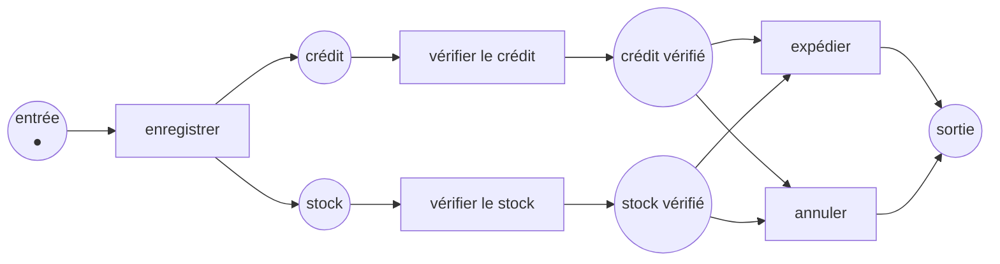

Code complet : [`code/petri-nets`](https://github.com/spareilleux/learn/tree/main/code/petri-nets). Cette leçon est imprimée par `dotnet run --project Examples -c Release -- l10`, comparée à [`expected/l10.txt`](https://github.com/spareilleux/learn/blob/main/code/petri-nets/expected/l10.txt).

Les réseaux des neuf leçons précédentes tournent indéfiniment. Un producteur produit, un consommateur consomme, un verrou est pris et rendu, et la question intéressante est de savoir si cela peut mal tourner dans l'heure ou dans l'année.

Un processus métier a la forme exactement inverse. Une commande arrive, quelque chose lui arrive, et elle repart. Il a une seule entrée et une seule sortie, il est censé se terminer, et la question n'est pas de savoir s'il se bloque en général mais si **ce cas-ci** — cette commande, ce dossier, ce ticket — atteint la fin sans rien laisser derrière.

Cette forme a un nom, une définition assez petite pour être vérifiée, et une propriété de correction appelée **soundness** qu'un programme peut décider. C'est aussi la partie de la théorie des réseaux de Petri qui s'est échappée dans l'industrie : tout moteur de workflow et tout diagramme BPMN est à une traduction de ce que fait cette leçon.

## Une entrée, une sortie

Un **réseau workflow** est un réseau de Petri ordinaire soumis à trois restrictions :

1. une place **source**, sans arc entrant — le cas y arrive ;
2. une place **puits**, sans arc sortant — le cas en repart ;
3. tout nœud est sur un chemin de la source au puits, donc rien n'est inaccessible et rien n'est un cul-de-sac.

La troisième condition est plus facile à vérifier qu'il n'y paraît. Ajoutez une transition du puits vers la source — le **court-circuit** — et elle devient exactement « ce réseau est fortement connexe », ce que l'analyseur décide depuis la [leçon 6](../06-structural-classes/).

Voici une commande, dans la forme qu'a presque tout processus : un enregistrement, deux vérifications qui tournent en même temps, et une décision à la fin.

```
== An order, as a workflow net ==
net order-sound
places      in credit stock credit-done stock-done out
transitions register check-credit check-stock ship cancel
M0          (1, 0, 0, 0, 0, 0) = in:1
arc         in -> register
arc         register -> credit
arc         register -> stock
arc         credit -> check-credit
arc         check-credit -> credit-done
arc         stock -> check-stock
arc         check-stock -> stock-done
arc         credit-done -> ship
arc         stock-done -> ship
arc         ship -> out
arc         credit-done -> cancel
arc         stock-done -> cancel
arc         cancel -> out
```



```
== What makes it a workflow net ==
source: in
sink:   out
why not: (it is one)
short-circuited net adds: t-star
```

Deux formes méritent un nom, parce que ce sont les deux passerelles de toute notation de processus :

- **`register` est un ET-divergent** : une transition avec deux places de sortie. Les deux branches démarrent et tournent en parallèle — le marquage après `register` contient deux jetons, ce qu'une machine à états ne sait pas dire.
- **le choix entre `ship` et `cancel` est un OU-exclusif divergent** : deux transitions en concurrence pour les mêmes jetons. Exactement une tire. Que le choix soit *libre* ici — les deux transitions voient les mêmes places d'entrée — fait de ce réseau un réseau à choix libre, dont la [leçon 6](../06-structural-classes/) donne les théorèmes.

Une convergence, ce sont les deux mêmes formes retournées : un ET-convergent est une transition qui attend plusieurs places, un OU-exclusif convergent est une place alimentée par plusieurs transitions.

## La soundness, en trois conditions

Un réseau workflow est **sain** (*sound*) quand, démarré avec un jeton dans la source :

1. **possibilité de terminer** — depuis tout marquage accessible, le marquage à un jeton dans le puits reste accessible. Le cas peut toujours encore se terminer ;
2. **terminaison propre** — aucun marquage accessible ne met un jeton dans le puits pendant qu'autre chose tourne encore. Terminer veut dire terminé ;
3. **aucune transition morte** — toute tâche peut être exécutée par un cas. Une tâche qu'aucun cas n'atteint est soit un bogue, soit un mensonge du diagramme.

La commande ci-dessus satisfait les trois :

```
== Soundness, condition by condition ==
net: order-sound
  reachable markings:  6
  option to complete:  yes
  proper completion:   yes
  no dead transitions: yes
  sound: yes
```

Six marquages pour un processus à deux branches concurrentes. Remarquez que l'analyseur rapporte la condition qui échoue et le marquage qui la casse, pas un verdict : « non sain » tout seul n'est pas quelque chose sur quoi un responsable de processus peut agir.

## L'erreur la plus courante en BPMN

Diviser avec un ET, converger avec un OU exclusif. Cela se lit parfaitement sur un diagramme — *vérifier le crédit, vérifier le stock, puis terminer* — et c'est faux :

```
== An AND split joined by an XOR: the case ends while a branch is still running ==
net: order-and-xor
  reachable markings:  10
  option to complete:  no
    the final marking is never reached, from anywhere
  proper completion:   no
    finishes with something left: (0, 0, 1, 0, 0, 1); (0, 1, 0, 0, 0, 1); (0, 0, 0, 0, 1, 1); and 2 more
  no dead transitions: yes
  sound: no
```

Les deux branches ont reçu un jeton ; l'une ou l'autre seule déclare le cas terminé. Le puits reçoit donc son jeton pendant que l'autre branche travaille encore, puis en reçoit un second. `(0, 0, 0, 0, 0, 2)` est dans cette liste : **deux** jetons dans le puits, une commande livrée deux fois.

Relisez la première ligne : le marquage final n'est jamais atteint *depuis nulle part*. Pas « certains chemins se coincent » — l'état final correct n'existe pas du tout dans ce réseau. Toute tâche peut encore s'exécuter, donc un test qui exerce chaque tâche passe. Le défaut est dans la convergence, et seulement là.

## L'erreur miroir

Diviser avec un OU exclusif, converger avec un ET. L'enregistrement choisit une branche ; l'expédition attend les deux :

```
== An XOR split joined by an AND: the case stops one step short ==
net: order-xor-and
  reachable markings:  5
  option to complete:  no
    the final marking is never reached, from anywhere
  proper completion:   yes
  no dead transitions: no
    never enabled: ship
  sound: no
```

La terminaison propre tient — rien n'est laissé derrière, parce que rien ne se termine jamais. Ce couple mérite d'être retenu : une condition peut être satisfaite à vide, et un vérificateur qui annoncerait seulement « 2 conditions sur 3 » serait inutile. La condition qui échoue nomme `ship` comme une transition qu'aucun cas n'atteindra jamais, et c'est la phrase à porter à qui a dessiné le diagramme.

## Sain ne veut pas dire terminant

Une relecture qui peut renvoyer le cas en reprise :

```
== A rework loop: sound, and able to run for ever without finishing ==
net: order-rework
  reachable markings:  4
  option to complete:  yes
  proper completion:   yes
  no dead transitions: yes
  sound: yes
a cycle that never approves: review rework
```

Le réseau est sain, et il contient un cycle où `approve` ne tire jamais. Un cas peut être repris indéfiniment.

C'est la distinction que la [leçon 4](../04-properties/) faisait entre vivacité et famine, dans le vocabulaire des processus : la soundness dit que le cas peut **toujours encore** se terminer, jamais qu'il **va** le faire. Si l'exigence est « tout cas se termine », la soundness n'est pas la bonne propriété — il faut borner la boucle, donc mettre le compteur de tentatives dans le réseau, ce qui est le réseau coloré de la [leçon 8](../08-coloured-nets/), ou un taux et un temps moyen, ce qui est la [leçon 9](../09-time-and-probability/).

## Décidé deux fois

Les trois conditions ci-dessus sont vérifiées sur le graphe d'accessibilité du réseau. Il existe une route complètement différente vers le même verdict.

**Théorème de van der Aalst (1997)** : un réseau workflow est sain exactement quand son réseau court-circuité — celui qui a une transition du puits vers la source — est **vivant** et **borné**.

Ce sont les deux propriétés de la [leçon 4](../04-properties/), calculées par du code qui ne sait rien des workflows :

```
== The same four verdicts through the short circuit ==
net              sound?  live?  bounded?  live and bounded?  agree?
order-sound      yes     yes    yes       yes                yes
order-and-xor    no      no     no        no                 yes
order-xor-and    no      no     yes       no                 yes
order-rework     yes     yes    yes       yes                yes
```

Quatre réseaux, deux routes indépendantes, quatre accords — et un test unitaire échoue si elles cessent un jour de s'accorder. C'est la discipline de la file résolue deux fois de la [leçon 9](../09-time-and-probability/), et pour la même raison : les réseaux intéressants sont ceux où une seule route existe.

Le théorème n'est pas une coïncidence, et la troisième colonne dit pourquoi. Regardez le réseau cassé à travers son court-circuit :

```
== What the short circuit is doing ==
order-and-xor-short-circuited: bound unbounded
  register        L1
  check-credit    L1
  check-stock     L1
  finish-credit   L1
  finish-stock    L1
  t-star          L1
```

**Non borné.** Chaque cas laisse un jeton en trop, `t-star` renvoie les jetons du puits vers la source, et les restes s'accumulent sans limite. « La terminaison propre échoue » et « le court-circuit n'est pas borné » sont le même fait dit deux fois — un jeton laissé derrière, vu une fois par cas ou accumulé sur une infinité de cas.

Et toutes les transitions sont seulement L1, parce que le graphe ne s'est jamais terminé : l'analyseur s'est arrêté à sa limite, donc il ne peut dire que « chaque transition tire au moins une fois ». Un réseau non borné n'est pas vivant, ce qui est l'autre moitié du théorème.

Le réseau miroir se court-circuite en quelque chose de borné mais non vivant : rien ne s'accumule, et `ship` ne tire jamais. Les deux échecs sont des propriétés différentes du même court-circuit, et c'est pourquoi le théorème a besoin des deux.

## Traduire depuis et vers BPMN

[BPMN 2.0](https://www.omg.org/spec/BPMN/2.0/) est la notation dans laquelle les processus sont réellement dessinés. Son cœur se traduit directement en réseaux workflow :

| BPMN | Réseau workflow |
|---|---|
| Tâche, activité | Transition |
| Flux de séquence | Place entre deux transitions |
| Passerelle parallèle (ET), divergente / convergente | Transition à plusieurs places de sortie / d'entrée |
| Passerelle exclusive (OU), divergente / convergente | Place à plusieurs transitions de sortie / place alimentée par plusieurs transitions |
| Événement de début | La place source |
| Événement de fin | La place puits |

Ce qui ne se traduit pas compte tout autant. Les **passerelles inclusives** (OU — *prendre n'importe quel sous-ensemble non vide de branches, puis attendre exactement celles-là*) n'ont pas de traduction locale : la convergence doit savoir quelles branches ont été prises, et un marquage ne dit pas cela. Les **régions d'annulation**, les **événements frontières** et les **flux d'exception** retirent des jetons là où ils se trouvent, ce qu'un réseau ordinaire ne sait pas faire — il faut un **réseau à réinitialisation**, où l'accessibilité est indécidable. Les **données** et les **ressources** ne sont pas dans le modèle du tout.

Voilà le résumé honnête de la relation : le flux de contrôle d'un diagramme BPMN est un réseau workflow, et tout ce que le diagramme dit des données, des rôles, du temps et des exceptions ne l'est pas.

## L'autre sens : le process mining

Tout ce qui précède part d'un modèle. Le **process mining** part du journal — les événements qu'un moteur de workflow, un ERP ou un outil de tickets écrit déjà — et produit le modèle.

Ses trois questions sont :

- **découverte** : quel réseau explique ce journal ? L'algorithme α lit les relations d'ordre entre événements et en construit un réseau workflow ; les algorithmes suivants traitent mieux le bruit et les boucles.
- **conformité** : le journal correspond-il au modèle, et le modèle autorise-t-il des choses que le journal ne montre jamais ? Les deux nombres sont la *fitness* et la *précision*, et ils tirent en sens inverse — un réseau qui autorise tout correspond parfaitement à tout journal.
- **enrichissement** : remettre les durées et les fréquences mesurées sur le réseau, ce qui est le temps de la [leçon 9](../09-time-and-probability/) pris dans les données au lieu d'être supposé.

Rien de cela n'est implémenté dans ce cours. C'est nommé ici parce que c'est là que le formalisme gagne vraiment sa vie, et parce que l'outil où la plus grande partie s'en fait, [ProM](https://promtools.org/), parle le même [PNML](https://www.pnml.org/) dans lequel la leçon 11 échange des réseaux. *À vérifier : je n'ai pas fait tourner ProM.*

## Où cela s'arrête

- **La soundness a des variantes, et elles ne s'accordent pas.** La soundness *relâchée* demande seulement que chaque transition soit sur un chemin de la source au puits. La soundness *faible* laisse tomber la condition des transitions mortes. La soundness *généralisée* demande *k* jetons dans la source au lieu d'un, ce qui est strictement plus fort et c'est ce qu'il faut si les cas partagent des ressources. Dire « le processus est sain » sans dire laquelle, ce n'est pas dire grand-chose.
- **Décider la soundness coûte aussi cher que l'espace d'états.** C'est EXPSPACE-difficile en général, comme tout ce qui est en aval de l'accessibilité. Pour les réseaux workflow **à choix libre**, c'est polynomial, par le théorème du rang — et le choix libre est exactement la restriction « aucune tâche ne se dispute une ressource tout en choisissant une branche », que la plupart des processus dessinés satisfont par hasard. C'est la raison pratique pour laquelle la théorie est utilisable.
- **Un cas à la fois.** Toute cette leçon regarde un jeton entrant dans la source. Les vrais processus font passer des milliers de cas par les mêmes tâches, en concurrence pour les mêmes personnes et les mêmes machines, et cette interaction est invisible ici. La soundness généralisée en est le premier pas ; un réseau coloré avec une place de ressources est le modèle honnête.

## À retenir

- Un **réseau workflow** a une source, un puits, et rien en dehors du chemin entre les deux. La troisième condition est « le court-circuit est fortement connexe ».
- La **soundness** est faite de trois conditions : le cas peut toujours encore se terminer, terminer ne laisse rien derrière, et aucune tâche n'est inatteignable. Un vérificateur doit nommer laquelle a échoué et où.
- Les deux erreurs de passerelles — **ET divergent avec OU exclusif convergent**, **OU exclusif divergent avec ET convergent** — cassent presque tous les processus qui sont cassés, et elles font échouer des conditions *différentes*. La première livre la commande deux fois ; la seconde ne la livre jamais.
- Une condition peut tenir à vide. `order-xor-and` termine proprement parce qu'il ne termine jamais.
- **Sain ne veut pas dire terminant.** Une boucle de reprise est saine et peut tourner indéfiniment, exactement comme une transition vivante peut être affamée.
- Le **théorème de van der Aalst** transforme la soundness en vivacité plus bornitude du court-circuit — deux propriétés de la leçon 4, calculées par du code qui ne sait rien des processus. Servez-vous-en comme d'une vérification, pas d'un raccourci.
- Un jeton laissé derrière et un court-circuit non borné sont le même défaut, compté une fois ou compté indéfiniment.
- Les passerelles parallèles et exclusives de BPMN se traduisent exactement en réseaux. Les passerelles inclusives, l'annulation, les données et les ressources, non.

## Exercices

1. La commande se termine soit par `ship`, soit par `cancel`. Ajoutez une étape qui doit avoir lieu après les deux — une facturation — et dites, avant de l'exécuter, si le réseau est toujours sain et combien il a de marquages.
2. `order-and-xor` n'est pas sain. Réparez-le en changeant exactement une chose, et dites laquelle des trois conditions votre réparation corrige.
3. Prenez le producteur et le consommateur de la leçon 1. Est-ce un réseau workflow ? Répondez sans lancer l'analyseur, puis vérifiez.
4. Un processus a une tâche annulable en cours d'exécution, qui retire le cas d'où qu'il en soit. Dites pourquoi aucun arc ajoutable à un réseau workflow ne fait cela, et ce que le modèle devrait devenir.

<details>
<summary>Solutions</summary>

**1.** Toujours sain, et il gagne exactement un marquage. `ship` et `cancel` alimentent tous deux une nouvelle place `decided`, une transition `invoice` la mène à `out`, et `out` cesse d'être la cible de deux transitions.

```
net: ex1-invoice
  reachable markings:  7
  option to complete:  yes
  proper completion:   yes
  no dead transitions: yes
  sound: yes
```

J'avais prédit 8 et l'analyseur a dit 7, ce qui mérite d'être avoué parce que la raison est le point de l'exercice. Une étape en séquence ajoute **un** marquage — celui où le jeton est dans `decided` — quoi qu'il y ait eu avant. Seule la concurrence multiplie : ce sont les deux vérifications qui ont transformé deux étapes en quatre marquages. Ajouter une tâche après une convergence *correcte* coûte un état ; en ajouter une dans une branche parallèle coûte un facteur.

**2.** Remplacez les deux transitions de fin par une seule qui consomme à la fois `credit-done` et `stock-done`. Cela transforme le OU exclusif convergent en ET convergent et fait du réseau le `order-sound` moins le choix. Cela corrige directement la **terminaison propre** — rien n'est laissé derrière parce que rien ne termine trop tôt — et la possibilité de terminer suit, parce que le marquage final devient accessible :

```
net: ex2-repaired
  reachable markings:  6
  option to complete:  yes
  proper completion:   yes
  no dead transitions: yes
  sound: yes
```

La mauvaise réparation instructive consiste à forcer `out` à ne contenir qu'un jeton en ajoutant une place qui le limite. Cela ne répare pas le processus ; cela cache le second jeton en bloquant le réseau à la place, et le vérificateur déplace sa plainte de la terminaison propre vers la possibilité de terminer. Une contrainte de capacité n'est pas une correction de correction.

**3.** Ce n'en est pas un. Toute place du producteur et du consommateur a un arc entrant — `ready` depuis `deposit`, `free` depuis `take`, et ainsi de suite — donc il n'y a pas de source, et par le même argument pas de puits. L'analyseur le dit :

```
no place is a source: every place has an incoming arc, so nothing starts the case
```

Ce n'est pas un défaut du réseau. C'est la différence entre un système, qui tourne indéfiniment, et un cas, qui arrive et repart. La plupart des réseaux de ce cours sont de la première espèce, et la soundness n'est pas une question qu'on peut leur poser du tout.

**4.** Un arc retire un nombre fixe de jetons d'une place *nommée*. L'annulation doit retirer les jetons qui existent, où qu'ils soient, dans un sous-ensemble inconnu de places — et la transition devrait être franchissable quel qu'en soit le nombre, ce qu'aucun poids d'arc n'exprime. L'encoder à la main veut dire une transition par configuration possible de la région d'annulation, c'est-à-dire l'explosion combinatoire écrite dans le modèle au lieu d'être découverte par l'analyseur.

Le modèle doit devenir un **réseau à réinitialisation**, avec des arcs qui vident une place quoi qu'elle contienne. Le prix est sévère et vaut d'être connu : l'accessibilité y est indécidable, et la bornitude avec elle. C'est l'exemple le plus net du cours d'une extension qui achète l'expressivité au prix de toute la théorie — sujet de la leçon 15.

</details>

## Sources

- Wil van der Aalst, « Verification of Workflow Nets », dans *Application and Theory of Petri Nets 1997*, Springer LNCS 1248, [doi:10.1007/3-540-63139-9_48](https://doi.org/10.1007/3-540-63139-9_48) — où les réseaux workflow, la soundness et le théorème du court-circuit sont définis. Notice confirmée via Crossref ; non lu. *À vérifier.*
- Wil van der Aalst, « The Application of Petri Nets to Workflow Management », *Journal of Circuits, Systems and Computers* 8(1), 1998, [doi:10.1142/S0218126698000043](https://doi.org/10.1142/S0218126698000043) — la version panoramique, et celle qu'on cite d'habitude pour la correspondance avec BPMN. Notice confirmée via Crossref ; non lu. *À vérifier.*
- Wil van der Aalst, *Process Mining: Data Science in Action*, 2e édition, Springer, 2016, [doi:10.1007/978-3-662-49851-4](https://doi.org/10.1007/978-3-662-49851-4) — découverte, conformité et enrichissement, et les algorithmes nommés plus haut. Notice confirmée via Crossref ; non lu. *À vérifier.*
- [BPMN 2.0](https://www.omg.org/spec/BPMN/2.0/), la spécification de l'OMG dont part le tableau des passerelles.
- Verbeek, Basten et van der Aalst, « Diagnosing Workflow Processes using Woflan », *The Computer Journal* 44(4), 2001, [doi:10.1093/comjnl/44.4.246](https://doi.org/10.1093/comjnl/44.4.246) — le vérificateur de soundness dont cette leçon imite l'habitude de dire *quelle* condition a échoué, et avec quel marquage. Notice confirmée via Crossref ; non lu, et Woflan lui-même n'a pas été exécuté ici. *À vérifier.*
- [ProM](https://promtools.org/), la boîte à outils de process mining dans laquelle Woflan vit désormais, et où les algorithmes de découverte et de conformité ci-dessus sont implémentés. Non exécuté ici. *À vérifier.*
- L'implémentation que cette leçon imprime : [`Workflow.cs`](https://github.com/spareilleux/learn/blob/main/code/petri-nets/PetriNets/Workflow.cs), avec les trois conditions, le court-circuit, et les tests qui forcent les deux routes à s'accorder.
