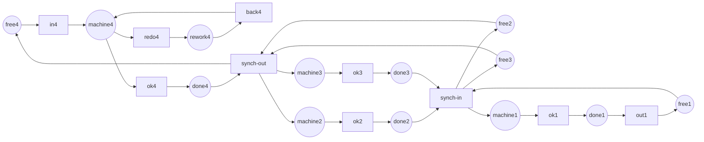

Code complet : [`code/petri-nets`](https://github.com/spareilleux/learn/tree/main/code/petri-nets). Cette leçon est imprimée par `dotnet run --project Examples -c Release -- l12`, comparée à [`expected/l12.txt`](https://github.com/spareilleux/learn/blob/main/code/petri-nets/expected/l12.txt).

Une leçon intitulée « applications industrielles » veut d'ordinaire dire une bibliographie : une liste d'articles où quelqu'un a modélisé une usine, et l'affirmation que cela s'est bien passé. C'est infalsifiable, et ce n'est pas ainsi que le reste de ce cours fonctionne.

Il existe une meilleure source. Le [Model Checking Contest](https://mcc.lip6.fr/) se tient chaque année à la conférence sur les réseaux de Petri. On donne aux outils une collection publique de modèles — 1 953 instances dans l'édition 2026 — on leur pose la même question sur chacun, et les résultats sont publiés intégralement, réponses comprises. Les modèles viennent de l'atelier, de la conception de protocoles, du matériel, de la biologie des systèmes. Ce sont les applications industrielles, sous forme de fichiers.

Cette leçon poursuit donc ce que la [leçon 11](../11-tools-and-interoperability/) a commencé. Elle prend vingt et une de ces instances, y fait tourner l'analyseur de ce cours, et compare chacun des quatre nombres avec ce que dit le concours. Toutes les autres leçons vérifient cet analyseur contre lui-même ; celle-ci le vérifie contre des nombres calculés par six autres outils, sur des réseaux que personne ici n'a écrits.

## Ce que le concours demande

L'examen *StateSpace* du concours demande quatre nombres sur un réseau :

- combien de marquages sont accessibles ;
- combien d'arcs a le graphe d'accessibilité ;
- le plus grand nombre de jetons qu'une place détient jamais ;
- le plus grand nombre de jetons qu'un marquage entier détient jamais.

Un analyseur qui s'accorde sur les quatre a la règle de tir, le lecteur et le graphe justes. Un analyseur qui s'accorde sur le premier et pas sur le troisième a un défaut plus subtil que ce que trouverait n'importe quel test unitaire de ce dépôt.

Le concours publie un `estimated result` par instance : la valeur sur laquelle s'accorde une majorité des outils engagés, pondérée par le taux de confiance mesuré de chacun. Cette colonne est l'oracle de cette leçon. Elle est arrondie au-delà du million, si bien que pour les deux plus grandes instances les chiffres utilisés ici sont ceux que `tedd`, `TY` et la médaille d'or 2025 ont chacun imprimés, à l'identique.

## Les cinq industries, et celle qui est maigre

```
== The contest's models, by industry ==
Model Checking Contest 2026, StateSpace examination, raw-result-analysis.csv
instance                        markings    arcs          what it models
-- manufacturing
FMS-PT-00002                    3444        16311         a flexible manufacturing system, three part types
Kanban-PT-00005                 2546432     24460016      four kanban cells, work released against a free card
SwimmingPool-PT-01              89621       450003        a swimming pool where bags and baskets are the resources
ResAllocation-PT-R003C003       92          257           processes taking shared resources in a fixed order
ResAllocation-PT-R010C002       6144        20480         the same, ten resources and two processes
-- protocols
TokenRing-PT-005                166         365           a token ring, the token being the right to speak
TokenRing-PT-010                58905       294050        the same ring with ten stations
Raft-PT-02                      7381        55824         the leader election of the Raft consensus algorithm
DrinkVendingMachine-PT-02       1024        7680          a vending machine and two customers
BridgeAndVehicles-PT-V04P05N02  2874        7160          a one-lane bridge with vehicles on both sides
Railroad-PT-005                 1838        7699          trains and a controller over a shared crossing
CircularTrains-PT-012           195         496           twelve trains on a circular track, one section each
-- hardware and shared memory
SharedMemory-PT-000005          1863        10395         processors contending for one memory bus
Dekker-PT-010                   6144        171530        Dekker's mutual exclusion, ten processes
Peterson-PT-2                   20754       62262         Peterson's mutual exclusion
DatabaseWithMutex-PT-02         153         312           database sites replicating under a mutex
-- biochemistry
ERK-PT-000001                   13          30            the ERK signalling pathway, one molecule of each species
ERK-PT-000010                   47047       372372        the same pathway, ten molecules of each
Angiogenesis-PT-01              110         288           the signalling that makes blood vessels grow
CircadianClock-PT-000001        128         624           the gene circuit of a circadian clock
-- security
QuasiCertifProtocol-PT-02       1029        3084          a certification protocol for electronic documents
```

Les regroupements sont de moi ; les modèles et les nombres sont ceux du concours. Quatre des cinq industries du [plan](../) de ce cours sont bien représentées. **La sécurité ne l'est pas.** Une instance, et c'est un protocole plutôt qu'un modèle de contrôle d'accès. Quoi que fassent les réseaux de Petri dans la recherche en sécurité, cela n'arrive pas dans ce banc d'essai, et je ne vais pas prétendre le contraire à partir d'une liste de titres d'articles.

Ce que chaque industrie demande au modèle diffère, et la question décide de quelle leçon de ce cours vous avez besoin :

| Industrie | Ce qu'est un jeton | La question | Où elle a été traitée |
|---|---|---|---|
| Atelier flexible | une pièce, une palette, une carte kanban | un tampon peut-il déborder ; quel est le débit | [4](../04-properties/), [5](../05-invariants/), [9](../09-time-and-probability/) |
| Protocoles | un message, un droit d'émettre | peut-il se bloquer ; chaque station a-t-elle son tour | [4](../04-properties/), [3](../03-the-reachability-graph/) |
| Matériel, mémoire partagée | une requête, un verrou, un signal | est-ce sauf ; deux maîtres peuvent-ils tenir le bus | [4](../04-properties/), [7](../07-modelling-concurrency/) |
| Biochimie | une molécule | quels états sont seulement accessibles ; qu'est-ce qui est conservé | [3](../03-the-reachability-graph/), [5](../05-invariants/) |
| Sécurité | un identifiant, un certificat | ce marquage-là, le mauvais, est-il atteignable | [3](../03-the-reachability-graph/) |

La bornitude est la question de l'atelier parce qu'un tampon qui déborde, c'est un sol d'usine couvert de pièces. La vivacité est la question des protocoles parce qu'un protocole qui se bloque, c'est une connexion pendue. En biochimie personne ne demande si le modèle se bloque — un système chimique qui atteint l'équilibre n'est pas un bogue — on demande quelles espèces peuvent coexister, et quelles sont les lois de conservation. Même formalisme, cinq raisons différentes de l'ouvrir.

## Une usine, rebâtie ici

Le modèle Kanban du concours — [sa propre fiche](https://mcc.lip6.fr/2026/pdf/Kanban-form.pdf) dit qu'il a été extrait d'un banc d'essai utilisé pour [SMART](https://www.smart.cs.iastate.edu/), et il est au concours depuis 2011 — c'est quatre cellules de production. Chaque cellule détient un nombre fixe de *cartes kanban* : une pièce ne peut entrer dans la cellule que si une carte est libre, ce qui est toute l'idée du kanban — la taille du tampon, c'est le nombre de cartes, et elle est imposée par les jetons plutôt que vérifiée par quelqu'un.

Le travail entre en cellule 4, se sépare vers les cellules 2 et 3 qui tournent en parallèle, et se rejoint en cellule 1. Chaque cellule peut renvoyer une pièce dans une boucle de reprise. Seize places, seize transitions, quarante arcs, et un paramètre : le nombre de cartes.



Les étiquettes sont les noms de places et de transitions du réseau, pas de la prose : elles reparaissent telles quelles dans les listings ci-dessous, donc elles ne sont pas traduites. `free` est la réserve de cartes, `machine` l'usinage, `rework` la reprise, `done` le tampon de sortie. La boucle de reprise n'est dessinée que pour la cellule 4 ; les cellules 1, 2 et 3 ont les trois mêmes transitions, omises pour que l'image reste lisible.

`Nets.Kanban(n)` le construit. Le réseau n'est pas copié depuis un fichier — il est écrit à partir de la description publiée, ce qui veut dire que lorsque ses nombres correspondent à ceux du concours, c'est la modélisation *et* l'analyse qui sont justes, pas seulement le lecteur PNML.

```
== What enumerating it costs ==
cards   markings        arcs            arcs per marking
1       160             616             3.9
2       4600            28120           6.1
3       58400           446400          7.6
5       2546432         24460016        9.6   published by the contest, not run here
```

Cinq cartes : **2 546 432 marquages et 24 460 016 arcs**, exactement ce que le concours publie pour `Kanban-PT-00005`. Cela prend à cet analyseur une vingtaine de secondes et quelques gigaoctets ; `check.sh` s'arrête à trois cartes pour rester rapide, et l'exécution à cinq cartes est reproduite plus bas.

Regardez la dernière colonne avant de passer à la suite. Les arcs ne croissent pas au même rythme que les marquages — 3,9 par marquage, puis 6,1, puis 7,6, puis 9,6. C'est toute l'histoire du reste de cette leçon.

## Quatre invariants, et pas de graphe du tout

```
== Four invariants, and no graph at all ==
invariants of kanban-3
  place invariants (6):
    free1 + machine1 + rework1 + done1 = 3
    free2 + machine2 + rework2 + done2 = 3
    free2 + machine3 + rework3 + done3 = 3
    machine2 + rework2 + done2 + free3 = 3
    free3 + machine3 + rework3 + done3 = 3
    free4 + machine4 + rework4 + done4 = 3
  transition invariants (5):
    redo1 + back1
    ok1 + ok2 + ok3 + ok4 + in4 + out1 + synch-in + synch-out
    redo2 + back2
    redo3 + back3
    redo4 + back4
```

Quatre d'entre eux sont les cellules : toute carte d'une cellule est soit libre, soit dans la machine, soit en reprise, soit dans le tampon de sortie. C'est l'invariant propre à l'usine, écrit par un chef d'atelier bien avant que quiconque l'écrive comme un vecteur, et il dit qu'aucune place de la cellule ne peut jamais contenir plus que le nombre de cartes — pour *tout* marquage accessible, de *toute* instance, sans en énumérer un seul.

J'en attendais quatre. Il y en a **six**, et les deux de plus mélangent les cellules 2 et 3. Ils sont réels, et les exercices vous demandent de dire pourquoi.

```
== The same bounds, paid for twice ==
place       invariants    reachability graph
free1       2             2
machine1    2             2
rework1     2             2
done1       2             2
…
markings enumerated: 0 for the invariants, 4600 for the graph
```

Deux colonnes, même réponse, et le coût est le sujet : celle de gauche est une matrice, celle de droite est chaque marquage du réseau. À deux cartes cela fait 4 600 marquages ; à cinq, deux millions et demi ; à cinquante, un nombre que personne n'énumérera. La colonne de gauche, elle, ne change pas.

C'est l'argument de la [leçon 5](../05-invariants/), et s'il est repris ici c'est parce qu'un modèle industriel est précisément l'endroit où la différence cesse d'être académique.

## Une usine se révèle être un réseau à choix libre

```
== What kind of net a factory turns out to be ==
structure of kanban-1
  ordinary (every arc weight 1):  yes
  pure (no self-loop):            yes
  strongly connected:             yes
  state machine:                  no
  marked graph:                   no
  free choice:                    yes
  extended free choice:           yes
  asymmetric choice:              yes
properties of kanban-1
  …
  bounded:       yes (1-bounded)
  safe:          yes
  deadlock-free: yes
  live:          yes
  reversible:    yes
  home states:   160 markings
  persistent:    no
```

Ce n'est pas une machine à états — `synch-out` a trois places d'entrée, donc les jetons se scindent — ni un graphe marqué, parce que `machine1` alimente deux transitions. C'en **est** un à choix libre : la seule place qui alimente deux transitions est le `machine` de chaque cellule, qui alimente `redo` et `ok`, et aucune des deux ne lit autre chose. Tout l'appareil de la [leçon 6](../06-structural-classes/) s'y applique donc : le théorème de Commoner, les siphons et les trappes, une preuve de vivacité qui ne construit jamais de graphe.

Et `persistent: no`, pour la raison même qui en fait un réseau à choix libre : `redo` et `ok` se disputent le même jeton, et tirer l'une désarme l'autre. La reprise est un choix, et un choix est exactement ce que la persistance interdit.

## Contre les fichiers du concours lui-même

```
== Against the contest's own files ==
instance                        markings    arcs          seconds   agrees
Angiogenesis-PT-01              110         288           0.00      yes
BridgeAndVehicles-PT-V04P05N02  2874        7160          0.00      yes
CircadianClock-PT-000001        128         624           0.00      yes
CircularTrains-PT-012           195         496           0.00      yes
DatabaseWithMutex-PT-02         153         312           0.00      yes
Dekker-PT-010                   6144        171530        0.12      yes
DrinkVendingMachine-PT-02       1024        7680          0.00      yes
ERK-PT-000001                   13          30            0.00      yes
ERK-PT-000010                   47047       372372        0.20      yes
FMS-PT-00002                    3444        16311         0.01      yes
Kanban-PT-00005                 2546432     24460016      14.57     yes
Peterson-PT-2                   20754       62262         0.26      yes
QuasiCertifProtocol-PT-02       1029        3084          0.01      yes
Raft-PT-02                      7381        55824         0.04      yes
Railroad-PT-005                 1838        7699          0.02      yes
ResAllocation-PT-R003C003       92          257           0.00      yes
ResAllocation-PT-R010C002       6144        20480         0.02      yes
SharedMemory-PT-000005          1863        10395         0.01      yes
SwimmingPool-PT-01              89621       450003        0.22      yes
TokenRing-PT-010                58905       294050        4.99      yes
TokenRing-PT-005                166         365           0.00      yes
69 files refused on their net type: the same models as coloured nets
130 P/T files skipped: the contest rounds their answer, so there is nothing to compare
```

:::note[Ce bloc n'est pas produit par `check.sh`]
Les modèles du concours ne sont pas embarqués dans ce dépôt, donc `check.sh` lance `l12` sans eux et cette section imprime un renvoi à la place. Pour reproduire : télécharger les archives par modèle sur [mcc.lip6.fr](https://mcc.lip6.fr/models.php) — `FMS`, `Kanban`, `TokenRing`, `ERK`, `Angiogenesis`, `CircadianClock`, `SharedMemory`, `Dekker`, `Peterson`, `QuasiCertifProtocol`, `Railroad`, `ResAllocation`, `SwimmingPool`, `CircularTrains`, `DrinkVendingMachine`, `Raft`, `BridgeAndVehicles`, `DatabaseWithMutex` — les décompresser dans un même répertoire, et lancer `dotnet run --project Examples -c Release -- l12 <ce répertoire>`. Le listing ci-dessus vient de cette exécution le 2026-09-22.
:::

**Vingt et une instances, quatre nombres chacune, toutes concordantes.** Quatre-vingt-quatre nombres calculés ici que six autres outils avaient déjà calculés, sur dix-huit modèles issus de quatre industries, et aucun désaccord.

C'est la première validation externe de ce cours. Onze leçons ont prouvé que l'analyseur s'accorde avec lui-même. Celle-ci dit autre chose : sur des réseaux écrits par d'autres, pour d'autres raisons, cette règle de tir et ce lecteur produisent les mêmes réponses que `tedd`, `ITS-Tools` et `TY`.

Les 69 refus sont la leçon 11 qui se répète : chaque modèle du concours est livré deux fois, une fois en réseau P/T et une fois en réseau coloré tel qu'il a été dessiné, et la moitié colorée est refusée sur son URI de type. Les 130 fichiers ignorés sont les instances dont la réponse publiée est arrondie — il n'y a rien à comparer à quatre chiffres significatifs.

## Où celui-ci s'arrête

```
== Just above the line ==
instance                markings      arcs            best time in the contest
FMS-PT-00005            2895018       23527185        tedd, 5.3 s, 2117 MB
Kanban-PT-00005         2546432       24460016        tedd, 2.1 s, 1400 MB
Peterson-PT-3           3407946       13631784        tedd, 6.3 s, 3062 MB
Dekker-PT-020           11534336      1216348180      tedd, 2.3 s, 1209 MB
Angiogenesis-PT-05      42734935      486873657       tedd, 5.1 s, 3162 MB
```

Les trois premières, cet analyseur les fait. `FMS-PT-00005` prend 17,7 secondes, `Peterson-PT-3` 267,6 secondes, et les deux s'accordent avec le concours. `Dekker-PT-020` et `Angiogenesis-PT-05`, il ne les fait pas : avec le tas plafonné à 8 Gio, les deux lèvent `OutOfMemoryException`, après 158 et 128 secondes.

Regardez ce qui les sépare. `Peterson-PT-3` a 3,4 millions de marquages et 13,6 millions d'arcs, et il passe. `Dekker-PT-020` a 11,5 millions de marquages — trois fois plus — et **1,2 milliard d'arcs**, quatre-vingt-dix fois plus. Ce ne sont pas les marquages qui épuisent la mémoire. Ce sont les arcs, et c'est pourquoi cette colonne du tableau de croissance valait qu'on s'y arrête.

Et `tedd` fait `Dekker-PT-020` en **2,3 secondes dans 1,2 Go**. Il ne stocke pas 1,2 milliard d'arcs, parce qu'il ne stocke pas d'arcs du tout : un diagramme de décision représente l'ensemble des marquages symboliquement, et la taille du graphe cesse d'être la mémoire qu'il coûte. C'est la différence entre un analyseur pédagogique et un outil, et ce n'est pas une différence de soin ni de langage. C'est une différence de représentation, et aucune optimisation d'une `List<Step>` ne la franchit.

Une note honnête dans l'autre sens : `petrivet`, le concurrent du concours qui explore explicitement, a dépassé l'heure sur `FMS-PT-00005`, `Dekker-PT-020` et `Angiogenesis-PT-05`. L'énumération explicite est une route difficile pour tout le monde, et la version qu'en donne ce cours n'est pas honteuse. Elle est simplement du mauvais côté d'un mur que trois des six concurrents ont traversé.

## L'arbre de couverture ne vous sauve pas

La [leçon 3](../03-the-reachability-graph/) a présenté l'arbre de couverture comme ce qu'on construit quand le graphe d'accessibilité est infini. Sur un réseau industriel il est pire que le graphe, et de loin.

`CoverabilityTree.Build(Nets.Kanban(1))` — un réseau à **160 marquages accessibles** — ne termine pas. Avec le tas plafonné à 2 Gio il lève `OutOfMemoryException` au bout de 15,5 secondes ; sans plafond il a atteint 35,7 Go et douze minutes de CPU sans revenir. La raison est que l'arbre est un arbre : il élague une branche quand un marquage répète l'un de ses propres ancêtres, et il ne fusionne jamais deux branches qui arrivent au même marquage. Un réseau fortement connexe à seize transitions a un nombre astronomique de chemins à travers 160 marquages.

C'est pourquoi `l12` imprime deux colonnes de bornes et non les trois de `Report.Bounds`. L'arbre de couverture est la bonne réponse à « cette place est-elle non bornée » sur un petit réseau, et ce n'est pas un outil qu'on emmène dans une usine. C'est consigné dans le [journal](../journal/) comme une limite du code de ce cours, parce que c'est le premier endroit en onze leçons où un composant fonctionne exactement comme spécifié et reste inutilisable.

## Points clés

- **Un banc d'essai public vaut mieux qu'une bibliographie.** Le Model Checking Contest publie les modèles *et* les réponses, donc une affirmation sur les réseaux industriels peut être vérifiée au lieu d'être citée.
- L'analyseur s'accorde avec le concours sur **21 instances, quatre nombres chacune** — la première fois que quoi que ce soit dans ce cours est vérifié contre un logiciel que personne ici n'a écrit.
- Un **Kanban rebâti à la main** donne exactement les 2 546 432 marquages du concours, ce qui valide la modélisation et pas seulement le lecteur PNML.
- Chaque industrie pose une question différente au même formalisme : **bornitude** pour l'atelier, **vivacité** pour les protocoles, **sûreté** pour le matériel, **conservation** pour la biochimie, **un seul mauvais marquage** pour la sécurité.
- **La sécurité est maigre dans ce banc d'essai** — une instance sur vingt et une. C'est un fait sur le banc d'essai, et il vaut mieux qu'une liste d'articles.
- **Les invariants passent à l'échelle, les graphes non.** Six invariants de places bornent chaque place du Kanban pour tout nombre de cartes, à partir d'une matrice, là où le graphe coûte 2,5 millions de marquages à cinq cartes.
- Une usine se révèle être un **réseau à choix libre**, donc les théorèmes de la leçon 6 s'y appliquent, et elle n'est **pas persistante**, parce que la reprise est un choix.
- **Ce sont les arcs qui épuisent la mémoire, pas les marquages** : 3,4 millions de marquages avec 13,6 millions d'arcs tiennent ; 11,5 millions de marquages avec 1,2 milliard d'arcs, non.
- Un outil à diagrammes de décision fait ce même réseau en **2,3 secondes et 1,2 Go**. L'écart est de représentation, pas d'optimisation.
- L'**arbre de couverture est inutilisable** sur un réseau à 160 marquages. Fonctionner comme spécifié et être inutile sont deux choses différentes.

## Exercices

1. `Report.Bounds` imprime trois colonnes et cette leçon en imprime deux. Dites laquelle manque, pourquoi, et ce que cela implique sur le moment où un arbre de couverture est le bon outil.
2. Les invariants de places de `kanban-3` sont au nombre de six, pas quatre, et deux d'entre eux mélangent les cellules 2 et 3 : `free2 + machine3 + rework3 + done3 = 3`. Expliquez comment cela peut être une vraie loi de conservation, et si elle est indépendante des quatre autres.
3. L'examen StateSpace du concours demande quatre nombres. Trois d'entre eux, cet analyseur les lit sur le graphe d'accessibilité. Dites lequel pourrait être obtenu sans graphe, comment, et ce que la réponse vaudrait.
4. `Dekker-PT-020` a 11,5 millions de marquages et 1,2 milliard d'arcs. Estimez ce que ces arcs coûtent en octets à cet analyseur, et dites ce que vous changeriez d'abord s'il fallait le faire tenir dans 8 Gio — et si cela en vaudrait la peine.

<details>
<summary>Corrigés</summary>

**1.** La colonne manquante est celle de l'arbre de couverture. Elle manque parce que `CoverabilityTree.Build` ne revient pas sur `kanban-2`, et ne revient pas non plus sur `kanban-1` : plafonné à 2 Gio il lève `OutOfMemoryException` en 15,5 secondes, sans plafond il a atteint 35,7 Go sans terminer, sur un réseau à 160 marquages accessibles.

L'implication est que l'arbre de couverture n'est pas un graphe d'accessibilité en réduction, c'est un objet différent au coût différent. Il répond à une question que le graphe ne peut pas traiter — « cette place est-elle non bornée » sur un réseau à une infinité de marquages — et il paie cela par une structure dont la taille dépend du nombre de *chemins*, pas du nombre de marquages. Employez-le sur un réseau que vous soupçonnez non borné et que vous pouvez dessiner sur une page. Au-delà, employez les invariants : `Invariants.PlaceBounds` répond à la même question pour un réseau borné à partir d'une matrice, ce que fait le tableau à deux colonnes de cette leçon.

**2.** C'est vrai parce que les cellules 2 et 3 sont parfaitement synchronisées. `synch-out` met un jeton dans `machine2` *et* un dans `machine3` au même tir, et `synch-in` en retire un de `done2` *et* un de `done3`. Les jetons entrent dans les deux cellules ensemble et en sortent ensemble, donc à tout marquage accessible le nombre de cartes en cours dans la cellule 2 — `machine2 + rework2 + done2` — égale celui de la cellule 3. En substituant cette égalité dans l'invariant propre à la cellule 3, `free3 + machine3 + rework3 + done3 = n`, on obtient celui de la cellule 2, et en croisant les moitiés on obtient les deux invariants mixtes.

Donc non, ils ne sont pas indépendants : ce sont des conséquences des quatre invariants de cellule plus la synchronisation. Ce que renvoie `Invariants.Places`, c'est l'ensemble des invariants semi-positifs à *support minimal*, qui n'est pas une base d'espace vectoriel et qui est couramment plus grand que le rang de l'espace nul. C'est la réponse honnête à la surprise : six ne contredit pas quatre, c'est une autre question à laquelle on répond. Qui veut une base doit les réduire.

**3.** Le troisième : le plus grand nombre de jetons qu'une place détient jamais. C'est exactement `Invariants.PlaceBounds`, et pour `kanban-n` il renvoie `n` pour les seize places, sans graphe. Le quatrième, le plus grand nombre de jetons d'un marquage entier, peut être *majoré* de la même façon — en sommant les bornes par place — mais la somme est une surestimation, parce qu'elle suppose que chaque place atteint son maximum au même instant. Pour le Kanban elle n'est serrée que lue par cellule : quatre cellules de `n` cartes font `4n`, et la réponse du concours pour cinq cartes est 20. Les deux premiers nombres, les marquages et les arcs, ne s'obtiennent pas sans construire quelque chose, et c'est toute la raison de l'intérêt du concours.

**4.** Un `Step` est un record de trois `int`, soit 12 octets de charge utile ; en objet du tas, avec son en-tête et l'alignement sur 8 octets, cela fait 32 octets, et une `List<Step>` d'un milliard deux cents millions d'entrées en veut environ 38 Go avant le tableau de références — et la stratégie de croissance par doublement implique un pic transitoire d'environ une fois et demie cela. On n'a donc jamais été près des 8 Gio.

Le premier changement est de cesser de stocker `Steps`. Toute propriété de `NetProperties` qui a besoin des successeurs peut les recalculer à la demande à partir du marquage : tirer est bon marché, et le graphe n'est nécessaire que comme ensemble de marquages plus la capacité d'énumérer les successeurs d'un état. Cela seul transforme 38 Go en le coût des marquages, environ 11,5 millions × un petit `int[]`, ce qui tient.

Est-ce que cela en vaut la peine : non. Cela déplacerait le mur de 11 millions de marquages à peut-être 100 millions, et `Angiogenesis-PT-05` à 42 millions aurait toujours besoin de redériver ses 487 millions d'arcs à chaque parcours. Les outils qui répondent sur ces instances ne sont pas une meilleure `List<Step>` — ils n'énumèrent jamais. Réécrire cet analyseur pour atteindre une instance de plus le rendrait plus long, plus lent à lire, et toujours du mauvais côté du mur. Son travail est d'être lu.

</details>

## Sources

- [Le Model Checking Contest](https://mcc.lip6.fr/), avec ses [modèles](https://mcc.lip6.fr/models.php) et ses [résultats complets 2026](https://mcc.lip6.fr/2026/results.php), dont `GlobalSummary.csv` et `raw-result-analysis.csv`, d'où vient chaque nombre publié cité dans cette leçon.
- Les fiches de modèles du concours, [Kanban](https://mcc.lip6.fr/2026/pdf/Kanban-form.pdf) et [FMS](https://mcc.lip6.fr/2026/pdf/FMS-form.pdf), toutes deux soumises par Lom Messan Hillah et au concours depuis 2011. Les deux indiquent que le réseau a été extrait d'un banc d'essai utilisé pour [SMART](https://www.smart.cs.iastate.edu/), l'outil de Gianfranco Ciardo. Le réseau Kanban de cette leçon a été rebâti à partir de l'image et des noms de places de cette fiche, pas copié depuis le fichier.
- Kordon et al., *Presentation of the 9th Edition of the Model Checking Contest*, TACAS 2019, [doi:10.1007/978-3-030-17502-3_4](https://doi.org/10.1007/978-3-030-17502-3_4), pour la construction et la notation du concours. Référence confirmée ; non lu. *À vérifier.*
- [TINA](https://projects.laas.fr/tina/) au LAAS-CNRS, d'où `tedd` a été soumis, et [TAPAAL](https://www.tapaal.net/) — deux des six outils contre lesquels cette leçon se vérifie.
- Le code que cette leçon imprime : [`Mcc.cs`](https://github.com/spareilleux/learn/blob/main/code/petri-nets/Examples/Mcc.cs) pour les réponses publiées, [`Nets.cs`](https://github.com/spareilleux/learn/blob/main/code/petri-nets/Examples/Nets.cs) pour le réseau Kanban, et [`KanbanTests.cs`](https://github.com/spareilleux/learn/blob/main/code/petri-nets/Tests/KanbanTests.cs) pour ce qui l'épingle.
