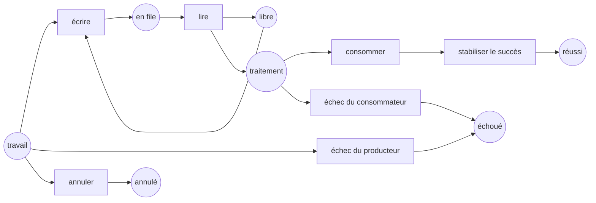

Cette leçon relie l’analyseur au code que nous exécutons réellement. Le [cours C# avancé](../../csharp-advanced/) mesure déjà [`Channel<T>`](https://learn.microsoft.com/dotnet/api/system.threading.channels.channel-1), [TPL Dataflow](https://learn.microsoft.com/dotnet/standard/parallel-programming/dataflow-task-parallel-library) et [Rx.NET](https://github.com/dotnet/reactive). Ici, le même cycle de vie est rendu assez fini pour être énuméré : une place bornée, un élément, un producteur et un consommateur.

Le but n’est pas d’exécuter le travail de production dans un moteur de réseaux de Petri. Le réseau est un petit **oracle de spécification** placé à côté de l’implémentation. Il énumère les états qu’un futur test d’exécution devra distinguer. Les tests ciblés de cette leçon valident le modèle lui-même ; ils n’exécutent ni `Channel<T>`, ni Dataflow, ni Rx.

## Exécuter l’expérience

```bash
dotnet test code/petri-nets/Tests -c Release --filter PipelineLifecycleTests
dotnet run --project code/petri-nets/Examples -c Release -- l14
```

Le modèle est [`Nets.PipelineLifecycle`](https://github.com/spareilleux/learn/blob/main/code/petri-nets/Examples/Nets.cs), ses assertions sont dans [`PipelineLifecycleTests.cs`](https://github.com/spareilleux/learn/blob/main/code/petri-nets/Tests/PipelineLifecycleTests.cs), et son format d’échange est [`pipeline-lifecycle.pnml`](https://github.com/spareilleux/learn/blob/main/code/petri-nets/nets/pipeline-lifecycle.pnml).

## Un vocabulaire commun du cycle de vie



| Place ou transition de Petri | `Channel<T>` | TPL Dataflow | Rx.NET |
|---|---|---|---|
| `free` | une place bornée disponible dans la file | **pas équivalent** : la `BoundedCapacity` d’un block d’exécution compte aussi l’élément en cours de traitement | aucun équivalent sans pont borné |
| `write` | `WriteAsync` accepté | `SendAsync` accepté | `OnNext` |
| `producer fails` | `TryComplete(error)` | mettre la source en faute et propager la terminaison | `OnError` |
| `consumer fails` | annuler et joindre les producteurs ; terminer le writer | mettre le block en faute ; observer les envois refusés | disposer l’abonnement et attendre le travail asynchrone |
| `succeeded` | writer fermé, file vidée, deux côtés stabilisés | tous les blocks liés **et toutes les tâches de collecte** terminés | `OnCompleted` observé et travail planifié stabilisé |
| `cancelled` | annulation demandée **et deux tâches stabilisées** | annulation observée par tous les blocks | abonnement disposé et travail planifié stabilisé |

La dernière formulation est le contrat qu’un test d’exécution devrait imposer. Le petit réseau ci-dessous fait de l’annulation une transition atomique, avant le démarrage, directement vers `cancelled` ; il **suppose** donc la stabilisation au lieu de l’observer. Un modèle plus riche doit séparer `cancel_requested` des places indiquant la stabilisation des participants. Fermer une file ne prouve pas davantage que son contenu a été vidé.

## Le résultat exécutable

```text
== One bounded C# pipeline, with success, failure and cancellation made explicit ==
markings: 8   graph complete: True
dead markings: 3   non-terminal dead markings: 0
queue capacity invariant free + queued = 1: True
write -> read -> consume -> settle_success                 succeeded
producer_fail -> settle_producer_failure                   failed
write -> read -> consumer_fail                             failed
cancel                                                     cancelled
```

La preuve de capacité est l’invariant de file Channel `free + queued = 1`. Une écriture consomme la place libre ; une lecture la rend. Aucun entrelacement ne peut créer un second élément en file. Ce n’est pas un invariant de block d’exécution Dataflow, car Dataflow conserve l’élément en cours dans `BoundedCapacity`.

Le nombre de marquages morts demande une lecture plus fine. [`ReachabilityGraph.DeadStates`](https://github.com/spareilleux/learn/blob/main/code/petri-nets/PetriNets/ReachabilityGraph.cs) signifie « plus rien ne peut tirer ». Cela inclut la fin normale d’un workflow fini. La propriété utile n’est donc pas « aucun marquage mort », mais :

1. le graphe d’accessibilité est complet ;
2. chaque marquage mort porte exactement un jeton terminal nommé ;
3. chaque disposition voulue est accessible ;
4. aucun participant ni élément en file ne subsiste hors de cette disposition.

Les tests imposent les trois premières. La quatrième devient essentielle quand le modèle passe d’un élément à plusieurs producteurs et consommateurs.

## Ce que cela ajoute au C# avancé

Les leçons [6](../../csharp-advanced/06-channels/), [7](../../csharp-advanced/07-tpl-dataflow/), [8](../../csharp-advanced/08-rx-net/) et [9](../../csharp-advanced/09-choosing-streams/) exécutent déjà les mécanismes. La leçon 9 observe notamment que :

- un channel dont le producteur lève une exception sans `Complete(error)` laisse son lecteur en attente ;
- un channel borné dont le consommateur échoue peut laisser son producteur bloqué ;
- la terminaison Dataflow ne traverse que les liens configurés pour la propager ;
- avec Rx, la terminaison, les erreurs, la disposition et la stabilisation du travail planifié sont des événements distincts.

Le réseau de Petri ne remplace pas ces tests. Il rend les états candidats du cycle de vie révisables. L’expérience suivante consiste à ajouter une fixture d’exécution déterministe, reproduire un ordonnancement défaillant sur le seam C# public et rattacher ses observations au modèle ; ce rattachement n’est pas implémenté ici.

## Lanes d’agents : même méthode, autre invariant

La première moitié du programme `l14` modélise le verrou de répertoire utilisé par des lanes d’agents concurrentes. La version protégée conserve `free + held1 + held2 = 1` ; le nettoyage non protégé peut supprimer le verrou d’une autre lane et atteindre un marquage où deux lanes pensent le posséder.

```text
guarded:   7 markings, no marking with two holders
unguarded: 10 markings, 1 marking with two holders
shortest counterexample: take1 -> fail2 -> clean_hit2 -> take2
```

Les réseaux de Petri conviennent ici, car l’affirmation de sûreté porte sur **tous les entrelacements**, tandis qu’un test de charge n’échantillonne que les ordonnancements réellement exécutés.

## Limite de l’expérience

Les exemples Channel/Dataflow/Rx du cours C# avancé reproduisent la **forme** de certaines méthodes de GA à des révisions épinglées. Ce sont des expériences de mécanisme, pas des tests des binaires GA actuels. Ce réseau à un élément ne peut pas non plus reproduire un producteur bloqué par la backpressure après l’échec du consommateur, et son annulation n’existe qu’avant le démarrage. Une finding de dépôt doit indiquer cette fidélité des preuves et être confirmée par un test de régression sur la révision cible avant d’être déclarée corrigée.

Les livraisons RabbitMQ, les leases Redis, les mises à jour progressives Kubernetes et les handoffs multi-agents exigent davantage de jetons, le temps et des sémantiques de panne externes. Ce sont de futures expériences ; cette leçon ne déduit pas leurs garanties du modèle à une seule place.

## Exercices

1. Ajoutez un second producteur. Quelles places ont besoin d’un jeton par producteur, et quel invariant prouve encore la capacité ?
2. Ajoutez `cancel_requested` séparément de `cancelled`. Construisez un marquage où l’annulation est demandée mais où un producteur reste bloqué.
3. Donnez au consommateur une transition de retry. Quels marquages terminaux restent légitimes, et quelle hypothèse d’équité faut-il pour affirmer qu’il finit par se stabiliser ?
4. Associez un acquittement RabbitMQ et une dead-letter exchange à des places et transitions. Marquez toute affirmation qui demanderait une expérience avec un vrai broker.

## À retenir

- Les réseaux de Petri complètent les tests de concurrence C# lorsqu’ils énumèrent les états du cycle de vie et que les tests reproduisent les contre-exemples sur les seams publics.
- `free + queued = capacity` est la version structurelle de la backpressure bornée.
- Une terminaison réussie est aussi un marquage mort ; classez séparément les marquages morts terminaux et non terminaux.
- La terminaison, la demande d’annulation, la stabilisation des participants et le vidage de la file sont des faits distincts.
- Gardez le modèle à côté du code de production, pas dans son chemin d’exécution.
