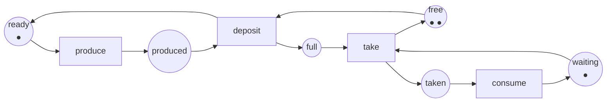

:::note[Sur quoi tourne ce cours]
L'analyseur de ce cours est un projet C# dans [`code/petri-nets`](https://github.com/spareilleux/learn/tree/main/code/petri-nets), construit avec le [SDK .NET](https://dotnet.microsoft.com/download) **10.0.112** et exécuté sur .NET **10.0.12**, les versions installées sur ma machine le 2026-09-15. Il lit et écrit du [PNML](https://www.pnml.org/), applique la règle de tir, construit des graphes d'accessibilité et des arbres de couverture, calcule les invariants de places et de transitions, décide les classes structurelles avec leurs siphons, trappes et circuits, et déplie un réseau coloré en un réseau ordinaire. [`check.sh`](https://github.com/spareilleux/learn/blob/main/code/petri-nets/check.sh) lance les tests unitaires et chaque leçon, et compare la sortie avec [`expected`](https://github.com/spareilleux/learn/tree/main/code/petri-nets/expected) ; tous les listings de ces leçons sont collés depuis cette sortie. Les outils externes sont nommés et liés, jamais nécessaires. [`petri-nets-examples.yml`](https://github.com/spareilleux/learn/blob/main/.github/workflows/petri-nets-examples.yml) lance `check.sh` sur Ubuntu, Windows et macOS ; il a tourné pour la première fois le 2026-09-16 au commit `53ceefc` et il est passé sur les trois.
:::

## Pourquoi j'apprends ça

Je sais dessiner une machine à états. J'en ai écrit en C# avec un `enum` et un `switch`, en Java avec un patron état, et elles fonctionnent tant que le système ne fait qu'une chose à la fois. Puis deux choses arrivent en même temps. Deux fils d'exécution prennent deux verrous dans deux ordres. Un `Channel<T>` se remplit et le producteur se bloque pour toujours. Un workflow a trois branches et personne ne sait dire si toutes peuvent se terminer.

Une machine à états ne peut rien dire de tout cela, parce qu'elle a un état courant, et que la chose que je modélise en a plusieurs. Ce que je veux, c'est un modèle dont l'état est une *distribution* : tant de requêtes dans la file, tant de travailleurs occupés, un verrou tenu. Un réseau de Petri est exactement cela, et il vient avec un petit corpus de mathématiques qui répond à des questions auxquelles je réponds aujourd'hui par des tests de charge et de l'espoir :

- **cette file peut-elle déborder ?** Pas « a-t-elle débordé mardi dernier » — *peut*-elle, un jour, sous n'importe quel entrelacement ;
- **ce système peut-il s'interbloquer ?** Et si oui, quelle est la séquence la plus courte qui y mène ;
- **ce workflow va-t-il se terminer ?** Depuis tous les états où il peut se retrouver, pas seulement le chemin heureux.

Ces trois questions sont tranchées par un programme dans ce cours, sur des réseaux qui modélisent des choses réelles : un tampon borné, une exclusion mutuelle, deux verrous pris dans des ordres opposés.

## À qui s'adresse ce cours

Vous êtes développeur C# ou Java. Vous avez écrit du code concurrent et modélisé des processus avec des machines à états. Vous n'avez besoin d'aucune mathématique au-delà de l'addition de vecteurs et de la multiplication d'une matrice par un vecteur ; le cours introduit ce qu'il utilise, et la première matrice n'apparaît qu'à la leçon 2, parce qu'elle rend quelque chose de concret plus facile.

Les leçons sur la concurrence s'appuient sur ce que vous savez déjà. La leçon 7 reprend la contre-pression des [leçons 6 à 9 du cours C# avancé](../csharp-advanced/) — channels, TPL Dataflow, Rx — et la modélise au lieu de la mesurer. La leçon 14 commence le dogfooding du dépôt par un cycle de vie C# borné et un verrou de lane d'agents ; RabbitMQ et Kubernetes restent des expériences suivantes explicites.

## L'exemple fil rouge

Un producteur, un consommateur, et un tampon de deux emplacements. Trois places tiennent l'état du producteur, du consommateur et du tampon ; quatre transitions sont les événements. Rien n'est un « état courant » : le marquage dit où se trouve chaque jeton, tous à la fois.

Les noms des places et des transitions restent en anglais dans les trois langues : ils font partie de la sortie du programme, comparée par `check.sh`, et les traduire ferait diverger les listings.

Ce réseau a douze marquages accessibles, il ne s'interbloque jamais, et la place `free` est toute la raison pour laquelle le tampon ne peut pas déborder — retirez-la, et l'ensemble des marquages accessibles devient infini. Les leçons 1 à 4 prouvent ces trois affirmations, et la leçon 5 prouve la première à nouveau sans regarder un seul marquage.

## À la fin de ce cours, je saurai

- lire et dessiner un réseau de Petri, et dire ce que son marquage signifie dans le système qu'il modélise ;
- écrire la matrice d'incidence d'un réseau, et savoir ce que l'équation d'état décide et ne décide pas ;
- construire un graphe d'accessibilité, et un arbre de couverture quand le graphe est infini ;
- décider la bornitude, la sûreté, la vivacité, l'absence d'interblocage, la réversibilité et la persistance, et dire lesquelles un système donné exige réellement ;
- calculer les invariants de places et de transitions, et utiliser un invariant comme une preuve valable pour tous les marquages accessibles ;
- reconnaître les machines à états, les graphes marqués et les réseaux à choix libre, et utiliser les théorèmes qui viennent avec ces classes ;
- modéliser l'exclusion mutuelle, le producteur-consommateur, les lecteurs-rédacteurs et les philosophes, et comparer ces modèles aux constructions C# et Java qu'ils représentent ;
- utiliser les réseaux colorés, temporisés et stochastiques, et savoir ce que chaque extension coûte à l'analyse ;
- vérifier la *soundness* d'un workflow, et traduire entre BPMN et réseaux de workflow ;
- échanger des réseaux avec TINA, LoLA, CPN Tools, GreatSPN et TAPAAL via PNML ;
- modéliser des morceaux des systèmes de ce dépôt, et dire honnêtement ce que le modèle a trouvé et ce qu'il a manqué ;
- savoir où le formalisme s'arrête : ce qui est indécidable, ce qui est décidable mais désespéré, et ce qu'il faut prendre à la place.

## Plan

| # | Leçon | Ce que vous connaissez peut-être déjà |
|---|---|---|
| 1 | [Pourquoi les réseaux de Petri](01-why-petri-nets/) | les machines à états, `enum` plus `switch`, une file bornée |
| 2 | [La définition formelle et la matrice d'incidence](02-the-incidence-matrix/) | les vecteurs, un produit matriciel |
| 3 | [Le graphe d'accessibilité](03-the-reachability-graph/) | un parcours en largeur, l'explosion d'une matrice de tests |
| 4 | [Propriétés](04-properties/) | interblocage, famine, livelock |
| 5 | [Invariants](05-invariants/) | un invariant de boucle, une quantité conservée |
| 6 | [Classes structurelles : machines à états, graphes marqués, réseaux à choix libre](06-structural-classes/) | |
| 7 | [Modéliser la concurrence : exclusion mutuelle, producteur-consommateur, lecteurs-rédacteurs, philosophes](07-modelling-concurrency/) | `lock`, `SemaphoreSlim`, `Channel<T>`, `synchronized`, `ReentrantLock` |
| 8 | [Réseaux colorés](08-coloured-nets/) | les génériques, un message typé |
| 9 | [Temps et probabilités : réseaux temporisés, stochastiques, GSPN](09-time-and-probability/) | les percentiles, un modèle de files d'attente |
| 10 | [Workflows : réseaux de workflow, *soundness*, BPMN, *process mining*](10-workflows/) | BPMN, un moteur de workflow |
| 11 | [Outils et interopérabilité : PNML, TINA, LoLA, Snoopy, PIPE, CPN Tools, GreatSPN, TAPAAL](11-tools-and-interoperability/) | un format d'échange XML |
| 12 | [Applications industrielles : ateliers flexibles, protocoles, matériel, biochimie, sécurité](12-industrial-applications/) | un banc d'essai public, un espace d'états |
| 13 | [Face aux autres formalismes : TLA+, statecharts, algèbres de processus, automates temporisés](13-against-other-formalisms/) | un second espace d'états, calculé ailleurs |
| 14 | [Sur nos systèmes : pipelines C# et lanes d'agents](14-on-our-systems/) | [C# avancé](../csharp-advanced/) ; RabbitMQ et Kubernetes sont des expériences suivantes |
| 15 | [Limites et suite : indécidabilité, dépliages, réduction d'ordre partiel, extensions](15-limits-and-what-comes-next/) | une réponse fausse d'un algorithme correct |

[Journal](journal/) : ce que j'ai essayé, ce qui m'a surpris, ce qu'il me reste à vérifier.

## Ressources

- [Petri Nets World](https://www.informatik.uni-hamburg.de/TGI/PetriNets/), le portail de la communauté, avec sa [liste d'outils](http://www2.informatik.uni-hamburg.de/tgi/PetriNets/tools/) et ses [bibliographies](http://www2.informatik.uni-hamburg.de/tgi/PetriNets/bibliographies/)
- Tadao Murata, *Petri nets: Properties, analysis and applications*, **Proceedings of the IEEE** 77(4), avril 1989, pages 541–580, [doi:10.1109/5.24143](https://doi.org/10.1109/5.24143) — l'article de synthèse que ce cours cite le plus souvent
- Wolfgang Reisig, *Understanding Petri Nets*, Springer, 2013, [doi:10.1007/978-3-642-33278-4](https://doi.org/10.1007/978-3-642-33278-4)
- [PNML, le Petri Net Markup Language](https://www.pnml.org/), normalisé par [ISO/IEC 15909-1:2019](https://www.iso.org/standard/67235.html) (concepts), [ISO/IEC 15909-2:2011](https://www.iso.org/standard/43538.html) (format d'échange) et [ISO/IEC 15909-3:2021](https://www.iso.org/standard/81504.html) (extensions)
- Outils : [TINA](https://projects.laas.fr/tina/), [LoLA](https://theo.informatik.uni-rostock.de/theo-forschung/tools/lola/), [CPN Tools](https://cpntools.org/), [GreatSPN](http://www.di.unito.it/~greatspn/index.html), [TAPAAL](https://www.tapaal.net/), [Snoopy](https://www-dssz.informatik.tu-cottbus.de/DSSZ/Software/Snoopy), [PIPE](https://github.com/sarahtattersall/PIPE)
- Le [Model Checking Contest](https://mcc.lip6.fr/), où ces outils sont confrontés chaque année sur un jeu public de réseaux
- Le code source de ce cours : [`code/petri-nets`](https://github.com/spareilleux/learn/tree/main/code/petri-nets)
