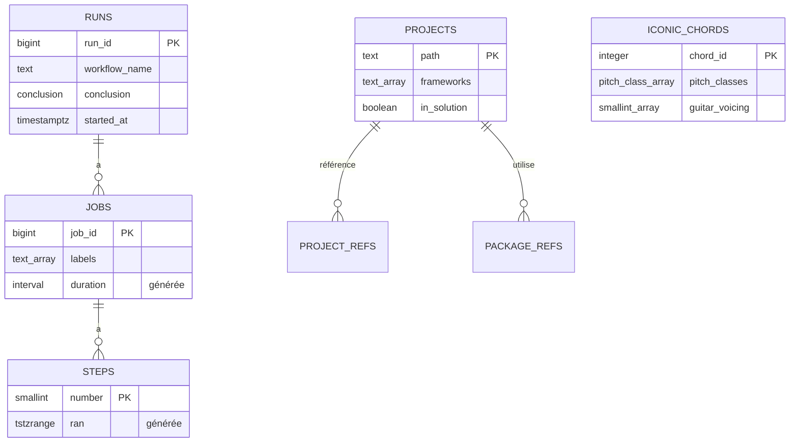

:::note[Versions étudiées]
[PostgreSQL](https://www.postgresql.org/docs/18/) **18.6**, la version mineure courante de la plus récente version majeure au 2026-09-15 d'après la [page de la politique de versions](https://www.postgresql.org/support/versioning/) (PostgreSQL 18 est supporté jusqu'en novembre 2030), dans l'image Docker officielle [`postgres:18.6-trixie`](https://hub.docker.com/_/postgres), digest `sha256:4ef4dbc939d61acea57712655ddb4b4ab27419c913f94cca0cd57cb3ea3c2280`. Les scripts [pgvector](https://github.com/pgvector/pgvector) de la leçon 8 s'exécutent sur [`pgvector/pgvector:0.8.6-pg18-trixie`](https://hub.docker.com/r/pgvector/pgvector), le même PostgreSQL 18.6 avec pgvector **0.8.6**, digest `sha256:78bf48b801e792f99e3ac62b5036fd3876e9be48afda16c1e331af1c75ceb2ff`. La mise à niveau de la leçon 11 installe les binaires de PostgreSQL 17 dans le conteneur depuis le dépôt apt du projet PostgreSQL, dont la dernière version mineure 17.x change avec le temps. Les clients sont [Npgsql](https://www.npgsql.org/) **10.0.3** et son [fournisseur EF Core](https://www.npgsql.org/efcore/) **10.0.3** sur .NET 10, et le [pilote JDBC de PostgreSQL](https://jdbc.postgresql.org/) **42.7.13** avec [HikariCP](https://github.com/brettwooldridge/HikariCP) **7.1.0** sur Java 25. Chez AWS, la version la plus récente listée dans les [notes de version d'Aurora PostgreSQL](https://docs.aws.amazon.com/AmazonRDS/latest/AuroraPostgreSQLReleaseNotes/AuroraPostgreSQL.Updates.html) le même jour est **Aurora PostgreSQL 18.4.1** (21 août 2026), compatible avec PostgreSQL 18.4.

Chaque exemple est dans [`code/postgresql-aurora`](https://github.com/spareilleux/learn/tree/main/code/postgresql-aurora) : [`check.sh`](https://github.com/spareilleux/learn/blob/main/code/postgresql-aurora/check.sh) exécute chaque script SQL avec `psql`, chaque programme C# et Java contre une base neuve, et les scripts de réplication et de sauvegarde des leçons 10 et 11 sur de petits clusters démarrés dans le conteneur, et compare leur sortie aux fichiers de [`expected`](https://github.com/spareilleux/learn/tree/main/code/postgresql-aurora/expected). La CI construit les programmes sous Windows, Linux et macOS, et exécute le tout contre PostgreSQL sous Linux seulement, parce que les runners Windows et macOS de GitHub n'ont pas Docker.
:::

## Pourquoi j'apprends ça

J'ai passé des années sur SQL Server : T-SQL, SSMS, plans d'exécution, colonnes `IDENTITY`, migrations Entity Framework. De plus en plus de projets que je rencontre démarrent plutôt sur PostgreSQL, souvent sur un service géré comme Amazon Aurora, et j'ai remarqué que j'écrivais du SQL Server dans la syntaxe de PostgreSQL. Ça marche, jusqu'à ce qu'un nom de colonne ait une majuscule, qu'un `DateTime` revienne décalé de trois heures, ou qu'un pool de cent connexions rencontre un serveur qui en autorise cent.

Je veux connaître PostgreSQL pour ce qu'il est : ses types, son SQL, sa façon d'exécuter les transactions et d'utiliser les index, de répliquer et d'être sauvegardé. Ensuite je veux savoir ce qu'Aurora change : ce qu'AWS gère pour moi, ce que je perds, et ce que ça coûte.

## À qui s'adresse ce cours

Tu es développeur C# ou Java. Tu connais le SQL de [SQL Server](https://learn.microsoft.com/sql/sql-server/) ou d'une autre base : jointures, regroupements, index, transactions. Tu as déjà lancé un conteneur. Tu n'as pas besoin de connaître PostgreSQL. Le côté Java suppose le niveau de [Java pour développeurs C#](../java-for-csharp/) ; la leçon 4 renvoie les questions Spring Data à [Spring Boot, Spring Cloud et Reactor pour développeurs C#](../spring-cloud-reactor/), et la leçon 1 renvoie les questions de conteneurs à [WSL containers](../wsl-containers/). Le [cours DuckDB](../duckdb/) interroge les mêmes données de CI avec un moteur analytique : c'est une bonne comparaison, pas un prérequis.

## SQL Server, PostgreSQL et Aurora en un tableau

| | SQL Server | PostgreSQL | Aurora PostgreSQL |
|---|---|---|---|
| Licence | commerciale (éditions Express et Developer gratuites) | [PostgreSQL License](https://www.postgresql.org/about/licence/), open source | un service AWS géré, facturé par instance ou unité de capacité, stockage et E/S |
| Serveur | un processus, des threads | un processus par connexion | le moteur de PostgreSQL sur le stockage distribué d'AWS |
| Niveau le plus haut | instance → bases → schémas | cluster → bases → schémas | DB cluster : un writer, des readers, un volume de stockage partagé |
| Compte d'administration | `sa`, `sysadmin` | `postgres`, un superutilisateur | un membre de `rds_superuser`, jamais un vrai superutilisateur |
| Outil client | `sqlcmd`, SSMS | `psql`, pgAdmin | `psql` et la console AWS |
| Depuis .NET | `Microsoft.Data.SqlClient` | Npgsql | Npgsql |
| Depuis Java | pilote JDBC de Microsoft | pilote JDBC de PostgreSQL | pilote JDBC de PostgreSQL, ou l'AWS Advanced JDBC Wrapper |

## Les données

Le cours réutilise des données que ce site publie déjà, plutôt qu'une boutique ou une bibliothèque inventée :

- **L'historique de CI de ce site**, le même instantané que le [cours DuckDB](../duckdb/) : 125 exécutions GitHub Actions, leurs 315 jobs et 2 204 étapes, exportés le 2026-09-14 dans [`code/duckdb/data`](https://github.com/spareilleux/learn/tree/main/code/duckdb/data).
- **Les projets .NET de [Guitar Alchemist](https://github.com/GuitarAlchemist/ga)**, tels que le [cours LadybugDB](../ladybugdb/) les a extraits au commit `a26a7893` : 111 projets, leurs références de projets et leurs 478 références de paquets, dans [`code/ladybugdb/data/ga`](https://github.com/spareilleux/learn/tree/main/code/ladybugdb/data/ga).
- **Les accords iconiques de Guitar Alchemist**, les 17 accords de [`IconicChords.yaml`](https://github.com/GuitarAlchemist/ga/blob/32f143c/Common/GA.Business.Config/IconicChords.yaml) au commit `32f143c`, convertis en JSON par [`extract_chords.py`](https://github.com/spareilleux/learn/blob/main/code/postgresql-aurora/data/extract_chords.py).

La leçon 2 construit le modèle que chaque leçon suivante charge depuis [`sql/schema.sql`](https://github.com/spareilleux/learn/blob/main/code/postgresql-aurora/sql/schema.sql) :

Le schéma `ci` contient les trois premières tables, le schéma `ga` les autres.

## À la fin de ce cours, je saurai

- faire tourner PostgreSQL dans un conteneur et travailler dans `psql`, avec bases, schémas, rôles et privilèges ;
- choisir les types de PostgreSQL délibérément : `text`, `numeric`, `timestamptz`, `uuid`, `jsonb`, tableaux et intervalles, avec contraintes, domaines et colonnes générées ;
- écrire le SQL que PostgreSQL fait mieux que T-SQL : CTE récursives, fonctions de fenêtrage, `LATERAL`, `DISTINCT ON`, `RETURNING`, upserts et `MERGE` ;
- utiliser PostgreSQL depuis C# avec Npgsql et EF Core, et depuis Java avec JDBC et HikariCP, y compris les pools, les instructions préparées et `COPY` ;
- lire un plan de requête et choisir le bon index : B-tree, GIN, GiST, BRIN, index partiels et sur expression ;
- expliquer MVCC, les niveaux d'isolation, les verrous et `VACUUM`, et reproduire un deadlock ;
- stocker et chercher du JSON et du texte, et écrire des fonctions, des triggers et des extensions ;
- partitionner de grandes tables, les répliquer, les sauvegarder, les restaurer et les mettre à niveau ;
- faire tourner la même base sur Amazon Aurora PostgreSQL, en sachant ce qui diffère, et estimer ce qu'elle coûte, y compris une migration depuis SQL Server.

## Plan

| # | Leçon | Si tu connais SQL Server |
|---|---|---|
| 1 | [Premiers pas : un conteneur, `psql`, bases, schémas et rôles](01-getting-started/) | `sqlcmd`, logins et utilisateurs, `dbo`, `TOP`, `IDENTITY` |
| 2 | [Types et modélisation](02-types/) | `datetimeoffset`, `nvarchar`, colonnes calculées, index uniques et `NULL` |
| 3 | [Requêtes : CTE, fenêtres, `LATERAL`, upserts et `MERGE`](03-queries/) | `CROSS APPLY`, `OUTPUT inserted.*`, `MERGE` |
| 4 | [PostgreSQL depuis C# et Java](04-csharp-java/) | pool de `SqlConnection`, `SqlBulkCopy`, fournisseurs EF Core |
| 5 | [Index et plans : B-tree, GIN, BRIN, `EXPLAIN (ANALYZE, BUFFERS)`](05-indexes/) | plans d'exécution, colonnes incluses, index filtrés |
| 6 | [Transactions et MVCC : niveaux d'isolation, verrous, `VACUUM`, bloat, deadlocks](06-transactions/) | `READ_COMMITTED_SNAPSHOT`, le version store |
| 7 | [JSON et recherche : opérateurs et index `jsonb`, recherche plein texte, `pg_trgm`](07-json-search/) | `OPENJSON`, catalogues de texte intégral |
| 8 | [Fonctions et extensions : PL/pgSQL, triggers, `pgvector`](08-functions/) | procédures T-SQL, CLR |
| 9 | [Partitionnement et grandes tables](09-partitioning/) | fonctions et schémas de partition, `SWITCH` |
| 10 | [Réplication et haute disponibilité : WAL, réplication physique et logique](10-replication/) | groupes de disponibilité Always On, réplication transactionnelle |
| 11 | [Sauvegarde, restauration et mises à niveau : `pg_dump`, restauration à un instant donné, `pg_upgrade`](11-backup/) | `BACKUP`, `RESTORE … STOPAT`, mises à niveau sur place |
| 12 | [Amazon Aurora PostgreSQL : stockage, réplicas et basculement, endpoints, Aurora Serverless, Global Database, RDS Proxy, authentification IAM](12-aurora/) | Azure SQL Database, Hyperscale |
| 13 | Migration et coûts : de SQL Server vers PostgreSQL et Aurora avec AWS DMS et Babelfish *(la prochaine)* | le Data Migration Assistant |

Les leçons 1 à 11 se terminent chacune par une courte section sur ce qui change sur Aurora, d'après la documentation d'AWS ; la leçon 12 porte sur Aurora lui-même, avec un basculement reproduit en local. Rien de tout cela ne tourne sur AWS : le cours ne crée aucune ressource AWS, donc tout ce qui concerne Aurora est marqué *à vérifier*.

[Journal](journal/) : ce que j'ai essayé, ce qui m'a surpris, ce qu'il me reste à vérifier.

## Ressources

- [Documentation de PostgreSQL 18](https://www.postgresql.org/docs/18/), en particulier le [tutoriel](https://www.postgresql.org/docs/18/tutorial.html), [le langage SQL](https://www.postgresql.org/docs/18/sql.html), [les types de données](https://www.postgresql.org/docs/18/datatype.html) et [l'administration du serveur](https://www.postgresql.org/docs/18/admin.html)
- [Notes de version de PostgreSQL 18](https://www.postgresql.org/docs/18/release-18.html)
- [Référence de `psql`](https://www.postgresql.org/docs/18/app-psql.html)
- [Documentation de Npgsql](https://www.npgsql.org/doc/) et le [fournisseur EF Core de Npgsql](https://www.npgsql.org/efcore/)
- [Documentation du pilote JDBC de PostgreSQL](https://jdbc.postgresql.org/documentation/)
- [Guide de l'utilisateur d'Amazon Aurora PostgreSQL](https://docs.aws.amazon.com/AmazonRDS/latest/AuroraUserGuide/Aurora.AuroraPostgreSQL.html)
- Code source : [PostgreSQL](https://github.com/postgres/postgres), [l'image Docker](https://github.com/docker-library/postgres), [Npgsql](https://github.com/npgsql/npgsql), [le fournisseur EF Core](https://github.com/npgsql/efcore.pg), [le pilote JDBC](https://github.com/pgjdbc/pgjdbc)
