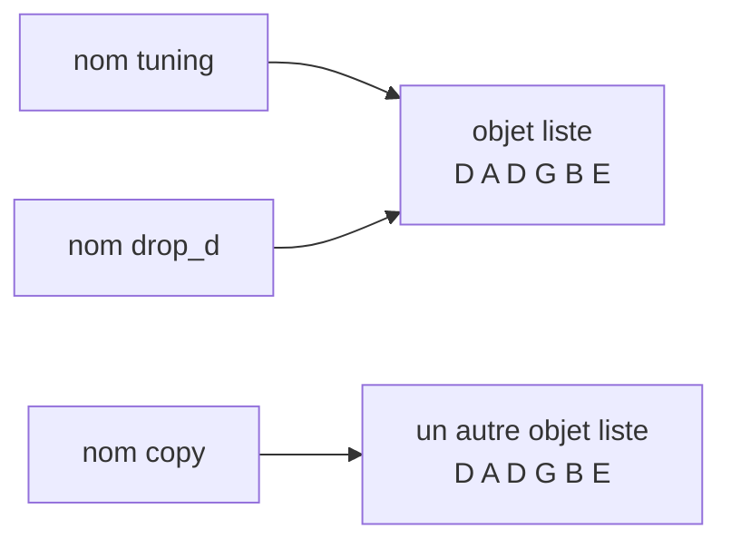

Code : les fichiers [`examples/l02_*`](https://github.com/spareilleux/learn/tree/7d3b4bcda19a81326612cd833dc03b9ca77d3451/code/python-for-csharp-java/examples) et [`errors/l02_*`](https://github.com/spareilleux/learn/tree/7d3b4bcda19a81326612cd833dc03b9ca77d3451/code/python-for-csharp-java/errors), et les côtés C# et Java dans [`compare/l02_values.cs`](https://github.com/spareilleux/learn/blob/7d3b4bcda19a81326612cd833dc03b9ca77d3451/code/python-for-csharp-java/compare/l02_values.cs), [`compare/L02Values.java`](https://github.com/spareilleux/learn/blob/7d3b4bcda19a81326612cd833dc03b9ca77d3451/code/python-for-csharp-java/compare/L02Values.java), [`compare_fail/l02_scope.cs`](https://github.com/spareilleux/learn/blob/7d3b4bcda19a81326612cd833dc03b9ca77d3451/code/python-for-csharp-java/compare_fail/l02_scope.cs) et [`compare_fail/L02Scope.java`](https://github.com/spareilleux/learn/blob/7d3b4bcda19a81326612cd833dc03b9ca77d3451/code/python-for-csharp-java/compare_fail/L02Scope.java).

## Tout est objet

C# sépare les types en types valeur, copiés à l'assignation, et types référence, partagés. Java a des primitifs et des objets. Python n'a que des objets : un nombre, une chaîne, `None`, une fonction et une classe sont tous des objets sur le tas, chacun avec un type, et une variable en désigne toujours un. Le [modèle de données](https://docs.python.org/3.14/reference/datamodel.html) de la référence du langage commence par cette phrase : « Objects are Python's abstraction for data. »

```python
# examples/l02_objects.py
def with_tax(price: float) -> float:
    return price * 1.15


# Nombres, texte, None, fonctions et classes sont tous des objets, et chaque objet a un type
for value in [42, 3.5, "capo", None, with_tax, int, type]:
    print(type(value))

print(isinstance(True, int), True + True)  # bool est une sous-classe de int
print(2**100)  # un int n'a pas de taille fixe, donc il ne déborde jamais
print(with_tax.__name__, with_tax.__annotations__)
```

```text
> uv run python examples/l02_objects.py
<class 'int'>
<class 'float'>
<class 'str'>
<class 'NoneType'>
<class 'function'>
<class 'type'>
<class 'type'>
True 2
1267650600228229401496703205376
with_tax {'price': <class 'float'>, 'return': <class 'float'>}
```

Une classe est un objet de type `type`, et `type` lui-même aussi. `bool` dérive de `int`, donc `True + True` vaut `2`. Un `int` grandit jusqu'à la taille dont il a besoin, là où l'`int` de C# fait 32 bits et déborde en revenant au début ; la [leçon 3](../03-collections/#les-nombres) montre les deux. Et une fonction est un objet doté d'attributs, parmi lesquels les annotations dont la [leçon 1](../01-install-and-run/#un-vérificateur-de-types-lit-les-annotations) disait que Python les garde sans les imposer.

Les petits types se comportent de toute façon comme les types valeur de C#, pour une autre raison : `int`, `float`, `str`, `tuple` et `None` sont **immuables**. Aucune opération ne modifie un objet `int` ; `count += 1` crée ou trouve l'objet plus grand de `1` et y lie `count`. Les partager est donc sans danger, et la question « copié ou partagé ? » ne se pose que pour les objets mutables : listes, dictionnaires, sets et la plupart des instances de classes.

## Des noms, pas des boîtes

Le [modèle d'exécution](https://docs.python.org/3.14/reference/executionmodel.html) appelle les variables des *noms*, et l'assignation une *liaison* (*binding*) : `x = value` fait désigner l'objet par le nom `x`, et ne le copie jamais. C'est ce que fait une variable d'un type référence en C# et en Java, appliqué à tous les types.

```python
# examples/l02_names.py
tuning = ["E", "A", "D", "G", "B", "E"]
drop_d = tuning  # un second nom pour la même liste : rien n'est copié
drop_d[0] = "D"
print("tuning:", tuning)
print("same object:", drop_d is tuning)

copy = list(tuning)  # une nouvelle liste avec les mêmes éléments
print("equal:", copy == tuning, "same object:", copy is tuning)

# += modifie une liste en place, mais construit un nouveau tuple et y lie le nom
chord = ["C", "E"]
chord_alias = chord
chord += ["G"]
print("list: ", chord, chord_alias)

frozen: tuple[str, ...] = ("C", "E")
frozen_alias = frozen
frozen += ("G",)
print("tuple:", frozen, frozen_alias)
```

```text
> uv run python examples/l02_names.py
tuning: ['D', 'A', 'D', 'G', 'B', 'E']
same object: True
equal: True same object: False
list:  ['C', 'E', 'G'] ['C', 'E', 'G']
tuple: ('C', 'E', 'G') ('C', 'E')
```



`is` compare les identités, comme `ReferenceEquals` en C# ou `==` sur des objets en Java, et `==` compare les valeurs, comme `Equals` ou `equals`. Pour les listes, `==` compare les éléments, ce que ne fait pas la `List<T>` de C#.

`+=` est la surprise du fichier. Pour une liste, il appelle la méthode en place `__iadd__` de la liste, qui étend l'objet que partagent les deux noms. Un tuple n'a pas cette méthode, donc `frozen += ("G",)` calcule `frozen + ("G",)`, un nouveau tuple, et y lie `frozen` : `frozen_alias` désigne toujours l'ancien. La même ligne a deux sens, décidés par le type de l'objet à l'exécution.

## Les arguments sont partagés, pas copiés

Un appel lie chaque paramètre à l'objet passé, exactement comme le ferait une assignation. Le nom officiel est l'*appel par référence d'objet* (*call by object reference*) ; c'est ce que fait Java avec tous les objets, et ce que fait C# avec les types référence passés sans `ref` :

```python
# examples/l02_arguments.py
def add_capo(strings: list[str]) -> None:
    strings.append("capo")  # modifie la liste de l'appelant : le paramètre désigne le même objet


def retune(strings: list[str]) -> None:
    strings = ["D", "A", "D", "G", "A", "D"]  # lie le nom local à une nouvelle liste ; l'appelant ne voit rien
    print("inside retune:", strings)


tuning = ["E", "A", "D", "G", "B", "E"]
add_capo(tuning)
print("after add_capo:", tuning)
retune(tuning)
print("after retune:  ", tuning)
```

```text
> uv run python examples/l02_arguments.py
after add_capo: ['E', 'A', 'D', 'G', 'B', 'E', 'capo']
inside retune: ['D', 'A', 'D', 'G', 'A', 'D']
after retune:   ['E', 'A', 'D', 'G', 'B', 'E', 'capo']
```

Un appel de méthode sur le paramètre atteint l'objet de l'appelant ; une assignation au paramètre, non. Il n'y a ni `ref` ni `out` : une fonction qui doit rendre une nouvelle valeur la renvoie, y compris plusieurs valeurs, sous forme de tuple (exercice 1).

## Identité et égalité

En C#, le boxing d'un `int` crée un nouvel objet à chaque fois, et l'autoboxing de Java réutilise des objets `Integer` en cache de -128 à 127, comme le promet la documentation d'[`Integer.valueOf`](https://docs.oracle.com/en/java/javase/25/docs/api/java.base/java/lang/Integer.html#valueOf(int)). CPython met aussi en cache les petits entiers, de -5 à 256, comme un détail d'implémentation que mentionne la documentation de [`PyLong_FromLong`](https://docs.python.org/3.14/c-api/long.html#c.PyLong_FromLong). Le compilateur avertit à propos de la comparaison qui en dépend :

```python
# errors/l02_identity.py
small = int("100")
big = int("1000")
print(small == 100, small is 100)
print(big == 1000, big is 1000)
```

```text
> uv run python errors/l02_identity.py
errors/l02_identity.py:4: SyntaxWarning: "is" with 'int' literal. Did you mean "=="?
  print(small == 100, small is 100)
errors/l02_identity.py:5: SyntaxWarning: "is" with 'int' literal. Did you mean "=="?
  print(big == 1000, big is 1000)
True True
True False
```

```text
> dotnet run l02_values.cs
False True
False True
quantity: 3
> java L02Values.java
true true
false true
quantity: 3
```

Trois conceptions donnent trois séries de réponses à la même question : C# crée un nouvel objet à chaque boxing, Java met en cache jusqu'à 127, CPython jusqu'à 256. Seuls `==`, `Equals` et `equals` sont fiables. mypy 2.3.1 ne signale rien sur ce fichier ; l'avertissement vient du compilateur de Python, affiché avant que la première ligne s'exécute. Le seul cas où `is` est la bonne comparaison est un singleton, et Python en a trois : `None`, `True` et `False`.

## Dynamique et fort

Python est **typé dynamiquement** : un nom n'a pas de type, et le même nom peut désigner une chaîne puis un float. Il est aussi **fortement typé** : un objet ne devient jamais silencieusement d'un autre type. JavaScript est dynamique et faible, et C# est statique et fort, avec quelques conversions implicites :

```python
# errors/l02_strong.py
quantity = 3
print("quantity: " + str(quantity))
print(True + True, 2 * "ab", [0] * 3)  # un bool est un int, et * répète une séquence
print("quantity: " + quantity)
```

```text
> uv run python errors/l02_strong.py
quantity: 3
2 abab [0, 0, 0]
Traceback (most recent call last):
  File "errors/l02_strong.py", line 5, in <module>
    print("quantity: " + quantity)
          ~~~~~~~~~~~~~^~~~~~~~~~
TypeError: can only concatenate str (not "int") to str
> uv run mypy errors/l02_strong.py
errors/l02_strong.py:5: error: Unsupported operand types for + ("str" and "int")  [operator]
Found 1 error in 1 file (checked 1 source file)
```

C# et Java acceptent `"quantity: " + quantity` et convertissent le nombre, comme l'ont affiché `l02_values.cs` et `L02Values.java` plus haut ; JavaScript aussi ([leçon 2 de JavaScript](../../javascript-for-csharp-java/02-values-and-types/#conversions-----parsing-et-truthiness)). Python refuse, à l'exécution, et mypy refuse avant. La conversion doit être écrite : `str(quantity)`, ou une f-string, `f"quantity: {quantity}"`, que préfère la leçon 3.

Lier à nouveau un nom à un autre type s'exécute sans broncher, et c'est là que mypy et Python ne sont pas d'accord :

```python
# errors/l02_rebind.py
price = "9.99"  # du texte venu d'un fichier CSV
price = float(price)  # le même nom contient maintenant un float
print(price * 2)
```

```text
> uv run python errors/l02_rebind.py
19.98
> uv run mypy errors/l02_rebind.py
errors/l02_rebind.py:3: error: Incompatible types in assignment (expression has type "float", variable has type "str")  [assignment]
Found 1 error in 1 file (checked 1 source file)
```

mypy donne à un nom le type de sa première assignation, comme le fait `var` en C#. Le code vérifié par mypy utilise un second nom, `price_text` puis `price` ; l'option [`allow_redefinition`](https://mypy.readthedocs.io/en/stable/config_file.html#confval-allow_redefinition) de mypy accepte ce pattern, et mypy 2.0 a rendu cette option plus souple.

## Truthiness

`if` et `while` acceptent n'importe quel objet, pas seulement un `bool`. Les règles du [test de valeur de vérité](https://docs.python.org/3.14/library/stdtypes.html#truth-value-testing) disent quels objets comptent comme faux : `None`, `False`, les zéros de tous les types numériques, et les chaînes et collections vides. Tout le reste est vrai :

```python
# examples/l02_truthiness.py
for value in [0, 0.0, "", [], {}, None, "0", [0], -1]:
    print(f"{value!r:>6} is {bool(value)}")


def label(quantity: int | None) -> str:
    if not quantity:  # vrai pour None, et pour 0 aussi
        return "quantity unknown"
    return f"{quantity} in stock"


def label_checked(quantity: int | None) -> str:
    if quantity is None:
        return "quantity unknown"
    return f"{quantity} in stock"


print(label(None), "|", label(0), "|", label(3))
print(label_checked(None), "|", label_checked(0), "|", label_checked(3))
```

```text
> uv run python examples/l02_truthiness.py
     0 is False
   0.0 is False
    '' is False
    [] is False
    {} is False
  None is False
   '0' is True
   [0] is True
    -1 is True
quantity unknown | quantity unknown | 3 in stock
quantity unknown | 0 in stock | 3 in stock
```

`if items:` est le test idiomatique pour « non vide », et se lit mieux que `if len(items) > 0:`. Mais `if not quantity:` traite `0` comme une valeur manquante, un bug que mypy ne signale pas, puisque les deux branches sont valides pour un `int | None`. Quand `None` signifie « absent », teste `None`.

## None

`None` est le seul objet de type `NoneType`. Il joue le rôle de `null`, avec une différence : c'est un objet, donc `None` a un type et des méthodes, et l'erreur vient de ce que le code en fait. Deux façons d'obtenir `None` sans l'avoir demandé :

```python
# errors/l02_none.py
tuning = ["E", "A", "D", "G", "B", "E"]
ordered = tuning.sort()  # trie la liste en place, et renvoie None
print(ordered)

beliefs = {"tetravalent-logic": {"truth": "T"}}
belief = beliefs.get("governance")  # None quand la clé est absente
print(belief["truth"])
```

```text
> uv run python errors/l02_none.py
None
Traceback (most recent call last):
  File "errors/l02_none.py", line 8, in <module>
    print(belief["truth"])
          ~~~~~~^^^^^^^^^
TypeError: 'NoneType' object is not subscriptable
> uv run mypy errors/l02_none.py
errors/l02_none.py:8: error: Value of type "dict[str, str] | None" is not indexable  [index]
Found 1 error in 1 file (checked 1 source file)
```

Une méthode qui modifie un objet en place renvoie `None`, par convention, pour que personne ne la prenne pour une copie : `list.sort()` trie et ne renvoie rien, et la fonction intégrée `sorted(tuning)` renvoie une nouvelle liste. `dict.get` renvoie `None` pour une clé manquante, comme `Map.get` en Java, là où `beliefs["governance"]` lèverait `KeyError`. La `TypeError` est la `NullReferenceException` de Python, et nomme le type, `'NoneType' object` ; pour un attribut, elle se lit `AttributeError: 'NoneType' object has no attribute …`.

mypy a détecté le second cas, parce que le type de retour déclaré de `dict.get` inclut `None`, comme les types référence nullables signalent un `null` possible en C#. Il n'a pas signalé le premier : assigner le résultat de `sort()` est légal, et l'erreur n'apparaît que quand `ordered` est utilisé comme une liste.

## Portée : des fonctions, pas des blocs

Un bloc ne crée pas de portée en Python. `if`, `for`, `while` et `with` lient des noms dans la fonction englobante, ou dans le module au niveau supérieur ; seuls les fonctions, les classes, les compréhensions et les modules ont leur propre portée.

```python
# errors/l02_scope.py
for string in ["E", "A", "D"]:
    last = string.lower()
print(string, last)  # une boucle n'est pas une portée : les deux noms existent encore

count = 0


def add_one() -> None:
    count += 1  # une assignation n'importe où dans la fonction rend count local à toute la fonction


add_one()
```

```text
> uv run python errors/l02_scope.py
D d
Traceback (most recent call last):
  File "errors/l02_scope.py", line 13, in <module>
    add_one()
    ~~~~~~~^^
  File "errors/l02_scope.py", line 10, in add_one
    count += 1  # an assignment anywhere in the function makes count local to all of it
    ^^^^^
UnboundLocalError: cannot access local variable 'count' where it is not associated with a value
```

La variable de la boucle et `last` ont survécu à la boucle, là où C# et Java refusent de compiler le même `print` :

```text
> dotnet run l02_scope.cs
compare_fail/l02_scope.cs(6,19): error CS0103: The name 'text' does not exist in the current context
compare_fail/l02_scope.cs(6,26): error CS0103: The name 'last' does not exist in the current context

The build failed. Fix the build errors and run again.
> javac L02Scope.java
L02Scope.java:7: error: cannot find symbol
        System.out.println(text + last);
                           ^
  symbol:   variable text
  location: class L02Scope
L02Scope.java:7: error: cannot find symbol
        System.out.println(text + last);
                                  ^
  symbol:   variable last
  location: class L02Scope
2 errors
```

La seconde erreur est celle qui surprend. Le compilateur décide, pour chaque fonction, quels noms sont locaux, et un nom que la fonction assigne n'importe où est local partout dans celle-ci. `count += 1` lit le `count` local avant que quoi que ce soit ne lui ait été assigné. Lire un nom du module depuis une fonction fonctionne ; l'assigner demande `global count`, et assigner un nom d'une fonction englobante demande `nonlocal`, qu'utilise la [leçon 4](../04-functions/#closures). mypy 2.3.1 ne signale aucune erreur sur ce fichier.

La recherche des noms suit quatre niveaux, connus sous le nom de LEGB : la portée **l**ocale, les portées des fonctions **e**nglobantes, la portée **g**lobale du module, et les fonctions intégrées (***b**uilt-ins*) comme `len`, `print` et `input`. Un nom local peut masquer un nom intégré, ce qui est légal et parfois déroutant (voir plus bas).

## Les blocs sont l'indentation

Un deux-points ouvre un bloc, et le bloc est formé des lignes indentées en dessous. Les accolades de C# ont disparu, et le choix du style avec elles : la [PEP 8](https://peps.python.org/pep-0008/), le guide de style de Python, demande quatre espaces par niveau, et des formateurs comme Ruff l'appliquent (leçon 13). Un bloc vide demande l'instruction `pass`. Mélanger tabulations et espaces dans un fichier est une `TabError`, et une ligne indentée à un niveau qui n'existe pas est une `IndentationError`, toutes deux levées par le compilateur avant que quoi que ce soit ne s'exécute.

## Importer exécute le module

La [leçon 1](../01-install-and-run/#exécuter-du-code) a montré qu'un import exécute le code de niveau supérieur d'un module, une fois, et met le module en cache dans `sys.modules`. `def` et `class` sont aussi des instructions qui s'exécutent : importer un module crée ses fonctions et ses classes, et exécute tout le reste du niveau supérieur, lectures de fichiers et appels réseau compris.

```python
# examples/l02_config.py
print(f"running the top-level code of {__name__}")
STRINGS = 6
```

```python
# examples/l02_import_twice.py
import sys

import l02_config

print("imported, STRINGS =", l02_config.STRINGS)
import l02_config  # déjà dans sys.modules : rien ne s'exécute

print("in sys.modules:", "l02_config" in sys.modules)
```

```text
> uv run python examples/l02_import_twice.py
running the top-level code of l02_config
imported, STRINGS = 6
in sys.modules: True
```

L'équivalent le plus proche en C# est un constructeur statique, et en Java un initialiseur statique : du code qui s'exécute une fois, la première fois qu'un type est utilisé. Un module va plus loin, parce que tout son corps est ce code. Quand il échoue, l'import échoue, et chaque module qui l'importe échoue avec lui. L'agent de gouvernance de GA cherche son dossier de données de cette façon ; réduit aux lignes qui comptent :

```python
# errors/l02_governance.py
# Réduit à partir d'Apps/demerzel-agent/src/services/governance.py de GA : la recherche s'exécute quand le module est importé
import os
from pathlib import Path


def find_governance_root() -> Path:
    candidate = Path(__file__).resolve()
    for _ in range(3):
        candidate = candidate.parent
        governance = candidate / "governance" / "demerzel"
        if governance.is_dir():
            return governance
    env = os.environ.get("DEMERZEL_ROOT")
    if env:
        return Path(env)
    raise FileNotFoundError("Could not locate governance/demerzel/ directory")


GOV_ROOT = find_governance_root()


def list_beliefs() -> list[Path]:
    return sorted((GOV_ROOT / "state" / "beliefs").glob("*.belief.json"))
```

```python
# errors/l02_import_governance.py
print("before the import")
import l02_governance

print(l02_governance.list_beliefs())
```

```text
> uv run python errors/l02_import_governance.py
before the import
Traceback (most recent call last):
  File "errors/l02_import_governance.py", line 3, in <module>
    import l02_governance
  File "errors/l02_governance.py", line 20, in <module>
    GOV_ROOT = find_governance_root()
  File "errors/l02_governance.py", line 17, in find_governance_root
    raise FileNotFoundError("Could not locate governance/demerzel/ directory")
FileNotFoundError: Could not locate governance/demerzel/ directory
```

Le traceback passe par la ligne `import` : le programme n'a pas appelé `list_beliefs`, il a seulement importé le module qui la définit. Un test qui importe n'importe quel module de l'agent, un outil de documentation qui l'importe pour lire ses docstrings, ou un plugin de vérificateur de types qui le charge, échouent tous sur une machine sans le dossier. mypy ne voit rien d'anormal, puisque le code est bien typé. L'exercice 3 déplace la recherche dans une fonction.

## Dans de vrais projets

**L'agent de gouvernance de GA**, au commit [`cc42d21`](https://github.com/GuitarAlchemist/ga/commit/cc42d215504631e168daf3bdf2c6d47b5c9fbe93) :

- [`src/services/governance.py`, lignes 13-28](https://github.com/GuitarAlchemist/ga/blob/cc42d215504631e168daf3bdf2c6d47b5c9fbe93/Apps/demerzel-agent/src/services/governance.py#L13-L28), est le module réduit ci-dessus. Sa recherche remonte dix dossiers parents à partir du fichier, puis se rabat sur `DEMERZEL_ROOT`, et `GOV_ROOT = find_governance_root()` s'exécute à l'import. `import src.services.governance` dans ma copie de l'agent a levé la même `FileNotFoundError`, et a réussi une fois `DEMERZEL_ROOT` défini. Comme la variable d'environnement est lue après la remontée, un dossier nommé `governance/demerzel` dans n'importe quel dossier parent l'emporte sur elle.
- [`src/agents/epistemic_agent.py`, ligne 15](https://github.com/GuitarAlchemist/ga/blob/cc42d215504631e168daf3bdf2c6d47b5c9fbe93/Apps/demerzel-agent/src/agents/epistemic_agent.py#L15), déclare `async def handle(input: list[Message])`. Le paramètre masque la fonction intégrée `input` dans `handle`, ce qui est sans conséquence ici et un piège pour la prochaine personne qui ajoutera un appel à `input()` dans cette fonction. Le même fichier utilise la truthiness là où elle convient, `reason or 'not specified'` à la [ligne 118](https://github.com/GuitarAlchemist/ga/blob/cc42d215504631e168daf3bdf2c6d47b5c9fbe93/Apps/demerzel-agent/src/agents/epistemic_agent.py#L118), et teste `None` là où zéro est une valeur valide, `if actual is None: continue` à la [ligne 51](https://github.com/GuitarAlchemist/ga/blob/cc42d215504631e168daf3bdf2c6d47b5c9fbe93/Apps/demerzel-agent/src/agents/epistemic_agent.py#L51).

**Le service graphiti de GA** garde son service dans un nom de niveau module, [`graphiti_service: GraphitiMusicService = None`](https://github.com/GuitarAlchemist/ga/blob/cc42d215504631e168daf3bdf2c6d47b5c9fbe93/Apps/ga-graphiti-service/main.py#L29), assigné avec `global graphiti_service` dans la fonction de démarrage de l'application ([ligne 35](https://github.com/GuitarAlchemist/ga/blob/cc42d215504631e168daf3bdf2c6d47b5c9fbe93/Apps/ga-graphiti-service/main.py#L35)). Sans `global`, l'assignation créerait un nom local et celui du module resterait `None`, comme l'a montré `add_one`. L'annotation dit que le nom contient toujours un service, et sa première valeur est `None` : `GraphitiMusicService | None` est le type honnête, et la leçon 6 montre ce qu'en dit mypy.

## À retenir

- Chaque valeur est un objet, et un nom en désigne un. L'assignation et le passage d'arguments lient des noms ; ils ne copient jamais.
- Les objets immuables (`int`, `str`, `tuple`, `None`) peuvent être partagés sans risque ; pour les objets mutables, un second nom est un second moyen de modifier le même objet. `+=` modifie une liste en place et lie à nouveau un tuple.
- `is` compare l'identité et `==` compare les valeurs. N'utilise `is` qu'avec `None`, `True` et `False`.
- Python est dynamique et fort : un nom peut changer de type, un objet ne se convertit jamais silencieusement. mypy donne un seul type à chaque nom.
- Les collections vides, les zéros et `None` sont faux. Teste `is None` quand zéro ou vide est une valeur valide.
- Seuls les fonctions, les classes, les compréhensions et les modules créent des portées. Une assignation rend un nom local à toute la fonction.
- Importer un module exécute son code de niveau supérieur une fois. Limite ce code aux définitions, et fais les recherches, les entrées-sorties et les connexions dans des fonctions.

## Exercices

1. Réécris `retune` de [`examples/l02_arguments.py`](https://github.com/spareilleux/learn/blob/7d3b4bcda19a81326612cd833dc03b9ca77d3451/code/python-for-csharp-java/examples/l02_arguments.py) de deux façons : l'une qui modifie la liste de l'appelant, pour qu'un autre nom de la même liste voie le nouvel accordage, et l'autre qui la laisse intacte et renvoie une nouvelle liste.

<details>
<summary>Solution</summary>

[`solutions/l02_ex1_tuning.py`](https://github.com/spareilleux/learn/blob/7d3b4bcda19a81326612cd833dc03b9ca77d3451/code/python-for-csharp-java/solutions/l02_ex1_tuning.py) :

```python
# solutions/l02_ex1_tuning.py
STANDARD = ("E", "A", "D", "G", "B", "E")


def retune_in_place(strings: list[str], notes: tuple[str, ...]) -> None:
    # L'assignation à une tranche remplace les éléments de la liste de l'appelant au lieu de lier à nouveau le paramètre
    strings[:] = notes


def retuned(notes: tuple[str, ...]) -> list[str]:
    # Ou laisser la liste de l'appelant intacte et en renvoyer une nouvelle
    return list(notes)


if __name__ == "__main__":
    tuning = ["D", "A", "D", "G", "A", "D"]
    alias = tuning
    retune_in_place(tuning, STANDARD)
    print(alias, alias is tuning)
    print(retuned(("D", "G", "D", "G", "B", "D")))
```

```text
> uv run python solutions/l02_ex1_tuning.py
['E', 'A', 'D', 'G', 'B', 'E'] True
['D', 'G', 'D', 'G', 'B', 'D']
```

`strings[:] = notes` est une assignation à une tranche de l'objet, pas au nom, donc elle appelle une méthode de la liste, comme `append` ; la leçon 3 explique les tranches. La version qui renvoie une nouvelle liste est généralement la meilleure conception, puisque l'appelant voit dans l'appel que quelque chose de nouveau revient, et que personne ne peut modifier le tuple de notes. Les mêmes fonctions sont testées dans [`tests/test_l02.py`](https://github.com/spareilleux/learn/blob/7d3b4bcda19a81326612cd833dc03b9ca77d3451/code/python-for-csharp-java/tests/test_l02.py).

</details>

2. La boutique veut trois étiquettes : `quantity unknown` pour `None`, `out of stock` pour `0`, et `3 in stock` sinon. Corrige `label` dans [`examples/l02_truthiness.py`](https://github.com/spareilleux/learn/blob/7d3b4bcda19a81326612cd833dc03b9ca77d3451/code/python-for-csharp-java/examples/l02_truthiness.py).

<details>
<summary>Solution</summary>

[`solutions/l02_ex2_label.py`](https://github.com/spareilleux/learn/blob/7d3b4bcda19a81326612cd833dc03b9ca77d3451/code/python-for-csharp-java/solutions/l02_ex2_label.py) :

```python
# solutions/l02_ex2_label.py
def label(quantity: int | None) -> str:
    if quantity is None:
        return "quantity unknown"
    if quantity == 0:
        return "out of stock"
    return f"{quantity} in stock"


if __name__ == "__main__":
    for quantity in [None, 0, 3]:
        print(label(quantity))
```

```text
> uv run python solutions/l02_ex2_label.py
quantity unknown
out of stock
3 in stock
```

L'ordre des tests compte : `quantity == 0` après `quantity is None`, pour que mypy sache que `quantity` est un `int` à partir de là, le *narrowing* que fait C# après `if (quantity is null) return`.

</details>

3. Modifie le module de gouvernance d'[`errors/l02_governance.py`](https://github.com/spareilleux/learn/blob/7d3b4bcda19a81326612cd833dc03b9ca77d3451/code/python-for-csharp-java/errors/l02_governance.py) pour que l'importer n'échoue jamais, que `DEMERZEL_ROOT` passe avant la recherche de dossier, et qu'un test puisse le faire pointer vers un dossier temporaire.

<details>
<summary>Solution</summary>

La recherche devient une fonction, appelée quand les croyances sont listées. [`solutions/l02_ex3_governance.py`](https://github.com/spareilleux/learn/blob/7d3b4bcda19a81326612cd833dc03b9ca77d3451/code/python-for-csharp-java/solutions/l02_ex3_governance.py) :

```python
# solutions/l02_ex3_governance.py
import os
from pathlib import Path


def governance_root() -> Path:
    # Recherché quand une fonction en a besoin, pas quand le module est importé
    env = os.environ.get("DEMERZEL_ROOT")
    if env:
        return Path(env)
    for parent in Path(__file__).resolve().parents:
        governance = parent / "governance" / "demerzel"
        if governance.is_dir():
            return governance
    raise FileNotFoundError("Could not locate governance/demerzel/ directory; set DEMERZEL_ROOT")


def list_beliefs() -> list[str]:
    beliefs = governance_root() / "state" / "beliefs"
    return sorted(path.name for path in beliefs.glob("*.belief.json"))


if __name__ == "__main__":
    print("imported without an error")
    try:
        print(list_beliefs())
    except FileNotFoundError as e:
        print("error:", e)
```

```text
> uv run python solutions/l02_ex3_governance.py
imported without an error
error: Could not locate governance/demerzel/ directory; set DEMERZEL_ROOT
```

Le test de [`tests/test_l02.py`](https://github.com/spareilleux/learn/blob/7d3b4bcda19a81326612cd833dc03b9ca77d3451/code/python-for-csharp-java/tests/test_l02.py) importe le module en haut du fichier, ce qui réussit maintenant partout, puis crée deux fichiers de croyances dans le dossier `tmp_path` de pytest et définit la variable avec `monkeypatch.setenv`, que pytest annule après le test :

```python
def test_the_lookup_happens_when_beliefs_are_listed(monkeypatch: pytest.MonkeyPatch, tmp_path: Path) -> None:
    # L'import en haut de ce fichier a réussi sans dossier de gouvernance
    beliefs = tmp_path / "state" / "beliefs"
    beliefs.mkdir(parents=True)
    (beliefs / "b.belief.json").write_text("{}", encoding="utf-8")
    (beliefs / "a.belief.json").write_text("{}", encoding="utf-8")
    monkeypatch.setenv("DEMERZEL_ROOT", str(tmp_path))
    assert l02_ex3_governance.list_beliefs() == ["a.belief.json", "b.belief.json"]
```

Appeler `governance_root()` à chaque listage coûte quelques vérifications du système de fichiers ; si cela compte, `functools.cache`, de la [leçon 4](../04-functions/#les-décorateurs), garde le premier résultat, toujours sans rien faire au moment de l'import. La leçon 9 couvre `tmp_path` et `monkeypatch`.

</details>

## Sources

- [Python — Modèle de données : objets, valeurs et types](https://docs.python.org/3.14/reference/datamodel.html#objects-values-and-types), [Modèle d'exécution : nommage et liaison](https://docs.python.org/3.14/reference/executionmodel.html#naming-and-binding), [Test de valeur de vérité](https://docs.python.org/3.14/library/stdtypes.html#truth-value-testing), [Comparaisons d'identité](https://docs.python.org/3.14/reference/expressions.html#is-not), [Le système d'import](https://docs.python.org/3.14/reference/import.html)
- [FAQ Python — Pourquoi est-ce que j'obtiens une UnboundLocalError alors que la variable a une valeur ?](https://docs.python.org/3.14/faq/programming.html#why-am-i-getting-an-unboundlocalerror-when-the-variable-has-a-value), [Comment écrire une fonction avec des paramètres de sortie (appel par référence) ?](https://docs.python.org/3.14/faq/programming.html#how-do-i-write-a-function-with-output-parameters-call-by-reference)
- [PEP 8 — Guide de style pour le code Python](https://peps.python.org/pep-0008/)
- [mypy — Le fichier de configuration de mypy](https://mypy.readthedocs.io/en/stable/config_file.html)
- [Java — `Integer.valueOf(int)`](https://docs.oracle.com/en/java/javase/25/docs/api/java.base/java/lang/Integer.html#valueOf(int)), [Microsoft — Boxing et unboxing](https://learn.microsoft.com/dotnet/csharp/programming-guide/types/boxing-and-unboxing)
