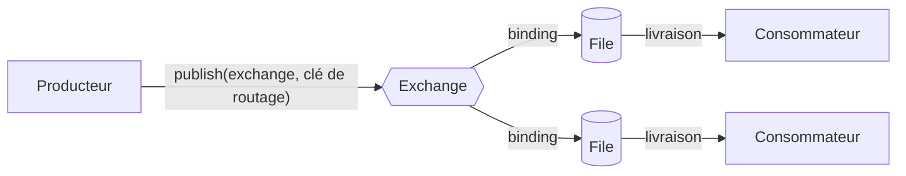

import { Tabs, TabItem } from '@astrojs/starlight/components';

Exemple complet : [`L01.cs`](https://github.com/spareilleux/learn/blob/main/code/rabbitmq/csharp/L01.cs) et [`L01.java`](https://github.com/spareilleux/learn/blob/main/code/rabbitmq/java/client/src/main/java/dev/learn/rabbitmq/L01.java). [`check.sh`](https://github.com/spareilleux/learn/blob/main/code/rabbitmq/check.sh) les exécute et compare leur sortie, ainsi que celle des commandes CLI ci-dessous, avec les fichiers de [`expected`](https://github.com/spareilleux/learn/tree/main/code/rabbitmq/expected).

## Le modèle

Un broker de messages se place entre les programmes qui envoient des messages et ceux qui les reçoivent, pour qu'aucun n'ait à connaître l'autre ni à s'exécuter en même temps. Le protocole natif de RabbitMQ est [AMQP 0-9-1](https://www.rabbitmq.com/tutorials/amqp-concepts), et son modèle a plus de pièces que « mettre un message dans une file » :



Un producteur n'écrit jamais dans une file. Il publie un message vers un **exchange**, avec une **clé de routage** (*routing key*). L'exchange compare le message à ses **bindings**, les règles qui le relient à des files, et dépose une copie dans chaque file qui correspond. Une **file** (*queue*) stocke les messages dans l'ordre jusqu'à ce qu'un **consommateur** les prenne et les acquitte. La leçon 2 porte sur les exchanges et les bindings ; la leçon 4 sur les acquittements.

| AMQP 0-9-1 | Ce que c'est | L'équivalent le plus proche que vous connaissez peut-être |
|---|---|---|
| connection | une connexion TCP de longue durée d'un client vers le broker | une `SqlConnection` en pool, un `HttpClient` partagé |
| channel | une session légère multiplexée sur une connexion ; presque toutes les opérations passent par un canal | une `Session` JMS |
| virtual host | un espace de noms isolé d'exchanges, de files et de permissions ; `/` par défaut | une base de données sur une instance SQL Server |
| exchange | un routeur, dont le type fixe les règles | un topic Azure Service Bus |
| binding | une règle d'un exchange vers une file (ou vers un autre exchange) | une règle d'abonnement |
| queue | un tampon ordonné que lisent les consommateurs | une file ou un abonnement Service Bus |
| message | des propriétés (type de contenu, identifiant, en-têtes…) et un corps d'octets | une requête HTTP : des en-têtes et un corps |

RabbitMQ 4 parle aussi d'autres protocoles, dont [AMQP 1.0](https://www.rabbitmq.com/docs/amqp), [MQTT](https://www.rabbitmq.com/docs/mqtt) et les [streams](https://www.rabbitmq.com/docs/streams) ; la leçon 12 les couvre. AMQP 0-9-1 reste celui qu'utilisent le client .NET, le client Java et Spring AMQP, et celui que parlent la plupart des applications existantes.

## Lancer RabbitMQ dans un conteneur

L'[image Docker](https://hub.docker.com/_/rabbitmq) officielle existe en deux variantes : `rabbitmq:4.3.5` est le broker seul, et `rabbitmq:4.3.5-management` ajoute le plugin de gestion, son interface web et son API HTTP. Le cours fixe le tag exact ; sur ma machine, il correspondait au digest `sha256:57bddb6fbc3498b5d8b5a14dc6f4506073ebcf94c66ba2a7678c335faa8dd631`.

<Tabs syncKey="os">
<TabItem label="Windows">

Avec Docker Desktop, dans PowerShell :

```powershell
docker run -d --name rabbitmq --hostname rabbitmq --user rabbitmq `
  -p 5672:5672 -p 15672:15672 rabbitmq:4.3.5-management
```

Avec `wslc` (voir [Conteneurs WSL](../../wsl-containers/)) ou Podman, les mêmes options s'appliquent :

```powershell
wslc run -d --name rabbitmq --hostname rabbitmq --user rabbitmq -p 5672:5672 -p 15672:15672 rabbitmq:4.3.5-management
podman run -d --name rabbitmq --hostname rabbitmq --user rabbitmq -p 5672:5672 -p 15672:15672 docker.io/library/rabbitmq:4.3.5-management
```

</TabItem>
<TabItem label="Linux / WSL">

```bash
docker run -d --name rabbitmq --hostname rabbitmq --user rabbitmq \
  -p 5672:5672 -p 15672:15672 rabbitmq:4.3.5-management
```

</TabItem>
<TabItem label="macOS">

```bash
docker run -d --name rabbitmq --hostname rabbitmq --user rabbitmq \
  -p 5672:5672 -p 15672:15672 rabbitmq:4.3.5-management
```

</TabItem>
</Tabs>

J'ai exécuté la commande Docker Desktop sous Windows le 2026-09-15 ; `wslc` 2.9.11 liste `--hostname` et `--user` dans `wslc run --help`, mais les commandes `wslc` et Podman, ainsi que les commandes Linux et macOS, sont *à vérifier* sur cette machine (la CI exécute la même image sous Linux comme service GitHub Actions). Le [`broker.sh`](https://github.com/spareilleux/learn/blob/main/code/rabbitmq/broker.sh) du cours enveloppe ces commandes, avec `bash broker.sh start` et `bash broker.sh stop`.

Chaque option a sa raison d'être :

- **`-p 5672:5672`** publie le port AMQP, et **`-p 15672:15672`** l'interface de gestion et l'API HTTP.
- **`--hostname rabbitmq`** fixe le nom du nœud. Un nœud RabbitMQ s'appelle `rabbit@<hostname>`, et il range ses données dans un répertoire nommé d'après le nœud. Docker donne un hostname aléatoire à chaque nouveau conteneur : sans cette option, un conteneur recréé sur le même volume démarre sous un autre nom et ne trouve pas ses files. La [documentation de l'image](https://hub.docker.com/_/rabbitmq) demande de le fixer pour cette raison.
- **`--user rabbitmq`** exécute tout ce qui tourne dans le conteneur, y compris les commandes lancées avec `docker exec`, sous l'utilisateur `rabbitmq`. La section suivante montre ce qui se passe sans.

### Le broker qui s'arrêtait avant d'avoir démarré

Mon premier `broker.sh` démarrait le conteneur sans `--user`, puis attendait le broker dans une boucle qui exécutait `docker exec rabbitmq rabbitmq-diagnostics -q check_port_connectivity` chaque seconde. Le conteneur s'est arrêté en moins de deux secondes. Son log :

```text
2026-09-15 04:20:55.976303+00:00 [error] <0.153.0> Error when reading /var/lib/rabbitmq/.erlang.cookie: eacces
...
Kernel pid terminated (application_controller) ("{application_start_failure,rabbitmq_prelaunch,{{shutdown,{failed_to_start_child,prelaunch,{badmatch,{error,{{shutdown,{failed_to_start_child,auth,{\"Error when reading /var/lib/rabbitmq/.erlang.cookie: eacces\",...
```

Le **cookie Erlang** est un secret partagé. Les nœuds RabbitMQ s'en servent pour communiquer entre eux, tout comme les [outils CLI](https://www.rabbitmq.com/docs/cli) : `rabbitmqctl` et `rabbitmq-diagnostics` ne sont pas des clients HTTP, ils rejoignent le nœud par la distribution Erlang (port 25672) et doivent présenter le même cookie. Le premier processus qui a besoin du cookie et ne trouve pas de fichier crée `/var/lib/rabbitmq/.erlang.cookie`. `docker exec` s'exécute en root par défaut : ma première commande de diagnostic, une seconde après le démarrage du conteneur, a gagné la course et créé le fichier, propriété de root avec le mode `0400`. Le nœud, que l'image exécute sous l'utilisateur `rabbitmq`, ne pouvait plus le lire. Pour le reproduire, une ligne suffit après le `docker run` sans `--user` :

```text
$ docker exec rabbitmq rabbitmq-diagnostics -q check_port_connectivity
$ docker exec rabbitmq ls -la /var/lib/rabbitmq/.erlang.cookie
-r-------- 1 root root 20 Sep 15 00:00 /var/lib/rabbitmq/.erlang.cookie
```

Un conteneur démarré normalement, où le nœud a écrit le fichier lui-même, affiche `rabbitmq rabbitmq` comme propriétaire. Un health check comme le `test: rabbitmq-diagnostics ping` de Docker Compose avec un intervalle court provoque le même plantage ; il a été signalé dans [docker-library/rabbitmq#695](https://github.com/docker-library/rabbitmq/issues/695). Avec `--user rabbitmq`, la CLI s'exécute sous le même utilisateur que le nœud, et quel que soit le créateur du fichier, le nœud peut le lire. Je l'ai vérifié en local avec un health check chaque seconde, et le conteneur de service de la CI du cours utilise la même option.

## Est-il vivant ? Les outils CLI

RabbitMQ fournit [plusieurs outils CLI](https://www.rabbitmq.com/docs/cli) : `rabbitmqctl` pour l'administration (utilisateurs, files, politiques), `rabbitmq-diagnostics` pour les health checks et l'inspection, `rabbitmq-plugins` pour les plugins, et `rabbitmq-queues`, `rabbitmq-streams` et `rabbitmq-upgrade` pour des tâches plus spécialisées. Dans un conteneur, lancez-les avec `docker exec` :

```text
$ docker exec rabbitmq rabbitmq-diagnostics server_version
Asking node rabbit@rabbitmq for its RabbitMQ version...
4.3.5
```

```text
$ docker exec rabbitmq rabbitmq-diagnostics listeners
Asking node rabbit@rabbitmq to report its protocol listeners ...
Interface: [::], port: 15672, protocol: http, purpose: HTTP API
Interface: [::], port: 15692, protocol: http/prometheus, purpose: Prometheus exporter API over HTTP
Interface: [::], port: 25672, protocol: clustering, purpose: inter-node and CLI tool communication
Interface: [::], port: 5672, protocol: amqp, purpose: AMQP 0-9-1 and AMQP 1.0
```

Les listeners racontent toute l'histoire des ports : 5672 pour les clients (AMQP 0-9-1 et, depuis RabbitMQ 4.0, AMQP 1.0 sur le même port), 15672 pour le plugin de gestion, 15692 pour les métriques Prometheus (leçon 10), et 25672 pour les outils CLI et les autres nœuds. L'image active deux plugins :

```text
$ docker exec rabbitmq rabbitmq-plugins list --enabled
Listing plugins with pattern ".*" ...
 Configured: E = explicitly enabled; e = implicitly enabled
 | Status: * = running on rabbit@rabbitmq
 |/
[E*] rabbitmq_management 4.3.5
[E*] rabbitmq_prometheus 4.3.5
```

Pour un health check, le [guide de monitoring](https://www.rabbitmq.com/docs/monitoring#health-checks) recommande des commandes qui testent chacune une seule chose, de la moins intrusive à la plus intrusive : `rabbitmq-diagnostics -q ping`, `check_running`, `check_local_alarms`, `check_port_connectivity`. La dernière se connecte à chaque listener, c'est pourquoi `broker.sh` l'attend :

```text
$ docker exec rabbitmq rabbitmq-diagnostics check_port_connectivity
Testing TCP connections to all active listeners on node rabbit@rabbitmq using hostname resolution ...
Will connect to rabbitmq:15672
Will connect to rabbitmq:15692
Will connect to rabbitmq:25672
Will connect to rabbitmq:5672
Successfully connected to ports 5672, 15672, 15692, 25672 on node rabbit@rabbitmq (using node hostname resolution)
```

## L'interface de gestion et l'API HTTP

Ouvrez [http://localhost:15672](http://localhost:15672) et connectez-vous en `guest` avec le mot de passe `guest`. L'onglet Overview montre les débits de messages ainsi que la mémoire et le disque du nœud ; les onglets Connections, Channels, Exchanges et Queues listent ce que la section suivante crée, et la page d'une file a un bouton « Get messages » bien pratique pour déboguer.

Par défaut, RabbitMQ n'accepte l'utilisateur `guest` que depuis localhost ([contrôle d'accès](https://www.rabbitmq.com/docs/access-control#loopback-users)). Les connexions qui passent par le port publié par Docker viennent du réseau du conteneur, pas de son interface loopback, donc l'image lève la restriction dans `/etc/rabbitmq/conf.d/10-defaults.conf` :

```ini
## DEFAULT SETTINGS ARE NOT MEANT TO BE TAKEN STRAIGHT INTO PRODUCTION
## see https://www.rabbitmq.com/configure.html for further information
## on configuring RabbitMQ

## allow access to the guest user from anywhere on the network
## https://www.rabbitmq.com/access-control.html#loopback-users
## https://www.rabbitmq.com/production-checklist.html#users
loopback_users.guest = false
```

C'est acceptable sur un portable et faux partout ailleurs ; la leçon 9 remplace `guest`. Tout ce qu'affiche l'interface vient de l'[API HTTP](https://www.rabbitmq.com/docs/http-api-reference), que des scripts peuvent appeler directement. Le paramètre `columns` ne garde que les champs demandés, et `%2F` est le virtual host `/`, encodé pour l'URL :

```text
$ curl -s -u guest:guest "http://localhost:15672/api/overview?columns=rabbitmq_version,erlang_version,cluster_name,node"
{"rabbitmq_version":"4.3.5","cluster_name":"rabbit@rabbitmq","erlang_version":"27.3.4.17","node":"rabbit@rabbitmq"}
$ curl -s -u guest:guest "http://localhost:15672/api/queues/%2F/hello?columns=name,type,durable,messages"
{"durable":true,"messages":0,"name":"hello","type":"classic"}
```

Sous Windows, tapez `curl.exe` dans PowerShell, où `curl` est un alias de `Invoke-WebRequest`. L'image exécute RabbitMQ 4.3.5 sur Erlang/OTP 27.3 ; la [page de compatibilité Erlang](https://www.rabbitmq.com/docs/which-erlang) indique 27.x comme série prise en charge pour 4.3.5.

## Un premier producteur

Le programme C# utilise [RabbitMQ.Client](https://www.rabbitmq.com/client-libraries/dotnet-api-guide) 7, dont l'API est asynchrone de bout en bout. Un petit utilitaire, [`Broker.ConnectAsync`](https://github.com/spareilleux/learn/blob/main/code/rabbitmq/csharp/Broker.cs), crée une `ConnectionFactory` pour `localhost` (ou `RABBITMQ_HOST`) et nomme la connexion :

```csharp
public static async Task Send()
{
    await using IConnection connection = await ConnectAsync("l01-send");
    Console.WriteLine($"connected to {Text(connection.ServerProperties?["product"])} {Text(connection.ServerProperties?["version"])}");

    // Un canal est une session légère multiplexée sur la connexion ; presque toutes les opérations AMQP passent par un canal.
    await using IChannel channel = await connection.CreateChannelAsync();

    // Déclarer est idempotent : cela crée la file, ou vérifie que la file existante a les mêmes paramètres.
    QueueDeclareOk queue = await channel.QueueDeclareAsync("hello", durable: true, exclusive: false, autoDelete: false);
    Console.WriteLine($"queue {queue.QueueName}: {queue.MessageCount} message(s) waiting");

    for (var i = 1; i <= 3; i++)
    {
        // L'exchange par défaut "" livre à la file dont le nom est la clé de routage.
        await channel.BasicPublishAsync(exchange: "", routingKey: "hello", body: Bytes($"Hello {i}"));
        Console.WriteLine($"sent Hello {i}");
    }
}
```

Compilez-le et exécutez-le depuis `code/rabbitmq` (la commande est la même sur les trois OS) :

```text
$ dotnet run --project csharp -- l01-send
connected to RabbitMQ 4.3.5
queue hello: 0 message(s) waiting
sent Hello 1
sent Hello 2
sent Hello 3
```

Quatre choses dans ces quelques lignes comptent pour la suite du cours :

- **Les connexions et les canaux vivent longtemps.** Le [guide du client .NET](https://www.rabbitmq.com/client-libraries/dotnet-api-guide#connection-and-channel-lifespan) qualifie l'ouverture d'une connexion par opération de « unnecessary and strongly discouraged » : c'est une connexion TCP avec une poignée de main protocolaire. Une application en ouvre une au démarrage, comme un `HttpClient` partagé, et ouvre des canaux dessus.
- **Déclarer est idempotent.** `QueueDeclareAsync` crée `hello` si la file n'existe pas, et réussit sans rien changer si elle existe avec les mêmes paramètres. Le producteur et le consommateur la déclarent tous les deux, donc n'importe lequel peut démarrer en premier. La leçon 2 montre ce qui se passe quand les paramètres diffèrent.
- **L'exchange par défaut.** Chaque virtual host a un exchange dont le nom est la chaîne vide, avec un binding implicite vers chaque file sous le nom de la file. Publier vers `""` avec la clé de routage `hello` atteint donc la file `hello` ; c'est ce qui donne à AMQP l'air d'« envoyer à une file » dans les tutoriels.
- **La file est durable.** Une file durable survit au redémarrage du broker. RabbitMQ 4.3 n'autorise même plus une file non durable qui n'est pas exclusive à sa connexion, comme l'a découvert la leçon 4.

Le client Java fait la même chose avec des appels bloquants. `connection.getServerProperties()` renvoie la même table, dont les chaînes s'affichent directement :

```java
static void send() throws Exception {
    try (Connection connection = connect("l01-send-java");
         Channel channel = connection.createChannel()) {
        var server = connection.getServerProperties();
        System.out.println("connected to " + server.get("product") + " " + server.get("version"));

        AMQP.Queue.DeclareOk queue = channel.queueDeclare("hello", true, false, false, null);
        System.out.println("queue " + queue.getQueue() + ": " + queue.getMessageCount() + " message(s) waiting");

        for (int i = 1; i <= 3; i++) {
            // exchange "", clé de routage = nom de la file, sans propriétés
            channel.basicPublish("", "hello", null, bytes("Hello " + i));
            System.out.println("sent Hello " + i);
        }
    }
}
```

Compilez-le une fois avec `mvn -f java/pom.xml package`, qui produit un JAR exécutable ; ensuite `java -jar java/client/target/rabbitmq-client.jar l01-send` affiche exactement les mêmes lignes que le programme C#.

## Le broker entre les deux

Rien n'a encore consommé les messages. Le broker les garde :

```text
$ docker exec rabbitmq rabbitmqctl list_queues name messages consumers
Timeout: 60.0 seconds ...
Listing queues for vhost / ...
name	messages	consumers
hello	3	0
```

`list_queues` prend les noms des colonnes à afficher ; `rabbitmqctl help list_queues` les liste toutes. Le producteur s'est terminé, et les trois messages attendent un consommateur qui n'existe pas encore. C'est le découplage qu'apporte un broker : les deux programmes n'ont pas à s'exécuter en même temps, ni à être écrits dans le même langage.

## Un premier consommateur, dans l'autre langage

Le consommateur Java enregistre un callback avec `basicConsume`, et le broker lui pousse les messages :

```java
static void receive() throws Exception {
    try (Connection connection = connect("l01-receive-java");
         Channel channel = connection.createChannel()) {
        AMQP.Queue.DeclareOk queue = channel.queueDeclare("hello", true, false, false, null);
        System.out.println("queue " + queue.getQueue() + ": " + queue.getMessageCount() + " message(s) waiting");

        CountDownLatch waiting = new CountDownLatch(queue.getMessageCount());
        // Le callback s'exécute sur le pool de threads consommateurs du client, un message à la fois par canal.
        channel.basicConsume("hello", true,
                (consumerTag, delivery) -> {
                    System.out.println("received " + text(delivery.getBody()));
                    waiting.countDown();
                },
                consumerTag -> { });
        await(waiting, "the waiting messages");
    }
}
```

```text
$ java -jar java/client/target/rabbitmq-client.jar l01-receive
queue hello: 3 message(s) waiting
received Hello 1
received Hello 2
received Hello 3
```

Le programme Java a lu ce que le programme C# a écrit : le broker ne voit que des octets et des propriétés. Un vrai consommateur tourne jusqu'à l'arrêt de l'application ; celui-ci s'arrête dès qu'il a lu ce qui attendait, pour que sa sortie puisse être comparée. Le consommateur C# est le même avec un [`AsyncEventingBasicConsumer`](https://github.com/rabbitmq/rabbitmq-dotnet-client/blob/740faf07f04ade7d35d3539e20613c6ac6b9b46f/projects/RabbitMQ.Client/Events/AsyncEventingBasicConsumer.cs), dont l'événement `ReceivedAsync` renvoie une `Task` :

```csharp
var consumer = new AsyncEventingBasicConsumer(channel);
consumer.ReceivedAsync += (_, delivery) =>
{
    Console.WriteLine($"received {Text(delivery.Body)}");
    if (--remaining == 0)
    {
        done.TrySetResult();
    }
    return Task.CompletedTask;
};

// autoAck: true signifie que le broker oublie un message dès qu'il l'envoie. La leçon 4 montre ce que cela coûte.
await channel.BasicConsumeAsync("hello", autoAck: true, consumer);
```

`autoAck: true` (le deuxième argument de `basicConsume` en Java) est ce par quoi commencent les [tutoriels RabbitMQ](https://www.rabbitmq.com/tutorials/tutorial-one-dotnet), et ce que la leçon 4 remplace : un consommateur qui plante avec des messages en main les perd.

## À retenir

- Un producteur envoie à un exchange avec une clé de routage ; les bindings décident quelles files reçoivent une copie ; les consommateurs lisent les files. L'exchange par défaut `""` route vers la file nommée par la clé.
- Les connexions sont des connexions TCP de longue durée ; les canaux sont des sessions bon marché par-dessus. Ouvrez une connexion par application, pas une par message.
- Déclarer des exchanges et des files est idempotent, donc chaque programme déclare ce qu'il utilise.
- Lancez l'image avec un `--hostname` fixe, pour que le nœud garde son nom et ses données, et avec `--user rabbitmq`, pour qu'un outil CLI lancé en root ne puisse pas créer le cookie Erlang avant le nœud et le faire planter.
- `rabbitmq-diagnostics` vérifie la santé, `rabbitmqctl` administre, et l'interface de gestion montre les mêmes données que l'API HTTP sur le port 15672.
- Le broker stocke des octets et des propriétés : un producteur C# et un consommateur Java doivent s'accorder sur la file et le format, rien d'autre.

## Exercices

1. Exécutez `l01-send` deux fois sans consommateur, puis `rabbitmqctl list_queues name messages consumers`, puis `l01-receive`. Prédisez chaque ligne avant d'exécuter.

<details>
<summary>Solution</summary>

```text
$ dotnet run --project csharp -- l01-send
connected to RabbitMQ 4.3.5
queue hello: 0 message(s) waiting
sent Hello 1
sent Hello 2
sent Hello 3
$ dotnet run --project csharp -- l01-send
connected to RabbitMQ 4.3.5
queue hello: 3 message(s) waiting
sent Hello 1
sent Hello 2
sent Hello 3
$ docker exec rabbitmq rabbitmqctl list_queues name messages consumers
Timeout: 60.0 seconds ...
Listing queues for vhost / ...
name	messages	consumers
hello	6	0
$ dotnet run --project csharp -- l01-receive
queue hello: 6 message(s) waiting
received Hello 1
received Hello 2
received Hello 3
received Hello 1
received Hello 2
received Hello 3
```

La seconde déclaration trouve la file avec trois messages et n'y touche pas : déclarer ne vide jamais une file. La file garde les messages dans l'ordre de publication, donc le consommateur reçoit les trois messages de la première exécution avant ceux de la seconde. Les corps sont identiques ; seule leur position les distingue, ce qui est l'une des raisons pour lesquelles la leçon 3 donne un identifiant à chaque message.

</details>

2. Le bouton « Get messages » de l'interface de gestion appelle l'API HTTP. Publiez trois messages avec `l01-send`, puis prenez un message de `hello` deux fois avec le mode `reject_requeue_true` et une fois avec `ack_requeue_false`. Prédisez, pour chaque appel, le message renvoyé, son indicateur `redelivered`, `message_count` et les propriétés, ainsi que la longueur de la file à la fin.

<details>
<summary>Solution</summary>

```text
$ curl -s -u guest:guest -H 'content-type: application/json' -X POST 'http://localhost:15672/api/queues/%2F/hello/get' -d '{"count":1,"ackmode":"reject_requeue_true","encoding":"auto"}'
[{"payload_bytes":7,"redelivered":false,"exchange":"","routing_key":"hello","message_count":2,"properties":[],"payload":"Hello 1","payload_encoding":"string"}]
$ curl -s -u guest:guest -H 'content-type: application/json' -X POST 'http://localhost:15672/api/queues/%2F/hello/get' -d '{"count":1,"ackmode":"reject_requeue_true","encoding":"auto"}'
[{"payload_bytes":7,"redelivered":true,"exchange":"","routing_key":"hello","message_count":2,"properties":[],"payload":"Hello 1","payload_encoding":"string"}]
$ curl -s -u guest:guest -H 'content-type: application/json' -X POST 'http://localhost:15672/api/queues/%2F/hello/get' -d '{"count":1,"ackmode":"ack_requeue_false","encoding":"auto"}'
[{"payload_bytes":7,"redelivered":true,"exchange":"","routing_key":"hello","message_count":2,"properties":[],"payload":"Hello 1","payload_encoding":"string"}]
$ docker exec rabbitmq rabbitmqctl list_queues name messages
Timeout: 60.0 seconds ...
Listing queues for vhost / ...
name	messages
hello	2
```

Les trois appels renvoient `Hello 1`. `reject_requeue_true` prend le message et le remet en tête de file, donc l'appel suivant obtient le même, désormais marqué `redelivered` ; `ack_requeue_false` le retire, et il reste deux messages. `message_count` est le nombre de messages restant dans la file une fois celui renvoyé retiré, comme le champ du même nom de `basic.get-ok`, d'où 2 à chaque fois. `properties` est vide : aucun des deux clients n'ajoute de type de contenu, d'identifiant de message ou de mode de livraison si le code n'en fixe pas. Dans l'interface, les mêmes choix forment la liste « Ack Mode » de la section « Get messages » d'une file, et « Nack message requeue true » est le mode à utiliser quand on veut seulement regarder. J'ai exécuté ces commandes dans Git Bash ; dans PowerShell, `curl.exe` demande de citer le JSON autrement, ce qui est *à vérifier*.

</details>

3. Arrêtez le broker (`docker rm -f rabbitmq`) et exécutez `l01-send` dans les deux langages. Que signale chaque client, et combien de temps met chacun à abandonner ?

<details>
<summary>Solution</summary>

Sous Windows, sans rien à l'écoute sur le port 5672, le client C# a abandonné au bout de 4,3 secondes, le client Java au bout de 165 millisecondes (exceptions externes seulement, sans les piles d'appels) :

```text
Unhandled exception. RabbitMQ.Client.Exceptions.BrokerUnreachableException: None of the specified endpoints were reachable
 ---> System.AggregateException: One or more errors occurred. (Connection failed, host 127.0.0.1:5672)
 ---> RabbitMQ.Client.Exceptions.ConnectFailureException: Connection failed, host 127.0.0.1:5672
 ---> System.Net.Sockets.SocketException (10061): No connection could be made because the target machine actively refused it.
```

```text
Exception in thread "main" java.net.ConnectException: Connection refused: getsockopt
```

Les deux sont un « connection refused » ; le client .NET l'enveloppe dans `BrokerUnreachableException`, le type à intercepter au démarrage. Où passent les quatre secondes est *à vérifier* : Windows retente une connexion TCP refusée avant de le signaler, et `localhost` se résout à la fois en `::1` et en `127.0.0.1`, mais je n'ai pas tracé laquelle le client essaie en premier. Quand j'ai lancé le même test une fraction de seconde après `docker rm -f`, l'erreur C# était différente, `connection.start was never received, likely due to a network timeout`, avec `An established connection was aborted by the software in your host machine` en dessous : la redirection de port de Docker Desktop acceptait encore la connexion TCP, puis la fermait. Aucun des deux programmes ne réessaie ; un service en production a besoin d'une politique de nouvelles tentatives autour de sa première connexion, et la leçon 3 regarde la reprise automatique des connexions qui tombent plus tard.

</details>

## Sources

- RabbitMQ : [AMQP 0-9-1 model explained](https://www.rabbitmq.com/tutorials/amqp-concepts), [outils CLI](https://www.rabbitmq.com/docs/cli), [plugin de gestion](https://www.rabbitmq.com/docs/management), [référence de l'API HTTP](https://www.rabbitmq.com/docs/http-api-reference), [monitoring et health checks](https://www.rabbitmq.com/docs/monitoring#health-checks), [contrôle d'accès](https://www.rabbitmq.com/docs/access-control), [réseau et ports](https://www.rabbitmq.com/docs/networking#ports), [versions d'Erlang prises en charge](https://www.rabbitmq.com/docs/which-erlang), [informations de version](https://www.rabbitmq.com/release-information)
- [Guide de l'API du client .NET](https://www.rabbitmq.com/client-libraries/dotnet-api-guide) et [guide de l'API du client Java](https://www.rabbitmq.com/client-libraries/java-api-guide) ; [premier tutoriel en C#](https://www.rabbitmq.com/tutorials/tutorial-one-dotnet)
- L'image Docker : [documentation](https://hub.docker.com/_/rabbitmq), [source](https://github.com/docker-library/rabbitmq), [issue #695](https://github.com/docker-library/rabbitmq/issues/695) sur le cookie créé par un health check
