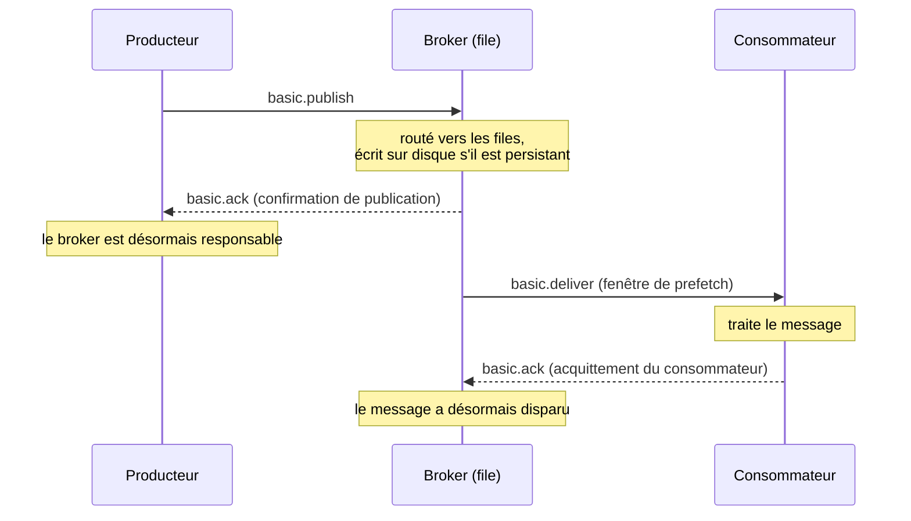

Exemple complet : [`L04.cs`](https://github.com/spareilleux/learn/blob/main/code/rabbitmq/csharp/L04.cs), avec les confirmations de publication en Java dans [`L04.java`](https://github.com/spareilleux/learn/blob/main/code/rabbitmq/java/client/src/main/java/dev/learn/rabbitmq/L04.java). Entre deux de ses programmes, [`check.sh`](https://github.com/spareilleux/learn/blob/main/code/rabbitmq/check.sh) redémarre le broker.

## Une chaîne de responsabilité

« RabbitMQ a perdu mon message » veut généralement dire que quelqu'un a transmis un message sans vérifier que l'autre côté l'avait pris. Un message change de mains deux fois, et AMQP prévoit un reçu pour chaque passage :



Tant que la confirmation n'est pas arrivée, le producteur est responsable du message : si la connexion tombe, lui seul peut le renvoyer. Entre la livraison et l'acquittement, le broker garde le message et le donne à quelqu'un d'autre si le consommateur disparaît. Cette leçon casse chaque maillon à dessein et affiche le résultat.

## Acquittements des consommateurs

Un consommateur choisit, quand il appelle `basic.consume`, entre deux modes. Avec l'**acquittement automatique** (`autoAck: true`), le broker considère un message comme livré dès qu'il l'écrit sur le socket. Avec l'**acquittement manuel**, le message reste dans la file, marqué non acquitté, jusqu'à ce que le consommateur envoie `basic.ack` avec son delivery tag.

Les programmes simulent un plantage avec un consommateur qui traite les messages jusqu'à l'un d'eux, puis ne traite plus rien, comme un processus mort, et ferme son canal, ce que voit le broker quand une connexion est perdue :

```csharp
ReceivedAsync += async (_, delivery) =>
{
    if (Crashed.Task.IsCompleted)
    {
        return;
    }
    var body = Text(delivery.Body);
    if (body == crashOn)
    {
        Console.WriteLine($"  consumer 1 crashes while handling {body}");
        Crashed.TrySetResult();
        return;
    }
    Console.WriteLine($"  consumer 1 handled {body}");
    if (!autoAck)
    {
        await Channel.BasicAckAsync(delivery.DeliveryTag, multiple: false);
    }
};
```

Un second consommateur lit ensuite ce qui reste. Avec `autoAck: true` et cinq tâches :

```text
autoAck: true, 5 tasks
  consumer 1 handled task 1
  consumer 1 crashes while handling task 2
  work.autoack holds 0 message(s)
```

Les tâches 2 à 5 ont disparu. Le broker a poussé les cinq vers le consommateur 1 dès son abonnement, et les a oubliées ; le client les avait en mémoire quand il est mort. Le [guide des acquittements](https://www.rabbitmq.com/docs/confirms#acknowledgement-modes) dit que le mode automatique « should be considered unsafe » pour cette raison. Le même plantage avec des acquittements manuels, et quatre tâches :

```text
autoAck: false, prefetch 1, 4 tasks
  consumer 1 handled task 1
  consumer 1 crashes while handling task 2
  work.manual holds 3 message(s)
  consumer 2 handled task 2 redelivered=True
  consumer 2 handled task 3 redelivered=False
  consumer 2 handled task 4 redelivered=False
autoAck: false, prefetch unlimited, 4 tasks
  consumer 1 handled task 1
  consumer 1 crashes while handling task 2
  work.manual holds 3 message(s)
  consumer 2 handled task 2 redelivered=True
  consumer 2 handled task 3 redelivered=True
  consumer 2 handled task 4 redelivered=True
```

Rien n'est perdu : « any delivery (message) that was not acked is automatically requeued when the channel (or connection) on which the delivery happened is closed », selon les termes du guide. L'indicateur **`redelivered`** diffère entre les deux exécutions, et il en dit plus sur le prefetch que sur le plantage :

- Avec un **prefetch de 1**, le broker envoie un message, attend son acquittement, puis envoie le suivant. Le consommateur 1 n'a jamais reçu les tâches 3 et 4, donc elles arrivent au consommateur 2 avec `redelivered=False`.
- **Sans limite de prefetch**, le broker a envoyé toutes les tâches au consommateur 1 d'un coup. Les tâches 3 et 4 avaient été livrées, bien que jamais traitées, donc elles reviennent avec `redelivered=True`.

`redelivered=True` signifie donc « ce message a peut-être déjà été livré », pas « quelqu'un a commencé à le traiter ». Un consommateur ne peut pas s'en servir pour sauter du travail ; il peut s'en servir comme indice qu'un doublon est possible, ce que traite la dernière section.

## Rejeter un message

Un consommateur qui ne peut pas traiter un message envoie [`basic.nack`](https://www.rabbitmq.com/docs/nack) ou `basic.reject` (l'original AMQP, pour un seul message) avec un indicateur `requeue`. [`Nack`](https://github.com/spareilleux/learn/blob/main/code/rabbitmq/csharp/L04.cs) utilise `basic.get` pour montrer chaque étape, sur une file contenant `task 1` et `task 2` :

```text
get task 1 delivery-tag=1 redelivered=False (then 1 ready)
  nack requeue=true: back in the queue, at its original position
get task 1 delivery-tag=2 redelivered=True (then 1 ready)
  reject requeue=false: discarded (or dead-lettered, lesson 6)
get task 2 delivery-tag=3 redelivered=False (then 0 ready)
  ack: removed
work.nack holds 0 message(s)
```

- `requeue: true` a remis `task 1` **en tête** de la file, donc le `basic.get` suivant l'a renvoyé de nouveau, avec un nouveau delivery tag et `redelivered=True`. Le guide dit qu'un message remis en file retourne « to its original position in its queue, if possible ». Un consommateur qui fait un nack avec requeue sur un message qu'il ne traitera jamais crée une boucle qui tourne aussi vite que le réseau le permet.
- `requeue: false` l'a retiré. Sans dead-letter exchange, que la leçon 6 configure, cela veut dire supprimé.
- Les **delivery tags** comptent les livraisons sur un canal, 1, 2, 3, relivraisons comprises. Ils ne sont valides que sur le canal qui les a reçus : acquitter sur un autre canal le ferme avec une erreur `PRECONDITION_FAILED - unknown delivery tag`.

## Prefetch : la fenêtre du consommateur

`BasicQosAsync(prefetchSize: 0, prefetchCount: 3, global: false)` fixe combien de messages non acquittés le broker envoie à chaque consommateur du canal. Un consommateur qui n'acquitte jamais, sur une file de dix :

```text
received 3, still ready in the queue: 7
channel closed, ready again: 10
```

Le broker s'est arrêté à trois et a gardé sept messages **prêts** (*ready*) pour d'autres consommateurs ; fermer le canal a rendu de nouveau prêts les trois non acquittés. Le prefetch est la façon dont RabbitMQ répartit le travail entre consommateurs concurrents : un consommateur lent qui garde ses trois messages n'en reçoit pas d'autres, et les autres prennent le reste. Une fenêtre illimitée, le défaut d'un nouveau canal, laisse le broker pousser toute la file dans la mémoire d'un seul consommateur. Le [guide du prefetch](https://www.rabbitmq.com/docs/consumer-prefetch) et le guide des acquittements suggèrent que « values in the 100 through 300 range usually offer optimal throughput » ; le défaut de 250 de Spring AMQP est dans cette plage. Pour un travail qui prend des secondes par message, un prefetch de 1 donne la répartition la plus équitable.

## Confirmations de publication

L'autre maillon relie le producteur au broker. Une publication part sans retour : que `BasicPublishAsync` se termine veut seulement dire que les octets ont quitté le processus. Avec les [confirmations de publication](https://www.rabbitmq.com/docs/confirms#publisher-confirms) activées sur le canal, le broker répond à chaque publication par `basic.ack` une fois qu'il en a pris la responsabilité, ou par `basic.nack` s'il la refuse. RabbitMQ.Client 7 peut suivre les réponses pour vous :

```csharp
var options = new CreateChannelOptions(publisherConfirmationsEnabled: true, publisherConfirmationTrackingEnabled: true);
await using IChannel channel = await connection.CreateChannelAsync(options);
```

Avec le suivi activé, `BasicPublishAsync` ne se termine pas avant l'arrivée de la confirmation, et lève une exception si le broker refuse le message ou le renvoie. Cinq publications, les deux dernières vers une file déclarée avec `x-max-length` 1 et `x-overflow` à `reject-publish` :

```csharp
await PublishAsync("orders.confirmed", mandatory: false, "order 1");
await PublishAsync("no-such-queue", mandatory: false, "order 2");
await PublishAsync("no-such-queue", mandatory: true, "order 3");
await PublishAsync("orders.limited", mandatory: false, "order 4");
await PublishAsync("orders.limited", mandatory: false, "order 5");
```

```text
#1 order 1 to orders.confirmed: confirmed
#2 order 2 to no-such-queue: confirmed
#3 order 3 to no-such-queue: PublishReturnException 312 NO_ROUTE
#4 order 4 to orders.limited: confirmed
#5 order 5 to orders.limited: PublishException IsReturn=False "Message rejected by broker."
```

Chaque ligne mérite une lecture attentive :

1. **Confirmé** signifie que le message a atteint chaque file vers laquelle il a été routé et, pour un message persistant dans une file durable, qu'il a été écrit sur disque. Le broker [écrit sur disque par lots](https://www.rabbitmq.com/docs/confirms#when-publishes-are-confirmed) « after an interval (a few hundred milliseconds) », donc les confirmations de messages persistants prennent ce temps sous une charge légère.
2. **Un message non routable est confirmé aussi.** Le broker « will issue a confirm once the exchange verifies a message won't route to any queue ». La commande 2 a disparu, et la confirmation ne le dit qu'au sens où le broker n'a plus rien à en faire. Une confirmation n'est pas une preuve de livraison.
3. **`mandatory` le rend visible.** Le broker envoie `basic.return` avant le `basic.ack`, et le client transforme la paire en une [`PublishReturnException`](https://github.com/rabbitmq/rabbitmq-dotnet-client/blob/740faf07f04ade7d35d3539e20613c6ac6b9b46f/projects/RabbitMQ.Client/Exceptions/PublishException.cs#L76-L113) qui porte le code et le texte de réponse.
4. La file limitée a accepté la commande 4.
5. **Un nack.** Avec `reject-publish`, une file pleine refuse les nouveaux messages et, selon le [guide de la limite de longueur](https://www.rabbitmq.com/docs/maxlength), « the publisher will be informed of the reject via a `basic.nack` ». Le client lève une simple `PublishException` avec `IsReturn=False`. Le guide des confirmations dit aussi qu'un nack n'est sinon envoyé que quand « an internal error occurs in the Erlang process responsible for a queue », c'est pourquoi une file pleine est le moyen le plus simple d'en voir un.

Les numéros `#1` à `#5` sont les **numéros de séquence de publication** du canal, que `GetNextPublishSequenceNumberAsync` renvoie avant chaque publication et auxquels se réfèrent les confirmations.

Le client Java vous laisse l'attente. `confirmSelect()` active les confirmations, `waitForConfirms(timeout)` bloque jusqu'à ce que toutes les publications en attente soient confirmées et renvoie `false` si l'une a été refusée, et un `ReturnListener` reçoit `basic.return` :

```java
// Passe le canal en mode confirmation : désormais le broker acquitte (ack) ou refuse (nack) chaque publication, numérotée à partir de 1.
channel.confirmSelect();
// S'exécute sur le thread de la connexion quand basic.return arrive, avant la confirmation qui le suit.
channel.addReturnListener(r -> System.out.println("   basic.return " + r.getReplyCode() + " " + r.getReplyText()));
```

```text
#1 order 1 to orders.confirmed: confirmed
#2 order 2 to no-such-queue: confirmed
   basic.return 312 NO_ROUTE
#3 order 3 to no-such-queue: confirmed
#4 order 4 to orders.limited: confirmed
#5 order 5 to orders.limited: nacked
```

Le return listener a affiché sa ligne avant que `waitForConfirms` ne rende la main pour la commande 3 : `basic.return` arrive en premier, comme le dit le guide. Contrairement au suivi du client .NET, le client Java signale ce message comme confirmé, et c'est à l'application de relier le retour à la publication. Attendre chaque confirmation à tour de rôle, comme le font les deux programmes, est simple et lent ; publier un lot et attendre une fois, ou publier en parallèle en bornant les confirmations en attente (le paramètre `outstandingPublisherConfirmationsRateLimiter` de `CreateChannelOptions`), est plus rapide. La leçon 11 mesure la différence.

## Survivre à un redémarrage du broker

Un message ne survit à un redémarrage que si sa file est **durable** et que le message est **persistant** (`delivery_mode` 2, `DeliveryModes.Persistent`). Le premier programme publie un message persistant et un message transitoire dans une file durable, puis tente de déclarer une file non durable :

```text
orders.durable holds 2 message(s), both confirmed
non-durable queue refused: 541 INTERNAL_ERROR - Feature `transient_nonexcl_queues` is deprecated.
By default, this feature is not permitted anymore.
The feature will be removed from a future major RabbitMQ version, regardless of the configuration; actual version to be determined.
To...
channel open: False, connection open: False
```

`check.sh` exécute ensuite `docker restart` sur le broker, et le second programme regarde :

```text
orders.durable: persistent order
orders.transient: 404 NOT_FOUND - no queue 'orders.transient' in vhost '/'
```

Le message transitoire a été perdu avec le redémarrage, bien qu'il ait été confirmé. La file non durable n'a jamais existé : RabbitMQ 4.3.5 refuse de créer une file qui n'est ni durable ni exclusive. [`rabbit_amqqueue.erl`](https://github.com/rabbitmq/rabbitmq-server/blob/0dde27bfdd1984ff7e157226fd97656854a7f359/deps/rabbit/src/rabbit_amqqueue.erl#L115-L119) déclare la [fonctionnalité dépréciée](https://www.rabbitmq.com/docs/deprecated-features) `transient_nonexcl_queues` dans la phase `denied_by_default`, et le [code de déclaration](https://github.com/rabbitmq/rabbitmq-server/blob/0dde27bfdd1984ff7e157226fd97656854a7f359/deps/rabbit/src/rabbit_amqqueue.erl#L234-L240) répond par un 541 `INTERNAL_ERROR`, une erreur de connexion : la dernière ligne du programme montre que toute la connexion s'est fermée, pas seulement le canal. Une ancienne application qui déclare des files `durable: false`, comme le faisaient beaucoup de tutoriels, échoue à sa première déclaration après une mise à jour vers 4.x. La dépréciation peut être levée dans la configuration (`deprecated_features.permit.transient_nonexcl_queues = true`) jusqu'au retrait de la fonctionnalité, ce qui est *à vérifier* sur 4.3.5.

Le texte de l'erreur s'arrête à `To...`. Un texte de réponse est une short string AMQP, de 255 octets au plus, et l'avertissement est plus long ; le texte complet est dans le log du broker.

## Les doublons sont normaux : consommateurs idempotents

Les règles ci-dessus donnent une livraison **au moins une fois** (*at-least-once*) : un message n'est jamais perdu une fois confirmé et persisté, et il peut arriver plus d'une fois. Deux événements ordinaires produisent des doublons :

- un producteur qui ne reçoit pas de confirmation, parce que la connexion est tombée après que le broker a stocké le message, le publie de nouveau ;
- un consommateur qui a traité un message et est mort avant que son acquittement n'atteigne le broker le reçoit de nouveau.

[`Idempotent`](https://github.com/spareilleux/learn/blob/main/code/rabbitmq/csharp/L04.cs) reproduit les deux. Le producteur envoie `P-1` deux fois avec le même identifiant de message, comme après une confirmation perdue. Le consommateur 1 débite `P-2` et plante avant de l'acquitter. Les consommateurs mémorisent les identifiants qu'ils ont traités :

```csharp
var id = delivery.BasicProperties.MessageId!;
if (processed.Add(id))
{
    balance += int.Parse(Text(delivery.Body));
    Console.WriteLine($"{name}: {id} redelivered={delivery.Redelivered} charged, balance {balance}");
}
else
{
    Console.WriteLine($"{name}: {id} redelivered={delivery.Redelivered} already processed, acknowledged without charging");
}
```

```text
consumer 1: P-1 redelivered=False charged, balance 30
consumer 1: P-1 redelivered=False already processed, acknowledged without charging
consumer 1: P-2 redelivered=False charged, balance 75
consumer 1: crashes before acknowledging P-2
consumer 2: P-2 redelivered=True already processed, acknowledged without charging
final balance 75
```

Sans la vérification, le solde serait de 150. Le doublon `P-1` est arrivé avec `redelivered=False`, puisque le broker a livré chaque copie une fois : seul l'identifiant du message le révèle. Dans le programme, les identifiants traités sont un `HashSet<string>` partagé par les deux consommateurs ; dans un vrai service, c'est une table avec une clé unique sur l'identifiant du message, mise à jour dans la même transaction de base de données que le solde, pour que « traité » et « débité » ne puissent pas diverger. La leçon 7 y revient avec le pattern outbox, qui résout le problème symétrique côté publication.

## Ce qui protège quoi

| Panne | Sans protection | Protection |
|---|---|---|
| le consommateur plante avec des messages en main | perdus avec `autoAck: true` | acquittements manuels |
| le consommateur plante après le traitement, avant l'acquittement | traité deux fois | consommateur idempotent (identifiant de message) |
| un consommateur lent | le broker pousse la file dans sa mémoire | une limite de prefetch |
| la connexion du producteur tombe | le message peut être perdu | confirmations de publication, puis nouvelle publication |
| nouvelle tentative après une confirmation perdue | doublon | consommateur idempotent |
| rien ne route le message | jeté, et malgré tout confirmé | `mandatory`, exchange alternatif |
| file pleine avec `reject-publish` | refusé | la confirmation est un nack : ralentir, réessayer plus tard |
| redémarrage du broker | messages transitoires perdus | file durable et messages persistants |

## À retenir

- Un message est sous la responsabilité du producteur jusqu'à la confirmation, et sous celle du broker jusqu'à l'acquittement du consommateur. Chaque « message perdu » est un trou dans cette chaîne.
- L'acquittement automatique perd tout ce que tenait un consommateur qui plante. L'acquittement manuel remet en file les messages non acquittés quand le canal se ferme.
- `redelivered=True` veut dire « peut-être déjà livré », et dépend de la fenêtre de prefetch ; seul un identifiant de message identifie un doublon.
- Le prefetch borne les messages non acquittés d'un consommateur. Laissé illimité, un seul consommateur prend toute la file ; 100 à 300 convient aux handlers rapides, 1 aux lents.
- Une confirmation de publication signifie « le broker a pris la responsabilité », pas « une file l'a reçu » : les messages non routables sont confirmés. Ajoutez `mandatory` pour le savoir. Une file `reject-publish` pleine renvoie un nack.
- File durable et message persistant survivent à un redémarrage. RabbitMQ 4.3 refuse les files non durables et non exclusives avec une erreur de connexion.
- La livraison est au moins une fois : rendez les consommateurs idempotents avec un identifiant de message stocké dans la même transaction que l'effet.

## Exercices

1. Exécutez le plantage avec acquittements manuels et un prefetch de 2. Quelles tâches le consommateur 2 reçoit-il avec `redelivered=True` ?

<details>
<summary>Solution</summary>

```text
autoAck: false, prefetch 2, 4 tasks
  consumer 1 handled task 1
  consumer 1 crashes while handling task 2
  work.manual holds 3 message(s)
  consumer 2 handled task 2 redelivered=True
  consumer 2 handled task 3 redelivered=True
  consumer 2 handled task 4 redelivered=False
```

Le broker a d'abord envoyé les tâches 1 et 2. Quand le consommateur 1 a acquitté la tâche 1, une place s'est libérée dans la fenêtre et la tâche 3 a suivi, donc les tâches 2 et 3 étaient toutes deux livrées et non acquittées quand le canal s'est fermé. La tâche 4 n'a jamais quitté la file. L'indicateur dit jusqu'où la fenêtre est allée, pas jusqu'où le consommateur est arrivé ; `check.sh` l'exécute sous le nom `l04-exercise-prefetch`.

</details>

2. Le producteur C# a vu la commande 2 vers `no-such-queue` comme confirmée. Votre service publie vers un exchange dont les bindings sont gérés par une autre équipe. Quelles deux modifications vous permettent de détecter un binding manquant, ou d'y survivre, et que coûte chacune ?

<details>
<summary>Solution</summary>

- Publier avec **`mandatory: true`**. Avec le suivi des confirmations, `BasicPublishAsync` lève `PublishReturnException` 312 `NO_ROUTE`, comme pour la commande 3, et le producteur peut journaliser, alerter ou réessayer. Le coût est une trame de plus par message non routable et du code de traitement dans chaque producteur.
- Donner à l'exchange un **exchange alternatif**, de préférence par une politique, comme dans la leçon 2. Les messages non routables sont gardés dans une file à part, même venant de producteurs qui ne positionnent pas `mandatory`. Le coût est une file à surveiller et à vider, et le risque qu'elle se remplisse en silence si personne ne le fait.

Les deux ensemble sont courants : l'exchange alternatif attrape tout, et `mandatory` sert dans les producteurs qui doivent savoir immédiatement. Notez qu'avec un exchange alternatif, le message *est* routé, donc `mandatory` ne le signale plus.

</details>

3. Le message transitoire dans une file durable a été confirmé, puis perdu au redémarrage. Pourquoi un système publierait-il quand même des messages transitoires à dessein ?

<details>
<summary>Solution</summary>

Parce que la persistance coûte une écriture sur disque, et que la confirmation l'attend (quelques centaines de millisecondes d'intervalle de lot à faible charge, selon le guide des confirmations). Les messages sans valeur après un redémarrage, comme le dernier cours d'une devise ou une invalidation de cache dont un service redémarré n'a plus besoin, peuvent s'en passer. La file durable et ses bindings survivent quand même, donc les consommateurs retrouvent leur topologie après le redémarrage, et seuls les messages en transit sont perdus. Il vaut aussi la peine de savoir que RabbitMQ 4.3 ne permet plus d'exprimer « toute la file est jetable » avec une file non durable, sauf une file exclusive liée à une connexion. La différence de débit entre messages persistants et transitoires est *à vérifier* dans la leçon 11.

</details>

## Sources

- RabbitMQ : [acquittements des consommateurs et confirmations de publication](https://www.rabbitmq.com/docs/confirms), [prefetch des consommateurs](https://www.rabbitmq.com/docs/consumer-prefetch), [acquittements négatifs](https://www.rabbitmq.com/docs/nack), [limite de longueur des files](https://www.rabbitmq.com/docs/maxlength), [files et durabilité](https://www.rabbitmq.com/docs/queues#durability), [fonctionnalités dépréciées](https://www.rabbitmq.com/docs/deprecated-features), [guide de fiabilité](https://www.rabbitmq.com/docs/reliability)
- Source du client .NET en v7.2.2 : [`CreateChannelOptions.cs`](https://github.com/rabbitmq/rabbitmq-dotnet-client/blob/740faf07f04ade7d35d3539e20613c6ac6b9b46f/projects/RabbitMQ.Client/CreateChannelOptions.cs#L89-L98), [`PublishException.cs`](https://github.com/rabbitmq/rabbitmq-dotnet-client/blob/740faf07f04ade7d35d3539e20613c6ac6b9b46f/projects/RabbitMQ.Client/Exceptions/PublishException.cs#L40-L113)
- Source du serveur en v4.3.5 : [`rabbit_amqqueue.erl`](https://github.com/rabbitmq/rabbitmq-server/blob/0dde27bfdd1984ff7e157226fd97656854a7f359/deps/rabbit/src/rabbit_amqqueue.erl#L2100-L2111)
- [Référence complète d'AMQP 0-9-1](https://www.rabbitmq.com/amqp-0-9-1-reference) : `basic.ack`, `basic.nack`, `basic.qos`, `confirm.select`
