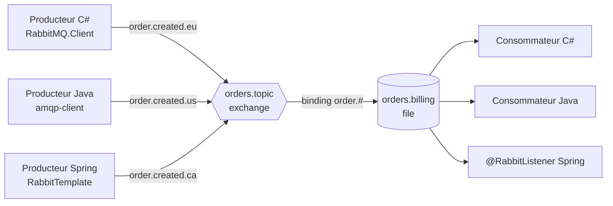

:::note[Versions étudiées]
[RabbitMQ](https://www.rabbitmq.com/docs) **4.3.5**, la dernière version au 2026-09-15, dans l'image Docker officielle [`rabbitmq:4.3.5-management`](https://hub.docker.com/_/rabbitmq). Les clients sont [RabbitMQ.Client](https://www.nuget.org/packages/RabbitMQ.Client) **7.2.2** sur .NET 10, le [client Java de RabbitMQ](https://www.rabbitmq.com/client-libraries/java-api-guide) **5.35.0** sur Java 25, et [Spring AMQP](https://docs.spring.io/spring-amqp/reference/) **4.1.1** fourni par Spring Boot 4.1.1. Chaque exemple se trouve dans [`code/rabbitmq`](https://github.com/spareilleux/learn/tree/main/code/rabbitmq) : [`check.sh`](https://github.com/spareilleux/learn/blob/main/code/rabbitmq/check.sh) exécute chaque programme contre un broker neuf et compare sa sortie avec les fichiers de [`expected`](https://github.com/spareilleux/learn/tree/main/code/rabbitmq/expected). La CI compile les clients sous Windows, Linux et macOS, et ne les exécute contre le broker que sous Linux, parce que les runners Windows et macOS de GitHub n'ont pas Docker.
:::

## Pourquoi j'apprends ça

J'envoie des messages par RabbitMQ depuis des années, surtout à travers une bibliothèque qui le cachait : MassTransit sur un projet, Spring AMQP sur un autre. Cela a fonctionné jusqu'au jour où ce n'était plus le cas. Un consommateur a redémarré et des commandes ont été traitées deux fois ; une autre fois, des messages ont disparu et personne n'a pu dire où ils étaient passés. Chaque fois, je me suis rendu compte que je connaissais l'API de la bibliothèque et pas le broker en dessous.

Je veux savoir ce que RabbitMQ fait réellement d'un message, du moment où un producteur l'envoie à celui où un consommateur l'acquitte, pour pouvoir concevoir une topologie en connaissance de cause, choisir le bon type de file, et découvrir ce qui a mal tourné avec les outils du broker lui-même.

## À qui s'adresse ce cours

Vous êtes développeur C# ou Java. Vous avez publié ou consommé des messages, peut-être à travers MassTransit, NServiceBus, Spring AMQP ou Spring Cloud Stream, et vous avez déjà lancé un conteneur. Vous n'avez pas besoin de connaître AMQP. Le côté Java suppose le niveau de [Java pour développeurs C#](../java-for-csharp/) ; la leçon 3 renvoie les questions sur Spring à [Spring Boot, Spring Cloud et Reactor pour développeurs C#](../spring-cloud-reactor/), et la leçon 1 les questions sur les conteneurs à [Conteneurs WSL](../wsl-containers/).

## L'exemple fil rouge

Les leçons utilisent de petits flux reconnaissables plutôt qu'une seule application : des lignes de log routées par sévérité, des prix diffusés vers plusieurs écrans, des commandes et des paiements. Un programme C# ([`code/rabbitmq/csharp`](https://github.com/spareilleux/learn/tree/main/code/rabbitmq/csharp)), un programme client Java et une application Spring Boot ([`code/rabbitmq/java`](https://github.com/spareilleux/learn/tree/main/code/rabbitmq/java)) échangent les mêmes messages, parce qu'un broker est l'endroit où des langages différents se rencontrent.

Aucun des dépôts GuitarAlchemist n'utilise RabbitMQ dans son code, donc il n'y a pas encore de cas pratique qui en vienne ; le [journal](journal/) note la seule configuration que j'ai trouvée.

## À la fin de ce cours, je saurai

- expliquer le modèle AMQP 0-9-1 : connexions, canaux, exchanges, bindings, files et messages ;
- lancer RabbitMQ dans un conteneur et l'inspecter avec l'interface de gestion, `rabbitmqctl` et `rabbitmq-diagnostics` ;
- concevoir une topologie avec des exchanges direct, fanout, topic et headers, et traiter les messages que rien ne route ;
- écrire des producteurs et des consommateurs en C#, en Java et avec Spring AMQP qui interopèrent ;
- dire qui est responsable d'un message à chaque étape, et utiliser acquittements, prefetch, confirmations de publication et persistance pour n'en perdre aucun ;
- choisir entre files classiques, files quorum et streams ;
- traiter les échecs avec le dead lettering, les TTL et les nouvelles tentatives ;
- exploiter un cluster, le sécuriser, le surveiller et le dimensionner ;
- faire vivre RabbitMQ dans la durée : mises à jour, définitions, Kubernetes.

## Plan

| # | Leçon | Ce que vous connaissez peut-être déjà |
|---|---|---|
| 1 | [Premiers pas](01-getting-started/) | une file vue depuis MassTransit ou Spring, `docker run` |
| 2 | [Topologie : exchanges, bindings et files](02-topology/) | les topics et règles d'abonnement d'Azure Service Bus, les destinations JMS |
| 3 | [Clients en C#, en Java et avec Spring AMQP](03-clients/) | la durée de vie d'un `HttpClient`, les consommateurs `async`, `RabbitTemplate` |
| 4 | [Fiabilité : acquittements, prefetch, confirmations](04-reliability/) | les transactions de base de données, la livraison au moins une fois |
| 5 | Types de files : classiques, quorum et streams *(à suivre)* | Raft, les partitions Kafka |
| 6 | Erreurs : dead lettering, TTL, nouvelles tentatives et messages différés | les retries de Polly, les files d'erreur de MassTransit |
| 7 | Patterns : work queues, publish/subscribe, RPC, consommateurs concurrents, outbox | l'outbox transactionnelle de MassTransit ou de Spring Modulith |
| 8 | Clustering et haute disponibilité : partitions réseau, quorum | les clusters de basculement |
| 9 | Sécurité : virtual hosts, utilisateurs, permissions, TLS | les chaînes de connexion, les certificats dans Kestrel |
| 10 | Observabilité : Prometheus, Grafana, métriques clés, alarmes, contrôle de flux | OpenTelemetry, `dotnet-counters` |
| 11 | Performance et dimensionnement, mesurés | BenchmarkDotNet |
| 12 | Autres protocoles : streams et super streams, MQTT, AMQP 1.0 ; RabbitMQ et Kafka | Kafka, Azure Event Hubs |
| 13 | Exploitation : mises à jour, définitions, le Cluster Operator Kubernetes | les charts Helm, les mises à jour progressives |

[Journal](journal/) : ce que j'ai essayé, ce qui m'a surpris, ce qu'il me reste à vérifier.

## Ressources

- [Documentation de RabbitMQ](https://www.rabbitmq.com/docs), en particulier [AMQP 0-9-1 model explained](https://www.rabbitmq.com/tutorials/amqp-concepts), les [exchanges](https://www.rabbitmq.com/docs/exchanges), les [files](https://www.rabbitmq.com/docs/queues), les [acquittements des consommateurs et confirmations de publication](https://www.rabbitmq.com/docs/confirms), et les [recommandations pour le déploiement en production](https://www.rabbitmq.com/docs/production-checklist)
- [Tutoriels RabbitMQ](https://www.rabbitmq.com/tutorials), en C# et en Java entre autres langages
- [Guide de l'API du client .NET](https://www.rabbitmq.com/client-libraries/dotnet-api-guide) et [guide de l'API du client Java](https://www.rabbitmq.com/client-libraries/java-api-guide)
- [Référence de Spring AMQP](https://docs.spring.io/spring-amqp/reference/) et [chapitre messaging de Spring Boot](https://docs.spring.io/spring-boot/reference/messaging/amqp.html)
- [Référence complète d'AMQP 0-9-1](https://www.rabbitmq.com/amqp-0-9-1-reference) : chaque méthode et chaque champ du protocole
- Code source : [rabbitmq-server](https://github.com/rabbitmq/rabbitmq-server), [rabbitmq-dotnet-client](https://github.com/rabbitmq/rabbitmq-dotnet-client), [rabbitmq-java-client](https://github.com/rabbitmq/rabbitmq-java-client), [l'image Docker](https://github.com/docker-library/rabbitmq)
