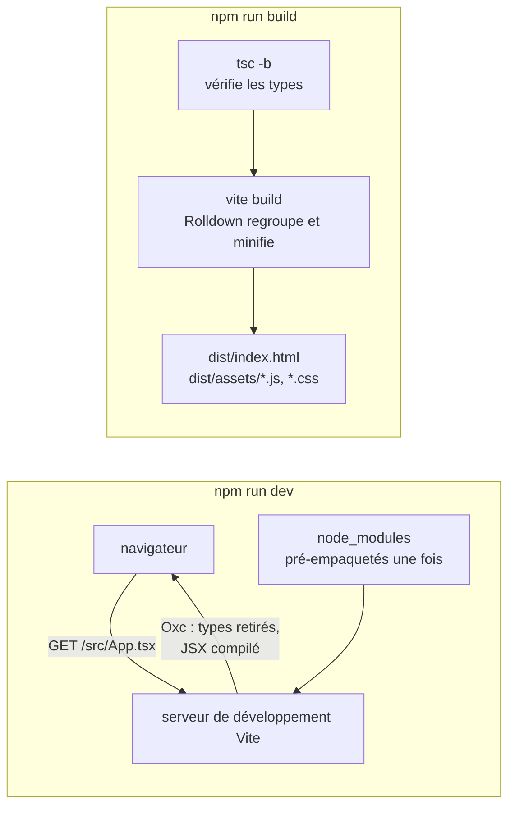

import { Tabs, TabItem } from '@astrojs/starlight/components';

Code : l'application du cours dans [`code/react-vite`](https://github.com/spareilleux/learn/tree/3f7a5df/code/react-vite), son [`vite.config.ts`](https://github.com/spareilleux/learn/blob/3f7a5df/code/react-vite/vite.config.ts), et les scripts qui capturent les sorties de cette leçon : [`scripts/dev-start.mjs`](https://github.com/spareilleux/learn/blob/3f7a5df/code/react-vite/scripts/dev-start.mjs), [`scripts/dev-module.mjs`](https://github.com/spareilleux/learn/blob/3f7a5df/code/react-vite/scripts/dev-module.mjs) et [`scripts/hmr.mjs`](https://github.com/spareilleux/learn/blob/3f7a5df/code/react-vite/scripts/hmr.mjs).

## Ce qu'est Vite, pour un développeur .NET ou Java

Un front end web .NET commence par `dotnet new blazorwasm`, s'exécute avec `dotnet watch` et se livre avec `dotnet publish` ; MSBuild compile tout avant que quoi que ce soit ne s'exécute. Un projet React commence par `create-vite`, s'exécute avec `vite` et se livre avec `vite build`, et entre les deux, [Vite](https://vite.dev/) joue deux rôles que .NET confie à un seul outil :

| | .NET (Blazor) | Java (Maven) | Vite |
|---|---|---|---|
| Créer un projet | `dotnet new blazorwasm` | `mvn archetype:generate` | `npm create vite`, qui exécute `create-vite` |
| Fichiers de projet | `.csproj` | `pom.xml` | `package.json`, `vite.config.ts`, `tsconfig.json` |
| Boucle de développement | `dotnet watch` : recompiler, puis rechargement à chaud | recompiler, redémarrer | un serveur de développement qui compile chaque fichier quand le navigateur le demande |
| Vérification des types | le compilateur, à chaque build | `javac`, à chaque build | `tsc`, une étape séparée que Vite n'exécute pas |
| Build de production | `dotnet publish` | `mvn package` | `vite build` : des fichiers HTML, JavaScript et CSS statiques |

Pendant le développement, Vite est un **serveur** : le navigateur charge `index.html`, puis demande chaque module, et Vite compile le TypeScript et le JSX de chaque fichier à ce moment-là, avec [Oxc](https://oxc.rs/), un compilateur écrit en Rust. Pour la production, Vite est un **bundler** : [Rolldown](https://rolldown.rs/), lui aussi en Rust, regroupe et minifie l'application en quelques fichiers. [Vite 8](https://vite.dev/blog/announcing-vite8), publié en mars 2026, a remplacé les deux outils que les versions précédentes utilisaient pour ces tâches, esbuild et Rollup, par Rolldown et Oxc.



Le cours utilise les versions en vigueur le 15 septembre 2026 : **Vite 8.3.0** avec [`@vitejs/plugin-react`](https://github.com/vitejs/vite-plugin-react/tree/main/packages/plugin-react) 6.1.1, **React 19.3.0**, et TypeScript 7.0.2, la version du [cours TypeScript](../../typescript-for-csharp-java/01-compiler-and-tooling/). Vite 8 demande Node.js 20.19 ou 22.12 et plus ; le cours tourne sur Node.js 24.21.0, comme les cours JavaScript et TypeScript.

## Créer le projet

[`create-vite`](https://vite.dev/guide/#scaffolding-your-first-vite-project) copie un modèle dans un nouveau dossier. `npm create vite` est la forme courte que montre la documentation : npm transforme `npm create vite` en exécution du paquet `create-vite`. Les commandes ci-dessous fixent sa version et répondent à ses questions par des options, pour donner le même résultat à chaque fois.

<Tabs syncKey="os">
<TabItem label="Windows">

```powershell
npx create-vite@9.2.1 guitar-app --template react-ts --no-interactive
Set-Location guitar-app
npm install
npm run dev
```

</TabItem>
<TabItem label="Linux / WSL">

```bash
npx create-vite@9.2.1 guitar-app --template react-ts --no-interactive
cd guitar-app
npm install
npm run dev
```

</TabItem>
<TabItem label="macOS">

```bash
npx create-vite@9.2.1 guitar-app --template react-ts --no-interactive
cd guitar-app
npm install
npm run dev
```

</TabItem>
</Tabs>

Sans `--no-interactive`, dans un terminal, `create-vite` demande le nom, le framework et la variante, et propose d'installer et de démarrer le projet. Le `check.sh` du cours exécute la même commande dans son dossier `out` :

```text
│
◇  Scaffolding project in out/guitar-app...
│
└  Done. Now run:

  cd guitar-app
  npm install
  npm run dev
```

`create-vite --help` liste les autres modèles, dont `react-compiler-ts`, le même projet avec le [React Compiler](https://react.dev/learn/react-compiler) que couvre la leçon 10, et une option `--eslint` qui remplace oxlint par ESLint.

### Ce que contient le modèle

```text
.gitignore
.oxlintrc.json
README.md
index.html
package.json
public/favicon.svg
public/icons.svg
src/App.css
src/App.tsx
src/assets/hero.png
src/assets/react.svg
src/assets/vite.svg
src/index.css
src/main.tsx
tsconfig.app.json
tsconfig.json
tsconfig.node.json
vite.config.ts
```

| Fichier | Rôle | Équivalent le plus proche en .NET |
|---|---|---|
| `index.html` | le point d'entrée : Vite le lit, et suit son `<script type="module">` | `wwwroot/index.html` dans Blazor WebAssembly |
| `src/main.tsx` | monte le composant racine dans l'élément `root` | `Program.cs` |
| `src/App.tsx` | le composant racine | `App.razor` |
| `vite.config.ts` | la configuration de Vite, avec le plugin React | la partie build du `.csproj` |
| `tsconfig.json` | deux références de projet, une pour le code du navigateur et une pour `vite.config.ts` | une solution à deux projets |
| `tsconfig.app.json`, `tsconfig.node.json` | les options du compilateur de chaque projet | deux fichiers `.csproj` |
| `package.json` | les dépendances et les scripts | les références de paquets et les cibles de build |
| `.oxlintrc.json` | les règles de lint | `.editorconfig` et les analyseurs |
| `public/` | des fichiers copiés tels quels, avec leur nom | les fichiers statiques de `wwwroot` |

`index.html` est à la racine et non dans `public`, parce que pour Vite c'est du code source : [le guide](https://vite.dev/guide/#index-html-and-project-root) l'appelle le point d'entrée du graphe de modules. Sa dernière ligne charge `/src/main.tsx`, et `main.tsx` rend l'application :

```tsx
// src/main.tsx
import { StrictMode } from 'react';
import { createRoot } from 'react-dom/client';
import './index.css';
import App from './App.tsx';

createRoot(document.getElementById('root')!).render(
  <StrictMode>
    <App />
  </StrictMode>,
);
```

[`createRoot`](https://react.dev/reference/react-dom/client/createRoot) prend un élément du DOM, et `render` y affiche un composant ; à partir de là, React possède tout ce qui se trouve dans cet élément. [`StrictMode`](https://react.dev/reference/react/StrictMode) ajoute des vérifications en développement seulement, que montre la leçon 3. Le `!` est l'assertion non nulle de TypeScript ([leçon 2 de TypeScript](../../typescript-for-csharp-java/02-structural-typing/)) : `getElementById` renvoie `HTMLElement | null`, et le modèle sait que `index.html` contient l'élément.

### package.json

```json
{
  "name": "guitar-app",
  "private": true,
  "version": "0.0.0",
  "type": "module",
  "scripts": {
    "dev": "vite",
    "build": "tsc -b && vite build",
    "lint": "oxlint",
    "preview": "vite preview"
  },
  "dependencies": {
    "react": "^19.2.8",
    "react-dom": "^19.2.8"
  },
  "devDependencies": {
    "@types/node": "^24.13.3",
    "@types/react": "^19.2.18",
    "@types/react-dom": "^19.2.7",
    "@vitejs/plugin-react": "^6.1.1",
    "oxlint": "^1.81.0",
    "typescript": "~6.0.2",
    "vite": "^8.3.0"
  }
}
```

`react` est la bibliothèque qui connaît les composants et l'état, et `react-dom` la partie qui met à jour le DOM du navigateur ; React Native remplace la seconde par un autre moteur de rendu. Les paquets `@types` contiennent les déclarations de types. Le modèle demande React `^19.2.8`, donc `npm install` obtient 19.3.0 aujourd'hui, et TypeScript `~6.0.2`, qui n'autorise que 6.0.x. Le [`package.json`](https://github.com/spareilleux/learn/blob/3f7a5df/code/react-vite/package.json) du cours fixe chaque version exactement, ajoute Vitest, Testing Library et jsdom pour les tests, et utilise TypeScript 7.0.2, qui vérifie les deux mêmes projets.

Le script `build` exécute d'abord `tsc -b`, le `-b` des références de projet, qui vérifie les deux projets, et `vite build` seulement si `tsc` réussit. Cet ordre compte, et la suite de la leçon montre pourquoi.

## Le serveur de développement

`npm run dev` exécute `vite` :

```text

  VITE v8.3.0  ready in N ms

  ➜  Local:   http://localhost:5199/
  ➜  Network: use --host to expose
```

Le port par défaut de Vite est 5173 ; les scripts du cours utilisent 5199 avec `--strictPort`, qui s'arrête au lieu de prendre le port libre suivant. Dans un terminal, Vite affiche aussi `press h + enter to show help`, les raccourcis pour ouvrir le navigateur, redémarrer ou quitter. Le serveur démarre en une fraction de seconde quelle que soit la taille de l'application, parce qu'il ne compile encore rien : il attend le navigateur.

[`scripts/dev-module.mjs`](https://github.com/spareilleux/learn/blob/3f7a5df/code/react-vite/scripts/dev-module.mjs) démarre le même serveur avec l'[API JavaScript](https://vite.dev/guide/api-javascript) de Vite, demande une URL comme le ferait le navigateur, et affiche la réponse. D'abord la page :

```html
GET / -> 200 text/html
<!doctype html>
<html lang="en">
  <head>
    <script type="module">import { injectIntoGlobalHook } from "/@react-refresh";
injectIntoGlobalHook(window);
window.$RefreshReg$ = () => {};
window.$RefreshSig$ = () => (type) => type;</script>

    <script type="module" src="/@vite/client"></script>

    <meta charset="UTF-8" />
    <meta name="viewport" content="width=device-width, initial-scale=1.0" />
    <title>React (Vite) course</title>
  </head>
  <body>
    <div id="root"></div>
    <script type="module" src="/src/main.tsx"></script>
  </body>
</html>
```

Vite a ajouté deux scripts à `index.html` : `/@vite/client`, qui se connecte au serveur pour recevoir les mises à jour, et le préambule de React Refresh, venu du plugin React. Le navigateur demande ensuite `/src/main.tsx` :

```js
GET /src/main.tsx -> 200 text/javascript
const StrictMode = __vite__cjsImport0_react["StrictMode"];const createRoot = __vite__cjsImport1_reactDom_client["createRoot"];const _jsxDEV = __vite__cjsImport4_react_jsxDevRuntime["jsxDEV"];import __vite__cjsImport0_react from "/node_modules/.vite/deps/react.js?v=HASH";
import __vite__cjsImport1_reactDom_client from "/node_modules/.vite/deps/react-dom_client.js?v=HASH";
import "/src/index.css";
import App from "/src/App.tsx";
var _jsxFileName = "src/main.tsx";
import __vite__cjsImport4_react_jsxDevRuntime from "/node_modules/.vite/deps/react_jsx-dev-runtime.js?v=HASH";
createRoot(document.getElementById("root")).render(/* @__PURE__ */ _jsxDEV(StrictMode, { children: /* @__PURE__ */ _jsxDEV(App, {}, void 0, false, {
	fileName: _jsxFileName,
	lineNumber: 8,
	columnNumber: 5
}, this) }, void 0, false, {
	fileName: _jsxFileName,
	lineNumber: 7,
	columnNumber: 3
}, this));

//# sourceMappingURL=data:application/json;base64,…
```

Ce fichier est ce qu'exécute le navigateur, et chaque différence avec la source a une raison :

- **Les types ont disparu**, y compris le `!` après `getElementById`. Comme dans la [leçon 1 de TypeScript](../../typescript-for-csharp-java/01-compiler-and-tooling/#une-erreur-de-type-narrête-rien), retirer les types ne vérifie rien.
- **Le JSX est devenu des appels de fonction** : `<StrictMode><App /></StrictMode>` est maintenant `_jsxDEV(StrictMode, { children: _jsxDEV(App, {}) })`, avec le nom de fichier et la ligne de chaque élément pour que les avertissements de React puissent pointer vers la source. La leçon 2 ouvre cette transformation.
- **Les imports sont devenus des URL**, parce que le navigateur charge les modules par URL et ne sait rien de `node_modules`. `react` est servi depuis `/node_modules/.vite/deps/react.js` : Vite a [pré-empaqueté](https://vite.dev/guide/dep-pre-bundling) chaque dépendance en un seul fichier, une fois, a converti le paquet CommonJS de React en module ES, d'où les noms `__vite__cjsImport`, et a ajouté un hash pour le cache du navigateur.
- **Le CSS est importé comme un module** : `import "/src/index.css"` renvoie un petit script qui insère les styles dans la page.
- **Une source map est incluse en ligne**, pour que le débogueur du navigateur montre `main.tsx` tel que tu l'as écrit. Les sorties du cours la raccourcissent en `…`.

Un développeur .NET peut comparer cela à un fichier Razor compilé à la demande, un fichier par requête, à ceci près que le résultat part au navigateur et non dans la mémoire du serveur. C'est pourquoi le démarrage ne dépend pas de la taille de l'application : une page qui n'est pas ouverte n'est jamais compilée.

## Remplacement de modules à chaud et Fast Refresh

Modifie un composant et enregistre : la page change sans se recharger, et le composant garde son état. Deux mécanismes travaillent ensemble. L'[API HMR](https://vite.dev/guide/api-hmr) de Vite envoie un message à la page quand un fichier change, et [React Refresh](https://github.com/facebook/react/tree/main/packages/react-refresh), la partie du plugin React qu'on appelle aussi Fast Refresh, remplace la fonction du composant en gardant l'état que React conserve pour lui. La fin de ce que le serveur envoie pour `App.tsx` montre le code du plugin :

```js
// la fin de GET /src/App.tsx, d'après expected/l01_dev_app.txt
_s(App, "oDgYfYHkD9Wkv4hrAPCkI/ev3YU=");
_c = App;
var _c;
$RefreshReg$(_c, "App");
import * as RefreshRuntime from "/@react-refresh";
const inWebWorker = typeof WorkerGlobalScope !== 'undefined' && self instanceof WorkerGlobalScope;
import * as __vite_react_currentExports from "/src/App.tsx";
if (import.meta.hot && !inWebWorker) {
  if (!window.$RefreshReg$) {
    throw new Error(
      "@vitejs/plugin-react can't detect preamble. Something is wrong."
    );
  }

  const currentExports = __vite_react_currentExports;
  queueMicrotask(() => {
    RefreshRuntime.registerExportsForReactRefresh("src/App.tsx", currentExports);
    import.meta.hot.accept((nextExports) => {
      if (!nextExports) return;
      const invalidateMessage = RefreshRuntime.validateRefreshBoundaryAndEnqueueUpdate("src/App.tsx", currentExports, nextExports);
      if (invalidateMessage) import.meta.hot.invalidate(invalidateMessage);
    });
  });
}
```

`$RefreshReg$` enregistre le composant `App` sous son fichier et son nom, et `_s(App, "…")` note une signature des hooks qu'il appelle, ici un `useState`. `import.meta.hot.accept` indique à Vite que ce module peut se remplacer lui-même : quand le fichier change, la page importe la nouvelle version, et React Refresh échange la fonction. Si la signature a changé, parce qu'un hook a été ajouté ou retiré, l'ancien état ne correspond plus, et React monte à nouveau le composant.

[`scripts/hmr.mjs`](https://github.com/spareilleux/learn/blob/3f7a5df/code/react-vite/scripts/hmr.mjs) se connecte au WebSocket du serveur avec le protocole `vite-hmr`, comme le fait `/@vite/client`, demande les modules de la page, modifie le titre dans une copie de `App.tsx`, et affiche ce qu'envoie le serveur :

```json
{
  "type": "connected"
}
{
  "type": "update",
  "updates": [
    {
      "type": "js-update",
      "timestamp": TIMESTAMP,
      "path": "/src/App.tsx",
      "acceptedPath": "/src/App.tsx",
      "explicitImportRequired": false,
      "isWithinCircularImport": false
    }
  ]
}
```

Un message, pour un module : la page importera à nouveau `/src/App.tsx`, et rien d'autre. J'ai vérifié le reste à la main dans un navigateur, sous Windows : après trois clics sur le compteur et deux sur le capo, modifier le titre dans `App.tsx` a changé l'en-tête, le compteur affichait toujours 3 et le capo 2, et une variable posée sur `window` avant la modification était toujours là, donc la page ne s'était pas rechargée. C'est le rechargement à chaud de `dotnet watch`, à ceci près que l'état survit dans un composant dont le code a changé.

Fast Refresh a une condition, que la configuration de lint du modèle impose avec `react/only-export-components` : un fichier qui exporte des composants ne devrait exporter que des composants. Un fichier qui exporte aussi une fonction ou une constante ne peut pas être remplacé sans risque, et une modification recharge la page. Le cours garde ses fonctions utilitaires, comme `transpose` dans la leçon 3, dans des fichiers `.ts` à part.

## Une erreur de type part en production

Vite retire les types ; il ne les vérifie pas. Le `check.sh` du cours copie l'application dans `out/l01-type-error` et change une ligne de `App.tsx`, de `count + 1` à `count + '1'`, puis la construit :

```text
> npx vite build
vite v8.3.0 building client environment for production...
transforming...
✓ 24 modules transformed.
rendering chunks...
computing gzip size...
dist/index.html                   0.40 kB │ gzip:  0.27 kB
dist/assets/index-Cl5cuL7y.css    0.09 kB │ gzip:  0.11 kB
dist/assets/index-QMb0bu8p.js   222.62 kB │ gzip: 69.73 kB

✓ built in N ms
```

Le build réussit. J'ai servi ce bundle avec `vite preview` et cliqué deux fois sur le bouton : il a affiché `Count is 01`, puis `Count is 011`, parce que `count + '1'` concatène, comme l'explique la [leçon 2 de JavaScript](../../javascript-for-csharp-java/02-values-and-types/). `tsc -b` sur la même copie :

```text
> npx tsc -b --pretty false
src/App.tsx(10,53): error TS2345: Argument of type '(count: number) => string' is not assignable to parameter of type 'SetStateAction<number>'.
  Type '(count: number) => string' is not assignable to type '(prevState: number) => number'.
    Type 'string' is not assignable to type 'number'.
```

`tsc` se termine avec le code 1, et `npm run build`, qui vaut `tsc -b && vite build`, s'arrête avant Vite. La [documentation de Vite](https://vite.dev/guide/features.html#transpile-only) le dit clairement : Vite ne fait que transpiler, la vérification des types revient à l'éditeur et au processus de build, et elle suggère `tsc --noEmit --watch` dans un second terminal pendant le développement. Un projet dont le script `build` n'est que `vite build` livre tout ce que `tsc` aurait refusé ; le [cours TypeScript a trouvé un tel projet dans GA](../../typescript-for-csharp-java/01-compiler-and-tooling/#dans-de-vrais-projets).

## Construire pour la production

`npm run build` sur l'application du cours :

```text
> npx tsc -b --pretty false
> npx vite build
vite v8.3.0 building client environment for production...
transforming...
✓ 24 modules transformed.
rendering chunks...
computing gzip size...
dist/index.html                   0.40 kB │ gzip:  0.27 kB
dist/assets/index-Cl5cuL7y.css    0.09 kB │ gzip:  0.11 kB
dist/assets/index-BQ_Vbf-Q.js   222.62 kB │ gzip: 69.73 kB

✓ built in N ms
```

```text
> ls dist
assets/index-BQ_Vbf-Q.js
assets/index-Cl5cuL7y.css
index.html
```

Vingt-quatre modules sont devenus un fichier JavaScript et un fichier CSS, minifiés par Oxc. L'essentiel des 223 ko, 70 ko compressés, c'est React et React DOM. Le hash dans chaque nom de fichier change avec le contenu : l'erreur de type ci-dessus a donné `index-QMb0bu8p.js` pour un fichier de même taille. Un serveur peut alors dire aux navigateurs de garder `assets/` en cache pour toujours, puisqu'un nouveau build écrit de nouveaux noms, et seul `index.html` doit être revalidé.

`dist` est un site statique : n'importe quel serveur web peut le servir, y compris les fichiers statiques d'ASP.NET Core ou le dossier `static` de Spring Boot, que met en place la leçon 13. `npm run preview` exécute [`vite preview`](https://vite.dev/guide/cli.html#vite-preview), un serveur local pour `dist` que [la documentation](https://vite.dev/guide/cli.html#vite-preview) déconseille d'utiliser comme serveur de production. Par défaut, le bundle vise les navigateurs de [Baseline](https://web.dev/baseline) Widely Available à une date fixée pour chaque version majeure de Vite ; pour Vite 8, ce sont Chrome et Edge 111, Firefox 114 et Safari 16.4 ([building for production](https://vite.dev/guide/build)).

:::note[Les sorties de ce cours]
Les sorties sont celles de Node.js 24.21.0, Vite 8.3.0, TypeScript 7.0.2 et Vitest 5.0.0. Les chemins sont affichés relativement au dossier du cours, les durées en `N`, les hashs de cache du serveur de développement en `HASH`, un horodatage HMR en `TIMESTAMP`, et les source maps en ligne en `…` ; [`normalize.mjs`](https://github.com/spareilleux/learn/blob/3f7a5df/code/react-vite/normalize.mjs) fait les mêmes changements avant que `check.sh` compare les sorties avec celles collées ici, sous Windows, Linux et macOS.
:::

## Dans GuitarAlchemist/ga

L'application React principale de GA, [`ReactComponents/ga-react-components`](https://github.com/GuitarAlchemist/ga/tree/8cc8c5a17c685c779c46cd5e6d0a3f5d5036cc41/ReactComponents/ga-react-components), au commit [`8cc8c5a`](https://github.com/GuitarAlchemist/ga/commit/8cc8c5a17c685c779c46cd5e6d0a3f5d5036cc41), est un projet Vite d'une génération plus ancienne : son `package.json` demande React [`^18.3.1`](https://github.com/GuitarAlchemist/ga/blob/8cc8c5a17c685c779c46cd5e6d0a3f5d5036cc41/ReactComponents/ga-react-components/package.json#L57), `@vitejs/plugin-react` [`^4.3.2`](https://github.com/GuitarAlchemist/ga/blob/8cc8c5a17c685c779c46cd5e6d0a3f5d5036cc41/ReactComponents/ga-react-components/package.json#L82) et Vite [`^5.4.8`](https://github.com/GuitarAlchemist/ga/blob/8cc8c5a17c685c779c46cd5e6d0a3f5d5036cc41/ReactComponents/ga-react-components/package.json#L92), donc esbuild et Rollup plutôt qu'Oxc et Rolldown. Son [script `build`](https://github.com/GuitarAlchemist/ga/blob/8cc8c5a17c685c779c46cd5e6d0a3f5d5036cc41/ReactComponents/ga-react-components/package.json#L11-L15) est `vite build` seul, avec `tsc -b` dans deux scripts séparés, `build:with-types` et `typecheck`.

Son `vite.config.ts` fait 3 005 lignes, et montre jusqu'où peut aller le serveur de développement. La [configuration elle-même](https://github.com/GuitarAlchemist/ga/blob/8cc8c5a17c685c779c46cd5e6d0a3f5d5036cc41/ReactComponents/ga-react-components/vite.config.ts#L2839-L2869) liste six plugins, écoute sur le port 5176 sur toutes les interfaces réseau, et redirige `/api`, `/hubs` et `/graphql` vers le backend ASP.NET Core sur le port 5232, et `/proxy/ollama` vers un serveur Ollama local. Quatre des plugins ajoutent des middlewares avec [`configureServer`](https://vite.dev/guide/api-plugin.html#configureserver) : l'un d'eux à lui seul [enregistre 27 gestionnaires](https://github.com/GuitarAlchemist/ga/blob/8cc8c5a17c685c779c46cd5e6d0a3f5d5036cc41/ReactComponents/ga-react-components/vite.config.ts#L1438-L1451), dont 23 sous `/dev-data/`, qui servent en JSON le backlog du dépôt, les rapports de qualité et l'activité des agents. Un [commentaire](https://github.com/GuitarAlchemist/ga/blob/8cc8c5a17c685c779c46cd5e6d0a3f5d5036cc41/ReactComponents/ga-react-components/vite.config.ts#L57-L64) explique qu'un tunnel Cloudflare expose ce serveur de développement comme site de démonstration public, si bien que chaque requête a l'air locale, et qu'une fonction vérifie l'en-tête `Host` pour garder privés les points d'accès de contrôle. Le serveur de développement est un serveur web Node.js, et GA s'en sert comme tel ; `vite build` n'écrit aucun de ces middlewares dans `dist`, et un déploiement statique n'aurait aucun de ces points d'accès.

[`Apps/ga-client`](https://github.com/GuitarAlchemist/ga/blob/8cc8c5a17c685c779c46cd5e6d0a3f5d5036cc41/Apps/ga-client/package.json#L11) est l'autre application React. Son script `dev` affiche qu'il s'agit de l'ancien client de démonstration, et se termine en erreur pour que son serveur Vite ne prenne pas le port de l'application principale ; `dev:legacy` le démarre quand même.

## À retenir

- Vite est un serveur de développement qui compile chaque fichier quand le navigateur le demande, et un bundler, Rolldown, pour la production. Vite 8 utilise Oxc et Rolldown là où les versions précédentes utilisaient esbuild et Rollup.
- `index.html` est le point d'entrée ; `main.tsx` monte le composant racine avec `createRoot`.
- Le serveur de développement retire les types, compile le JSX en appels de fonction, transforme les imports en URL et sert les dépendances pré-empaquetées.
- HMR envoie une mise à jour par module modifié, et Fast Refresh échange un composant en gardant son état, tant que son fichier n'exporte que des composants.
- Vite ne vérifie jamais les types : garde `tsc -b` avant `vite build`, comme le fait le script `build` du modèle.
- `vite build` écrit un site statique aux noms de fichiers hachés selon le contenu, pour n'importe quel serveur web.

## Exercices

1. Génère le modèle avec `create-vite` 9.2.1, et compare son `package.json` et son `tsconfig.app.json` avec le [`package.json`](https://github.com/spareilleux/learn/blob/3f7a5df/code/react-vite/package.json) et le [`tsconfig.app.json`](https://github.com/spareilleux/learn/blob/3f7a5df/code/react-vite/tsconfig.app.json) du cours. Qu'a changé le cours, et pourquoi ?

<details>
<summary>Solution</summary>

Les différences, d'après les fichiers du modèle ci-dessus et ceux du cours :

| | Modèle | Cours | Pourquoi |
|---|---|---|---|
| Versions | des plages : `^19.2.8`, `~6.0.2` | exactes : `19.3.0`, `7.0.2` | les sorties collées dans les leçons ne doivent pas changer quand une nouvelle version est publiée |
| TypeScript | 6.0 | 7.0.2 | la version du cours TypeScript, et `tsc -b` donne le même résultat sur ce projet |
| Tests | aucun | `vitest`, `jsdom`, `@testing-library/react`, `@testing-library/dom`, `@testing-library/user-event` | chaque composant des leçons 2 à 4 a un test |
| `strict` | non écrit : c'est la valeur par défaut depuis TypeScript 6.0 | écrit explicitement | du code copié dans un projet plus ancien échoue quand même bruyamment, comme le défend la [leçon 1 de TypeScript](../../typescript-for-csharp-java/01-compiler-and-tooling/#tsconfigjson) |
| `allowArbitraryExtensions` | activé, pour des imports comme `.png` avec un fichier de déclaration | absent | le cours n'importe aucune ressource |
| `vite.config.ts` | le plugin React | ajoute une section `test` pour Vitest | les tests s'exécutent dans jsdom, un DOM écrit en JavaScript |
| `create-vite` | — | une dépendance de développement | `check.sh` exécute la génération de cette leçon avec la version fixée |

Le cours a aussi retiré la page de démonstration du modèle, ses images et son CSS, et gardé tels quels `index.html`, `main.tsx`, le `tsconfig.json` à deux projets et la configuration de lint.

</details>

2. Dans une copie de l'application, fais échouer `npm run build` sur une erreur de type, puis fais-la livrer par `vite build` seul. Quels codes de sortie obtiens-tu, et qu'affiche le bouton dans la page construite ?

<details>
<summary>Solution</summary>

C'est l'expérience d'[Une erreur de type part en production](#une-erreur-de-type-part-en-production), que `check.sh` exécute à chaque passage de la CI : `vite build` se termine avec le code 0 et écrit `dist`, `tsc -b` se termine avec le code 1, et `npm run build` s'arrête après `tsc`, donc `dist` n'est pas écrit. Dans la page construite par `vite build` seul, le premier clic affiche `Count is 01` : le `0` initial est un nombre, `0 + '1'` est la chaîne `'01'`, et le clic suivant donne `'011'`.

</details>

3. Ce site est servi sous `/learn`. Construis l'application pour un site servi sous `/learn/react-vite/`, et trouve ce qui change dans `dist/index.html`.

<details>
<summary>Solution</summary>

L'option [`base`](https://vite.dev/config/shared-options.html#base), dans `vite.config.ts` ou sur la ligne de commande :

```text
> npx vite build --base /learn/react-vite/ --outDir out/l01-base
vite v8.3.0 building client environment for production...
transforming...
✓ 24 modules transformed.
rendering chunks...
computing gzip size...
out/l01-base/index.html                   0.43 kB │ gzip:  0.28 kB
out/l01-base/assets/index-Cl5cuL7y.css    0.09 kB │ gzip:  0.11 kB
out/l01-base/assets/index-BQ_Vbf-Q.js   222.62 kB │ gzip: 69.73 kB

✓ built in N ms
```

```html
<!doctype html>
<html lang="en">
  <head>
    <meta charset="UTF-8" />
    <meta name="viewport" content="width=device-width, initial-scale=1.0" />
    <title>React (Vite) course</title>
    <script type="module" crossorigin src="/learn/react-vite/assets/index-BQ_Vbf-Q.js"></script>
    <link rel="stylesheet" crossorigin href="/learn/react-vite/assets/index-Cl5cuL7y.css">
  </head>
  <body>
    <div id="root"></div>
  </body>
</html>
```

Le script et la feuille de style commencent maintenant par `/learn/react-vite/`, et le fichier JavaScript a le même hash qu'avant, donc son contenu n'a pas changé. Vite a aussi déplacé le `<script>` dans le `<head>` et retiré celui qui chargeait `/src/main.tsx`. Sans `base`, une page servie à `/learn/react-vite/` demanderait `/assets/index-….js` à la racine du domaine, et obtiendrait une 404. Dans `check.sh`, la commande s'exécute avec `MSYS_NO_PATHCONV=1` : Git Bash sous Windows transforme un argument qui commence par `/` en chemin Windows, et la première version de la sortie du cours affichait `/Program Files/Git/learn/react-vite/assets/…`.

</details>

## Sources

- [Vite — Getting started](https://vite.dev/guide/), [Why Vite](https://vite.dev/guide/why), [Features: TypeScript](https://vite.dev/guide/features.html#typescript), [Dependency pre-bundling](https://vite.dev/guide/dep-pre-bundling), [HMR API](https://vite.dev/guide/api-hmr), [Building for production](https://vite.dev/guide/build), [CLI](https://vite.dev/guide/cli), [Announcing Vite 8](https://vite.dev/blog/announcing-vite8)
- [React — Build a React app from scratch](https://react.dev/learn/build-a-react-app-from-scratch), [`createRoot`](https://react.dev/reference/react-dom/client/createRoot), [`StrictMode`](https://react.dev/reference/react/StrictMode), [React 19.3](https://react.dev/blog/2026/09/09/react-19-3)
- [`@vitejs/plugin-react`](https://github.com/vitejs/vite-plugin-react/tree/main/packages/plugin-react), [React Refresh](https://github.com/facebook/react/tree/main/packages/react-refresh), [Oxc](https://oxc.rs/), [Rolldown](https://rolldown.rs/)
- [Microsoft — Le rechargement à chaud .NET avec dotnet watch](https://learn.microsoft.com/aspnet/core/test/hot-reload)
