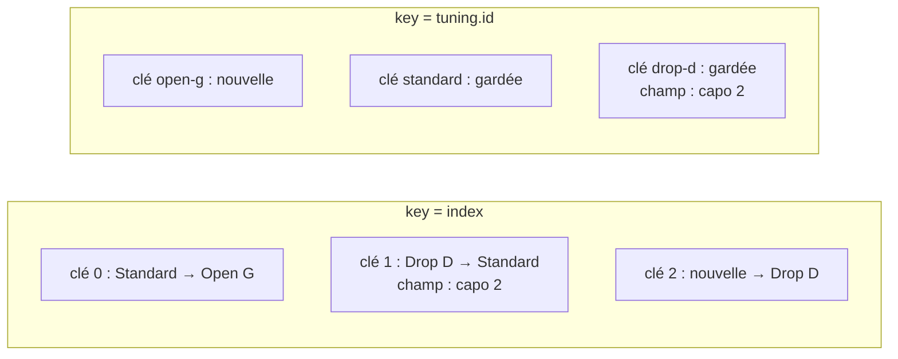

Code : [`src/l02`](https://github.com/spareilleux/learn/tree/3f7a5df/code/react-vite/src/l02), les extraits d'erreur [`errors/l02_props.tsx`](https://github.com/spareilleux/learn/blob/3f7a5df/code/react-vite/errors/l02_props.tsx), [`errors/l02_html.tsx`](https://github.com/spareilleux/learn/blob/3f7a5df/code/react-vite/errors/l02_html.tsx) et [`errors/l02_children.tsx`](https://github.com/spareilleux/learn/blob/3f7a5df/code/react-vite/errors/l02_children.tsx), et les solutions des exercices dans [`src/solutions`](https://github.com/spareilleux/learn/tree/3f7a5df/code/react-vite/src/solutions). Chaque test affiche ce qu'il rend, et `check.sh` compare cette sortie avec celle collée ici.

## Un composant est une fonction

En Blazor, un composant est un fichier `.razor` que le compilateur transforme en classe : ses entrées sont des propriétés marquées `[Parameter]`, et le balisage autour devient une méthode qui construit un arbre de rendu. En WPF, un `UserControl` est un fichier XAML et une classe code-behind, avec des propriétés de dépendance pour ses entrées. Un [composant React](https://react.dev/learn/your-first-component) est une fonction : il prend un objet, ses **props**, et renvoie ce qu'il faut afficher.

```tsx
// src/l02/TuningCard.tsx
import type { ReactNode } from 'react';

// Les props d'un composant sont un seul objet, décrit par un type
export interface TuningCardProps {
  name: string;
  notes: readonly string[];
  capo?: number;
  children?: ReactNode;
}

// Un composant est une fonction qui prend ses props et renvoie ce qu'il faut rendre
export function TuningCard({ name, notes, capo = 0, children }: TuningCardProps) {
  return (
    <article className="tuning-card">
      <h2>{name}</h2>
      <p>
        {notes.join(' ')}, capo {capo}
      </p>
      {children}
    </article>
  );
}
```

Le même composant en Blazor ressemblerait à ceci ; il est là pour comparer, et le cours ne le compile pas.

```razor
@* TuningCard.razor *@
<article class="tuning-card">
    <h2>@Name</h2>
    <p>@string.Join(" ", Notes), capo @Capo</p>
    @ChildContent
</article>

@code {
    [Parameter, EditorRequired] public string Name { get; set; } = "";
    [Parameter, EditorRequired] public IReadOnlyList<string> Notes { get; set; } = [];
    [Parameter] public int Capo { get; set; }
    [Parameter] public RenderFragment? ChildContent { get; set; }
}
```

| | Blazor | React |
|---|---|---|
| Entrées | une propriété par `[Parameter]` | un objet de props, typé par une interface |
| Entrée obligatoire | `[EditorRequired]`, un avertissement | une propriété sans `?`, une erreur de `tsc` |
| Valeur par défaut | un initialiseur de propriété | une valeur par défaut dans la déstructuration : `capo = 0` |
| Contenu entre les balises | `RenderFragment ChildContent` | `children`, de type `ReactNode` |
| Balisage | Razor, avec `@` devant le C# | JSX, avec `{ }` autour du JavaScript |
| Utilisation | `<TuningCard Name="Drop D" Notes="dropD" />` | `<TuningCard name="Drop D" notes={dropD} />` |

La liste des paramètres utilise la déstructuration, que couvre la [leçon 3 de JavaScript](../../javascript-for-csharp-java/03-functions-and-scope/) : `{ name, notes, capo = 0, children }` lit quatre propriétés de l'objet de props, avec une valeur par défaut pour `capo`. `readonly string[]` accepte n'importe quel tableau de chaînes et promet de ne pas le modifier, comme le montre la [leçon 2 de TypeScript](../../typescript-for-csharp-java/02-structural-typing/#readonly). Le nom commence par une majuscule, et c'est une règle, comme le montrent les sections suivantes.

Le test rend le composant avec [React Testing Library](https://testing-library.com/docs/react-testing-library/intro) dans [Vitest](https://vitest.dev/), et affiche le HTML produit :

```tsx
// src/l02/TuningCard.test.tsx
test('renders the props and the children', () => {
  const { container } = render(
    <TuningCard name="Drop D" notes={['D', 'A', 'D', 'G', 'B', 'E']} capo={2}>
      <p>Lower the sixth string by a whole tone.</p>
    </TuningCard>,
  );
  showHtml('<TuningCard>', container);
  expect(container.querySelector('h2')?.textContent).toBe('Drop D');
});
```

```text
✓ renders the props and the children
  <TuningCard>
  <div>
    <article
      class="tuning-card"
    >
      <h2>
        Drop D
      </h2>
      <p>
        D A D G B E
        , capo 
        2
      </p>
      <p>
        Lower the sixth string by a whole tone.
      </p>
    </article>
  </div>
```

`render` monte le composant dans un `div` d'un DOM simulé, [jsdom](https://github.com/jsdom/jsdom) ; le `div` extérieur est ce conteneur. `className` est devenu `class`, et le paragraphe entre les balises a pris la place de `{children}`. Le paragraphe montre trois nœuds texte, parce que `{notes.join(' ')}`, `, capo ` et `{capo}` sont trois enfants du `p` ; le navigateur les affiche sur une seule ligne.

## Le JSX, ce sont des appels de fonction

Le JSX n'est pas du HTML, et ce n'est pas non plus un langage de template : c'est une syntaxe pour des appels de fonction. [`scripts/jsx.mjs`](https://github.com/spareilleux/learn/blob/3f7a5df/code/react-vite/scripts/jsx.mjs) compile `TuningCard.tsx` avec Oxc, comme le fait `vite build` :

```js
import { jsx as _jsx, jsxs as _jsxs } from "react/jsx-runtime";
// Un composant est une fonction qui prend ses props et renvoie ce qu'il faut rendre
export function TuningCard({ name, notes, capo = 0, children }) {
	return /* @__PURE__ */ _jsxs("article", {
		className: "tuning-card",
		children: [
			/* @__PURE__ */ _jsx("h2", { children: name }),
			/* @__PURE__ */ _jsxs("p", { children: [
				notes.join(" "),
				", capo ",
				capo
			] }),
			children
		]
	});
}
```

Chaque élément est devenu un appel à `jsx` ou `jsxs` de `react/jsx-runtime`, avec le type de l'élément et un objet de ses props. Les enfants sont une prop de plus, `children` : une seule valeur, ou un tableau quand il y en a plusieurs ; `jsxs` est la variante pour plusieurs enfants écrits dans la source, une liste que React sait fixe et qui n'a pas besoin de clés. L'import est ajouté par le compilateur, c'est pourquoi le fichier n'importe pas React : c'est le runtime « automatic », choisi par `"jsx": "react-jsx"` dans [`tsconfig.app.json`](https://www.typescriptlang.org/tsconfig/#jsx).

Dans l'appel, le type est une **chaîne** pour `article`, `h2` et `p`, et serait la **fonction** `TuningCard` pour `<TuningCard />`. C'est la règle de la majuscule : le [manuel TypeScript](https://www.typescriptlang.org/docs/handbook/jsx.html) dit qu'un nom JSX qui commence par une minuscule est un élément intrinsèque, une balise HTML, et qu'un nom qui commence par une majuscule est une valeur dans la portée, un composant.

Que renvoie l'appel ? Le second test l'affiche :

```tsx
test('a JSX expression is an object that describes the element', () => {
  const element = <TuningCard name="Standard" notes={['E', 'A', 'D', 'G', 'B', 'E']} />;
  console.log(element.type === TuningCard, element.props, element.key);
});
```

```text
✓ a JSX expression is an object that describes the element
  true { name: 'Standard', notes: [ 'E', 'A', 'D', 'G', 'B', 'E' ] } null
```

Un [élément React](https://react.dev/reference/react/createElement) est un simple objet : un type, des props et une clé. Le créer n'a pas appelé `TuningCard` ; React appelle la fonction plus tard, quand il rend l'élément. Un composant renvoie un arbre de tels objets, une description de l'écran, et `react-dom` fait correspondre le DOM à cette description. L'équivalent le plus proche en Blazor est le code `RenderTreeBuilder` qu'écrit le compilateur Razor, avec une différence de style : la description de React est une valeur ordinaire, que tu peux ranger dans une variable, passer en prop ou mettre dans un tableau.

Comme le JSX est une expression, JavaScript fait le reste : `{ }` contient n'importe quelle expression, une condition s'écrit `? :` ou `&&`, et une boucle s'écrit `map`, comme le montrent les leçons suivantes. Il n'y a ni `@if` ni `@foreach`. Les [règles du JSX](https://react.dev/learn/writing-markup-with-jsx) découlent des appels de fonction : un composant renvoie une seule racine, puisqu'une fonction renvoie une seule valeur, et `<>…</>`, un [Fragment](https://react.dev/reference/react/Fragment), regroupe plusieurs éléments sans ajouter de nœud au DOM ; chaque balise est fermée, `<br />` compris.

## Ce que tsc vérifie dans le JSX

Les props sont un type objet, donc `tsc` les vérifie comme les arguments d'un appel. [`errors/l02_props.tsx`](https://github.com/spareilleux/learn/blob/3f7a5df/code/react-vite/errors/l02_props.tsx) utilise `TuningCard` de quatre façons fausses :

```text
errors/l02_props.tsx:7:8 - error TS2741: Property 'name' is missing in type '{ notes: string[]; }' but required in type 'TuningCardProps'.

7       <TuningCard notes={['E', 'A', 'D', 'G', 'B', 'E']} />
         ~~~~~~~~~~

  src/l02/TuningCard.tsx:5:3 - 'name' is declared here.
    5   name: string;
        ~~~~

errors/l02_props.tsx:8:72 - error TS2322: Type 'string' is not assignable to type 'number'.

8       <TuningCard name="Drop D" notes={['D', 'A', 'D', 'G', 'B', 'E']} capo="2" />
                                                                         ~~~~

  src/l02/TuningCard.tsx:7:3 - The expected type comes from property 'capo' which is declared here on type 'IntrinsicAttributes & TuningCardProps'
    7   capo?: number;
        ~~~~

errors/l02_props.tsx:9:33 - error TS2322: Type 'string' is not assignable to type 'readonly string[]'.

9       <TuningCard name="Open G" notes="D G D G B D" />
                                  ~~~~~

  src/l02/TuningCard.tsx:6:3 - The expected type comes from property 'notes' which is declared here on type 'IntrinsicAttributes & TuningCardProps'
    6   notes: readonly string[];
        ~~~~~

errors/l02_props.tsx:10:72 - error TS2322: Type '{ name: string; notes: string[]; strings: number; }' is not assignable to type 'IntrinsicAttributes & TuningCardProps'.
  Property 'strings' does not exist on type 'IntrinsicAttributes & TuningCardProps'.

10       <TuningCard name="DADGAD" notes={['D', 'A', 'D', 'G', 'A', 'D']} strings={6} />
                                                                          ~~~~~~~


Found 4 errors in the same file, starting at: errors/l02_props.tsx:7

exit 1
```

- Un attribut entre guillemets est une chaîne : `capo="2"` passe la chaîne `"2"`, et un nombre demande des accolades, `capo={2}`. Razor convertit `Capo="2"` en `int` pour toi ; JSX, non.
- Une prop inconnue est une erreur, comme la [vérification des propriétés en trop](../../typescript-for-csharp-java/02-structural-typing/#vérification-des-propriétés-en-trop) d'un littéral objet. `IntrinsicAttributes` ajoute les props que tout composant accepte, comme `key`.

Les éléments HTML sont typés eux aussi, par `@types/react`, et leurs props suivent les noms des propriétés du DOM plus que les attributs HTML. [`errors/l02_html.tsx`](https://github.com/spareilleux/learn/blob/3f7a5df/code/react-vite/errors/l02_html.tsx) est écrit comme on écrirait du HTML :

```text
errors/l02_html.tsx:2:10 - error TS6133: 'tuningName' is declared but its value is never read.

2 function tuningName({ name }: { name: string }) {
           ~~~~~~~~~~

errors/l02_html.tsx:3:14 - error TS2322: Type '{ class: string; children: string; }' is not assignable to type 'DetailedHTMLProps<HTMLAttributes<HTMLHeadingElement>, HTMLHeadingElement>'.
  Property 'class' does not exist on type 'DetailedHTMLProps<HTMLAttributes<HTMLHeadingElement>, HTMLHeadingElement>'. Did you mean 'className'?

3   return <h2 class="tuning-name">{name}</h2>;
               ~~~~~

errors/l02_html.tsx:8:12 - error TS2322: Type '{ for: string; children: Element[]; }' is not assignable to type 'DetailedHTMLProps<LabelHTMLAttributes<HTMLLabelElement>, HTMLLabelElement>'.
  Property 'for' does not exist on type 'DetailedHTMLProps<LabelHTMLAttributes<HTMLLabelElement>, HTMLLabelElement>'. Did you mean 'htmlFor'?

8     <label for="capo">
             ~~~

errors/l02_html.tsx:9:7 - error TS2339: Property 'tuningName' does not exist on type 'JSX.IntrinsicElements'.

9       <tuningName name="Standard" />
        ~~~~~~~~~~~~~~~~~~~~~~~~~~~~~~

errors/l02_html.tsx:10:55 - error TS2322: Type '{ id: string; type: "number"; min: number; max: string; onchange: () => void; }' is not assignable to type 'DetailedHTMLProps<InputHTMLAttributes<HTMLInputElement>, HTMLInputElement>'.
  Property 'onchange' does not exist on type 'DetailedHTMLProps<InputHTMLAttributes<HTMLInputElement>, HTMLInputElement>'. Did you mean 'onChange'?

10       <input id="capo" type="number" min={0} max="12" onchange={() => {}} />
                                                         ~~~~~~~~


Found 5 errors in the same file, starting at: errors/l02_html.tsx:2

exit 1
```

- `class` et `for` sont des mots réservés en JavaScript, donc React les nomme d'après les propriétés du DOM, `className` et `htmlFor`, et [écrit la plupart des attributs en camelCase](https://react.dev/learn/writing-markup-with-jsx), dont `onChange` et `tabIndex`. `aria-*` et `data-*` gardent leurs tirets.
- `<tuningName />` commence par une minuscule, donc `tsc` le cherche parmi les balises HTML, dans `JSX.IntrinsicElements`, et ne le trouve pas. La fonction du même nom est alors inutilisée, d'où la première erreur.
- `min={0}` et `max="12"` sont acceptés tous les deux : les types de `@types/react` autorisent un nombre ou une chaîne pour ces attributs, comme le HTML.

## Les enfants

`children` a le type [`ReactNode`](https://react.dev/learn/typescript#typing-children) : ce qu'un composant peut rendre. C'est un élément, une chaîne, un nombre, un booléen, `null` ou `undefined`, qui ne rendent rien, ou un tableau de ces valeurs. Un composant doit renvoyer le même ensemble. [`errors/l02_children.tsx`](https://github.com/spareilleux/learn/blob/3f7a5df/code/react-vite/errors/l02_children.tsx) essaie d'autres valeurs :

```tsx
// errors/l02_children.tsx
import { dropD, standard } from '../src/l02/tunings.ts';

export function Favorite() {
  return <p>Favorite tuning: {standard}</p>;
}

export function Count({ tunings }: { tunings: readonly (typeof dropD)[] }) {
  return tunings.length > 0 ? tunings.map((tuning) => tuning.name) : undefined;
}

export function Nothing() {
  return;
}

export function Wrong() {
  return { name: 'Standard' };
}
```

```text
errors/l02_children.tsx:5:30 - error TS2322: Type 'Tuning' is not assignable to type 'ReactNode'.

5   return <p>Favorite tuning: {standard}</p>;
                               ~~~~~~~~~~

errors/l02_children.tsx:24:6 - error TS2786: 'Nothing' cannot be used as a JSX component.
  Its type '() => void' is not a valid JSX element type.
    Type '() => void' is not assignable to type '(props: any) => Promise<ReactNode> | ReactNode'.
      Type 'void' is not assignable to type 'Promise<ReactNode> | ReactNode'.

24     <Nothing />
        ~~~~~~~

errors/l02_children.tsx:25:6 - error TS2786: 'Wrong' cannot be used as a JSX component.
  Its type '() => { name: string; }' is not a valid JSX element type.
    Type '() => { name: string; }' is not assignable to type '(props: any) => Promise<ReactNode> | ReactNode'.
      Type '{ name: string; }' is not assignable to type 'Promise<ReactNode> | ReactNode'.

25     <Wrong />
        ~~~~~


Found 3 errors in the same file, starting at: errors/l02_children.tsx:5

exit 1
```

Un objet n'est pas un `ReactNode` : React ne saurait pas comment afficher `{ id, name, notes }`. Une fonction qui ne renvoie rien, `void`, ne peut pas être un composant ; renvoie `null` pour ne rien rendre. `Count` compile : un tableau de chaînes et `undefined` sont tous deux des `ReactNode`. Le `Promise<ReactNode>` du message est là pour les [Server Components](https://react.dev/reference/rsc/server-components), qui peuvent être `async`, et que la leçon 12 remet en contexte.

## Listes et clés

Une liste est un tableau d'éléments, construit avec `map` :

```tsx
// src/l02/TuningList.tsx
export interface Tuning {
  id: string;
  name: string;
  notes: readonly string[];
}

// Une carte par accordage : la clé dit à React quelle carte est laquelle d'un rendu à l'autre
export function TuningList({ tunings }: { tunings: readonly Tuning[] }) {
  return (
    <section>
      {tunings.map((tuning) => (
        <TuningCard key={tuning.id} name={tuning.name} notes={tuning.notes} />
      ))}
    </section>
  );
}
```

Une fois compilée, la clé n'est pas dans les props : c'est le troisième argument de `jsx`, et `TuningCard` ne la reçoit jamais.

```js
export function TuningList({ tunings }) {
	return /* @__PURE__ */ _jsx("section", { children: tunings.map((tuning) => /* @__PURE__ */ _jsx(TuningCard, {
		name: tuning.name,
		notes: tuning.notes
	}, tuning.id)) });
}
```

Quand un composant est rendu à nouveau, React compare la nouvelle liste d'éléments avec la précédente pour décider quels nœuds du DOM garder, déplacer, créer ou supprimer. Entre éléments frères, la [clé](https://react.dev/learn/rendering-lists#keeping-list-items-in-order-with-key) dit quel élément est lequel. Blazor a le même mécanisme avec la directive [`@key`](https://learn.microsoft.com/aspnet/core/blazor/components/element-component-model-relationships), facultative là-bas ; en React, l'oublier déclenche un avertissement et une règle de lint. [`TuningListNoKey.tsx`](https://github.com/spareilleux/learn/blob/3f7a5df/code/react-vite/src/l02/TuningListNoKey.tsx) est la même liste sans clé :

```text
✓ without a key, the list renders and React warns
  console.error: Each child in a list should have a unique "key" prop.
  
  Check the render method of `TuningListNoKey`. See https://react.dev/link/warning-keys for more information.
```

L'avertissement n'apparaît qu'en développement, quand la liste est rendue, et la liste s'affiche correctement. oxlint, avec les règles du `.oxlintrc.json` du modèle, le trouve sans rien exécuter. Ici avec `oxlint --format agent src`, le format sur une ligne qu'oxlint choisit aussi de lui-même quand un agent IA le lance ; dans votre terminal, le format par défaut dessine le même avertissement dans un cadre autour des lignes 6 à 9 :

```text
src/l02/TuningListNoKey.tsx:7:16: warning react(jsx-key): Missing "key" prop for element in iterator. help: Add a "key" prop to the element in the iterator (https://react.dev/learn/rendering-lists#keeping-list-items-in-order-with-key).
exit 0
```

C'est le seul avertissement sur le code du cours, et il est voulu. Sans clé, React utilise la position, et `key={index}` fait la même chose sans l'avertissement. La position est une bonne identité pour une liste dont l'ordre ne change jamais ; elle casse quand un élément est inséré, supprimé ou déplacé. [`TuningNotes.tsx`](https://github.com/spareilleux/learn/blob/3f7a5df/code/react-vite/src/l02/TuningNotes.tsx) le montre avec un champ dont le texte vit dans le DOM :

```tsx
// src/l02/TuningNotes.tsx
function NoteRow({ tuning }: { tuning: Tuning }) {
  return (
    <li>
      <label>
        {tuning.name} <input aria-label={`Note for ${tuning.name}`} />
      </label>
    </li>
  );
}

export function TuningNotesByIndex({ tunings }: { tunings: readonly Tuning[] }) {
  return (
    <ul>
      {tunings.map((tuning, index) => (
        <NoteRow key={index} tuning={tuning} />
      ))}
    </ul>
  );
}
```

`TuningNotesById` est la même liste avec `key={tuning.id}`. Le test tape « capo 2 » à côté de Drop D dans chaque liste, ajoute Open G au début, et affiche chaque ligne avec le texte de son champ :

```text
✓ key={index}: the typed text stays at its position when a tuning is added first
  key={index} [ 'Open G: ""', 'Standard: "capo 2"', 'Drop D: ""' ]
✓ key={tuning.id}: the typed text follows its tuning
  key={tuning.id} [ 'Open G: ""', 'Standard: ""', 'Drop D: "capo 2"' ]
```

Avec l'index comme clé, l'élément de clé 1 était Drop D et c'est maintenant Standard : React a gardé le nœud du DOM de clé 1, champ et texte tapé compris, et a changé son libellé. La note appartient maintenant au mauvais accordage, sans aucune erreur nulle part. Avec l'id, React voit une nouvelle clé, `open-g`, crée une ligne pour elle, et garde les deux autres avec leur champ. La même chose arrive à l'état d'un composant, que présente la leçon 3 : l'état appartient à une position dans l'arbre, et la clé fait partie de cette position.



La [documentation de React](https://react.dev/learn/rendering-lists#rules-of-keys) donne les règles : une clé est unique parmi ses frères, elle ne change pas, et elle n'est pas générée pendant le rendu. `key={Math.random()}` recrée chaque élément à chaque rendu, et perd ce qui a été tapé. Une clé vient des données : un id de base de données, ou une valeur qui identifie l'élément, comme un nom unique dans sa liste.

## Dans GuitarAlchemist/ga

oxlint 1.83.0 avec sa règle `react/no-array-index-key`, sur [`ga-react-components`](https://github.com/GuitarAlchemist/ga/tree/8cc8c5a17c685c779c46cd5e6d0a3f5d5036cc41/ReactComponents/ga-react-components/src) au commit `8cc8c5a`, signale 85 listes dont la clé est l'index, et 6 dans `Apps/ga-client` ; `react/jsx-key` ne trouve aucune liste sans clé. Beaucoup de celles que j'ai lues sont des listes qui ne changent jamais, où l'index est sans danger. Deux d'entre elles changent pendant que le composant est à l'écran. [`DemerzelCriticOverlay.tsx`](https://github.com/GuitarAlchemist/ga/blob/8cc8c5a17c685c779c46cd5e6d0a3f5d5036cc41/ReactComponents/ga-react-components/src/components/PrimeRadiant/DemerzelCriticOverlay.tsx#L174-L192) dessine les dix derniers scores de qualité sous forme de barres :

```tsx
{history.slice(-10).map((h, i) => (
  <div
    key={i}
    className="demerzel-critic__trend-bar"
    style={{
      height: `${h.quality * 10}%`,
      background: h.quality >= 7 ? '#33CC66' : h.quality >= 4 ? '#FFB300' : '#FF4444',
    }}
    title={`${h.quality}/10`}
  />
))}
```

L'exercice 3 montre ce que `key={i}` fait à cette fenêtre glissante. L'autre, un panneau dont les lignes dépliées sont retenues par index, demande de l'état, et se trouve dans la [leçon 3](../03-state-and-rendering/#dans-guitaralchemistga).

## À retenir

- Un composant est une fonction qui va d'un objet de props à une description de l'écran ; son nom commence par une majuscule.
- Le JSX se compile en appels `jsx(type, props, key)` qui renvoient de simples objets ; les enfants sont la prop `children`.
- `tsc` vérifie les props comme des arguments de fonction : une prop manquante, inconnue ou mal typée est une erreur, et une valeur entre guillemets est une chaîne.
- Les attributs HTML suivent les noms du DOM : `className`, `htmlFor`, `onChange`.
- Un composant renvoie un `ReactNode` : un élément, du texte, un nombre, `null`, ou un tableau de ceux-ci, jamais un simple objet.
- Une liste a besoin de clés qui viennent des données. L'index n'est une clé que pour une liste dont l'ordre ne change jamais.

## Exercices

1. Écris un composant `ChordDiagram` qui prend un nom d'accord et six cases, de la sixième corde à la première, où `null` est une corde étouffée, et qui rend le nom et un élément de liste par corde, comme `E: x` et `D: 0`. Quelle clé donnes-tu aux éléments, et pourquoi est-elle acceptable ici ?

<details>
<summary>Solution</summary>

[`src/solutions/l02_ex1/ChordDiagram.tsx`](https://github.com/spareilleux/learn/blob/3f7a5df/code/react-vite/src/solutions/l02_ex1/ChordDiagram.tsx) :

```tsx
// Exercice 1 : un accord en six cordes, de la sixième (mi grave) à la première ; null est une corde étouffée
export interface ChordDiagramProps {
  name: string;
  frets: readonly (number | null)[];
}

const stringNames = ['E', 'A', 'D', 'G', 'B', 'e'];

export function ChordDiagram({ name, frets }: ChordDiagramProps) {
  return (
    <figure>
      <figcaption>{name}</figcaption>
      <ol>
        {frets.map((fret, string) => (
          // Les six cordes ne bougent jamais, ne sont jamais filtrées et n'ont pas d'état : leur position est leur identité
          <li key={string}>{`${stringNames[string]}: ${fret ?? 'x'}`}</li>
        ))}
      </ol>
    </figure>
  );
}
```

La clé est l'index, et ici c'est bien l'identité : l'élément en position 0 est toujours la sixième corde. La liste n'est jamais triée ni filtrée, et ses éléments n'ont pas d'état. La template string produit un nœud texte par élément ; `??` remplace `null` par `x` et garde `0`, là où `||` transformerait la corde à vide en corde étouffée. Le test rend un ré majeur :

```text
✓ renders D major with two muted strings
  <ChordDiagram>
  <div>
    <figure>
      <figcaption>
        D
      </figcaption>
      <ol>
        <li>
          E: x
        </li>
        <li>
          A: x
        </li>
        <li>
          D: 0
        </li>
        <li>
          G: 2
        </li>
        <li>
          B: 3
        </li>
        <li>
          e: 2
        </li>
      </ol>
    </figure>
  </div>
```

La règle `react/no-array-index-key` d'oxlint, que le modèle n'active pas, signale quand même cette clé, comme elle le fait pour le `key={index}` de cette leçon et de l'exercice 3 :

```text
src/solutions/l02_ex1/ChordDiagram.tsx:16:15: error react(no-array-index-key): Usage of Array index in keys is not allowed help: Use a unique data-dependent key to avoid unnecessary rerenders
src/solutions/l02_ex3/TrendBars.tsx:11:15: error react(no-array-index-key): Usage of Array index in keys is not allowed help: Use a unique data-dependent key to avoid unnecessary rerenders
src/l02/TuningNotes.tsx:18:18: error react(no-array-index-key): Usage of Array index in keys is not allowed help: Use a unique data-dependent key to avoid unnecessary rerenders
```

Une règle ne sait pas distinguer une liste fixe d'une liste qui change ; le commentaire dans le composant dit pourquoi celle-ci est correcte, pour le prochain lecteur.

</details>

2. Traduis ce composant Blazor en React avec TypeScript. C'est une esquisse pour l'exercice, que le cours ne compile pas.

```razor
@* ScaleBadges.razor *@
<section class="scales">
    <h2>@Title</h2>
    <ul>
        @foreach (var scale in Scales)
        {
            <li @key="scale.Name" class="badge">@scale.Name (@scale.Notes.Count notes)</li>
        }
    </ul>
    @ChildContent
</section>

@code {
    [Parameter, EditorRequired] public string Title { get; set; } = "";
    [Parameter, EditorRequired] public IReadOnlyList<Scale> Scales { get; set; } = [];
    [Parameter] public RenderFragment? ChildContent { get; set; }
}
```

<details>
<summary>Solution</summary>

[`src/solutions/l02_ex2/ScaleBadges.tsx`](https://github.com/spareilleux/learn/blob/3f7a5df/code/react-vite/src/solutions/l02_ex2/ScaleBadges.tsx) :

```tsx
import type { ReactNode } from 'react';

// Exercice 2 : ScaleBadges.razor en React. Les propriétés [Parameter] deviennent des props, ChildContent devient children,
// @foreach devient map avec une clé, et class devient className
export interface Scale {
  name: string;
  notes: readonly string[];
}

export function ScaleBadges({ title, scales, children }: { title: string; scales: readonly Scale[]; children?: ReactNode }) {
  return (
    <section className="scales">
      <h2>{title}</h2>
      <ul>
        {scales.map((scale) => (
          <li key={scale.name} className="badge">
            {`${scale.name} (${scale.notes.length} notes)`}
          </li>
        ))}
      </ul>
      {children}
    </section>
  );
}
```

```text
✓ renders the scales and the child content
  <ScaleBadges>
  <div>
    <section
      class="scales"
    >
      <h2>
        Pentatonic and blues
      </h2>
      <ul>
        <li
          class="badge"
        >
          Minor pentatonic (5 notes)
        </li>
        <li
          class="badge"
        >
          Blues (6 notes)
        </li>
      </ul>
      <p>
        Both fit over an A minor chord.
      </p>
    </section>
  </div>
```

`@key` devient `key`, que Blazor rend facultatif et que React attend sur chaque liste. Le type des props est écrit en ligne ici ; une `interface`, comme dans `TuningCard`, est le même type avec un nom. `Count` devient `length`, puisqu'un tableau JavaScript n'a pas de `Count`.

</details>

3. [`TrendBars.tsx`](https://github.com/spareilleux/learn/blob/3f7a5df/code/react-vite/src/solutions/l02_ex3/TrendBars.tsx) réduit la tendance de qualité de GA à ses trois derniers scores, une fois avec `key={i}` et une fois avec `key={score.at}`, l'heure de chaque score. Rends trois scores, ajoutes-en un quatrième, et trouve quel élément du DOM affiche chaque score avant et après. Qu'est-ce que cela change pour les barres de GA, dont le CSS contient `transition: height 0.3s ease` ?

<details>
<summary>Solution</summary>

Le test garde les trois éléments `span` du premier rendu, ajoute un score à 10:15, et affiche le score que chacun d'eux montre maintenant :

```tsx
function slide(Bars: ComponentType<{ history: readonly Score[] }>) {
  const { container, rerender } = render(<Bars history={history} />);
  const titles = () => [...container.querySelectorAll('span')].map((span) => span.title);
  const elements = [...container.querySelectorAll('span')];
  console.log('before:', titles());
  rerender(<Bars history={[...history, { at: '10:15', value: 80 }]} />);
  console.log('after: ', titles());
  // Où est passé chaque élément du premier rendu ?
  console.log('elements of the first render now show:', elements.map((span) => (span.isConnected ? span.title : 'removed')));
}
```

```text
✓ key={i}: every element gets a new score
  before: [ '10:00', '10:05', '10:10' ]
  after:  [ '10:05', '10:10', '10:15' ]
  elements of the first render now show: [ '10:05', '10:10', '10:15' ]
✓ key={score.at}: the element follows its score
  before: [ '10:00', '10:05', '10:10' ]
  after:  [ '10:05', '10:10', '10:15' ]
  elements of the first render now show: [ 'removed', '10:05', '10:10' ]
```

La page a le même aspect dans les deux cas. Avec `key={i}`, React garde les trois éléments et change le titre et la hauteur de chacun : chaque barre prend le score de sa voisine de droite. Avec `key={score.at}`, React supprime l'élément de 10:00, garde les deux autres avec leurs scores, et en ajoute un pour 10:15.

Dans GA, la fenêtre contient dix scores. Une fois pleine, chaque nouveau résultat change la hauteur des dix barres, et la transition CSS anime les dix, si bien que le graphique semble sauter, au lieu qu'une barre apparaisse. Les barres n'ont pas d'état, donc rien n'est perdu ; le coût est l'animation et dix mises à jour de style au lieu d'une. Le `VisualCriticResult` de GA n'a pas de champ d'heure ni d'id, donc la correction commence dans les données : noter quand chaque résultat est arrivé, et s'en servir comme clé. Je n'ai pas lancé l'overlay de GA pour regarder l'animation (*à vérifier*).

</details>

## Sources

- React : [Your first component](https://react.dev/learn/your-first-component), [Writing markup with JSX](https://react.dev/learn/writing-markup-with-jsx), [JavaScript in JSX with curly braces](https://react.dev/learn/javascript-in-jsx-with-curly-braces), [Passing props to a component](https://react.dev/learn/passing-props-to-a-component), [Rendering lists](https://react.dev/learn/rendering-lists), [Using TypeScript](https://react.dev/learn/typescript), [`createElement`](https://react.dev/reference/react/createElement), [Fragment](https://react.dev/reference/react/Fragment)
- Le manuel TypeScript : [JSX](https://www.typescriptlang.org/docs/handbook/jsx.html), et l'[option `jsx`](https://www.typescriptlang.org/tsconfig/#jsx)
- [React Testing Library](https://testing-library.com/docs/react-testing-library/intro), [les règles React d'oxlint](https://oxc.rs/docs/guide/usage/linter/rules.html)
- Microsoft : [Composants Razor ASP.NET Core](https://learn.microsoft.com/aspnet/core/blazor/components/), [Conserver les relations entre éléments, composants et modèles avec `@key`](https://learn.microsoft.com/aspnet/core/blazor/components/element-component-model-relationships)
