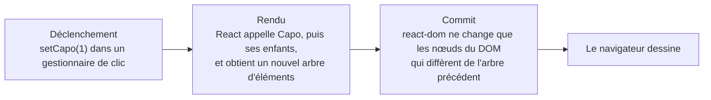

Code : [`src/l03`](https://github.com/spareilleux/learn/tree/3f7a5df/code/react-vite/src/l03), l'extrait d'erreur [`errors/l03_state.tsx`](https://github.com/spareilleux/learn/blob/3f7a5df/code/react-vite/errors/l03_state.tsx), et les solutions dans [`src/solutions`](https://github.com/spareilleux/learn/tree/3f7a5df/code/react-vite/src/solutions).

## Où vit la valeur ?

Un composant Blazor est un objet : un gestionnaire de clic modifie un champ, et après le retour du gestionnaire, `ComponentBase` rend à nouveau le composant en lisant le champ. Un view model WPF lève `PropertyChanged`, et les bindings mettent les contrôles à jour. Dans les deux cas, la valeur vit dans une instance qui existe aussi longtemps que le composant.

Un composant React est une fonction que React rappelle à chaque rendu, et une variable locale disparaît quand la fonction se termine. Une valeur qui doit survivre d'un rendu au suivant est gardée par React, et [`useState`](https://react.dev/reference/react/useState) la demande :

```tsx
// src/l03/Capo.tsx
import { useState } from 'react';
import { transpose } from './chords.ts';

const chords = ['G', 'C', 'D', 'Em'];

export function Capo() {
  // L'état : une valeur que React garde d'un rendu à l'autre, et une fonction qui la change et planifie un nouveau rendu
  const [capo, setCapo] = useState(0);

  // Tout le reste est calculé à partir de l'état pendant le rendu
  const sounding = chords.map((chord) => transpose(chord, capo));

  return (
    <section>
      <p>Capo on fret {capo}</p>
      <button type="button" onClick={() => setCapo(capo - 1)} disabled={capo === 0}>
        Lower
      </button>
      <button type="button" onClick={() => setCapo(capo + 1)} disabled={capo === 11}>
        Raise
      </button>
      <p>Shapes {chords.join(' ')} sound {sounding.join(' ')}</p>
    </section>
  );
}
```

`useState(0)` renvoie une paire : la valeur courante, et une fonction qui la remplace. Au premier rendu, la valeur est le `0` initial ; aux suivants, c'est ce que le dernier `setCapo` a stocké. Les accords qui sonnent ne sont pas de l'état : ils sont calculés à partir de `capo` à chaque rendu, avec la fonction pure [`transpose`](https://github.com/spareilleux/learn/blob/3f7a5df/code/react-vite/src/l03/chords.ts), qui vit dans son propre fichier pour que Fast Refresh puisse remplacer `Capo.tsx` ([leçon 1](../01-vite-project/#remplacement-de-modules-à-chaud-et-fast-refresh)). Le test clique deux fois sur Raise :

```text
✓ transpose
✓ each click changes the state, and React renders the component again
  [ 'Capo on fret 0', 'Shapes G C D Em sound G C D Em' ]
  [ 'Capo on fret 2', 'Shapes G C D Em sound A D E F#m' ]
```

Les fonctions dont le nom commence par `use` sont des [Hooks](https://react.dev/learn/state-a-components-memory#meet-your-first-hook). React retrouve l'état d'un composant d'après l'ordre de ses appels de Hooks, donc les Hooks sont appelés au niveau supérieur du composant, jamais dans une condition ni dans une boucle ; la règle de lint `react/rules-of-hooks` du modèle l'impose. L'état est aussi local à chaque endroit où le composant est rendu : deux éléments `<Capo />` ont deux capos, comme deux instances d'un composant Blazor.

## Le rendu, puis le commit

Ce qui se passe après `setCapo(1)`, tel que [react.dev le décrit](https://react.dev/learn/render-and-commit) :



Rendre, c'est appeler les fonctions des composants ; cela ne touche pas au DOM. [`RenderLog.tsx`](https://github.com/spareilleux/learn/blob/3f7a5df/code/react-vite/src/l03/RenderLog.tsx) journalise chaque appel :

```tsx
// src/l03/RenderLog.tsx
// Pur : les mêmes props donnent la même sortie, et rien ne change en dehors du composant
export function ChordName({ chord }: { chord: string }) {
  console.log(`ChordName renders ${chord}`);
  return <p>{chord}</p>;
}

export function ChordPicker() {
  const [chord, setChord] = useState('G');
  console.log(`ChordPicker renders with ${chord}`);
  return (
    <section>
      <button type="button" onClick={() => setChord(chord === 'G' ? 'C' : 'G')}>
        Change chord
      </button>
      <ChordName chord={chord} />
      <ChordName chord="D" />
    </section>
  );
}
```

```text
✓ a state change renders the component and its children again
  ChordPicker renders with G
  ChordName renders G
  ChordName renders D
  --- click
  ChordPicker renders with C
  ChordName renders C
  ChordName renders D
```

Après le clic, React rend à nouveau `ChordPicker`, et **tous** ses enfants, y compris `<ChordName chord="D" />`, dont les props n'ont pas changé. Le rendu d'un composant inclut son sous-arbre par défaut. C'est en général peu coûteux, puisque le rendu construit des objets et que le commit change ensuite un seul nœud texte, le `G` devenu `C` ; la leçon 10 montre comment sauter des rendus quand ils coûtent. Blazor, en comparaison, saute un enfant dont les paramètres sont tous de types primitifs et inchangés.

## L'état est un instantané

Dans un rendu donné, `capo` est une constante. [`Snapshot.tsx`](https://github.com/spareilleux/learn/blob/3f7a5df/code/react-vite/src/l03/Snapshot.tsx) appelle `setCapo` trois fois dans un même gestionnaire :

```tsx
// src/l03/Snapshot.tsx
function raiseThreeTimes() {
  setCapo(capo + 1);
  setCapo(capo + 1);
  setCapo(capo + 1);
  console.log('in the handler, capo is still', capo);
}

function raiseThreeTimesWithUpdaters() {
  setCapo((c) => c + 1);
  setCapo((c) => c + 1);
  setCapo((c) => c + 1);
}
```

```text
✓ state is a snapshot: setCapo(capo + 1) three times adds 1
  in the handler, capo is still 0
  Capo on fret 1
  Capo on fret 4
```

Le gestionnaire est une closure sur le rendu où il a été créé, celui où `capo` vaut 0, comme l'explique la [leçon 3 de JavaScript](../../javascript-for-csharp-java/03-functions-and-scope/#closures). `setCapo` ne modifie pas cette variable : il demande à React un nouveau rendu, où `capo` aura la nouvelle valeur. Trois appels avec `capo + 1` demandent trois fois `0 + 1`. [React regroupe](https://react.dev/reference/react/useState#setstate-caveats) les trois appels et fait un seul rendu, après le gestionnaire.

Une **fonction de mise à jour**, `(c) => c + 1`, reçoit la valeur en attente au lieu de l'instantané, donc trois fonctions de mise à jour ajoutent trois. Utilise-en une quand l'état suivant dépend du précédent, c'est pourquoi le compteur du modèle, dans [`App.tsx`](https://github.com/spareilleux/learn/blob/3f7a5df/code/react-vite/src/App.tsx#L10), s'écrit `setCount((count) => count + 1)`.

## Ce que tsc vérifie

`useState` est générique : son paramètre de type est inféré depuis la valeur initiale, ou donné explicitement. [`errors/l03_state.tsx`](https://github.com/spareilleux/learn/blob/3f7a5df/code/react-vite/errors/l03_state.tsx) :

```tsx
// errors/l03_state.tsx
import { useState } from 'react';

type Status = 'idle' | 'tuning' | 'in tune';

export function Tuner() {
  const [capo, setCapo] = useState(0);
  const [muted, setMuted] = useState([]);
  const [status, setStatus] = useState<Status>('idle');
  const [note] = useState<string>();

  function reset() {
    setCapo('0');
    setMuted([...muted, 6]);
    setStatus('out of tune');
    capo = 0;
  }

  return (
    <button type="button" onClick={reset}>
      {status}, capo {capo}, {note.toUpperCase()}
    </button>
  );
}
```

```text
errors/l03_state.tsx:13:13 - error TS2345: Argument of type 'string' is not assignable to parameter of type 'SetStateAction<number>'.

13     setCapo('0');
               ~~~

errors/l03_state.tsx:14:15 - error TS2322: Type 'number' is not assignable to type 'never'.

14     setMuted([...muted, 6]);
                 ~~~~~~~~

errors/l03_state.tsx:14:25 - error TS2322: Type 'number' is not assignable to type 'never'.

14     setMuted([...muted, 6]);
                           ~

errors/l03_state.tsx:15:15 - error TS2345: Argument of type '"out of tune"' is not assignable to parameter of type 'SetStateAction<Status>'.

15     setStatus('out of tune');
                 ~~~~~~~~~~~~~

errors/l03_state.tsx:16:5 - error TS2588: Cannot assign to 'capo' because it is a constant.

16     capo = 0;
       ~~~~

errors/l03_state.tsx:21:31 - error TS18048: 'note' is possibly 'undefined'.

21       {status}, capo {capo}, {note.toUpperCase()}
                                 ~~~~


Found 6 errors in the same file, starting at: errors/l03_state.tsx:13

exit 1
```

- `SetStateAction<number>` vaut `number | ((prev: number) => number)` : une valeur ou une fonction de mise à jour.
- `useState([])` infère `never[]`, un tableau qui ne peut rien contenir, donc aucun élément ne peut être ajouté. Donne le type : `useState<number[]>([])`.
- Une union de littéraux de chaîne forme une petite machine à états, comme dans la [leçon 3 de TypeScript](../../typescript-for-csharp-java/03-unions-and-narrowing/#types-union) ; une faute de frappe dans un statut est une erreur.
- `const` rend l'instantané visible : affecter `capo` est une erreur de compilation, et ne changerait de toute façon rien à l'écran.
- `useState<string>()` sans valeur initiale a le type `string | undefined`.

## Tableaux et objets : remplacer, pas modifier

React compare le nouvel état avec l'ancien à l'aide d'[`Object.is`](https://developer.mozilla.org/docs/Web/JavaScript/Reference/Global_Objects/Object/is), qui, pour un objet, compare les références, comme `ReferenceEquals` en C#. [La documentation](https://react.dev/reference/react/useState#ive-updated-the-state-but-the-screen-doesnt-update) dit que si la valeur est la même, React saute le rendu. [`Strings.tsx`](https://github.com/spareilleux/learn/blob/3f7a5df/code/react-vite/src/l03/Strings.tsx) étouffe une corde de deux façons :

```tsx
// src/l03/Strings.tsx
export function MutatedStrings() {
  const [muted, setMuted] = useState<number[]>([]);
  return (
    <section>
      <button
        type="button"
        onClick={() => {
          muted.push(6); // modifie le tableau que React a déjà
          setMuted(muted); // le même tableau : Object.is dit que rien n'a changé, et React saute le rendu
        }}
      >
        Mute string 6
      </button>
      <p>Muted strings: {muted.join(', ') || 'none'}</p>
    </section>
  );
}

export function ReplacedStrings() {
  const [muted, setMuted] = useState<readonly number[]>([]);
  return (
    <section>
      <button type="button" onClick={() => setMuted([...muted, 6])}>
        Mute string 6
      </button>
      <p>Muted strings: {muted.join(', ') || 'none'}</p>
    </section>
  );
}
```

```text
✓ push, then set the same array: nothing on screen
  Muted strings: none
✓ a new array: React renders again
  Muted strings: 6
```

Le premier bouton a modifié le tableau, et l'écran affiche toujours « none ». Le 6 est pourtant dans le tableau, et apparaîtra au prochain rendu provoqué par autre chose : l'écran et l'état ont divergé. En WPF, une `ObservableCollection` prévient ses bindings quand elle change ; un tableau JavaScript ne prévient personne, et React n'apprend un changement que par la fonction set, avec une nouvelle valeur.

Le second bouton construit un nouveau tableau avec la syntaxe de décomposition, `[...muted, 6]`. Déclarer l'état `readonly number[]` fait refuser `muted.push(6)` par `tsc`, comme le montre la [leçon 2 de TypeScript](../../typescript-for-csharp-java/02-structural-typing/#readonly). Les méthodes de tableau qui renvoient un nouveau tableau sont celles à utiliser : `filter`, `map`, `concat`, `toSorted`, `toReversed`, et `with` pour un élément. Un objet se remplace de la même façon, `{ ...tuning, capo: 2 }`, qui correspond au `tuning with { Capo = 2 }` de C# pour un record. [Updating arrays in state](https://react.dev/learn/updating-arrays-in-state) liste les méthodes à éviter et leurs remplaçantes.

## Garder un état minimal

Le [conseil de React](https://react.dev/learn/choosing-the-state-structure#principles-for-structuring-state) pour l'état est celui qu'un concepteur de bases de données donne pour les tables : pas de données redondantes. Si une valeur peut être calculée à partir des props ou d'un autre état pendant le rendu, ce n'est pas de l'état. `Capo` stocke la case et calcule les accords ; stocker aussi les accords ajouterait une seconde valeur à garder synchronisée à la main, et un moment où les deux ne sont pas d'accord. Le même raisonnement s'applique à une liste filtrée, à un total ou à un indicateur « peut envoyer » : calcule-les dans le composant. Si le calcul est coûteux, la leçon 10 montre comment le mettre en cache.

## Rendre quelque chose ou rien

Un composant peut renvoyer `null`, et le JSX offre `&&` et `? :` pour des parties de la sortie. [`Conditional.tsx`](https://github.com/spareilleux/learn/blob/3f7a5df/code/react-vite/src/l03/Conditional.tsx) utilise les trois :

```tsx
// src/l03/Conditional.tsx
// Trois façons de rendre quelque chose ou rien
export function VoicingCard({ voicing }: { voicing: Voicing }) {
  if (voicing.frets.length !== 6) return null; // rien du tout
  const muted = voicing.frets.filter((fret) => fret === null).length;
  return (
    <article>
      <h2>{voicing.chord}</h2>
      {voicing.capo && <p>Capo on fret {voicing.capo}</p>}
      {muted > 0 ? <p>{muted} muted strings</p> : <p>All six strings</p>}
    </article>
  );
}
```

```text
✓ capo 2, and capo 0 with &&
  capo 2
  <div>
    <article>
      <h2>
        D
      </h2>
      <p>
        Capo on fret 
        2
      </p>
      <p>
        2
         muted strings
      </p>
    </article>
  </div>
  capo 0
  <div>
    <article>
      <h2>
        G
      </h2>
      0
      <p>
        All six strings
      </p>
    </article>
  </div>
  three frets
  <div />
```

Avec un capo à 0, la carte affiche un `0` isolé. `voicing.capo && <p>…</p>` s'évalue à `0` quand `capo` vaut 0, puisque `&&` renvoie son côté gauche quand celui-ci est falsy, comme l'explique la [leçon 2 de JavaScript](../../javascript-for-csharp-java/02-values-and-types/#conversions-----parsing-et-truthiness), et `0` est un nombre, que React rend. `false`, `null` et `undefined` ne rendent rien. La [documentation de React](https://react.dev/learn/conditional-rendering#logical-and-operator-) met en garde contre ce piège. `tsc`, lui, ne dit rien : un nombre est un `ReactNode` valide. Écris `voicing.capo > 0 && …`, ou un ternaire. `return null` a retiré toute la carte, et le conteneur est vide.

## Le rendu doit être pur

React appelle un composant quand il le décide, éventuellement plusieurs fois, et peut jeter un rendu. Le composant doit se comporter comme une fonction pure de ses props et de son état : [mêmes entrées, même sortie, et aucune modification de ce qui existait avant l'appel](https://react.dev/learn/keeping-components-pure). Les modifications ont leur place dans les gestionnaires d'événements, ou dans les effets, que couvre la leçon 5. `ChordHistory` enfreint cette règle exprès, en ajoutant à un tableau qu'il reçoit :

```tsx
// Impur exprès : le composant modifie un tableau qu'il a reçu, pendant qu'il rend
export function ChordHistory({ chord, history }: { chord: string; history: string[] }) {
  history.push(chord);
  return <p>Played so far: {history.join(' ')}</p>;
}
```

Le `main.tsx` du modèle enveloppe l'application dans [`StrictMode`](https://react.dev/reference/react/StrictMode), qui, en développement seulement, appelle chaque composant deux fois pour révéler ce genre de bug. Le test rend `ChordHistory` sans puis avec :

```text
✓ without StrictMode, the impure component renders once
  Played so far: G [ 'G' ]
✓ in StrictMode, React renders it twice in development, and the output shows the impurity
  Played so far: G G [ 'G', 'G' ]
```

Sans StrictMode, le bug est invisible, jusqu'à ce que React rende à nouveau le composant pour une raison quelconque. Avec StrictMode, il se voit dès le premier rendu. Un composant pur donne le même résultat une fois ou deux, donc le double appel ne coûte que du temps en développement ; les builds de production ne le font pas.

## Dans GuitarAlchemist/ga

`ListDetailLayout`, dans le [`DynamicPanel.tsx`](https://github.com/GuitarAlchemist/ga/blob/8cc8c5a17c685c779c46cd5e6d0a3f5d5036cc41/ReactComponents/ga-react-components/src/components/PrimeRadiant/DynamicPanel.tsx#L76-L120) de GA, affiche une liste dont les lignes se déplient au clic. Il retient les lignes dépliées par leur index :

```tsx
const ListDetailLayout: React.FC<{ data: unknown[]; showFields: string[] }> = ({ data, showFields }) => {
  const [expanded, setExpanded] = useState<Set<number>>(new Set());
  const toggle = useCallback((idx: number) => {
    setExpanded(prev => {
      const next = new Set(prev);
      if (next.has(idx)) next.delete(idx); else next.add(idx);
      return next;
    });
  }, []);
```

La mise à jour elle-même est correcte : une fonction de mise à jour, et un nouveau `Set` plutôt qu'un `Set` modifié. Le problème, c'est ce à quoi l'état fait référence. Le panneau au-dessus [filtre les données](https://github.com/GuitarAlchemist/ga/blob/8cc8c5a17c685c779c46cd5e6d0a3f5d5036cc41/ReactComponents/ga-react-components/src/components/PrimeRadiant/DynamicPanel.tsx#L289-L296) avec des puces ou un champ de recherche, et [interroge sa source](https://github.com/GuitarAlchemist/ga/blob/8cc8c5a17c685c779c46cd5e6d0a3f5d5036cc41/ReactComponents/ga-react-components/src/components/PrimeRadiant/DynamicPanel.tsx#L256-L287) toutes les 60 secondes par défaut, si bien que la ligne d'index 1 peut être un autre élément un instant plus tard. [`ExpandableList.tsx`](https://github.com/spareilleux/learn/blob/3f7a5df/code/react-vite/src/l03/ExpandableList.tsx) le réduit à l'essentiel, et ajoute une version qui retient les ids :

```text
✓ by index: after filtering, another row is expanded
  expanded policy-2: [ 'policy-1', 'policy-2: warning', 'policy-3' ]
  filtered out policy-1: [ 'policy-2', 'policy-3: error' ]
✓ by id: the expanded row stays expanded
  expanded policy-2: [ 'policy-1', 'policy-2: warning', 'policy-3' ]
  filtered out policy-1: [ 'policy-2: warning', 'policy-3' ]
```

Après avoir filtré policy-1, la version réduite par index a replié policy-2, que l'utilisateur avait déplié, et déplié policy-3, qu'il n'avait pas touché. Changer `key={idx}` ne corrigerait rien : l'état est tenu par la liste, pas par les lignes, et c'est le `Set<number>` qui pointe vers des positions. La correction consiste à retenir une identité. Le panneau de GA reçoit `unknown[]` et ne connaît ses champs que par leur nom, donc l'identité devrait être un champ que nomme la définition du panneau, comme le champ de titre (*à vérifier* dans les définitions de panneaux de GA, que je n'ai pas lues en entier).

## À retenir

- `useState` garde une valeur d'un rendu à l'autre ; sa fonction set remplace la valeur et planifie un rendu.
- Un rendu appelle le composant et ses enfants ; le commit ne change ensuite que les nœuds du DOM qui diffèrent.
- Dans un rendu, l'état est un instantané constant ; utilise une fonction de mise à jour, `(c) => c + 1`, quand la valeur suivante dépend de la précédente.
- React compare l'état avec `Object.is` : remplace les tableaux et les objets par de nouveaux, et déclare-les `readonly`.
- Calcule pendant le rendu ce qui peut l'être au lieu de le stocker.
- `&&` avec un nombre peut rendre `0` ; un composant peut renvoyer `null`.
- Le rendu doit être pur. StrictMode rend deux fois en développement pour révéler les composants impurs.
- Un état qui fait référence à des éléments de liste doit retenir leur identité, pas leur position.

## Exercices

1. Écris un composant `Progression` qui reçoit des accords, comme Am F C G, et affiche « Bar 1 of 4: Am, then F », avec des boutons Previous et Next qui reviennent au début. Qu'est-ce qui est de l'état, et qu'est-ce qui est calculé ?

<details>
<summary>Solution</summary>

[`src/solutions/l03_ex1/Progression.tsx`](https://github.com/spareilleux/learn/blob/3f7a5df/code/react-vite/src/solutions/l03_ex1/Progression.tsx) :

```tsx
// Exercice 1 : un seul état, la position ; l'accord courant et le suivant sont calculés à partir d'elle
export function Progression({ chords }: { chords: readonly string[] }) {
  const [position, setPosition] = useState(0);
  const current = chords[position];
  const next = chords[(position + 1) % chords.length];

  return (
    <section>
      <p>
        Bar {position + 1} of {chords.length}: {current}, then {next}
      </p>
      <button type="button" onClick={() => setPosition((p) => (p + chords.length - 1) % chords.length)}>
        Previous
      </button>
      <button type="button" onClick={() => setPosition((p) => (p + 1) % chords.length)}>
        Next
      </button>
    </section>
  );
}
```

Le test clique une fois sur Previous, puis deux fois sur Next :

```text
✓ next and previous wrap around
  Bar 1 of 4: Am, then F
  Bar 4 of 4: G, then Am
  Bar 2 of 4: F, then C
```

Le seul état est la position. L'accord courant, le suivant et le numéro de mesure sont calculés. Previous ajoute `chords.length - 1` avant le modulo, parce qu'en JavaScript, comme en C#, `-1 % 4` vaut `-1`.

</details>

2. Écris un composant `MuteStrings` : six boutons bascules, String 6 à String 1, et un paragraphe qui liste les cordes étouffées en partant de la plus grave, comme « Muted strings: 6, 5 ». Mets l'état à jour sans modifier le tableau existant, et indique aux technologies d'assistance quels boutons sont enfoncés.

<details>
<summary>Solution</summary>

[`src/solutions/l03_ex2/MuteStrings.tsx`](https://github.com/spareilleux/learn/blob/3f7a5df/code/react-vite/src/solutions/l03_ex2/MuteStrings.tsx) :

```tsx
// Exercice 2 : chaque mise à jour construit un nouveau tableau, donc React voit une nouvelle valeur et rend à nouveau
export function MuteStrings() {
  const [muted, setMuted] = useState<readonly number[]>([]);

  function toggle(string: number) {
    setMuted((current) =>
      current.includes(string) ? current.filter((s) => s !== string) : [...current, string].sort((a, b) => b - a),
    );
  }

  return (
    <section>
      {[6, 5, 4, 3, 2, 1].map((string) => (
        <button key={string} type="button" aria-pressed={muted.includes(string)} onClick={() => toggle(string)}>
          String {string}
        </button>
      ))}
      <p>Muted strings: {muted.join(', ') || 'none'}</p>
    </section>
  );
}
```

```text
✓ toggle strings 5, 6, then 5 again
  after String 5: Muted strings: 5
  after String 6: Muted strings: 6, 5
  after String 5: Muted strings: 6
```

`filter` renvoie un nouveau tableau, et la décomposition aussi ; `sort` modifie un tableau sur place, mais ici il trie le nouveau, que personne d'autre ne détient. `[...current, string].toSorted((a, b) => b - a)` dirait la même chose sans poser la question. Comme l'état est `readonly number[]`, `current.sort(…)` ou `current.push(…)` ne compileraient pas. [`aria-pressed`](https://developer.mozilla.org/docs/Web/Accessibility/ARIA/Reference/Attributes/aria-pressed) fait de chaque bouton un bouton bascule pour les lecteurs d'écran, et le test le vérifie.

</details>

3. Le [`ScaleSelector.tsx`](https://github.com/GuitarAlchemist/ga/blob/8cc8c5a17c685c779c46cd5e6d0a3f5d5036cc41/ReactComponents/ga-react-components/src/components/ScaleSelector.tsx#L10-L33) de GA stocke les notes sélectionnées et le numéro de gamme calculé à partir d'elles dans deux états :

```tsx
const [selectedNotes, setSelectedNotes] = useState<string[]>([]);
const [scale, setScale] = useState(0);

const handleNotesChange = (notes: string[]) => {
    setSelectedNotes(notes);
    setScale(calculateScale(notes));
};
```

Écris un composant `ScaleNotes` avec douze boutons de notes et un bouton Clear, qui affiche les notes et le numéro de gamme, un bit par note de C = 1 à B = 2048, avec un seul état.

<details>
<summary>Solution</summary>

[`src/solutions/l03_ex3/ScaleNotes.tsx`](https://github.com/spareilleux/learn/blob/3f7a5df/code/react-vite/src/solutions/l03_ex3/ScaleNotes.tsx) :

```tsx
const allNotes = ['C', 'C#', 'D', 'D#', 'E', 'F', 'F#', 'G', 'G#', 'A', 'A#', 'B'];

// Exercice 3 : le ScaleSelector de GA garde les notes et le numéro de gamme dans deux états.
// Ici, seules les notes sont de l'état ; le numéro de gamme est calculé à partir d'elles à chaque rendu, donc il ne peut pas diverger.
export function ScaleNotes() {
  const [notes, setNotes] = useState<readonly string[]>([]);
  const scale = notes.reduce((bits, note) => bits | (1 << allNotes.indexOf(note)), 0);

  function toggle(note: string) {
    setNotes((current) => (current.includes(note) ? current.filter((n) => n !== note) : [...current, note]));
  }

  return (
    <section>
      {allNotes.map((note) => (
        <button key={note} type="button" aria-pressed={notes.includes(note)} onClick={() => toggle(note)}>
          {note}
        </button>
      ))}
      <button type="button" onClick={() => setNotes([])}>
        Clear
      </button>
      <p>
        Notes {notes.join(' ') || 'none'}, scale {scale}
      </p>
    </section>
  );
}
```

```text
✓ C major pentatonic, then clear
  Notes C D E G A, scale 661
  Notes none, scale 0
```

661 vaut 1 + 4 + 16 + 128 + 512, les bits de C, D, E, G et A. Avec la gamme calculée pendant le rendu, Clear ne peut pas oublier de la remettre à zéro, et aucun chemin du code ne peut modifier l'une sans l'autre. Dans GA, chaque chemin passe par `handleNotesChange`, qui modifie les deux, donc les deux valeurs concordent aujourd'hui ; le risque, c'est le prochain code qui appellera `setSelectedNotes` seul. `ScaleSelector` a un second problème, un effet qui prévient son parent, que reproduit la leçon 4.

</details>

## Sources

- React : [State: a component's memory](https://react.dev/learn/state-a-components-memory), [Render and commit](https://react.dev/learn/render-and-commit), [State as a snapshot](https://react.dev/learn/state-as-a-snapshot), [Queueing a series of state updates](https://react.dev/learn/queueing-a-series-of-state-updates), [Updating objects in state](https://react.dev/learn/updating-objects-in-state), [Updating arrays in state](https://react.dev/learn/updating-arrays-in-state), [Choosing the state structure](https://react.dev/learn/choosing-the-state-structure), [Conditional rendering](https://react.dev/learn/conditional-rendering), [Keeping components pure](https://react.dev/learn/keeping-components-pure), [`useState`](https://react.dev/reference/react/useState), [`StrictMode`](https://react.dev/reference/react/StrictMode)
- MDN : [`Object.is`](https://developer.mozilla.org/docs/Web/JavaScript/Reference/Global_Objects/Object/is), [`aria-pressed`](https://developer.mozilla.org/docs/Web/Accessibility/ARIA/Reference/Attributes/aria-pressed)
- Microsoft : [Rendu des composants Razor ASP.NET Core](https://learn.microsoft.com/aspnet/core/blazor/components/rendering)
