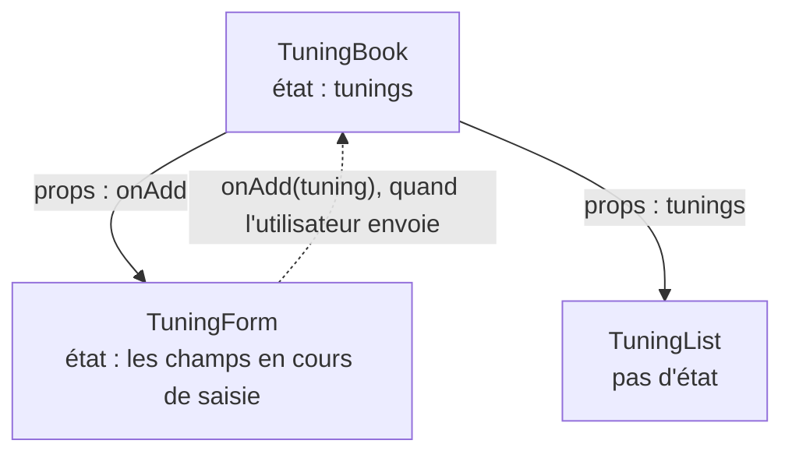
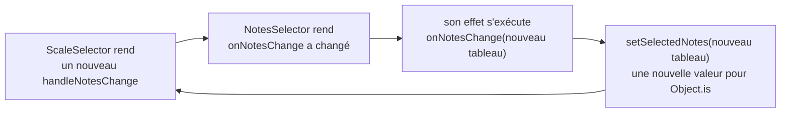

Code : [`src/l04`](https://github.com/spareilleux/learn/tree/3f7a5df/code/react-vite/src/l04), [`src/TuningBook.tsx`](https://github.com/spareilleux/learn/blob/3f7a5df/code/react-vite/src/TuningBook.tsx), l'extrait d'erreur [`errors/l04_events.tsx`](https://github.com/spareilleux/learn/blob/3f7a5df/code/react-vite/errors/l04_events.tsx), et les solutions dans [`src/solutions`](https://github.com/spareilleux/learn/tree/3f7a5df/code/react-vite/src/solutions).

## Les gestionnaires sont des props

En Blazor, `@onclick="Raise"` attache une méthode, et un composant enfant expose un paramètre `EventCallback<T>` que son parent remplit. En React, les deux sont la même chose : une prop dont la valeur est une fonction. Sur un élément HTML, React connaît les noms, `onClick`, `onChange`, `onSubmit`, `onKeyDown` ; sur un composant, le nom est le tien, et la convention est `on` suivi de ce qui s'est passé.

```tsx
// src/l04/Fretboard.tsx
import type { MouseEvent } from 'react';

// Un enfant signale ce qui s'est passé par une prop fonction ; le parent décide quoi en faire
interface FretButtonProps {
  string: number;
  fret: number;
  onSelect: (string: number, fret: number) => void;
}

export function FretButton({ string, fret, onSelect }: FretButtonProps) {
  function handleClick(event: MouseEvent<HTMLButtonElement>) {
    event.stopPropagation(); // le gestionnaire de la rangée ne voit pas ce clic
    onSelect(string, fret);
  }
  return (
    <button type="button" onClick={handleClick}>
      {fret}
    </button>
  );
}

export function StringRow({ string, onSelect }: { string: number; onSelect: FretButtonProps['onSelect'] }) {
  return (
    // Un clic entre les boutons atteint la rangée ; un clic sur un bouton s'arrête là
    <div role="group" aria-label={`String ${string}`} onClick={() => console.log(`row ${string} clicked`)}>
      {[0, 1, 2, 3].map((fret) => (
        <FretButton key={fret} string={string} fret={fret} onSelect={onSelect} />
      ))}
    </div>
  );
}
```

Passe la fonction, `onClick={handleClick}`, pas son résultat : `onClick={handleClick()}` l'appellerait pendant le rendu, comme le signale [Responding to events](https://react.dev/learn/responding-to-events#adding-event-handlers). Une fonction fléchée, `onClick={() => setCapo(capo + 1)}`, crée un gestionnaire qui appelle quelque chose avec des arguments.

`FretButton` ne sait pas ce que signifie sélectionner une case : il signale la corde et la case, et le parent décide. `FretButtonProps['onSelect']` réutilise le type de cette prop, un [type d'accès indexé](../../typescript-for-csharp-java/04-generics/#keyof-accès-indexé-et-types-mappés). Le test utilise une [fonction mock](https://vitest.dev/api/mock) de Vitest comme `onSelect`, clique sur la case 3, puis sur la rangée elle-même :

```tsx
// src/l04/Fretboard.test.tsx
test('the button calls onSelect, and the click stops at the button', async () => {
  const onSelect = vi.fn((string: number, fret: number) => console.log(`selected string ${string}, fret ${fret}`));
  render(<StringRow string={6} onSelect={onSelect} />);
  const row = screen.getByRole('group', { name: 'String 6' });
  await userEvent.click(within(row).getByRole('button', { name: '3' }));
  await userEvent.click(row);
  expect(onSelect).toHaveBeenCalledExactlyOnceWith(6, 3);
});
```

```text
✓ the button calls onSelect, and the click stops at the button
  selected string 6, fret 3
  row 6 clicked
```

Le premier clic a atteint le bouton et s'y est arrêté ; le second, sur la rangée, n'a atteint que la rangée. Les événements se [propagent](https://react.dev/learn/responding-to-events#event-propagation) de l'élément où ils se produisent jusqu'à ses ancêtres, comme dans le DOM et comme les événements routés à propagation (bubbling) de WPF, et `stopPropagation` met fin au trajet. [`user-event`](https://testing-library.com/docs/user-event/intro) simule les actions d'un utilisateur, un appui et un relâchement du pointeur pour un clic, au lieu d'envoyer un seul événement.

## Les types d'événements

Un gestionnaire reçoit un événement React, un [`SyntheticEvent`](https://react.dev/reference/react-dom/components/common#react-event-object) qui enveloppe l'événement du navigateur, disponible dans `nativeEvent`, et suit l'interface standard `Event`. `@types/react` donne à chaque sorte son type, avec l'élément en paramètre de type :

| Événement | Type dans `@types/react` 19.3 | Blazor |
|---|---|---|
| `onClick` | `MouseEvent<HTMLButtonElement>` | `MouseEventArgs` |
| `onChange` sur un input, un select ou un textarea | `ChangeEvent<HTMLInputElement>` | `ChangeEventArgs` |
| `onSubmit` | `SubmitEvent<HTMLFormElement>` | `OnValidSubmit` d'`EditForm` |
| `onKeyDown` | `KeyboardEvent<HTMLDivElement>` | `KeyboardEventArgs` |

Deux propriétés contiennent un élément. `currentTarget` est l'élément dont le gestionnaire s'exécute, et son type est le paramètre de type. `target` est l'élément où l'événement a commencé, qui peut être n'importe quel descendant, donc son type n'est que `EventTarget`. Lis `currentTarget`. Dans `@types/react` 19.3, `FormEvent` et `FormEventHandler`, que beaucoup de projets utilisent pour `onSubmit` et `onChange`, sont marqués `@deprecated` : leur commentaire dit qu'aucun événement de ce nom n'existe, et suggère `ChangeEvent`, `InputEvent` ou `SubmitEvent`.

[`errors/l04_events.tsx`](https://github.com/spareilleux/learn/blob/3f7a5df/code/react-vite/errors/l04_events.tsx) fait les erreurs habituelles :

```tsx
// errors/l04_events.tsx
import { useState, type ChangeEvent } from 'react';

export function CapoPicker() {
  const [capo, setCapo] = useState(0);

  function handleInput(event: ChangeEvent<HTMLInputElement>) {
    setCapo(event.currentTarget.valueAsNumber);
  }

  return (
    <form onSubmit={() => setCapo(0)}>
      <input type="number" value={capo} onChange={setCapo} />
      <select value={capo} onChange={handleInput}>
        <option value={0}>No capo</option>
        <option value={2}>Fret 2</option>
      </select>
      <button type="button" onClick={(event) => setCapo(event.currentTarget.value)}>
        Reset
      </button>
      <button type="button" onClick={(event) => console.log(event.target.value)}>
        Log
      </button>
    </form>
  );
}
```

```text
errors/l04_events.tsx:13:41 - error TS2322: Type 'Dispatch<SetStateAction<number>>' is not assignable to type 'ChangeEventHandler<HTMLInputElement, HTMLInputElement>'.
  Types of parameters 'value' and 'event' are incompatible.
    Type 'ChangeEvent<HTMLInputElement, HTMLInputElement>' is not assignable to type 'SetStateAction<number>'.

13       <input type="number" value={capo} onChange={setCapo} />
                                           ~~~~~~~~

  node_modules/@types/react/index.d.ts:3411:9 - The expected type comes from property 'onChange' which is declared here on type 'DetailedHTMLProps<InputHTMLAttributes<HTMLInputElement>, HTMLInputElement>'
    3411         onChange?: ChangeEventHandler<T, HTMLInputElement> | undefined;
                 ~~~~~~~~

errors/l04_events.tsx:14:28 - error TS2322: Type '(event: ChangeEvent<HTMLInputElement, Element>) => void' is not assignable to type 'ChangeEventHandler<HTMLSelectElement, HTMLSelectElement>'.
  Types of parameters 'event' and 'event' are incompatible.
    Type 'ChangeEvent<HTMLSelectElement, HTMLSelectElement>' is not assignable to type 'ChangeEvent<HTMLInputElement, Element>'.
      Type 'HTMLSelectElement' is missing the following properties from type 'HTMLInputElement': accept, align, alt, capture, and 38 more.

14       <select value={capo} onChange={handleInput}>
                              ~~~~~~~~

  node_modules/@types/react/index.d.ts:3578:9 - The expected type comes from property 'onChange' which is declared here on type 'DetailedHTMLProps<SelectHTMLAttributes<HTMLSelectElement>, HTMLSelectElement>'
    3578         onChange?: ChangeEventHandler<T, HTMLSelectElement> | undefined;
                 ~~~~~~~~

errors/l04_events.tsx:18:57 - error TS2345: Argument of type 'string' is not assignable to parameter of type 'SetStateAction<number>'.

18       <button type="button" onClick={(event) => setCapo(event.currentTarget.value)}>
                                                           ~~~~~~~~~~~~~~~~~~~~~~~~~

errors/l04_events.tsx:21:74 - error TS2339: Property 'value' does not exist on type 'EventTarget'.

21       <button type="button" onClick={(event) => console.log(event.target.value)}>
                                                                            ~~~~~


Found 4 errors in the same file, starting at: errors/l04_events.tsx:13

exit 1
```

- Une fonction set n'est pas un gestionnaire de changement : `onChange` passe un événement, et `setCapo` attend un nombre. Le `@bind` de Blazor fait cette conversion ; React n'a pas de binding, et c'est le gestionnaire qui lit la valeur.
- Un gestionnaire pour un input ne convient pas à un select : le type du paramètre dit quel élément il attend, et les paramètres de fonction sont vérifiés comme dans la [leçon 4 de TypeScript](../../typescript-for-csharp-java/04-generics/#variance).
- `value` est toujours une chaîne dans le DOM, même sur un bouton ou un `<input type="number">`. Convertis-la avec `Number(…)`, ou lis `valueAsNumber` sur un champ numérique.
- `event.target` est un `EventTarget`, qui n'a pas de `value` ; `currentTarget` est typé.
- `onSubmit={() => setCapo(0)}` compile : un gestionnaire peut ignorer son événement, comme tout callback peut ignorer ses arguments.

## Les champs contrôlés

React n'a ni `@bind` ni `{Binding Mode=TwoWay}`. Un champ est **contrôlé** quand sa `value` vient de l'état et que son `onChange` réécrit l'état : React rend la valeur, l'utilisateur tape, `onChange` reçoit le nouveau texte, la fonction set le stocke, et React le rend à nouveau. L'état est l'unique source de vérité, et le composant peut vérifier, transformer ou refuser chaque changement. [`TuningForm.tsx`](https://github.com/spareilleux/learn/blob/3f7a5df/code/react-vite/src/l04/TuningForm.tsx) :

```tsx
// src/l04/TuningForm.tsx
// Un formulaire contrôlé : la valeur de chaque champ vient de l'état, et chaque frappe passe par onChange
export function TuningForm({ onAdd }: { onAdd: (tuning: NewTuning) => void }) {
  const [name, setName] = useState('');
  const [notesText, setNotesText] = useState('E A D G B E');
  const [capo, setCapo] = useState(0);
  const [submitted, setSubmitted] = useState(false);

  // La validation est calculée à partir de l'état pendant le rendu, pas stockée à côté
  const parsed = parseNotes(notesText);
  const nameError = name.trim() === '' ? 'Give the tuning a name.' : undefined;
  const notesError = parsed.ok ? undefined : parsed.error;

  function handleNotesChange(event: ChangeEvent<HTMLInputElement>) {
    setNotesText(event.currentTarget.value);
  }

  function handleSubmit(event: SubmitEvent<HTMLFormElement>) {
    event.preventDefault(); // pas de rechargement de la page : React gère l'envoi
    setSubmitted(true);
    if (nameError || !parsed.ok) return;
    onAdd({ name: name.trim(), notes: parsed.notes, capo });
    setName('');
    setSubmitted(false);
  }

  return (
    <form onSubmit={handleSubmit} noValidate>
      <label>
        Name <input value={name} onChange={(event) => setName(event.currentTarget.value)} aria-invalid={submitted && !!nameError} />
      </label>
      {submitted && nameError && <p role="alert">{nameError}</p>}
      <label>
        Notes <input value={notesText} onChange={handleNotesChange} aria-invalid={!!notesError} />
      </label>
      {notesError && <p role="alert">{notesError}</p>}
      <label>
        Capo{' '}
        <select value={capo} onChange={(event) => setCapo(Number(event.currentTarget.value))}>
          {[0, 1, 2, 3, 4, 5].map((fret) => (
            <option key={fret} value={fret}>
              {fret}
            </option>
          ))}
        </select>
      </label>
      <button type="submit">Add tuning</button>
    </form>
  );
}
```

Les pièces, et d'où vient chacune :

- **Un gestionnaire en ligne**, `(event) => setName(event.currentTarget.value)`, n'a pas besoin de type : TypeScript infère `event` depuis la prop `onChange`, comme il infère le paramètre d'une lambda depuis un délégué en C#. `handleNotesChange` est une fonction nommée, donc elle déclare le type.
- **`onChange` se déclenche à chaque frappe**, comme l'événement `input` du navigateur, et non quand le champ perd le focus, comme l'événement `change` du navigateur. [La documentation](https://react.dev/reference/react-dom/components/input#props) le dit.
- **`preventDefault`** arrête l'envoi propre au navigateur, qui enverrait le formulaire à l'URL courante et rechargerait la page. `noValidate` désactive les messages de validation du navigateur, puisque le composant affiche les siens.
- **La validation est calculée**, comme la leçon 3 le recommande pour tout ce qui est dérivé : `parsed`, `nameError` et `notesError` viennent de l'état à chaque rendu. Il n'y a pas d'état « erreurs » à garder synchronisé. Le seul état en plus est `submitted`, un fait que les champs ne contiennent pas : si l'utilisateur a tenté d'envoyer, pour qu'un nom vide ne soit pas signalé avant qu'il ait tapé quoi que ce soit.
- **`role="alert"`** fait annoncer un message par les lecteurs d'écran quand il apparaît, et `aria-invalid` marque le champ.
- **Un `select` est contrôlé** de la même façon, et sa valeur est une chaîne, d'où `Number(…)`.

[`parseNotes`](https://github.com/spareilleux/learn/blob/3f7a5df/code/react-vite/src/l04/notes.ts) est une simple fonction qui renvoie une union discriminée, `{ ok: true; notes } | { ok: false; error }`, comme celles que construit la [leçon 3 de TypeScript](../../typescript-for-csharp-java/03-unions-and-narrowing/#unions-discriminées) ; une fois `parsed.ok` vérifié, `parsed.notes` existe. La garder hors du composant permet de la tester seule :

```text
✓ parseNotes
  "E A D G B E"         { ok: true, notes: [ 'E', 'A', 'D', 'G', 'B', 'E' ] }
  "d a d g a d"         { ok: true, notes: [ 'D', 'A', 'D', 'G', 'A', 'D' ] }
  "Eb Ab Db Gb Bb Eb"   { ok: true, notes: [ 'D#', 'G#', 'C#', 'F#', 'A#', 'D#' ] }
  "E A D G B"           { ok: false, error: 'A guitar tuning has 6 notes, not 5.' }
  "E A D G H E"         { ok: false, error: '"H" is not a note.' }
```

Le test du composant tape dans le formulaire comme le ferait un utilisateur :

```text
✓ the form validates as you type, and on submit
  typed "D A D G": [ 'A guitar tuning has 6 notes, not 4.' ]
  typed " A D": []
  submitted without a name: [ 'Give the tuning a name.' ] onAdd calls: 0
  submitted: [] [[{"name":"DADGAD","notes":["D","A","D","G","A","D"],"capo":2}]]
```

L'erreur sur les notes apparaît pendant la saisie et disparaît avec la sixième note ; l'erreur sur le nom attend un envoi. Après un envoi valide, `onAdd` a reçu un accordage, et le champ du nom est de nouveau vide.

L'`EditForm` de Blazor en fait davantage à ta place, avec des annotations de données sur un modèle et des composants `ValidationMessage`. React lui-même s'arrête aux champs contrôlés et aux événements ; des bibliothèques comme React Hook Form ajoutent des schémas et la gestion des erreurs, et React 19 ajoute les Actions de formulaire, que couvre la leçon 12.

### Les deux avertissements des champs contrôlés

[`Warnings.tsx`](https://github.com/spareilleux/learn/blob/3f7a5df/code/react-vite/src/l04/Warnings.tsx) fait les deux erreurs que React signale en développement :

```tsx
// src/l04/Warnings.tsx
// Une value sans onChange : React rend le champ en lecture seule, et avertit
export function ReadOnlyCapo() {
  return <input aria-label="Capo" type="number" value={2} />;
}

// undefined, puis un nombre : le champ commence non contrôlé, puis devient contrôlé
export function LateCapo() {
  const [capo, setCapo] = useState<number>();
  return <input aria-label="Capo" type="number" value={capo} onChange={(event) => setCapo(event.currentTarget.valueAsNumber)} />;
}
```

```text
✓ value without onChange: typing changes nothing
  console.error: You provided a `value` prop to a form field without an `onChange` handler. This will render a read-only field. If the field should be mutable use `defaultValue`. Otherwise, set either `onChange` or `readOnly`.
  value after typing 5: 2
✓ undefined, then a number: React warns on the first keystroke
  console.error: A component is changing an uncontrolled input to be controlled. This is likely caused by the value changing from undefined to a defined value, which should not happen. Decide between using a controlled or uncontrolled input element for the lifetime of the component. More info: https://react.dev/link/controlled-components
  value after typing 3: 3
```

Avec une `value` et sans `onChange`, l'utilisateur tape et le champ affiche toujours 2 : React remet la valeur de l'état. `value={undefined}` signifie « pas de valeur », un champ non contrôlé, donc un état qui commence à `undefined` fait passer le champ de non contrôlé à contrôlé à la première frappe. `tsc` accepte les deux composants ; commence l'état avec une valeur, `useState(0)` ou `useState('')`, ou utilise `defaultValue` pour un champ que React ne contrôle pas. Le `TuningNotes` du cours, dans la [leçon 2](../02-components-and-jsx/#listes-et-clés), était exprès un tel champ non contrôlé.

## L'état qui appartient au parent

`TuningForm` ne stocke pas les accordages : il appelle `onAdd`. La liste des accordages appartient à [`TuningBook`](https://github.com/spareilleux/learn/blob/3f7a5df/code/react-vite/src/TuningBook.tsx), le parent commun le plus proche du formulaire qui ajoute un accordage et de la liste qui les affiche. React appelle cela [faire remonter l'état](https://react.dev/learn/sharing-state-between-components) :

```tsx
// src/TuningBook.tsx
// Les leçons 2 à 4 ensemble : le carnet possède la liste, le formulaire signale un nouvel accordage, la liste le rend
export function TuningBook() {
  const [tunings, setTunings] = useState<readonly Tuning[]>([standard, dropD]);

  function handleAdd(tuning: NewTuning) {
    const id = `${tuning.name.toLowerCase().replaceAll(/\W+/g, '-')}-${tunings.length + 1}`;
    setTunings([...tunings, { id, name: tuning.capo ? `${tuning.name}, capo ${tuning.capo}` : tuning.name, notes: tuning.notes }]);
  }

  return (
    <>
      <TuningForm onAdd={handleAdd} />
      <TuningList tunings={tunings} />
      <Capo />
    </>
  );
}
```



Les données descendent sous forme de props, et les événements remontent sous forme d'appels à des props fonctions. L'id est construit quand l'accordage est ajouté, une seule fois, et ne change jamais, comme la leçon 2 le demande d'une clé. Le test ajoute un accordage par le formulaire et lit la liste :

```text
✓ a tuning added with the form appears in the list
  [ 'Standard', 'Drop D', 'Open D' ]
```

`TuningBook` est ce que [`App.tsx`](https://github.com/spareilleux/learn/blob/3f7a5df/code/react-vite/src/App.tsx) rend sous le compteur, donc `npm run dev` montre les trois leçons ensemble.

## Dans GuitarAlchemist/ga

Le `ga-react-components` de GA a deux composants qui communiquent dans l'autre sens, de l'enfant vers le parent, par un effet. [`NotesSelector.tsx`](https://github.com/GuitarAlchemist/ga/blob/8cc8c5a17c685c779c46cd5e6d0a3f5d5036cc41/ReactComponents/ga-react-components/src/components/NotesSelector.tsx#L10-L18) signale ses notes après chaque rendu où elles, ou le callback, ont changé :

```tsx
const NotesSelector: React.FC<NoteSelectorProps> = ({ onNotesChange }) => {
    const [textNotes, setTextNotes] = useState('');
    const [toggledNotes, setToggledNotes] = useState<string[]>([]);
    const [useTextInput, setUseTextInput] = useState(true);

    useEffect(() => {
        const notes = useTextInput ? textNotes.split(' ').filter(note => allNotes.includes(note)) : toggledNotes;
        onNotesChange(notes);
    }, [textNotes, toggledNotes, useTextInput, onNotesChange]);
```

[`ScaleSelector.tsx`](https://github.com/GuitarAlchemist/ga/blob/8cc8c5a17c685c779c46cd5e6d0a3f5d5036cc41/ReactComponents/ga-react-components/src/components/ScaleSelector.tsx#L10-L42) le rend avec un gestionnaire qu'il crée à chaque rendu, et qui stocke les notes, sous forme d'un nouveau tableau, et la gamme :

```tsx
    const handleNotesChange = (notes: string[]) => {
        setSelectedNotes(notes);
        setScale(calculateScale(notes));
    };
    // …
            <NotesSelector onNotesChange={handleNotesChange} />
```

Les effets sont le sujet de la leçon 5 ; ce qui compte ici, c'est que React exécute un effet après un rendu dans lequel l'une de ses dépendances diffère du rendu précédent, comparée avec `Object.is`. Mets les deux ensemble :



[`src/l04/NotesSelector.tsx`](https://github.com/spareilleux/learn/blob/3f7a5df/code/react-vite/src/l04/NotesSelector.tsx) réduit les deux composants à leur état, leur effet et leur gestionnaire, sans Material UI, et ajoute un compteur qui lève une exception après 60 rendus pour que le test se termine :

```text
✓ GA's two selectors render each other in a loop
  console.error: Maximum update depth exceeded. This can happen when a component calls setState inside useEffect, but useEffect either doesn't have a dependency array, or one of the dependencies changes on every render.
```

React détecte la boucle et dit ce qui la cause : « one of the dependencies changes on every render ». Dans la réduction, la boucle commence dès que `ScaleSelector` est monté. Dans GA, `ScaleSelector` est exporté depuis [`components/index.ts`](https://github.com/GuitarAlchemist/ga/blob/8cc8c5a17c685c779c46cd5e6d0a3f5d5036cc41/ReactComponents/ga-react-components/src/components/index.ts#L14), mais aucune application de GA à ce commit ne le rend : `ga-client` a son propre `ScaleSelector`. Le bug est latent, et apparaîtra le jour où quelqu'un utilisera le composant exporté. Je n'ai pas monté le composant de GA lui-même, avec Material UI, pour le confirmer (*à vérifier*). La correction n'a pas besoin de `useCallback` pour stabiliser le gestionnaire ; elle supprime l'effet, comme le montre l'exercice 3. La page de React [You might not need an effect](https://react.dev/learn/you-might-not-need-an-effect#notifying-parent-components-about-state-changes) décrit exactement ce cas.

## À retenir

- Un gestionnaire est une prop fonction : sur un élément, React la nomme ; sur un composant, c'est toi, `onSomething`.
- Passe la fonction, pas un appel. Type un gestionnaire nommé avec le type d'événement et son élément ; un gestionnaire en ligne est inféré.
- Lis `currentTarget`, pas `target` ; `value` est toujours une chaîne. `FormEvent` est déprécié dans `@types/react` 19.3.
- Les événements remontent ; `stopPropagation` les arrête, `preventDefault` annule l'action par défaut du navigateur, comme l'envoi d'un formulaire.
- Un champ contrôlé prend `value` dans l'état et le réécrit dans `onChange` ; ne lui donne pas `undefined`, ni une `value` sans `onChange`.
- Calcule la validation pendant le rendu. Garde l'état dans le parent commun le plus proche, et fais remonter les événements par des props fonctions.
- Un enfant qui prévient son parent depuis un effet peut boucler ; préviens-le plutôt depuis le gestionnaire d'événement.

## Exercices

1. Écris un composant `StringOrder` qui reçoit six notes et les affiche, avec une case à cocher intitulée « High string first » qui inverse l'ordre. De quelle propriété de l'événement une case à cocher a-t-elle besoin, et quelle méthode de tableau laisse les notes intactes ?

<details>
<summary>Solution</summary>

[`src/solutions/l04_ex1/StringOrder.tsx`](https://github.com/spareilleux/learn/blob/3f7a5df/code/react-vite/src/solutions/l04_ex1/StringOrder.tsx) :

```tsx
// Exercice 1 : une case à cocher contrôlée lit event.currentTarget.checked, pas value
export function StringOrder({ notes }: { notes: readonly string[] }) {
  const [highFirst, setHighFirst] = useState(false);

  function handleChange(event: ChangeEvent<HTMLInputElement>) {
    setHighFirst(event.currentTarget.checked);
  }

  const shown = highFirst ? notes.toReversed() : notes;
  return (
    <section>
      <label>
        <input type="checkbox" checked={highFirst} onChange={handleChange} /> High string first
      </label>
      <p>{shown.join(' ')}</p>
    </section>
  );
}
```

```text
✓ the checkbox reverses the order
  D A D G A E
  E A G D A D
```

Une case à cocher est contrôlée par `checked`, pas par `value`, et son `onChange` lit `currentTarget.checked` ; sa `value` est la chaîne envoyée avec un formulaire, `"on"` par défaut. `toReversed` renvoie un nouveau tableau ; `reverse` inverserait les props sur place, ce qu'un composant ne doit pas faire, et `tsc` le refuse sur un `readonly string[]`. L'ordre inversé est calculé, pas stocké.

</details>

2. Écris un `FretSelector`, qui peut prendre le focus au clavier, où les flèches droite et gauche déplacent la case sélectionnée entre 0 et un maximum, et où Home revient à 0. Les autres touches, comme Tab, doivent continuer de fonctionner, et les flèches ne doivent pas faire défiler la page. Expose-le aux technologies d'assistance comme un curseur (slider).

<details>
<summary>Solution</summary>

[`src/solutions/l04_ex2/FretSelector.tsx`](https://github.com/spareilleux/learn/blob/3f7a5df/code/react-vite/src/solutions/l04_ex2/FretSelector.tsx) :

```tsx
// Exercice 2 : les flèches déplacent la case sélectionnée, Home revient à la corde à vide
export function FretSelector({ frets = 12 }: { frets?: number }) {
  const [fret, setFret] = useState(0);

  function handleKeyDown(event: KeyboardEvent<HTMLDivElement>) {
    const moves: Record<string, number> = { ArrowRight: fret + 1, ArrowLeft: fret - 1, Home: 0 };
    if (!(event.key in moves)) return; // les autres touches gardent leur comportement habituel
    event.preventDefault(); // les flèches ne font pas défiler la page
    setFret(Math.min(frets, Math.max(0, moves[event.key])));
  }

  return (
    <div role="slider" tabIndex={0} aria-label="Fret" aria-valuemin={0} aria-valuemax={frets} aria-valuenow={fret} onKeyDown={handleKeyDown}>
      Fret {fret}
    </div>
  );
}
```

Le test utilise un maximum de 2, et appuie sur Left, puis trois fois sur Right, puis sur Home :

```text
✓ arrows, bounds and Home
  {ArrowLeft}                          Fret 0
  {ArrowRight}{ArrowRight}{ArrowRight} Fret 2
  {Home}                               Fret 0
```

`event.key` nomme la touche, `"ArrowRight"` ou `"Home"`. `preventDefault` n'est appelé que pour les touches que gère le composant, donc Tab déplace toujours le focus. `tabIndex={0}` rend le `div` focusable, et le [rôle slider](https://developer.mozilla.org/docs/Web/Accessibility/ARIA/Reference/Roles/slider_role) avec ses attributs `aria-value*` dit à un lecteur d'écran ce qu'il est et où il en est. Un `<input type="range">` donnerait tout cela gratuitement, et reste le meilleur choix quand son apparence convient ; l'exercice porte sur les événements clavier.

</details>

3. Réécris la paire `NotesSelector` et `ScaleSelector` de GA, avec le champ texte seulement, pour que les notes parviennent au parent sans effet et que le numéro de gamme ne soit pas de l'état. Montre que taper « C E G » fait un commit de l'arbre par frappe.

<details>
<summary>Solution</summary>

[`src/solutions/l04_ex3/ScaleSelector.tsx`](https://github.com/spareilleux/learn/blob/3f7a5df/code/react-vite/src/solutions/l04_ex3/ScaleSelector.tsx) :

```tsx
// Exercice 3 : l'enfant prévient le parent dans le gestionnaire d'événement, quand l'utilisateur tape, sans effet
export function NotesSelector({ onNotesChange }: { onNotesChange: (notes: string[]) => void }) {
  const [textNotes, setTextNotes] = useState('');

  return (
    <input
      aria-label="Notes"
      value={textNotes}
      onChange={(event) => {
        const text = event.currentTarget.value;
        setTextNotes(text);
        onNotesChange(text.split(' ').filter((note) => allNotes.includes(note)));
      }}
    />
  );
}

// Le parent ne garde que les notes, et calcule le numéro de gamme à partir d'elles
export function ScaleSelector() {
  const [selectedNotes, setSelectedNotes] = useState<string[]>([]);
  const scale = selectedNotes.reduce((bits, note) => bits | (1 << allNotes.indexOf(note)), 0);

  return (
    <section>
      <NotesSelector onNotesChange={setSelectedNotes} />
      <p>
        {selectedNotes.join(' ') || 'no notes'}: scale {scale}
      </p>
    </section>
  );
}
```

Le test compte les commits avec le [`Profiler`](https://react.dev/reference/react/Profiler) de React, dont `onRender` s'exécute chaque fois que React fait le commit de l'arbre qu'il contient :

```tsx
test('one commit per keystroke, and the scale follows the notes', async () => {
  let commits = 0;
  render(
    // Profiler appelle onRender chaque fois que React fait le commit de l'arbre qu'il contient
    <Profiler id="scale" onRender={() => commits++}>
      <ScaleSelector />
    </Profiler>,
  );
  await userEvent.type(screen.getByLabelText('Notes'), 'C E G');
  console.log(screen.getByRole('paragraph').textContent, `after ${commits} commits`);
  expect(commits).toBe(6);
});
```

```text
✓ one commit per keystroke, and the scale follows the notes
  C E G: scale 145 after 6 commits
```

Six commits : le montage, et un pour chacun des cinq caractères de « C E G ». Chaque frappe appelle deux fonctions set, celle de l'enfant et celle du parent, dans le même gestionnaire, et React les regroupe en un seul rendu, comme l'a montré la leçon 3. Rien ne s'exécute après le rendu, donc rien ne peut boucler. 145 vaut 1 + 16 + 128, les bits de C, E et G. Le parent passe directement `setSelectedNotes` : une fonction set garde la même identité d'un rendu à l'autre, et correspond au type `(notes: string[]) => void`.

</details>

## Sources

- React : [Responding to events](https://react.dev/learn/responding-to-events), [Reacting to input with state](https://react.dev/learn/reacting-to-input-with-state), [Sharing state between components](https://react.dev/learn/sharing-state-between-components), [You might not need an effect](https://react.dev/learn/you-might-not-need-an-effect), [`<input>`](https://react.dev/reference/react-dom/components/input), [Common components: the React event object](https://react.dev/reference/react-dom/components/common#react-event-object), [`<Profiler>`](https://react.dev/reference/react/Profiler)
- [`@types/react` sur DefinitelyTyped](https://github.com/DefinitelyTyped/DefinitelyTyped/tree/master/types/react)
- Testing Library : [`user-event`](https://testing-library.com/docs/user-event/intro), [requêtes par rôle](https://testing-library.com/docs/queries/byrole) ; Vitest : [fonctions mock](https://vitest.dev/api/mock)
- MDN : [rôle ARIA `slider`](https://developer.mozilla.org/docs/Web/Accessibility/ARIA/Reference/Roles/slider_role), [rôle `alert`](https://developer.mozilla.org/docs/Web/Accessibility/ARIA/Reference/Roles/alert_role)
- Microsoft : [Gestion des événements Blazor ASP.NET Core](https://learn.microsoft.com/aspnet/core/blazor/components/event-handling), [liaison de données](https://learn.microsoft.com/aspnet/core/blazor/components/data-binding), [formulaires](https://learn.microsoft.com/aspnet/core/blazor/forms/)
