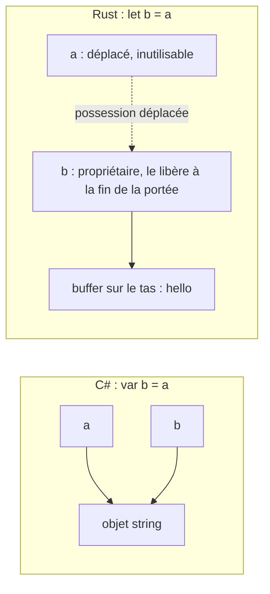

Exemple complet : [`examples/l03_ownership.rs`](https://github.com/spareilleux/learn/blob/main/code/rust-for-csharp-java/examples/l03_ownership.rs) — `cargo run --example l03_ownership`.

## Le problème que résout un GC

En C# et en Java, les objets vivent sur le tas et plusieurs variables peuvent pointer vers le même objet. Personne ne le « possède » : le **ramasse-miettes** (garbage collector) le libère à un moment donné après la disparition de la dernière référence.

C'est pratique, mais cela coûte un runtime, des pauses et de la marge mémoire — et cela ne gère que la mémoire : les fichiers, les sockets et les verrous ont toujours besoin de [`using`](https://learn.microsoft.com/dotnet/csharp/language-reference/statements/using) / [`IDisposable`](https://learn.microsoft.com/dotnet/api/system.idisposable) ou de [try-with-resources](https://docs.oracle.com/javase/tutorial/essential/exceptions/tryResourceClose.html).

Rust n'a pas de GC. À la place, le compilateur impose des règles de **possession (ownership)** et insère lui-même le code de nettoyage, à la compilation.

## Les trois règles

1. Chaque valeur a exactement **un propriétaire** (une variable, un champ, un élément de collection…).
2. Quand le propriétaire sort de sa portée, la valeur est **libérée** (dropped).
3. La possession peut être **déplacée** vers un autre propriétaire ; le précédent ne peut plus être utilisé.

## Déplacements (moves)

Extrait de [`examples/l03_ownership.rs`, lignes 21-23](https://github.com/spareilleux/learn/blob/93f6f82/code/rust-for-csharp-java/examples/l03_ownership.rs#L21-L23) :

```rust
let a = String::from("hello");
let b = a;             // la propriété du buffer sur le tas passe à b
println!("b = {b}");   // b = hello
```

En C#, `var b = a;` copie une *référence* : `a` et `b` pointent désormais vers la même chaîne, et les deux restent utilisables. En Rust, `a` a **disparu** ([`src/lib.rs`, lignes 61-63](https://github.com/spareilleux/learn/blob/93f6f82/code/rust-for-csharp-java/src/lib.rs#L61-L63)) :

```rust
let a = String::from("hello");
let b = a;
println!("{a} {b}");
```

```text
error[E0382]: borrow of moved value: `a`
 --> e_move.rs:4:16
  |
2 |     let a = String::from("hello");
  |         - move occurs because `a` has type `String`, which does not implement the `Copy` trait
3 |     let b = a;
  |             - value moved here
4 |     println!("{a} {b}");
  |                ^ value borrowed here after move
  |
help: consider cloning the value if the performance cost is acceptable
  |
3 |     let b = a.clone();
  |              ++++++++
```

Pourquoi ? Si `a` et `b` possédaient tous deux le buffer, tous deux le libéreraient à la fin de la portée — une double libération. Le déplacement (move) rend « qui libère ceci » sans ambiguïté.

La même affectation dans les deux langages : en C#, deux références partagent un objet ; en Rust, le buffer sur le tas a un seul propriétaire à la fois.



## `clone` — une copie profonde explicite

Extrait de [`examples/l03_ownership.rs`, lignes 26-27](https://github.com/spareilleux/learn/blob/93f6f82/code/rust-for-csharp-java/examples/l03_ownership.rs#L26-L27) :

```rust
let c = b.clone();
println!("b = {b}, c = {c}");   // b = hello, c = hello
```

[`clone()`](https://doc.rust-lang.org/std/clone/trait.Clone.html) duplique les données du tas. C'est toujours visible dans le code, donc les copies coûteuses ne se produisent jamais par accident.

## Les types `Copy`

Les petites valeurs qui vivent entièrement sur la pile sont **copiées** au lieu d'être déplacées ([lignes 30-32](https://github.com/spareilleux/learn/blob/93f6f82/code/rust-for-csharp-java/examples/l03_ownership.rs#L30-L32)) :

```rust
let x = 5;
let y = x;
println!("x = {x}, y = {y}");   // x = 5, y = 5
```

Les entiers, les flottants, `bool`, `char`, ainsi que les tuples et tableaux de ceux-ci sont `Copy`. C'est proche des types valeur de C# ([`struct`](https://learn.microsoft.com/dotnet/csharp/language-reference/builtin-types/struct)) — mais en Rust, *vos propres* structs sont déplacées par défaut et ne deviennent `Copy` que si vous le demandez avec [`#[derive(Clone, Copy)]`](https://doc.rust-lang.org/book/appendix-03-derivable-traits.html).

| | C# | Java | Rust |
|---|---|---|---|
| `b = a` avec un objet sur le tas | les deux référencent le même objet | les deux référencent le même objet | **déplacement** : `a` inutilisable |
| `b = a` avec un `int` | copie | copie | copie (type `Copy`) |
| copie profonde explicite | [`ICloneable`](https://learn.microsoft.com/dotnet/api/system.icloneable), constructeur de copie | [`clone()`](https://docs.oracle.com/en/java/javase/25/docs/api/java.base/java/lang/Object.html#clone()), constructeur de copie | `.clone()` |

## Les fonctions prennent aussi possession

Passer un [`String`](https://doc.rust-lang.org/std/string/struct.String.html) par valeur le déplace dans la fonction ([`src/lib.rs`, lignes 69-75](https://github.com/spareilleux/learn/blob/93f6f82/code/rust-for-csharp-java/src/lib.rs#L69-L75)) :

```rust
fn take(s: String) -> usize {
    s.len()
} // s est libéré ici

let name = String::from("Ferris");
let len = take(name);
println!("{name} has {len} letters");
```

```text
error[E0382]: borrow of moved value: `name`
 --> e_move_fn.rs:8:16
  |
6 |     let name = String::from("Ferris");
  |         ---- move occurs because `name` has type `String`, which does not implement the `Copy` trait
7 |     let len = take(name);
  |                    ---- value moved here
8 |     println!("{name} has {len} letters");
  |                ^^^^ value borrowed here after move
  |
note: consider changing this parameter type in function `take` to borrow instead if owning the value isn't necessary
```

Le compilateur indique déjà la vraie correction : *emprunter* au lieu de prendre possession. C'est le sujet de la [leçon 4](../04-borrowing-and-strings/).

Renvoyer une valeur rend la possession à l'appelant ([lignes 15-17](https://github.com/spareilleux/learn/blob/93f6f82/code/rust-for-csharp-java/examples/l03_ownership.rs#L15-L17), [38](https://github.com/spareilleux/learn/blob/93f6f82/code/rust-for-csharp-java/examples/l03_ownership.rs#L38)) :

```rust
fn make_greeting(name: &str) -> String {
    format!("Hello, {name}!")
}

let greeting = make_greeting("Ferris");   // greeting possède le nouveau String
```

## `Drop` — un nettoyage déterministe

Quand un propriétaire sort de sa portée, Rust appelle `drop`, dans l'ordre **inverse** de déclaration. Vous pouvez vous y brancher en implémentant le trait `Drop` ([lignes 1-9](https://github.com/spareilleux/learn/blob/93f6f82/code/rust-for-csharp-java/examples/l03_ownership.rs#L1-L9), [19](https://github.com/spareilleux/learn/blob/93f6f82/code/rust-for-csharp-java/examples/l03_ownership.rs#L19), [42-55](https://github.com/spareilleux/learn/blob/93f6f82/code/rust-for-csharp-java/examples/l03_ownership.rs#L42-L55)) :

```rust
struct TempFile {
    name: String,
}

impl Drop for TempFile {
    fn drop(&mut self) {
        println!("dropping {}", self.name);
    }
}

fn main() {
    let _first = TempFile { name: "first.tmp".into() };
    {
        let _inner = TempFile { name: "inner.tmp".into() };
        println!("leaving inner scope");
    }
    let _second = TempFile { name: "second.tmp".into() };
    println!("end of main");
}
```

```text
leaving inner scope
dropping inner.tmp
end of main
dropping second.tmp
dropping first.tmp
```

| | C# | Java | Rust |
|---|---|---|---|
| Mémoire | GC, non déterministe | GC, non déterministe | libérée à la fin de la portée du propriétaire |
| Fichiers, sockets, verrous | `using` + `IDisposable` | try-with-resources + [`AutoCloseable`](https://docs.oracle.com/en/java/javase/25/docs/api/java.base/java/lang/AutoCloseable.html) | le même `Drop`, automatiquement |
| Oubli du nettoyage | fuite jusqu'au [finaliseur](https://learn.microsoft.com/dotnet/csharp/programming-guide/classes-and-structs/finalizers) (peut-être) | fuite jusqu'au finaliseur (peut-être) | le nettoyage s'exécute automatiquement ; une fuite exige un [`std::mem::forget`](https://doc.rust-lang.org/std/mem/fn.forget.html) explicite ou un cycle de références (leçon 11) |

Ce motif — acquérir dans un constructeur, libérer dans `Drop` — est la façon dont fonctionnent [`File`](https://doc.rust-lang.org/std/fs/struct.File.html), [`MutexGuard`](https://doc.rust-lang.org/std/sync/struct.MutexGuard.html) et les connexions réseau en Rust. Il n'y a pas de mot-clé `using`, car chaque portée se comporte déjà comme tel.

## À retenir

- Un propriétaire par valeur ; la valeur est libérée quand le propriétaire sort de sa portée.
- Affecter ou passer une valeur non `Copy` la **déplace** ; l'ancienne variable est inutilisable.
- `.clone()` est la copie profonde explicite et visible.
- `Drop` offre un nettoyage déterministe pour la mémoire *et* les ressources, comme un `using` automatique.

## Exercices

1. Quelles lignes compilent ? Expliquez chacune.

```rust
let a = 10;
let b = a;
println!("{a}");        // (1)

let s = String::from("x");
let t = s;
println!("{s}");        // (2)

let u = String::from("y");
let v = u.clone();
println!("{u} {v}");    // (3)
```

<details>
<summary>Solution</summary>

1. Compile : `i32` est `Copy`, donc `b` reçoit une copie et `a` reste utilisable.
2. Ne compile pas (`E0382`) : `String` n'est pas `Copy`, donc `s` a été déplacé dans `t`.
3. Compile : `clone()` crée un `String` indépendant, donc les deux restent valides.

</details>

2. Réécrivez cette méthode Java de sorte que la version Rust n'ait pas besoin de `clone()` :

```java
static int countVowels(String text) { /* … */ }
// appelée ainsi : countVowels(name); System.out.println(name);
```

<details>
<summary>Solution</summary>

Prenez une slice de chaîne empruntée au lieu d'un `String` possédé, afin que l'appelant conserve la possession (expliqué dans la leçon 4) ([`src/lib.rs`, lignes 99-104](https://github.com/spareilleux/learn/blob/93f6f82/code/rust-for-csharp-java/src/lib.rs#L99-L104)) :

```rust
fn count_vowels(text: &str) -> usize {
    text.chars().filter(|c| "aeiouAEIOU".contains(*c)).count()
}

let name = String::from("Ferris");
let n = count_vowels(&name);
println!("{name}: {n} vowels");
```

</details>

3. Dans quel ordre `a`, `b` et `c` sont-ils libérés ?

```rust
let a = TempFile { name: "a".into() };
let b = TempFile { name: "b".into() };
let c = TempFile { name: "c".into() };
drop(b);
println!("done");
```

<details>
<summary>Solution</summary>

`b` d'abord (explicitement, via [`std::mem::drop`](https://doc.rust-lang.org/std/mem/fn.drop.html), avant l'affichage de `done`), puis à la fin de la portée `c`, puis `a` — ordre inverse de déclaration pour les valeurs encore possédées.

</details>

## Sources

- [The Book, ch. 4.1 — What Is Ownership?](https://doc.rust-lang.org/book/ch04-01-what-is-ownership.html)
- [`Drop` — bibliothèque standard](https://doc.rust-lang.org/std/ops/trait.Drop.html)
- [`Copy` — bibliothèque standard](https://doc.rust-lang.org/std/marker/trait.Copy.html)
