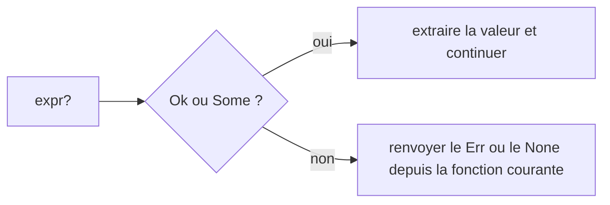

Exemple complet : [`examples/l06_option_result.rs`](https://github.com/spareilleux/learn/blob/main/code/rust-for-csharp-java/examples/l06_option_result.rs) — `cargo run --example l06_option_result`.

## Deux choses que Rust n'a pas

Rust n'a **pas de `null`** et **pas d'exceptions**. Les deux sont remplacés par deux enums de la bibliothèque standard — construites exactement comme celles de la [leçon 5](../05-structs-enums-match/) ([`core/src/option.rs`](https://github.com/rust-lang/rust/blob/1.94.0/library/core/src/option.rs#L600-L609), [`core/src/result.rs`](https://github.com/rust-lang/rust/blob/1.94.0/library/core/src/result.rs#L557-L567)) :

```rust
enum Option<T> {
    Some(T),
    None,
}

enum Result<T, E> {
    Ok(T),
    Err(E),
}
```

| Situation | C# | Java | Rust |
|---|---|---|---|
| Une valeur peut être absente | `null`, [`int?`](https://learn.microsoft.com/dotnet/csharp/language-reference/builtin-types/nullable-value-types), [types référence nullables](https://learn.microsoft.com/dotnet/csharp/fundamentals/null-safety/nullable-reference-types) (avertissements) | `null`, [`Optional<T>`](https://docs.oracle.com/en/java/javase/25/docs/api/java.base/java/util/Optional.html) | `Option<T>` |
| Une opération peut échouer | [exceptions](https://learn.microsoft.com/dotnet/csharp/fundamentals/exceptions/) (non vérifiées) | [exceptions vérifiées et non vérifiées](https://docs.oracle.com/javase/tutorial/essential/exceptions/runtime.html) | `Result<T, E>` |
| Un bug, irrécupérable | [`Environment.FailFast`](https://learn.microsoft.com/dotnet/api/system.environment.failfast), exception non gérée | [`Error`](https://docs.oracle.com/en/java/javase/25/docs/api/java.base/java/lang/Error.html), exception non gérée | [`panic!`](https://doc.rust-lang.org/std/macro.panic.html) |

Comme l'absence et l'échec font partie du **type**, vous ne pouvez pas les oublier.

## `Option<T>`

Extrait de [`examples/l06_option_result.rs`, lignes 11-13](https://github.com/spareilleux/learn/blob/93f6f82/code/rust-for-csharp-java/examples/l06_option_result.rs#L11-L13), [88-91](https://github.com/spareilleux/learn/blob/93f6f82/code/rust-for-csharp-java/examples/l06_option_result.rs#L88-L91) :

```rust
fn find_user(users: &HashMap<u32, User>, id: u32) -> Option<&User> {
    users.get(&id)
}

match find_user(&users, 3) {
    Some(user) => println!("found {}", user.name),
    None => println!("no user 3"),
}
```

Un `Option<i32>` n'est pas un `i32`, donc vous ne pouvez pas l'utiliser par accident ([`src/lib.rs`, lignes 266-267](https://github.com/spareilleux/learn/blob/93f6f82/code/rust-for-csharp-java/src/lib.rs#L266-L267)) :

```rust
let maybe: Option<i32> = Some(1);
let total = maybe + 1;
```

```text
error[E0369]: cannot add `{integer}` to `Option<i32>`
   --> e06_option_add.rs:3:23
    |
  3 |     let total = maybe + 1;
    |                 ----- ^ - {integer}
    |                 |
    |                 Option<i32>
```

En C#, la [`NullReferenceException`](https://learn.microsoft.com/dotnet/api/system.nullreferenceexception) équivalente se produirait à l'exécution.

### Combinateurs

Au lieu de `if (x != null)` imbriqués, enchaînez des méthodes — elles se lisent comme [`?.`](https://learn.microsoft.com/dotnet/csharp/language-reference/operators/member-access-operators#null-conditional-operators--and-) et [`??`](https://learn.microsoft.com/dotnet/csharp/language-reference/operators/null-coalescing-operator) ([ligne 85](https://github.com/spareilleux/learn/blob/93f6f82/code/rust-for-csharp-java/examples/l06_option_result.rs#L85)) :

```rust
let name_len = find_user(&users, 2).map(|u| u.name.len()).unwrap_or(0);
```

| Rust | C# | Java `Optional` |
|---|---|---|
| `opt.map(f)` | `x?.F()` | `opt.map(f)` |
| `opt.unwrap_or(v)` | `x ?? v` | `opt.orElse(v)` |
| `opt.unwrap_or_else(f)` | `x ?? F()` | `opt.orElseGet(f)` |
| `opt.and_then(f)` | `x?.F()` où `F` renvoie une valeur nullable | `opt.flatMap(f)` |
| `opt.ok_or(err)` | `x ?? throw …` | `opt.orElseThrow(…)` |
| `opt.is_some()` / `is_none()` | `x != null` | `opt.isPresent()` |

## `Result<T, E>`

Une fonction qui peut échouer le dit dans sa signature — un peu comme une exception vérifiée en Java, mais sous forme de valeur de retour ([lignes 23-29](https://github.com/spareilleux/learn/blob/93f6f82/code/rust-for-csharp-java/examples/l06_option_result.rs#L23-L29), [93-94](https://github.com/spareilleux/learn/blob/93f6f82/code/rust-for-csharp-java/examples/l06_option_result.rs#L93-L94)) :

```rust
fn sum_csv(line: &str) -> Result<i32, ParseIntError> {
    let mut total = 0;
    for field in line.split(',') {
        total += field.trim().parse::<i32>()?;
    }
    Ok(total)
}

println!("{:?}", sum_csv("1, 2, 3"));     // Ok(6)
println!("{:?}", sum_csv("1, two, 3"));   // Err(ParseIntError { kind: InvalidDigit })
```

Ignorer un `Result` provoque un avertissement, car cela peut masquer une erreur :

```text
warning: unused `Result` that must be used
 --> e06_unused_result.rs:6:5
  |
6 |     save();
  |     ^^^^^^
  |
  = note: this `Result` may be an `Err` variant, which should be handled
```

## L'opérateur `?`

`?` signifie : *si c'est `Ok`/`Some`, extraire la valeur ; sinon, renvoyer immédiatement le `Err`/`None` depuis la fonction courante.* C'est l'équivalent explicite et visible de la propagation d'une exception.

Les deux chemins qu'une valeur peut prendre à travers l'opérateur point d'interrogation.



Extrait de [`examples/l06_option_result.rs`, lignes 16-20](https://github.com/spareilleux/learn/blob/93f6f82/code/rust-for-csharp-java/examples/l06_option_result.rs#L16-L20) :

```rust
fn manager_name(users: &HashMap<u32, User>, id: u32) -> Option<&str> {
    let user = find_user(users, id)?;                  // utilisateur inexistant → None
    let manager = find_user(users, user.manager_id?)?; // pas de manager → None
    Some(&manager.name)
}
```

```text
manager of 2: Some("Grace")
manager of 1: None
manager of 9: None
```

`?` ne fonctionne que dans une fonction qui renvoie elle-même un `Result` ou un `Option` :

```text
error[E0277]: the `?` operator can only be used in a function that returns `Result` or `Option` (or another type that implements `FromResidual`)
 --> e06_question_in_main.rs:2:35
  |
1 | fn main() {
  | --------- this function should return `Result` or `Option` to accept `?`
2 |     let port: u16 = "3000".parse()?;
  |                                   ^ cannot use the `?` operator in a function that returns `()`
  |
help: consider adding return type
  |
1 ~ fn main() -> Result<(), Box<dyn std::error::Error>> {
2 |     let port: u16 = "3000".parse()?;
3 |     println!("{port}");
4 +     Ok(())
  |
```

## Vos propres types d'erreur

Une erreur peut être de n'importe quel type ; une `enum` énumère les façons dont une opération peut échouer ([lignes 32-60](https://github.com/spareilleux/learn/blob/93f6f82/code/rust-for-csharp-java/examples/l06_option_result.rs#L32-L60)) :

```rust
#[derive(Debug)]
enum ConfigError {
    Missing(&'static str),
    BadNumber { key: &'static str, source: ParseIntError },
}

impl fmt::Display for ConfigError {
    fn fmt(&self, f: &mut fmt::Formatter) -> fmt::Result {
        match self {
            ConfigError::Missing(key) => write!(f, "missing key `{key}`"),
            ConfigError::BadNumber { key, source } => write!(f, "`{key}` is not a number: {source}"),
        }
    }
}

impl Error for ConfigError {}

fn read_port(config: &HashMap<&str, &str>) -> Result<u16, ConfigError> {
    let raw = config.get("port").ok_or(ConfigError::Missing("port"))?;
    raw.parse::<u16>().map_err(|source| ConfigError::BadNumber { key: "port", source })
}
```

```text
Err("missing key `port`")
Err("`port` is not a number: invalid digit found in string")
Ok(3000)
```

- [`ok_or`](https://doc.rust-lang.org/std/option/enum.Option.html#method.ok_or) transforme un `Option` en `Result` ; [`map_err`](https://doc.rust-lang.org/std/result/enum.Result.html#method.map_err) convertit un type d'erreur en un autre — comme attraper une exception pour l'envelopper.
- [`Display`](https://doc.rust-lang.org/std/fmt/trait.Display.html) est le message destiné aux utilisateurs, [`Debug`](https://doc.rust-lang.org/std/fmt/trait.Debug.html) les détails destinés aux développeurs.
- Dans les vrais projets, la crate [`thiserror`](https://crates.io/crates/thiserror) génère ce code répétitif pour les bibliothèques, et [`anyhow`](https://crates.io/crates/anyhow) offre un type d'erreur fourre-tout pour les applications.

### `main` peut renvoyer un `Result`

Extrait de [`examples/l06_option_result.rs`, lignes 63](https://github.com/spareilleux/learn/blob/93f6f82/code/rust-for-csharp-java/examples/l06_option_result.rs#L63), [108-111](https://github.com/spareilleux/learn/blob/93f6f82/code/rust-for-csharp-java/examples/l06_option_result.rs#L108-L111) :

```rust
fn main() -> Result<(), Box<dyn Error>> {
    let port = read_port(&config)?;   // ConfigError se convertit en Box<dyn Error>
    println!("listening on {port}");
    Ok(())
}
```

[`Box<dyn Error>`](https://doc.rust-lang.org/std/error/trait.Error.html) accepte n'importe quel type d'erreur, donc `?` fonctionne avec des erreurs différentes dans la même fonction. Si `main` renvoie `Err`, Rust l'affiche avec son format **`Debug`** et se termine avec le code 1 :

```text
Error: Missing("port")
```

## Quand paniquer

[`unwrap()`](https://doc.rust-lang.org/std/result/enum.Result.html#method.unwrap) et [`expect("…")`](https://doc.rust-lang.org/std/result/enum.Result.html#method.expect) extraient la valeur ou **paniquent** :

```rust
let port: u16 = "http".parse().expect("PORT must be a number");
```

```text
thread 'main' panicked at e06_unwrap_panic.rs:2:36:
PORT must be a number: ParseIntError { kind: InvalidDigit }
```

| Utiliser | Pour |
|---|---|
| `Result` + `?` | tout ce qui peut échouer en fonctionnement normal : E/S, analyse d'entrées utilisateur, réseau |
| `expect("why this cannot fail")` | les invariants que vous avez vérifiés, les tests, les prototypes rapides |
| `unwrap()` | les tests et les exemples ; en code de production, préférez `expect` avec une raison |

Une panique n'est pas un mécanisme de `try/catch` : traitez-la comme un rapport de bug.

## À retenir

- `Option<T>` remplace `null` ; `Result<T, E>` remplace les exceptions ; les deux sont des enums ordinaires.
- Le compilateur refuse d'utiliser un `Option<T>` comme un `T`, et avertit quand un `Result` est ignoré.
- `?` propage `None`/`Err` à l'appelant — explicite, mais aussi concis qu'une exception.
- Modélisez les erreurs avec des enums, convertissez-les avec `map_err`/[`From`](https://doc.rust-lang.org/std/convert/trait.From.html), et réservez `panic!` aux bugs.

## Exercices

1. Traduisez cette méthode C# et son point d'appel en Rust, en utilisant `Option` et `unwrap_or` :

```csharp
int? FindAge(Dictionary<string, int> ages, string name) =>
    ages.TryGetValue(name, out var age) ? age : null;

var age = FindAge(ages, "Ada") ?? -1;
```

<details>
<summary>Solution</summary>

Extrait de [`src/lib.rs`, lignes 281-287](https://github.com/spareilleux/learn/blob/93f6f82/code/rust-for-csharp-java/src/lib.rs#L281-L287) :

```rust
use std::collections::HashMap;

fn find_age(ages: &HashMap<&str, u32>, name: &str) -> Option<u32> {
    ages.get(name).copied()
}

let ages = HashMap::from([("Ada", 36)]);
let age = find_age(&ages, "Ada").map(i64::from).unwrap_or(-1);
assert_eq!(age, 36);
assert_eq!(find_age(&ages, "Bob"), None);
```

`get` renvoie `Option<&u32>` ; `.copied()` le transforme en `Option<u32>`. Renvoyer `-1` comme valeur sentinelle exige un type signé — en Rust, on conserverait généralement l'`Option`.

</details>

2. Écrivez `fn parse_point(text: &str) -> Result<(i32, i32), String>` de sorte que `"3,4"` donne `Ok((3, 4))`, `"3"` donne `Err("expected x,y")`, et `"3,z"` donne une erreur qui mentionne l'échec de l'analyse. Utilisez `?`.

<details>
<summary>Solution</summary>

Extrait de [`src/lib.rs`, lignes 293-301](https://github.com/spareilleux/learn/blob/93f6f82/code/rust-for-csharp-java/src/lib.rs#L293-L301) :

```rust
fn parse_point(text: &str) -> Result<(i32, i32), String> {
    let (x, y) = text.split_once(',').ok_or("expected x,y")?;
    let x = x.trim().parse::<i32>().map_err(|e| format!("bad x: {e}"))?;
    let y = y.trim().parse::<i32>().map_err(|e| format!("bad y: {e}"))?;
    Ok((x, y))
}

assert_eq!(parse_point("3,4"), Ok((3, 4)));
assert_eq!(parse_point("3"), Err(String::from("expected x,y")));
assert_eq!(parse_point("3,z"), Err(String::from("bad y: invalid digit found in string")));
```

`?` convertit aussi le `&str` issu de `ok_or` en `String`, car `String` implémente `From<&str>`.

</details>

3. `let port: u16 = "3000".parse()?;` ne compile pas dans `fn main()`. Donnez deux corrections.

<details>
<summary>Solution</summary>

- Changer la signature en `fn main() -> Result<(), Box<dyn std::error::Error>>` et terminer par `Ok(())`, afin que `?` ait un endroit où renvoyer l'erreur.
- Ou gérer l'erreur localement, par exemple `let port: u16 = "3000".parse().expect("PORT must be a number");` ou un `match`.

</details>

## Sources

- [The Book, ch. 9 — Error Handling](https://doc.rust-lang.org/book/ch09-00-error-handling.html)
- [`Option` — bibliothèque standard](https://doc.rust-lang.org/std/option/enum.Option.html)
- [`Result` — bibliothèque standard](https://doc.rust-lang.org/std/result/enum.Result.html)
- [L'opérateur `?` — Rust Reference](https://doc.rust-lang.org/reference/expressions/operator-expr.html#the-try-propagation-expression)
