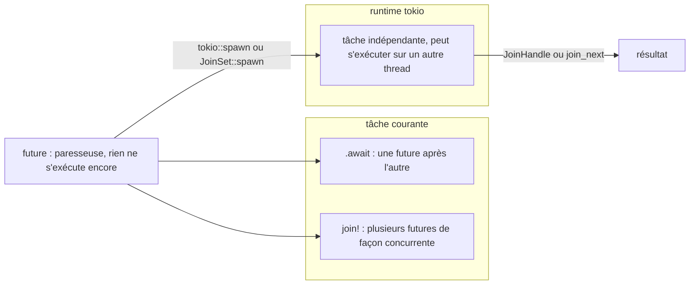

Exemple complet : [`examples/l13_async.rs`](https://github.com/spareilleux/learn/blob/main/code/rust-for-csharp-java/examples/l13_async.rs) — `cargo run --example l13_async`.

## Mêmes mots-clés, mécanique différente

La syntaxe vous semblera familière ([lignes 8-11](https://github.com/spareilleux/learn/blob/93f6f82/code/rust-for-csharp-java/examples/l13_async.rs#L8-L11)) :

```rust
async fn fetch_price(item: &str, delay_ms: u64) -> u32 {
    sleep(Duration::from_millis(delay_ms)).await;   // E/S simulées
    item.len() as u32 * 10
}
```

Notez que `.await` est un mot-clé **postfixé** : `fetch(url).await?.json().await?` s'enchaîne de gauche à droite, là où C# demande `await (await fetch(url)).Json()`.

Trois choses diffèrent fondamentalement de C# :

| | [`Task`](https://learn.microsoft.com/dotnet/api/system.threading.tasks.task) en C# / [`CompletableFuture`](https://docs.oracle.com/en/java/javase/25/docs/api/java.base/java/util/concurrent/CompletableFuture.html) en Java | [`Future`](https://doc.rust-lang.org/std/future/trait.Future.html) en Rust |
|---|---|---|
| Démarrage | immédiat, dès la création (« chaude ») | seulement quand on l'attend avec `.await` ou qu'on la lance (« paresseuse ») |
| Runtime | intégré (pool de threads, [`SynchronizationContext`](https://learn.microsoft.com/dotnet/api/system.threading.synchronizationcontext)) | aucun dans la bibliothèque standard — vous choisissez une crate, généralement **tokio** |
| Coût | généralement un objet alloué sur le tas par tâche | une machine à états générée par le compilateur ; aucune allocation, sauf si elle est lancée ou mise dans une `Box` |

## Les futures sont paresseuses

Une `async fn` renvoie une **future** : une valeur qui décrit un travail pas encore commencé.

Extrait de [`examples/l13_async.rs`, lignes 28-34](https://github.com/spareilleux/learn/blob/93f6f82/code/rust-for-csharp-java/examples/l13_async.rs#L28-L34) :

```rust
let future = async {
    println!("  future body runs");
    1
};
println!("future created");
let one = future.await;
println!("awaited: {one}");
```

```text
future created
  future body runs
awaited: 1
```

En C#, oublier `await` exécute quand même la tâche (fire-and-forget, « lancer et oublier »). En Rust, une future qui n'est jamais attendue **ne s'exécute jamais**. Le compilateur vous prévient :

```rust
async fn log_call(name: &str) {
    println!("called {name}");
}

#[tokio::main]
async fn main() {
    log_call("save");         // .await manquant
    println!("done");
}
```

```text
warning: unused implementer of `Future` that must be used
 --> examples\w13_not_awaited.rs:7:5
  |
7 |     log_call("save");
  |     ^^^^^^^^^^^^^^^^
  |
  = note: futures do nothing unless you `.await` or poll them
  = note: `#[warn(unused_must_use)]` (part of `#[warn(unused)]`) on by default
```

Le programme affiche `done` et rien d'autre. Quand vous utilisez le résultat, un `.await` oublié devient une erreur de type : la future n'est pas la valeur.

```text
error[E0308]: mismatched types
 --> examples\e13_missing_await.rs:6:22
  |
6 |     let price: u32 = fetch_price();
  |                ---   ^^^^^^^^^^^^^ expected `u32`, found future
  |                |
  |                expected due to this
  |
note: calling an async function returns a future
 --> examples\e13_missing_await.rs:6:22
  |
6 |     let price: u32 = fetch_price();
  |                      ^^^^^^^^^^^^^
help: consider `await`ing on the `Future`
  |
6 |     let price: u32 = fetch_price().await;
  |                                   ++++++
```

## Un runtime : tokio

Il faut bien que quelque chose interroge (poll) les futures, les réveille quand les E/S sont prêtes et les répartisse sur des threads. La bibliothèque standard ne fournit pas cette pièce, donc `main` ne peut pas simplement être `async` :

```text
error[E0752]: `main` function is not allowed to be `async`
 --> examples\e13_async_main.rs:1:1
  |
1 | async fn main() {
  | ^^^^^^^^^^^^^^^ `main` function is not allowed to be `async`
```

[tokio](https://tokio.rs) est le runtime standard de fait ([axum](https://docs.rs/axum), [reqwest](https://docs.rs/reqwest), [tonic](https://docs.rs/tonic) et l'essentiel de l'écosystème async reposent dessus) :

```toml
[dependencies]
tokio = { version = "1", features = ["rt-multi-thread", "macros", "time", "sync"] }
```

Extrait de [`examples/l13_async.rs`, lignes 25-31](https://github.com/spareilleux/learn/blob/93f6f82/code/rust-for-csharp-java/examples/l13_async.rs#L25-L31) :

```rust
#[tokio::main]              // construit un runtime multi-thread et y exécute main
async fn main() {
    // …
}
```

`.await` n'est par ailleurs autorisé que dans du code `async` ([`E0728`](https://doc.rust-lang.org/error_codes/E0728.html)). La passerelle depuis le code synchrone est le [`block_on`](https://docs.rs/tokio/latest/tokio/runtime/struct.Runtime.html#method.block_on) du runtime, que [`#[tokio::main]`](https://docs.rs/tokio/latest/tokio/attr.main.html) appelle pour vous.

## Concurrence : `join!`, `spawn`, `JoinSet`

Attendre une future après l'autre est **séquentiel** ([lignes 38-48](https://github.com/spareilleux/learn/blob/93f6f82/code/rust-for-csharp-java/examples/l13_async.rs#L38-L48)) :

```rust
let a = fetch_price("book", 100).await;
let b = fetch_price("pen", 100).await;
let c = fetch_price("lamp", 100).await;

let (a, b, c) = tokio::join!(fetch_price("book", 100), fetch_price("pen", 100), fetch_price("lamp", 100));
```

```text
sequential: 110 in ~300 ms
join!:      110 in ~100 ms
```

C'est ici que la paresse se voit : en C#, `var t1 = FetchAsync(); var t2 = FetchAsync(); await t1; await t2;` est déjà concurrent, parce que les deux tâches ont démarré à leur création. En Rust, le code équivalent s'exécute l'un après l'autre ; la concurrence se demande explicitement.

| C# | Java | tokio |
|---|---|---|
| [`await Task.WhenAll(a, b)`](https://learn.microsoft.com/dotnet/api/system.threading.tasks.task.whenall) | `CompletableFuture.allOf(a, b)` | [`tokio::join!(a, b)`](https://docs.rs/tokio/latest/tokio/macro.join.html) |
| [`Task.Run(…)`](https://learn.microsoft.com/dotnet/api/system.threading.tasks.task.run) | `CompletableFuture.supplyAsync(…)` | [`tokio::spawn(async { … })`](https://docs.rs/tokio/latest/tokio/task/fn.spawn.html) |
| [`Task.WhenAny`](https://learn.microsoft.com/dotnet/api/system.threading.tasks.task.whenany) dans une boucle | [`ExecutorCompletionService`](https://docs.oracle.com/en/java/javase/25/docs/api/java.base/java/util/concurrent/ExecutorCompletionService.html) | [`JoinSet::join_next()`](https://docs.rs/tokio/latest/tokio/task/struct.JoinSet.html#method.join_next) |
| `await Task.WhenAny(a, b)` | `CompletableFuture.anyOf(a, b)` | [`tokio::select!`](https://docs.rs/tokio/latest/tokio/macro.select.html) |
| [`Task.Delay`](https://learn.microsoft.com/dotnet/api/system.threading.tasks.task.delay) | `CompletableFuture.delayedExecutor` | [`tokio::time::sleep`](https://docs.rs/tokio/latest/tokio/time/fn.sleep.html) |
| [`Channel<T>`](https://learn.microsoft.com/dotnet/api/system.threading.channels.channel-1) | [`BlockingQueue`](https://docs.oracle.com/en/java/javase/25/docs/api/java.base/java/util/concurrent/BlockingQueue.html) | [`tokio::sync::mpsc`](https://docs.rs/tokio/latest/tokio/sync/mpsc/index.html) |
| [`SemaphoreSlim.WaitAsync`](https://learn.microsoft.com/dotnet/api/system.threading.semaphoreslim.waitasync) | [`Semaphore`](https://docs.oracle.com/en/java/javase/25/docs/api/java.base/java/util/concurrent/Semaphore.html) | [`tokio::sync::Semaphore`](https://docs.rs/tokio/latest/tokio/sync/struct.Semaphore.html) |

`join!` exécute ses futures de façon concurrente **à l'intérieur de la tâche courante**. `tokio::spawn` confie une future au runtime sous forme de **tâche** indépendante, qui peut s'exécuter sur un autre thread, et renvoie un [`JoinHandle`](https://docs.rs/tokio/latest/tokio/task/struct.JoinHandle.html) ([lignes 52-53](https://github.com/spareilleux/learn/blob/93f6f82/code/rust-for-csharp-java/examples/l13_async.rs#L52-L53)) :

```rust
let handle = tokio::spawn(async { fetch_price("keyboard", 50).await });
println!("spawned task returned {}", handle.await.unwrap());   // 80
```

`JoinSet` rassemble les résultats dans l'ordre où ils se terminent ([lignes 56-63](https://github.com/spareilleux/learn/blob/93f6f82/code/rust-for-csharp-java/examples/l13_async.rs#L56-L63)) :

```rust
let mut set = JoinSet::new();
for (item, delay) in [("slow", 150), ("fast", 50), ("medium", 100)] {
    set.spawn(async move { (item, fetch_price(item, delay).await) });
}
while let Some(result) = set.join_next().await {
    let (item, price) = result.unwrap();
    println!("  finished {item}: {price}");
}
```

```text
  finished fast: 40
  finished medium: 60
  finished slow: 40
```

Les façons d'exécuter une future, côte à côte : l'attendre, la joindre à d'autres dans la tâche courante, ou la lancer comme une tâche à part entière.



## Annuler, c'est détruire

C# fait passer un [`CancellationToken`](https://learn.microsoft.com/dotnet/api/system.threading.cancellationtoken) à travers chaque appel. En Rust, une future **détruite** (dropped) s'arrête simplement à son `.await` en cours et ne reprend jamais. [`timeout`](https://docs.rs/tokio/latest/tokio/time/fn.timeout.html) et `select!` s'appuient là-dessus ([lignes 66-73](https://github.com/spareilleux/learn/blob/93f6f82/code/rust-for-csharp-java/examples/l13_async.rs#L66-L73)) :

```rust
match timeout(Duration::from_millis(50), fetch_price("late", 200)).await {
    Ok(price) => println!("got {price}"),
    Err(_) => println!("timed out after 50 ms"),
}

tokio::select! {
    price = fetch_price("tortoise", 200) => println!("tortoise won: {price}"),
    price = fetch_price("hare", 20) => println!("hare won: {price}"),
}
```

```text
timed out after 50 ms
hare won: 40
```

La future de la tortue est détruite dès que le lièvre gagne. Les destructeurs s'exécutent, donc les ressources sont libérées. Le piège, c'est la *cancellation safety* (sûreté vis-à-vis de l'annulation) : si une future est détruite à mi-chemin, par exemple pendant la lecture d'un message, ce travail partiel est perdu. La documentation de tokio comporte une section *cancel safety* pour les méthodes où cela compte.

Une tâche lancée continue de s'exécuter après la destruction de son `JoinHandle` ; arrêtez-la avec [`handle.abort()`](https://docs.rs/tokio/latest/tokio/task/struct.JoinHandle.html#method.abort).

## `Send` à travers `.await`

Le runtime multi-thread peut déplacer une tâche vers un autre thread à chaque `.await`. `tokio::spawn` exige donc que la future soit `Send` — et une future contient toutes les variables locales qui vivent au-delà d'un `.await`. Le problème de `Rc` de la leçon 12 revient ([`src/lib.rs`, lignes 1036-1040](https://github.com/spareilleux/learn/blob/93f6f82/code/rust-for-csharp-java/src/lib.rs#L1036-L1040)) :

```rust
let handle = tokio::spawn(async {
    let counter = Rc::new(0);
    sleep(Duration::from_millis(10)).await;
    println!("{counter}");
});
```

```text
error: future cannot be sent between threads safely
   --> examples\e13_not_send.rs:6:18
    |
  6 |       let handle = tokio::spawn(async {
    |  __________________^
  7 | |         let counter = Rc::new(0);
  8 | |         sleep(Duration::from_millis(10)).await;
  9 | |         println!("{counter}");
 10 | |     });
    | |______^ future created by async block is not `Send`
    |
    = help: within `{async block@examples\e13_not_send.rs:6:31: 6:36}`, the trait `Send` is not implemented for `Rc<i32>`
note: future is not `Send` as this value is used across an await
   --> examples\e13_not_send.rs:8:42
    |
  7 |         let counter = Rc::new(0);
    |             ------- has type `Rc<i32>` which is not `Send`
  8 |         sleep(Duration::from_millis(10)).await;
    |                                          ^^^^^ await occurs here, with `counter` maybe used later
```

Cette erreur n'a pas de code `E` : elle vient de la contrainte `F: Future + Send + 'static` de `tokio::spawn`. La correction consiste à utiliser `Arc`, ou à s'assurer que la valeur est détruite avant le `.await`.

Il en va de même pour un [`std::sync::MutexGuard`](https://doc.rust-lang.org/std/sync/struct.MutexGuard.html) (exercice 3). Quand un verrou doit être conservé **pendant** un `.await`, utilisez [`tokio::sync::Mutex`](https://docs.rs/tokio/latest/tokio/sync/struct.Mutex.html), dont le `lock()` est lui-même asynchrone :

```rust
let cache = Arc::new(tokio::sync::Mutex::new(Vec::new()));
// dans chaque tâche :
let mut guard = cache.lock().await;
let price = fetch_price(item, 10).await;     // la garde est conservée pendant cet await
guard.push(price);
```

Pour des sections critiques courtes sans `.await` à l'intérieur, le `Mutex` standard est plus rapide et convient très bien.

## Ne bloquez pas le runtime

Un thread de travail async exécute de nombreuses tâches et passe de l'une à l'autre à chaque `.await`. Du code qui bloque sans attendre — [`std::thread::sleep`](https://doc.rust-lang.org/std/thread/fn.sleep.html), des E/S fichier ou réseau synchrones, un long calcul — gèle toutes les tâches de ce thread. L'équivalent C# est d'appeler [`.Result`](https://learn.microsoft.com/dotnet/api/system.threading.tasks.task-1.result) ou de faire du travail CPU sur un thread d'interface ou ASP.NET.

Extrait de [`examples/l13_async.rs`, lignes 109-111](https://github.com/spareilleux/learn/blob/93f6f82/code/rust-for-csharp-java/examples/l13_async.rs#L109-L111) :

```rust
let primes = tokio::task::spawn_blocking(|| (1..100_000u64).filter(|&n| is_prime(n)).count())
    .await
    .unwrap();
// primes below 100000: 9592
```

[`spawn_blocking`](https://docs.rs/tokio/latest/tokio/task/fn.spawn_blocking.html) exécute une closure sur un pool séparé, réservé au travail bloquant. Pour le calcul parallèle sur des données, rayon (leçon 12) reste le meilleur outil.

:::note[Java a pris l'autre route]
Les [*threads virtuels*](https://docs.oracle.com/en/java/javase/25/core/virtual-threads.html) de Java 21 permettent d'écrire du code bloquant ordinaire pendant que la JVM multiplexe des threads légers en dessous — sans aucun mot-clé `async`. Rust et C# ont choisi à la place un `async`/`await` explicite : plus de syntaxe, mais pas de runtime caché et, dans le cas de Rust, des futures qui ne coûtent aucune allocation.
:::

## À retenir

- Les futures Rust sont paresseuses : rien ne s'exécute tant que vous ne les attendez pas avec `.await` ou ne les lancez pas ; un `.await` oublié donne un avertissement ou une erreur de type.
- Le runtime est une bibliothèque : `#[tokio::main]`, `tokio::spawn`, `tokio::time`, `tokio::sync`.
- La concurrence est explicite : `join!` et `JoinSet` pour « toutes », `select!` et `timeout` pour « la première ».
- Annuler, c'est détruire la future ; pensez à ce qu'une future à moitié terminée laisse derrière elle.
- Les futures lancées doivent être `Send` : pas de `Rc` ni de `std::sync::MutexGuard` au-delà d'un `.await`.
- Ne bloquez jamais un thread async ; utilisez `spawn_blocking` ou rayon pour le travail CPU.

## Exercices

1. Écrivez `async fn fetch_all(items: &[(&str, u64)]) -> Vec<u32>` qui récupère tous les prix de façon concurrente (chaque article avec son propre délai) et renvoie les prix **dans l'ordre d'entrée**. Avec des délais de 150, 10 et 80 ms, combien de temps cela devrait-il prendre ?

<details>
<summary>Solution</summary>

Extrait de [`src/lib.rs`, lignes 1050-1068](https://github.com/spareilleux/learn/blob/93f6f82/code/rust-for-csharp-java/src/lib.rs#L1050-L1068) :

```rust
async fn fetch_price(item: String, delay_ms: u64) -> u32 {
    sleep(Duration::from_millis(delay_ms)).await;
    item.len() as u32 * 10
}

async fn fetch_all(items: &[(&str, u64)]) -> Vec<u32> {
    let handles: Vec<_> = items
        .iter()
        .map(|&(item, delay)| tokio::spawn(fetch_price(item.to_string(), delay)))
        .collect();
    let mut prices = Vec::with_capacity(handles.len());
    for handle in handles {
        prices.push(handle.await.unwrap());
    }
    prices
}

let prices = fetch_all(&[("slow", 150), ("fast", 10), ("medium", 80)]).await;
assert_eq!(prices, [40, 40, 60]);   // ~150 ms, pas 240 ms
```

Toutes les tâches démarrent dès qu'elles sont lancées, donc le total correspond au délai le plus long, environ 150 ms. Attendre les handles dans l'ordre préserve l'ordre d'entrée ; un `JoinSet` donnerait plutôt l'ordre de fin. `fetch_price` prend une `String` parce qu'une tâche lancée doit être `'static` et ne peut pas emprunter `items`.

</details>

2. Écrivez `async fn fetch_with_retry(delays: &[u64], per_try: Duration) -> Result<u32, String>` : la tentative `i` appelle une récupération qui prend `delays[i]` ms, abandonne cette tentative au bout de `per_try` et passe à la suivante. Renvoyez le premier succès, ou une erreur après la dernière tentative.

<details>
<summary>Solution</summary>

Extrait de [`src/lib.rs`, lignes 1077-1094](https://github.com/spareilleux/learn/blob/93f6f82/code/rust-for-csharp-java/src/lib.rs#L1077-L1094) :

```rust
async fn fetch_price(delay_ms: u64) -> u32 {
    sleep(Duration::from_millis(delay_ms)).await;
    42
}

async fn fetch_with_retry(delays: &[u64], per_try: Duration) -> Result<u32, String> {
    for (attempt, &delay) in delays.iter().enumerate() {
        match timeout(per_try, fetch_price(delay)).await {
            Ok(price) => return Ok(price),
            Err(_) => println!("attempt {} timed out", attempt + 1),
        }
    }
    Err(format!("gave up after {} attempts", delays.len()))
}

let per_try = Duration::from_millis(50);
assert_eq!(fetch_with_retry(&[5_000, 5_000, 10], per_try).await, Ok(42));
assert_eq!(fetch_with_retry(&[5_000, 5_000], per_try).await, Err("gave up after 2 attempts".to_string()));
```

Chaque tentative expirée est détruite, si bien que les `sleep` de 5 secondes ne se terminent jamais et ne coûtent plus rien ensuite. Aucun jeton à faire passer à travers `fetch_price`.

</details>

3. Ce code ne compile pas. Lisez l'erreur, puis corrigez-le de deux façons différentes.

```rust
let hits = Arc::new(std::sync::Mutex::new(0));
let h = Arc::clone(&hits);
tokio::spawn(async move {
    let mut guard = h.lock().unwrap();
    sleep(Duration::from_millis(10)).await;
    *guard += 1;
})
.await
.unwrap();
```

```text
error: future cannot be sent between threads safely
   --> examples\e13_guard_await.rs:8:5
    |
  8 | /     tokio::spawn(async move {
  9 | |         let mut guard = h.lock().unwrap();
 10 | |         sleep(Duration::from_millis(10)).await;
 11 | |         *guard += 1;
 12 | |     })
    | |______^ future created by async block is not `Send`
    |
    = help: within `{async block@examples\e13_guard_await.rs:8:18: 8:28}`, the trait `Send` is not implemented for `std::sync::MutexGuard<'_, i32>`
note: future is not `Send` as this value is used across an await
   --> examples\e13_guard_await.rs:10:42
    |
  9 |         let mut guard = h.lock().unwrap();
    |             --------- has type `std::sync::MutexGuard<'_, i32>` which is not `Send`
 10 |         sleep(Duration::from_millis(10)).await;
    |                                          ^^^^^ await occurs here, with `mut guard` maybe used later
```

<details>
<summary>Solution</summary>

**Correction 1** — ne gardez pas la garde au-delà du `.await`. Ne verrouillez que pour la mise à jour ([`src/lib.rs`, lignes 1126-1129](https://github.com/spareilleux/learn/blob/93f6f82/code/rust-for-csharp-java/src/lib.rs#L1126-L1129)) :

```rust
tokio::spawn(async move {
    sleep(Duration::from_millis(10)).await;
    *h.lock().unwrap() += 1;          // la garde est détruite à la fin de l'instruction
})
```

**Correction 2** — utilisez un mutex asynchrone, dont la garde est `Send` et peut être conservée pendant l'attente :

```rust
let hits = Arc::new(tokio::sync::Mutex::new(0));
let h = Arc::clone(&hits);
tokio::spawn(async move {
    let mut guard = h.lock().await;
    sleep(Duration::from_millis(10)).await;
    *guard += 1;
})
```

Préférez la correction 1 quand la section critique n'a besoin d'aucun `.await` : elle est moins coûteuse, et garder un verrou en attendant des E/S ralentit toutes les autres tâches. Utilisez la correction 2 quand l'opération protégée est elle-même asynchrone.

</details>

## Sources

- [The Book, ch. 17 — Fundamentals of Asynchronous Programming](https://doc.rust-lang.org/book/ch17-00-async-await.html)
- [Asynchronous Programming in Rust](https://rust-lang.github.io/async-book/)
- [Tutoriel Tokio](https://tokio.rs/tokio/tutorial) — lancement de tâches, état partagé, canaux, `select!`
- [`tokio::task::JoinSet`](https://docs.rs/tokio/latest/tokio/task/struct.JoinSet.html) et [`tokio::select!`](https://docs.rs/tokio/latest/tokio/macro.select.html) (sûreté vis-à-vis de l'annulation)
- [`tokio::task::spawn_blocking`](https://docs.rs/tokio/latest/tokio/task/fn.spawn_blocking.html)
