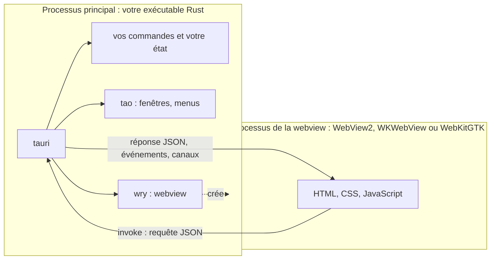

import { Tabs, TabItem } from '@astrojs/starlight/components';
import explorerScreenshot from '../../../../assets/rust-for-csharp-java/l16-chord-explorer.webp';

Exemple complet : [`l16-tauri/`](https://github.com/spareilleux/learn/tree/main/code/rust-for-csharp-java/l16-tauri), un explorateur d'accords de bureau. Les leçons 16 à 21 le construisent ; lancez `npm install` puis `npm run tauri dev` depuis ce dossier.

Les leçons 1 à 15 couvraient le langage. Cette deuxième partie répond à une question que tout développeur C# ou Java finit par se poser : puis-je écrire une application de bureau en Rust, et avec quoi ?

## Ce que vous connaissez déjà

Sur .NET et la JVM, le choix se fait entre des toolkits qui dessinent leurs propres contrôles et des toolkits qui embarquent un moteur de navigateur :

| Toolkit | Interface décrite en | Rendu |
|---|---|---|
| [WinForms](https://learn.microsoft.com/dotnet/desktop/winforms/overview/) | code C#, concepteur | contrôles Win32, Windows uniquement |
| [WPF](https://learn.microsoft.com/dotnet/desktop/wpf/overview/) | XAML + bindings | son propre moteur de rendu DirectX, Windows uniquement |
| [.NET MAUI](https://learn.microsoft.com/dotnet/maui/what-is-maui) | XAML + bindings | les contrôles natifs de la plateforme (WinUI sous Windows) |
| [Avalonia](https://avaloniaui.net/) | `.axaml`, proche de XAML | son propre moteur de rendu, sur tous les OS |
| [Swing](https://docs.oracle.com/javase/tutorial/uiswing/), [JavaFX](https://openjfx.io/) | code Java, FXML | leur propre moteur de rendu, sur tous les OS |
| [Electron](https://www.electronjs.org/docs/latest/) | HTML, CSS, JavaScript | un Chromium livré avec chaque application, plus Node.js |
| [Blazor Hybrid](https://learn.microsoft.com/aspnet/core/blazor/hybrid/) | composants Razor | la webview du système (WebView2 sous Windows) dans une fenêtre MAUI, WPF ou WinForms |

Rust a lui aussi ces deux familles. Ce qui lui manque, c'est le framework officiel : il n'y a pas de WPF de Rust, seulement des projets communautaires, et aucun n'est aussi mûr que WPF ou JavaFX.

## Rendu natif : egui, iced, Slint

Ces crates dessinent elles-mêmes chaque pixel, généralement sur le GPU, dans une fenêtre ouverte par [winit](https://docs.rs/winit) :

| Crate | Modèle | Interface décrite en | Licence | Le plus proche de |
|---|---|---|---|---|
| [egui](https://docs.rs/egui) avec [eframe](https://docs.rs/eframe) | **mode immédiat** : l'interface est redessinée à partir de vos données à chaque image | code Rust | MIT ou Apache-2.0 | [Dear ImGui](https://github.com/ocornut/imgui), les interfaces de débogage des jeux |
| [iced](https://docs.rs/iced) | **architecture Elm** : état, messages, `update`, `view` | code Rust | MIT | Model-View-Update, comme [Elmish](https://elmish.github.io/elmish/) en F# |
| [Slint](https://docs.rs/slint) | balisage déclaratif compilé en Rust | fichiers `.slint` | GPLv3, libre de redevances ou commerciale | XAML, FXML |

Versions sur crates.io le 2026-09-15 : egui et eframe 0.36.2, iced 0.14.0, Slint 1.17.1. egui et iced sont encore en 0.x, et leurs API changent d'une version mineure à l'autre ; Slint est en 1.x depuis avril 2023.

[Dioxus](https://dioxuslabs.com/) ressemble à une quatrième option, avec des composants à la React écrits en Rust. Son moteur de rendu de bureau dépend pourtant de `wry` et `tao` ([`dioxus-desktop` 0.7.10](https://crates.io/crates/dioxus-desktop/0.7.10/dependencies)) : la même webview système que Tauri.

### egui dans IX : `ix-demo`

[IX](https://github.com/GuitarAlchemist/ix) contient une application egui, [`crates/ix-demo`](https://github.com/GuitarAlchemist/ix/tree/a7e5fbce3d4a7a9d15bb9638b3bcba7c08c2941a/crates/ix-demo) (commit `a7e5fbc`, 2026-09-15) : 23 onglets de démos interactives des crates du workspace. Son `main` ouvre une fenêtre ([`main.rs`, lignes 28-40](https://github.com/GuitarAlchemist/ix/blob/a7e5fbce3d4a7a9d15bb9638b3bcba7c08c2941a/crates/ix-demo/src/main.rs#L28-L40)) :

```rust
fn main() -> eframe::Result<()> {
    let options = eframe::NativeOptions {
        viewport: egui::ViewportBuilder::default()
            .with_inner_size([1280.0, 800.0])
            .with_title("ix — ML Algorithm Explorer"),
        ..Default::default()
    };
    eframe::run_native(
        "ix Demo",
        options,
        Box::new(|_cc| Ok(Box::new(IxApp::default()))),
    )
}
```

et chaque démo est une struct dotée d'une méthode `ui` qu'egui appelle à chaque rafraîchissement ([`demos/stats.rs`, lignes 29-37](https://github.com/GuitarAlchemist/ix/blob/a7e5fbce3d4a7a9d15bb9638b3bcba7c08c2941a/crates/ix-demo/src/demos/stats.rs#L29-L37)) :

```rust
impl StatsDemo {
    pub fn ui(&mut self, ui: &mut egui::Ui) {
        ui.heading("Statistics (ix-math)");
        ui.label("Enter comma-separated values:");
        ui.text_edit_singleline(&mut self.data_text);

        if ui.button("Compute").clicked() {
            self.compute();
        }
```

Il n'y a ni XAML, ni binding, ni gestionnaire d'événement. `text_edit_singleline(&mut self.data_text)` dessine la zone de texte *et* écrit dans le champ ce que l'utilisateur a tapé ; `button(…).clicked()` dessine le bouton et renvoie `true` pendant l'image où il a été cliqué. Pour un développeur WPF, c'est comme si `OnRender` reconstruisait toute la fenêtre à partir du view model, sans `INotifyPropertyChanged`.

La lecture des 28 fichiers (7 411 lignes) de `ix-demo` montre l'autre face du mode immédiat :

- Le travail s'exécute **dans** `ui`, sur le thread qui dessine la fenêtre. On compte 58 gestionnaires `clicked()` et pas un seul thread, canal ou `spawn`. Les charges sont petites (un crible jusqu'à 1 000 000, au plus 2 000 époques d'un réseau XOR), donc cela passe inaperçu ; un calcul plus long gèlerait tous les onglets. Tauri règle cela avec des commandes asynchrones (leçon 17) et des canaux (leçon 18).
- L'onglet *Neural Network (ix-nn)* n'appelle pas `ix-nn` : il entraîne son propre réseau avec `ndarray` ([`demos/neural_net.rs`, ligne 77](https://github.com/GuitarAlchemist/ix/blob/a7e5fbce3d4a7a9d15bb9638b3bcba7c08c2941a/crates/ix-demo/src/demos/neural_net.rs#L77) : « demonstrates the concepts in ix-nn »).
- `Cargo.toml` demande `eframe = "0.31"` alors que crates.io en est à 0.36.2, et IX ne commite pas de `Cargo.lock` : chaque build prend la dernière 0.31.x.

Avec Tauri, la même démo serait une commande Rust par bouton, qui renvoie les nombres en JSON, et une page HTML qui dessine le graphique avec une bibliothèque JavaScript. Le code Rust se simplifie, l'interface passe dans un second langage : c'est le compromis.

## Une interface web dans la webview du système : Tauri

[Tauri](https://v2.tauri.app/) reprend l'idée d'Electron sans livrer Chromium ni Node.js. Votre application est un exécutable Rust, le **processus principal** (core process) ; le contenu de la fenêtre est du HTML, du CSS et du JavaScript rendus par la webview **que le système d'exploitation fournit déjà** ([modèle de processus](https://v2.tauri.app/concept/process-model/)) :

| OS | Webview | Moteur |
|---|---|---|
| Windows | [WebView2](https://learn.microsoft.com/microsoft-edge/webview2/) | Chromium (Microsoft Edge) |
| macOS | [WKWebView](https://developer.apple.com/documentation/webkit/wkwebview) | WebKit (Safari) |
| Linux | [WebKitGTK](https://webkitgtk.org/) | WebKit |



- Seul le processus principal peut toucher au système de fichiers, au réseau ou aux autres processus. La page atteint Rust par des **commandes** (`invoke`, leçon 17) et des **événements** (leçon 18), sérialisés en JSON : c'est du passage de messages, pas de la mémoire partagée.
- [`tao`](https://github.com/tauri-apps/tao) (un fork de winit) ouvre les fenêtres, [`wry`](https://github.com/tauri-apps/wry) embarque la webview ; `tauri` ajoute par-dessus l'IPC, la configuration, les permissions et le packaging.
- Trois moteurs, c'est trois navigateurs à tester, comme sur le web : une fonctionnalité CSS qui marche dans WebView2 peut manquer au WebKitGTK d'une distribution Linux plus ancienne.

Ce cours fixe **Tauri 2.11.5** (publié le 2026-07-01), la CLI Tauri **2.11.4** et `create-tauri-app` **4.7.4**. Une première **3.0.0-alpha** est sortie le 2026-09-13 ; parmi ses crates figure un nouveau `tauri-runtime-cef`, un runtime basé sur le Chromium Embedded Framework. C'est une alpha : le cours reste sur la 2.

### La différence de taille, mesurée

Electron livre son runtime avec chaque application. Electron **44.3.0** pour Windows x64, téléchargé avec `npm install electron@44.3.0` le 2026-09-15, est un zip de 158 Mo qui se décompresse en **385 Mo** répartis sur 73 fichiers, `electron.exe` pesant à lui seul 246 Mo — avant la moindre ligne de votre application.

L'explorateur d'accords construit dans ces leçons, en mode release avec `tauri build --no-bundle`, est un unique `chord-explorer.exe` de **4,2 Mo** (4 244 992 octets) sous Windows, HTML compris ; le build a pris 2 min 43 s. Il s'appuie sur le runtime WebView2 installé avec Windows 11 (version 153.0.4234.32 sur ma machine).

Un petit binaire ne veut pas dire une petite empreinte mémoire : WebView2 lance ses propres processus de navigateur. Avec la fenêtre du build release ouverte, mesuré avec PowerShell ([`Get-Process`](https://learn.microsoft.com/powershell/module/microsoft.powershell.management/get-process), octets privés du processus et de ses enfants) :

```text
Name           Type             Sub                          PrivateMB WorkingSetMB
----           ----             ---                          --------- ------------
chord-explorer                                                    5.60        27.10
msedgewebview2 browser                                           40.70       125.00
msedgewebview2 crashpad-handler                                   2.50         9.70
msedgewebview2 gpu-process                                       81.90        67.00
msedgewebview2 renderer                                          25.10        60.10
msedgewebview2 utility          network.mojom.NetworkService     12.70        37.90
msedgewebview2 utility          storage.mojom.StorageService      8.10        18.40

total private MB: 176.6; total working set MB: 345.2; processes: 7
```

Le processus Rust lui-même utilise 5,6 Mo ; les six autres processus sont ceux de WebView2, environ 170 Mo. Les working sets donnent un total plus élevé parce qu'ils comptent plusieurs fois les pages partagées entre processus. Une application Tauri est légère sur le disque, pas gratuite en mémoire : elle fait tourner un moteur de navigateur, comme Electron.

## Prérequis

Tauri a besoin de Rust (leçon 1) et des bibliothèques de développement de la webview de chaque OS ; Node.js n'est nécessaire que pour la version npm de la CLI et pour les frameworks JavaScript ([prérequis](https://v2.tauri.app/start/prerequisites/)).

<Tabs syncKey="os">
<TabItem label="Windows">

- Les **outils de build MSVC**, déjà installés à la leçon 1 ; le guide Tauri demande la charge de travail *Développement Desktop en C++*.
- **WebView2** : inclus dans Windows 11 et dans Windows 10 depuis la version 1803. Pour vérifier sa version :

```powershell
(Get-ItemProperty 'HKLM:\SOFTWARE\WOW6432Node\Microsoft\EdgeUpdate\Clients\{F3017226-FE2A-4295-8BDF-00C3A9A7E4C5}').pv
```

```text
153.0.4234.32
```

- [Node.js](https://nodejs.org/) LTS pour `npm` (ce cours : Node 24.12.0, npm 11.7.0).

</TabItem>
<TabItem label="Linux / WSL">

Sur Debian et Ubuntu, la liste du guide Tauri :

```bash
sudo apt update
sudo apt install libwebkit2gtk-4.1-dev \
  build-essential \
  curl \
  wget \
  file \
  libxdo-dev \
  libssl-dev \
  libayatana-appindicator3-dev \
  librsvg2-dev
```

Les autres distributions ont leurs propres noms de paquets dans le guide. Sous WSL, les applications graphiques Linux ont besoin de [WSLg](https://learn.microsoft.com/windows/wsl/tutorials/gui-apps) (Windows 11) : la fenêtre s'ouvre alors sur le bureau Windows (*à vérifier* : le cours n'a pas encore fait tourner Tauri sous WSL).

</TabItem>
<TabItem label="macOS">

```bash
xcode-select --install   # suffisant pour le bureau ; iOS demande Xcode complet
```

WKWebView fait partie de macOS : rien d'autre à installer. La CI compile et teste l'explorateur ainsi sur des runners macOS ; l'ouverture de sa fenêtre est *à vérifier* sur un Mac.

</TabItem>
</Tabs>

## Créer un projet

[`create-tauri-app`](https://github.com/tauri-apps/create-tauri-app) génère un projet. Les options évitent les questions :

```bash
npx create-tauri-app@4.7.4 hello-tauri --manager npm --template vanilla --identifier dev.learn.hello --yes
```

```text
Template created! To get started run:
  cd hello-tauri
  npm install
  npm run tauri android init

For Desktop development, run:
  npm run tauri dev

For Android development, run:
  npm run tauri android dev
```

La première suggestion est la configuration Android, même sous Windows et pour un projet de bureau ; pour le bureau, passez au deuxième bloc. Le modèle `vanilla` est du HTML, du CSS et du JavaScript simples, sans bundler (la leçon 19 aborde Vite et TypeScript). La structure générée ([structure d'un projet](https://v2.tauri.app/start/project-structure/)) :

```text
hello-tauri/
├── package.json            ← seulement la CLI Tauri, en dépendance de développement
├── src/                    ← le frontend : index.html, main.js, styles.css
└── src-tauri/              ← un package Cargo normal
    ├── Cargo.toml
    ├── build.rs            ← tauri_build::build() : lit la config, embarque les icônes
    ├── tauri.conf.json     ← fenêtre, identifiant, dossier du frontend, sécurité, bundle
    ├── capabilities/
    │   └── default.json    ← ce que la fenêtre peut appeler (leçon 20)
    ├── icons/
    └── src/
        ├── main.rs         ← appelle hello_tauri_lib::run()
        └── lib.rs          ← l'application : commandes et Builder
```

Trois détails surprennent un développeur Rust :

- `Cargo.toml` déclare `edition = "2021"`, pas 2024. Le projet du cours utilise 2024, comme à la leçon 1, et compile de la même façon.
- La bibliothèque s'appelle `hello_tauri_lib` et se compile en `["staticlib", "cdylib", "rlib"]` : sur iOS et Android, l'application est une bibliothèque chargée par la plateforme, donc `main.rs` se contente d'appeler `lib.rs`, où tout se trouve. Le commentaire explique le suffixe `_lib` : une bibliothèque et un binaire du même nom entrent en conflit sous Windows.
- `main.rs` commence par `#![cfg_attr(not(debug_assertions), windows_subsystem = "windows")]` : sans cela, un build release ouvrirait une fenêtre de console à côté de l'application.

`tauri.conf.json` est à Tauri ce que `App.xaml` et le `.csproj` sont à WPF ([référence de configuration](https://v2.tauri.app/reference/config/)) :

```json
{
  "$schema": "https://schema.tauri.app/config/2",
  "productName": "hello-tauri",
  "version": "0.1.0",
  "identifier": "dev.learn.hello",
  "build": {
    "frontendDist": "../src"
  },
  "app": {
    "withGlobalTauri": true,
    "windows": [
      {
        "title": "hello-tauri",
        "width": 800,
        "height": 600
      }
    ],
    "security": {
      "csp": null
    }
  },
  "bundle": {
    "active": true,
    "targets": "all",
    "icon": [
      "icons/32x32.png",
      "icons/128x128.png",
      "icons/128x128@2x.png",
      "icons/icon.icns",
      "icons/icon.ico"
    ]
  }
}
```

- `frontendDist` est le dossier de fichiers statiques embarqués dans l'exécutable ; un framework avec un serveur de développement ajouterait `devUrl`.
- `withGlobalTauri: true` expose l'API JavaScript sous `window.__TAURI__`, pour qu'une page sans bundler puisse appeler `window.__TAURI__.core.invoke`.
- `"csp": null` désactive la Content Security Policy. Le projet du cours en définit une, et la leçon 20 explique pourquoi la valeur par défaut du modèle mérite un second regard.

## Le lancer : `tauri dev`

Depuis le dossier du cours, `npm install` installe la CLI fixée par `package-lock.json`, puis `npx tauri dev` compile et démarre l'application :

```bash
cd code/rust-for-csharp-java/l16-tauri
npm install
npx tauri dev
```

```text
     Running DevCommand (`cargo  run --no-default-features --color always --`)
        Info Watching C:\Users\spare\source\repos\learn\code\rust-for-csharp-java\l16-tauri\src-tauri for changes...
        Info Watching C:\Users\spare\source\repos\learn\code\rust-for-csharp-java\l16-tauri\theory for changes...
   Compiling chord-explorer v0.1.0 (C:\Users\spare\source\repos\learn\code\rust-for-csharp-java\l16-tauri\src-tauri)
    Finished `dev` profile [unoptimized + debuginfo] target(s) in 25.84s
     Running `C:\Users\spare\source\repos\learn\code\rust-for-csharp-java\l16-tauri\target\debug\chord-explorer.exe`
```

- C'est `cargo run` en dessous : le premier lancement compile toutes les dépendances de Tauri et prend plusieurs minutes ; le lancement ci-dessus n'a recompilé que l'application.
- La CLI surveille `src-tauri` et les crates dont il dépend par chemin, ici `theory`. Changer le titre de la fenêtre dans `tauri.conf.json` a recompilé l'application (20,84 s) et l'a relancée avec le nouveau titre.
- Sans `devUrl`, la CLI sert elle-même le dossier `frontendDist` : l'adresse de la page dans la webview était `http://127.0.0.1:1430/`.

## L'application du cours : un explorateur d'accords

Les leçons suivantes construisent une seule application, dans l'esprit de [Guitar Alchemist](https://github.com/GuitarAlchemist/ga) : épeler un accord (`Bbm7` donne `Bb Db F Ab`), le transposer, lister les accords d'une tonalité, garder des favoris et chercher toutes les façons de jouer un accord à la guitare.


La théorie musicale est une crate séparée qui ne sait rien de Tauri ([`l16-tauri/Cargo.toml`](https://github.com/spareilleux/learn/blob/373237a/code/rust-for-csharp-java/l16-tauri/Cargo.toml)) :

```toml
[workspace]
resolver = "3"
members = ["theory", "src-tauri"]
```

```text
l16-tauri/
├── Cargo.toml          ← le workspace (leçon 10)
├── package.json        ← @tauri-apps/cli 2.11.4, avec son package-lock.json
├── theory/             ← notes, accords, gammes, voicings : du Rust simple, sans dépendances
├── src-tauri/          ← l'application Tauri : commandes et état qui appellent theory
└── ui/                 ← index.html, main.js, styles.css
```

C'est le découpage que vous feriez en .NET, avec une bibliothèque de classes référencée par le projet WPF, ou en Java, avec un module de domaine sous celui de JavaFX : la logique se teste sans fenêtre. `cargo test -p theory` exécute ses 15 tests sans compiler aucune des 236 autres crates que l'application Tauri tire sous Windows (`cargo tree`) :

```text
running 15 tests
test chord::tests::reports_what_is_wrong ... ok
test chord::tests::every_quality_round_trips ... ok
test chord::tests::spells_chords_with_the_right_letters ... ok
test chord::tests::mask_ignores_spelling ... ok
test note::tests::rejects_what_is_not_a_note ... ok
test scale::tests::one_letter_per_degree ... ok
test note::tests::parses_and_prints_notes ... ok
test voicing::tests::rejects_muted_strings_between_sounding_ones ... ok
test note::tests::spells_by_letter_then_semitones ... ok
test scale::tests::diatonic_triads ... ok
test chord::tests::transposes_with_common_spellings ... ok
test note::tests::enharmonic_notes_share_a_pitch_class ... ok
test voicing::tests::reports_every_batch_and_stops_when_cancelled ... ok
test voicing::tests::every_result_is_a_root_position_voicing ... ok
test voicing::tests::finds_the_open_chords ... ok

test result: ok. 15 passed; 0 failed; 0 ignored; 0 measured; 0 filtered out; finished in 4.13s
```

## À retenir

- Les interfaces de bureau en Rust forment deux familles : le rendu natif (egui, iced, Slint) et une interface web dans une webview (Tauri, et Dioxus sur le bureau).
- egui redessine l'interface à partir de vos données à chaque image ; c'est simple à écrire, mais le travail placé dans `ui` s'exécute sur le thread de dessin.
- Une application Tauri, c'est un processus principal en Rust plus la webview de l'OS : WebView2, WKWebView ou WebKitGTK. L'interface parle à Rust par passage de messages, en JSON.
- Ne pas livrer Chromium ramène l'exécutable à quelques mégaoctets au lieu de centaines, mais les processus de la webview consomment toujours de la mémoire, et il faut tester trois moteurs.
- `src-tauri` est un package Cargo normal ; `tauri.conf.json` décrit les fenêtres, le frontend et les réglages de sécurité.

## Exercices

1. Quelle webview, et quelle version de moteur, affiche une fenêtre Tauri sur votre machine ? Trouvez-le depuis JavaScript, dans les outils de développement de la fenêtre (clic droit, *Inspecter*, dans un build debug).

<details>
<summary>Solution</summary>

`navigator.userAgent` décrit le moteur. Dans la fenêtre de l'explorateur sous Windows :

```text
Mozilla/5.0 (Windows NT 10.0; Win64; x64) AppleWebKit/537.36 (KHTML, like Gecko) Chrome/153.0.0.0 Safari/537.36 Edg/153.0.0.0
```

Le jeton `Edg/` désigne WebView2 ; sa version est celle trouvée dans le registre plus haut. Sous macOS, le user agent contient `AppleWebKit` sans `Chrome`, et sous Linux la version de WebKitGTK.

</details>

2. Modifiez la fenêtre de l'explorateur pour qu'elle s'ouvre en 1100 × 800, ne puisse pas être réduite en dessous de 700 × 500 et s'intitule *Chords*.

<details>
<summary>Solution</summary>

Dans `src-tauri/tauri.conf.json`, l'objet fenêtre accepte `minWidth` et `minHeight` ([`WindowConfig`](https://v2.tauri.app/reference/config/#windowconfig)) :

```json
"windows": [
  {
    "title": "Chords",
    "width": 1100,
    "height": 800,
    "minWidth": 700,
    "minHeight": 500
  }
]
```

`tauri dev` remarque le changement et relance l'application. La configuration est lue **à la compilation** par `tauri::generate_context!()`, donc un build release doit lui aussi être recompilé.

</details>

3. Pourquoi la crate `theory` ne dépend-elle pas de `serde`, alors que chaque résultat arrive en JSON dans JavaScript ?

<details>
<summary>Solution</summary>

Parce que le JSON est l'affaire de la frontière, pas de la théorie musicale. `src-tauri` convertit les types de `theory` en petites structs sérialisables (`ChordView`, leçon 17), l'équivalent des DTO d'un contrôleur ASP.NET Core ou Spring. `theory` reste utilisable depuis un outil en ligne de commande, un test ou une application egui, et ses tests compilent en une seconde environ. Ajouter `serde` derrière une feature Cargo optionnelle (leçon 10) serait aussi raisonnable si plusieurs frontends avaient besoin du même JSON.

</details>

## Sources

- [Tauri 2 — Modèle de processus](https://v2.tauri.app/concept/process-model/), [Architecture](https://v2.tauri.app/concept/architecture/) et [Prérequis](https://v2.tauri.app/start/prerequisites/)
- [Tauri 2 — Créer un projet](https://v2.tauri.app/start/create-project/) et [Structure d'un projet](https://v2.tauri.app/start/project-structure/)
- [Le code source de Tauri au tag `tauri-v2.11.5`](https://github.com/tauri-apps/tauri/tree/tauri-v2.11.5)
- [Microsoft — Vue d'ensemble de WebView2](https://learn.microsoft.com/microsoft-edge/webview2/)
- [Electron — Modèle de processus](https://www.electronjs.org/docs/latest/tutorial/process-model)
- [egui](https://docs.rs/egui), [eframe](https://docs.rs/eframe), [iced](https://docs.rs/iced) et [Slint](https://docs.rs/slint) sur docs.rs
