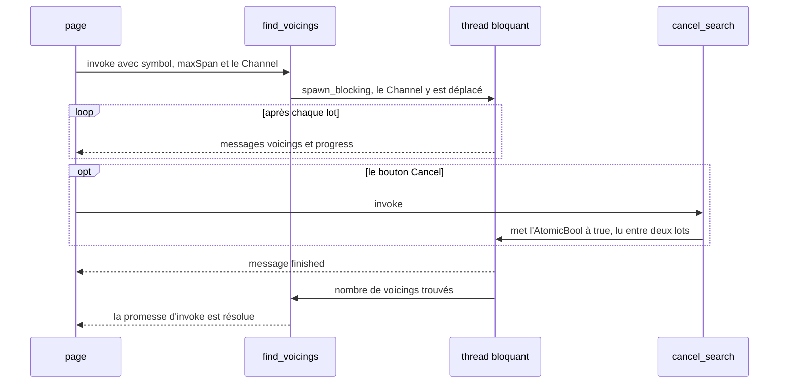

Exemple complet : [`l16-tauri/src-tauri/src/state.rs`](https://github.com/spareilleux/learn/blob/main/code/rust-for-csharp-java/l16-tauri/src-tauri/src/state.rs) et [`ui/main.js`](https://github.com/spareilleux/learn/blob/main/code/rust-for-csharp-java/l16-tauri/ui/main.js).

Les commandes de la leçon 17 étaient des fonctions de leurs arguments. Une vraie application a aussi besoin de données qui vivent entre deux appels, et de messages que Rust envoie sans qu'on les lui demande : une liste qui a changé, une recherche qui avance.

## Ce que vous connaissez déjà

| Besoin | Tauri | .NET | Java | Electron |
|---|---|---|---|---|
| Un objet partagé pour toute l'application | [`Builder::manage`](https://docs.rs/tauri/2.11.5/tauri/struct.Builder.html#method.manage) + [`State<T>`](https://docs.rs/tauri/2.11.5/tauri/struct.State.html) | un singleton de l'[injection de dépendances](https://learn.microsoft.com/dotnet/core/extensions/dependency-injection) | un bean Spring singleton | une variable du processus principal |
| Prévenir toutes les fenêtres qu'il s'est passé quelque chose | [`Emitter::emit`](https://docs.rs/tauri/2.11.5/tauri/trait.Emitter.html#method.emit) + [`listen`](https://v2.tauri.app/reference/javascript/api/namespaceevent/#listen) | [`WeakReferenceMessenger`](https://learn.microsoft.com/dotnet/communitytoolkit/mvvm/messenger) | [`ApplicationEventPublisher`](https://docs.spring.io/spring-framework/docs/current/javadoc-api/org/springframework/context/ApplicationEventPublisher.html) | [`webContents.send`](https://www.electronjs.org/docs/latest/api/web-contents#contentssendchannel-args) |
| Diffuser les résultats d'un appel | [`ipc::Channel<T>`](https://docs.rs/tauri/2.11.5/tauri/ipc/struct.Channel.html) | [`IProgress<T>`](https://learn.microsoft.com/dotnet/api/system.iprogress-1), [`IAsyncEnumerable<T>`](https://learn.microsoft.com/dotnet/api/system.collections.generic.iasyncenumerable-1) | [`Flow.Publisher`](https://docs.oracle.com/en/java/javase/25/docs/api/java.base/java/util/concurrent/Flow.Publisher.html), le `Flux` de Reactor | un [`MessagePort`](https://www.electronjs.org/docs/latest/tutorial/message-ports) |

## L'état géré

L'explorateur garde les accords favoris en mémoire. L'état est un type ordinaire (extrait de [`src-tauri/src/state.rs`, lignes 14-16](https://github.com/spareilleux/learn/blob/373237a/code/rust-for-csharp-java/l16-tauri/src-tauri/src/state.rs#L14-L16)) :

```rust
/// Les symboles des accords favoris, partagés par toutes les fenêtres.
#[derive(Default)]
pub struct Favorites(Mutex<Vec<String>>);
```

Il est enregistré une fois, à la construction de l'application (le `setup` de la leçon 17) :

```rust
builder
    .manage(state::Favorites::default())
    .manage(state::SearchControl::default())
```

et une commande le demande en ajoutant un paramètre `State<'_, Favorites>`, que Tauri remplit au lieu de le lire dans le JSON (extrait de [`src-tauri/src/state.rs`, lignes 24-27](https://github.com/spareilleux/learn/blob/373237a/code/rust-for-csharp-java/l16-tauri/src-tauri/src/state.rs#L24-L27)) :

```rust
#[tauri::command]
pub fn favorites(favorites: State<'_, Favorites>) -> Vec<String> {
    favorites.0.lock().unwrap().clone()
}
```

Quatre règles découlent de son fonctionnement ([gestion de l'état](https://v2.tauri.app/develop/state-management/)) :

- **L'état se retrouve par son type**, comme un service enregistré par son type en .NET. Deux listes de chaînes demandent deux types : `Favorites` et `RecentChords`, pas deux `Mutex<Vec<String>>`. Enregistrer deux fois le même type arrête l'application au démarrage ; l'assertion de `Builder::manage` :

```rust
assert!(
  self.state.set(state),
  "state for type '{type_name}' is already being managed",
);
```

- **Les commandes s'exécutent sur plusieurs threads** (leçon 17), donc l'état doit être `Send + Sync` et tout ce qui est mutable passe derrière un [`Mutex`](https://doc.rust-lang.org/std/sync/struct.Mutex.html), un [`RwLock`](https://doc.rust-lang.org/std/sync/struct.RwLock.html) ou un atomique (leçon 12). Aucun dispatcher ne le cache, pas plus que dans un singleton ASP.NET Core. Tauri enveloppe lui-même l'état dans un `Arc`.
- **Oublier `manage` n'est pas une erreur de compilation.** Le type n'est recherché qu'à l'appel de la commande, et l'appel est rejeté (extrait du test `state_that_was_never_managed_rejects_the_call` de [`src-tauri/tests/ipc.rs`](https://github.com/spareilleux/learn/blob/373237a/code/rust-for-csharp-java/l16-tauri/src-tauri/tests/ipc.rs)) :

```text
recent_chords -> "state not managed for field `recent` on command `recent_chords`. You must call `.manage()` before using this command"
```

  Le guide Tauri, dans sa section sur les types qui ne correspondent pas, dit qu'un mauvais type provoque une panique à l'exécution. Pour une commande, dans Tauri 2.11.5, la promesse se rejette et l'application continue de tourner ; hors des commandes, `Manager::state` panique bien, et `try_state` renvoie une `Option` à la place.
- **Hors d'une commande**, [`Manager::state`](https://docs.rs/tauri/2.11.5/tauri/trait.Manager.html#method.state) ou [`try_state`](https://docs.rs/tauri/2.11.5/tauri/trait.Manager.html#method.try_state) le lit depuis l'`App` ou un `AppHandle`, par exemple dans `setup` ou dans un thread.

### Un `MutexGuard` à travers `.await`

Dans une commande `async`, les règles de la leçon 13 s'appliquent : un [`std::sync::MutexGuard`](https://doc.rust-lang.org/std/sync/struct.MutexGuard.html) n'est pas `Send`, et Tauri a besoin d'une future `Send` pour l'exécuter sur son runtime ([doctest `compile_fail`](https://github.com/spareilleux/learn/blob/373237a/code/rust-for-csharp-java/l16-tauri/src-tauri/src/compile_fail.rs)) :

```rust
use std::sync::Mutex;

async fn save(_list: &[String]) {}

#[tauri::command]
async fn add_favorite(
    favorites: tauri::State<'_, Mutex<Vec<String>>>,
    symbol: String,
) -> Result<(), String> {
    let mut list = favorites.lock().unwrap();
    list.push(symbol);
    save(&list).await;
    Ok(())
}
```

```text
error: future cannot be sent between threads safely
   --> examples\e18_guard_across_await.rs:5:1
    |
  5 | #[tauri::command]
    | ^^^^^^^^^^^^^^^^^ future returned by `add_favorite` is not `Send`
...
    = help: within `impl Future<Output = Result<(), std::string::String>>`, the trait `std::marker::Send` is not implemented for `std::sync::MutexGuard<'_, Vec<std::string::String>>`
note: future is not `Send` as this value is used across an await
   --> examples\e18_guard_across_await.rs:12:17
    |
 10 |     let mut list = favorites.lock().unwrap();
    |         -------- has type `std::sync::MutexGuard<'_, Vec<std::string::String>>` which is not `Send`
 11 |     list.push(symbol);
 12 |     save(&list).await;
    |                 ^^^^^ await occurs here, with `mut list` maybe used later
```

La correction habituelle consiste à copier ce dont on a besoin et à relâcher le verrou avant le `.await`, dans un bloc. Le guide Tauri, citant celui de tokio, garde le `Mutex` standard par défaut et réserve [`tokio::sync::Mutex`](https://docs.rs/tokio/latest/tokio/sync/struct.Mutex.html) à une garde qui doit vraiment vivre au-delà d'un `.await`.

Et comme `State<'_, T>` est un emprunt, une commande `async` qui le prend doit renvoyer un `Result`, la règle vue à la leçon 17 pour `&str` :

```rust
use std::sync::Mutex;

#[tauri::command]
async fn favorites(favorites: tauri::State<'_, Mutex<Vec<String>>>) -> Vec<String> {
    favorites.lock().unwrap().clone()
}
```

```text
error[E0277]: async commands that contain references as inputs must return a `Result`
 --> examples\e18_async_state.rs:4:72
  |
4 | async fn favorites(favorites: tauri::State<'_, Mutex<Vec<String>>>) -> Vec<String> {
  |                                                                        ^^^ the trait `AsyncCommandMustReturnResult` is not implemented for `Vec<std::string::String>`
```

## Événements : Rust prévient la page

Quand un favori est ajouté, chaque fenêtre qui affiche la liste doit se mettre à jour, y compris celles qui n'ont rien demandé. La commande émet un **événement** après avoir modifié l'état (extrait de [`src-tauri/src/state.rs`, lignes 29-49](https://github.com/spareilleux/learn/blob/373237a/code/rust-for-csharp-java/l16-tauri/src-tauri/src/state.rs#L29-L49)) :

```rust
/// Ajoute ou retire un favori, puis prévient toutes les fenêtres avec un événement `favorites-changed`.
#[tauri::command]
pub fn toggle_favorite<R: Runtime>(
    app: AppHandle<R>,
    favorites: State<'_, Favorites>,
    symbol: &str,
) -> Result<Vec<String>, CommandError> {
    let symbol = symbol.parse::<Chord>()?.to_string();
    let snapshot = {
        let mut list = favorites.0.lock().unwrap();
        match list.iter().position(|favorite| *favorite == symbol) {
            Some(index) => {
                list.remove(index);
            }
            None => list.push(symbol),
        }
        list.clone()
    }; // le verrou est relâché ici, avant de parler aux webviews
    app.emit("favorites-changed", &snapshot)?;
    Ok(snapshot)
}
```

- Un paramètre [`AppHandle`](https://docs.rs/tauri/2.11.5/tauri/struct.AppHandle.html), comme `State`, est fourni par Tauri. Il est générique sur le runtime pour que les tests simulés puissent appeler la même commande.
- `emit` envoie à toutes les webviews ; [`emit_to`](https://docs.rs/tauri/2.11.5/tauri/trait.Emitter.html#method.emit_to) vise une fenêtre par son label.
- La charge utile est un instantané pris sous le verrou, puis émis une fois le verrou relâché : ne gardez jamais un verrou pendant un appel vers l'extérieur, la règle que vous connaissez avec `lock` en C# et `synchronized` en Java.
- `?` fonctionne sur `emit` parce que `CommandError` implémente `From<tauri::Error>` (leçon 17).

La page s'abonne une fois, au démarrage, avec [`listen`](https://v2.tauri.app/reference/javascript/api/namespaceevent/#listen) (extrait de [`ui/main.js`, lignes 168-170](https://github.com/spareilleux/learn/blob/373237a/code/rust-for-csharp-java/l16-tauri/ui/main.js#L168-L170)) :

```js
// Chaque fenêtre reçoit favorites-changed, quelle que soit la fenêtre qui a modifié la liste
await listen("favorites-changed", (event) => showFavorites(event.payload));
showFavorites(await invoke("favorites"));
```

et `toggleFavorite` ignore le résultat de la commande : l'événement met la liste à jour, dans cette fenêtre et dans les autres. Ce que la page a reçu, capturé dans la fenêtre :

```text
toggle_favorite returned ["Am"]; listener got {"event":"favorites-changed","id":2,"payload":["Am"]}
```

Le code Rust peut aussi écouter, grâce au trait [`Listener`](https://docs.rs/tauri/2.11.5/tauri/trait.Listener.html) ; c'est ainsi que le test simulé vérifie l'événement sans webview (extrait de [`src-tauri/tests/ipc.rs`, lignes 124-135](https://github.com/spareilleux/learn/blob/373237a/code/rust-for-csharp-java/l16-tauri/src-tauri/tests/ipc.rs#L124-L135)) :

```rust
#[test]
fn toggle_favorite_emits_an_event() {
    let (app, webview) = app();
    let (sender, received) = mpsc::channel();
    app.listen("favorites-changed", move |event| {
        sender.send(event.payload().to_string()).unwrap();
    });
    invoke(&webview, "toggle_favorite", json!({ "symbol": "Bb7" })).unwrap();
    let payload = received.recv_timeout(Duration::from_secs(5)).unwrap();
    println!("favorites-changed payload: {payload}");
    assert_eq!(payload, r#"["Bb7"]"#);
}
```

```text
favorites-changed payload: ["Bb7"]
```

La charge utile doit être `Serialize` **et** `Clone`, car elle peut partir vers plusieurs cibles ; passer une référence, `&snapshot`, satisfait `Clone` sans copier la liste. Un type de charge utile sans `Clone` :

```rust
use tauri::{AppHandle, Emitter};

#[derive(serde::Serialize)]
struct Favorites {
    symbols: Vec<String>,
}

#[tauri::command]
fn announce(app: AppHandle) -> Result<(), String> {
    let payload = Favorites { symbols: vec!["Am".into()] };
    app.emit("favorites-changed", payload).map_err(|e| e.to_string())
}
```

```text
error[E0277]: the trait bound `Favorites: Clone` is not satisfied
   --> examples\e18_emit_not_clone.rs:11:35
    |
 11 |     app.emit("favorites-changed", payload).map_err(|e| e.to_string())
    |         ----                      ^^^^^^^ the trait `Clone` is not implemented for `Favorites`
    |         |
    |         required by a bound introduced by this call
    |
note: required by a bound in `emit`
   --> C:\Users\spare\.cargo\registry\src\index.crates.io-1949cf8c6b5b557f\tauri-2.11.5\src\lib.rs:946:26
    |
946 |   fn emit<S: Serialize + Clone>(&self, event: &str, payload: S) -> Result<()> {
    |                          ^^^^^ required by this bound in `Emitter::emit`
help: consider annotating `Favorites` with `#[derive(Clone)]`
```

Les noms d'événements sont des chaînes, et rien ne vérifie que la page écoute le nom que Rust émet : une faute de frappe passe en silence, comme avec un messenger indexé par chaîne. Le [guide Tauri](https://v2.tauri.app/develop/calling-frontend/) ajoute deux limites : les événements ne sont « not designed for low latency or high throughput situations », et leurs charges utiles sont toujours des chaînes JSON.

## Canaux : un flux pour un appel

La recherche de voicings de l'explorateur essaie 7,5 millions de doigtés et trouve ses résultats en une seconde. La page les veut au fur et à mesure, avec une barre de progression et un bouton *Cancel*. Un événement atteindrait toutes les fenêtres et demanderait un identifiant pour distinguer deux recherches ; un **canal** appartient à un seul appel. La page le crée et le passe en argument (extrait de [`ui/main.js`, lignes 99-128](https://github.com/spareilleux/learn/blob/373237a/code/rust-for-csharp-java/l16-tauri/ui/main.js#L99-L128)) :

```js
const onEvent = new Channel();
onEvent.onmessage = (message) => {
  switch (message.event) {
    case "voicings":
      for (const frets of message.data.frets) {
        if (list.children.length < MAX_LISTED) {
          const item = document.createElement("li");
          item.textContent = frets;
          list.append(item);
        }
      }
      break;
    case "progress":
      $("progress").value = message.data.done / message.data.total;
      break;
    case "finished": {
      const { found, elapsedMs, cancelled } = message.data;
      const shown = Math.min(found, MAX_LISTED);
      status.textContent = `${found} voicings in ${elapsedMs} ms${cancelled ? " (cancelled)" : ""}, ${shown} shown`;
      break;
    }
  }
};

try {
  await invoke("find_voicings", {
    symbol: $("chord-input").value,
    maxSpan: Number($("span-select").value),
    onEvent,
  });
```

La commande le reçoit sous forme de [`Channel<SearchEvent>`](https://docs.rs/tauri/2.11.5/tauri/ipc/struct.Channel.html). Les messages forment un seul enum Rust, sérialisé avec une [étiquette adjacente](https://serde.rs/enum-representations.html#adjacently-tagged) pour que JavaScript puisse faire un `switch` sur `event` (extrait de [`src-tauri/src/state.rs`, lignes 51-72](https://github.com/spareilleux/learn/blob/373237a/code/rust-for-csharp-java/l16-tauri/src-tauri/src/state.rs#L51-L72)) :

```rust
/// Ce que `find_voicings` envoie au frontend, dans l'ordre.
#[derive(Clone, Serialize)]
#[serde(
    tag = "event",
    content = "data",
    rename_all = "camelCase",
    rename_all_fields = "camelCase"
)]
pub enum SearchEvent {
    Voicings {
        frets: Vec<String>,
    },
    Progress {
        done: usize,
        total: usize,
    },
    Finished {
        found: usize,
        elapsed_ms: u128,
        cancelled: bool,
    },
}
```

```rust
/// Cherche tous les voicings d'un accord sur un thread bloquant et diffuse les résultats.
#[tauri::command]
pub async fn find_voicings(
    symbol: String,
    max_span: u8,
    control: State<'_, SearchControl>,
    on_event: Channel<SearchEvent>,
) -> Result<usize, CommandError> {
    let chord: Chord = symbol.parse()?;
    let options = SearchOptions {
        max_span,
        ..SearchOptions::default()
    };
    let cancel = Arc::clone(&control.cancel);
    cancel.store(false, Ordering::Relaxed);

    let found = tauri::async_runtime::spawn_blocking(move || {
        let started = Instant::now();
        let voicings = theory::find_voicings(&chord, &options, &cancel, |progress, batch| {
            if !batch.is_empty() {
                let frets = batch.iter().map(Voicing::to_string).collect();
                // Un envoi n'échoue que si la webview a disparu : plus personne à prévenir
                let _ = on_event.send(SearchEvent::Voicings { frets });
            }
            let _ = on_event.send(SearchEvent::Progress {
                done: progress.done,
                total: progress.total,
            });
        });
        let _ = on_event.send(SearchEvent::Finished {
            found: voicings.len(),
            elapsed_ms: started.elapsed().as_millis(),
            cancelled: cancel.load(Ordering::Relaxed),
        });
        voicings.len()
    })
    .await?;
    Ok(found)
}
```

- Le canal est un paramètre comme un autre, et `Channel` est `Send` : il est déplacé dans la closure de `spawn_blocking`, et la recherche envoie depuis son thread bloquant.
- `theory::find_voicings` ne sait rien de Tauri : elle prend une closure appelée après chaque lot (les positions de frette de la corde de mi grave, 14 en tout), la même forme qu'un `IProgress<T>` passé à une méthode .NET.
- La promesse d'`invoke` se résout quand la commande se termine, après le dernier message.

Les messages reçus par la page pour `Bbm7` avec un écart de 3 frettes, dans un build debug, avec le temps écoulé depuis l'appel (abrégé : les messages entre 379 ms et 1032 ms sont retirés) :

```text
invoke resolved with 16 after 1114 ms, 17 messages
77 ms {"event":"voicings","data":{"frets":["x-1-3-1-2-1","x-1-3-1-2-4","x-1-3-3-2-4","x-x-8-10-9-9"]}}
78 ms {"event":"progress","data":{"done":1,"total":14}}
152 ms {"event":"progress","data":{"done":2,"total":14}}
227 ms {"event":"progress","data":{"done":3,"total":14}}
305 ms {"event":"progress","data":{"done":4,"total":14}}
379 ms {"event":"progress","data":{"done":5,"total":14}}
1032 ms {"event":"progress","data":{"done":13,"total":14}}
1113 ms {"event":"progress","data":{"done":14,"total":14}}
1114 ms {"event":"finished","data":{"found":16,"elapsedMs":1110,"cancelled":false}}
```

Les messages arrivent dans l'ordre, à environ 75 ms d'intervalle, pendant que la recherche tourne : « designed to be fast and deliver ordered data », selon les termes du [guide](https://v2.tauri.app/develop/calling-frontend/#channels).

### Annuler

*Cancel* appelle une autre commande, qui lève un drapeau dans l'état géré (extrait de [`src-tauri/src/state.rs`, lignes 18-22](https://github.com/spareilleux/learn/blob/373237a/code/rust-for-csharp-java/l16-tauri/src-tauri/src/state.rs#L18-L22)) :

```rust
/// Permet à `cancel_search` d'arrêter la recherche lancée par `find_voicings`.
#[derive(Default)]
pub struct SearchControl {
    cancel: Arc<AtomicBool>,
}
```

```rust
#[tauri::command]
pub fn cancel_search(control: State<'_, SearchControl>) {
    control.cancel.store(true, Ordering::Relaxed);
}
```

La recherche consulte l'[`AtomicBool`](https://doc.rust-lang.org/std/sync/atomic/type.AtomicBool.html) entre deux lots : c'est le `CancellationToken` de .NET, ou le `Thread.interrupt` de Java vérifié à la main, sans le soutien des bibliothèques qu'ont l'un et l'autre. L'`Arc` permet au thread bloquant de garder le drapeau, car un `State` ne peut pas sortir de la commande. Une recherche de `C` avec un écart de 4, annulée 300 ms après son début :

```text
cancelled search resolved with 19 after 381 ms
{"event":"progress","data":{"done":5,"total":14}}
{"event":"finished","data":{"found":19,"elapsedMs":378,"cancelled":true}}
```

La recherche s'est arrêtée après son cinquième lot, celui en cours quand le drapeau a été levé, et a renvoyé les 19 voicings trouvés jusque-là. Un drapeau pour toute l'application suffit pour une recherche à la fois ; l'exercice 2 en gère plusieurs.

L'appel complet sous forme de séquence, de l'invoke de la page à la promesse résolue, avec le bouton Cancel en option.



## Événement ou canal ?

| | Événement | Canal |
|---|---|---|
| Destinataires | chaque écouteur, dans chaque fenêtre (ou une cible avec `emit_to`) | l'appel qui l'a créé |
| Créé par | Rust, à tout moment | la page, pour un `invoke` |
| Identifié par | un nom sous forme de chaîne | l'argument lui-même |
| Convient à | « quelque chose a changé » : favoris, réglages, fichier enregistré | « voici la suite » : progression, résultats de recherche, téléchargement |
| Mise en garde du guide | pas pour la faible latence ni le haut débit | conçu pour un flux rapide et ordonné |

## À retenir

- `manage` enregistre une valeur par type ; les commandes la reçoivent avec `State<'_, T>`. L'état mutable demande un `Mutex`, un `RwLock` ou des atomiques, parce que les commandes s'exécutent sur plusieurs threads.
- Un `manage` oublié se découvre à l'exécution, à l'appel de la commande : la promesse se rejette avec `state not managed`.
- Relâchez les verrous avant d'émettre ou d'attendre : un `std::sync::MutexGuard` à travers `.await` ne compile pas dans une commande.
- Les événements diffusent des messages JSON nommés à toutes les fenêtres ; les charges utiles doivent être `Serialize + Clone`, et les noms ne sont pas vérifiés.
- Un canal diffuse des messages ordonnés vers l'appel qui l'a créé ; déplacez-le dans le thread de travail, et annulez avec un `AtomicBool` partagé.

## Exercices

1. Retenez les cinq derniers accords épelés, du plus récent au plus ancien, sans doublons : après `C`, `Am`, `F`, `G`, `Am`, `Dm`, `E7` et un `Hm` invalide, une commande `recent_chords` renvoie `["E7", "Dm", "Am", "G", "F"]`.

<details>
<summary>Solution</summary>

Un nouveau type d'état, pour ne pas entrer en conflit avec `Favorites`, et une commande qui épelle et retient (extrait de [`src-tauri/tests/l18_solutions.rs`, lignes 17-39](https://github.com/spareilleux/learn/blob/373237a/code/rust-for-csharp-java/l16-tauri/src-tauri/tests/l18_solutions.rs#L17-L39)) :

```rust
#[derive(Default)]
struct RecentChords(Mutex<VecDeque<String>>);

const RECENT: usize = 5;

#[tauri::command]
fn spell_and_remember(
    recent: State<'_, RecentChords>,
    symbol: &str,
) -> Result<ChordView, CommandError> {
    let chord: Chord = symbol.parse()?;
    let symbol = chord.to_string();
    let mut list = recent.0.lock().unwrap();
    list.retain(|previous| *previous != symbol);
    list.push_front(symbol);
    list.truncate(RECENT);
    Ok(chord.into())
}

#[tauri::command]
fn recent_chords(recent: State<'_, RecentChords>) -> Vec<String> {
    recent.0.lock().unwrap().iter().cloned().collect()
}
```

Un [`VecDeque`](https://doc.rust-lang.org/std/collections/struct.VecDeque.html) ajoute en tête à moindre coût. `Hm` n'atteint jamais la liste, car `?` retourne avant la prise du verrou. L'enregistrer demande `.manage(RecentChords::default())` ; le test vérifie la liste attendue à travers le runtime simulé.

</details>

2. Avec un seul `SearchControl`, *Cancel* arrête la recherche en cours quelle qu'elle soit, et lancer une deuxième recherche remet à zéro le drapeau de la première. Modifiez l'état pour que chaque recherche ait son propre drapeau et que `cancel_search` prenne l'identifiant de la recherche.

<details>
<summary>Solution</summary>

Une table qui associe un drapeau à chaque identifiant (extrait de [`src-tauri/tests/l18_solutions.rs`, lignes 58-86](https://github.com/spareilleux/learn/blob/373237a/code/rust-for-csharp-java/l16-tauri/src-tauri/tests/l18_solutions.rs#L58-L86)) :

```rust
#[derive(Default)]
struct Searches {
    next_id: AtomicU32,
    running: Mutex<HashMap<u32, Arc<AtomicBool>>>,
}

impl Searches {
    fn start(&self) -> (u32, Arc<AtomicBool>) {
        let id = self.next_id.fetch_add(1, Ordering::Relaxed);
        let flag = Arc::new(AtomicBool::new(false));
        self.running.lock().unwrap().insert(id, Arc::clone(&flag));
        (id, flag)
    }

    fn finish(&self, id: u32) {
        self.running.lock().unwrap().remove(&id);
    }
}

#[tauri::command]
fn cancel_search(searches: State<'_, Searches>, id: u32) -> bool {
    match searches.running.lock().unwrap().get(&id) {
        Some(flag) => {
            flag.store(true, Ordering::Relaxed);
            true
        }
        None => false,
    }
}
```

`find_voicings` appellerait `start` avant `spawn_blocking`, enverrait l'identifiant comme premier message du canal (une variante `Started { id }`) pour que la page sache quoi annuler, et appellerait `finish` à la fin de la recherche, annulée ou non. Le test lance deux recherches, annule la seconde, vérifie que seul son drapeau est levé, et qu'annuler une recherche terminée renvoie `false`.

</details>

3. Pour chaque besoin, choisissez un événement ou un canal, et dites pourquoi : une fenêtre de réglages change le thème de toutes les autres fenêtres ; une commande copie un dossier et signale chaque fichier copié ; le backend remarque qu'un fichier ouvert dans l'application a changé sur le disque.

<details>
<summary>Solution</summary>

- **Thème** : un événement. Toutes les fenêtres doivent réagir, y compris celles qui n'ont rien lancé, et c'est un seul petit message.
- **Copie de dossier** : un canal. La progression appartient à l'appel qui a lancé la copie, arrive dans l'ordre et peut être fréquente ; deux copies simultanées auraient chacune leur canal.
- **Fichier modifié sur le disque** : un événement. Personne n'a appelé de commande, donc il n'y a aucun canal sur lequel envoyer : c'est Rust qui engage la conversation, depuis un thread de surveillance de fichiers qui détient un `AppHandle`.

</details>

## Sources

- [Tauri 2 — Gestion de l'état](https://v2.tauri.app/develop/state-management/)
- [Tauri 2 — Appeler le frontend depuis Rust](https://v2.tauri.app/develop/calling-frontend/) : événements et canaux
- [docs.rs — `Emitter`](https://docs.rs/tauri/2.11.5/tauri/trait.Emitter.html), [`Listener`](https://docs.rs/tauri/2.11.5/tauri/trait.Listener.html), [`ipc::Channel`](https://docs.rs/tauri/2.11.5/tauri/ipc/struct.Channel.html)
- [API JavaScript de Tauri — `event`](https://v2.tauri.app/reference/javascript/api/namespaceevent/) et [`core.Channel`](https://v2.tauri.app/reference/javascript/api/namespacecore/#channelt)
- [serde — Représentations des enums](https://serde.rs/enum-representations.html)
- [tokio — Quel type de mutex utiliser ?](https://docs.rs/tokio/latest/tokio/sync/struct.Mutex.html#which-kind-of-mutex-should-you-use)
