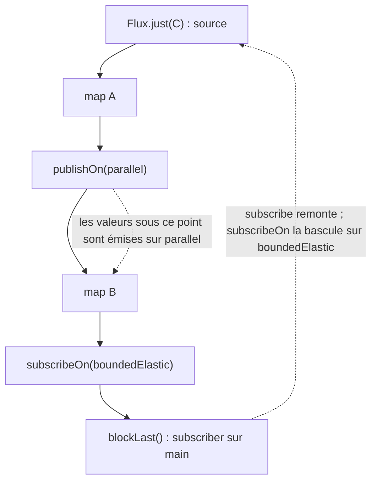

Exemple complet : [`code/spring-cloud-reactor/l03-reactor`](https://github.com/spareilleux/learn/tree/main/code/spring-cloud-reactor/l03-reactor). Ses tests s'exécutent avec BlockHound chargé comme agent Java, comme dans la [leçon 11 du cours Java](../../java-for-csharp/11-testing/), et comparent chaque sortie à [`expected`](https://github.com/spareilleux/learn/tree/main/code/spring-cloud-reactor/l03-reactor/expected). Le côté .NET est [`csharp/l03-polly-channels.cs`](https://github.com/spareilleux/learn/blob/main/code/spring-cloud-reactor/csharp/l03-polly-channels.cs).

## Les threads : personne ne vous déplace sans qu'on le demande

En C#, le thread qui exécute le code après un `await` est choisi pour vous : le contexte de synchronisation s'il y en a un, sinon le pool de threads. Reactor fait l'inverse. Un pipeline s'exécute sur le thread qui y souscrit, et ne passe sur un autre thread que là où un opérateur ou un **scheduler** le décide. C'est pour cette raison que les exemples de la leçon 2 se sont tous exécutés sur `main`.

| Scheduler | Threads | Pour | Équivalent .NET |
|---|---|---|---|
| `Schedulers.immediate()` | le thread courant | tests, valeurs par défaut | exécution synchrone |
| `Schedulers.single()` | un thread réutilisable | travail sensible à l'ordre | un thread dédié avec une file |
| `Schedulers.parallel()` | un par cœur de CPU | travail court et non bloquant | les worker threads du pool de threads |
| `Schedulers.boundedElastic()` | jusqu'à 10 par cœur, créés à la demande, libérés après 60 s d'inactivité | appels bloquants | `Task.Factory.StartNew(..., TaskCreationOptions.LongRunning)` |
| `Schedulers.fromExecutorService(...)` | ceux que vous passez | intégrer un pool existant | un `TaskScheduler` personnalisé |

Les tailles viennent du [guide de référence de Reactor](https://projectreactor.io/docs/core/release/reference/coreFeatures/schedulers.html) : `boundedElastic()` met aussi jusqu'à 100 000 tâches en file d'attente une fois tous ses threads occupés. Deux opérateurs placent un scheduler dans un pipeline :

```java
/** Le nom du thread sans son numéro : parallel-3 et parallel-7 sont le même pool. */
static String thread() {
    return Thread.currentThread().getName().replaceAll("-\\d+$", "");
}

static <T> T step(String name, T value) {
    System.out.println("  " + name + " on " + thread());
    return value;
}

public static void main(String[] args) {
    System.out.println("no scheduler:");
    Flux.just("C").map(root -> step("map", root)).subscribe(root -> step("subscriber", root));

    // publishOn déplace tout ce qui se trouve en dessous vers un autre scheduler, comme ConfigureAwait avec un contexte personnalisé.
    System.out.println("publishOn(parallel):");
    Flux.just("C")
            .map(root -> step("map above publishOn", root))
            .publishOn(Schedulers.parallel())
            .map(root -> step("map below publishOn", root))
            .blockLast();

    // subscribeOn déplace la souscription, donc la source et tout ce qui précède le premier publishOn.
    System.out.println("subscribeOn(boundedElastic):");
    Mono.fromCallable(() -> step("callable", Scale.of("D", "dorian")))
            .map(scale -> step("map", scale))
            .subscribeOn(Schedulers.boundedElastic())
            .block();

    // L'endroit où subscribeOn est écrit n'a pas d'importance ; celui de publishOn, si.
    System.out.println("both, subscribeOn written last:");
    Flux.just("C")
            .map(root -> step("map A", root))
            .publishOn(Schedulers.parallel())
            .map(root -> step("map B", root))
            .subscribeOn(Schedulers.boundedElastic())
            .blockLast();

    // Les opérateurs temporels choisissent un scheduler pour vous : Mono.delay émet sur parallel().
    System.out.println("Mono.delay:");
    Mono.delay(Duration.ofMillis(1)).map(tick -> step("map after delay", tick)).block();
    step("block() returned", "");
}
```

```text
no scheduler:
  map on main
  subscriber on main
publishOn(parallel):
  map above publishOn on main
  map below publishOn on parallel
subscribeOn(boundedElastic):
  callable on boundedElastic
  map on boundedElastic
both, subscribeOn written last:
  map A on boundedElastic
  map B on parallel
Mono.delay:
  map after delay on parallel
  block() returned on main
```

Les numéros de thread sont retirés parce qu'ils dépendent de ce qui s'est exécuté avant. La règle derrière la sortie découle des signaux de la leçon 2 : une souscription **remonte** le pipeline, du subscriber vers la source, et les valeurs **redescendent**.



- **`publishOn`** change le thread des signaux qui le traversent, donc de chaque opérateur situé *en dessous*. Sa position compte, et un pipeline peut en avoir plusieurs.
- **`subscribeOn`** change le thread sur lequel la souscription remonte, donc le thread sur lequel la source commence à émettre. Sa position n'a pas d'importance ; s'il y en a plusieurs, celui qui est le plus proche de la source l'emporte. Placez-le juste après la source, là où les lecteurs le cherchent.
- **Les opérateurs temporels changent de thread en silence.** `Mono.delay`, `Flux.interval`, `timeout` et `delayElements` émettent sur `parallel()` sauf si on leur donne un autre scheduler. Le code qui les suit ne s'exécute plus sur le thread de l'appelant, ce qui est la surprise la plus courante quand un pipeline se comporte soudain différemment dans un test.

`block()` a rendu la main sur `main` parce que bloquer, c'est un thread qui attend un résultat, pas une continuation : `.GetAwaiter().GetResult()` se comporte de la même façon.

## Backpressure

Le `log()` de la leçon 2 montrait un `request(2)`. C'est la **backpressure** (contre-pression) : le subscriber indique combien de valeurs il peut accepter, et un publisher bien élevé n'en envoie jamais davantage.

```java
/** Un subscriber qui demande {@code batch} éléments, puis d'autres seulement si {@code askForMore}. */
static final class Batches<T> extends BaseSubscriber<T> {
    private final int batch;
    private final boolean askForMore;
    private int received;

    Batches(int batch, boolean askForMore) {
        this.batch = batch;
        this.askForMore = askForMore;
    }

    @Override
    protected void hookOnSubscribe(Subscription subscription) {
        request(batch);
    }

    @Override
    protected void hookOnNext(T value) {
        System.out.println("  got " + value);
        received++;
        if (askForMore && received % batch == 0) {
            request(batch);
        }
    }

    @Override
    protected void hookOnError(Throwable error) {
        System.out.println("  error " + error.getClass().getSimpleName() + ": " + error.getMessage());
    }
}
```

`BaseSubscriber` est la classe à étendre quand on doit contrôler la demande à la main. L'exemple l'utilise de cinq façons :

```java
List<String> progression = List.of("Dm7", "G7", "Cmaj7", "A7", "Dm7", "G7");

// Le subscriber tire : la source n'envoie jamais plus que ce qui a été demandé.
System.out.println("a subscriber that requests 2 at a time:");
Flux.fromIterable(progression)
        .doOnRequest(n -> System.out.println("  source asked for " + n))
        .subscribe(new Batches<>(2, true));

// limitRate découpe une grosse demande en lots, et redemande quand 75 % d'un lot est arrivé.
System.out.println("limitRate(10) under an unbounded subscriber, first 25 elements:");
Flux.range(1, 1_000)
        .doOnRequest(n -> System.out.println("  source asked for " + n))
        .limitRate(10)
        .take(25, false)
        .blockLast();

// publishOn garde une file entre deux threads, et la remplit en demandant 256 éléments.
System.out.println("publishOn:");
Flux.range(1, 3)
        .doOnRequest(n -> System.out.println("  source asked for " + n))
        .publishOn(Schedulers.single())
        .blockLast();

// Une source qui ignore la demande a besoin d'une stratégie : mettre en tampon (jusqu'à une taille), abandonner, ou garder la plus récente.
System.out.println("onBackpressureDrop, subscriber requests 3:");
var dropped = new ArrayList<Integer>();
Flux.range(1, 10)
        .onBackpressureDrop(dropped::add)
        .subscribe(new Batches<>(3, false));
System.out.println("  dropped " + dropped);

// L'erreur de débordement attend derrière les éléments en tampon : le subscriber la voit après les avoir consommés.
System.out.println("onBackpressureBuffer(3), subscriber requests 1:");
var slow = new Batches<Integer>(1, false);
Flux.range(1, 10)
        .onBackpressureBuffer(3)
        .subscribe(slow);
System.out.println("  subscriber now requests 10 more");
slow.request(10);
```

```text
a subscriber that requests 2 at a time:
  source asked for 2
  got Dm7
  got G7
  source asked for 2
  got Cmaj7
  got A7
  source asked for 2
  got Dm7
  got G7
  source asked for 2
limitRate(10) under an unbounded subscriber, first 25 elements:
  source asked for 10
  source asked for 8
  source asked for 8
  source asked for 8
publishOn:
  source asked for 256
onBackpressureDrop, subscriber requests 3:
  got 1
  got 2
  got 3
  dropped [4, 5, 6, 7, 8, 9, 10]
onBackpressureBuffer(3), subscriber requests 1:
  got 1
  subscriber now requests 10 more
  got 2
  got 3
  got 4
  error OverflowException: The receiver is overrun by more signals than expected (bounded queue...)
```

- **La demande est un nombre, et elle s'additionne.** Le dernier `source asked for 2` a trouvé la source épuisée, et la séquence s'est donc terminée. `take(25, false)` transmet vers l'amont la demande illimitée du subscriber, c'est pourquoi `limitRate` est visible ; `take(25)` seul limiterait déjà la requête à 25.
- **`limitRate(10)` recharge à 75 %.** Après 10, il a demandé 8 à chaque fois : dès que 8 des 10 avaient été consommés. Un driver de base de données ou un consommateur de messages récupère les données par pages de cette façon.
- **`publishOn` est une file.** Il demande 256 éléments, son prefetch par défaut, pour remplir la file entre le thread de la source et le sien. `flatMap` et `concatMap` ont eux aussi des valeurs de prefetch, c'est pourquoi un aval lent voit quand même une première rafale.
- **Les sources qui ne peuvent pas ralentir ont besoin d'une stratégie.** Une minuterie, une souris, un broker de messages qui pousse sans contrôle de flux : les opérateurs `onBackpressure…` demandent tout vers l'amont et décident quoi faire du surplus. `onBackpressureDrop` a jeté les valeurs de 4 à 10. `onBackpressureBuffer(3)` a gardé une file bornée et signalé une `OverflowException` lorsqu'elle a débordé ; l'erreur a attendu derrière les valeurs en tampon, si bien que le subscriber ne l'a vue qu'après en avoir redemandé. `onBackpressureLatest` ne garde que la valeur la plus récente.

`IAsyncEnumerable` a la backpressure gratuitement, un élément à la fois, parce que le consommateur tire avec `MoveNextAsync`. Le code .NET en mode push l'obtient d'un [channel](https://learn.microsoft.com/dotnet/core/extensions/channels) borné, dont le `BoundedChannelFullMode` joue le rôle des opérateurs `onBackpressure…`. Le côté C# y a trouvé un piège :

```text
bounded channel (3, DropWrite): TryWrite returned true 10 times, reader gets 1, 2, 3
```

Avec `DropWrite`, `TryWrite` signale un succès pour les éléments qu'il abandonne, comme le dit la [documentation de `BoundedChannelFullMode`](https://learn.microsoft.com/dotnet/api/system.threading.channels.boundedchannelfullmode). Le `onBackpressureDrop` de Reactor vous donne au moins un callback avec chaque valeur abandonnée.

## Erreurs et retries

Une exception levée dans un opérateur devient un signal `onError`, et la leçon 2 a montré qu'elle termine la séquence. Les opérateurs d'erreur sont le `try`/`catch` réactif :

```java
/** Un service de gammes qui échoue jusqu'à son troisième appel. */
static Mono<String> flakyLookup(AtomicInteger calls) {
    return Mono.fromCallable(() -> {
        int call = calls.incrementAndGet();
        System.out.println("  call " + call);
        if (call < 3) {
            throw new IllegalStateException("scale service unavailable");
        }
        return "D dorian";
    });
}

public static void main(String[] args) {
    // retry(n) souscrit à nouveau : le Mono est une recette, donc l'appel s'exécute à nouveau lui aussi.
    System.out.println("retry(2):");
    System.out.println("  result: " + flakyLookup(new AtomicInteger()).retry(2).block());

    System.out.println("retry(1):");
    try {
        flakyLookup(new AtomicInteger()).retry(1).block();
    } catch (IllegalStateException e) {
        System.out.println("  block() threw " + e.getMessage());
    }

    // onErrorReturn est un catch qui renvoie une valeur ; onErrorResume bascule vers un autre publisher.
    System.out.println("fallbacks:");
    Mono<String> failing = Mono.error(new IllegalStateException("scale service unavailable"));
    System.out.println("  onErrorReturn: " + failing.onErrorReturn("C ionian").block());
    System.out.println("  onErrorResume: " + failing.onErrorResume(e -> Mono.just("cached: " + e.getMessage())).block());

    // onErrorMap est un catch qui enveloppe ; doOnError se contente de regarder.
    try {
        failing.doOnError(e -> System.out.println("  doOnError saw: " + e.getMessage()))
                .onErrorMap(e -> new RuntimeException("lookup failed", e))
                .block();
    } catch (RuntimeException e) {
        System.out.println("  onErrorMap: " + e.getMessage() + ", caused by " + e.getCause().getMessage());
    }

    // timeout est aussi un signal : ici, un appel de 5 secondes est coupé à 50 ms et remplacé.
    System.out.println("timeout:");
    String answer = Mono.delay(Duration.ofSeconds(5)).map(tick -> "too late")
            .timeout(Duration.ofMillis(50), Mono.just("timed out, default scale"))
            .block();
    System.out.println("  " + answer);
}
```

```text
retry(2):
  call 1
  call 2
  call 3
  result: D dorian
retry(1):
  call 1
  call 2
  block() threw scale service unavailable
fallbacks:
  onErrorReturn: C ionian
  onErrorResume: cached: scale service unavailable
  doOnError saw: scale service unavailable
  onErrorMap: lookup failed, caused by scale service unavailable
timeout:
  timed out, default scale
```

`retry` ne fonctionne que parce que la première règle de la leçon 2 tient : un `Mono` est une recette, donc souscrire à nouveau rappelle le service. Un retry autour de `Mono.just(callService())` rejouerait indéfiniment la même valeur en échec. `block()` a relancé l'`IllegalStateException` d'origine sans l'envelopper, parce qu'elle est non vérifiée ; une exception vérifiée serait revenue enveloppée dans une `ReactiveException`.

Les vrais retries attendent entre les tentatives. [`Retry.backoff`](https://projectreactor.io/docs/core/release/api/reactor/util/retry/Retry.html) est le retry exponentiel de Polly, testé ici en temps virtuel :

```java
@Test
void backoffWaitsLongerEachTime() {
    var calls = new AtomicInteger();
    // Le AddRetry de Polly avec MaxRetryAttempts = 3, Delay = 100 ms, BackoffType = Exponential, UseJitter = false.
    StepVerifier.withVirtualTime(() -> Mono.error(new IllegalStateException("scale service unavailable"))
                    .doOnSubscribe(subscription -> calls.incrementAndGet())
                    .retryWhen(Retry.backoff(3, Duration.ofMillis(100)).jitter(0)))
            .expectSubscription()
            .expectNoEvent(Duration.ofMillis(100 + 200 + 400))
            .consumeErrorWith(error -> Expected.check("retries-exhausted",
                    error.getClass().getName() + ": " + error.getMessage() + "\ncaused by " + error.getCause()
                            + "\nsubscriptions: " + calls.get()))
            .verify();
}
```

```text
reactor.core.Exceptions$RetryExhaustedException: Retries exhausted: 3/3
caused by java.lang.IllegalStateException: scale service unavailable
subscriptions: 4
```

Les retries ont attendu 100, 200 et 400 ms de temps virtuel, puis l'erreur a changé de type : `Retry.backoff` enveloppe le dernier échec dans une `RetryExhaustedException`. Polly n'enveloppe pas. Le côté C#, avec deux retries :

```text
Polly, 2 retries:
  call 1
  retry 1 after 10 ms
  call 2
  retry 2 after 20 ms
  call 3
  result: D dorian
Polly, retries exhausted:
  retry 1 after 10 ms
  retry 2 after 20 ms
  InvalidOperationException: scale service still unavailable
```

| Polly | Reactor |
|---|---|
| `AddRetry`, `MaxRetryAttempts` | `retry(n)`, `retryWhen(Retry.max(n))` |
| `BackoffType.Exponential`, `Delay` | `Retry.backoff(n, firstBackoff)` |
| `UseJitter` | `.jitter(0.5)` par défaut ; `.jitter(0)` le désactive |
| `ShouldHandle = new PredicateBuilder().Handle<T>()` | `.filter(error -> error instanceof T)` |
| `AddTimeout` | `timeout(Duration)` |
| `AddFallback` | `onErrorResume`, `onErrorReturn` |
| la dernière exception est relancée | `RetryExhaustedException` l'enveloppe, sauf si `onRetryExhaustedThrow` en décide autrement |
| `AddCircuitBreaker` | absent de Reactor : Resilience4j, à la leçon 9 |

Le jitter est activé par défaut dans `Retry.backoff` : sans `.jitter(0)`, les attentes varient et un test ne peut pas attendre des durées exactes.

## Le contexte : `AsyncLocal` pour les pipelines

Un identifiant de requête, l'utilisateur courant ou un span de trace voyagent souvent comme contexte ambiant. La [leçon 9 du cours Java](../../java-for-csharp/09-concurrency-and-virtual-threads/) a montré que `ThreadLocal` ne suit pas une tâche sur un autre thread. Dans un pipeline Reactor, qui change de thread à chaque `publishOn`, il ne sert à rien. Le **contexte** de Reactor est une map immuable attachée à la souscription :

```java
static final ThreadLocal<String> CURRENT_USER = new ThreadLocal<>();

/** Lit l'utilisateur dans le contexte du subscriber au moment où on y souscrit. */
static Mono<String> greeting() {
    return Mono.deferContextual(context -> Mono.just("hello " + context.getOrDefault("user", "anonymous")));
}

public static void main(String[] args) {
    // contextWrite s'écrit sous les opérateurs qui le lisent : le contexte remonte avec la souscription.
    System.out.println("context below the reader: " + greeting().contextWrite(Context.of("user", "ada")).block());

    // Écrit au-dessus, il n'atteint que ce qui est au-dessus de lui.
    System.out.println("context above the reader: " + Mono.just("ignored")
            .contextWrite(Context.of("user", "ada"))
            .flatMap(value -> greeting())
            .block());

    // Deux écritures : celle qui est la plus proche du lecteur l'emporte.
    System.out.println("two writes: " + greeting()
            .contextWrite(Context.of("user", "grace"))
            .contextWrite(Context.of("user", "ada"))
            .block());

    // Un ThreadLocal reste sur son thread ; le contexte suit le pipeline sur un autre.
    CURRENT_USER.set("ada");
    try {
        String seen = Mono.just("scale")
                .publishOn(Schedulers.parallel())
                .flatMap(value -> Mono.deferContextual(context ->
                        Mono.just("ThreadLocal=" + CURRENT_USER.get() + ", context=" + context.get("user"))))
                .contextWrite(Context.of("user", "ada"))
                .block();
        System.out.println("after publishOn: " + seen);
    } finally {
        CURRENT_USER.remove();
    }
}
```

```text
context below the reader: hello ada
context above the reader: hello anonymous
two writes: hello grace
after publishOn: ThreadLocal=null, context=ada
```

La direction est la seule surprise. `AsyncLocal` circule d'un appelant vers ce qu'il appelle, de haut en bas dans le code source. Le contexte Reactor circule avec la souscription, du subscriber vers la source, si bien que `contextWrite` se place en **bas** du pipeline, sous les opérateurs qui le lisent ; un framework comme WebFlux l'écrit tout à la fin, là où il souscrit. Une écriture placée au-dessus d'un lecteur lui est invisible, et de deux écritures, la plus proche l'emporte. Le côté C# montre `AsyncLocal` traversant les threads, comme le fait le contexte :

```text
in a new thread: AsyncLocal=ada, ThreadLocal=null
```

Les bibliothèques qui lisent encore des `ThreadLocal`, comme les frameworks de journalisation avec un MDC, ont besoin d'un pont entre les deux mondes : la bibliothèque de [context propagation](https://docs.micrometer.io/context-propagation/reference/) de Micrometer, que la leçon 11 utilisera pour le tracing.

## Les appels bloquants

Un thread `parallel()` qui bloque pendant 20 ms ne peut rien servir d'autre pendant 20 ms, et il n'y en a qu'autant que de cœurs. WebFlux sert chaque requête sur un ensemble tout aussi réduit de threads d'event loop Netty. En bloquer un, c'est la version réactive du sync-over-async en C#, avec le même symptôme : le débit s'effondre sous la charge alors que le CPU est inactif. Reactor refuse le cas le plus visible, un `block()` sur un thread non bloquant :

```java
/** Représente une requête JDBC ou un client HTTP bloquant : 20 ms d'attente. */
static Scale slowLookup(String root, String mode) {
    try {
        Thread.sleep(20);
    } catch (InterruptedException e) {
        Thread.currentThread().interrupt();
        throw new IllegalStateException(e);
    }
    return Scale.of(root, mode);
}

public static void main(String[] args) {
    // block() dans un pipeline qui s'exécute sur parallel() : Reactor refuse d'attendre là.
    try {
        Mono.delay(Duration.ofMillis(1))
                .map(tick -> Mono.fromCallable(() -> slowLookup("D", "dorian")).subscribeOn(Schedulers.boundedElastic()).block())
                .block();
    } catch (IllegalStateException e) {
        System.out.println("nested block(): " + e.getMessage().replaceAll("parallel-\\d+", "parallel-N"));
    }

    // La correction : flatMap vers un publisher à part, souscrit sur boundedElastic(), le scheduler du travail bloquant.
    Scale scale = Mono.delay(Duration.ofMillis(1))
            .flatMap(tick -> Mono.fromCallable(() -> slowLookup("D", "dorian")).subscribeOn(Schedulers.boundedElastic()))
            .block();
    System.out.println("flatMap and boundedElastic: " + scale.notes());
}
```

```text
nested block(): block()/blockFirst()/blockLast() are blocking, which is not supported in thread parallel-N
flatMap and boundedElastic: [D, E, F, G, A, B, C]
```

La correction est le pattern à retenir : envelopper l'appel bloquant dans `Mono.fromCallable`, le souscrire sur `boundedElastic()`, et le raccorder au pipeline avec `flatMap` au lieu de l'attendre.

La vérification de Reactor ne couvre que `block()`, et pas tous les `block()`. [`HiddenBlocking`](https://github.com/spareilleux/learn/blob/main/code/spring-cloud-reactor/l03-reactor/src/main/java/dev/learn/reactor/l03/HiddenBlocking.java) dort directement dans un `map`, puis appelle `block()` sur un `Mono.fromCallable` sans `subscribeOn`, les deux sur un thread `parallel()`. Le test l'exécute dans une nouvelle JVM, d'abord sans BlockHound, puis avec son agent :

```text
without BlockHound:
sleep in map: no error, [E, F, G, A, B, C, D]
nested block() of Mono.fromCallable: no error, ran on parallel
with BlockHound:
sleep in map: reactor.core.Exceptions$ReactiveException: reactor.blockhound.BlockingOperationError: Blocking call! java.lang.Thread.sleepNanos0
nested block() of Mono.fromCallable: reactor.core.Exceptions$ReactiveException: reactor.blockhound.BlockingOperationError: Blocking call! java.lang.Thread.sleepNanos0
```

Le second cas m'a surpris. `block()` sur un `Mono.fromCallable` ne souscrit pas du tout : le `MonoCallable` de Reactor redéfinit `block()` pour appeler directement le callable sur le thread courant, et ce raccourci saute la vérification qui a détecté le premier exemple. [BlockHound](https://github.com/reactor/BlockHound) instrumente plutôt les méthodes bloquantes du JDK : il voit donc les deux, quel que soit le chemin. La leçon 11 du cours Java le met en place, avec l'option `-XX:+AllowRedefinitionToAddDeleteMethods` dont il a encore besoin sur le JDK 25 ; le POM de ce module fait de même, et l'exercice 2 s'appuie dessus.

## Threads virtuels ou réactif ?

Les [threads virtuels](../../java-for-csharp/09-concurrency-and-virtual-threads/) rendent le blocage bon marché, ce qui retire la principale raison d'être de Reactor : ne pas gaspiller de threads pendant l'attente. Les deux se rejoignent dans Reactor lui-même. Avec une propriété système, `boundedElastic()` exécute chaque tâche sur un nouveau thread virtuel ; le test exécute le même programme dans deux JVM :

```java
String where = Mono.fromCallable(() -> {
            Thread thread = Thread.currentThread();
            return thread.getName().replaceAll("-\\d+$", "") + ", virtual=" + thread.isVirtual();
        })
        .subscribeOn(Schedulers.boundedElastic())
        .block();
System.out.println("boundedElastic() ran the call on " + where);
```

```text
default:
boundedElastic() ran the call on boundedElastic, virtual=false
with the property:
boundedElastic() ran the call on loomBoundedElastic, virtual=true
```

La propriété est `reactor.schedulers.defaultBoundedElasticOnVirtualThreads=true`, documentée dans le [guide de référence de Reactor](https://projectreactor.io/docs/core/release/reference/coreFeatures/schedulers.html) pour Java 21 et au-delà. Côté Spring, `spring.threads.virtual.enabled=true` fait traiter chaque requête par le Tomcat de Spring MVC sur un thread virtuel, d'après la [documentation de Spring Boot](https://docs.spring.io/spring-boot/reference/features/spring-application.html#features.spring-application.virtual-threads).

Alors, lequel choisir pour un nouveau service ? Le compromis, tel que je le comprends après ces quatre leçons :

| | Spring MVC sur threads virtuels | WebFlux et Reactor |
|---|---|---|
| Style de code | du Java bloquant ordinaire, comme du C# synchrone | des pipelines d'opérateurs |
| Traces de pile et débogage | ordinaires | fragmentés ; `checkpoint()` et `Hooks.onOperatorDebug()` aident |
| Bibliothèques | toutes, JDBC compris | drivers réactifs uniquement (R2DBC, clients réactifs) ou `boundedElastic()` |
| Backpressure et streaming | à la main | intégrés : `Flux`, `limitRate`, server-sent events |
| Annulation | l'interruption, dont la leçon 9 du cours Java a montré qu'elle se perd facilement | un signal `cancel()` qui atteint la source |
| Composition de nombreux appels concurrents | la concurrence structurée est encore en preview dans Java 25 | `zip`, `merge`, `flatMap` avec une limite de concurrence, `timeout`, `retry` |
| Spring Cloud Gateway | une variante Web MVC existe | l'implémentation d'origine, réactive |

Pour un service CRUD sur une base de données relationnelle, les threads virtuels sont le choix le plus simple. Pour une passerelle, un service qui diffuse en streaming, ou un service qui appelle en éventail beaucoup d'autres services avec des timeouts et des limites, les opérateurs de Reactor justifient leur complexité. C'est aussi le partage dans le monde C#, où `IAsyncEnumerable` et les channels couvrent le streaming et où Rx.NET reste un outil de spécialiste. La comparaison de leur débit sur cette machine est *à vérifier* : je ne l'ai pas mesurée, et la leçon 11 est l'endroit où le faire avec Micrometer.

## À retenir

- Un pipeline s'exécute sur le thread qui souscrit jusqu'à ce que `publishOn`, `subscribeOn` ou un opérateur temporel le déplace. `publishOn` agit sur ce qui est en dessous de lui ; `subscribeOn` agit sur la source, où qu'il soit écrit.
- Utilisez `parallel()` pour le travail court et non bloquant et `boundedElastic()` pour les appels bloquants, enveloppés dans `Mono.fromCallable(...).subscribeOn(boundedElastic())` et raccordés avec `flatMap`.
- La backpressure est un compteur de demande qui remonte vers l'amont. `limitRate` la découpe en pages, `publishOn` précharge 256 éléments, et `onBackpressureBuffer`, `Drop` et `Latest` gèrent les sources qui ne peuvent pas ralentir.
- `retry` souscrit à nouveau : il a donc besoin d'une source paresseuse. `Retry.backoff` ajoute des attentes exponentielles avec jitter activé par défaut, et enveloppe la dernière erreur dans une `RetryExhaustedException`.
- Le contexte Reactor circule du subscriber vers la source : `contextWrite` se place en bas. Il survit aux changements de thread ; `ThreadLocal`, non.
- Reactor refuse certains appels `block()` imbriqués, mais ni un `Thread.sleep` dans un `map` ni `block()` sur `Mono.fromCallable`. Faites tourner BlockHound dans les tests.
- Les threads virtuels font passer le code bloquant à l'échelle ; Reactor vaut la peine pour le streaming, la backpressure et la composition de nombreux appels concurrents.

## Exercices

1. Une recherche peut échouer de deux façons : `IllegalStateException` quand le service est indisponible, ce qui peut réussir plus tard, et `IllegalArgumentException` pour une note inconnue, ce qui ne réussira jamais. Écrivez `resilientLookup(Mono<Scale> lookup)` qui retente le premier cas jusqu'à trois fois avec un backoff exponentiel à partir de 100 ms, et échoue immédiatement sur le second. Testez les deux chemins en comptant les appels.

<details>
<summary>Solution</summary>

```java
static Mono<Scale> resilientLookup(Mono<Scale> lookup) {
    return lookup.retryWhen(Retry.backoff(3, Duration.ofMillis(100))
            .jitter(0)
            .filter(error -> error instanceof IllegalStateException));
}

@Test
void exercise1TransientFailuresAreRetried() {
    var calls = new AtomicInteger();
    StepVerifier.withVirtualTime(() -> resilientLookup(lookupThatFailsTwice(calls)))
            .expectSubscription()
            .expectNoEvent(Duration.ofMillis(300))
            .expectNextMatches(scale -> scale.notes().getFirst().sharpName().equals("A"))
            .verifyComplete();
    assertEquals(3, calls.get());
}

@Test
void exercise1PermanentFailuresAreNot() {
    var calls = new AtomicInteger();
    StepVerifier.create(resilientLookup(Mono.fromCallable(() -> {
                calls.incrementAndGet();
                return Scale.of("H", "minor");
            })))
            .expectErrorMessage("unknown note: H")
            .verify(Duration.ofSeconds(1));
    assertEquals(1, calls.get());
}
```

`filter` est le `ShouldHandle` de Polly : une erreur qui ne correspond pas est transmise telle quelle, sans enveloppe et sans attente. Le premier test réussit au troisième appel après 100 + 200 ms de temps virtuel. `verify(Duration.ofSeconds(1))` dans le second test borne le temps d'attente réel, si bien qu'un bug qui retenterait indéfiniment fait échouer le test au lieu de le bloquer.

</details>

2. Recherchez les gammes majeures de C, G, D, A, E, B, F# et C# avec le `slowLookup` bloquant, au plus quatre à la fois, depuis un pipeline qui s'exécute sur `parallel()`, et renvoyez leurs accords de tonique dans l'ordre de l'entrée. BlockHound est actif dans les tests du module : la solution ne doit pas bloquer de thread `parallel()`.

<details>
<summary>Solution</summary>

```java
static Flux<String> tonics(Flux<String> roots, Function<String, Scale> blockingLookup) {
    return roots
            .publishOn(Schedulers.parallel())
            .flatMapSequential(root -> Mono.fromCallable(() -> blockingLookup.apply(root))
                    .subscribeOn(Schedulers.boundedElastic()), 4)
            .map(scale -> scale.triads().getFirst().symbol());
}
```

`flatMapSequential` souscrit à jusqu'à quatre publishers internes à la fois, son second argument, et réordonne leurs résultats pour correspondre à l'entrée : `flatMap` émettrait dans l'ordre d'achèvement, `concatMap` exécuterait une recherche à la fois. Chaque recherche s'exécute sur `boundedElastic()`, donc BlockHound ne proteste pas. Le test enveloppe `slowLookup` pour compter les appels qui s'exécutent en même temps, et vérifie que le maximum est supérieur à 1 et au plus égal à 4. Il ne mesure pas la durée, ce qui le rendrait instable sur un runner de CI chargé.

</details>

3. Écrivez `handle(String root)`, qui recherche une gamme majeure, passe sur `parallel()`, et renvoie une ligne de journal telle que `[req-42] looked up D#` construite par `logLine(message)`. `logLine` doit lire l'identifiant de requête dans le contexte, et afficher `no-request` quand il n'y en a pas. Où l'identifiant de requête doit-il être écrit ?

<details>
<summary>Solution</summary>

```java
static Mono<String> logLine(String message) {
    return Mono.deferContextual(context -> Mono.just("[" + context.getOrDefault("requestId", "no-request") + "] " + message));
}

static Mono<String> handle(String root) {
    return Mono.fromCallable(() -> Scale.of(root, "major"))
            .publishOn(Schedulers.parallel())
            .flatMap(scale -> logLine("looked up " + scale.root()));
}

@Test
void exercise3RequestIdInTheContext() {
    StepVerifier.create(handle("Eb").contextWrite(Context.of("requestId", "req-42")))
            .expectNext("[req-42] looked up D#")
            .verifyComplete();
    StepVerifier.create(handle("Eb"))
            .expectNext("[no-request] looked up D#")
            .verifyComplete();
}
```

C'est l'appelant qui l'écrit, sous `handle(...)`, exactement là où WebFlux le placerait pour une requête : `handle` ne prend pas l'identifiant en paramètre et ne sait même pas qu'il existe, comme avec `AsyncLocal`. Le `publishOn` au milieu ne le perd pas. `Eb` s'affiche `D#` parce que le module `music` nomme les notes avec des dièses.

</details>

## Sources

- Guide de référence de Reactor : [threads et schedulers](https://projectreactor.io/docs/core/release/reference/coreFeatures/schedulers.html), [gérer les erreurs](https://projectreactor.io/docs/core/release/reference/coreFeatures/error-handling.html), [ajouter un contexte à une séquence réactive](https://projectreactor.io/docs/core/release/reference/advancedFeatures/context.html), [déboguer Reactor](https://projectreactor.io/docs/core/release/reference/debugging.html)
- Javadoc de [`Retry`](https://projectreactor.io/docs/core/release/api/reactor/util/retry/Retry.html) et de [`BaseSubscriber`](https://projectreactor.io/docs/core/release/api/reactor/core/publisher/BaseSubscriber.html) ; [BlockHound](https://github.com/reactor/BlockHound)
- [Spring Boot : threads virtuels](https://docs.spring.io/spring-boot/reference/features/spring-application.html#features.spring-application.virtual-threads), [JEP 444 — Virtual Threads](https://openjdk.org/jeps/444)
- .NET : [les channels](https://learn.microsoft.com/dotnet/core/extensions/channels), [`BoundedChannelFullMode`](https://learn.microsoft.com/dotnet/api/system.threading.channels.boundedchannelfullmode), [stratégie de retry de Polly](https://www.pollydocs.org/strategies/retry.html), [`AsyncLocal<T>`](https://learn.microsoft.com/dotnet/api/system.threading.asynclocal-1)
