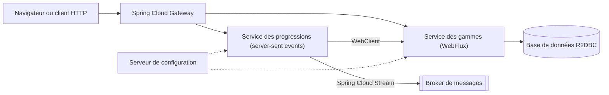

:::note[Versions étudiées]
[Spring Boot](https://docs.spring.io/spring-boot/) **4.1.1** avec [Spring Framework](https://docs.spring.io/spring-framework/reference/) 7.0.9, [Project Reactor](https://projectreactor.io/docs/core/release/reference/) 3.8.7 et le release train [Spring Cloud](https://spring.io/projects/spring-cloud) **2025.1.3** (« Oakwood »), sur Java **25**. Ce sont les versions que [start.spring.io](https://start.spring.io/) proposait par défaut le 2026-09-14. Elles sont comparées à ASP.NET Core sur .NET **10**. Chaque exemple se trouve dans [`code/spring-cloud-reactor`](https://github.com/spareilleux/learn/tree/main/code/spring-cloud-reactor) : [`spring-cloud-reactor-examples.yml`](https://github.com/spareilleux/learn/blob/main/.github/workflows/spring-cloud-reactor-examples.yml) exécute ses tests sous Windows, Linux et macOS, compare chaque sortie citée dans les leçons et exécute le côté C# de chaque comparaison.
:::

## Pourquoi j'apprends ça

Le [cours Java](../java-for-csharp/) m'a appris le langage. Pourtant, le code Java que je rencontre vraiment est rarement du Java pur : c'est un service Spring Boot, souvent réactif, derrière une passerelle Spring Cloud. Ses annotations font le travail que `Program.cs` fait explicitement dans ASP.NET Core, et ses `Mono` et `Flux` ressemblent à `Task` et `IAsyncEnumerable` sans se comporter comme eux.

Je veux lire et écrire ces services avec la même assurance qu'une application ASP.NET Core : savoir d'où vient chaque bean, prédire sur quel thread s'exécute un pipeline, et distinguer un vrai choix de conception d'une simple habitude.

## À qui s'adresse ce cours

Vous êtes un développeur C# expérimenté. Vous connaissez ASP.NET Core, son injection de dépendances, `IOptions`, `IHostedService`, les health checks, `HttpClient`, `IAsyncEnumerable`, et probablement [Polly](https://www.pollydocs.org/) et [YARP](https://learn.microsoft.com/aspnet/core/fundamentals/servers/yarp/getting-started). Vous avez suivi [Java pour développeurs C#](../java-for-csharp/), ou vous êtes à l'aise avec Java 25, Maven et JUnit. Ce cours vous renvoie aux leçons de ce cours-là au lieu de les répéter : la [leçon 9](../java-for-csharp/09-concurrency-and-virtual-threads/) pour les threads virtuels, la [leçon 10](../java-for-csharp/10-maven-and-gradle-in-depth/) pour Maven, la [leçon 11](../java-for-csharp/11-testing/) pour JUnit, Mockito et BlockHound.

## L'exemple fil rouge

Les leçons construisent de petits services autour de la théorie musicale : un service de gammes qui renvoie les notes et les accords d'un mode, un flux de progressions, un client de grilles d'accords. Le domaine est un module Java ordinaire, [`music`](https://github.com/spareilleux/learn/tree/main/code/spring-cloud-reactor/music), sans Spring ni Reactor. À la fin du cours, les pièces s'assemblent ainsi :

Les leçons 1 à 4 construisent les deux premières boîtes de droite ; les leçons suivantes ajoutent les autres. Tout tourne sur `localhost`, démarré par les tests, sans Docker.

## À la fin de ce cours, je saurai

- créer une application Spring Boot et expliquer d'où viennent chacun de ses beans, de ses propriétés et de ses endpoints ;
- transposer l'injection de dépendances, la configuration, les options et les health checks d'ASP.NET Core vers ceux de Spring ;
- écrire, tester et déboguer des pipelines Reactor, et dire sur quel thread s'exécute chaque étape ;
- choisir entre Spring MVC sur threads virtuels et WebFlux pour un service donné ;
- construire des API HTTP et des clients réactifs avec WebFlux et `WebClient` ;
- placer devant ces services une passerelle, une configuration centralisée, la découverte de services et la résilience avec Spring Cloud ;
- observer et tester un ensemble de services Spring comme je le ferais pour un ensemble de services ASP.NET Core.

## Plan

| # | Leçon | Vous connaissez déjà |
|---|---|---|
| 1 | [Spring Boot vu depuis ASP.NET Core](01-spring-boot-from-aspnet-core/) | `Program.cs`, `IServiceCollection`, `appsettings.json`, `IOptions`, health checks |
| 2 | [Reactor : `Mono` et `Flux`](02-reactor-mono-and-flux/) | `Task`, `IAsyncEnumerable`, LINQ, Rx.NET |
| 3 | [Reactor sous le capot](03-reactor-under-the-hood/) | le pool de threads, `ConfigureAwait`, les channels, Polly, `AsyncLocal` |
| 4 | [WebFlux](04-webflux/) | minimal APIs, `HttpClient`, server-sent events |
| 5 | [Accès réactif aux données avec R2DBC et Spring Data](05-r2dbc-and-spring-data/) | Entity Framework Core, `IAsyncEnumerable` depuis un `DbContext` |
| 6 | [Spring Cloud Gateway](06-spring-cloud-gateway/) | YARP |
| 7 | Configuration centralisée avec Spring Cloud Config | fournisseurs de configuration, Azure App Configuration |
| 8 | Découverte de services et répartition de charge côté client | découverte de services de .NET Aspire, `IHttpClientFactory` |
| 9 | Résilience avec Resilience4j et Spring Cloud Circuit Breaker | Polly, `Microsoft.Extensions.Http.Resilience` |
| 10 | Messagerie avec Spring Cloud Stream | MassTransit, clients Azure Service Bus |
| 11 | Observabilité avec Micrometer | OpenTelemetry pour .NET, `dotnet-counters` |
| 12 | Tester un ensemble de services Spring | `WebApplicationFactory`, tests d'intégration |

[Journal](journal/) : ce que j'ai essayé, ce qui m'a surpris, ce qu'il me reste à vérifier.

## Ressources

- [Documentation de référence de Spring Boot](https://docs.spring.io/spring-boot/reference/) et le [guide de migration vers Spring Boot 4.0](https://github.com/spring-projects/spring-boot/wiki/Spring-Boot-4.0-Migration-Guide)
- [Référence de Spring Framework](https://docs.spring.io/spring-framework/reference/) : le conteneur IoC, Web MVC et WebFlux
- [Guide de référence de Reactor 3](https://projectreactor.io/docs/core/release/reference/) et la [Javadoc de `Flux`](https://projectreactor.io/docs/core/release/api/reactor/core/publisher/Flux.html), dont les marble diagrams valent la lecture
- [Spring Cloud](https://spring.io/projects/spring-cloud) : release trains et projets
- [Spécification Reactive Streams](https://github.com/reactive-streams/reactive-streams-jvm/blob/a625d3aba756e9842ad1291a5b73f5db280b6168/README.md), les quatre interfaces sous Reactor
- Côté .NET : [les fondamentaux d'ASP.NET Core](https://learn.microsoft.com/aspnet/core/fundamentals/), [Reactive Extensions pour .NET](https://github.com/dotnet/reactive)
